# FlexRay 总线深度详解：从协议原理到控制器 IP、驱动实现与 MCAL 配置

> 本文面向车载网络、底盘域与动力域底层软件工程师，系统讲解 FlexRay 2.1 协议的设计哲学、拓扑、通信周期、时间基准、启动同步、帧结构，并在此基础上深入到**芯片模块（FlexRay 通信控制器 IP）内部架构**、**寄存器级驱动实现**与 **AUTOSAR MCAL（Fr / FrIf / FrSM）配置落地**三大工程层面。即便 FlexRay 正被车载以太网 TSN 逐步替代，其时间触发（Time-Triggered）思想仍是 TSN 时间感知整形（IEEE 802.1Qbv）的理论鼻祖，理解它等于理解了"确定性通信"的本源。
>
> 笔者写这篇文章的动机很直接：市面上讲 FlexRay 协议原理的资料不少，但从"协议条款"一路讲到"控制器 IP 里到底有哪几个计数器、寄存器怎么摆、驱动怎么写、MCAL 怎么配"的完整链路极为稀缺。而真正卡住工程师的，恰恰是这条链路的中段。

---

## 目录导览

- 第一至第六章：协议原理层（背景、拓扑、通信周期、时间基准、启动同步、帧结构）
- 第七章：**芯片模块设计**——FlexRay 控制器 IP 内部架构与寄存器位域
- 第八章：**驱动代码实现**——寄存器级 C 驱动全流程
- 第九章：**MCAL 配置说明**——AUTOSAR Fr/FrIf/FrSM 与工具链
- 第十至第十四章：工程层（调度设计、物理层与容错、应用、调试坑、面试题）

---

## 一、背景：为什么需要 FlexRay

### 1.1 事件触发网络的先天天花板

在 FlexRay 出现之前，车内主力网络是 CAN（Controller Area Network）与 LIN（Local Interconnect Network）。CAN 采用 CSMA/CR（载波侦听多路访问/冲突仲裁）机制，属于典型的**事件触发（Event-Triggered）**网络：节点有数据要发就主动上总线，靠标识符（ID）的逐位仲裁决定谁先占用总线。这种设计在车身、动力等"尽力而为"的场合非常高效，但它有一个无法回避的缺陷——**最坏延迟不可精确预知**。

原因很简单：当总线负载升高、多个高优先级报文同时争抢时，某一帧究竟要等多久才能发出，取决于"此刻别人在发什么、还要发多久"。即便优先级最高的报文，最坏情况下也要等所有比它更高优先级且正在排队的报文发完。在负载波动剧烈的底盘域，这种不确定性会被放大。

笔者在早年做过一次实测：一条负载 65% 的 500 kbps CAN 总线，某个中优先级报文的实测延迟分布，P50 只有 0.4 ms，P99 是 2.1 ms，但用响应时间分析（RTA）算出来的理论最坏值高达 11 ms。这个 11 ms 在车身域完全可以接受，但如果它承载的是制动指令，它就是不可接受的。**确定性的价值不在于"平均快"，而在于"最坏值可被证明"**——这是安全认证的刚需，因为 ISO 26262 要求的是可论证的最坏情况，而不是统计上的良好表现。

LIN 更不必说，它是单主多从的低成本低速总线（典型 19.2 kbps），专为车窗、座椅、雨刮等舒适性执行器服务，完全没有实时性保障能力，自然无法承载安全关键（Safety-Critical）信号。

### 1.2 线控系统把"确定性"变成刚需

把视角拉到 2000 年代初的车载网络演进。彼时汽车行业开始探索 **X-by-Wire（线控）**技术：用电子信号取代机械/液压连接，典型如 Steer-by-Wire（线控转向）、Brake-by-Wire（线控制动）、Drive-by-Wire（线控驱动）。这些系统有一个共同特征：

> 方向盘转一点，车轮必须在可被严格计算的时限内（通常是亚毫秒到几毫秒）做出响应；而且这个时限在**任何总线负载、任何故障场景下都必须成立**。

如果用 CAN，转向指令报文在最坏情况下可能要等总线清空才能上链路——对于"方向盘动一下车轮必须动"的系统，这种不确定性是致命的。换句话说，线控系统需要的是**可计算的最坏延迟（Bounded Latency）**，而不是"平均很快"。

更进一步，线控系统消除了机械备份，意味着**通信链路本身成为了安全链的一环**。机械转向柱不会"丢包"，但总线会。因此 FlexRay 从第一天起就把"冗余"写进了架构，而不是作为可选特性。

### 1.3 FlexRay 的设计纲领

FlexRay 由 FlexRay 联盟（成员涵盖整车厂、Tier-1 与芯片供应商）自 2000 年前后推动，协议以 **FlexRay 2.1 修订版（Rev. A / Rev. B）** 最为业界广泛采用。它的设计纲领可以浓缩为一句话：

> **每个关键报文在最坏情况下"几点到"，是算得出来的。**

为达成这一目标，FlexRay 放弃事件触发，改用**时间触发（Time-Triggered）**范式，并用 **TDMA（Time Division Multiple Access，时分多址）** 把时间切成固定时隙，每个节点在属于自己的时隙里独家发言，物理上绝不冲突。同时它把带宽从 CAN 的 1 Mbps 提升到**单通道最高 10 Mbps**，并引入**双通道 A/B 冗余**以满足 ASIL D 高安全等级。

这里有一个思维转换值得单独强调：在 CAN 里，"总线空闲"是一种可利用的资源，谁抢到谁用；在 FlexRay 里，"时间"是一种被预先分配掉的资源，你没有被分到的时刻，即使总线物理上空着，你也不能发。**FlexRay 用带宽利用率换取了确定性**——静态段里没有数据的时隙照样要空转（发空帧或纯静默），这在 CAN 工程师看来是"浪费"，但恰恰是确定性的代价与来源。

### 1.4 与 CAN/LIN 的定位差异

下面这张对比表是理解三者定位的基础。注意 FlexRay 并非要"消灭"CAN/LIN，而是在同一辆车上形成分层：LIN 管舒适、CAN 管通用、FlexRay 管安全关键的高速确定通信。

| 维度 | LIN | CAN（含 CAN FD） | FlexRay 2.1 |
|------|-----|------------------|-------------|
| 触发方式 | 主从轮询（事件/调度） | 事件触发（CSMA/CR 仲裁） | 时间触发（TDMA + FTDMA） |
| 拓扑 | 单主多从总线 | 多主总线 | 总线 / 星型 / 混合，双通道 |
| 典型速率 | 1–20 kbps | 125 kbps–1 Mbps（FD 可达 5–8 Mbps） | 最高 10 Mbps / 通道 |
| 确定性 | 弱（主调度表确定，但非硬实时） | 弱（仲裁竞争，最坏延迟不可精确计算） | 强（静态段 TDMA，最坏延迟可解析推导） |
| 单帧最大负载 | 8 字节 | 8 字节（FD 64 字节） | 254 字节 |
| 冗余能力 | 无 | 无（靠应用层冗余） | 双通道硬件冗余 A/B |
| 时间同步 | 主节点同步头 | 无（需 AUTOSAR 时间同步协议叠加） | 协议内建分布式容错同步 |
| 越界发送防护 | 无 | 无 | Bus Guardian（可选硬件门禁） |
| 成本/复杂度 | 极低 | 低 | 高 |
| 典型应用 | 车窗/座椅/雨刮 | 动力/车身/底盘通用 | 线控转向/线控制动/主动悬架 |

---

## 二、拓扑结构：总线、星型与混合，双通道冗余

### 2.1 三种物理拓扑

FlexRay 支持三种拓扑，工程上可组合使用：

- **总线型（Bus / Linear Topology）**：所有节点挂在同一对差分线上，像 CAN 一样。成本低、布线简单，但节点数、线缆总长度受信号完整性约束，且任一处断线会影响整段。
- **星型（Star Topology）**：通过**有源星型耦合器（Active Star Coupler）**把每个节点以独立分支连接。任一分支短路/开路只影响本分支，其余节点不受影响，故障隔离性最好；代价是必须供电给星型耦合器、布线成本上升。
- **混合型（Hybrid / Mixed Topology）**：总线与星型在同一通道内混合，兼顾成本与局部隔离。

需要强调的是，上述拓扑是针对**单个通道（Channel A 或 Channel B）**而言的。FlexRay 是**双通道**架构，两个通道各自可以独立选择拓扑——这在工程上非常有用：主通道 A 可以用星型保证故障隔离，备份通道 B 用总线型降低成本。

有源星型耦合器还有一个容易被忽视的作用：它具备**分支隔离能力**。当某个分支出现持续的电气故障（比如收发器被击穿导致持续拉低总线），星型耦合器可以检测到该分支异常并主动将其断开，从而保护整个通道。这在纯总线型拓扑里是做不到的——一个坏节点就能拖垮整条线。

### 2.2 双通道 A/B 与两种冗余语义

FlexRay 真正的安全价值来自双通道。每个节点通常有两个独立的收发器，分别连到 Channel A 与 Channel B。双通道带来两种冗余思路：

1. **通道冗余（Channel Redundancy）**：同一份数据同时发到 A、B 两个通道，接收端"谁先到、谁有效就采用"。一路通道物理故障（如线缆被割断、收发器损坏）时，另一路仍能通信，关键帧不丢。
2. **介质冗余（Media Redundancy）**：更广义地，两个通道走不同的物理走线（不同的线束、不同的路由路径），避免"同一处事故同时毁掉两路"，从而把共因失效（Common Cause Failure）概率降到最低。

除冗余外，双通道还有第三种用法常被忽略：**带宽扩展模式**。如果系统不需要冗余，可以让 A、B 通道传输不同的帧集合，等效于把总带宽翻倍到 20 Mbps。这在带宽紧张但安全等级要求不高的场景（如高数据量的传感器汇聚）偶有使用。但笔者建议：一旦选用了 FlexRay，通常意味着系统对安全性有要求，此时把双通道用作带宽扩展是"捡了芝麻丢西瓜"。

星型耦合器在双通道场景下通常成对出现（每个通道一个星型耦合器），进一步把"单点故障"限定在最小范围。

下面用一张图说明典型混合拓扑与双通道冗余接线关系：

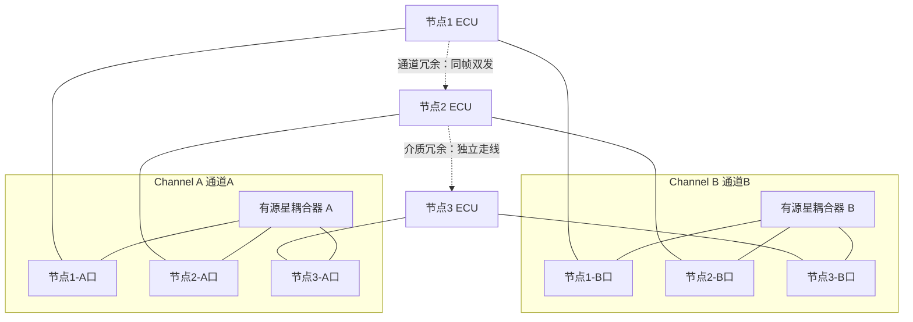

### 2.3 拓扑如何选

笔者的经验法则：安全关键且节点分散的域（如底盘域跨前/后桥）优先星型或混合，以获得故障隔离；低成本、节点集中的子网络可用总线型。无论如何，双通道的两条线在整车布线时必须**物理分离**，否则冗余形同虚设。

笔者见过一个反面案例：某平台确实做了 A/B 双通道，硬件冗余设计完全合规，但整车线束设计时把 A、B 两对差分线扎在同一根波纹管里，从前舱一路走到后桥。结果台架碰撞测试中，波纹管被挤压变形，A、B 两路同时失效——冗余在共因失效面前彻底归零。这个教训值得所有做冗余设计的工程师铭记：**冗余的有效性由"最弱的共享环节"决定**，共享的线束、共享的连接器、共享的电源、共享的时钟源，任何一个共享点都会成为冗余的漏洞。

---

## 三、通信周期结构：静态段、动态段、符号窗与 NIT

FlexRay 的全部通信都组织在**通信周期（Communication Cycle）**里。一个周期被划分为四个连续的时间区段，整体结构如下：

```mermaid
gantt
    title FlexRay 通信周期 TDMA静态段 加 FTDMA动态段
    dateFormat X
    axisFormat %s
    section 静态段确定性
    节点A 时隙 : 0, 10
    节点B 时隙 : 10, 20
    节点C 时隙 : 20, 30
    节点D 时隙 : 30, 40
    section 动态段灵活
    诊断事件 minislot : 40, 70
    section 收尾
    符号窗口 : 70, 80
    NIT 同步 : 80, 100
```

### 3.1 静态段（Static Segment）—— TDMA 的确定性核心

静态段是 FlexRay 的灵魂。它被切成若干个**静态时隙（Static Slot）**，每个时隙编号对应一个 Frame ID（从 1 开始，最多 2047）。在静态段里，**TDMA 规则是硬性的**：第 N 号时隙在周期里固定出现在固定位置，只有被分配到该时隙的节点可以发送，且发送内容（Frame ID）也是固定的。

静态段的确定性来自三点：

1. **独占性**：任一静态时隙在任一周期内只有唯一合法发送者（按调度表），物理上不会冲突。
2. **位置固定**：时隙在周期内的起止位置由全局时基（macrotick）精确界定，全网一致。
3. **可解析的最坏延迟**：某帧的最坏延迟 = 从"本周期起点"到"该帧时隙发出并完成"的时间，再叠加接收端处理，完全可由调度参数推导，无需估计。

因此，**所有安全关键的控制帧（转向角、制动压力、悬架指令）必须放在静态段**。这给了 FlexRay 相比 CAN 的"最大杀器"：最坏延迟可计算。

还有一个协议细节值得展开：**静态段的所有时隙必须等长**。这是 FlexRay 2.1 的硬性约束（由 `gdStaticSlot` 单一参数定义），不能像某些人想象的那样"给大帧配长时隙、给小帧配短时隙"。这意味着时隙长度必须按**全网最长的静态帧**来定，短帧会浪费时隙内的剩余时间。这一约束简化了硬件时隙计数器的实现（只需一个固定步长的比较器），但也是带宽利用率的主要损失来源。工程上的补偿手段是**把多个小信号打包进一个大帧**，而不是拆成多个小帧占多个时隙。

另一个关键概念是**空帧（Null Frame）**。如果某个节点在自己的时隙里暂时没有新数据，它有两种选择：发一个 NFI 置位的空帧（帧头照常，载荷区填零），或者干脆不发（时隙静默）。绝大多数工程实现选择发空帧，原因有二：一是空帧仍然携带帧头，可以维持接收端的时隙节奏感知与 Cycle Count 校验；二是如果该帧同时是同步帧，那么它必须发送——同步帧一旦缺席，全网时钟同步就会受影响。

### 3.2 动态段（Dynamic Segment）—— FTDMA 补灵活性

纯 TDMA 有一个老问题：如果某个时隙在这个周期没有数据要发，这段时间就空转浪费，带宽利用率低。为兼顾灵活性，FlexRay 在静态段之后安排**动态段**，采用 **FTDMA（Flexible TDMA，灵活时分多址）**。

动态段被切成大量**微时隙（Minislot）**。节点在动态段里按优先级（Frame ID 越小优先级越高）仲裁发送事件型、变长、诊断类报文：动态段内维护一个全局递增的 **slot counter**，每经过一个 minislot 就加一；只有当 slot counter 等于某节点配置的动态 Frame ID、且该节点确有动态帧要发时，才占用从当前 minislot 起的一段长度（按帧长向上取整到 minislot 整数倍）；若没有，则该 minislot 被快速跳过，slot counter 立刻推进到下一个。这样就用极小的动态开销承载了"非实时但要传"的数据。

这里有一个非常反直觉但极其重要的推论：**动态段里 Frame ID 越大的帧，越可能发不出去**。因为动态段总长度是固定的（`gNumberOfMinislots` 个 minislot），如果前面的低 ID 帧都发了长帧，把 minislot 消耗殆尽，后面的高 ID 帧就只能等下一个周期。协议为此定义了 `pLatestTx` 参数——节点会计算"从当前 minislot 开始发这一帧，能不能在动态段结束前发完"，如果不能，就直接放弃本周期发送。这就是动态段"不保证实时"的具体体现。

笔者在实践中的一条硬规则：**动态段永远不要承载有截止期要求的信号**。哪怕它的截止期宽松到 100 ms，也不要——因为在最坏情况下（总线繁忙 + 你的 ID 很大），它可能连续多个周期发不出去，而这种最坏情况恰恰会在系统压力最大时出现。有截止期要求的信号一律进静态段，即使为此多占一个时隙。

### 3.3 符号窗口（Symbol Window）

符号窗口是一段很短的预留时间，用于传输**媒体符号（Symbol）**。FlexRay 定义了三类符号：

- **WUS（Wakeup Symbol，唤醒符号）**：用于把处于低功耗/睡眠的节点唤醒。严格说，唤醒是由 WUP（Wakeup Pattern，唤醒模式，由多个 WUS 组成的序列）完成的，且它发生在通信启动之前，不在符号窗内。
- **CAS（Collision Avoidance Symbol，冲突避免符号）**：冷启动过程中避免多个冷启动节点同时发言造成冲突。CAS 同样发生在启动阶段。
- **MTS（Media Access Test Symbol，介质访问测试符号）**：这才是符号窗的真正常客。MTS 由节点在符号窗内发送，用于测试 Bus Guardian 的调度是否正常工作——如果 Bus Guardian 认为当前不该放行，MTS 就发不出去，从而暴露出配置不一致。

符号窗口在简单网络中可以配置为 0（不使用），但在使用 Bus Guardian 的高安全系统里，符号窗是验证守护逻辑的必要通道。

### 3.4 网络空闲时间（NIT, Network Idle Time）

NIT 是周期末尾的一段"空闲"时间，表面上看没有应用报文传输，但它承担着**时钟同步的关键职责**。在 NIT 内，节点执行时钟同步算法（偏移校正与速率校正），把自己的本地时基收敛到全局时基。NIT 的存在是 FlexRay "时间能长期对齐"的根本保障。

具体地，NIT 内会发生三件事：

1. **偏移校正值的计算与施加**：节点用本周期收集到的同步帧偏差数据，通过容错中点算法（FTM）算出偏移校正量，并在 NIT 内通过"拉长或缩短 NIT 的实际微节拍数"来施加这个校正。这一点很巧妙——校正不是通过跳变时间实现的，而是通过悄悄改变 NIT 这段"无通信时间"的长度实现的，因此不会破坏任何时隙边界。
2. **速率校正值的计算**：速率校正每两个周期（一个偶数周期 + 一个奇数周期，即一个"双周期"）计算一次，在偶数周期的 NIT 内施加。
3. **周期计数器翻转与状态机推进**：Cycle Count 加一（到 63 后回 0），协议状态机做周期级的检查（如同步帧数量是否达标）。

**NIT 的长度必须大于最大可能的偏移校正量**——否则校正施加不完，同步就会持续劣化。这是配置时的一条硬约束。

### 3.5 四段结构汇总表

| 区段 | 多址方式 | 主要承载 | 长度参数 | 确定性 | 可否为 0 |
|------|----------|----------|----------|--------|----------|
| 静态段 Static | TDMA 固定时隙 | 安全关键控制帧、同步帧 | `gNumberOfStaticSlots` × `gdStaticSlot` | 强（硬实时） | 否（至少 2 个同步时隙） |
| 动态段 Dynamic | FTDMA 微时隙 | 事件/诊断/变长数据 | `gNumberOfMinislots` × `gdMinislot` | 弱（尽力） | 可 |
| 符号窗 Symbol | 符号传输 | MTS（守护验证） | `gdSymbolWindow` | 不适用 | 可 |
| NIT | 同步收敛 | 时钟同步补偿施加 | `gdNIT` | 不适用 | 否（必须容纳最大校正量） |

---

## 四、宏节拍与微节拍：两层时间基准

FlexRay 的时间不是直接用"纳秒"这种物理单位描述，而是分两层抽象，这是它跨芯片平台保持调度表可移植的关键。

### 4.1 微节拍（Microtick）

**Microtick（微节拍）** 是最底层的时间粒度，由节点本地时钟（晶振）分频产生。每个节点的微节拍真实周期由其自身晶振决定，不同芯片、不同温度下的晶振频率会有偏差——这是物理世界的现实。

微节拍是**节点局部的、不可被网络感知的**。协议规定微节拍时长必须落在一个合理区间（典型 12.5 ns ~ 50 ns），以保证时间分辨率足够。速率校正与偏移校正的施加，最终都体现为"这个宏节拍里多塞或少塞几个微节拍"——微节拍是校正的最小操作单位。

### 4.2 宏节拍（Macrotick）

**Macrotick（宏节拍，简称 MT）** 才是全网统一调度使用的最小时间单位。它由微节拍按一个固定比例折算而来，满足两个约束：

1. **macrotick 必须是 microtick 的整数倍**（即 `pMicroPerMacroNom` 是整数）；
2. **全网 macrotick 折算出的真实时间长度必须一致**（`gdMacrotick`，典型 1 µs）。

由此带来一个极其重要的工程结论：

> 只要两个节点的 macrotick 真实时长定义一致，即便它们的晶振频率不同，时隙边界也能对齐。因此 FlexRay 的调度表（第几槽、槽多长、周期多长）在更换芯片平台时**无需重画**，这是它对比纯物理时序网络的一大优势。

举个具体例子：节点甲用 80 MHz 晶振，微节拍 = 12.5 ns，那么 1 µs 的宏节拍 = 80 个微节拍；节点乙用 40 MHz 晶振，微节拍 = 25 ns，1 µs 的宏节拍 = 40 个微节拍。两者的 `pMicroPerMacroNom` 完全不同（80 vs 40），但它们看到的"1 个宏节拍"在物理世界里是同样长的 1 µs。于是同一份"第 5 个时隙从第 400 个宏节拍开始"的调度表，在两个节点上执行的结果是时间对齐的。**这就是两层时间抽象的全部价值：把晶振差异封装在节点内部，向网络暴露统一的时间刻度。**

### 4.3 关键时序参数

下面列出 FlexRay 2.1 中最常用、也最容易配错的一组时序参数（名称沿用协议规范习惯前缀 `gd`/`g`/`p`，其中 `g` 为集群全局参数、`p` 为节点局部参数）：

| 参数（规范名） | 作用域 | 含义 | 单位 / 说明 |
|------|------|------|-------------|
| `pdMicrotick` | 节点 | 微节拍真实时长 | 由晶振决定，如 12.5 / 25 / 50 ns |
| `pMicroPerMacroNom` | 节点 | 一个宏节拍标称含多少微节拍 | 整数，节点相关 |
| `gdMacrotick` | 集群 | 宏节拍真实时长 | 全网一致，典型 1 µs |
| `gMacroPerCycle` | 集群 | 每通信周期含多少宏节拍 | 决定周期总长 |
| `gNumberOfStaticSlots` | 集群 | 静态段时隙总数 | 2–1023 |
| `gdStaticSlot` | 集群 | 单个静态时隙长度 | macrotick，全部等长 |
| `gPayloadLengthStatic` | 集群 | 静态帧载荷长度 | 以 2 字节字为单位，全网统一 |
| `gNumberOfMinislots` | 集群 | 动态段微时隙数 | 0–7986 |
| `gdMinislot` | 集群 | 单个动态微时隙长度 | macrotick |
| `gdSymbolWindow` | 集群 | 符号窗口长度 | macrotick，0–142 |
| `gdNIT` | 集群 | 网络空闲时间长度 | macrotick |
| `gdActionPointOffset` | 集群 | 静态段发送动作点相对时隙起点的偏移 | macrotick，补偿收发器延迟 |
| `gdMinislotActionPointOffset` | 集群 | 动态段动作点偏移 | macrotick |
| `gdTSSTransmitter` | 集群 | 发送起始序列长度 | 位时间 |
| `gdSampleClockPeriod` | 集群 | 采样时钟周期 | 与比特率相关 |
| `gdBit` | 集群 | 一个位时间 | 10 Mbps 时为 100 ns |
| `pOffsetCorrectionOut` | 节点 | 允许的最大偏移校正量 | microtick |
| `pRateCorrectionOut` | 节点 | 允许的最大速率校正量 | microtick |
| `gClusterDriftDamping` | 集群 | 集群漂移阻尼 | microtick，防止校正震荡 |
| `gColdStartAttempts` | 集群 | 冷启动最大尝试次数 | 2–31 |
| `gMaxWithoutClockCorrectionPassive` | 集群 | 无有效校正进入 Passive 的周期数 | 1–15 |
| `gMaxWithoutClockCorrectionFatal` | 集群 | 无有效校正进入 Halt 的周期数 | 1–15 |

这些参数共同决定了一个通信周期的总长度：

```
gMacroPerCycle = gNumberOfStaticSlots × gdStaticSlot
               + gNumberOfMinislots  × gdMinislot
               + gdSymbolWindow
               + gdNIT

周期真实时长 = gMacroPerCycle × gdMacrotick
```

例如，若 `gdMacrotick = 1 µs`、`gMacroPerCycle = 5000`，则一个通信周期 = 5 ms。这种"参数化周期"正是 FlexRay 自适应不同带宽/实时性需求的方式。

### 4.4 抖动预算（Jitter Budget）

即便有时基同步，节点的本地时钟仍有残余偏差，表现为**发送时隙边界的抖动（Jitter）**。设计静态时隙时必须为抖动预留余量：

```
gdStaticSlot ≥ gdActionPointOffset
             + 帧传输时间（TSS + FSS + 帧头 + 载荷 + CRC + FES）
             + 通道空闲检测时间
             + 传播延迟
             + 精度余量（同步精度 δ）
```

其中"精度余量"就是抖动预算，它由集群的时钟同步精度决定。协议中用 `gdMaxPropagationDelay`（最大传播延迟）与集群精度参数 `gdMaxInitializationError` 等共同约束。工程上通常按经验取 2~4 个 macrotick 作为余量。

否则帧发到一半时隙就结束了，会破坏 TDMA 独占性——更糟的是，这种破坏在常温下可能测不出来，只在 -40 ℃ 或 +125 ℃ 时暴露，因为晶振漂移在极端温度下最大。**笔者的经验：抖动预算必须按晶振数据手册的全温度范围频差（通常 ±50 ppm ~ ±100 ppm）来算，而不是按常温实测值。**

---

## 五、节点启动与同步：冷启动、整合与时钟同步算法

FlexRay 集群不是"上电即通信"，而是要经过一套严谨的**启动与同步状态机**。理解这部分，才能解释"为什么 FlexRay 网络上电后要先安静几毫秒才出数据"。

### 5.1 POC 状态机（Protocol Operation Control）

FlexRay 节点在其通信控制器内维护一个协议状态机，称为 **POC（Protocol Operation Control）**。典型状态（按 FlexRay 2.1 术语）包括：

- **DEFAULT_CONFIG**：上电复位后的初始状态。
- **CONFIG**：配置状态，此时才允许写入时序参数寄存器。**这是驱动开发的关键约束——绝大多数配置寄存器只在 CONFIG 状态下可写。**
- **READY**：配置完成、等待启动指令。
- **WAKEUP**：发送/接收唤醒模式，把睡眠节点拉起。
- **STARTUP**：启动状态，内含冷启动（Coldstart Listen / Coldstart Collision Resolution / Coldstart Consistency Check）与整合（Initialize Schedule / Integration Consistency Check）等子状态。
- **NORMAL_ACTIVE**：正常主动收发，节点已完全同步。
- **NORMAL_PASSIVE**：降级状态，仅接收不发送（时钟同步质量下降但未致命）。
- **HALT**：致命错误或主动停止，退出通信。

下面用流程图展示启动与同步的主干逻辑：

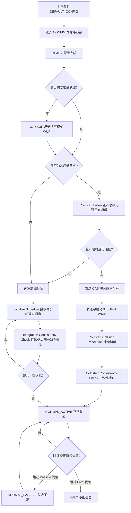

### 5.2 冷启动（Cold Start）

**冷启动节点（Coldstart Node）** 是集群里被配置为"有权发起启动"的特殊节点（`pKeySlotUsedForStartup = TRUE`）。一个健康的 FlexRay 网络应当配置**至少 2 个、推荐 3 个候选冷启动节点**，避免单点失效——若唯一的冷启动节点故障，整网将无法启动。

协议对冷启动流程有严格定义，笔者把它拆成五步：

1. **Coldstart Listen（冷启动监听）**：节点先安静地听总线 `gdColdstartListen` 时长。如果听到了有效的通信（同步帧），说明集群已经起来了，它就转为整合路径，不再发起冷启动。这一步防止了"网络已在运行，新上电节点却强行重启全网"的灾难。
2. **发送 CAS（冲突避免符号）**：监听超时确认总线确实空闲后，节点发送 CAS。CAS 是一个长低电平脉冲，任何正在监听的其他冷启动节点看到 CAS 都会退出自己的冷启动尝试，转为整合。这是**冷启动仲裁的核心机制**。
3. **发送冷启动帧**：发送 CAS 的节点成为"leading coldstart node"，它在自己的关键时隙（key slot）里连续发送 SUF=1、SYN=1 的启动帧，建立全局时基。
4. **Coldstart Collision Resolution（冲突消解）**：如果两个节点几乎同时发了 CAS（时间差小于检测窗），会产生冲突。协议规定：leading node 在接下来的 4 个周期里监听是否有其他冷启动帧，若发现冲突则退出并重来，尝试次数受 `gColdStartAttempts` 限制。
5. **Coldstart Consistency Check（一致性检查）**：至少要有第二个冷启动节点整合进来并开始发送自己的同步帧，leading node 才认为集群建立成功。**这是一条重要规则：单个节点无法独自建立 FlexRay 集群，至少需要两个同步节点。** 这个设计是为了防止"一个坏节点自说自话地建立了一个错误的时基"。

### 5.3 整合（Integration）

普通节点上电后先进入**整合（Integration）** 过程：

1. **Initialize Schedule**：被动监听网络，收到第一个有效的同步帧后，从帧头的 Frame ID 和 Cycle Count 推断出"现在是第几周期的第几时隙"，据此初始化本地的周期计数器与时隙计数器。
2. **Integration Consistency Check**：初始化调度后，节点继续监听若干周期，验证"我推断出的时间表和实际收到的帧是否一一对应"。如果连续正确接收达到阈值（协议要求至少在两个连续的双周期里都收到足够的同步帧），才认定"我确实加入了一个健康的集群"。
3. **切换到 NORMAL_ACTIVE**：此时节点才开始按调度表主动发送自己的静态时隙。

整合过程的时长通常是几个到十几个通信周期。以 5 ms 周期计算，整合耗时约 20~80 ms。这就解释了工程现象："FlexRay 网络上电后要先安静几十毫秒才出数据"——那段时间节点在做冷启动仲裁和整合验证。

### 5.4 时钟同步算法：FTM 容错中点

时钟同步是 FlexRay 长期稳定运行的根基。算法核心是**偏移校正（Offset Correction）** 与**速率校正（Rate Correction）**，而计算这两个校正量所用的统计方法叫 **FTM（Fault-Tolerant Midpoint，容错中点算法）**。

**FTM 的工作方式**（这是 FlexRay 同步算法最精妙的部分）：

1. 节点在一个周期内测量所有收到的同步帧的"期望到达时刻"与"实际到达时刻"之差，得到一组偏差值。
2. 把这组偏差值**排序**。
3. 根据同步帧数量 k，**丢弃最大的 j 个和最小的 j 个**（j 由 k 决定：k ≤ 2 时 j=0；3 ≤ k ≤ 7 时 j=1；k > 7 时 j=2）。
4. 取剩余值中的**最大值与最小值的算术平均**（即"中点"），作为校正量。

为什么要这么设计？因为它对**拜占庭故障**具有天然免疫：一个疯掉的节点发出严重错误的同步帧，其偏差值必然落在排序序列的极端位置，会被步骤 3 丢弃。丢弃 j 个极值意味着可以容忍 j 个恶意/故障的同步源。而取"中点"而非"均值"，是为了避免多个轻微偏差的累加把结果拉偏。这是**分布式容错时钟同步的教科书级实现**。

**速率校正**与**偏移校正**的分工：

- **速率校正（Rate Correction）**：对比"上一个双周期开始时的偏差"与"本双周期开始时的偏差"，其差值反映了本地晶振与集群平均速率的频率差。校正量施加到 `pMicroPerMacroNom` 上，使得后续每个宏节拍包含的微节拍数被微调，从而消除频率累积误差。速率校正每个双周期（偶数周期）计算并施加一次。
- **偏移校正（Offset Correction）**：直接消除当前的相位差，通过在 NIT 内增减微节拍实现。偏移校正每个奇数周期计算，在紧随其后的 NIT 内施加。

两者的关系可以类比钟表：速率校正是"调整钟摆长度让走时快慢正确"，偏移校正是"直接拨动指针对准时刻"。只做偏移不做速率，会导致每周期都要拨一次且拨的量越来越大；只做速率不做偏移，则初始相位差永远消不掉。

下面用时序图展示一个典型的同步交互：

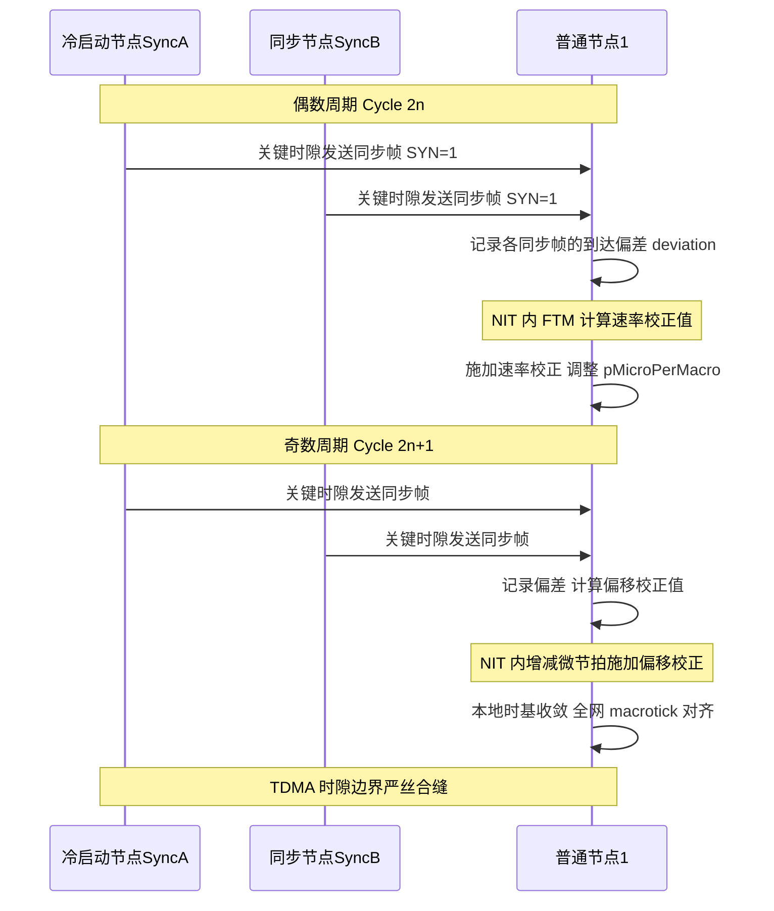

### 5.5 同步质量监控

节点会持续监控同步质量，用两个计数器控制降级：

- 若某周期内**有效同步帧数量不足**（少于 2 个）或**校正量超出 `pOffsetCorrectionOut` / `pRateCorrectionOut`**，则该周期判定为"无有效校正"。
- 连续无有效校正周期数超过 `gMaxWithoutClockCorrectionPassive`，节点降级到 **NORMAL_PASSIVE**：停止发送（避免自己的错误时基污染网络），但继续接收并尝试重新同步。
- 继续恶化，超过 `gMaxWithoutClockCorrectionFatal`，节点进入 **HALT**，彻底退出通信，需要软件干预重启。

这套"两级降级"设计体现了功能安全的核心思想：**故障时优先进入安全状态（不发送 = 不污染），而不是继续带病工作。**

---

## 六、帧结构：从帧头到帧尾逐字段拆解

FlexRay 一帧由**帧头（Header，40 位）+ 有效载荷（Payload，0–254 字节）+ 帧尾（Trailer，24 位 CRC）** 三部分构成。理解每个字段，是做帧级调试与协议分析的前提。

### 6.1 帧头（Header Segment，40 bit）

帧头包含若干关键字段（按位域顺序）：

- **保留位（Reserved，1 位）**：置 0。
- **Payload Preamble Indicator（PPI，1 位）**：指示有效载荷前是否带前缀。在静态段，PPI=1 表示载荷前 12 字节是**网络管理向量（NM Vector）**；在动态段，PPI=1 表示载荷前 2 字节是**报文 ID（Message ID）**，用于在同一 Frame ID 下复用多种报文。
- **Null Frame Indicator（NFI，1 位）**：注意这一位是**反逻辑**——NFI=0 表示这是空帧（载荷无效），NFI=1 表示正常帧。这个反逻辑经常坑到初学者。
- **Sync Frame Indicator（SYN，1 位）**：指示本帧参与时钟同步。只有配置了 `pKeySlotUsedForSync` 的节点，才能在其关键时隙发送 SYN=1 的帧。**每个节点最多只能发送一个同步帧**，且必须在静态段。
- **Startup Frame Indicator（SUF，1 位）**：指示本帧为冷启动帧。协议规定 SUF=1 时 SYN 必须也为 1（启动帧必然是同步帧）。
- **Frame ID（帧标识符，11 位）**：取值 1–2047。在静态段，Frame ID 直接决定该帧占用的时隙号；在动态段，Frame ID 决定动态仲裁优先级（越小越优先）。
- **Payload Length（有效载荷长度，7 位）**：单位是**16 位字**，取值 0–127，对应 0–254 字节。
- **Header CRC（帧头校验，11 位）**：使用生成多项式 `x^11 + x^9 + x^8 + x^7 + x^2 + 1`，保护 SYN、SUF、Frame ID、Payload Length 四个字段。**注意 Header CRC 通常由上位工具（如 FIBEX 导入时）离线计算好后写入控制器配置，而不是硬件实时算的**——因为它保护的字段在运行期是恒定的。这是驱动开发的一个常见困惑点。
- **Cycle Count（周期计数，6 位）**：取值 0–63，用于多周期调度与全局同步。

### 6.2 有效载荷（Payload Segment）

承载 0–254 字节的应用数据。静态段所有帧的载荷长度必须相同（`gPayloadLengthStatic`）；动态段的载荷长度可变，由帧头的 Payload Length 字段动态指示。

FlexRay 的大负载能力使其单帧即可传输长数组（如电机三相电流、悬架多通道状态），减少帧数、降低协议开销。以 254 字节载荷计算，协议开销（5 字节帧头 + 3 字节 CRC + TSS/FSS/BSS/FES 编码开销）占比不到 10%，而 CAN 传 8 字节数据要用掉 47 位以上的协议位，开销超过 40%。

### 6.3 帧尾（Trailer / Frame CRC）与位编码

帧尾是 **24 位（3 字节）的帧 CRC**，生成多项式为 `x^24 + x^22 + x^20 + x^19 + x^18 + x^16 + x^14 + x^13 + x^11 + x^10 + x^8 + x^7 + x^6 + x^3 + x + 1`，海明距离为 6，对整个帧（头 + 载荷）做强检错。相比 CAN 的 15 位 CRC，FlexRay 的 24 位 CRC 提供更强的大规模数据检错能力。

**位编码层**也必须提及，因为它直接影响时隙长度计算：

- **TSS（Transmission Start Sequence）**：发送起始序列，一段连续低电平，长度 `gdTSSTransmitter`（3–15 位），用于让星型耦合器和收发器"醒来"并稳定。
- **FSS（Frame Start Sequence）**：1 位高电平，标记帧正式开始。
- **BSS（Byte Start Sequence）**：**每个字节前都插入 2 位（1 高 1 低）**！这是 FlexRay 位编码最重要的开销来源——每 8 位数据要多传 2 位，等于 25% 的编码开销。BSS 的作用是给接收端提供持续的边沿，用于位同步（FlexRay 没有 CAN 那样的位填充机制，靠 BSS 保证边沿密度）。
- **FES（Frame End Sequence）**：2 位（1 低 1 高），标记帧结束。

因此实际帧传输时间的计算是：

```
帧总位数 = gdTSSTransmitter + 1(FSS)
         + (5 + payloadBytes + 3) × 10   /* 每字节 8 位数据 + 2 位 BSS */
         + 2(FES)

帧传输时间 = 帧总位数 × gdBit
```

以 10 Mbps（`gdBit` = 100 ns）、载荷 32 字节、TSS = 5 位为例：
帧总位数 = 5 + 1 + (5 + 32 + 3) × 10 + 2 = 408 位，传输时间 = 40.8 µs。

**这个 ×10 的系数（而非 ×8）是初学者算时隙长度时最常犯的错误**，会导致算出的时隙长度偏小 20%，进而在实车上出现帧被截断。

### 6.4 帧结构图解

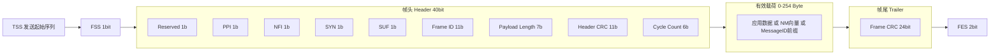

---

## 七、芯片模块设计：FlexRay 通信控制器 IP 内部架构

这一章是笔者最想展开的部分。前六章讲的是"协议规定了什么"，这一章讲的是"硅片里用什么电路实现它"。理解 IP 内部结构，对于驱动开发、性能调优、故障定位都有决定性帮助——很多让人抓狂的"玄学问题"，一旦知道内部是双缓冲还是单缓冲、是同步域还是异步域，答案立刻清晰。

本章描述的是一个**通用 FlexRay 控制器 IP 架构**，其结构与业界主流实现（如广泛授权的 E-Ray 类 IP 核）的组织逻辑一致。具体寄存器地址与位域布局请以目标芯片手册为准，本文的位域布局为**示意性设计**，用于说明设计逻辑而非照搬。

### 7.1 IP 的职责边界

FlexRay 控制器 IP 位于 MCU 内部，向上通过 AHB/AXI 从机接口挂在系统总线上供 CPU 访问，向下通过 TxD/RxD/TxEN 数字信号连接外部 FlexRay 收发器（Transceiver，如 TJA1080 类器件），收发器再驱动差分总线 BP/BM。

职责划分很清晰：

| 层次 | 实现位置 | 职责 |
|------|---------|------|
| 应用/信号 | CPU 软件（COM/RTE） | 信号打包解包 |
| 帧调度 | CPU 软件（FrIf） | 作业调度、周期同步任务 |
| 帧收发/缓冲 | **控制器 IP - Message Handler** | 消息 RAM 管理、缓冲搬运 |
| 时隙/周期计时 | **控制器 IP - GTU** | 宏微节拍、时隙计数、时钟同步 |
| 帧编解码/CRC | **控制器 IP - CODEC** | 位编码、CRC 计算校验 |
| 电平驱动 | 外部收发器 | 数字↔差分转换、总线故障检测 |
| 越界防护 | Bus Guardian（内置或外置） | 时隙授权门禁 |

### 7.2 顶层架构框图

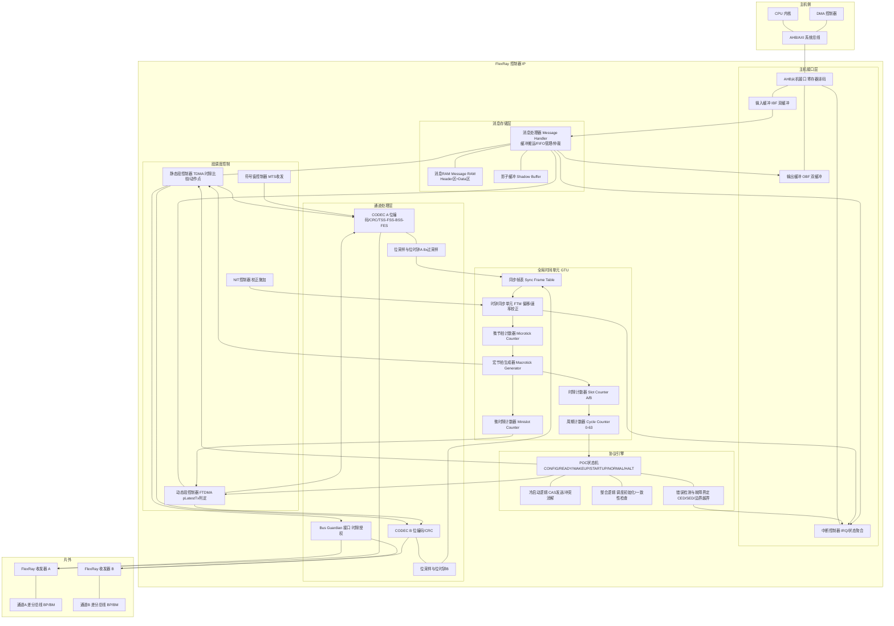

### 7.3 时钟域与复位域

一个 FlexRay 控制器 IP 内部至少存在两个时钟域，这是驱动开发时必须理解的硬件事实：

| 时钟域 | 典型频率 | 覆盖模块 | 说明 |
|--------|---------|---------|------|
| `hclk`（主机时钟） | 与系统总线同频，如 100~200 MHz | AHB 从机接口、IBF/OBF、寄存器阵列、中断聚合 | CPU 访问域，频率可变（DVFS） |
| `fclk`（协议时钟） | 40 / 80 MHz（严格约束） | GTU、POC、CODEC、Message Handler | **必须由高精度晶振提供，不能用 PLL 抖动大的时钟源** |
| `sclk`（采样时钟） | `fclk` 的整数分频 | 位采样单元 | 通常为比特率的 8 倍（8× 过采样） |

**关键设计约束**：协议时钟 `fclk` 的频率精度直接决定 microtick 精度，进而决定同步质量。协议要求节点晶振精度优于 ±1500 ppm 才能维持同步，但工程上通常要求 ±100 ppm 以内以留足余量。**这就是为什么 FlexRay 节点普遍要求外接高精度晶振而非使用内部 RC 振荡器。**

跨时钟域的数据传递通过 IBF/OBF 双缓冲结构与握手同步器完成。这带来一个重要的软件可见效应：**CPU 写入输入缓冲后，数据并非立刻生效，而是需要经过跨域同步再由 Message Handler 搬入消息 RAM**。这个过程有延迟，且期间 IBF 处于 BUSY 状态。驱动必须轮询 BUSY 位或等待中断，否则连续写入会丢数据——这是笔者见过最多的 FlexRay 驱动 bug 之一。

复位域上，IP 通常有两级复位：`hreset_n`（主机域复位，复位寄存器阵列）与 `freset_n`（协议域复位，复位状态机与计数器）。上电时序要求协议域复位释放不早于时钟稳定，否则状态机可能进入未定义状态。

### 7.4 GTU：全局时间单元

GTU（Global Time Unit）是整个 IP 的心脏，它把物理时钟一层层折算成协议时间。

**微节拍计数器（Microtick Counter）**：直接对 `fclk` 分频计数，每个 `fclk` 周期（或 N 分频后）产生一个微节拍脉冲。这是最底层的时间源。

**宏节拍生成器（Macrotick Generator）**：核心是一个可编程模数计数器。它对微节拍计数，计到 `pMicroPerMacroNom + rateCorrection` 时输出一个宏节拍脉冲并清零。注意这里加上了 `rateCorrection`——**速率校正就是通过动态修改这个模数实现的**。若本地时钟偏快，`rateCorrection` 为正，每个宏节拍需要更多微节拍，等效于把本地时间"拉慢"。

偏移校正的施加机制略有不同：它不改模数，而是在 NIT 期间**一次性增加或减少若干个微节拍**。硬件实现上，NIT 控制器会向宏节拍生成器注入一个 `offsetCorrection` 值，使 NIT 这段时间的实际微节拍总数偏离标称值，从而把相位拉齐。这也解释了为什么 `gdNIT` 必须大于最大偏移校正量——否则"缩短 NIT"会把 NIT 压成负数，物理上不可能。

**时隙计数器（Slot Counter）**：注意 IP 内部为通道 A 和通道 B 各维护一个独立的时隙计数器（`vSlotCounter[A]` / `vSlotCounter[B]`）。为什么要两个？因为在动态段，两个通道上的帧长度可能不同，导致 minislot 消耗速度不同，两个通道的 slot counter 会临时分叉。在静态段两者始终相同。这是一个容易被忽略的细节，但在读状态寄存器时会看到 SCV（Slot Counter Value）分 A/B 两个字段。

**周期计数器（Cycle Counter）**：6 位，0~63 循环。每个通信周期结束（NIT 结束）时加一。它驱动周期复用（Cycle Multiplexing）判定与偶/奇周期的同步计算调度。

**时钟同步单元（Sync Unit）**：内含同步帧表（Sync Frame Table）、偏差测量寄存器组、FTM 排序网络与校正值计算逻辑。同步帧表记录本周期内每个同步帧的 Frame ID、通道、测量偏差值。FTM 排序网络是一个硬件排序器（通常为双调排序网络或插入排序状态机），对偏差值排序后丢弃极值并取中点。

### 7.5 静态段控制器（TDMA 时隙分配）

静态段控制器的逻辑其实相当简洁，这正是 TDMA 的美妙之处：

```
每个宏节拍脉冲：
  macrotickInSlot++
  if (macrotickInSlot == gdActionPointOffset):
      → 到达动作点，若本时隙有待发帧则触发 CODEC 开始发送
  if (macrotickInSlot == gdStaticSlot):
      macrotickInSlot = 0
      vSlotCounter++
      查表：vSlotCounter 是否匹配某个已配置的发送消息缓冲？
      if (匹配 && 该缓冲已就绪 && Cycle 过滤通过):
          预取该缓冲数据到影子缓冲，准备下个动作点发送
      if (vSlotCounter > gNumberOfStaticSlots):
          → 静态段结束，切换到动态段控制器
```

**动作点（Action Point）** 的存在很关键。时隙起点不等于发送起点，中间隔着 `gdActionPointOffset` 个宏节拍。这段间隔用于：吸收上一帧的传播延迟余波、给收发器留出通道空闲检测时间、吸收节点间的残余时钟偏差。发送方在动作点开始发，接收方在动作点前后一个窗口内期待帧到来——如果帧在窗口外到达，会被判定为**时隙边界违规（Boundary Violation）**。

**时隙匹配的硬件实现**：消息 RAM 的 Header 区里每个缓冲都存有 Frame ID、通道过滤、Cycle 过滤等字段。硬件不会线性遍历所有缓冲（那太慢），而是在配置时由 Message Handler 建立一个**按时隙号索引的映射表**，或采用 CAM（内容寻址存储器）实现单周期匹配。这就是为什么配置消息缓冲时必须先进入 CONFIG 状态——硬件要重建这张映射表。

### 7.6 动态段控制器（FTDMA 微时隙）

动态段的逻辑比静态段复杂，核心是"变长占用 + 提前放弃"判定：

```
每个宏节拍脉冲（动态段内）：
  macrotickInMinislot++
  if (无帧正在传输 && macrotickInMinislot == gdMinislot):
      macrotickInMinislot = 0
      vSlotCounter++
      if (vSlotCounter 匹配某动态发送缓冲 && 缓冲就绪):
          计算本帧需要的 minislot 数 nMinislots
          if (当前 minislot 索引 + nMinislots <= pLatestTx):
              → 允许发送，占用 nMinislots 个微时隙
          else:
              → 放弃本周期发送，置 TX_NOT_SENT 标志
  if (帧正在传输):
      不推进 vSlotCounter，直到帧结束并对齐到下一 minislot 边界
```

`pLatestTx` 是节点局部参数，表示"从这个 minislot 之后就不要再启动新的动态帧发送了"，其值由该节点最长动态帧的长度决定：

```
pLatestTx = gNumberOfMinislots - ceil(最长动态帧传输时间 / gdMinislot)
```

配错 `pLatestTx` 的后果很严重：配得太大，帧可能跨越动态段边界侵入符号窗/NIT，破坏周期结构；配得太小，白白损失动态段带宽。

### 7.7 双通道 A/B 收发通路与 CODEC

每个通道有独立的 CODEC（编解码器），二者可以并行工作。CODEC 的发送侧流水线：

1. 从影子缓冲取出帧头字段与载荷；
2. 计算 Frame CRC（24 位 LFSR 硬件实现，边发边算）；
3. 按位编码规则插入 TSS、FSS、每字节前的 BSS、末尾的 FES；
4. 串行化输出到 TxD 引脚，同时拉高 TxEN 使能收发器发送。

接收侧流水线：

1. RxD 引脚信号经 8× 过采样，用多数表决滤除毛刺；
2. 检测 TSS 下降沿与 FSS，锁定帧起始，启动位时钟恢复；
3. 每个字节前校验 BSS 的"1 高 1 低"模式——若不符则报**编码错误（CED, Coding Error Detected）**；
4. 解出帧头，校验 Header CRC；
5. 累计计算 Frame CRC，帧尾比对；
6. 校验通过后交给 Message Handler 按 Frame ID + Cycle 过滤匹配接收缓冲。

**双通道的独立性是硬件级的**：CODEC A 报了 CRC 错，完全不影响 CODEC B 正常收帧。Message Handler 会把两个通道的接收结果分别记录，接收缓冲的状态字段里有独立的 A/B 有效标志。应用层可以选择"任一有效即用"（冗余模式）或"两者都要且比对"（更严格的安全模式）。

### 7.8 消息 RAM 与缓冲管理：双缓冲与影子缓冲

消息 RAM 是 IP 内部的专用 SRAM（典型 4~8 KB），被划分为两个区域：

- **Header 分区**：每个消息缓冲占用固定字节（如 16 字节），存放 Frame ID、Payload Length、通道过滤、Cycle 过滤（Cycle Code）、Header CRC、数据指针、状态标志。
- **Data 分区**：存放实际载荷，各缓冲的数据区大小可按需配置。

缓冲类型分三种：

| 缓冲类型 | 用途 | 特点 |
|---------|------|------|
| 静态缓冲区（Static Buffer） | 静态段收发 | 固定绑定时隙，一对一 |
| 动态缓冲区（Dynamic Buffer） | 动态段收发 | 载荷长度可变 |
| 接收 FIFO（RX FIFO） | 收集未匹配专用缓冲的帧 | 环形队列，防止漏帧，常用于诊断/网关 |

**影子缓冲（Shadow Buffer）机制**是 FlexRay 控制器最重要的一致性保障。问题的本质是：CPU 想更新时隙 5 的发送数据，但硬件可能正好在此刻从时隙 5 的缓冲取数发送。若无保护，会发出"半新半旧"的帧（数据撕裂）。

解决方案是双缓冲：每个可被"周期性覆盖"的缓冲实际有两份物理存储，一份为**活动缓冲**（硬件正在用），一份为**影子缓冲**（CPU 正在写）。CPU 写完后置"就绪"标志，硬件在**时隙边界这一安全点**原子地交换两者的角色。这样保证了硬件发出去的永远是完整一致的一帧。

接收侧同理：硬件把新收到的帧写入影子缓冲，收帧完成后在安全点切换，CPU 读到的永远是完整的上一帧，不会读到正在被写入的半帧。

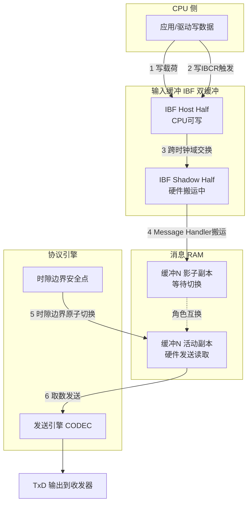

### 7.9 错误检测与故障界定

IP 内部的错误检测分三个层次，对应不同的处理策略：

| 层次 | 错误类型 | 检测位置 | 处理 |
|------|---------|---------|------|
| 位/帧层 | 编码错误 CED、Header CRC 错、Frame CRC 错 | CODEC | 丢弃该帧，置错误标志，计数 |
| 时隙层 | 时隙边界违规 SBV、语法错误 SED、内容错误 CE | 静态/动态段控制器 | 标记该时隙状态，可触发 vSS 状态位 |
| 协议层 | 同步帧不足、校正超限、冷启动失败 | POC + Sync Unit | 触发 NORMAL_PASSIVE / HALT 降级 |

**故障界定（Error Containment）** 的核心思想是：错误必须被限制在最小范围，不能扩散。FlexRay 的手段包括：

1. **通道隔离**：通道 A 的错误不影响通道 B 的接收判定。
2. **时隙隔离**：某时隙的帧错误只标记该时隙，不影响后续时隙的时序推进（因为时序由 GTU 独立驱动，不依赖帧内容）。
3. **节点隔离**：Bus Guardian 阻止本节点越界发送；两级降级（Passive/Halt）阻止本节点污染网络时基。
4. **同步源隔离**：FTM 算法丢弃极值，容忍恶意同步源。

这四层隔离叠加起来，就是 FlexRay 敢承诺 ASIL D 的技术底气。

### 7.10 Bus Guardian 接口

Bus Guardian 可以是 IP 内置的逻辑，也可以是外部独立器件。内置实现时，它维护一份**独立于消息 RAM 的时隙授权表**——注意"独立"二字是关键，如果它和发送逻辑共用同一份配置，那么配置一旦被写坏，守护和发送会同时出错，守护就失去意义了。

内置 Bus Guardian 的信号路径：静态段控制器输出"当前时隙号"，Bus Guardian 查表判断"本节点在此时隙是否有发送权"，输出 `bg_tx_enable` 信号与 CODEC 的 `tx_request` 做**逻辑与**，结果才驱动 TxEN 引脚。软件即使跑飞强行请求发送，只要时隙不对，TxEN 就不会有效。

### 7.11 寄存器映射概览

下表列出一个典型 FlexRay 控制器 IP 的主要寄存器分组（命名参考业界常见实现的命名风格，偏移地址为示意）：

| 偏移 | 名称 | 全称 | 作用 |
|------|------|------|------|
| 0x000 | CCSV | Communication Controller Status Vector | POC 状态、冷启动标志、同步状态 |
| 0x004 | CCEV | Communication Controller Error Vector | 错误模式、错误计数 |
| 0x010 | SCV | Slot Counter Value | 通道 A/B 当前时隙号 |
| 0x014 | MTCCV | Macrotick and Cycle Counter Value | 当前宏节拍与周期计数 |
| 0x018 | RCV | Rate Correction Value | 当前速率校正值 |
| 0x01C | OCV | Offset Correction Value | 当前偏移校正值 |
| 0x020 | SFS | Sync Frame Status | 同步帧数量与状态 |
| 0x080 | SUCC1 | Startup/Sync Config Register 1 | POC 命令、冷启动使能、通道使能 |
| 0x084 | SUCC2 | Startup/Sync Config Register 2 | 监听超时参数 |
| 0x088 | SUCC3 | Startup/Sync Config Register 3 | 无校正容忍周期数 |
| 0x08C | NEMC | NEM Configuration | 网络管理向量长度 |
| 0x090 | PRTC1 | Protocol Config Register 1 | 比特率、采样点、TSS 长度、唤醒参数 |
| 0x094 | PRTC2 | Protocol Config Register 2 | 唤醒模式时序参数 |
| 0x098 | MHDC | Message Handler Config | 静态载荷长度、FIFO 起始索引 |
| 0x0A0 | GTUC1 | Global Time Unit Config 1 | `pMicroPerCycle` |
| 0x0A4 | GTUC2 | Global Time Unit Config 2 | `gMacroPerCycle`、同步帧数上限 |
| 0x0A8 | GTUC3 | Global Time Unit Config 3 | 微节拍/宏节拍折算参数 |
| 0x0AC | GTUC4 | Global Time Unit Config 4 | NIT 起点、偏移校正起点 |
| 0x0B0 | GTUC5 | Global Time Unit Config 5 | 阻尼、延迟补偿 A/B |
| 0x0B4 | GTUC6 | Global Time Unit Config 6 | 校正量上限 |
| 0x0B8 | GTUC7 | Global Time Unit Config 7 | 静态时隙数、静态时隙长度 |
| 0x0BC | GTUC8 | Global Time Unit Config 8 | 微时隙数、微时隙长度 |
| 0x0C0 | GTUC9 | Global Time Unit Config 9 | 动作点偏移、动态段空闲相位 |
| 0x0C4 | GTUC10 | Global Time Unit Config 10 | 初始化误差、外部校正 |
| 0x0C8 | GTUC11 | Global Time Unit Config 11 | 外部速率/偏移校正控制 |
| 0x100 | WRHS1/2/3 | Write Header Section 1/2/3 | 写入缓冲头部（Frame ID/长度/CRC 等） |
| 0x120 | WRDS[n] | Write Data Section | 写入缓冲载荷数据 |
| 0x140 | IBCM | Input Buffer Command Mask | 指定本次写入哪些部分生效 |
| 0x144 | IBCR | Input Buffer Command Request | 触发写入，指定目标缓冲号 |
| 0x150 | OBCM | Output Buffer Command Mask | 指定本次读取哪些部分 |
| 0x154 | OBCR | Output Buffer Command Request | 触发读取，指定源缓冲号 |
| 0x160 | RDHS1/2/3 | Read Header Section | 读出缓冲头部与接收状态 |
| 0x180 | RDDS[n] | Read Data Section | 读出缓冲载荷数据 |
| 0x1C0 | NDAT1-4 | New Data Register 1-4 | 每缓冲一位，标记有新数据 |
| 0x1D0 | MBSC1-4 | Message Buffer Status Changed | 缓冲状态变化标志 |
| 0x200 | EIR | Error Interrupt Register | 错误中断标志 |
| 0x204 | SIR | Status Interrupt Register | 状态中断标志 |
| 0x208 | EILS | Error Interrupt Line Select | 中断线路由 |
| 0x210 | ILE | Interrupt Line Enable | 中断线总使能 |

### 7.12 关键寄存器位域图

下面用图示展示三个最核心寄存器的位域布局（**示意性设计，实际布局以芯片手册为准**）：

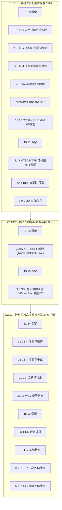

再看一张组合位域图，展示通信周期配置与消息缓冲头部的字段布局：


对 `SUCC1.CMD` 字段（协议命令）的取值，这是驱动最常操作的字段：

| CMD 值 | 命令名 | 作用 | 允许的前置状态 |
|--------|--------|------|--------------|
| 0x0 | command_not_accepted | 无效命令（硬件回写） | — |
| 0x1 | CONFIG | 进入 CONFIG 状态 | DEFAULT_CONFIG / READY |
| 0x2 | READY | 退出 CONFIG，进入 READY | CONFIG / STARTUP / NORMAL |
| 0x3 | WAKEUP | 启动唤醒模式发送 | READY |
| 0x4 | RUN | 启动通信（冷启动或整合） | READY |
| 0x5 | ALL_SLOTS | 从仅关键时隙切换到全时隙发送 | NORMAL_ACTIVE |
| 0x6 | HALT | 在当前周期末停止 | NORMAL_ACTIVE / PASSIVE |
| 0x7 | FREEZE | 立即冻结（调试用，不等周期末） | 任意 |
| 0x8 | SEND_MTS | 在下个符号窗发送 MTS | NORMAL_ACTIVE |
| 0x9 | ALLOW_COLDSTART | 允许本节点发起冷启动 | READY |
| 0xA | RESET_STATUS_INDICATORS | 清除状态指示位 | 任意 |
| 0xB | MONITOR_MODE | 进入只监听模式 | READY |
| 0xC | CLEAR_RAMS | 清空消息 RAM | CONFIG |

### 7.13 中断与 DMA 协作

IP 通常提供两条中断线（`int0` / `int1`），错误中断（EIR）与状态中断（SIR）可分别路由到任一线上，便于把"致命错误"与"周期事件"分给不同优先级的 ISR。

典型的中断源与用法：

| 中断源 | 触发条件 | 典型软件动作 |
|--------|---------|-------------|
| CYCLE_START | 每个通信周期起点 | 触发 FrIf 周期同步任务，是整个 AUTOSAR 时间同步的锚点 |
| TIMER0/1 | 到达配置的绝对/相对时间点 | 在周期内的精确时刻触发应用任务 |
| RXI | 指定缓冲收到新帧 | 读取接收数据 |
| TXI | 指定缓冲发送完成 | 填充下一帧数据 |
| WST | 唤醒状态改变 | 网络管理状态跟踪 |
| CCL | POC 状态改变 | FrSM 状态机推进 |
| PERR | 奇偶/ECC 错误（消息 RAM） | 安全监控上报 |
| CCF | 时钟校正失败 | 同步质量监控告警 |
| SFBM | 同步帧数量低于阈值 | 冗余降级预警 |

**DMA 协作**是提升吞吐的关键。对于载荷 254 字节的帧，CPU 逐字写 WRDS 寄存器需要 64 次 32 位写操作，在 100 MHz 总线上约 1~2 µs，如果一个周期要处理十几个缓冲，CPU 开销就很可观了。

DMA 方案是：把 IBF 的数据段（WRDS 区）配置为 DMA 目标地址，由 DMA 从 SRAM 中的应用缓冲搬运数据，搬完后 DMA 完成中断里再由 CPU 写一次 IBCR 触发提交。这样 CPU 只需两次寄存器访问（配置 DMA + 写 IBCR）。接收侧对称：DMA 从 RDDS 区搬运到应用缓冲。

**注意事项**：DMA 与影子缓冲机制配合时，必须保证 DMA 传输在写 IBCR 之前完成，否则会提交半包数据。安全的做法是用 DMA 完成中断触发 IBCR 写入，而不是靠软件延时估算。

---

## 八、驱动代码实现：从寄存器到收发全流程

本章给出一套完整的裸机/MCAL 底层驱动实现。代码基于第七章描述的通用 IP 架构，可读性优先，实际移植时需按目标芯片手册调整寄存器偏移与位域。

### 8.1 寄存器抽象与数据结构定义

```c
/*============================================================================
 * flexray_hw.h - FlexRay 控制器 IP 寄存器抽象层
 * 说明：位域布局为通用示意，移植时请对照目标芯片参考手册修改
 *==========================================================================*/
#ifndef FLEXRAY_HW_H
#define FLEXRAY_HW_H

#include <stdint.h>
#include <stdbool.h>

/*--------------------------------------------------------------------------
 * 寄存器块基地址（示例值，按芯片存储映射调整）
 *------------------------------------------------------------------------*/
#define FR_BASE_ADDR            (0xFFF80000UL)

/*--------------------------------------------------------------------------
 * 寄存器块结构体：volatile 保证编译器不优化掉硬件访问
 *------------------------------------------------------------------------*/
typedef struct {
    volatile uint32_t CCSV;      /* 0x000 控制器状态向量（只读）        */
    volatile uint32_t CCEV;      /* 0x004 控制器错误向量（只读）        */
    volatile uint32_t RSV0[2];
    volatile uint32_t SCV;       /* 0x010 时隙计数值 A/B（只读）        */
    volatile uint32_t MTCCV;     /* 0x014 宏节拍与周期计数（只读）      */
    volatile uint32_t RCV;       /* 0x018 速率校正值（只读）            */
    volatile uint32_t OCV;       /* 0x01C 偏移校正值（只读）            */
    volatile uint32_t SFS;       /* 0x020 同步帧状态（只读）            */
    volatile uint32_t RSV1[23];
    volatile uint32_t SUCC1;     /* 0x080 启动同步配置1                 */
    volatile uint32_t SUCC2;     /* 0x084 启动同步配置2                 */
    volatile uint32_t SUCC3;     /* 0x088 启动同步配置3                 */
    volatile uint32_t NEMC;      /* 0x08C 网络管理向量配置              */
    volatile uint32_t PRTC1;     /* 0x090 协议配置1（比特率/采样/TSS）  */
    volatile uint32_t PRTC2;     /* 0x094 协议配置2（唤醒时序）         */
    volatile uint32_t MHDC;      /* 0x098 消息处理器配置                */
    volatile uint32_t RSV2[1];
    volatile uint32_t GTUC[11];  /* 0x0A0~0x0C8 全局时间单元配置1..11   */
    volatile uint32_t RSV3[13];
    volatile uint32_t WRHS1;     /* 0x100 写头部段1                     */
    volatile uint32_t WRHS2;     /* 0x104 写头部段2                     */
    volatile uint32_t WRHS3;     /* 0x108 写头部段3（数据指针）         */
    volatile uint32_t RSV4[5];
    volatile uint32_t WRDS[64];  /* 0x120 写数据段（最大 254 字节）     */
    volatile uint32_t IBCM;      /* 0x220 输入缓冲命令掩码              */
    volatile uint32_t IBCR;      /* 0x224 输入缓冲命令请求              */
    volatile uint32_t OBCM;      /* 0x228 输出缓冲命令掩码              */
    volatile uint32_t OBCR;      /* 0x22C 输出缓冲命令请求              */
    volatile uint32_t RDHS1;     /* 0x230 读头部段1                     */
    volatile uint32_t RDHS2;     /* 0x234 读头部段2                     */
    volatile uint32_t RDHS3;     /* 0x238 读头部段3（接收状态）         */
    volatile uint32_t MBS;       /* 0x23C 消息缓冲状态                  */
    volatile uint32_t RDDS[64];  /* 0x240 读数据段                      */
    volatile uint32_t NDAT[4];   /* 0x340 新数据标志（每缓冲一位）      */
    volatile uint32_t MBSC[4];   /* 0x350 缓冲状态变化标志              */
    volatile uint32_t EIR;       /* 0x360 错误中断标志                  */
    volatile uint32_t SIR;       /* 0x364 状态中断标志                  */
    volatile uint32_t EILS;      /* 0x368 错误中断线选择                */
    volatile uint32_t SILS;      /* 0x36C 状态中断线选择                */
    volatile uint32_t EIES;      /* 0x370 错误中断使能置位              */
    volatile uint32_t EIER;      /* 0x374 错误中断使能清除              */
    volatile uint32_t SIES;      /* 0x378 状态中断使能置位              */
    volatile uint32_t SIER;      /* 0x37C 状态中断使能清除              */
    volatile uint32_t ILE;       /* 0x380 中断线总使能                  */
} Fr_RegType;

#define FR   ((Fr_RegType *)FR_BASE_ADDR)

/*--------------------------------------------------------------------------
 * SUCC1 位域定义
 *------------------------------------------------------------------------*/
#define SUCC1_CMD_SHIFT         0U
#define SUCC1_CMD_MASK          (0xFU << SUCC1_CMD_SHIFT)
#define SUCC1_PBSY              (1U << 7)    /* 协议忙，命令未被接受    */
#define SUCC1_MTSA              (1U << 8)    /* 通道A 允许发送 MTS      */
#define SUCC1_MTSB              (1U << 9)    /* 通道B 允许发送 MTS      */
#define SUCC1_CCHA              (1U << 16)   /* 使能通道 A              */
#define SUCC1_CCHB              (1U << 17)   /* 使能通道 B              */
#define SUCC1_WUCS              (1U << 20)   /* 唤醒通道选择 0=A 1=B    */
#define SUCC1_PTA_SHIFT         21U          /* Passive→Active 阈值     */
#define SUCC1_TXST              (1U << 22)   /* 关键时隙发送启动帧      */
#define SUCC1_TXSY              (1U << 23)   /* 关键时隙发送同步帧      */
#define SUCC1_CSA_SHIFT         24U          /* 冷启动尝试次数          */

/* POC 命令编码 */
#define FR_CMD_CONFIG           0x1U
#define FR_CMD_READY            0x2U
#define FR_CMD_WAKEUP           0x3U
#define FR_CMD_RUN              0x4U
#define FR_CMD_ALL_SLOTS        0x5U
#define FR_CMD_HALT             0x6U
#define FR_CMD_FREEZE           0x7U
#define FR_CMD_SEND_MTS         0x8U
#define FR_CMD_ALLOW_COLDSTART  0x9U
#define FR_CMD_RESET_STATUS     0xAU
#define FR_CMD_CLEAR_RAMS       0xCU

/*--------------------------------------------------------------------------
 * CCSV 位域：POC 状态
 *------------------------------------------------------------------------*/
#define CCSV_POCS_MASK          0x3FU
#define CCSV_POCS_SHIFT         0U
#define CCSV_FSI                (1U << 10)   /* 冻结状态指示            */
#define CCSV_HRQ                (1U << 11)   /* 停止请求挂起            */
#define CCSV_CSI                (1U << 21)   /* 冷启动被禁止            */
#define CCSV_CSAI               (1U << 22)   /* 冷启动被中止            */
#define CCSV_CSNI               (1U << 23)   /* 冷启动噪声              */

/* POC 状态值 */
typedef enum {
    FR_POCS_DEFAULT_CONFIG = 0x00,
    FR_POCS_READY          = 0x01,
    FR_POCS_NORMAL_ACTIVE  = 0x02,
    FR_POCS_NORMAL_PASSIVE = 0x03,
    FR_POCS_HALT           = 0x04,
    FR_POCS_MONITOR_MODE   = 0x05,
    FR_POCS_CONFIG         = 0x0F,
    FR_POCS_WAKEUP_STANDBY = 0x10,
    FR_POCS_WAKEUP_LISTEN  = 0x11,
    FR_POCS_WAKEUP_SEND    = 0x12,
    FR_POCS_WAKEUP_DETECT  = 0x13,
    FR_POCS_STARTUP_PREPARE       = 0x20,
    FR_POCS_COLDSTART_LISTEN      = 0x21,
    FR_POCS_COLDSTART_COLLISION   = 0x22,
    FR_POCS_COLDSTART_CONSISTENCY = 0x23,
    FR_POCS_COLDSTART_GAP         = 0x24,
    FR_POCS_COLDSTART_JOIN        = 0x25,
    FR_POCS_INTEGRATION_CONSISTENCY = 0x26,
    FR_POCS_INITIALIZE_SCHEDULE     = 0x27,
    FR_POCS_INTEGRATION_LISTEN      = 0x28
} Fr_PocStateType;

/*--------------------------------------------------------------------------
 * IBCR / OBCR 位域
 *------------------------------------------------------------------------*/
#define IBCR_IBRH_SHIFT         0U     /* 主机侧目标缓冲号             */
#define IBCR_IBSYH              (1U << 15)  /* 主机半区忙               */
#define IBCR_IBRS_SHIFT         16U    /* 影子侧缓冲号（只读）         */
#define IBCR_IBSYS              (1U << 31)  /* 影子半区忙               */

#define IBCM_LHSH               (1U << 0)   /* 加载头部段               */
#define IBCM_LDSH               (1U << 1)   /* 加载数据段               */
#define IBCM_STXRH              (1U << 2)   /* 置发送请求位             */

#define OBCR_OBRS_SHIFT         0U
#define OBCR_REQ                (1U << 9)   /* 请求搬运到输出缓冲       */
#define OBCR_VIEW               (1U << 8)   /* 切换视图供 CPU 读取      */
#define OBCR_OBSYS              (1U << 15)  /* 输出缓冲忙               */

#define OBCM_RHSS               (1U << 0)   /* 读头部段                 */
#define OBCM_RDSS               (1U << 1)   /* 读数据段                 */

/*--------------------------------------------------------------------------
 * 配置参数结构：由 MCAL 配置工具生成或手工填写
 *------------------------------------------------------------------------*/
typedef struct {
    /* ---- 集群级时序参数（全网必须一致）---- */
    uint16_t gMacroPerCycle;          /* 每周期宏节拍数，如 5000        */
    uint16_t gNumberOfStaticSlots;    /* 静态时隙数，如 20              */
    uint16_t gdStaticSlot;            /* 静态时隙长度(MT)，如 100       */
    uint16_t gNumberOfMinislots;      /* 微时隙数，如 200               */
    uint8_t  gdMinislot;              /* 微时隙长度(MT)，如 10          */
    uint8_t  gdSymbolWindow;          /* 符号窗长度(MT)，如 100         */
    uint16_t gdNIT;                   /* NIT 长度(MT)，如 200           */
    uint8_t  gdActionPointOffset;     /* 静态段动作点偏移(MT)           */
    uint8_t  gdMinislotActionPointOffset; /* 动态段动作点偏移(MT)       */
    uint8_t  gPayloadLengthStatic;    /* 静态帧载荷长度(16bit 字)       */
    uint8_t  gdTSSTransmitter;        /* TSS 长度(bit)                  */
    uint8_t  gColdStartAttempts;      /* 冷启动最大尝试次数             */
    uint8_t  gMaxWithoutClockCorrPassive; /* 无校正转 Passive 阈值      */
    uint8_t  gMaxWithoutClockCorrFatal;   /* 无校正转 Halt 阈值         */
    uint8_t  gSyncNodeMax;            /* 允许的最大同步节点数           */

    /* ---- 节点级参数 ---- */
    uint32_t pMicroPerCycle;          /* 每周期微节拍数（节点相关）     */
    uint16_t pMicroPerMacroNom;       /* 每宏节拍标称微节拍数           */
    uint16_t pOffsetCorrectionOut;    /* 偏移校正上限(microtick)        */
    uint16_t pRateCorrectionOut;      /* 速率校正上限(microtick)        */
    uint16_t pdListenTimeout;         /* 冷启动监听超时(microtick)      */
    uint16_t pLatestTx;               /* 动态段最晚发送 minislot        */
    uint16_t pKeySlotId;              /* 关键时隙的 Frame ID            */
    uint8_t  pClusterDriftDamping;    /* 漂移阻尼(microtick)            */
    uint8_t  pDelayCompensationA;     /* 通道A 传播延迟补偿             */
    uint8_t  pDelayCompensationB;     /* 通道B 传播延迟补偿             */
    uint8_t  pSamplesPerMicrotick;    /* 每微节拍采样数                 */
    bool     pKeySlotUsedForStartup;  /* 关键时隙发启动帧（冷启动节点） */
    bool     pKeySlotUsedForSync;     /* 关键时隙发同步帧               */
    bool     pChannelsAB;             /* true=双通道 false=单通道A      */
    bool     pWakeupChannelB;         /* 唤醒使用通道B                  */
} Fr_ConfigType;

#endif /* FLEXRAY_HW_H */
```

### 8.2 控制器初始化：通信周期与段配置

初始化的第一原则：**所有时序配置寄存器只能在 CONFIG 状态下写入**。驱动必须先把 POC 拉进 CONFIG，写完全部参数后再退出。

```c
/*============================================================================
 * flexray_init.c - FlexRay 控制器初始化
 *==========================================================================*/
#include "flexray_hw.h"

#define FR_CMD_TIMEOUT_LOOPS    100000U

/*--------------------------------------------------------------------------
 * 读取当前 POC 状态
 *------------------------------------------------------------------------*/
static Fr_PocStateType Fr_GetPocState(void)
{
    return (Fr_PocStateType)((FR->CCSV >> CCSV_POCS_SHIFT) & CCSV_POCS_MASK);
}

/*--------------------------------------------------------------------------
 * 发送 POC 命令并等待硬件接受
 * 说明：硬件收到命令后若不接受，会把 CMD 字段回写为 0
 *       PBSY 位为 1 表示协议引擎仍在处理上一条命令
 *------------------------------------------------------------------------*/
static bool Fr_SendPocCommand(uint32_t cmd)
{
    uint32_t guard = FR_CMD_TIMEOUT_LOOPS;

    /* 步骤1：等待协议引擎空闲 */
    while ((FR->SUCC1 & SUCC1_PBSY) != 0U) {
        if (--guard == 0U) {
            return false;               /* 引擎持续忙，判定超时 */
        }
    }

    /* 步骤2：读改写，只动 CMD 字段，保留其余配置位 */
    uint32_t reg = FR->SUCC1;
    reg &= ~SUCC1_CMD_MASK;
    reg |= (cmd << SUCC1_CMD_SHIFT) & SUCC1_CMD_MASK;
    FR->SUCC1 = reg;

    /* 步骤3：回读确认命令被接受（未被硬件清零为 0） */
    if (((FR->SUCC1 & SUCC1_CMD_MASK) >> SUCC1_CMD_SHIFT) == 0U) {
        return false;                   /* 命令在当前状态非法，被拒绝 */
    }
    return true;
}

/*--------------------------------------------------------------------------
 * 进入 CONFIG 状态
 * 注意：从 DEFAULT_CONFIG 与从 READY 进入，都走同一条 CONFIG 命令
 *------------------------------------------------------------------------*/
static bool Fr_EnterConfigState(void)
{
    uint32_t guard = FR_CMD_TIMEOUT_LOOPS;

    if (Fr_GetPocState() == FR_POCS_CONFIG) {
        return true;                    /* 已在 CONFIG，无需重复进入 */
    }

    if (!Fr_SendPocCommand(FR_CMD_CONFIG)) {
        return false;
    }

    while (Fr_GetPocState() != FR_POCS_CONFIG) {
        if (--guard == 0U) {
            return false;
        }
    }
    return true;
}

/*--------------------------------------------------------------------------
 * 配置协议层参数：比特率、采样点、TSS、唤醒时序
 * PRTC1 布局（示意）：
 *   [2:0]   BRP    比特率分频 0=10Mbps 1=5Mbps 2=2.5Mbps
 *   [7:4]   RXW    唤醒接收窗口
 *   [12:8]  RWP    重复唤醒模式次数
 *   [19:16] TSST   TSS 发送长度
 *   [23:20] CASM   CAS 符号长度
 *   [27:24] SPP    采样点位置
 *------------------------------------------------------------------------*/
static void Fr_ConfigProtocolLayer(const Fr_ConfigType *cfg)
{
    uint32_t prtc1 = 0U;

    prtc1 |= (0U    & 0x7U)  << 0;      /* BRP=0 → 10 Mbps            */
    prtc1 |= (0x9U  & 0xFU)  << 4;      /* 唤醒接收窗口                */
    prtc1 |= (0x3U  & 0x1FU) << 8;      /* 唤醒模式重复次数            */
    prtc1 |= ((uint32_t)cfg->gdTSSTransmitter & 0xFU) << 16;
    prtc1 |= (0x8U  & 0xFU)  << 20;     /* CAS 符号长度                */
    prtc1 |= ((uint32_t)cfg->pSamplesPerMicrotick & 0xFU) << 24;
    FR->PRTC1 = prtc1;

    /* PRTC2：唤醒模式的低/高电平时长参数（gdWakeupRxLow/High 等） */
    FR->PRTC2 = (59U << 0)      /* RXI  唤醒接收空闲                  */
              | (55U << 8)      /* RXL  唤醒接收低电平                */
              | (18U << 16)     /* TXI  唤醒发送空闲                  */
              | (60U << 24);    /* TXL  唤醒发送低电平                */
}

/*--------------------------------------------------------------------------
 * 配置全局时间单元 GTU：这是初始化中最核心、最容易出错的一步
 * 每个 GTUC 寄存器承载不同的时序参数组合
 *------------------------------------------------------------------------*/
static void Fr_ConfigGlobalTimeUnit(const Fr_ConfigType *cfg)
{
    /* GTUC1: pMicroPerCycle —— 本节点一个周期含多少微节拍
     * 这是节点相关参数：pMicroPerCycle = gMacroPerCycle × pMicroPerMacroNom */
    FR->GTUC[0] = cfg->pMicroPerCycle & 0x003FFFFFU;

    /* GTUC2: [13:0] gMacroPerCycle，[21:16] 同步节点数上限 */
    FR->GTUC[1] = ((uint32_t)cfg->gMacroPerCycle & 0x3FFFU)
                | (((uint32_t)cfg->gSyncNodeMax & 0x3FU) << 16);

    /* GTUC3: [7:0] pMicroPerMacroNom 的整数部分
     *        [23:16] 微节拍/宏节拍折算的小数补偿（uMicroPerMacroNomFrac）
     * 说明：由于 gdMacrotick 未必是 pdMicrotick 的整数倍，
     *       硬件用整数+小数两部分逼近，避免长期累积误差 */
    FR->GTUC[2] = ((uint32_t)cfg->pMicroPerMacroNom & 0xFFU)
                | (0U << 16);

    /* GTUC4: [13:0] NIT 起始宏节拍偏移
     *        [29:16] 偏移校正起始宏节拍偏移
     * NIT 起点 = gMacroPerCycle - gdNIT - 1
     * 偏移校正起点 = gMacroPerCycle - gdNIT + gdOffsetCorrectionStart */
    {
        uint16_t nitStart = (uint16_t)(cfg->gMacroPerCycle - cfg->gdNIT - 1U);
        uint16_t offStart = (uint16_t)(cfg->gMacroPerCycle - 1U);
        FR->GTUC[3] = ((uint32_t)nitStart & 0x3FFFU)
                    | (((uint32_t)offStart & 0x3FFFU) << 16);
    }

    /* GTUC5: [7:0] 漂移阻尼，[15:8] 通道A延迟补偿，[23:16] 通道B延迟补偿
     * 延迟补偿用于抵消收发器与线缆的传播延迟，使接收时刻测量更准确 */
    FR->GTUC[4] = ((uint32_t)cfg->pClusterDriftDamping & 0xFFU)
                | (((uint32_t)cfg->pDelayCompensationA & 0xFFU) << 8)
                | (((uint32_t)cfg->pDelayCompensationB & 0xFFU) << 16);

    /* GTUC6: [10:0] pOffsetCorrectionOut，[26:16] pRateCorrectionOut
     * 这两个上限值决定"校正量多大算异常"，超限即判定本周期无有效校正 */
    FR->GTUC[5] = ((uint32_t)cfg->pOffsetCorrectionOut & 0x7FFU)
                | (((uint32_t)cfg->pRateCorrectionOut & 0x7FFU) << 16);

    /* GTUC7: [9:0] gdStaticSlot，[25:16] gNumberOfStaticSlots
     * 静态段的全部定义就在这一个寄存器里 */
    FR->GTUC[6] = ((uint32_t)cfg->gdStaticSlot & 0x3FFU)
                | (((uint32_t)cfg->gNumberOfStaticSlots & 0x3FFU) << 16);

    /* GTUC8: [12:0] gNumberOfMinislots，[21:16] gdMinislot */
    FR->GTUC[7] = ((uint32_t)cfg->gNumberOfMinislots & 0x1FFFU)
                | (((uint32_t)cfg->gdMinislot & 0x3FU) << 16);

    /* GTUC9: [4:0] gdActionPointOffset
     *        [12:8] gdMinislotActionPointOffset
     *        [21:16] gdDynamicSlotIdlePhase */
    FR->GTUC[8] = ((uint32_t)cfg->gdActionPointOffset & 0x1FU)
                | (((uint32_t)cfg->gdMinislotActionPointOffset & 0x1FU) << 8)
                | ((2U & 0x3U) << 16);

    /* GTUC10: [7:0] 最大初始化误差补偿，[23:16] 外部偏移校正
     * 一般保持默认，除非做外部时间源同步（如与 gPTP 对齐） */
    FR->GTUC[9] = (0x0AU << 0) | (0U << 16);

    /* GTUC11: 外部速率/偏移校正控制，不使用外部校正时置 0 */
    FR->GTUC[10] = 0U;
}

/*--------------------------------------------------------------------------
 * 配置启动与同步行为
 *------------------------------------------------------------------------*/
static void Fr_ConfigStartupSync(const Fr_ConfigType *cfg)
{
    uint32_t succ1 = 0U;

    /* 通道使能：双通道系统必须两位都置，否则冗余无效 */
    succ1 |= SUCC1_CCHA;
    if (cfg->pChannelsAB) {
        succ1 |= SUCC1_CCHB;
    }

    /* 关键时隙用途：同步帧 / 启动帧 */
    if (cfg->pKeySlotUsedForSync) {
        succ1 |= SUCC1_TXSY;
    }
    if (cfg->pKeySlotUsedForStartup) {
        succ1 |= SUCC1_TXST;   /* 置位后本节点才是冷启动候选 */
    }

    /* 唤醒通道选择 */
    if (cfg->pWakeupChannelB) {
        succ1 |= SUCC1_WUCS;
    }

    /* 冷启动尝试次数：耗尽后不再尝试，避免噪声环境下无限重试 */
    succ1 |= ((uint32_t)cfg->gColdStartAttempts & 0x1FU) << SUCC1_CSA_SHIFT;

    /* Passive→Active 的恢复阈值：连续多少个周期同步良好才升回 Active */
    succ1 |= (0U & 0x1FU) << SUCC1_PTA_SHIFT;

    FR->SUCC1 = succ1;

    /* SUCC2: [7:0] 监听超时 pdListenTimeout 的低位
     *        [23:16] 监听超时的噪声容忍倍数 gListenNoise */
    FR->SUCC2 = ((uint32_t)cfg->pdListenTimeout & 0x1FFFFFU)
              | (0x2U << 24);

    /* SUCC3: [3:0] gMaxWithoutClockCorrectionPassive
     *        [7:4] gMaxWithoutClockCorrectionFatal
     * 两级降级门限，Fatal 必须大于等于 Passive */
    FR->SUCC3 = ((uint32_t)cfg->gMaxWithoutClockCorrPassive & 0xFU)
              | (((uint32_t)cfg->gMaxWithoutClockCorrFatal & 0xFU) << 4);
}

/*--------------------------------------------------------------------------
 * 配置消息处理器：静态载荷长度、FIFO 划分
 * MHDC 布局（示意）：
 *   [6:0]   SFDL  静态帧载荷长度（16bit 字）
 *   [23:16] SLT   FIFO 起始缓冲索引
 *------------------------------------------------------------------------*/
static void Fr_ConfigMessageHandler(const Fr_ConfigType *cfg)
{
    FR->MHDC = ((uint32_t)cfg->gPayloadLengthStatic & 0x7FU)
             | ((32U & 0xFFU) << 16);   /* 缓冲 32 及以后作为接收 FIFO */

    /* 网络管理向量长度：0 表示不使用 NM 向量 */
    FR->NEMC = 0U;
}

/*--------------------------------------------------------------------------
 * 顶层初始化入口
 * 返回：true 成功进入 READY 状态；false 初始化失败
 *------------------------------------------------------------------------*/
bool Fr_ControllerInit(const Fr_ConfigType *cfg)
{
    /* --- 阶段1：进入 CONFIG 状态，此后配置寄存器才可写 --- */
    if (!Fr_EnterConfigState()) {
        return false;
    }

    /* --- 阶段2：清空消息 RAM，避免上电残留数据被误发 --- */
    if (!Fr_SendPocCommand(FR_CMD_CLEAR_RAMS)) {
        return false;
    }
    while ((FR->SUCC1 & SUCC1_PBSY) != 0U) {
        /* 等待清 RAM 完成，该操作耗时与 RAM 容量成正比 */
    }

    /* --- 阶段3：写入全部配置寄存器 --- */
    Fr_ConfigProtocolLayer(cfg);       /* 比特率/采样/TSS/唤醒时序    */
    Fr_ConfigGlobalTimeUnit(cfg);      /* 周期/静态段/动态段/NIT/校正 */
    Fr_ConfigStartupSync(cfg);         /* 冷启动/同步/通道使能        */
    Fr_ConfigMessageHandler(cfg);      /* 载荷长度/FIFO               */

    /* --- 阶段4：配置中断 --- */
    FR->EIER = 0xFFFFFFFFU;            /* 先全部关闭，逐项打开        */
    FR->SIER = 0xFFFFFFFFU;
    FR->EIES = (1U << 0)               /* PEMC 协议引擎模式改变       */
             | (1U << 6)               /* CCF  时钟校正失败           */
             | (1U << 7)               /* CCL  时钟校正上限           */
             | (1U << 12);             /* PERR 消息RAM奇偶错          */
    FR->SIES = (1U << 0)               /* WST  唤醒状态改变           */
             | (1U << 1)               /* CAS  收到CAS符号            */
             | (1U << 4)               /* CYCS 周期起点               */
             | (1U << 6)               /* RXI  接收中断               */
             | (1U << 7);              /* TXI  发送完成中断           */
    FR->ILE = 0x3U;                    /* 使能两条中断线              */

    /* --- 阶段5：退出 CONFIG，进入 READY --- */
    if (!Fr_SendPocCommand(FR_CMD_READY)) {
        return false;
    }
    {
        uint32_t guard = FR_CMD_TIMEOUT_LOOPS;
        while (Fr_GetPocState() != FR_POCS_READY) {
            if (--guard == 0U) {
                return false;
            }
        }
    }
    return true;
}
```

### 8.3 消息缓冲配置

在 CONFIG 状态下（或对未被时隙占用的缓冲，在运行期也可以）配置每个消息缓冲的头部。这一步建立"Frame ID ↔ 缓冲号 ↔ 数据区地址"的映射。

```c
/*============================================================================
 * flexray_buffer.c - 消息缓冲配置
 *==========================================================================*/
#include "flexray_hw.h"

typedef enum {
    FR_BUF_TX = 0,      /* 发送缓冲 */
    FR_BUF_RX = 1       /* 接收缓冲 */
} Fr_BufDirType;

typedef struct {
    uint8_t  bufIndex;      /* 缓冲编号 0..127                        */
    uint16_t frameId;       /* Frame ID = 静态段时隙号                */
    uint8_t  payloadLen;    /* 载荷长度（16bit 字）                   */
    uint8_t  cycleCode;     /* 周期过滤码，见下方说明                 */
    bool     useChannelA;
    bool     useChannelB;
    Fr_BufDirType dir;
    bool     enableIrq;     /* 收发完成是否产生中断                   */
    uint16_t dataPointer;   /* 消息RAM数据区起始地址（16bit 字单位）  */
    uint16_t headerCrc;     /* 由配置工具离线计算，11 bit             */
} Fr_BufferCfgType;

/*--------------------------------------------------------------------------
 * 周期过滤码 cycleCode 编码规则（6 位）：
 *   [5:1] = 基数 base，[0]... 实际协议定义为：
 *   cycleCode = 2^n + base，表示"每 2^n 个周期，在 cycle == base 时收发"
 *   例：cycleCode = 0x01 → 每周期（2^0=1，base=0）
 *       cycleCode = 0x02 → 每2周期的偶数周期
 *       cycleCode = 0x03 → 每2周期的奇数周期
 *       cycleCode = 0x04 → 每4周期的 cycle 0
 *       cycleCode = 0x05 → 每4周期的 cycle 1
 * 这就是 Cycle Multiplexing 的硬件实现方式
 *------------------------------------------------------------------------*/
#define FR_CYCLE_EVERY          0x01U
#define FR_CYCLE_EVEN           0x02U
#define FR_CYCLE_ODD            0x03U
#define FR_CYCLE_EVERY4_BASE(b) (0x04U | ((b) & 0x03U))

/*--------------------------------------------------------------------------
 * 等待输入缓冲空闲
 * IBSYH=1 表示主机半区正被硬件搬运，此时写 WRHS/WRDS 会破坏正在搬的数据
 *------------------------------------------------------------------------*/
static void Fr_WaitInputBufferIdle(void)
{
    while ((FR->IBCR & IBCR_IBSYH) != 0U) {
        /* 忙等。真实工程中应加超时保护并上报诊断 */
    }
}

/*--------------------------------------------------------------------------
 * 配置单个消息缓冲的头部
 *------------------------------------------------------------------------*/
void Fr_ConfigMessageBuffer(const Fr_BufferCfgType *bc)
{
    uint32_t wrhs1 = 0U;

    Fr_WaitInputBufferIdle();

    /* ---- WRHS1: Frame ID / 周期过滤 / 通道 / 方向 / 中断 ---- */
    wrhs1 |= ((uint32_t)bc->frameId & 0x7FFU) << 0;
    wrhs1 |= ((uint32_t)bc->cycleCode & 0x3FU) << 16;
    if (bc->useChannelA) { wrhs1 |= (1U << 24); }   /* CHA */
    if (bc->useChannelB) { wrhs1 |= (1U << 25); }   /* CHB */
    wrhs1 |= (1U << 26);                            /* CFG: 1=发送 0=接收 */
    if (bc->dir == FR_BUF_RX) {
        wrhs1 &= ~(1U << 26);
    }
    wrhs1 |= (0U << 27);                            /* PPIT: 无载荷前缀   */
    wrhs1 |= (1U << 28);                            /* TXM: 1=单次发送模式
                                                     * 0=连续模式(发完不清
                                                     * 就绪位，每周期重发) */
    if (bc->enableIrq) {
        wrhs1 |= (1U << 29);                        /* MBI: 缓冲中断使能  */
    }
    FR->WRHS1 = wrhs1;

    /* ---- WRHS2: Header CRC + 载荷配置长度 ---- */
    FR->WRHS2 = ((uint32_t)bc->payloadLen & 0x7FU) << 0
              | ((uint32_t)bc->headerCrc & 0x7FFU) << 16;

    /* ---- WRHS3: 数据区指针 ---- */
    FR->WRHS3 = (uint32_t)bc->dataPointer & 0x7FFU;

    /* ---- 提交：只加载头部段，不动数据段 ---- */
    FR->IBCM = IBCM_LHSH;                           /* 仅头部 */
    FR->IBCR = (uint32_t)bc->bufIndex & 0x7FU;      /* 触发写入 */
}

/*--------------------------------------------------------------------------
 * 批量配置：典型底盘节点的缓冲布局示例
 *------------------------------------------------------------------------*/
void Fr_SetupNodeBuffers(void)
{
    /* 缓冲0：关键时隙（Key Slot），发送同步帧 + 本节点主控制帧
     * 注意：关键时隙的 Frame ID 必须等于 pKeySlotId */
    static const Fr_BufferCfgType keySlot = {
        .bufIndex = 0,  .frameId = 5,   .payloadLen = 16,
        .cycleCode = FR_CYCLE_EVERY,
        .useChannelA = true, .useChannelB = true,
        .dir = FR_BUF_TX, .enableIrq = true,
        .dataPointer = 0x000, .headerCrc = 0x2A7   /* 离线计算值 */
    };

    /* 缓冲1：接收转向角传感器帧（时隙1，每周期） */
    static const Fr_BufferCfgType rxSteering = {
        .bufIndex = 1,  .frameId = 1,   .payloadLen = 8,
        .cycleCode = FR_CYCLE_EVERY,
        .useChannelA = true, .useChannelB = true,
        .dir = FR_BUF_RX, .enableIrq = true,
        .dataPointer = 0x010, .headerCrc = 0x000   /* 接收缓冲不需要 CRC */
    };

    /* 缓冲2：发送制动指令（时隙13，仅偶数周期，Cycle Multiplexing 示例） */
    static const Fr_BufferCfgType txBrake = {
        .bufIndex = 2,  .frameId = 13,  .payloadLen = 16,
        .cycleCode = FR_CYCLE_EVEN,
        .useChannelA = true, .useChannelB = true,
        .dir = FR_BUF_TX, .enableIrq = false,
        .dataPointer = 0x018, .headerCrc = 0x1B3
    };

    /* 缓冲3：动态段诊断帧（Frame ID 100，仅通道A，不冗余） */
    static const Fr_BufferCfgType txDiag = {
        .bufIndex = 3,  .frameId = 100, .payloadLen = 32,
        .cycleCode = FR_CYCLE_EVERY,
        .useChannelA = true, .useChannelB = false,
        .dir = FR_BUF_TX, .enableIrq = true,
        .dataPointer = 0x028, .headerCrc = 0x0C5
    };

    Fr_ConfigMessageBuffer(&keySlot);
    Fr_ConfigMessageBuffer(&rxSteering);
    Fr_ConfigMessageBuffer(&txBrake);
    Fr_ConfigMessageBuffer(&txDiag);
}
```

### 8.4 节点启动：冷启动与整合

```c
/*============================================================================
 * flexray_startup.c - 节点启动流程
 *==========================================================================*/
#include "flexray_hw.h"

/* 以 5ms 周期计，整合最长允许 200 个周期 = 1 秒 */
#define FR_STARTUP_MAX_CYCLES   200U

typedef enum {
    FR_START_OK = 0,
    FR_START_ERR_NOT_READY,
    FR_START_ERR_CMD_REJECT,
    FR_START_ERR_TIMEOUT,
    FR_START_ERR_HALT,
    FR_START_ERR_COLDSTART_ABORT
} Fr_StartResultType;

extern Fr_PocStateType Fr_GetPocState(void);
extern bool Fr_SendPocCommand(uint32_t cmd);

/*--------------------------------------------------------------------------
 * 唤醒总线：仅当本节点负责唤醒时调用
 * 唤醒模式（WUP）会把睡眠中的其他节点拉起，之后才能启动通信
 *------------------------------------------------------------------------*/
Fr_StartResultType Fr_SendWakeupPattern(void)
{
    uint32_t guard = FR_STARTUP_MAX_CYCLES * 1000U;

    if (Fr_GetPocState() != FR_POCS_READY) {
        return FR_START_ERR_NOT_READY;
    }

    if (!Fr_SendPocCommand(FR_CMD_WAKEUP)) {
        return FR_START_ERR_CMD_REJECT;
    }

    /* 等待唤醒过程结束：POC 会自动回到 READY */
    while (Fr_GetPocState() != FR_POCS_READY) {
        if (--guard == 0U) {
            return FR_START_ERR_TIMEOUT;
        }
    }

    /* 检查唤醒状态：WSV 字段指示唤醒是成功、被中止还是检测到冲突 */
    {
        uint32_t wsv = (FR->CCSV >> 16) & 0x7U;
        /* wsv: 1=UNDEFINED 2=RECEIVED_HEADER 3=RECEIVED_WUP
         *      4=COLLISION_HEADER 5=COLLISION_WUP 6=COLLISION_UNKNOWN
         *      7=TRANSMITTED
         * 3 或 7 表示网络上已有唤醒活动或本节点成功发送 */
        if ((wsv == 4U) || (wsv == 5U) || (wsv == 6U)) {
            /* 唤醒冲突：多个节点同时唤醒，协议已处理，可继续 */
        }
    }
    return FR_START_OK;
}

/*--------------------------------------------------------------------------
 * 启动通信
 * 冷启动节点与普通节点使用同一条 RUN 命令，
 * 走冷启动路径还是整合路径，由 SUCC1.TXST 配置决定，硬件自动分流
 *------------------------------------------------------------------------*/
Fr_StartResultType Fr_StartCommunication(bool isColdstartNode)
{
    uint32_t cycleGuard = FR_STARTUP_MAX_CYCLES;
    uint8_t  lastCycle;
    Fr_PocStateType st;

    if (Fr_GetPocState() != FR_POCS_READY) {
        return FR_START_ERR_NOT_READY;
    }

    /* 冷启动节点需要显式获得冷启动许可。
     * 该命令使 CCSV.CSI（冷启动禁止）位清零 */
    if (isColdstartNode) {
        if (!Fr_SendPocCommand(FR_CMD_ALLOW_COLDSTART)) {
            return FR_START_ERR_CMD_REJECT;
        }
    }

    /* 发出 RUN，硬件进入 STARTUP 大状态 */
    if (!Fr_SendPocCommand(FR_CMD_RUN)) {
        return FR_START_ERR_CMD_REJECT;
    }

    /* 以周期计数为节拍轮询，比纯循环计数更贴近真实时间 */
    lastCycle = (uint8_t)((FR->MTCCV >> 16) & 0x3FU);
    while (cycleGuard > 0U) {
        uint8_t curCycle = (uint8_t)((FR->MTCCV >> 16) & 0x3FU);
        if (curCycle != lastCycle) {
            lastCycle = curCycle;
            cycleGuard--;
        }

        st = Fr_GetPocState();

        if ((st == FR_POCS_NORMAL_ACTIVE) || (st == FR_POCS_NORMAL_PASSIVE)) {
            /* 成功入网。此时节点默认只在关键时隙发送，
             * 需再发 ALL_SLOTS 才会按完整调度表发送所有时隙 */
            if (!Fr_SendPocCommand(FR_CMD_ALL_SLOTS)) {
                return FR_START_ERR_CMD_REJECT;
            }
            return FR_START_OK;
        }

        if (st == FR_POCS_HALT) {
            return FR_START_ERR_HALT;
        }

        /* 冷启动被中止：说明总线上已有通信，或冷启动尝试次数耗尽 */
        if ((FR->CCSV & CCSV_CSAI) != 0U) {
            return FR_START_ERR_COLDSTART_ABORT;
        }
    }
    return FR_START_ERR_TIMEOUT;
}

/*--------------------------------------------------------------------------
 * 完整启动序列：初始化 → 缓冲配置 → 唤醒 → 启动
 *------------------------------------------------------------------------*/
extern bool Fr_ControllerInit(const Fr_ConfigType *cfg);
extern void Fr_SetupNodeBuffers(void);

Fr_StartResultType Fr_NodeBringUp(const Fr_ConfigType *cfg, bool doWakeup)
{
    Fr_StartResultType res;

    if (!Fr_ControllerInit(cfg)) {
        return FR_START_ERR_NOT_READY;
    }

    /* 缓冲配置必须在 CONFIG 或 READY 状态完成。
     * 部分 IP 允许运行期重配未占用的缓冲，但关键时隙缓冲不可运行期改 */
    Fr_SetupNodeBuffers();

    if (doWakeup) {
        res = Fr_SendWakeupPattern();
        if (res != FR_START_OK) {
            return res;
        }
    }

    return Fr_StartCommunication(cfg->pKeySlotUsedForStartup);
}
```

### 8.5 帧发送：写入缓冲并置就绪

```c
/*============================================================================
 * flexray_tx.c - 帧发送
 *==========================================================================*/
#include "flexray_hw.h"
#include <string.h>

extern void Fr_WaitInputBufferIdle(void);

typedef enum {
    FR_TX_OK = 0,
    FR_TX_ERR_BUSY,
    FR_TX_ERR_LEN,
    FR_TX_ERR_STATE
} Fr_TxResultType;

/*--------------------------------------------------------------------------
 * 向指定发送缓冲写入数据并请求发送
 *
 * 关键点：
 * 1. WRDS 是 32 位寄存器阵列，数据需按小端打包
 * 2. IBCM 决定本次提交哪些部分（头部/数据/发送请求位）
 * 3. 写 IBCR 是"扳机"，之前所有写入才被原子提交
 * 4. 硬件在时隙边界把影子缓冲切换为活动缓冲，保证帧数据一致性
 *
 * @param bufIndex 缓冲编号
 * @param data     应用数据指针
 * @param length   数据字节数，必须为偶数且不超过缓冲配置长度
 *------------------------------------------------------------------------*/
Fr_TxResultType Fr_TransmitFrame(uint8_t bufIndex,
                                 const uint8_t *data,
                                 uint16_t length)
{
    uint16_t words;
    uint16_t i;

    if ((length > 254U) || ((length & 1U) != 0U)) {
        return FR_TX_ERR_LEN;       /* FlexRay 载荷必须是偶数字节 */
    }

    /* 只有在 NORMAL_ACTIVE 才有实际发送意义；
     * PASSIVE 下写入不会报错但帧不会上总线 */
    {
        uint32_t pocs = FR->CCSV & CCSV_POCS_MASK;
        if ((pocs != (uint32_t)FR_POCS_NORMAL_ACTIVE)) {
            return FR_TX_ERR_STATE;
        }
    }

    /* 等待输入缓冲主机半区空闲 */
    {
        uint32_t guard = 10000U;
        while ((FR->IBCR & IBCR_IBSYH) != 0U) {
            if (--guard == 0U) {
                return FR_TX_ERR_BUSY;
            }
        }
    }

    /* 按 32 位字打包写入 WRDS。
     * 注意：FlexRay 载荷在总线上按字节序发送，
     * 这里的打包顺序必须与 IP 的字节序约定一致 */
    words = (uint16_t)((length + 3U) / 4U);
    for (i = 0U; i < words; i++) {
        uint32_t w = 0U;
        uint16_t base = (uint16_t)(i * 4U);
        w |= (base + 0U < length) ? ((uint32_t)data[base + 0U] << 0)  : 0U;
        w |= (base + 1U < length) ? ((uint32_t)data[base + 1U] << 8)  : 0U;
        w |= (base + 2U < length) ? ((uint32_t)data[base + 2U] << 16) : 0U;
        w |= (base + 3U < length) ? ((uint32_t)data[base + 3U] << 24) : 0U;
        FR->WRDS[i] = w;
    }

    /* 提交：加载数据段 + 置发送请求位（不重写头部，头部已在配置期写好） */
    FR->IBCM = IBCM_LDSH | IBCM_STXRH;
    FR->IBCR = (uint32_t)bufIndex & 0x7FU;   /* 扳机：触发原子提交 */

    return FR_TX_OK;
}

/*--------------------------------------------------------------------------
 * 更新关键时隙数据（每周期调用，典型在 CYCLE_START 中断里）
 * 关键时隙承载同步帧，必须每周期都有数据，否则同步质量下降
 *------------------------------------------------------------------------*/
void Fr_UpdateKeySlotData(void)
{
    uint8_t payload[32];
    uint16_t steeringAngle;
    uint16_t vehicleSpeed;
    uint8_t  aliveCounter;
    static uint8_t s_alive = 0U;

    /* 采集应用数据 */
    steeringAngle = App_GetSteeringAngle();
    vehicleSpeed  = App_GetVehicleSpeed();
    aliveCounter  = s_alive;
    s_alive = (uint8_t)((s_alive + 1U) & 0x0FU);   /* 4 位循环计数 */

    /* 打包：大端存放（车载惯例，Motorola 格式） */
    payload[0] = (uint8_t)(steeringAngle >> 8);
    payload[1] = (uint8_t)(steeringAngle & 0xFFU);
    payload[2] = (uint8_t)(vehicleSpeed >> 8);
    payload[3] = (uint8_t)(vehicleSpeed & 0xFFU);
    payload[4] = aliveCounter;
    /* payload[5] 预留给 E2E CRC，由 E2E 库填充 */
    payload[5] = App_CalcE2ECrc(payload, 5U);
    (void)memset(&payload[6], 0, sizeof(payload) - 6U);

    (void)Fr_TransmitFrame(0U, payload, 32U);
}
```

### 8.6 帧接收：读取缓冲并校验

```c
/*============================================================================
 * flexray_rx.c - 帧接收
 *==========================================================================*/
#include "flexray_hw.h"

typedef enum {
    FR_RX_OK = 0,
    FR_RX_NO_NEW_DATA,
    FR_RX_NULL_FRAME,       /* 收到空帧：发送方无新数据 */
    FR_RX_ERR_BUSY,
    FR_RX_ERR_SYNTAX,       /* 语法错误 */
    FR_RX_ERR_CONTENT,      /* 内容错误（长度/CRC 不符） */
    FR_RX_ERR_BOUNDARY      /* 时隙边界违规 */
} Fr_RxResultType;

typedef struct {
    uint8_t  data[254];
    uint16_t length;        /* 实际字节数 */
    uint8_t  cycleCount;    /* 收到该帧时的周期号 */
    bool     validOnA;      /* 通道A 收到有效帧 */
    bool     validOnB;      /* 通道B 收到有效帧 */
} Fr_RxFrameType;

/*--------------------------------------------------------------------------
 * 检查指定缓冲是否有新数据
 * NDAT 寄存器每一位对应一个缓冲，硬件收到有效帧后置位
 *------------------------------------------------------------------------*/
static bool Fr_HasNewData(uint8_t bufIndex)
{
    uint8_t regIdx = (uint8_t)(bufIndex >> 5);      /* 每寄存器 32 位 */
    uint8_t bitIdx = (uint8_t)(bufIndex & 0x1FU);
    return ((FR->NDAT[regIdx] & (1UL << bitIdx)) != 0U);
}

/*--------------------------------------------------------------------------
 * 从接收缓冲读取一帧
 *
 * 流程：
 * 1. 检查 NDAT 新数据标志
 * 2. 写 OBCM 指定读头部+数据，写 OBCR 触发硬件把消息RAM搬到输出缓冲
 * 3. 等待 OBSYS 清零（搬运完成）
 * 4. 写 OBCR.VIEW 切换视图，让 CPU 侧看到刚搬来的数据
 * 5. 读 RDHS 判断帧有效性，读 RDDS 取数据
 *
 * 双缓冲在这里的作用：搬运期间 CPU 看到的是上一次的视图，
 * 不会读到"正在被写入的半帧"
 *------------------------------------------------------------------------*/
Fr_RxResultType Fr_ReceiveFrame(uint8_t bufIndex, Fr_RxFrameType *out)
{
    uint32_t rdhs1, rdhs2, rdhs3;
    uint16_t payloadWords;
    uint16_t i;
    uint32_t guard;

    if (!Fr_HasNewData(bufIndex)) {
        return FR_RX_NO_NEW_DATA;
    }

    /* 等待输出缓冲空闲 */
    guard = 10000U;
    while ((FR->OBCR & OBCR_OBSYS) != 0U) {
        if (--guard == 0U) { return FR_RX_ERR_BUSY; }
    }

    /* 请求把消息RAM中的缓冲内容搬到输出缓冲影子半区 */
    FR->OBCM = OBCM_RHSS | OBCM_RDSS;               /* 头部 + 数据 */
    FR->OBCR = ((uint32_t)bufIndex & 0x7FU) | OBCR_REQ;

    guard = 10000U;
    while ((FR->OBCR & OBCR_OBSYS) != 0U) {
        if (--guard == 0U) { return FR_RX_ERR_BUSY; }
    }

    /* 切换视图：影子半区 → 主机半区，CPU 现在可以安全读取 */
    FR->OBCR = OBCR_VIEW;

    /* ---- 解析头部 ---- */
    rdhs1 = FR->RDHS1;      /* Frame ID / 周期 / 通道等 */
    rdhs2 = FR->RDHS2;      /* 载荷长度 / Header CRC    */
    rdhs3 = FR->RDHS3;      /* 接收状态标志             */

    out->cycleCount = (uint8_t)((rdhs1 >> 16) & 0x3FU);

    /* RDHS3 接收状态位（示意布局）：
     *   [0] RCI  接收计数器溢出
     *   [1] SFI  启动帧指示
     *   [2] SYN  同步帧指示
     *   [3] NFI  空帧指示（0=空帧）
     *   [4] PPI  载荷前缀指示
     *   [5] RES  保留帧位
     *   [9:8]   SEA/SEB  通道A/B 语法错误
     *   [11:10] CEA/CEB  通道A/B 内容错误
     *   [13:12] SVA/SVB  通道A/B 时隙边界违规
     *   [15:14] VFA/VFB  通道A/B 收到有效帧
     */
    out->validOnA = ((rdhs3 & (1U << 14)) != 0U);
    out->validOnB = ((rdhs3 & (1U << 15)) != 0U);

    /* 错误优先级判定：边界违规 > 内容错误 > 语法错误 */
    if ((rdhs3 & (3U << 12)) != 0U) { return FR_RX_ERR_BOUNDARY; }
    if ((rdhs3 & (3U << 10)) != 0U) { return FR_RX_ERR_CONTENT;  }
    if ((rdhs3 & (3U << 8))  != 0U) { return FR_RX_ERR_SYNTAX;   }

    /* 双通道均无有效帧 → 本周期该帧丢失 */
    if (!out->validOnA && !out->validOnB) {
        return FR_RX_NO_NEW_DATA;
    }

    /* NFI=0 表示空帧：帧头有效但载荷无意义，不应更新应用数据 */
    if ((rdhs3 & (1U << 3)) == 0U) {
        out->length = 0U;
        return FR_RX_NULL_FRAME;
    }

    /* ---- 读取载荷 ---- */
    payloadWords = (uint16_t)((rdhs2 >> 0) & 0x7FU);   /* 16bit 字数 */
    out->length  = (uint16_t)(payloadWords * 2U);
    if (out->length > sizeof(out->data)) {
        out->length = sizeof(out->data);
    }

    for (i = 0U; i < ((out->length + 3U) / 4U); i++) {
        uint32_t w = FR->RDDS[i];
        uint16_t base = (uint16_t)(i * 4U);
        if (base + 0U < out->length) { out->data[base + 0U] = (uint8_t)(w >> 0);  }
        if (base + 1U < out->length) { out->data[base + 1U] = (uint8_t)(w >> 8);  }
        if (base + 2U < out->length) { out->data[base + 2U] = (uint8_t)(w >> 16); }
        if (base + 3U < out->length) { out->data[base + 3U] = (uint8_t)(w >> 24); }
    }

    /* 读取动作会自动清除 NDAT 对应位（部分 IP 需软件显式清除） */
    return FR_RX_OK;
}

/*--------------------------------------------------------------------------
 * 冗余接收处理：双通道择优 + 有效性判定
 * 这是 FlexRay 冗余价值的软件落地点
 *------------------------------------------------------------------------*/
void Fr_ProcessRedundantRx(void)
{
    static Fr_RxFrameType frame;
    static uint8_t s_lostCount = 0U;
    Fr_RxResultType res;

    res = Fr_ReceiveFrame(1U, &frame);   /* 缓冲1：转向角传感器 */

    switch (res) {
    case FR_RX_OK:
        s_lostCount = 0U;
        /* 记录冗余健康度：若长期只有单通道有效，说明另一路已故障 */
        if (frame.validOnA && !frame.validOnB) {
            Diag_ReportChannelDegraded(FR_CHANNEL_B);
        } else if (!frame.validOnA && frame.validOnB) {
            Diag_ReportChannelDegraded(FR_CHANNEL_A);
        }
        App_UpdateSteeringAngle(frame.data, frame.length);
        break;

    case FR_RX_NULL_FRAME:
        /* 空帧不算丢失：发送方在线，只是暂无新数据，保持上次值 */
        s_lostCount = 0U;
        break;

    case FR_RX_NO_NEW_DATA:
    case FR_RX_ERR_SYNTAX:
    case FR_RX_ERR_CONTENT:
    case FR_RX_ERR_BOUNDARY:
    default:
        /* 连续丢失超过阈值 → 信号失效，应用进入降级策略 */
        if (s_lostCount < 255U) { s_lostCount++; }
        if (s_lostCount >= 3U) {
            App_SetSignalInvalid(SIG_STEERING_ANGLE);
        }
        break;
    }
}
```

### 8.7 时钟同步参数配置与质量监测

```c
/*============================================================================
 * flexray_sync.c - 时钟同步配置与监测
 *==========================================================================*/
#include "flexray_hw.h"

typedef struct {
    int16_t  rateCorrection;    /* 当前速率校正值(microtick，有符号) */
    int16_t  offsetCorrection;  /* 当前偏移校正值(microtick，有符号) */
    uint8_t  syncFramesA_even;  /* 通道A 偶周期收到的同步帧数 */
    uint8_t  syncFramesB_even;
    uint8_t  syncFramesA_odd;
    uint8_t  syncFramesB_odd;
    bool     clockCorrFailed;   /* 本周期时钟校正失败 */
    bool     missingOffsetCorr; /* 缺少偏移校正 */
    bool     missingRateCorr;   /* 缺少速率校正 */
} Fr_SyncStatusType;

/*--------------------------------------------------------------------------
 * 运行期调整同步容忍度
 * 说明：GTUC6 在 CONFIG 状态下才可写，因此本函数需要先停通信。
 *       实际项目中很少运行期改这些值，通常只在标定阶段用。
 *------------------------------------------------------------------------*/
bool Fr_TuneSyncTolerance(uint16_t offsetOut, uint16_t rateOut,
                          uint8_t driftDamping)
{
    if (!Fr_EnterConfigState()) {
        return false;
    }

    /* GTUC6: 偏移/速率校正上限。
     * 值定得太小 → 正常温漂就被判为失步，频繁降级；
     * 值定得太大 → 无法及时发现真正的时钟故障。
     * 经验：按晶振全温度范围最大频差算出理论最大校正量，再留 2 倍余量 */
    FR->GTUC[5] = ((uint32_t)offsetOut & 0x7FFU)
                | (((uint32_t)rateOut & 0x7FFU) << 16);

    /* GTUC5[7:0] 漂移阻尼：抑制校正震荡。
     * 阻尼作用是"忽略小于阻尼值的偏差"，防止在噪声下反复微调 */
    {
        uint32_t g5 = FR->GTUC[4];
        g5 = (g5 & ~0xFFU) | ((uint32_t)driftDamping & 0xFFU);
        FR->GTUC[4] = g5;
    }

    return Fr_SendPocCommand(FR_CMD_READY);
}

/*--------------------------------------------------------------------------
 * 读取同步状态：用于运行期健康监控
 *------------------------------------------------------------------------*/
void Fr_GetSyncStatus(Fr_SyncStatusType *st)
{
    uint32_t rcv = FR->RCV;
    uint32_t ocv = FR->OCV;
    uint32_t sfs = FR->SFS;
    uint32_t ccev = FR->CCEV;

    /* RCV[11:0] 速率校正值，12 位有符号，需符号扩展 */
    st->rateCorrection = (int16_t)((rcv & 0x800U) ?
                                   (int16_t)((rcv & 0xFFFU) | 0xF000U) :
                                   (int16_t)(rcv & 0xFFFU));

    /* OCV[17:0] 偏移校正值，18 位有符号 */
    st->offsetCorrection = (int16_t)((ocv & 0x20000U) ?
                                     (int16_t)((ocv & 0x3FFFFU) | 0xFFFC0000U) :
                                     (int16_t)(ocv & 0x3FFFFU));

    /* SFS: 各通道各奇偶周期收到的同步帧数量 */
    st->syncFramesA_even = (uint8_t)((sfs >> 0)  & 0x0FU);
    st->syncFramesB_even = (uint8_t)((sfs >> 4)  & 0x0FU);
    st->syncFramesA_odd  = (uint8_t)((sfs >> 8)  & 0x0FU);
    st->syncFramesB_odd  = (uint8_t)((sfs >> 12) & 0x0FU);

    /* CCEV 错误向量中的同步相关标志 */
    st->clockCorrFailed   = ((ccev & (1U << 0)) != 0U);
    st->missingOffsetCorr = ((ccev & (1U << 1)) != 0U);
    st->missingRateCorr   = ((ccev & (1U << 2)) != 0U);
}

/*--------------------------------------------------------------------------
 * 同步健康度周期性监控任务
 * 建议放在 10ms 周期任务里，或 CYCLE_START 中断的降频调用中
 *------------------------------------------------------------------------*/
void Fr_SyncHealthMonitor(void)
{
    Fr_SyncStatusType st;
    static uint16_t s_degradedCycles = 0U;
    int16_t absRate, absOffset;

    Fr_GetSyncStatus(&st);

    absRate   = (st.rateCorrection   < 0) ? (int16_t)-st.rateCorrection
                                          : st.rateCorrection;
    absOffset = (st.offsetCorrection < 0) ? (int16_t)-st.offsetCorrection
                                          : st.offsetCorrection;

    /* 判据1：同步帧数量。少于 2 个意味着 FTM 无法容错，
     * 集群实际上已退化为"信任单一时间源" */
    if ((st.syncFramesA_even + st.syncFramesB_even) < 2U) {
        Diag_SetDtc(DTC_FR_SYNC_SOURCE_INSUFFICIENT);
    }

    /* 判据2：校正量趋势。校正量持续增大说明晶振在漂移或老化 */
    if ((absRate > SYNC_RATE_WARN_THRESHOLD) ||
        (absOffset > SYNC_OFFSET_WARN_THRESHOLD)) {
        s_degradedCycles++;
        if (s_degradedCycles > 100U) {
            Diag_SetDtc(DTC_FR_CLOCK_DRIFT_HIGH);
        }
    } else {
        s_degradedCycles = 0U;
    }

    /* 判据3：硬件已报校正失败 */
    if (st.clockCorrFailed || st.missingOffsetCorr || st.missingRateCorr) {
        Diag_SetDtc(DTC_FR_CLOCK_CORRECTION_FAILED);
    }
}
```

### 8.8 错误处理、总线关闭与恢复

```c
/*============================================================================
 * flexray_error.c - 错误处理与恢复
 *==========================================================================*/
#include "flexray_hw.h"

/*--------------------------------------------------------------------------
 * CCEV 错误向量位域（示意）：
 *   [0]     CCFC   时钟校正失败计数（4位，[3:0]）
 *   [4]     PERR   消息RAM 奇偶/ECC 错误
 *   [5]     RFO    接收FIFO溢出
 *   [7:6]   EIR_A/B 通道错误
 *   [15:8]  ERRM   错误模式：00=ACTIVE 01=PASSIVE 10=COMM_HALT
 *------------------------------------------------------------------------*/
#define CCEV_CCFC_MASK      0x0FU
#define CCEV_PERR           (1U << 4)
#define CCEV_RFO            (1U << 5)
#define CCEV_ERRM_SHIFT     8U
#define CCEV_ERRM_MASK      (0x3U << CCEV_ERRM_SHIFT)

typedef enum {
    FR_ERRM_ACTIVE    = 0,   /* 正常，全功能通信          */
    FR_ERRM_PASSIVE   = 1,   /* 降级，仅接收              */
    FR_ERRM_COMM_HALT = 2    /* 通信停止                  */
} Fr_ErrorModeType;

/*--------------------------------------------------------------------------
 * 错误中断服务程序
 * 设计原则：ISR 内只做"读标志 + 清标志 + 置事件"，
 *           复杂恢复逻辑交给任务级处理，避免 ISR 过长影响时序
 *------------------------------------------------------------------------*/
void Fr_ErrorIsr(void)
{
    uint32_t eir = FR->EIR;

    /* 逐项处理并写 1 清除 */
    if ((eir & (1U << 0)) != 0U) {          /* PEMC: 协议引擎模式改变 */
        Fr_Event_Post(FR_EVT_POC_MODE_CHANGED);
    }
    if ((eir & (1U << 6)) != 0U) {          /* CCF: 时钟校正失败 */
        Fr_Event_Post(FR_EVT_CLOCK_CORR_FAIL);
    }
    if ((eir & (1U << 7)) != 0U) {          /* CCL: 校正量达上限 */
        Fr_Event_Post(FR_EVT_CLOCK_LIMIT);
    }
    if ((eir & (1U << 12)) != 0U) {         /* PERR: 消息RAM 校验错 */
        /* 这是安全关键错误：消息RAM 被破坏，
         * 发出去的帧内容可能是错的，必须立即停止发送 */
        (void)Fr_SendPocCommand(FR_CMD_FREEZE);
        Fr_Event_Post(FR_EVT_RAM_CORRUPT);
    }
    if ((eir & (1U << 5)) != 0U) {          /* RFO: 接收FIFO溢出 */
        Fr_Event_Post(FR_EVT_RX_FIFO_OVERFLOW);
    }

    FR->EIR = eir;      /* 写 1 清除已处理的标志 */
}

/*--------------------------------------------------------------------------
 * 优雅停止通信
 * HALT 命令在当前周期末生效，保证不会打断正在传输的帧
 *------------------------------------------------------------------------*/
bool Fr_HaltCommunication(void)
{
    uint32_t guard = 100000U;

    if (!Fr_SendPocCommand(FR_CMD_HALT)) {
        return false;
    }

    /* CCSV.HRQ 置位表示停止请求已被接受，等待周期末执行 */
    while (Fr_GetPocState() != FR_POCS_HALT) {
        if (--guard == 0U) {
            /* 优雅停止失败，用 FREEZE 强制立即停止 */
            (void)Fr_SendPocCommand(FR_CMD_FREEZE);
            return false;
        }
    }
    return true;
}

/*--------------------------------------------------------------------------
 * 从 HALT 恢复
 * HALT 是终止状态，无法直接回 NORMAL，必须经 CONFIG 重新初始化
 *------------------------------------------------------------------------*/
extern const Fr_ConfigType g_FrConfig;

bool Fr_RecoverFromHalt(void)
{
    /* 步骤1：从 HALT 回到 DEFAULT_CONFIG（部分 IP 需要软复位） */
    if (!Fr_SendPocCommand(FR_CMD_CONFIG)) {
        /* 命令被拒说明硬件卡死，走硬复位路径 */
        Fr_HardwareReset();
    }

    /* 步骤2：清除所有状态指示位 */
    (void)Fr_SendPocCommand(FR_CMD_RESET_STATUS);

    /* 步骤3：完整重新初始化 */
    if (!Fr_ControllerInit(&g_FrConfig)) {
        return false;
    }
    Fr_SetupNodeBuffers();

    /* 步骤4：重新入网。注意这里不做唤醒——
     * 如果只有本节点故障，网络还在跑，重新唤醒会干扰其他节点 */
    return (Fr_StartCommunication(g_FrConfig.pKeySlotUsedForStartup)
            == FR_START_OK);
}

/*--------------------------------------------------------------------------
 * 错误状态机主处理：任务级调用，典型 10ms 周期
 *------------------------------------------------------------------------*/
void Fr_ErrorHandlerTask(void)
{
    uint32_t ccev = FR->CCEV;
    Fr_ErrorModeType mode;
    Fr_PocStateType  pocs;
    static uint8_t s_recoverAttempts = 0U;

    mode = (Fr_ErrorModeType)((ccev & CCEV_ERRM_MASK) >> CCEV_ERRM_SHIFT);
    pocs = Fr_GetPocState();

    switch (mode) {
    case FR_ERRM_ACTIVE:
        s_recoverAttempts = 0U;
        break;

    case FR_ERRM_PASSIVE:
        /* 降级为被动：本节点时钟同步质量不足，已停止发送。
         * 处理策略：上报诊断，通知应用进入降级模式，
         * 但不主动重启——协议会自动尝试恢复到 Active */
        Diag_SetDtc(DTC_FR_NODE_PASSIVE);
        App_EnterDegradedMode();
        break;

    case FR_ERRM_COMM_HALT:
        /* 通信已停止：必须软件干预 */
        Diag_SetDtc(DTC_FR_COMM_HALTED);
        if (s_recoverAttempts < 3U) {
            s_recoverAttempts++;
            if (Fr_RecoverFromHalt()) {
                Diag_ClearDtc(DTC_FR_COMM_HALTED);
            }
        } else {
            /* 三次恢复失败：判定为永久故障，
             * 进入安全状态（如线控系统回退到机械/液压备份） */
            App_EnterSafeState();
        }
        break;

    default:
        break;
    }

    /* 独立检查：消息RAM 校验错是不可恢复的硬件故障征兆 */
    if ((ccev & CCEV_PERR) != 0U) {
        Diag_SetDtc(DTC_FR_MSGRAM_PARITY);
        App_EnterSafeState();
    }

    /* 接收FIFO 溢出：说明软件读取速度跟不上，需要提高任务优先级
     * 或增大 FIFO 深度 */
    if ((ccev & CCEV_RFO) != 0U) {
        Diag_SetDtc(DTC_FR_RXFIFO_OVERFLOW);
    }

    if (pocs == FR_POCS_HALT) {
        /* 双保险：POC 状态直接为 HALT 时也触发恢复 */
        (void)Fr_RecoverFromHalt();
    }
}
```

---

## 九、MCAL 配置说明：AUTOSAR Fr / FrIf / FrSM 全链路

前一章的寄存器级驱动，在真实量产项目里通常不需要手写——它由芯片厂提供的 MCAL（Microcontroller Abstraction Layer）驱动实现，工程师的工作是**配置**而非编码。但如果不理解上一章的内容，配置界面里那几百个参数就成了天书。这一章把配置参数与硬件行为对应起来。

### 9.1 AUTOSAR FlexRay 通信栈分层

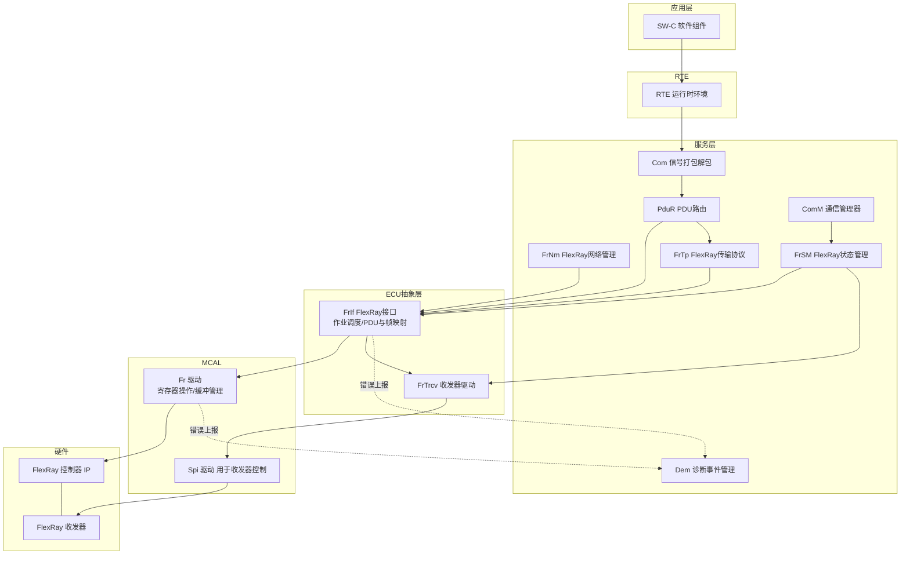

各层职责一句话说清：

- **Fr（MCAL 驱动）**：直接操作控制器寄存器，提供 `Fr_Init`、`Fr_StartCommunication`、`Fr_TransmitTxLPdu`、`Fr_ReceiveRxLPdu` 等标准 API。它**不知道信号，只知道 LPdu 和缓冲号**。
- **FrIf（接口层）**：核心是**作业列表（Job List）**——一张按时间排布的表，规定"在周期 X 的宏节拍 Y，执行第 Z 号作业"。它把 PDU 与帧（LPdu）建立映射，并驱动收发时机。
- **FrSM（状态管理）**：管理"网络该不该通信"的状态机，处理启动、唤醒、休眠、重启。
- **FrNm / FrTp**：网络管理与大数据分段传输。

### 9.2 FrController 配置容器

`FrController` 描述一个物理 FlexRay 控制器实例的全部协议参数。它是 MCAL 配置里参数最多的容器。

| 配置项 | 对应协议参数 | 对应寄存器 | 说明与取值建议 |
|--------|------------|-----------|---------------|
| `FrCtrlIdx` | — | — | 控制器索引，多控制器 ECU 用 |
| `FrBitRate` | `gdBit` | PRTC1.BRP | 10/5/2.5 Mbps，全网必须一致 |
| `FrSamplesPerMicrotick` | `pSamplesPerMicrotick` | PRTC1.SPP | 1 或 2，与 fclk 频率相关 |
| `FrMicroPerCycle` | `pMicroPerCycle` | GTUC1 | 节点相关，= 周期宏节拍数 × 每宏节拍微节拍数 |
| `FrMicroPerMacroNom` | `pMicroPerMacroNom` | GTUC3 | 由 fclk 与 gdMacrotick 推出 |
| `FrMacroPerCycle` | `gMacroPerCycle` | GTUC2 | **集群级，全网一致** |
| `FrMacrotickDuration` | `gdMacrotick` | 隐含 | 典型 1 µs |
| `FrNumberOfStaticSlots` | `gNumberOfStaticSlots` | GTUC7 | **集群级** |
| `FrStaticSlotLength` | `gdStaticSlot` | GTUC7 | **集群级**，单位 MT |
| `FrPayloadLengthStatic` | `gPayloadLengthStatic` | MHDC.SFDL | **集群级**，单位 16bit 字 |
| `FrNumberOfMinislots` | `gNumberOfMinislots` | GTUC8 | **集群级** |
| `FrMinislotLength` | `gdMinislot` | GTUC8 | **集群级** |
| `FrActionPointOffset` | `gdActionPointOffset` | GTUC9 | **集群级** |
| `FrMinislotActionPointOffset` | `gdMinislotActionPointOffset` | GTUC9 | **集群级** |
| `FrDynamicSlotIdlePhase` | `gdDynamicSlotIdlePhase` | GTUC9 | **集群级**，典型 0~2 |
| `FrSymbolWindow` | `gdSymbolWindow` | 隐含于周期计算 | **集群级**，不用可为 0 |
| `FrNit` | `gdNIT` | GTUC4 推导 | **集群级**，必须 > 最大偏移校正量 |
| `FrOffsetCorrectionStart` | `gOffsetCorrectionStart` | GTUC4 | 偏移校正施加起点 |
| `FrOffsetCorrectionOut` | `pOffsetCorrectionOut` | GTUC6 | 节点级，校正上限 |
| `FrRateCorrectionOut` | `pRateCorrectionOut` | GTUC6 | 节点级，校正上限 |
| `FrClusterDriftDamping` | `pClusterDriftDamping` | GTUC5 | 抑制校正震荡 |
| `FrDelayCompensationA/B` | `pDelayCompensationA/B` | GTUC5 | 传播延迟补偿，按线长估算 |
| `FrKeySlotId` | `pKeySlotId` | 缓冲0 的 FID | 本节点关键时隙号 |
| `FrKeySlotUsedForStartup` | `pKeySlotUsedForStartup` | SUCC1.TXST | **冷启动节点必须为 TRUE** |
| `FrKeySlotUsedForSync` | `pKeySlotUsedForSync` | SUCC1.TXSY | 同步节点为 TRUE |
| `FrColdStartAttempts` | `gColdStartAttempts` | SUCC1.CSA | **集群级**，2~31 |
| `FrListenTimeout` | `pdListenTimeout` | SUCC2 | 冷启动监听超时 |
| `FrListenNoise` | `gListenNoise` | SUCC2 | **集群级**，噪声容忍倍数 |
| `FrMaxWithoutClockCorrectionPassive` | 同名 | SUCC3 | **集群级**，降级阈值 |
| `FrMaxWithoutClockCorrectionFatal` | 同名 | SUCC3 | **集群级**，停机阈值 |
| `FrLatestTx` | `pLatestTx` | 缓冲配置 | 动态段最晚发送 minislot |
| `FrChannels` | `pChannels` | SUCC1.CCHA/CCHB | A / B / AB |
| `FrWakeupPattern` | `pWakeupPattern` | PRTC1.RWP | 唤醒模式重复次数 |
| `FrWakeupChannel` | `pWakeupChannel` | SUCC1.WUCS | 唤醒使用的通道 |
| `FrSingleSlotEnabled` | — | ALL_SLOTS 命令 | 启动后是否停留在单时隙模式 |
| `FrAllowPassiveToActive` | `pAllowPassiveToActive` | SUCC1.PTA | Passive 自动升 Active 的阈值 |

**标注为"集群级"的参数，在集群内所有节点上必须完全一致**——这是 FlexRay 配置最容易翻车的地方。笔者的做法：把集群级参数单独抽成一份 `cluster_timing.h`，所有节点工程共用同一个文件并纳入版本控制，从流程上杜绝不一致。

### 9.3 FrCluster 配置容器

`FrCluster` 描述整个集群的公共属性，多个 `FrController` 引用同一个 `FrCluster`。

| 配置项 | 说明 | 典型值 |
|--------|------|--------|
| `FrClusterId` | 集群标识 | 0 |
| `FrNumberOfChannels` | 通道数 | 2（冗余）/ 1 |
| `FrCycleDuration` | 周期时长（秒） | 0.005（5 ms） |
| `FrMaxSyncNodes` | 最大同步节点数 | 4~15 |
| `FrColdStartNodes` | 冷启动节点列表 | 至少 2 个 |
| `FrNetworkManagementVectorLength` | NM 向量长度 | 0~12 字节 |
| `FrTransmissionStartSequenceDuration` | TSS 长度 | 5~11 位 |
| `FrCasRxLowMax` | CAS 接收低电平最大值 | 67~99 位 |
| `FrClusterDriftDamping` | 集群漂移阻尼 | 0~10 |
| `FrMaxInitializationError` | 最大初始化误差 | 按精度计算 |
| `FrMaxDrift` | 最大漂移 | 按晶振精度计算 |
| `FrMaxPropagationDelay` | 最大传播延迟 | 按线长计算，0.0~2.5 µs |
| `FrMinPropagationDelay` | 最小传播延迟 | 通常 0 |

### 9.4 配置一致性校验清单

在做配置评审时，笔者会逐条核对下表。这张表是笔者多年踩坑积累的成果：

| 检查项 | 校验公式/条件 | 违反后果 |
|--------|--------------|---------|
| 周期长度自洽 | `gMacroPerCycle = NSS×gdStaticSlot + NMS×gdMinislot + gdSymbolWindow + gdNIT` | 硬件拒绝配置或周期错乱 |
| 静态时隙容纳最长帧 | `gdStaticSlot ≥ AP偏移 + 帧位数×gdBit/gdMacrotick + 传播延迟 + 精度余量` | 帧被截断，接收端持续报语法错 |
| 帧位数计算含 BSS | `位数 = TSS + 1 + (5+载荷+3)×10 + 2` | 用 ×8 会低估 20%，时隙不够 |
| NIT 容纳最大校正 | `gdNIT × gdMacrotick > pOffsetCorrectionOut × pdMicrotick` | 偏移校正施加不完，同步劣化 |
| 同步节点数 ≥ 2 | 集群内 `pKeySlotUsedForSync=TRUE` 的节点 ≥ 2 | 无法建立集群，或 FTM 无容错能力 |
| 冷启动节点数 ≥ 2 | `pKeySlotUsedForStartup=TRUE` 的节点 ≥ 2 | 单点失效导致全网无法启动 |
| 冷启动节点必为同步节点 | `TXST=1 → TXSY=1` | 配置非法，硬件拒绝 |
| 关键时隙唯一 | 各节点 `pKeySlotId` 互不相同 | 时隙冲突，总线争抢 |
| 集群参数全网一致 | 所有"集群级"参数逐字节相同 | 部分节点无法整合入网 |
| `pLatestTx` 合理 | `pLatestTx ≤ NMS - ceil(最长动态帧/gdMinislot)` | 动态帧越界侵入符号窗 |
| Fatal ≥ Passive | `gMaxWithoutClockCorrectionFatal ≥ Passive` | 直接跳过降级进入停机 |
| 双通道配置对称 | A/B 的时隙映射、帧配置完全一致 | 冗余失效 |
| Header CRC 正确 | 按 SYN/SUF/FID/PL 四字段计算 | 接收端全部报头部 CRC 错 |
| 载荷长度偶数字节 | `gPayloadLengthStatic` 以 16bit 字计 | 配置工具报错 |
| 微节拍精度足够 | `pdMicrotick ≤ 0.05 × gdMacrotick` | 时间分辨率不足，同步精度差 |

### 9.5 EB tresos / DaVinci 配置项映射

以两大主流工具为例，说明配置项在界面上的位置：

| 工具 | 模块路径 | 关键页签 |
|------|---------|---------|
| EB tresos Studio | `Fr` → `FrMultipleConfiguration` → `FrController` | General / Timing / Startup / MessageBuffer |
| EB tresos Studio | `FrIf` → `FrIfConfig` → `FrIfCluster` → `FrIfController` | JobList / FrIfFrameStructure / FrIfLPdu |
| EB tresos Studio | `FrSM` → `FrSMConfig` → `FrSMCluster` | 超时参数 / 启动重试 |
| Vector DaVinci Configurator | Basic Editor → `Fr` | Controller Config / Buffer Config |
| Vector DaVinci Configurator | Basic Editor → `FrIf` | Job List Editor（图形化时间轴） |
| Vector DaVinci Configurator | 网络导入 | FIBEX / ARXML 导入向导 |

**典型配置流程**（以 FIBEX 为输入）：

1. **网络设计**：在 CANoe 或专用工具中设计通信矩阵，导出 FIBEX（`.xml`）。FIBEX 里包含集群时序参数、所有帧定义、信号布局、节点-帧映射。
2. **导入配置工具**：DaVinci Configurator 或 EB tresos 导入 FIBEX/ARXML，自动填充 `FrCluster` 与 `FrController` 的时序参数、`FrIfFrameStructure` 的帧定义、`Com` 的信号布局。这一步是**自动的**，人工只需核对。
3. **人工补充节点相关参数**：`pMicroPerCycle`、`pMicroPerMacroNom`、`pDelayCompensationA/B`、`pSamplesPerMicrotick` 这些参数依赖具体 MCU 的时钟配置，FIBEX 里没有，必须手工填写。**这是最容易出错的一步**——填错 `pMicroPerMacroNom` 会导致本节点时基速率完全错误，永远无法整合入网。
4. **配置 FrIf 作业列表**：见 9.6 节。
5. **配置消息缓冲分配**：把每个 LPdu 绑定到具体的硬件缓冲号，规划消息 RAM 空间。缓冲数量有限（典型 64~128 个），若 LPdu 数量超过缓冲数，需要用接收 FIFO 或缓冲复用。
6. **生成代码**：工具生成 `Fr_Cfg.c/h`、`Fr_PBcfg.c`、`FrIf_Cfg.c/h`、`FrIf_PBcfg.c` 等文件，其中包含配置结构体常量数组。
7. **编译集成**：与 MCAL 驱动源码一起编译链接。

### 9.6 FrIf 作业列表与调用路径

**FrIf 作业列表（Job List）** 是整个 AUTOSAR FlexRay 栈的调度核心，也是最难理解的部分。它的本质是：**一张"在周期内的第几个宏节拍执行什么操作"的时间表**。

为什么需要它？因为 FlexRay 是时间触发的，软件必须在"正确的时间"把数据写入缓冲——太早会覆盖上一帧还没发出的数据，太晚则错过本周期的时隙。作业列表就是这张精确的时间安排。

作业列表由若干 **Job** 组成，每个 Job 包含：

- `FrIfCycleRepetition` / `FrIfCyclePosition`：本作业在哪些周期执行（周期复用）。
- `FrIfMacrotickOffset`：在周期内的第几个宏节拍执行。
- 一组 **JobListEntry**：具体动作，如 `FrIf_PrepareLPdu`、`FrIf_TransmitTxLPdu`、`FrIf_ReceiveRxLPdu`、`FrIf_CheckTxLPduStatus`。

硬件通过控制器的**绝对定时器中断（TIMER0）**触发 `FrIf_JobListExec_<ClusterIdx>()`，该函数执行当前 Job 的所有 Entry，然后重新配置定时器指向下一个 Job 的宏节拍偏移。这样就形成了一个"由硬件时基驱动的软件调度链"。

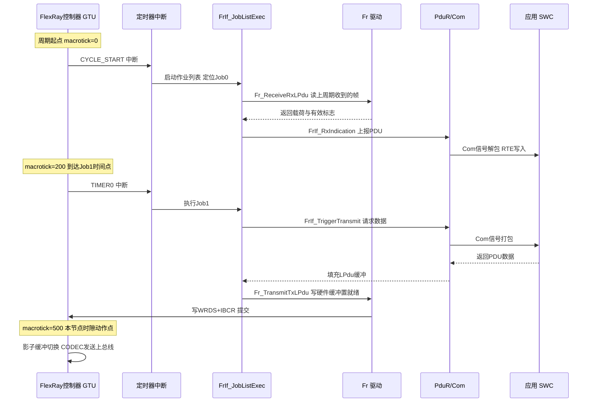

对应的代码调用路径（生成代码 + 手写胶水）：

```c
/*============================================================================
 * FrIf 作业列表执行示例（简化自生成代码的执行逻辑）
 *==========================================================================*/

/* 由配置工具生成的作业表常量（示意） */
typedef enum {
    FRIF_JOB_RECEIVE,
    FRIF_JOB_PREPARE_TX,
    FRIF_JOB_TRANSMIT,
    FRIF_JOB_CHECK_TX_STATUS
} FrIf_JobActionType;

typedef struct {
    FrIf_JobActionType action;
    uint16_t           lPduIdx;      /* LPdu 索引 */
} FrIf_JobEntryType;

typedef struct {
    uint16_t                 macrotickOffset;  /* 周期内触发时刻 */
    uint8_t                  cycleRepetition;  /* 1/2/4/8/16/32/64 */
    uint8_t                  cyclePosition;    /* 在重复周期内的位置 */
    uint8_t                  entryCount;
    const FrIf_JobEntryType *entries;
} FrIf_JobType;

/* 生成代码里的作业表实例 */
static const FrIf_JobEntryType Job0_Entries[] = {
    { FRIF_JOB_RECEIVE,     0U },   /* 接收转向角 */
    { FRIF_JOB_RECEIVE,     1U },   /* 接收车速   */
};
static const FrIf_JobEntryType Job1_Entries[] = {
    { FRIF_JOB_PREPARE_TX,  0U },   /* 准备本节点关键帧 */
    { FRIF_JOB_TRANSMIT,    0U },
};
static const FrIf_JobEntryType Job2_Entries[] = {
    { FRIF_JOB_PREPARE_TX,  1U },   /* 制动指令帧，仅偶周期 */
    { FRIF_JOB_TRANSMIT,    1U },
    { FRIF_JOB_CHECK_TX_STATUS, 0U },
};

static const FrIf_JobType FrIf_JobList[] = {
    { .macrotickOffset = 10U,   .cycleRepetition = 1U, .cyclePosition = 0U,
      .entryCount = 2U, .entries = Job0_Entries },
    { .macrotickOffset = 200U,  .cycleRepetition = 1U, .cyclePosition = 0U,
      .entryCount = 2U, .entries = Job1_Entries },
    { .macrotickOffset = 800U,  .cycleRepetition = 2U, .cyclePosition = 0U,
      .entryCount = 3U, .entries = Job2_Entries },
};
#define FRIF_JOB_COUNT  (sizeof(FrIf_JobList)/sizeof(FrIf_JobList[0]))

static uint8_t s_currentJob = 0U;

/*--------------------------------------------------------------------------
 * 作业列表执行函数：由 FlexRay 控制器绝对定时器中断调用
 * 命名遵循 AUTOSAR 规范：FrIf_JobListExec_<ClusterIdx>
 *------------------------------------------------------------------------*/
void FrIf_JobListExec_0(void)
{
    const FrIf_JobType *job = &FrIf_JobList[s_currentJob];
    uint8_t  i;
    uint8_t  curCycle;
    Fr_TxLPduStatusType txStatus;

    (void)FrIf_GetGlobalTime(0U, &curCycle, NULL);

    /* 周期过滤：只在匹配的周期执行本作业 */
    if ((curCycle % job->cycleRepetition) == job->cyclePosition) {

        for (i = 0U; i < job->entryCount; i++) {
            const FrIf_JobEntryType *e = &job->entries[i];

            switch (e->action) {
            case FRIF_JOB_RECEIVE:
            {
                uint8_t  lsduLen = 0U;
                Fr_RxLPduStatusType rxStatus;
                uint8 rxBuf[64];

                /* 调用 MCAL 驱动读硬件缓冲 */
                if (Fr_ReceiveRxLPdu(0U, e->lPduIdx, rxBuf,
                                     &rxStatus, &lsduLen) == E_OK) {
                    if (rxStatus == FR_RECEIVED) {
                        /* 上报给 PduR → Com → RTE → 应用 */
                        PduInfoType pduInfo;
                        pduInfo.SduDataPtr = rxBuf;
                        pduInfo.SduLength  = lsduLen;
                        PduR_FrIfRxIndication(e->lPduIdx, &pduInfo);
                    } else if (rxStatus == FR_NOT_RECEIVED) {
                        /* 本周期未收到：交给 Com 的接收超时监控处理 */
                    }
                }
                break;
            }

            case FRIF_JOB_PREPARE_TX:
            {
                /* 向上层索要最新数据：TriggerTransmit 模式 */
                PduInfoType pduInfo;
                static uint8 txBuf[64];
                pduInfo.SduDataPtr = txBuf;
                pduInfo.SduLength  = sizeof(txBuf);

                if (PduR_FrIfTriggerTransmit(e->lPduIdx, &pduInfo) == E_OK) {
                    FrIf_StoreLPduBuffer(e->lPduIdx, txBuf, pduInfo.SduLength);
                }
                break;
            }

            case FRIF_JOB_TRANSMIT:
            {
                const uint8 *buf;
                uint8 len;
                FrIf_LoadLPduBuffer(e->lPduIdx, &buf, &len);
                /* 调用 MCAL 驱动写硬件缓冲并置就绪位 */
                (void)Fr_TransmitTxLPdu(0U, e->lPduIdx, buf, len);
                break;
            }

            case FRIF_JOB_CHECK_TX_STATUS:
                /* 检查上一周期的帧是否真的发出去了 */
                if (Fr_CheckTxLPduStatus(0U, e->lPduIdx, &txStatus) == E_OK) {
                    if (txStatus == FR_NOT_TRANSMITTED) {
                        /* 动态段帧因 pLatestTx 限制被放弃，或时隙被守护阻断 */
                        Dem_ReportErrorStatus(DEM_FR_TX_NOT_SENT,
                                              DEM_EVENT_STATUS_FAILED);
                    }
                }
                break;

            default:
                break;
            }
        }
    }

    /* 推进到下一个作业，并重新装载硬件定时器 */
    s_currentJob++;
    if (s_currentJob >= FRIF_JOB_COUNT) {
        s_currentJob = 0U;
        /* 最后一个作业执行完，定时器指向下周期第一个作业 */
    }
    (void)Fr_SetAbsoluteTimer(0U, 0U,
                              (uint8)0U,   /* cycle filter */
                              FrIf_JobList[s_currentJob].macrotickOffset);
}

/*--------------------------------------------------------------------------
 * FrIf 主函数：处理非时间关键的周期性工作
 * 由 OS 任务以固定周期调用（如 5ms，与通信周期同频或降频）
 *------------------------------------------------------------------------*/
void FrIf_MainFunction_0(void)
{
    /* 状态轮询、超时监控、与 FrSM 交互 */
    FrIf_StateType state;
    if (FrIf_GetState(0U, &state) == E_OK) {
        if (state != FRIF_STATE_ONLINE) {
            FrSM_ReportState(0U, state);
        }
    }
}
```

**关于两种发送模式的选择**：

| 模式 | 数据来源 | 时机 | 适用场景 |
|------|---------|------|---------|
| Decoupled（解耦） | `PduR_FrIfTransmit` 主动推入 FrIf 缓冲 | 应用随时可调 `FrIf_Transmit` | 数据更新率低于通信周期 |
| Immediate/TriggerTransmit | FrIf 在作业时刻调 `TriggerTransmit` 向上索要 | 严格在发送前一刻取数 | **控制类信号首选**，数据最新鲜 |

对于线控系统，笔者强烈建议用 **TriggerTransmit** 模式：它保证发出去的是"距离发送时刻最近的一次采样"，而 Decoupled 模式可能发出一个周期前的陈旧数据。这个差异在控制环路里等价于额外增加了一个周期的死区时间，直接影响稳定裕度。

### 9.7 FrSM：状态管理与启动控制

`FrSM` 负责把 ComM 的"要不要通信"请求，翻译成 Fr 驱动的具体命令序列。它的状态机：

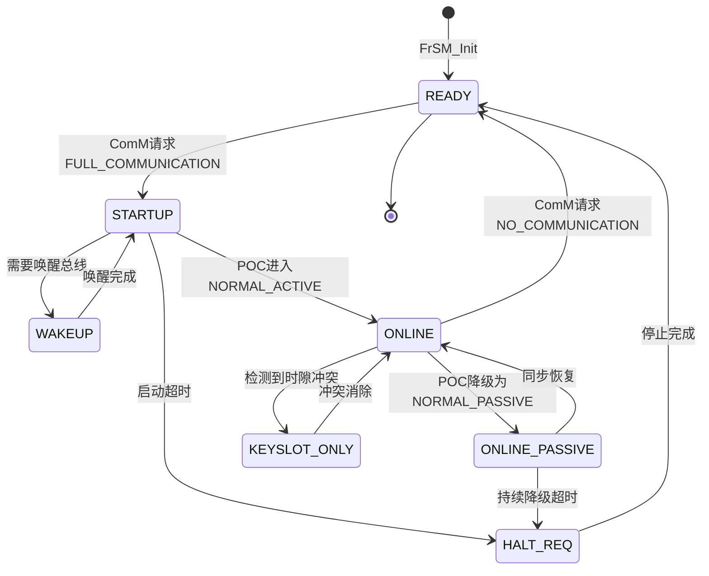

关键的 FrSM 配置参数：

| 配置项 | 说明 | 典型值 |
|--------|------|--------|
| `FrSMStartupRepetitions` | 启动失败后的重试次数 | 3~10 |
| `FrSMStartupRepetitionsWithWakeup` | 带唤醒的重试次数 | 2~5 |
| `FrSMDurationT1` | 启动阶段等待 POC 进入 NORMAL 的超时 | 100~200 ms |
| `FrSMDurationT2` | ONLINE_PASSIVE 允许持续的最长时间 | 50~100 ms |
| `FrSMDurationT3` | KEYSLOT_ONLY 模式的持续时间 | 20~50 ms |
| `FrSMCheckWakeupReason` | 是否检查唤醒原因 | TRUE |
| `FrSMIsWakeupEcu` | 本 ECU 是否负责唤醒总线 | 通常仅 1~2 个节点为 TRUE |
| `FrSMMainFunctionCycleTime` | FrSM 主函数调用周期 | 5~10 ms |

**KEYSLOT_ONLY 模式**值得单独说明：当 FrSM 检测到本节点发生了时隙冲突（多个节点抢同一时隙），它会命令控制器退回到"只发关键时隙"模式（即不发 ALL_SLOTS 命令），从而减少对总线的干扰，同时保持同步能力。冲突消除后再恢复全时隙。这是一个很实用的自愈机制。

### 9.8 调度表设计与抖动预算

调度表（通信矩阵）的设计与 FrIf 作业列表的设计是两件不同但耦合的事：

- **通信矩阵**决定"帧在总线上什么时候发"——这是硬件时序。
- **作业列表**决定"软件什么时候把数据准备好"——这是软件时序。

两者之间必须留足**软件抖动预算**。作业的 `FrIfMacrotickOffset` 必须满足：

```
作业执行时刻 + 作业最坏执行时间 + OS中断延迟抖动 < 帧的时隙动作点
```

举例：某帧在时隙 5，静态时隙长 100 MT，动作点偏移 10 MT，则该帧的发送动作点在周期内的第 `4×100 + 10 = 410` 个宏节拍（时隙从 1 开始编号）。若准备该帧的作业最坏执行时间是 30 µs（= 30 MT），中断延迟抖动最大 15 MT，那么作业的 macrotickOffset 必须 ≤ `410 - 30 - 15 = 365`。

**端到端延迟预算**的完整分解：

| 环节 | 延迟来源 | 典型量级 |
|------|---------|---------|
| 传感器采样 | ADC 转换 + 滤波 | 0.1~1 ms |
| 应用任务处理 | 控制算法计算 | 0.5~2 ms |
| Com 信号打包 | 位操作 | < 10 µs |
| FrIf 作业等待 | 从数据就绪到作业时刻 | 0~1 个通信周期 |
| 硬件缓冲提交 | IBF 搬运 + 影子切换 | < 20 µs |
| 时隙等待 | 从缓冲就绪到本节点时隙 | 0~1 个通信周期 |
| 帧传输 | 帧位数 × 位时间 | 20~100 µs |
| 接收缓冲搬运 | OBF 搬运 | < 20 µs |
| 接收侧作业 | 从收帧到作业读取 | 0~1 个通信周期 |
| 接收侧应用处理 | 控制算法 | 0.5~2 ms |

可以看到，**通信周期本身是延迟的主导项**——三个"0~1 个周期"的等待叠加，最坏可达 3 个周期。这就是为什么线控系统倾向于用较短的通信周期（1~2 ms 而非 5 ms），以及为什么要精心对齐"应用任务周期"与"通信周期"的相位。

**相位对齐技巧**：把应用任务用 FlexRay 的 CYCLE_START 中断触发（而非用独立的 OS 定时器），可以消除两个时基之间的漂移拍频，把"0~1 个周期"的不确定等待压缩成一个确定值。这是笔者在实际项目中屡试不爽的优化手段，通常能省下一整个周期的延迟。

### 9.9 双通道冗余的 MCAL 配置要点

双通道冗余不是"配置里勾一个 Redundancy 复选框"就完事的，它涉及多个层次的一致配置：

1. **控制器层**：`FrChannels = FR_CHANNEL_AB`，SUCC1 的 CCHA/CCHB 都置位。
2. **缓冲层**：每个需要冗余的 LPdu，其消息缓冲的 CHA/CHB 位都要置位。**注意：一个缓冲同时配 A/B 时，硬件会在两个通道上发送相同内容，且接收时任一通道有效即算收到。**
3. **FrIf 层**：`FrIfLPduIdx` 对应的 `FrIfChannel` 配置为 `FRIF_CHANNEL_AB`。
4. **应用层**：读取接收状态时要区分 `validOnA` / `validOnB`，用于冗余健康度监控（见 8.6 节代码）。

**非对称冗余配置**也是合法且常用的：安全关键帧走 AB 双通道，诊断/标定帧只走 A 通道。这样在不牺牲安全性的前提下节省了 B 通道带宽（B 通道可以承载额外的非冗余数据）。配置时只需把不同 LPdu 的通道属性分别设置即可。

**冗余验证的配置**：建议在诊断服务里实现一个"通道健康度"读取服务（如 UDS ReadDataByIdentifier），返回近 N 个周期内 A/B 各自的有效帧计数。产线下线检测时读取该数据，即可确认两条物理链路都真实工作——**这一步至关重要，因为如果 B 通道从未接过线，系统在正常运行时完全看不出异常，直到 A 通道故障那一刻才暴露。**

---

## 十、配置难点：调度表设计、时隙分配与带宽量化

FlexRay 的"软件"工作量主要不在驱动收发，而在**通信矩阵（Communication Matrix）的离线设计**——时隙分配、周期规划、参数标定是上车前就算好的。

### 10.1 调度表设计原则

调度表（Schedule）回答三个问题：谁、在哪个周期的哪个时隙、发什么帧。设计原则：

1. **关键帧优先占静态段前段**：刹车、转向等最关键的帧排在周期靠前位置，缩短其最坏延迟（最坏延迟 = 从周期起点到该时隙结束）。
2. **发送方与接收方的时隙顺序要顺**：如果节点 A 发的数据要被节点 B 在同周期内加工后再发出，那么 A 的时隙必须排在 B 的时隙之前，且中间要留够 B 的计算时间。否则 B 只能用上一周期的数据，白白多一个周期延迟。这叫**因果链排序**，是调度设计中最有价值的优化手段。
3. **静态时隙长度按最长帧统一**：协议强制所有静态时隙等长，因此要么把所有帧的载荷统一，要么接受小帧浪费带宽。
4. **周期复用（Cycle Multiplexing）**：用 Cycle Count 0–63 实现"同一时隙在不同周期发不同帧/或不发"，在不增加时隙数的前提下扩充逻辑帧数量。
5. **动态段留给非实时**：诊断、标定、事件日志放动态段，避免挤占静态资源。
6. **预留扩展时隙**：项目初期就预留 15%~20% 的空闲静态时隙。FlexRay 的时隙分配一旦上车就很难改（改一个节点要全网重新标定），预留余量是保命措施。

### 10.2 时隙分配与周期总长计算

```
gMacroPerCycle = gNumberOfStaticSlots × gdStaticSlot
               + gNumberOfMinislots  × gdMinislot
               + gdSymbolWindow
               + gdNIT

周期真实时长   = gMacroPerCycle × gdMacrotick
```

### 10.3 调度表（通信矩阵）示例表

下面是一张示意性的静态段调度表（仅示例，参数需按项目标定）：

| 时隙号 | Frame ID | 发送节点 | 通道 | 周期出现规则 | 载荷 | 内容 | 最坏延迟 |
|--------|----------|----------|------|--------------|------|------|---------|
| 1 | 1 | 转向角传感器 | A+B | 每周期 | 16 B | 方向盘转角/角速度 | 0.6 ms |
| 2 | 2 | 制动踏板传感器 | A+B | 每周期 | 16 B | 踏板行程/踏板力 | 0.7 ms |
| 3 | 3 | 车身姿态 IMU | A+B | 每周期 | 32 B | 三轴加速度/角速度 | 0.8 ms |
| 4 | 4 | 轮速传感器汇聚 | A+B | 每周期 | 16 B | 四轮转速 | 0.9 ms |
| 5 | 5 | 底盘域控（关键时隙） | A+B | 每周期 | 32 B | 同步帧 + 状态字 | 1.0 ms |
| 12 | 12 | 底盘域控 | A+B | 每周期 | 32 B | 转向电机指令 | 1.7 ms |
| 13 | 13 | 底盘域控 | A+B | 每周期 | 32 B | 四轮缸压指令 | 1.8 ms |
| 14 | 14 | 底盘域控 | A+B | 偶周期 | 32 B | 悬架阻尼指令 | 1.9 ms |
| 15 | 15 | 底盘域控 | A+B | 奇周期 | 32 B | 主动横向稳定杆指令 | 1.9 ms |
| 18 | 18 | 转向执行器 | A+B | 每周期 | 16 B | 转向电机实际位置/电流 | 2.3 ms |
| 19 | 19 | 制动执行器 | A+B | 每周期 | 16 B | 实际缸压/温度 | 2.4 ms |
| 20 | 20 | 网关 | A | Cycle 0/8/16… | 32 B | 与其他域的状态汇总 | 2.5 ms |

### 10.4 带宽与时序量化示例

空洞讲参数不如算一遍。假设某底盘域项目配置如下（演示用，非某车型真实值）：

- `pdMicrotick = 12.5 ns`（80 MHz 协议时钟）
- `gdMacrotick = 1 µs` → `pMicroPerMacroNom = 80`
- `gMacroPerCycle = 2000` → 通信周期 = **2 ms**
- 静态段：`gNumberOfStaticSlots = 20`，`gdStaticSlot = 70` MT = 70 µs
- 动态段：`gdMinislot = 6` MT，`gNumberOfMinislots = 80` = 480 µs
- 符号窗 `gdSymbolWindow = 20` MT = 20 µs
- NIT `gdNIT = 100` MT = 100 µs

校验周期自洽：20×70 + 80×6 + 20 + 100 = 1400 + 480 + 20 + 100 = **2000 MT** ✓

再校验静态时隙能否容纳 32 字节载荷的帧（10 Mbps，`gdBit` = 100 ns，TSS = 5 位）：

```
帧位数 = 5(TSS) + 1(FSS) + (5 + 32 + 3) × 10 + 2(FES) = 408 位
帧时间 = 408 × 100 ns = 40.8 µs

时隙需求 = gdActionPointOffset(5 MT) + 40.8 µs + 传播延迟(0.5 µs) + 精度余量(3 µs)
        ≈ 5 + 41 + 1 + 3 = 50 MT
```

配置的 70 MT > 50 MT，余量充足 ✓。这个余量还可以容纳未来把载荷扩展到 48 字节（帧时间 56.8 µs，总需求约 66 MT）。

**带宽利用率计算**：

- 静态段有效数据：20 时隙 × 32 字节 = 640 字节 / 2 ms = **2.56 Mbps**
- 静态段占用时间比：1400/2000 = 70%
- 静态段效率：2.56 / (10 × 0.70) = 36.6%

效率不高，主要损耗在：BSS 编码 20%、帧头帧尾 20%、时隙余量 29%。**这是确定性的代价，必须在项目立项时就纳入带宽规划**——不要按 10 Mbps 去估算能承载多少数据，实际可用的有效载荷带宽大约只有标称的 30%~40%。

---

## 十一、物理层、总线守护与故障容忍机制

### 11.1 物理层要点

FlexRay 每个通道是一对双绞线，采用**差分信号**：定义 Bus Plus（BP）与 Bus Minus（BM）两根线，接收端取二者差值，天然抑制共模干扰。总线有三种电平状态：

| 状态 | 差分电压 | 含义 |
|------|---------|------|
| Idle_LP | ≈ 0 V（低功耗） | 总线睡眠 |
| Idle | ≈ 0 V（有偏置） | 总线空闲，收发器已激活 |
| Data_1 | 约 +600 mV | 逻辑 1 |
| Data_0 | 约 −600 mV | 逻辑 0 |

总线两端必须配置正确的**终端电阻**（总线型两端各一个约 80~110 Ω 的分裂式终端，星型由有源耦合器内部集成），否则信号反射会引发误码。**分裂式终端**（两个电阻串联，中点通过电容接地）是推荐做法，它同时提供差分终端与共模终端，抑制共模噪声效果显著优于单电阻方案。

速率档位标准地支持 **2.5 Mbps / 5 Mbps / 10 Mbps** 三档。注意速率越高，对线缆质量、节点数与时延预算的要求越苛刻——10 Mbps 通常只在节点较少、线束较短的星型或短总线中使用。典型约束：10 Mbps 总线型拓扑，最多约 22 个节点、总长不超过 24 米；而 2.5 Mbps 可支持更长距离。

唤醒机制也值得一提：FlexRay 的唤醒不是发一个抽象"符号"就完事，而是网络上出现一段特定的**唤醒模式（WUP, Wakeup Pattern）**——由 2~63 个唤醒符号（WUS）组成，每个 WUS 由一段低电平（`gdWakeupTxActive`，典型 6 位时间）加一段空闲（`gdWakeupTxIdle`，典型 18 位时间）构成。接收端要求连续检测到至少 2 个符合 `gdWakeupRxLow` / `gdWakeupRxWindow` 时序约束的 WUS 才认可唤醒。这种"带时序验证的唤醒"能有效滤除噪声误唤醒。

### 11.2 总线守护（Bus Guardian）

**总线守护（Bus Guardian）** 是一块独立于通信控制器的硬件逻辑，它的唯一职责是：**强制节点只能在其被分配的静态时隙内，才被允许把发送器连接到总线上**。

为什么必需？因为 TDMA 秩序的基石是"各节点守时、不越界"。但软件可能跑飞、节点可能被错误驱动，在不属于自己的时隙里强行发帧——一旦得逞，就会破坏全网时隙独占性。Bus Guardian 相当于在物理发送通路前加了一道"硬件门禁"：即便节点软件在错误时刻请求发送，门禁也会切断通路。于是"一个疯节点"对全网的破坏被限制在本节点范围内。

Bus Guardian 有两种形态：

- **本地 Bus Guardian（Local BG）**：集成在节点内部（IP 内置或独立芯片），需要自己的时基。它的难点是"守护自己也需要时钟，而时钟可能就是出问题的那一环"——因此高安全实现会给 BG 配独立的时钟源。
- **中央 Bus Guardian（Central BG）**：集成在有源星型耦合器里，由星耦合器统一控制各分支的通断。它的优势是拥有独立于所有节点的视角，且天然能隔离故障分支。

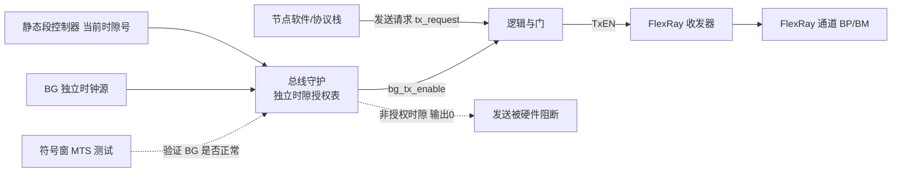

### 11.3 故障容忍与集群成员管理

FlexRay 用一组状态与计数参数把"网络如何容忍故障"工程化：

- **整合一致性检查**：普通节点上电后不是立刻参与，而要先连续正确接收若干通信周期，才认定"我加入了一个健康的集群"。这避免了在瞬态噪声下误入网络。
- **同步帧数量监控**：协议要求每个周期至少收到 2 个有效同步帧才能进行有效的时钟校正。少于 2 个时该周期判定为"无有效校正"。
- **两级降级**：`gMaxWithoutClockCorrectionPassive` → NORMAL_PASSIVE；`gMaxWithoutClockCorrectionFatal` → HALT。
- **冷启动尝试与监听噪声**：`gColdStartAttempts` 限定冷启动重试次数，`gListenNoise` 防止在纯噪声环境下误判"已有通信"。
- **FTM 容错中点**：丢弃极值，容忍拜占庭同步源。
- **Bus Guardian**：硬件门禁阻止越界发送。

这套机制的整体设计哲学是：**每一层都假设下一层可能出错，并在本层做出防御**。这正是功能安全要求的"深度防御（Defense in Depth）"。

### 11.4 时钟同步的数学表达

给出 FTM 算法的完整数学表述：

```
第 k 个周期，节点 i 收到来自节点 j 的同步帧，测量偏差：
    dev[j] = t_actual_arrival[j] - t_expected_arrival[j]

收集所有同步帧偏差，形成集合 D = {dev[1], dev[2], ..., dev[n]}
排序得到 D_sorted = {d_1 ≤ d_2 ≤ ... ≤ d_n}

根据 n 确定丢弃数 k：
    n ≤ 2       → k = 0
    3 ≤ n ≤ 7   → k = 1
    n > 7       → k = 2

丢弃后的集合 D' = {d_{k+1}, ..., d_{n-k}}

容错中点：
    FTM(D) = ( min(D') + max(D') ) / 2

偏移校正量：
    offsetCorrection = FTM(D_odd_cycle)

速率校正量（每双周期计算一次）：
    rateCorrection = ( FTM(D_odd) - FTM(D_even_prev) ) / 2

收敛判据：
    |offsetCorrection| ≤ pOffsetCorrectionOut
    |rateCorrection|   ≤ pRateCorrectionOut
    否则本周期判定为无有效校正
```

**为什么速率校正要除以 2？** 因为 `FTM(D_odd) - FTM(D_even_prev)` 测量的是**两个周期**内累积的相位漂移，而速率校正要施加到**每个周期**上，所以取平均。

**为什么用中点而非均值？** 均值会被离群值拉偏（即使丢弃了 k 个极值，剩余值中的轻微偏差仍会累加影响均值）；而中点只取剩余集合的最大最小值，对中间分布不敏感，稳定性更好。这是一个经典的鲁棒统计（Robust Statistics）设计。

### 11.5 工程配置工具链（CANoe FlexRay / FIBEX）

FlexRay 上车走一套标准化工具链：

- **FIBEX（Field Bus Exchange Format）**：基于 XML 的 ASAM 标准网络描述格式，承载 FlexRay 的通信矩阵——时隙分配、帧定义、信号布局、时序参数。它是不同厂商工具之间交换配置的"通用语言"。AUTOSAR 体系下也常用 ARXML 的 System Description 承载同样信息。
- **CANoe FlexRay 选件**：Vector 的 CANoe 提供 FlexRay 仿真、监控、帧解析与**故障注入**（断通道、注噪声、强制发错帧、模拟节点失效），是开发期验证确定性与冗余的核心环境。其 **Trace 窗口**可以按时隙对齐显示，直观看出哪个时隙谁在发、有没有冲突。**State Tracker** 可以可视化各节点的 POC 状态迁移，排查启动问题极为有效。
- **CANoe 的 FlexRay Statistics 窗口**：显示每个通道的同步帧数量、时钟校正值、错误计数，是判断"同步健康度"的第一手段。
- **节点栈生成**：FIBEX 导入 ECU 配置工具（DaVinci / EB tresos）后，自动生成 FlexRay 协议栈配置代码。

笔者的经验流程：

1. 先在 CANoe 里用**仿真节点**替代所有真实 ECU，验证通信矩阵本身自洽（周期长度、时隙不冲突、同步节点够）。
2. 逐个把真实 ECU 换进来（剩余节点仍用仿真节点补齐），这样能精确定位是哪个节点的配置有问题。
3. 全实车节点跑通后，做**故障注入矩阵**：断 A 通道、断 B 通道、杀掉冷启动节点 1、杀掉冷启动节点 2、注入噪声、模拟时隙冲突，逐项验证系统降级行为符合设计。
4. 做**温度循环测试**：在 -40 ℃ 到 +125 ℃ 全温区跑通信，监控时钟校正值的变化趋势。这一步能暴露抖动预算不足的问题，而常温测试永远发现不了。

### 11.6 FlexRay 与车载以太网 TSN 的演进关系

理解 FlexRay 最好的方式，是看它如何"长"成 TSN。二者并非割裂：

| FlexRay 机制 | TSN 对应机制 | 演进关系 |
|-------------|-------------|---------|
| 全局时基（宏节拍同步） | IEEE 802.1AS gPTP | 从专有算法到通用 PTP，FTM → BMCA + 主从层级 |
| 静态段 TDMA 时隙 | IEEE 802.1Qbv 时间感知整形 TAS | 从"节点级时隙"到"交换机端口级门控列表" |
| 动态段 FTDMA | IEEE 802.1Qav CBS / 尽力而为队列 | 从优先级仲裁到信用整形 |
| 双通道介质冗余 | IEEE 802.1CB FRER 帧复制消除 | 从"物理双通道"到"任意路径冗余" |
| Bus Guardian | IEEE 802.1Qci 每流过滤与策略 PSFP | 从"时隙门禁"到"流级别的时间窗过滤" |
| 动态段抢占静态段（不支持） | IEEE 802.1Qbu/802.3br 帧抢占 | TSN 新增能力，FlexRay 没有 |
| 254 字节 / 10 Mbps | 1500+ 字节 / 100M~10G | 带宽与帧长的数量级跃升 |

可以说，FlexRay 是把"时间触发确定性"思想在专有总线上做到了极致；而 TSN 把它搬到了通用以太网之上，并用更高带宽和更开放的生态接续了使命。掌握 FlexRay，等于拿到了理解 TSN 的钥匙。

值得注意的是，**FlexRay 有一点 TSN 至今仍难以完全复刻：它的确定性是端到端的、包含节点内部的**。FlexRay 的 Bus Guardian 和硬件时隙调度确保了"节点发送时刻"本身的确定性；而 TSN 的 Qbv 主要保证交换机内的确定性，端节点的发送时刻确定性仍依赖网卡与协议栈实现（虽然 802.1Qbv 也可以在端节点网卡上实现）。这也是为什么在最高安全等级的线控系统上，FlexRay 短期内仍未被完全取代。

---

## 十二、典型应用：线控转向、线控制动与主动悬架

### 12.1 Steer-by-Wire（线控转向）

线控转向彻底取消方向盘与转向轮之间的机械连接。方向盘转角传感器采集信号，经 FlexRay 静态段在亚毫秒级送达转向执行电机 ECU；同时路感模拟电机根据车速、路面反馈生成反向力矩回馈驾驶员。

FlexRay 在这里的三重价值：

1. **确定性**：转向指令走静态段，最坏延迟可解析计算并写入安全分析报告。
2. **冗余**：双通道保证单路故障不丢指令；配合双绕组电机、双 MCU 架构，构成完整的冗余链。
3. **大负载**：一帧可携带转角、角速度、转矩、有效性标志、E2E 保护数据等多个信号，避免拆帧带来的时序不一致（多帧到达时刻不同，会导致控制器用到不同时刻的采样值）。

关键设计点：**方向盘侧与车轮侧的时隙必须紧邻且顺序正确**。若方向盘传感器在时隙 1，转向域控在时隙 5，转向执行器在时隙 12，那么整个链路在一个通信周期内就能走完：传感器发 → 域控在时隙 1 和 5 之间计算 → 域控发指令 → 执行器在时隙 12 之后执行。若时隙顺序反了（域控在传感器之前），就要多等一个周期。

### 12.2 Brake-by-Wire（线控制动）

线控制动需要轮缸压力指令在毫秒内精确送达四个制动执行单元，并要求**四轮指令严格时间同步**——否则四轮制动力建立时刻不一致会导致制动跑偏、车身姿态失稳。

FlexRay 的解法很优雅：把四轮指令**打包在同一帧的同一个时隙里发送**。这样四个执行器在同一时刻收到同一帧，天然保证了同步性。如果用 CAN 发四个独立报文，四帧的到达时刻会因仲裁而分散，同步性无法保证。**这是 FlexRay 大负载能力的隐含价值：它让"多路信号时间一致"成为免费属性。**

### 12.3 主动悬架（Active Suspension）

主动/半主动悬架需要高频采集车身加速度、高度、姿态，并实时下发减振器阻尼/空气弹簧指令。控制环路频率通常在 500 Hz ~ 1 kHz，对应 1~2 ms 的通信周期。这类数据量大、实时性要求高，FlexRay 的 254 字节大负载与 10 Mbps 带宽恰好匹配。

主动悬架还常用 **Cycle Multiplexing** 优化带宽：车身高度这类慢变量每 8 个周期发一次，而加速度这类快变量每周期都发，共用同一个时隙。

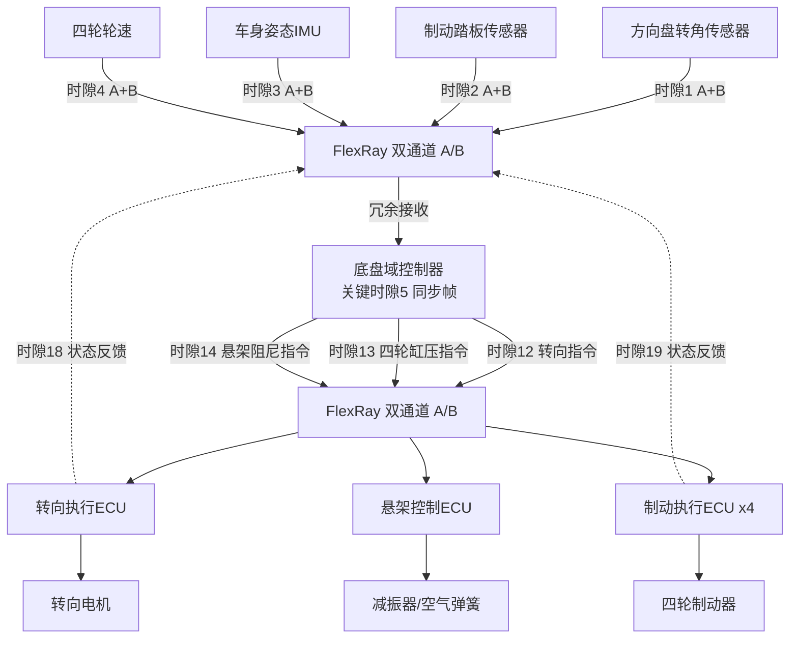

---

## 十三、常见坑与调试手段

笔者按"出现频率 × 排查难度"排序，列出实战中最值得警惕的问题。

**1. 集群参数不一致导致节点无法整合。** 这是 FlexRay 最高发的问题，没有之一。症状是某节点永远停在 INTEGRATION_LISTEN 或 INITIALIZE_SCHEDULE 状态。原因通常是 `gMacroPerCycle`、`gdStaticSlot`、`gNumberOfStaticSlots`、`gdActionPointOffset` 中的某一个与其他节点不一致。排查手段：用 CANoe 读出各节点的配置寄存器（或读 MCAL 生成的配置常量）逐项对比。**预防手段：集群参数单文件共享 + 配置哈希校验。**

**2. `pMicroPerMacroNom` 配错。** 这是节点级参数，FIBEX 里没有，必须手工算。算错的症状很有迷惑性：节点能收帧、能看到总线活动，但永远同步不上，且时钟校正值持续超限。排查：`pMicroPerMacroNom = gdMacrotick / pdMicrotick`，而 `pdMicrotick = 1 / (fclk / samplesPerMicrotick)`。一定要对照实际的时钟树配置计算，而不是抄别的项目。

**3. 静态时隙长度按 ×8 算导致帧截断。** 忘了 BSS 的 2 位/字节开销，算出的时隙比实际需要短 20%。症状是接收端持续报语法错误（SED），示波器上能看到帧发到一半下个时隙就开始了。**记住：×10，不是 ×8。**

**4. 全局时基失步导致整网静默或冲突。** 一旦冷启动节点异常、同步帧丢失，节点本地时钟漂移，时隙判断错位 → 要么不敢发（静默），要么抢槽（冲突）。用 FlexRay 分析仪抓同步帧与校正值，确认冷启动节点健康、同步帧数量 ≥ 2。

**5. 双通道冗余配置不对称。** A/B 通道若一边使能、另一边漏配，故障切换逻辑失效。务必确认两通道拓扑、终端电阻、时隙映射完全一致，并做"断一路"故障注入验证。**下线检测必须验证 B 通道真的接了线。**

**6. 冷启动节点单点风险。** 若只有唯一冷启动节点，它失效则全网无法启动。设计上应有至少 2 个（推荐 3 个）候选冷启动节点。此外，**冷启动节点必须同时是同步节点**（TXST=1 蕴含 TXSY=1）。

**7. NIT 被压得太短。** 为追求周期利用率把 NIT 压到极小，会导致偏移校正施加不完，长期漂移累积。硬约束：`gdNIT × gdMacrotick > pOffsetCorrectionOut × pdMicrotick`。

**8. `pLatestTx` 配错导致动态帧越界。** 配得太大，长动态帧会侵入符号窗甚至 NIT，破坏周期结构，症状是偶发的全网同步抖动。这个问题极难定位，因为它只在动态段满载时才出现。

**9. 终端电阻与拓扑不匹配。** 终端缺失或重复会引发反射、误码率飙升，表现为偶发帧 CRC 错误。用示波器看差分波形的过冲/振铃即可判断。推荐用分裂式终端。

**10. Cycle Multiplexing 收发不一致。** 同一时隙在不同 Cycle 承载不同帧时，若接收端 cycleCode 配置与发送端不匹配，会漏收或错收。务必保证收发双方的 `cycleRepetition` 与 `cyclePosition` 完全对应。

**11. IBF/OBF 忙标志未检查导致数据撕裂。** 驱动连续调用发送函数而不等 IBSYH 清零，会破坏正在搬运的数据。症状是偶发的帧内容错乱（前半是新数据，后半是旧数据）。**这是自研驱动最常见的 bug。**

**12. FrIf 作业时刻与时隙动作点冲突。** 作业执行太晚，数据还没写进缓冲，时隙就到了，结果发出的是上一周期的旧数据。症状是"数据总是慢一拍"。用 GPIO 翻转 + 示波器对照总线波形可以精确定位。

**13. 温度导致的边界失效。** 常温下一切正常，低温冷启动或高温长跑时出现失步。根因是抖动预算按常温晶振偏差计算，没覆盖全温区。必须做温度循环测试并监控校正值趋势。

**14. 调试手段总结**：

| 手段 | 适用问题 | 关键观察点 |
|------|---------|-----------|
| CANoe Trace（时隙对齐视图） | 时隙冲突、漏帧 | 每个时隙谁在发、有无重叠 |
| CANoe State Tracker | 启动失败、整合失败 | 各节点 POC 状态迁移轨迹 |
| CANoe FlexRay Statistics | 同步质量 | 同步帧数、校正值、错误计数 |
| 读控制器状态寄存器 | 本节点内部状态 | CCSV/CCEV/SFS/RCV/OCV |
| 示波器差分探头 | 物理层 | 电平幅度、过冲、TSS 长度、边沿质量 |
| GPIO 翻转 + 逻辑分析仪 | 软件时序 | 作业执行时刻 vs 时隙动作点 |
| 故障注入（断通道/注噪声） | 冗余与降级 | 切换是否无缝、DTC 是否正确上报 |
| 温度循环测试 | 抖动预算 | 全温区校正值趋势 |

---

## 十四、面试题精选（30 道含要点）

**协议原理层**

1. **FlexRay 为什么确定性强？**
   要点：静态段 TDMA 固定时隙 + 全局时基同步，每帧最坏延迟可解析计算，不靠竞争仲裁。

2. **静态段和动态段为什么要分两段？**
   要点：静态保关键控制确定性；动态段 FTDMA 灵活承载诊断/事件数据，提高带宽利用率。

3. **静态段的所有时隙必须等长吗？为什么？**
   要点：必须等长，由单一参数 `gdStaticSlot` 定义。简化硬件时隙计数器实现，代价是小帧浪费带宽，补偿手段是打包多信号进一帧。

4. **动态段里 Frame ID 大的帧为什么可能发不出去？**
   要点：动态段 minislot 总数固定，低 ID 帧先占用；`pLatestTx` 判定放不下就直接放弃本周期发送。

5. **microtick 和 macrotick 的区别？**
   要点：microtick 来自本地晶振、节点局部；macrotick 是网络统一调度单位，全网真实时长一致——这是调度表跨芯片可移植的根因。

6. **为什么换芯片平台后 FlexRay 调度表通常不用重画？**
   要点：调度表基于 macrotick，只要 macrotick 真实时长定义一致，时隙规划与芯片晶振无关，只需重算 `pMicroPerMacroNom`。

7. **NIT 的作用是什么？能为 0 吗？**
   要点：承载时钟同步校正的施加；不能为 0，且必须大于最大偏移校正量对应的时间。

8. **时钟同步算法包含哪两类校正？各自解决什么问题？**
   要点：偏移校正消除瞬时相位差（每奇周期）；速率校正消除晶振频率累积偏差（每双周期）。类比调钟：拨指针 vs 调钟摆。

9. **什么是 FTM 容错中点算法？为什么这样设计？**
   要点：对同步帧偏差排序、丢弃 k 个极值、取剩余最大最小的中点。丢极值容忍拜占庭故障源；取中点而非均值抗离群值拉偏。

10. **为什么单个节点无法独自建立 FlexRay 集群？**
    要点：Coldstart Consistency Check 要求至少第二个同步节点整合进来才算成功，防止单个坏节点建立错误时基。

11. **CAS 符号的作用是什么？**
    要点：冷启动仲裁。第一个发 CAS 的节点成为 leading coldstart node，其他监听到 CAS 的冷启动节点退出尝试转为整合。

12. **NFI 位是什么逻辑？**
    要点：反逻辑。NFI=0 表示空帧（载荷无效），NFI=1 表示正常帧。常见坑点。

13. **Header CRC 是硬件实时算的吗？**
    要点：通常不是。它保护的 SYN/SUF/FID/PL 四字段在运行期恒定，由配置工具离线计算后写入缓冲头部。

14. **计算帧传输时间时为什么要 ×10 而不是 ×8？**
    要点：每字节前有 2 位 BSS（Byte Start Sequence），提供边沿供接收端位同步。这是 FlexRay 25% 编码开销的来源。

15. **FlexRay 单帧最大负载多少？相比 CAN 的优势不只是"大"，还有什么？**
    要点：254 字节。除带宽外，更重要的是"多路信号打包在一帧"天然保证时间一致性（如四轮制动指令同步）。

**芯片与驱动层**

16. **FlexRay 控制器 IP 里的 GTU 包含哪些计数器？**
    要点：微节拍计数器、宏节拍生成器（可编程模数）、时隙计数器（A/B 各一个）、微时隙计数器、周期计数器（0-63）、时钟同步单元。

17. **为什么时隙计数器要分 A/B 两个？**
    要点：动态段两通道上的帧长度可能不同，minislot 消耗速度不同导致临时分叉；静态段两者始终相同。

18. **速率校正在硬件上是怎么实现的？**
    要点：动态修改宏节拍生成器的模数（`pMicroPerMacroNom + rateCorrection`），即改变每个宏节拍包含的微节拍数。

19. **偏移校正为什么必须在 NIT 内施加？**
    要点：NIT 是无通信时间，改变其实际微节拍数不会破坏任何时隙边界。这也是 NIT 必须大于最大校正量的原因。

20. **什么是影子缓冲？解决什么问题？**
    要点：每个缓冲有活动/影子两份副本，CPU 写影子、硬件用活动，在时隙边界原子交换。防止 CPU 写入与硬件读取并发导致的数据撕裂（半新半旧帧）。

21. **IBF 的 IBSYH 位是什么意思？不检查会怎样？**
    要点：主机半区忙标志，表示硬件正在搬运。不检查就连续写 WRDS/IBCR，会破坏正在搬运的数据，产生内容错乱的帧。自研驱动最常见 bug。

22. **配置寄存器为什么只能在 CONFIG 状态写？**
    要点：时序参数改变会使正在运行的调度失效；硬件在 CONFIG 状态下重建时隙映射表与内部流水线。

23. **控制器 IP 有几个时钟域？各有什么约束？**
    要点：主机时钟（与系统总线同频，可 DVFS）、协议时钟（40/80 MHz，必须高精度晶振，不能用抖动大的 PLL）、采样时钟（协议时钟分频，通常 8× 过采样）。

24. **DMA 与 FlexRay 控制器如何协作？要注意什么？**
    要点：DMA 搬运载荷到 WRDS 区，CPU 只需写 IBCR 触发提交。必须保证 DMA 完成后才写 IBCR，建议用 DMA 完成中断触发而非软件延时。

25. **从 HALT 状态如何恢复？**
    要点：HALT 是终止状态，不能直接回 NORMAL。必须经 CONFIG 重新初始化配置、重配缓冲、再发 RUN 重新入网。注意不要重复唤醒（会干扰仍在运行的其他节点）。

**MCAL 与工程层**

26. **AUTOSAR 里 Fr、FrIf、FrSM 各自的职责？**
    要点：Fr 是 MCAL 驱动，操作寄存器，只认 LPdu 和缓冲号；FrIf 是接口层，核心是作业列表（时间表），做 PDU↔帧映射与收发时机调度；FrSM 是状态管理，把 ComM 的通信请求翻译成启动/停止命令序列。

27. **什么是 FrIf 作业列表？为什么需要它？**
    要点：一张"周期内第几个宏节拍执行什么操作"的时间表，由控制器绝对定时器中断驱动。因为 FlexRay 是时间触发的，软件必须在正确时刻准备数据，太早会覆盖未发数据，太晚会错过时隙。

28. **Decoupled 与 TriggerTransmit 发送模式如何选？**
    要点：TriggerTransmit 在发送前一刻向上索要数据，数据最新鲜，控制类信号首选；Decoupled 可能发出一个周期前的陈旧数据，等价于额外增加一个周期死区时间。

29. **哪些配置参数必须全网一致？配错了什么症状？**
    要点：所有 `g` 前缀的集群级参数（`gMacroPerCycle`、`gdStaticSlot`、`gNumberOfStaticSlots`、`gdActionPointOffset`、`gdNIT` 等）。配错症状是该节点永远停在 INTEGRATION 状态无法入网。

30. **FlexRay 有效载荷带宽利用率大约多少？损耗在哪？**
    要点：静态段实际有效带宽约为标称的 30%~40%。损耗来自 BSS 编码 20%、帧头帧尾开销约 20%、时隙抖动余量约 30%。项目立项估算带宽时必须按此折算。

31. **什么是 Bus Guardian？为什么它必须有独立的配置和时钟？**
    要点：硬件门禁，仅在授权时隙放行发送。若与发送逻辑共用配置或时钟，则配置/时钟故障会同时击穿守护与发送，守护失去意义。

32. **FlexRay 与 TSN 的对应关系？**
    要点：全局时基↔gPTP(802.1AS)、静态段时隙↔Qbv 时间感知整形、双通道冗余↔802.1CB FRER、Bus Guardian↔Qci 每流过滤。TSN 额外提供帧抢占（Qbu/802.3br），FlexRay 没有。

33. **什么场景不应选 FlexRay？**
    要点：成本敏感、带宽需求低、无硬实时要求的车身/舒适节点用 LIN/CAN；已有 TSN 交换机的域控/中央计算架构中，优先车载以太网 TSN。

34. **通信矩阵设计最常见的错误？**
    要点：时隙长度忽略 BSS 开销与抖动预算；因果链排序错误（下游节点时隙排在上游之前，白白多一个周期）；动态段承载有截止期的信号；未预留扩展时隙。

---

## 十五、总结

FlexRay 用"时间触发 + TDMA 静态段 + FTDMA 动态段 + 双通道冗余 + 两层时间基准 + Bus Guardian"这一套组合拳，在车载网络史上第一次把**可计算最坏延迟**与**高带宽**同时交到工程师手里，成为线控转向、线控制动、主动悬架等安全关键系统的通信基石。

本文从三个层次做了纵向贯通：

- **协议层**回答"为什么这样设计"：时间触发的哲学、TDMA 的独占性、FTM 的容错性、两层时基的可移植性。
- **芯片层**回答"硅片里怎么实现"：GTU 的计数器体系、影子缓冲的一致性保证、双通道 CODEC 的独立性、Bus Guardian 的硬件门禁、寄存器位域与中断/DMA 协作。
- **工程层**回答"项目上怎么落地"：MCAL 的 Fr/FrIf/FrSM 分层、作业列表的时间安排、集群参数一致性校验、抖动预算的量化计算、故障注入的验证矩阵。

对工程师而言，掌握 FlexRay 的关键不在于记参数，而在于理解四件事：**时隙为何能不冲突（全局时基对齐 + Bus Guardian 门禁）、最坏延迟为何能算（静态段固定位置 + 因果链排序）、冗余为何可靠（双通道独立介质 + 共因失效隔离）、同步为何能长期稳定（FTM 容错中点 + 两类校正分工）**。这四点想通，无论面对 FlexRay 还是 TSN，确定性网络的底层逻辑都是同一套。

> 注：本文所述协议机制基于 FlexRay 2.1 规范公开知识体系，参数命名沿用规范习惯。第七章的寄存器映射与位域布局为**通用示意性设计**，用于说明控制器 IP 的实现逻辑，其组织方式与业界主流实现一致，但具体地址与位位置请以目标芯片参考手册为准。第八章代码为教学性实现，量产项目应使用经过认证的 MCAL 驱动。所有时序数值（`gdStaticSlot`、`gMacroPerCycle` 等）需依据芯片手册与整车时序需求离线标定，切勿照搬示例数值上车。

最后给一线工程师一句建议：FlexRay 的学习曲线陡，主要陡在"时间观"的重构——从"有数据就发"的事件思维，切换到"时间到了才发"的时基思维。初学者最容易犯的错，是用 CAN 的仲裁直觉去理解 FlexRay，结果卡在同步失步与冗余不对称上反复折腾。

笔者的建议路径是：**先把一个最小系统跑通**——两个节点、静态段 4 个时隙、都配成冷启动+同步节点、单通道、5 ms 周期，不要动态段、不要符号窗、不要 Bus Guardian。这个最小系统能跑通，说明你已经掌握了时序参数计算、冷启动流程、缓冲配置这三块最核心的能力。然后再逐步加：加第二个通道验证冗余、加动态段验证 FTDMA、加 Bus Guardian 验证门禁、加故障注入验证降级、加温度循环验证余量。每加一层都单独验证，不要一次性把所有特性堆上去——那样出了问题根本不知道从哪查起。

把时隙、时基、同步、守护、缓冲这五块吃透，再配合 CANoe FlexRay 实机跑一遍完整的故障注入矩阵，就能真正把"确定性"从概念变成手上可验证的能力。这也是笔者在整个职业生涯里反复验证过的、最有效的入门路径。