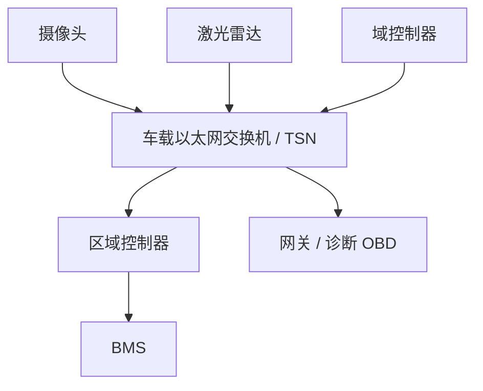

# 车载以太网：100BASE-T1 与 TSN 时间敏感网络

## 一、一个真实的工程场景

一辆 L3 智能驾驶汽车，车头挂着激光雷达，每秒产生上 G 字节的点云；环视摄像头要把原始视频送进域控做融合；同时 OTA 要在停车时把几个 G 的固件刷进各个 ECU。传统 CAN/CAN FD 那点带宽（最高 8 Mbps 数据段）连一个摄像头的零头都不够，FlexRay 的 10 Mbps 也力不从心，且成本与复杂度居高不下。

于是车载以太网登场。一根单对双绞线，跑 100 Mbps 甚至 1000 Mbps 全双工，把"带宽"这个瓶颈一举砸碎。但问题来了：以太网天生是"尽力而为（best-effort）"的，视频流、控制指令、诊断报文挤在同一根线里，交换机一拥塞，本该 1 毫秒到的制动指令可能被大视频包堵住几毫秒——对车来说这是不可接受的。

答案就是 **TSN（Time-Sensitive Networking，时间敏感网络）**：在标准以太网之上叠加一组实时增强标准，让"尽力而为"变成"说几时到就几时到"。对做域控、BMS 上位通信、OTA 的底层工程师，100BASE-T1 + TSN 是必须啃下的硬骨头。

## 二、核心原理：单对线全双工与 TSN 时间门控

**物理层：100BASE-T1 / 1000BASE-T1**。和传统办公网 100BASE-TX（两对双绞线，一对收一对发）不同，车载 T1 用**单对双绞线（UTP）**同时收发。怎么做到一根线全双工？靠**回声消除（echo cancellation）**：发送端知道自己发了什么，就从接收信号里把"自己发出的回声"减掉，剩下的就是对方来的信号。类比两个人用一根管子同时对着喊——你一边喊一边用耳机听，耳机里把你自己的回声滤掉，就能听清对方。这就是为什么 100BASE-T1 能单对线跑全双工，且相比 TX 省了一对线、更轻更便宜，契合汽车线束减重需求。

对比传统 100BASE-TX 仍常见于诊断/OBD（因为和测试设备兼容），车载骨干走 T1。

**TSN：给以太网装上"时刻表"**。标准以太网交换机按队列先到先发，大流一占就堵。TSN 用几个标准把时间确定性加回去：

- **gPTP（802.1AS）**：精确时间同步协议，让全网节点对齐到同一时间基准（亚微秒级）。这是所有时间门控的前提——没有统一时钟，"几时到"无从谈起。
- **Qav（802.1Qav）**：基于信用的整形（Credit-Based Shaper），给每路流量发"信用"，有信用才能发，平滑高带宽突发流，防止它饿死其他流。
- **Qbv（802.1Qbv）**：时间感知整形器（Time-Aware Shaper, TAS），核心武器。它维护一张**门控列表（Gate Control List）**，按 gPTP 统一时基，在精确时刻打开/关闭各个优先级的发送队列。关键控制流量（如制动指令）的队列只在预留的时间窗开放，其他流量被挡在窗外——于是关键帧绝不被大视频包抢占，最坏延迟可计算。

类比十字路口的信号灯：普通以太网是"谁先到谁走、大卡车一堵全堵"；TSN 是"给救护车预留专用绿灯窗口，到点才开，其他车一律等"。

> 图：典型车载以太网拓扑——摄像头/激光雷达/域控经 TSN 交换机汇聚，再经区域控制器与网关连接 BMS、诊断(OBD)等，骨干走 100/1000BASE-T1 单对线。



## 三、帧格式与 TSN 机制逐字段拆解

IEEE 802.3 以太网帧（车载常用）结构：

```
Preamble(7B) | SFD(1B) | Dst MAC(6) | Src MAC(6) | Type/Len(2) | Payload(46~1500B) | FCS(4) | IFG(12B)
```

| 字段 | 含义与作用 |
|------|------------|
| **Preamble** | 7 字节 0x55（交替 1/0），用于接收方比特同步、锁定时钟。 |
| **SFD** | 1 字节 0xD5（Start Frame Delimiter），标志帧正式开始，紧随其后就是 MAC 地址。 |
| **Dst MAC** | 目的 MAC 地址（6 字节），交换机据此转发。 |
| **Src MAC** | 源 MAC 地址（6 字节）。 |
| **Type/Len** | 2 字节：≥1536 解释为 EtherType（如 0x0800=IPv4，0x22F0=AVB/1722 音视频传输）；≤1500 解释为长度。 |
| **Payload** | 46~1500 字节载荷，承载 IP / UDP / 应用数据。 |
| **FCS** | 4 字节 CRC-32，覆盖 Dst/Src/Type/Payload（不含前导与 FCS 本身），检传输错误。 |
| **IFG** | 帧间间隔（Inter-Frame Gap，12 字节），两帧间的物理层静默，用于接收方恢复。 |

TSN 关键机制表（前文已述，此处补充"门控列表"视角）：

| 机制 | 标准 | 作用 |
|------|------|------|
| gPTP | 802.1AS | 全网精确时间同步（亚微秒），TSN 一切时间窗的基准 |
| Qav | 802.1Qav | 基于信用的整形（CBS），平滑高带宽流，防饿死 |
| Qbv | 802.1Qbv | 时间感知整形（TAS），按门控列表在精确时刻开关队列，给关键流量预留确定性时隙 |

**Qbv 门控列表（概念）**：

```
时刻 T0: 队列7(关键控制) 开, 队列0~6 关  → 只发制动/转向指令
时刻 T1: 所有队列开                  → 发视频/诊断等尽力流量
时刻 T2: 队列7 再开 ...
（循环往复，周期由 gPTP 时基驱动）
```

> 图：TSN Qbv 时间感知整形——按 gPTP 统一时基，门控列表在 T0 开放关键控制队列、挡住尽力流量，T1 再开放尽力队列，循环往复保障确定性。

```mermaid
gantt
    title TSN Qbv 门控列表（按 gPTP 时基循环）
    dateFormat X
    axisFormat %s
    section 关键控制队列(队列7)
    T0 开 : 0, 20
    T1 关 : 20, 60
    T2 开 : 60, 80
    section 尽力流量队列(0~6)
    T0 关 : 0, 20
    T1 开 : 20, 60
    T2 关 : 60, 80
```



## 四、配置与代码思路

车载以太网底层一般由 **MAC + PHY（T1 物理层收发器）** 组成，软件重点是 PHY 配置、MAC 过滤器、以及 TSN 栈（通常由交换机芯片/SoC 的 TSN 硬件 + 配置库实现）。下面是基于寄存器视角配置 T1 PHY 与启用 TSN 时间门的伪代码：

```c
/* 1) 配置 100BASE-T1 PHY：主从、回声消除、链路训练 */
void t1_phy_init(void)
{
    phy_write(PHY_CTRL,  PHY_MASTER_MODE);   /* 主节点提供时钟 */
    phy_write(PHY_MODE,  T1_100M_FULL_DUPLEX);
    phy_write(PHY_ECHO,  ECHO_CANCEL_ENABLE);/* 使能回声消除支持全双工 */
    while (!(phy_read(PHY_STATUS) & LINK_UP)); /* 等链路 up */
}

/* 2) 配置 MAC 接收过滤：只收本机 + 组播(关键流量组) */
void mac_filter_init(uint8_t *my_mac)
{
    mac_set_addr(my_mac);
    mac_enable_promisc(OFF);
    mac_add_mcast(CRITICAL_TRAFFIC_GROUP); /* 控制指令组播组 */
}

/* 3) 配置 TSN Qbv 门控列表（交给交换机/TSN 硬件） */
void tsn_qbv_setup(void)
{
    gate_open_queue(CRITICAL_QUEUE);     /* 关键队列 */
    gate_close_queue(BEST_EFFORT_QUEUE); /* 尽力队列先关 */
    /* 按 gPTP 时基，在每个周期 T0 开关键队列、T1 开放尽力队列 */
    qbv_load_gate_list(gate_schedule, cycle_ns);
    qbv_enable(GPTP_SYNCED);             /* 必须 gPTP 已同步才生效 */
}
```

实战要点：

- **PHY 主从必须明确**：100BASE-T1 链路一端是 Master（提供时钟）、一端是 Slave，配反了链路起不来。
- **gPTP 必须先同步**，Qbv 门控才有意义；同步丢失要触发安全降级（关键流量走预留窗口失败时的处理）。
- **线缆/连接器车规化**：T1 用 100Ω 阻抗匹配的单对线，非标线导致串扰、丢包、EMC 不过。

### 为什么是 100BASE-T1 而不是 1000BASE-T1

带宽不是越高越好，要看成本与功耗权衡。100BASE-T1 已能轻松承载摄像头（百兆级视频流）、域控间控制报文、OTA 差分升级包，且 PHY 芯片便宜、功耗低、对线束要求宽松，是当前量产主力。1000BASE-T1（千兆）则面向激光雷达点云、多路高清视频汇聚等真正需要 G 级带宽的域控骨干，代价是更严格的线束/连接器与更高 PHY 成本。工程选型时常见的误区是"一步到位上千兆"，结果线束成本翻倍、EMC 难过大，而实际流量根本用不满——合理的做法是按流量模型分层：传感器接入用百兆 T1，骨干汇聚才上千兆 T1。

## 五、常见坑与调试手段

1. **线缆阻抗不匹配导致高速丢包**。100BASE-T1 对 100Ω 阻抗、线对绞距、连接器要求严苛，用非车规线或接插件压接不良 → 串扰、反射、误码。调试用矢量网络分析仪（VNA）量回波损耗/S 参数；示波器眼图看信号质量。

2. **gPTP 未同步，TSN 确定性全失**。若把 Qbv 门控开了但 gPTP 时间基准没建立，各节点"时间窗"对不齐，关键流量照样被堵。务必先确认 gPTP 锁定（查同步状态寄存器 / 抓 PTP 同步报文），再启用 Qbv。

3. **门控列表规划错误造成带宽饿死或确定性失效**。窗口留太小 → 关键流量发不完；太大 → 尽力流量被饿死、视频卡顿。需要离线用流量模型算好周期与窗口占比，再做 HIL 实测。

4. **唤醒与低功耗协同复杂**。车载以太网支持唤醒帧（Wake-on-LAN 类），但休眠时 PHY 部分下电、唤醒源延迟、与 SBC 电源时序错配（类似 BMS 的 SBC 下电 400us vs MCU 200us 问题）会导致唤醒失败或误复位。需示波器抓唤醒信号与电源时序联合调试。

5. **调试手段**：车载以太网分析仪（如 Vector VN 系列）解析 AVB/TSN 流量、显示 gPTP 同步质量与门控命中；Wireshark 抓 UDP/TCP 载荷；PHY 寄存器读链路状态与误码计数。

## 六、面试高频要点

- **100BASE-T1 为什么单对线能全双工？** → 靠回声消除（echo cancellation）抵消本端发送对接收的干扰，单对双绞线实现全双工；对比 100BASE-TX 需两对线。
- **TSN 在车载为什么重要？** → 标准以太网是尽力而为，TSN 用 gPTP/Qav/Qbv 给关键控制流量预留确定性低延迟时隙，保障刹车/转向等实时帧不被视频大流阻塞。
- **gPTP 干什么？为什么是前提？** → 802.1AS 全网精确时间同步（亚微秒），Qbv 门控列表依赖统一时基，否则各节点时间窗对不齐、确定性失效。
- **Qbv 时间感知整形怎么保障关键流量？** → 用门控列表在精确时刻只开放关键队列，其他流量被挡在窗口外，避免抢占；最坏延迟可计算。
- **Type/Len 字段怎么区分类型还是长度？** → ≥1536 解释为 EtherType（如 0x0800=IPv4、0x22F0=AVB），≤1500 解释为长度；FCS(CRC-32) 覆盖 Dst/Src/Type/Payload，不含前导与 FCS 本身。
