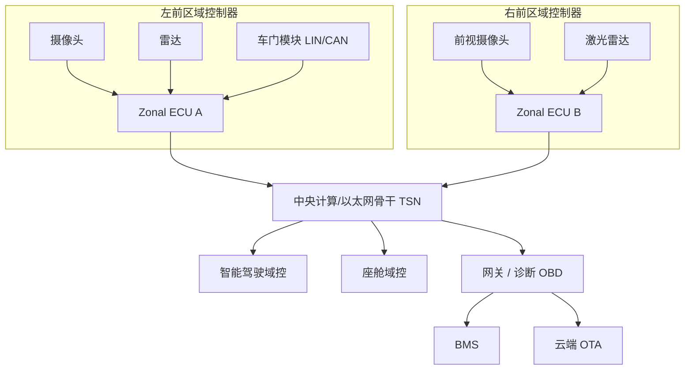
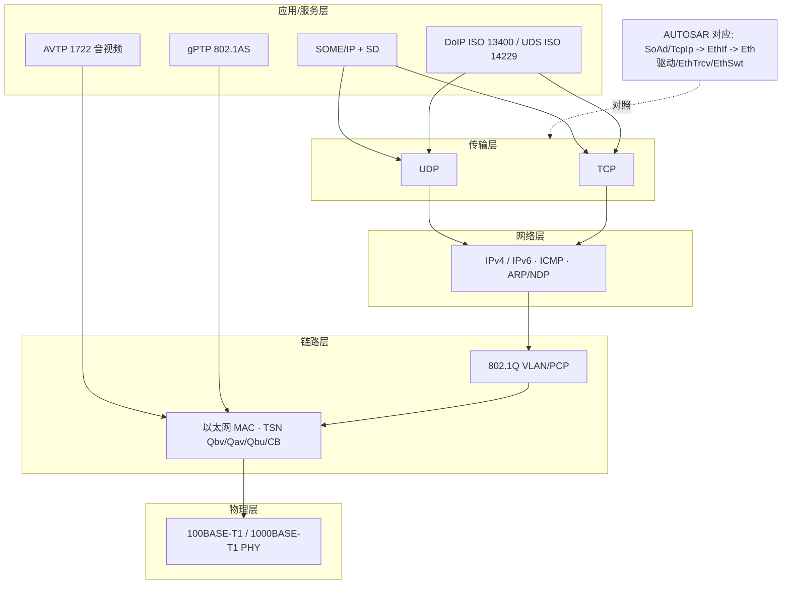
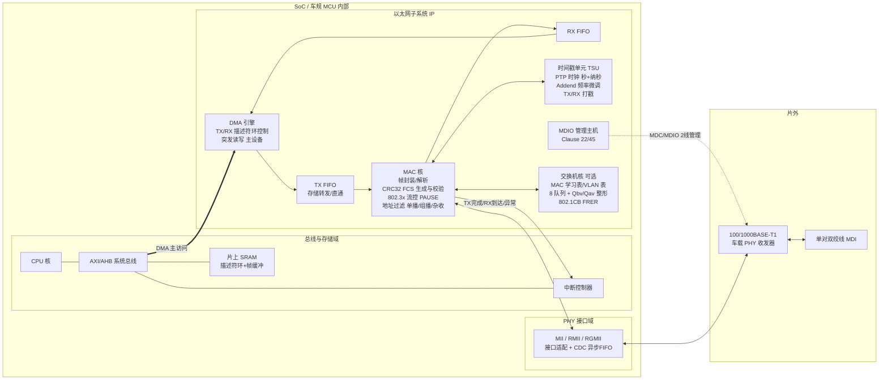
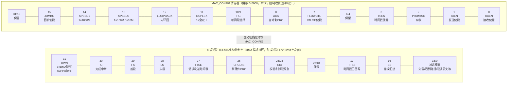
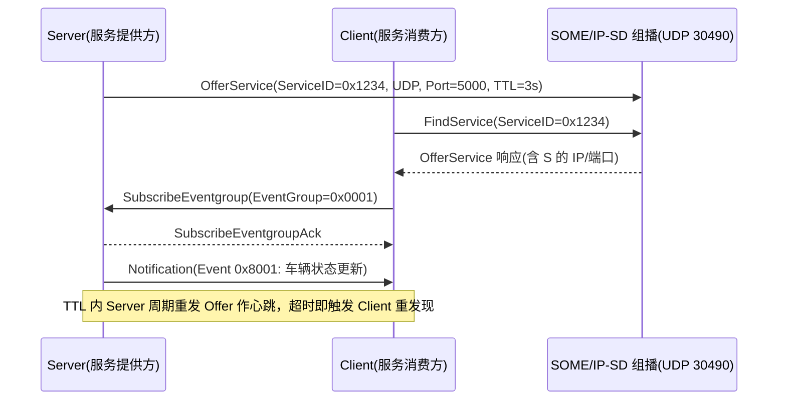
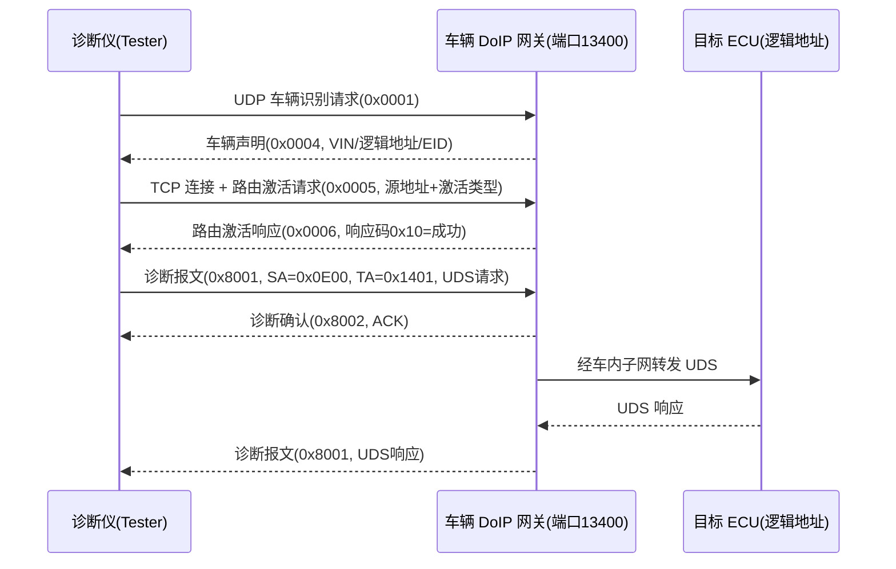
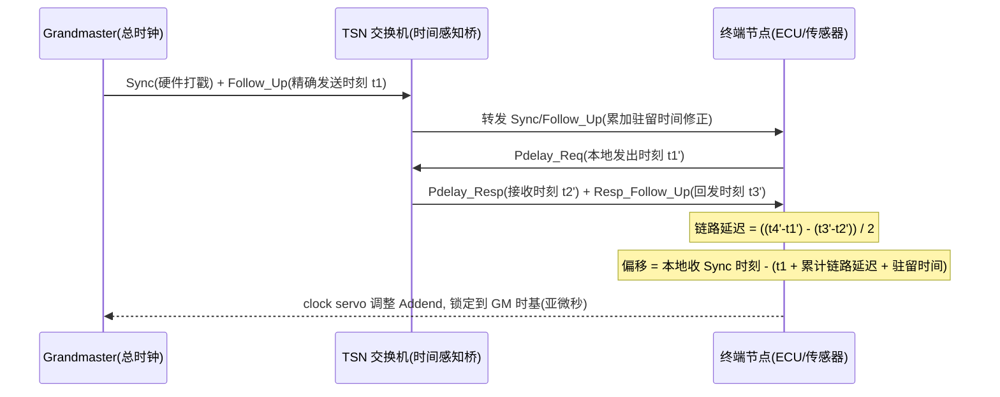
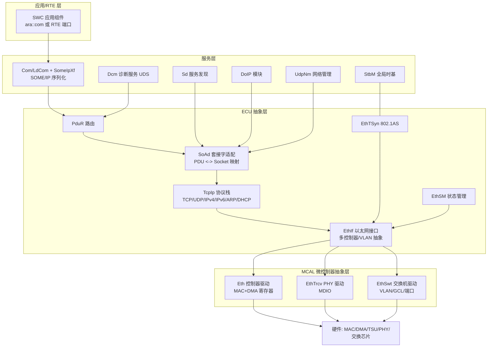
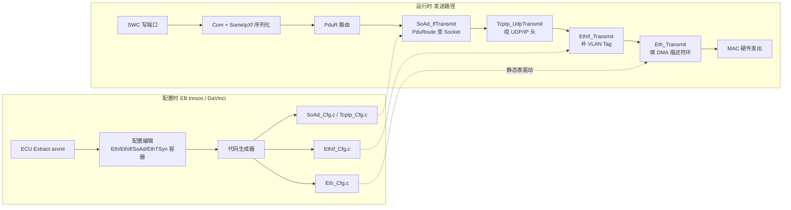

# 车载以太网与 TSN 时间敏感网络深度详解（含芯片模块设计、驱动实现与 MCAL 配置）

> 本章面向车载网络与以太网底层工程师、芯片/驱动开发者、系统架构师以及准备技术面试的从业人员，系统讲透车载以太网的演进动机、物理层原理、协议栈取舍、以太网 MAC/PHY 芯片模块设计（IP 内部架构与寄存器位域）、底层驱动代码实现（MAC 初始化、DMA 描述符环、SOME/IP 序列化、DoIP 传输、gPTP 同步）、AUTOSAR MCAL/BSW 配置（Eth/EthIf/SoAd/EthTSyn），以及面向服务的通信（SOME/IP）、基于 IP 的诊断（DoIP）、时间敏感网络（TSN）全套机制、交换与隔离、信息安全、工程调试与面试题精选。所有标准与概念均引用真实体系（IEEE 802.3bw/bp、OPEN Alliance、ISO 13400、AUTOSAR、IEEE 802.1AS/Qbv/Qav/CB 等），芯片模块部分采用通用 IP 框图与常见实现逻辑示意，参数不臆造。

---

## 一、车载以太网出现的根本动机

### 1.1 带宽需求的爆炸式增长

一辆搭载 L3 级智能驾驶系统的整车，前端激光雷达以 10～20 Hz 的帧率向外抛出点云，单帧即达数百 KB 到数 MB；环视与前视摄像头以原始 RGB 或 Bayer 格式输出，未经压缩的 800 万像素@30fps 视频流单路即可轻松突破 200 Mbps；座舱内多屏 4K 投屏、AR-HUD、驾驶员监控摄像头叠加在一起，构成了传统车载总线完全无法承载的数据洪流。

把这组数据放到传统总线的坐标里看：CAN 经典帧的数据段最长 8 字节，即便 CAN FD 把数据段拉长到 64 字节、标称速率推到 5～8 Mbps，其有效吞吐也仅够传递控制指令与标量信号，连一个摄像头零头的零头都塞不下；FlexRay 标称 10 Mbps（双通道 20 Mbps）在点对点确定性上做得不错，但拓扑僵化、节点数受限、协议栈昂贵且生态封闭；MOST 面向多媒体但只适合音视频环网、扩展性差。面对"摄像头原始数据、激光雷达点云、域控间融合结果、停车时数 GB 固件 OTA"四股洪流，传统总线在带宽维度上彻底失效。

### 1.2 电子电气架构的范式转移：从分布式到域集中再到区域架构

早期整车是"一个功能一个 ECU"的分布式拓扑，全车往往挂着七八十甚至上百个 ECU，靠 CAN/LIN 蛛网般互联。这种架构在功能膨胀时遭遇了线束长度、重量、可靠性与算力浪费的三重瓶颈。

随后行业走向**域集中架构（Domain Centralization）**：把功能相近的 ECU 收敛进少数几个域控制器（动力域、底盘域、车身域、智能驾驶域、座舱域），域内部仍可用 CAN/CAN FD，域与域之间、域与高带宽传感器之间则需要一条高速骨干。这条骨干正是车载以太网。

再进一步是**区域架构（Zonal Architecture）**：整车按物理区位划分若干区域控制器（Zonal ECU），就近汇聚该区位的所有执行器与传感器（无论低速 LIN/CAN 还是高速以太网摄像头），区域控制器再通过车载以太网骨干把聚合流量送往中央计算平台。区域架构把"功能域"打散成"物理域"，极大缩短了线束、简化了拓扑，也对以太网骨干提出了"既要高带宽又要确定性"的双重要求——这恰好是 TSN 登场的舞台。



### 1.3 ADAS 与信息娱乐的双重拉动

ADAS 对网络的要求是**确定性与低延迟并重**：感知融合、规划决策、执行指令链路必须可预测，一个本该 1 ms 抵达制动指令的帧如果被大视频包堵死几毫秒，对 L3 以上系统是不可接受的安全风险。信息娱乐则更看重**高吞吐与尽力而为的弹性**：流媒体、在线地图、应用商店下载，能容忍抖动但不能容忍带宽不足。

同一根以太网骨干要同时伺候这两类气质迥异的流量，仅靠标准以太网的"先到先发、尽力而为"是做不到的——于是必须在以太网之上叠加确定性增强机制，这就是 TSN。可以说，车载以太网解决"带宽够不够"，TSN 解决"关键时刻靠不靠谱"，二者是同一技术叙事的两面。

笔者在多个域控项目上的体会是：以太网上车从来不是单点技术替换，而是"物理层换线、链路层换芯、协议栈换代、开发流程换工具"的系统工程。理解全链条——从 PHY 的回声消除到 MAC 的 DMA 描述符环，从 SOME/IP 的服务发现到 AUTOSAR SoAd 的套接字映射——才能在整车项目中把问题定位到正确的层。

---

## 二、物理层：单对双绞线上的全双工魔法

### 2.1 100BASE-T1 与 1000BASE-T1 的定位

车载以太网物理层由 OPEN Alliance（源自 Broadcom 的 BroadR-Reach 技术，后经 OPEN Alliance SIG 推动并被 IEEE 标准化）定义了两条量产主线：

- **100BASE-T1（IEEE 802.3bw）**：在单对双绞线上实现 100 Mbps 全双工，是当前传感器接入与域间控制报文的主力。
- **1000BASE-T1（IEEE 802.3bp）**：单对双绞线 1000 Mbps 全双工，面向激光雷达点云、多路高清视频汇聚、中央计算骨干等真正需要 G 级带宽的场景。

需要区分的是办公网的 **100BASE-TX（IEEE 802.3u）**，它用两对双绞线（一对收、一对发）实现 100 Mbps，接口是熟悉的 RJ45。车载诊断口（OBD-II / DoIP 诊断仪接入）仍大量兼容 100BASE-TX 甚至 1000BASE-T（四对线），因为要和测试设备、产线设备互通；但车内骨干一律走 T1，原因就是 T1 更省线、更轻、更便宜、更契合汽车线束减重与 EMC 约束。此外，10BASE-T1S（IEEE 802.3cg）作为面向边缘执行器的多点共享介质以太网正在兴起，用于替换部分 CAN 场景，本章不展开。

| 对比项 | 100BASE-T1 | 1000BASE-T1 | 100BASE-TX（办公/诊断） |
|--------|-----------|-------------|------------------------|
| 速率 | 100 Mbps | 1000 Mbps | 100 Mbps |
| 线对数量 | 单对双绞线（1 对） | 单对双绞线（1 对） | 两对双绞线（共 4 芯） |
| 双工方式 | 全双工（回声消除） | 全双工（回声消除） | 全双工（独立收发对） |
| 编码/调制 | PAM3 / 4B3B + 3B2T | PAM4 / 均衡 + FEC | MLT-3 / 4B5B |
| 主从时钟 | 必须一端 Master 提供时钟 | 同左 | 各自独立时钟（无主从） |
| 典型用途 | 摄像头接入、域控控制报文、OTA | 激光雷达、骨干汇聚 | 诊断仪、产线、测试台架 |
| 线束/连接器 | 100Ω 车规单对线、小型化连接器 | 更严苛 100Ω 线对与连接器 | 标准 RJ45 / 四对线 |

### 2.2 单对线全双工的物理原理：回声消除

标准双绞线以太网靠"两对线、一对收一对发"实现全双工并不稀奇。T1 的难点在于**只用一对线同时收发还能互不干扰**。核心技术是 **回声消除（Echo Cancellation）**：

发送端在发出信号的同时，精确知道自己发了什么；接收端则从混合在线路上的总信号里，用自适应滤波器减去"本端发送造成的回声"，剩下的就是对端送来的信号。这要求收发器具备极高的模拟前端线性度、精确的时钟与强大的数字信号处理（DSP）。类比两个人共用一根管子同时喊话——你一边喊一边用降噪耳机听，耳机实时把你自己的回声抵消掉，于是能听清对方。

正因这套 DSP 复杂，T1 PHY 必须明确**主从角色（Master/Slave）**：链路一端是 Master，负责产生并发送时钟基准；另一端是 Slave，从接收信号中恢复时钟并锁定。主从配反，链路根本起不来——这是工程调试中最高频的"链路 up 不了"原因之一。T1 的主从角色通常在系统设计阶段静态指定（例如交换机侧为 Master、传感器侧为 Slave），并通过 PHY 的管理寄存器写死，而不是像办公网那样自动协商。

### 2.3 链路训练与车规化约束

T1 链路建立通常包含**链路训练（Link Training）**阶段：两端 PHY 互相交换训练序列，协商回声/串扰消除系数、均衡器抽头，补偿线损与串扰。车规环境还叠加了温度范围（-40℃～+105℃ 甚至更宽）、振动、油污与严苛 EMC（辐射发射 RE、抗扰 RI、静电 ESD）等要求。OPEN Alliance 还定义了 TC8（ECU 级以太网一致性测试）、TC9 等测试规范，量产件必须通过对应一致性测试。

线束本身必须满足 **100Ω 特性阻抗匹配**，绞距、屏蔽、连接器压接都要达标。阻抗失配会引发信号反射，高速下表现为误码率飙升、眼图闭合；非车规线或不良接插件是"高速丢包"的头号元凶，调试时需用矢量网络分析仪（VNA）测回波损耗与 S 参数、用示波器看眼图裕量。

### 2.4 为什么不是"一步到位上千兆"

很多团队初做选型时迷信"千兆一步到位"，结果线束成本翻倍、连接器难做、EMC 难过，而实际流量模型根本用不满 G 级。合理做法是**按流量分层**：传感器与执行器接入用 100BASE-T1（便宜、低功耗、对线要求宽松），仅在真正需要 G 级带宽的域控骨干、激光雷达汇聚口上用 1000BASE-T1。带宽不是越高越好，要看成本、功耗与可制造性的综合权衡。

### 2.5 调制、均衡与连接器选型

要在一对双绞线上塞进 100 Mbps 甚至 1000 Mbps，仅靠"发收同时"还不够，编码与调制效率同样关键。**100BASE-T1 采用 PAM3（三电平脉冲幅度调制）配合 4B3B 线路编码与 3B2T 转换**：每符号携带约 1.58 比特信息，在较低符号率下实现百兆速率，降低了对线对带宽的要求。**1000BASE-T1 则采用 PAM4（四电平）并配合更复杂的均衡、前向纠错（FEC）与自适应回声/串扰抵消**，以更高符号率与更高阶调制换取 G 级吞吐。调制阶数越高，对信噪比、抖动、线对一致性的要求越苛刻——这正是千兆线束与连接器成本陡增的根本原因。

接收端必须依靠**自适应均衡器（FFE/DFE）与 DSP**补偿线损、符号间干扰（ISI）与串扰。线缆越长、绞距越不均、连接器阻抗越偏离 100Ω，均衡器需要补偿的损耗越大，眼图裕量越小，误码率越高。工程上对新车型要做整链路的"信道建模 + 眼图仿真 + VNA 实测"三段闭环，确认在最恶劣温度、最长线长、最差连接器组合下仍有足够裕量。

连接器方面，车载 T1 普遍采用小型化、带锁扣、抗振的车规连接器（如 OPEN Alliance 相关规范定义的单对以太网连接器），而非办公 RJ45。选型时需同时校验：机械锁定可靠性（防松脱）、屏蔽完整性（防 EMI 泄漏）、阻抗连续性（防反射）、以及可制造性（压接/焊接良率）。一个劣质连接器可能让一条本可达标的链路在整车振动与温度循环后频繁掉线，这类问题在台架常温测试里往往发现不了，必须在环境应力筛选（ESS）与路试中暴露。

### 2.6 EMC 与功能安全的协同约束

车载以太网处于强干扰环境：电机驱动、点火系统、DC-DC 变换器都是宽带噪声源。T1 链路为降成本常采用非屏蔽或轻屏蔽线对，抗扰更依赖**平衡传输、共模抑制、良好的接地与滤波**。设计上要遵循整车 EMC 布局规范：以太网走线远离大电流线束、避免平行长距离走线、连接器处做好共模扼流与 TVS 防护。同时，以太网通信故障若影响安全相关功能（如制动、转向），需按 ISO 26262 做 ASIL 等级的功能安全分析，定义通信失效的检测手段（如超时监控、端到端保护 E2E、CRC 校验）与可控降级策略，确保单点通信故障不致引发危害。

---

## 三、车载以太网协议栈与 TCP/UDP/IP 取舍

### 3.1 标准 TCP/IP 协议栈回顾与车载映射

车载以太网沿用经典 TCP/IP 四层/五层模型：应用层（SOME/IP、DoIP、HTTP、TLS 等）跑在传输层（TCP/UDP）之上，网络层是 IP（IPv4 为主，IPv6 在逐步导入），链路层是以太网 II 帧 + 车载 PHY。车载一般不搞 ARP 广播风暴那一套的粗放玩法，而是配合静态配置、LinkLocal 地址（169.254.0.0/16，RFC 3927）与 SOME/IP-SD 的服务发现。下图给出车载以太网协议栈的分层全景，并标注 AUTOSAR BSW 中对应的模块位置——这张图是后文"MCAL 配置"章节的路线图。



注意两个"绕过 IP 层"的角色：AVTP（IEEE 1722 音视频传输，EtherType 0x22F0）与 gPTP（802.1AS，EtherType 0x88F7）都直接封装在二层以太网帧里，不走 UDP/IP——因为它们要的是最低封装开销与硬件时间戳的直接配合。

### 3.2 UDP 与 TCP 在车上的取舍

- **UDP**：无连接、无重传、零握手延迟、头部开销仅 8 字节。适合**周期性传感器数据、控制指令、音视频流**——这类流量要么对延迟极度敏感（控制指令宁可丢一帧也不要等重传），要么本身有应用层冗余/前向纠错（音视频）。车载实时通信绝大多数建立在 UDP 之上：SOME/IP 的事件通知、DoIP 的车辆发现均基于 UDP。
- **TCP**：面向连接、可靠、有序、带拥塞控制。适合**OTA 刷写、诊断大数据传输、云端通信、需可靠投递的配置同步**。代价是握手延迟、重传带来的延迟抖动、队头阻塞。对刷写这类"宁可慢点但绝不能错"的场景，TCP 的可靠性是刚需；对控制指令这类"宁可错丢不可迟滞"的场景，TCP 的拥塞退避反而有害。

实际工程中常见组合：**实时控制与感知走 UDP + SOME/IP，OTA/诊断大数据走 TCP（DoIP 诊断会话强制走 TCP），车云通信走 TCP + TLS**。传输层的选择本质上是在"延迟确定性"与"可靠投递"之间做架构级权衡。

### 3.3 IPv4 与地址规划

车载网络多为封闭私有网络，IPv4 链路本地地址（169.254.0.0/16）被广泛用于即插即用通信，无需 DHCP 服务器即可让节点自配地址（需做重复地址检测 DAD）。整车层面则常由网关做地址规划与 NAT/路由，把车内私有域与诊断仪、云端隔离开。IPv6 因地址空间与无状态自动配置（SLAAC）优势，在新一代区域架构中逐渐被引入，但存量兼容使 IPv4 在相当长时间内仍是主力。工程上建议把地址规划与 VLAN 规划联动设计：一个 VLAN 一个子网，网关做三层隔离，既清晰又便于防火墙按网段写规则。

---

## 四、芯片模块设计：以太网 MAC/PHY 子系统 IP 内部架构

这一章笔者从芯片/SoC 视角拆开以太网子系统，讲清一颗车规 MCU/SoC 里"以太网控制器"IP 的内部构造。理解硬件结构，是写好驱动、配好 MCAL、排查"帧发不出去/收不进来/时间戳不准"这类底层问题的前提。以下框图与寄存器均为**通用 IP 示意**，位域安排遵循业界常见实现逻辑（如常见商用 MAC IP 与车规 MCU 集成以太网控制器的普遍设计），具体芯片以数据手册为准。

### 4.1 子系统总体框图

一个典型车载以太网子系统由六大块构成：**MAC 控制器核、DMA 引擎与描述符环、PHY 接口（MII/RMII/RGMII + MDIO 管理）、时间戳单元（PTP/gPTP 硬件时戳）、可选的交换机核（多端口 + VLAN 表 + TSN 整形器）、以及与系统总线/SRAM 的互连**。



各模块职责如下：

**MAC 核**：实现 IEEE 802.3 的 MAC 子层——发送侧给负载加上前导码（Preamble）、帧起始定界符（SFD）、源/目的 MAC、EtherType，尾部计算并追加 32 位 CRC（FCS）；接收侧做帧定界、FCS 校验（错帧丢弃并计数）、长度合法性检查（64～1518/1522 字节，VLAN 帧 +4）、以及**地址过滤**：完全匹配本机单播地址、组播哈希过滤（把目的 MAC 哈希后查 64 位哈希表）、广播放行、以及调试用的杂收（Promiscuous）模式。全双工下还实现 802.3x 流控：接收到 PAUSE 帧则暂停发送指定时间；本端 RX FIFO 水位过高时主动发出 PAUSE 帧反压对端。车载全双工点对点链路无碰撞，CSMA/CD 逻辑虽在 IP 里保留（半双工兼容）但基本不用。

**DMA 引擎与描述符环**：驱动性能的核心。CPU 不逐字节搬帧数据，而是在 SRAM 里维护**发送描述符环（TX Ring）与接收描述符环（RX Ring）**，每个描述符记录一块缓冲区的地址、长度、状态标志。DMA 作为总线主设备（Bus Master）按环顺序取描述符、突发（Burst）搬移帧数据进出 FIFO，完成后回写状态并可触发中断。这套机制实现了**零拷贝**：协议栈把负载直接组装在 DMA 可达的缓冲区里，全程无 CPU memcpy。

**PHY 接口**：MAC 与 PHY 之间的数据接口有三种常见形态——**MII**（介质无关接口，4 位数据 @25 MHz，适配 100 Mbps，引脚多达 16 根）、**RMII**（精简 MII，2 位数据 @50 MHz，引脚减半，常见于 100 Mbps 低成本方案）、**RGMII**（精简千兆 MII，4 位数据双沿采样 @125 MHz，适配 10/100/1000 Mbps，是 1000BASE-T1 场景的主流选择）。部分集成度更高的方案用 SGMII（串行千兆）省引脚。接口域与 MAC 内核域时钟不同，中间必须有跨时钟域（CDC）异步 FIFO。管理面则统一走 **MDIO（MDC 时钟 + MDIO 双向数据两根线）**：Clause 22 帧格式可访问 32 个 PHY 地址 × 32 个 16 位寄存器；车载 T1 PHY 的扩展寄存器多、普遍要求 Clause 45（设备地址 + 16 位寄存器地址空间）或经由 Clause 22 的间接访问寄存器（Reg 13/14）访问。

**时间戳单元（TSU）**：gPTP 亚微秒同步的硬件基石。内部维护一个由"秒 + 纳秒"组成的 PTP 时钟，参考时钟经一个 **Addend（加数）寄存器**做小数分频式的频率微调——调 Addend 即可让 PTP 时钟以 ppb 级精度加快或减慢，这就是"驯服时钟（clock servo）"的执行机构。发送侧在 SFD 通过 MII 接口的瞬间锁存发送时间戳（回写进发送描述符或专用寄存器）；接收侧同理在帧到达时打上接收时间戳随描述符上送。打戳点越靠近物理层，路径延迟越确定，同步精度越高——这就是硬件时戳完胜软件时戳的原因。

**交换机核（集成于交换 SoC 或域控主芯片）**：多端口 MAC + 转发引擎——MAC 地址学习表（源 MAC + 端口学习，目的 MAC 查表转发，查不到则泛洪）、VLAN 表（每 VID 的成员端口位图与出口是否剥 Tag）、每端口 8 个出口队列（按 PCP 映射）、Qav 信用整形器与 Qbv 门控列表执行单元、802.1CB 的序列号生成/去重表。车载 TSN 交换芯片还内置每端口计数器（收发帧数、CRC 错、丢弃数），是网络健康监控的数据源。

### 4.2 寄存器与位域：MAC 控制、DMA 描述符与 MDIO

寄存器接口是驱动与硬件的契约。下面给出通用 MAC IP 的核心寄存器位域示意（32 位，偏移与位域为常见实现逻辑的示意安排）。



配套的寄存器全景（通用示意）用表格给出，便于对照驱动代码：

| 寄存器（示意偏移） | 名称 | 关键位域 | 作用 |
|---|---|---|---|
| 0x0000 | MAC_CONFIG | RXEN/TXEN/DUPLEX/SPEED/PROMISC/TSEN | 收发使能、速率双工、杂收、时戳总开关 |
| 0x0004 | MAC_FRAME_FILTER | PM(杂收)/HMC(组播哈希)/DBF(禁广播)/RA(全收) | 地址过滤策略 |
| 0x0008/0x000C | MAC_HASH_HI/LO | 64 位组播哈希表 | 组播过滤位图 |
| 0x0010 | MDIO_ADDR | PA[4:0] PHY地址 / GR[4:0] 寄存器号 / GW 写标志 / GB 忙标志 | MDIO 帧发起 |
| 0x0014 | MDIO_DATA | 16 位数据 | MDIO 读回/写入数据 |
| 0x0040/0x0044 | MAC_ADDR0_HI/LO | 48 位本机 MAC + AE 使能位 | 单播完全匹配地址 0 |
| 0x1000 | DMA_BUS_MODE | SWR 软复位 / PBL 突发长度 / DSL 描述符间距 | DMA 总线行为 |
| 0x100C/0x1010 | DMA_RX/TX_BASE | 环基地址 | 描述符环起始物理地址 |
| 0x1004/0x1008 | DMA_TX/RX_POLL | 写任意值 | 门铃：催 DMA 重新扫描环 |
| 0x1014 | DMA_STATUS | TI 发完/RI 收到/RU 无可用RX描述符/AIS 异常汇总 | 中断状态（写 1 清零） |
| 0x0700 | TS_CTRL | TSENA/TSCFUPDT 细调/TSINIT/TSUPDT | 时间戳单元控制 |
| 0x0708/0x070C | TS_SEC / TS_NSEC | 当前 PTP 时间 | 读取系统时基 |
| 0x0718 | TS_ADDEND | 32 位加数 | 频率微调（clock servo 执行点） |

PHY 侧的 MDIO 标准寄存器（IEEE 802.3 Clause 22 定义，所有 PHY 通用）：**BMCR（寄存器 0，基本模式控制）**——bit15 软复位、bit14 环回、bit13+bit6 组合出速率（10/100/1000）、bit12 自协商使能（T1 链路通常关闭自协商、静态配速率与主从）、bit8 双工；**BMSR（寄存器 1，基本模式状态）**——bit2 链路状态（latch-low 特性：掉过一次链路会锁存 0，需读两次取第二次值）；**PHYID1/2（寄存器 2/3）**——厂商 OUI 与型号，驱动探测 PHY 型号的依据。T1 PHY 的主从选择、链路训练状态、信号质量指示（SQI）等在厂商扩展寄存器或 Clause 45 的 PMA/PMD 设备地址空间中，例如 802.3bw 定义的 PMA 控制寄存器中含 Master/Slave 配置位——驱动移植到新 PHY 时，这部分是主要工作量。

### 4.3 DMA 描述符环与零拷贝协作

描述符环是理解以太网驱动的钥匙。以常见的"环形数组 + OWN 位"设计为例：

- 每个描述符含 4 个 32 位字：`des0` 状态/控制（含 OWN 位）、`des1` 缓冲区长度与环尾标志、`des2` 缓冲区物理地址、`des3` 第二缓冲区或时间戳回写位置。
- **OWN 位是 CPU 与 DMA 的所有权信号量**：CPU 填好描述符后把 OWN 置 1 移交 DMA；DMA 处理完（发完或收满一帧）把 OWN 清 0 归还 CPU 并回写状态。双方各自维护游标（驱动叫 `head/tail` 或 `cur/dirty`），互不越过对方，天然无锁。
- 发送路径：协议栈把帧组装在 DMA 可达缓冲区 → 驱动填 `des2` 地址与 `des1` 长度、置 FS/LS/IC/OWN → 写发送门铃寄存器（Poll Demand 或尾指针）→ DMA 突发读出数据推进 TX FIFO → MAC 加前导码与 FCS 串行发出 → DMA 回写状态、置完成中断。
- 接收路径：驱动预先为 RX 环每个描述符挂好空缓冲并置 OWN=1 → 帧到达、MAC 过滤与 FCS 校验通过 → DMA 写入缓冲、回写帧长与状态、OWN 清 0、触发 RI 中断 → 驱动中断/轮询中摘走满缓冲交协议栈，补挂新缓冲再移交 DMA。若驱动补环不及时、RX 环全被占满，DMA 置 RU（Receive Unavailable）状态并开始丢帧——这是高负载下"莫名丢包"的经典根因，抓包看不到、只有 MAC 丢帧计数器知道。

零拷贝的关键在于**缓冲区生命周期管理与缓存一致性**：帧缓冲必须放在 DMA 可访问的物理连续内存；带 D-Cache 的核上，发送前要 Clean（写回）缓存、接收后要 Invalidate（失效）缓存，或直接把描述符与缓冲区放进非缓存（Non-cacheable）的 MPU 区域——车规 MCU 驱动大多选择后者换取确定性。

### 4.4 时钟域与复位域

以太网子系统至少横跨四个时钟域：**总线时钟域**（AXI/AHB，CPU 访问寄存器与 DMA 搬数）、**发送时钟域**（MII 100M 为 25 MHz、RGMII 千兆为 125 MHz，由 PHY 或本地晶振提供）、**接收时钟域**（由 PHY 从线路恢复，随对端频偏漂移）、**PTP 参考时钟域**（TSU 计数时钟，要求稳定低抖动）。域间全部经异步 FIFO 或双触发器同步器过渡。复位设计上，DMA 软复位（DMA_BUS_MODE.SWR）会等待所有未完成的总线事务结束后才自清零——驱动初始化时必须轮询 SWR 清零再继续，且**若 PHY 未给出接口时钟（例如 RGMII 时钟来自 PHY 而 PHY 未上电），软复位会永远不结束**，这是"驱动初始化卡死"最隐蔽的原因之一，笔者建议初始化顺序永远是"先 PHY 供电与时钟、后 MAC 软复位"。

---

## 五、驱动代码实现：从 MDIO 到描述符环

本章给出一套可读的 C 驱动骨架，覆盖 MAC 初始化（含 MDIO 配置 PHY、速率/双工、地址过滤）、DMA 描述符环收发两大底层机制。寄存器名对应上一章的通用示意，移植时替换为具体芯片头文件即可。代码省略了部分错误分支以保持主干清晰，但保留了车规驱动必须有的超时保护。

### 5.1 MAC 初始化与 PHY 配置（MDIO）

```c
/* ============ eth_mac_init.c：MAC 初始化 + MDIO 配置 T1 PHY ============ */
#include <stdint.h>
#include <stdbool.h>

#define ETH_BASE            0x40028000UL
#define REG(off)            (*(volatile uint32_t *)(ETH_BASE + (off)))
#define MAC_CONFIG          REG(0x0000)
#define MAC_FRAME_FILTER    REG(0x0004)
#define MAC_HASH_HI         REG(0x0008)
#define MAC_HASH_LO         REG(0x000C)
#define MDIO_ADDR           REG(0x0010)
#define MDIO_DATA           REG(0x0014)
#define MAC_ADDR0_HI        REG(0x0040)
#define MAC_ADDR0_LO        REG(0x0044)
#define DMA_BUS_MODE        REG(0x1000)

/* MAC_CONFIG 位定义（对应 4.2 节位域图） */
#define CFG_RXEN    (1u << 0)
#define CFG_TXEN    (1u << 1)
#define CFG_DUPLEX  (1u << 11)
#define CFG_SPEED0  (1u << 13)   /* 1 = 100M（配合 SPEED1=0） */
#define CFG_TSEN    (1u << 3)

/* MDIO_ADDR 位定义 */
#define MDIO_GB     (1u << 0)    /* 忙标志 */
#define MDIO_GW     (1u << 1)    /* 1=写 0=读 */
#define MDIO_REG(r) (((uint32_t)(r) & 0x1F) << 6)
#define MDIO_PHY(p) (((uint32_t)(p) & 0x1F) << 11)

/* IEEE 802.3 Clause 22 标准 PHY 寄存器 */
#define PHY_BMCR    0x00         /* 基本控制 */
#define PHY_BMSR    0x01         /* 基本状态 */
#define BMCR_RESET  (1u << 15)
#define BMCR_ANEG   (1u << 12)   /* 自协商使能（T1 静态链路须清零） */
#define BMCR_SPD100 (1u << 13)
#define BMCR_FDX    (1u << 8)
#define BMSR_LINK   (1u << 2)    /* latch-low：读两次取第二次 */

static bool mdio_wait_idle(void)
{
    for (uint32_t t = 0; t < 100000u; t++) {
        if ((MDIO_ADDR & MDIO_GB) == 0u) return true;
    }
    return false;                       /* 超时：MDC 时钟或 PHY 供电异常 */
}

bool mdio_write(uint8_t phy, uint8_t reg, uint16_t val)
{
    if (!mdio_wait_idle()) return false;
    MDIO_DATA = val;
    MDIO_ADDR = MDIO_PHY(phy) | MDIO_REG(reg) | MDIO_GW | MDIO_GB;
    return mdio_wait_idle();
}

bool mdio_read(uint8_t phy, uint8_t reg, uint16_t *val)
{
    if (!mdio_wait_idle()) return false;
    MDIO_ADDR = MDIO_PHY(phy) | MDIO_REG(reg) | MDIO_GB;   /* GW=0 读 */
    if (!mdio_wait_idle()) return false;
    *val = (uint16_t)MDIO_DATA;
    return true;
}

/* T1 PHY 初始化：静态 100M 全双工，主从角色由板级参数决定。
 * 注意：Master/Slave 位在 802.3bw 的 PMA 控制寄存器（Clause 45 空间），
 * 不同 PHY 经厂商扩展页或 Reg13/14 间接访问，此处以回调抽象。 */
extern bool phy_vendor_set_master(uint8_t phy, bool master);

bool eth_phy_init_t1(uint8_t phy_addr, bool is_master)
{
    uint16_t v;
    if (!mdio_write(phy_addr, PHY_BMCR, BMCR_RESET)) return false;
    do {                                 /* 等待 PHY 软复位自清零 */
        if (!mdio_read(phy_addr, PHY_BMCR, &v)) return false;
    } while (v & BMCR_RESET);

    /* T1 无自协商：清 ANEG，强制 100M 全双工 */
    if (!mdio_write(phy_addr, PHY_BMCR, BMCR_SPD100 | BMCR_FDX)) return false;
    if (!phy_vendor_set_master(phy_addr, is_master)) return false;

    /* 等链路训练完成：BMSR.LINK 是 latch-low，读两次取第二次 */
    for (uint32_t t = 0; t < 500u; t++) {
        (void)mdio_read(phy_addr, PHY_BMSR, &v);
        if (!mdio_read(phy_addr, PHY_BMSR, &v)) return false;
        if (v & BMSR_LINK) return true;
        delay_ms(2);
    }
    return false;                        /* 训练失败：查主从/线束/对端 */
}

/* MAC 初始化：软复位 -> 地址 -> 过滤 -> 速率双工 -> 使能收发 */
bool eth_mac_init(const uint8_t mac[6], uint8_t phy_addr, bool is_master)
{
    /* 1. 先保证 PHY 供电与接口时钟，再做 DMA 软复位（见 4.4 节陷阱） */
    if (!eth_phy_init_t1(phy_addr, is_master)) return false;

    DMA_BUS_MODE |= 1u;                  /* SWR 软复位 */
    for (uint32_t t = 0; t < 100000u; t++) {
        if ((DMA_BUS_MODE & 1u) == 0u) break;
    }
    if (DMA_BUS_MODE & 1u) return false; /* 复位不结束=接口时钟缺失 */

    /* 2. 本机单播地址（完全匹配槽 0，HI 的 bit31 为地址使能 AE） */
    MAC_ADDR0_HI = 0x80000000u | ((uint32_t)mac[5] << 8) | mac[4];
    MAC_ADDR0_LO = ((uint32_t)mac[3] << 24) | ((uint32_t)mac[2] << 16)
                 | ((uint32_t)mac[1] << 8)  |  (uint32_t)mac[0];

    /* 3. 过滤策略：单播完全匹配 + 组播哈希（先全零=拒收组播），不杂收 */
    MAC_HASH_HI = 0u;  MAC_HASH_LO = 0u;
    MAC_FRAME_FILTER = (1u << 2);        /* HMC: 组播走哈希表 */

    /* 4. 速率/双工与 PHY 一致：100M 全双工，开硬件时间戳 */
    MAC_CONFIG = CFG_SPEED0 | CFG_DUPLEX | CFG_TSEN;

    /* 5. 使能收发（DMA 环初始化后再真正放行数据，见 5.2） */
    MAC_CONFIG |= CFG_TXEN | CFG_RXEN;
    return true;
}
```

几处值得强调的工程细节：其一，**MAC 的速率/双工必须与 PHY 实际链路一致**，否则表现为"链路灯亮但不通"；T1 静态链路下由软件保证一致，办公网 PHY 则要在自协商完成后读结果再回写 MAC。其二，**组播哈希表**要在加入 SOME/IP-SD 组播组（如 239.x.x.x 映射的 01:00:5E 开头组播 MAC）时动态置位，漏配的现象是"单播全通、服务发现收不到 Offer"。其三，所有 MDIO 与复位等待必须带超时并上报 DEM 故障事件，裸等死循环在车规代码里是不可接受的。

### 5.2 DMA 描述符环：发送与接收

```c
/* ============ eth_dma_ring.c：TX/RX 描述符环与中断处理 ============ */
#include <stdint.h>
#include <string.h>

#define TX_RING_SIZE  8
#define RX_RING_SIZE  16
#define BUF_SIZE      1536              /* 对齐到缓存行的最大帧缓冲 */

/* 通用 4 字描述符（对应 4.2 节 TDES0 位域图） */
typedef struct {
    volatile uint32_t des0;             /* 状态/控制：OWN/IC/FS/LS/TTSE/ES */
    volatile uint32_t des1;             /* [12:0] 缓冲长度, [25] 环尾 TER/RER */
    volatile uint32_t des2;             /* 缓冲区物理地址 */
    volatile uint32_t des3;             /* 时间戳回写低 32 位（使能 TTSE 时） */
} eth_desc_t;

#define D0_OWN   (1u << 31)
#define D0_IC    (1u << 30)
#define D0_FS    (1u << 29)
#define D0_LS    (1u << 28)
#define D0_TTSE  (1u << 27)
#define D0_ES    (1u << 16)
#define D1_TER   (1u << 25)             /* 环尾：DMA 回卷到基地址 */
#define RDES0_FL(x)  (((x) >> 16) & 0x3FFFu)  /* RX 回写帧长字段（示意） */

/* 描述符与缓冲放入非缓存段，规避 D-Cache 一致性问题（链接脚本定义） */
static eth_desc_t tx_ring[TX_RING_SIZE] __attribute__((section(".nocache"), aligned(16)));
static eth_desc_t rx_ring[RX_RING_SIZE] __attribute__((section(".nocache"), aligned(16)));
static uint8_t tx_buf[TX_RING_SIZE][BUF_SIZE] __attribute__((section(".nocache"), aligned(32)));
static uint8_t rx_buf[RX_RING_SIZE][BUF_SIZE] __attribute__((section(".nocache"), aligned(32)));

static uint32_t tx_head;                /* 下一个可填充的 TX 描述符 */
static uint32_t tx_dirty;               /* 下一个待回收的 TX 描述符 */
static uint32_t rx_cur;                 /* 下一个待处理的 RX 描述符 */

#define DMA_TX_BASE   REG(0x1010)
#define DMA_RX_BASE   REG(0x100C)
#define DMA_TX_POLL   REG(0x1004)
#define DMA_RX_POLL   REG(0x1008)
#define DMA_STATUS    REG(0x1014)
#define DMA_OPMODE    REG(0x1018)
#define ST_TI   (1u << 0)               /* 发送完成 */
#define ST_RI   (1u << 6)               /* 接收到帧 */
#define ST_RU   (1u << 7)               /* RX 环耗尽（开始丢帧！） */

void eth_ring_init(void)
{
    for (uint32_t i = 0; i < TX_RING_SIZE; i++) {
        tx_ring[i].des0 = 0;                          /* CPU 持有 */
        tx_ring[i].des1 = (i == TX_RING_SIZE - 1) ? D1_TER : 0;
        tx_ring[i].des2 = (uint32_t)tx_buf[i];
    }
    for (uint32_t i = 0; i < RX_RING_SIZE; i++) {
        rx_ring[i].des1 = BUF_SIZE | ((i == RX_RING_SIZE - 1) ? D1_TER : 0);
        rx_ring[i].des2 = (uint32_t)rx_buf[i];
        rx_ring[i].des0 = D0_OWN;                     /* 空缓冲移交 DMA */
    }
    tx_head = tx_dirty = rx_cur = 0;
    DMA_TX_BASE = (uint32_t)tx_ring;
    DMA_RX_BASE = (uint32_t)rx_ring;
    DMA_OPMODE |= (1u << 13) | (1u << 1);             /* 启动 TX/RX DMA */
}

/* 发送一帧：返回 false 表示环满（上层应缓存或丢弃并计数） */
bool eth_send(const uint8_t *frame, uint16_t len, bool want_timestamp)
{
    eth_desc_t *d = &tx_ring[tx_head];
    if (d->des0 & D0_OWN) return false;               /* 环满：DMA 尚未发完 */

    memcpy(tx_buf[tx_head], frame, len);              /* 协议栈直组包时可省去 */
    d->des1 = (d->des1 & D1_TER) | (len & 0x1FFFu);
    d->des0 = D0_FS | D0_LS | D0_IC
            | (want_timestamp ? D0_TTSE : 0u);
    __DMB();                                          /* 屏障：先写完字段 */
    d->des0 |= D0_OWN;                                /* 最后移交所有权 */
    tx_head = (tx_head + 1u) % TX_RING_SIZE;
    DMA_TX_POLL = 1u;                                 /* 门铃：催 DMA 扫描 */
    return true;
}

/* 中断服务：回收 TX、上送 RX、处理环耗尽 */
void ETH_IRQHandler(void)
{
    uint32_t st = DMA_STATUS;
    DMA_STATUS = st;                                  /* 写 1 清中断 */

    if (st & ST_TI) {                                 /* 回收已发送描述符 */
        while (tx_dirty != tx_head && !(tx_ring[tx_dirty].des0 & D0_OWN)) {
            if (tx_ring[tx_dirty].des0 & D0_ES) {
                eth_stats.tx_err++;                   /* 欠载/载波错误计数 */
            }
            tx_dirty = (tx_dirty + 1u) % TX_RING_SIZE;
        }
    }
    if (st & ST_RI) {                                 /* 逐帧上送协议栈 */
        while (!(rx_ring[rx_cur].des0 & D0_OWN)) {
            uint32_t s = rx_ring[rx_cur].des0;
            if (!(s & D0_ES)) {
                uint16_t flen = (uint16_t)RDES0_FL(s) - 4u;  /* 去 FCS */
                ethif_rx_indication(rx_buf[rx_cur], flen);   /* 上送 EthIf */
            } else {
                eth_stats.rx_err++;                   /* CRC/超长错帧 */
            }
            rx_ring[rx_cur].des1 = BUF_SIZE
                | ((rx_cur == RX_RING_SIZE - 1u) ? D1_TER : 0u);
            __DMB();
            rx_ring[rx_cur].des0 = D0_OWN;            /* 补挂空缓冲还给 DMA */
            rx_cur = (rx_cur + 1u) % RX_RING_SIZE;
        }
    }
    if (st & ST_RU) {                                 /* 环耗尽：已在丢帧 */
        eth_stats.rx_ring_full++;
        DMA_RX_POLL = 1u;                             /* 补环后催收 */
    }
}
```

这段代码浓缩了以太网驱动的三条铁律：**OWN 位最后写**（先填好其他字段、加内存屏障、再移交所有权，否则 DMA 可能读到半成品描述符）；**中断里只做搬运不做协议解析**（`ethif_rx_indication` 应尽快返回，重活交任务级）；**每一处异常都计数**（tx_err/rx_err/rx_ring_full 是现场问题唯一的"黑匣子"）。

---

## 六、SOME/IP：面向服务的车载通信中间件

### 6.1 为什么需要 SOME/IP

传统车载信号通信（如 CAN 矩阵）是"信号导向"的——ECU 周期性地广播一堆信号，谁关心谁收。到了域集中与 SOA（Service-Oriented Architecture）时代，功能被封装成**服务（Service）**：一个泊车服务、一个电池状态服务、一个地图服务。消费者（Client）按需发现、订阅、调用，而不是无脑全网广播。SOME/IP（Scalable service-Oriented MiddlewarE over IP）就是 AUTOSAR 定义、承载这种面向服务通信的协议，运行在 UDP 或 TCP 之上，报文格式由 AUTOSAR SOME/IP 规范规定。

### 6.2 SOME/IP 报文结构与服务原语

SOME/IP 报文由 16 字节固定头部 + 可选负载组成，头部字段依次为：Message ID（Service ID 16 位 + Method/Event ID 16 位）、Length（32 位，覆盖 Request ID 起至负载末尾，即"头部剩余 8 字节 + 负载"）、Request ID（Client ID 16 位 + Session ID 16 位）、Protocol Version（8 位，当前 0x01）、Interface Version（8 位）、Message Type（REQUEST 0x00 / REQUEST_NO_RETURN 0x01 / NOTIFICATION 0x02 / RESPONSE 0x80 / ERROR 0x81）、Return Code（8 位，如 E_OK 0x00、E_NOT_OK 0x01、E_NOT_READY 0x0A）。它支持三种交互语义：

- **Method（方法）**：Client 调用 Server 的远程过程，有请求/响应（REQUEST/RESPONSE）或单向调用（REQUEST_NO_RETURN），对应 RPC。
- **Event（事件）**：Server 主动向订阅者推送的异步通知（NOTIFICATION），典型如"电池温度越限告警""挡位变化"；Event ID 约定最高位为 1（0x8000 起）。
- **Field（字段）**：具有"Getter/Setter/Notifier"语义的状态变量，既可主动读（Getter）、写（Setter），又可在变化时通知（Notifier）。

### 6.3 SOME/IP 序列化的完整实现

序列化（Serialization）规定应用数据如何按字节排布进负载。AUTOSAR SOME/IP 序列化规则涵盖：基本类型长度对齐、结构体成员顺序、数组/字符串长度前缀、字节序（默认大端）。下面给出含完整头部构造的方法请求与事件通知序列化实现：

```c
/* ============ someip_ser.c：SOME/IP 头部 + 负载序列化 ============ */
#include <stdint.h>
#include <string.h>

#define SOMEIP_HDR_LEN        16u
#define MSGTYPE_REQUEST       0x00u
#define MSGTYPE_NOTIFICATION  0x02u
#define MSGTYPE_RESPONSE      0x80u
#define RC_E_OK               0x00u
#define PROTO_VER             0x01u

typedef struct {
    uint16_t service_id;
    uint16_t method_id;       /* 方法 <0x8000，事件 >=0x8000 */
    uint16_t client_id;
    uint16_t session_id;      /* 每请求递增，0 表示不使用会话 */
    uint8_t  iface_ver;
    uint8_t  msg_type;
    uint8_t  ret_code;
} someip_hdr_t;

/* 大端写入原语：SOME/IP 默认网络字节序 */
static uint8_t *put_u8 (uint8_t *p, uint8_t v)  { *p++ = v; return p; }
static uint8_t *put_u16(uint8_t *p, uint16_t v) { *p++ = (uint8_t)(v >> 8); *p++ = (uint8_t)v; return p; }
static uint8_t *put_u32(uint8_t *p, uint32_t v) {
    *p++ = (uint8_t)(v >> 24); *p++ = (uint8_t)(v >> 16);
    *p++ = (uint8_t)(v >> 8);  *p++ = (uint8_t)v; return p;
}

/* 构造 16 字节头部；Length 字段先占位，负载写完后回填 */
static uint8_t *someip_put_header(uint8_t *buf, const someip_hdr_t *h)
{
    uint8_t *p = buf;
    p = put_u16(p, h->service_id);
    p = put_u16(p, h->method_id);
    p = put_u32(p, 0);                    /* Length：回填 */
    p = put_u16(p, h->client_id);
    p = put_u16(p, h->session_id);
    p = put_u8 (p, PROTO_VER);
    p = put_u8 (p, h->iface_ver);
    p = put_u8 (p, h->msg_type);
    p = put_u8 (p, h->ret_code);
    return p;                             /* 指向负载起始 */
}

static void someip_fix_length(uint8_t *buf, uint32_t total)
{
    /* Length = Request ID 起(偏移8)到报文末尾 = total - 8 */
    (void)put_u32(buf + 4, total - 8u);
}

/* 业务负载：车辆状态事件（结构体按声明顺序、大端、无隐式填充） */
typedef struct {
    uint16_t speed_kmh;       /* 车速 0.1 km/h 分辨率 */
    uint8_t  gear;            /* 挡位枚举 */
    uint32_t timestamp_ms;    /* 发送端单调时间 */
    uint8_t  cell_cnt;        /* 变长数组元素个数 */
    uint16_t cell_mv[16];     /* 电芯电压，动态数组带长度前缀 */
} VehicleState;

/* 事件通知序列化：Server 推送给订阅者 */
uint32_t someip_ser_vehicle_event(const VehicleState *s,
                                  uint16_t client_id, uint8_t *buf)
{
    someip_hdr_t h = {
        .service_id = 0x1234, .method_id = 0x8001,     /* EventID 高位为1 */
        .client_id  = client_id, .session_id = 0,
        .iface_ver  = 1, .msg_type = MSGTYPE_NOTIFICATION,
        .ret_code   = RC_E_OK,
    };
    uint8_t *p = someip_put_header(buf, &h);
    p = put_u16(p, s->speed_kmh);
    p = put_u8 (p, s->gear);
    p = put_u32(p, s->timestamp_ms);
    /* 动态数组：4 字节长度前缀（字节数）+ 元素序列 */
    p = put_u32(p, (uint32_t)s->cell_cnt * 2u);
    for (uint8_t i = 0; i < s->cell_cnt; i++) {
        p = put_u16(p, s->cell_mv[i]);
    }
    uint32_t total = (uint32_t)(p - buf);
    someip_fix_length(buf, total);
    return total;                          /* 交 UDP socket 发送 */
}

/* 方法请求序列化：Client 调用 setTargetTemp(int16 温度x10) */
uint32_t someip_ser_settemp_request(int16_t temp_x10, uint16_t client_id,
                                    uint16_t session, uint8_t *buf)
{
    someip_hdr_t h = {
        .service_id = 0x1234, .method_id = 0x0002,
        .client_id  = client_id, .session_id = session,
        .iface_ver  = 1, .msg_type = MSGTYPE_REQUEST,
        .ret_code   = RC_E_OK,             /* 请求中固定 E_OK */
    };
    uint8_t *p = someip_put_header(buf, &h);
    p = put_u16(p, (uint16_t)temp_x10);
    uint32_t total = (uint32_t)(p - buf);
    someip_fix_length(buf, total);
    return total;
}

/* 反序列化守则：任何长度字段先做边界校验再解析，防越界攻击 */
bool someip_deser_check(const uint8_t *buf, uint32_t rxlen)
{
    if (rxlen < SOMEIP_HDR_LEN) return false;
    uint32_t len = ((uint32_t)buf[4] << 24) | ((uint32_t)buf[5] << 16)
                 | ((uint32_t)buf[6] << 8)  |  (uint32_t)buf[7];
    return (len + 8u == rxlen) && (buf[12] == PROTO_VER);
}
```

### 6.4 SOME/IP 服务发现（SOME/IP-SD）

SOME/IP-SD 是独立的服务发现协议（自身也是一个 SOME/IP 报文，Service ID 0xFFFF、Method ID 0x8100），负责让 Client 找到可用的 Service 实例并管理其生命周期。核心条目类型有 **OfferService（Server 广播自己提供了什么服务）**、**FindService（Client 询问谁提供某服务）**、**SubscribeEventgroup（Client 订阅某事件组）**、**SubscribeEventgroupAck/Nack**。SD 使用固定 UDP 端口 30490（组播），靠"条目（Entry）"与"选项（Option，携带 IPv4/IPv6 端点、L4 协议、端口）"两组结构描述。



SD 的行为高度依赖**状态机**：Server 侧经历 Down → Initial Wait（随机延迟防风暴）→ Repetition（指数退避重复 Offer）→ Main（周期 Offer）；Client 侧对称地有请求与订阅状态机，并通过条目里的 TTL 做健康心跳——一旦 Server 停止 Offer（发 TTL=0 的 StopOffer）或 TTL 超时，Client 视为服务丢失并进入重发现流程。这也是车载以太网"动态可发现、可重构"能力的来源。

### 6.5 序列化细节、错误处理与 AUTOSAR 落地

序列化不只管"怎么排字节"，还要处理几个工程现实：其一，**字节序约定**。默认 SOME/IP 用大端（网络序），跨供应商集成时务必核对，否则会出现"数值全错位"的经典坑。其二，**长度前缀与动态数组**。变长数组/字符串在负载前带长度字段，反序列化时必须做边界检查（如上面 `someip_deser_check`），防止恶意或错误报文越界读取引发内存破坏——这是车载以太网不可忽视的攻击面。其三，**错误模型**。Method 调用失败时用 ERROR 类型报文与 Return Code 回传错误码（如 E_NOT_READY、E_NOT_OK），而非抛异常；订阅失败用 Nack 表达，应用层要据此做重试或降级。其四，**SOME/IP-TP**：单个 UDP 报文放不下的大负载（如超过路径 MTU）由 SOME/IP-TP 分段传输，带偏移与更多段标志，避免依赖 IP 分片。

在 AUTOSAR CP 栈中，SOME/IP 由 **SomeIpXf（序列化 Transformer）+ Sd（服务发现模块）+ SoAd（Socket Adapter）** 协作实现，运行于 BSW 的 Com/PduR 之上；在 AUTOSAR AP（Adaptive Platform）中则由 ara::com 的 SOME/IP 网络绑定实现。以太网状态管理器（EthSM）负责链路状态与通信模式的联动。理解这套分层，才能在配置工具里正确定义 Service Interface、Method/Event/Field 以及 SD 参数（端口、组播地址、TTL、Initial Delay）——这些配置项将在第十章 MCAL 部分展开。

---

## 七、DoIP：基于 IP 的诊断传输（ISO 13400）

### 7.1 DoIP 出现的背景

传统基于 CAN 的 UDS 诊断（ISO 14229）受限于 CAN 带宽，刷写一个几十 MB 的 ECU 固件要磨蹭很久。ISO 13400（Diagnostic communication over Internet Protocol，DoIP）定义了**诊断仪与车辆之间的 IP 层传输协议**，让 UDS（统一诊断服务）报文搭上以太网快车，诊断与刷写速率提升一到两个数量级。

### 7.2 DoIP 协议栈与报文类型

DoIP 跑在 TCP（诊断会话、路由激活）与 UDP（车辆发现、车辆声明、实体状态查询）之上，标准端口 13400。通用 DoIP 头部 8 字节：Protocol Version（1 字节，如 0x02 对应 ISO 13400-2:2012）、Inverse Protocol Version（取反校验）、Payload Type（2 字节）、Payload Length（4 字节）。

关键 Payload Type 包括：车辆识别请求（0x0001，可带 EID 0x0002 / VIN 0x0003 过滤）、车辆声明/识别响应（0x0004，含 VIN、逻辑地址、EID、GID）、路由激活请求/响应（0x0005/0x0006）、在线检查 Alive Check（0x0007/0x0008）、诊断报文（0x8001，含源/目标逻辑地址 + UDS 数据）、诊断报文肯定/否定确认（0x8002/0x8003）。诊断仪要先做 **车辆发现（Vehicle Discovery）**，再建 TCP 连接做 **路由激活（Routing Activation）**，之后才能把目标 ECU 的逻辑地址填进诊断报文、由 DoIP 网关（Edge Node）路由到对应子网（CAN/LIN/以太网）。



### 7.3 DoIP 传输的驱动级实现

下面给出诊断仪/网关侧视角的 DoIP 报文构造与会话骨架，覆盖 UDP 车辆发现、TCP 路由激活与诊断报文收发。socket 原语以 BSD 风格表意，嵌入式侧对应 LwIP 或 AUTOSAR TcpIp/SoAd 的等价 API。

```c
/* ============ doip_transport.c：DoIP 车辆发现/路由激活/诊断传输 ============ */
#include <stdint.h>
#include <string.h>

#define DOIP_PORT              13400u
#define DOIP_PROTO_VER         0x02u          /* ISO 13400-2:2012 */
#define PT_VEH_ID_REQ          0x0001u
#define PT_VEH_ANNOUNCE        0x0004u
#define PT_ROUTE_ACT_REQ       0x0005u
#define PT_ROUTE_ACT_RSP       0x0006u
#define PT_DIAG_MSG            0x8001u
#define PT_DIAG_ACK            0x8002u
#define PT_DIAG_NACK           0x8003u
#define RA_RSP_SUCCESS         0x10u          /* 路由激活成功码 */

/* 8 字节通用 DoIP 头：版本 + 反码 + 类型 + 负载长度（大端） */
static uint32_t doip_put_header(uint8_t *b, uint16_t ptype, uint32_t plen)
{
    b[0] = DOIP_PROTO_VER;
    b[1] = (uint8_t)~DOIP_PROTO_VER;          /* 反码校验，防串协议 */
    b[2] = (uint8_t)(ptype >> 8);  b[3] = (uint8_t)ptype;
    b[4] = (uint8_t)(plen >> 24);  b[5] = (uint8_t)(plen >> 16);
    b[6] = (uint8_t)(plen >> 8);   b[7] = (uint8_t)plen;
    return 8u;
}

/* 步骤 1：UDP 广播车辆识别请求，收集车辆声明(0x0004) */
int doip_discover(int udp_sock, uint8_t vin_out[17], uint16_t *entity_la)
{
    uint8_t tx[8], rx[64];
    (void)doip_put_header(tx, PT_VEH_ID_REQ, 0u);      /* 无负载 */
    udp_broadcast(udp_sock, tx, 8u, DOIP_PORT);

    int n = udp_recv_timeout(udp_sock, rx, sizeof rx, 2000 /*ms*/);
    if (n < 8 + 33) return -1;                          /* 声明负载 33 字节 */
    uint16_t pt = ((uint16_t)rx[2] << 8) | rx[3];
    if (pt != PT_VEH_ANNOUNCE) return -2;
    memcpy(vin_out, &rx[8], 17);                        /* VIN */
    *entity_la = ((uint16_t)rx[25] << 8) | rx[26];      /* 实体逻辑地址 */
    return 0;
}

/* 步骤 2：TCP 路由激活。激活类型 0x00=默认，0xE0=OEM 中央安全 */
int doip_route_activate(int tcp_sock, uint16_t tester_la)
{
    uint8_t tx[8 + 7], rx[8 + 13];
    uint32_t off = doip_put_header(tx, PT_ROUTE_ACT_REQ, 7u);
    tx[off + 0] = (uint8_t)(tester_la >> 8);
    tx[off + 1] = (uint8_t)tester_la;                   /* 源(诊断仪)逻辑地址 */
    tx[off + 2] = 0x00u;                                /* 激活类型: 默认 */
    memset(&tx[off + 3], 0, 4);                         /* 保留字段 */
    tcp_send_all(tcp_sock, tx, sizeof tx);

    if (tcp_recv_exact(tcp_sock, rx, sizeof rx, 2000) < 0) return -1;
    /* 响应负载: 仪表地址(2) + 实体地址(2) + 响应码(1) + 保留(4)[+OEM(4)] */
    return (rx[12] == RA_RSP_SUCCESS) ? 0 : -(int)rx[12];
}

/* 步骤 3：发送诊断报文(0x8001)并等待 ACK 与 UDS 响应 */
int doip_send_uds(int tcp_sock, uint16_t sa, uint16_t ta,
                  const uint8_t *uds, uint32_t uds_len,
                  uint8_t *uds_rsp, uint32_t rsp_cap)
{
    uint8_t hdr[8 + 4];
    uint32_t off = doip_put_header(hdr, PT_DIAG_MSG, 4u + uds_len);
    hdr[off + 0] = (uint8_t)(sa >> 8); hdr[off + 1] = (uint8_t)sa;
    hdr[off + 2] = (uint8_t)(ta >> 8); hdr[off + 3] = (uint8_t)ta;
    tcp_send_all(tcp_sock, hdr, sizeof hdr);
    tcp_send_all(tcp_sock, uds, uds_len);               /* UDS 原始字节流 */

    /* 先等 0x8002 传输确认（否定 0x8003 时负载含 NACK 码） */
    uint8_t rb[8 + 5];
    if (tcp_recv_exact(tcp_sock, rb, sizeof rb, 2000) < 0) return -1;
    uint16_t pt = ((uint16_t)rb[2] << 8) | rb[3];
    if (pt == PT_DIAG_NACK) return -(int)rb[12];        /* 如 0x02 目标不可达 */

    /* 再收携带 UDS 响应的 0x8001（P2/P2* 超时由 UDS 层管理） */
    uint8_t h2[8];
    if (tcp_recv_exact(tcp_sock, h2, 8, 5000) < 0) return -2;
    uint32_t plen = ((uint32_t)h2[4] << 24) | ((uint32_t)h2[5] << 16)
                  | ((uint32_t)h2[6] << 8)  |  (uint32_t)h2[7];
    if (plen < 4u || plen - 4u > rsp_cap) return -3;    /* 边界防御 */
    uint8_t addr[4];
    tcp_recv_exact(tcp_sock, addr, 4, 1000);            /* 跳过 SA/TA */
    tcp_recv_exact(tcp_sock, uds_rsp, plen - 4u, 5000);
    return (int)(plen - 4u);                            /* UDS 响应长度 */
}

/* 组合示例：读取 VIN（UDS 0x22 F1 90） */
void doip_read_vin_demo(void)
{
    uint8_t vin[17]; uint16_t gw_la;
    int us = udp_socket_open(DOIP_PORT);
    if (doip_discover(us, vin, &gw_la) != 0) return;
    int ts = tcp_connect(gw_la_ip_lookup(gw_la), DOIP_PORT);
    if (doip_route_activate(ts, 0x0E00) != 0) return;   /* 诊断仪逻辑地址 */
    uint8_t req[3] = { 0x22, 0xF1, 0x90 }, rsp[64];
    int n = doip_send_uds(ts, 0x0E00, 0x1401, req, 3, rsp, sizeof rsp);
    if (n > 3 && rsp[0] == 0x62) {
        /* rsp[3..] 即 VIN 内容 */
    }
}
```

### 7.4 逻辑地址、网关路由与错误处理

DoIP 用 **逻辑地址（Logical Address）** 标识车内每个诊断实体（ECU 或网关自身），诊断报文的 DoIP 负载携带源逻辑地址与目标逻辑地址。网关依据目标逻辑地址查路由表，把 UDS 报文转发到对应子网（CAN、CAN FD、LIN 或以太网），转发到 CAN 时还需经 ISO 15765-2（CAN-TP）做分段。这种"外部 IP 高速通道 ↔ 内部异构子网"的桥接，使一个诊断仪就能统一访问全车不同总线的 ECU。

错误处理上，DoIP 定义了明确的否定确认码（0x8003 负载）：无效源地址、未知目标地址、目标不可达、缓冲溢出等；路由激活响应码也细分了"源地址未知/已被占用/鉴权失败"等场景。OTA 大文件传输还需在 UDS 层做分块（0x34 RequestDownload / 0x36 TransferData / 0x37 RequestTransferExit）、完整性校验（CRC/哈希）与回滚保护，避免半途断电变砖。此外 DoIP 的 Alive Check 机制让网关能检测半开 TCP 连接并回收资源，防止诊断仪异常断开后占死连接槽位。

### 7.5 DoIP 与 ISO 14229（UDS）的分工

务必厘清：**UDS（ISO 14229）定义"诊断服务语义"（读数据、写数据、例程控制、安全访问、刷写流程等），DoIP（ISO 13400）只定义"这些 UDS 报文如何在 IP 上传输"**。二者是"应用语义 + 传输载体"的关系，如同 HTTP 与 TCP 的关系。诊断仪发出的实际上是"DoIP 封装的 UDS"，网关拆掉 DoIP 头后把原始 UDS 递交给目标 ECU。理解这层分工，是排查"诊断不通到底是 UDS 层还是 DoIP 层问题"的关键：路由激活失败是 DoIP 层的事，0x7F 否定响应则是 UDS 层的事。

---

## 八、时间敏感网络 TSN：给以太网装上"时刻表"

### 8.1 TSN 标准族全景

TSN 是 IEEE 802.1 工作组在经典以太网基础上发展出的一组实时增强标准，目标是在同一物理网络上同时承载**时间关键流量（确定性低延迟、低抖动）**与**尽力而为流量（音视频、文件传输）**。车载场景重点用到：

- **802.1AS（gPTP，广义精确时间协议）**：全网亚微秒级时间同步，是几乎所有时间相关机制的时基前提。
- **802.1Qav（基于信用的整形器 CBS）**：平滑高带宽突发流，防止其饿死其他流量。
- **802.1Qbv（时间感知整形器 TAS）**：按门控列表在精确时刻开关发送队列，给关键流量预留确定性时隙——TSN 的"核心武器"。
- **802.1Qbu / 802.3br（帧抢占）**：让高优先级帧可打断正在发送的低优先级帧，进一步压低关键帧的排队延迟。
- **802.1CB（帧复制与消除 FRER）**：对关键流量做多路径冗余复制，提升可靠性和可用性。
- **802.1Qci（每流过滤与管控 PSFP）/ 802.1Qcc（配置模型）**：入口流量监管与网络配置管理。

| TSN 机制 | 标准号 | 核心作用 | 车载典型应用 |
|----------|--------|----------|--------------|
| gPTP 时间同步 | 802.1AS | 全网对齐到统一时基（亚微秒） | 所有时间窗/时间戳的基准 |
| 基于信用整形 | 802.1Qav / CBS | 平滑突发、保障最小带宽、防饿死 | 摄像头/音视频流 |
| 时间感知整形 | 802.1Qbv / TAS | 门控列表精确开关队列，预留确定性时隙 | 制动/转向控制指令 |
| 帧抢占 | 802.1Qbu + 802.3br | 高优帧打断低优帧发送，降低排队延迟 | 关键帧不被大包阻塞 |
| 帧复制与消除 | 802.1CB / FRER | 多路径冗余复制，无缝故障切换 | 安全相关关键链路 |
| 每流过滤管控 | 802.1Qci / PSFP | 入口按流监管速率与时间窗 | 防故障节点洪泛污染全网 |

### 8.2 gPTP（802.1AS）时间同步原理

标准以太网的各节点时钟各自漂移，无法谈"几点几分发帧"。gPTP 基于 PTP（IEEE 1588）裁剪增强，专攻局域网内的高精度同步：通过 BMCA（最佳主时钟算法）选出 **Grandmaster（总时钟源）**，用二层组播报文（EtherType 0x88F7）传播时间——Sync/Follow_Up（双步模式：Sync 打硬件戳、Follow_Up 携带精确发送时间 t1）逐跳分发时间，Pdelay_Req/Pdelay_Resp/Pdelay_Resp_Follow_Up 三报文测量邻居链路延迟。车载中常由中央网关或某个域控担任 Grandmaster，交换机以 802.1AS 的"时间感知桥"身份修正驻留时间（residence time）后向下游转发。

gPTP 之所以是"前提"，是因为 Qbv 的门控列表、各种时间戳、传感器融合的时间对齐都依赖一个全网统一且精确的时间。一旦 gPTP 失锁，各节点的"时间窗"对不齐，所谓的确定性瞬间崩塌。



### 8.3 gPTP 时间戳读取与时钟伺服实现

下面的代码展示端节点侧的三件事：读取硬件时间戳、由 t1～t4 计算链路延迟与偏移、通过 Addend 寄存器做频率伺服。这是把 4.1 节 TSU 硬件与 802.1AS 协议缝合起来的关键代码。

```c
/* ============ gptp_sync.c：硬件时戳读取 + 偏移计算 + 时钟伺服 ============ */
#include <stdint.h>

#define TS_CTRL      REG(0x0700)
#define TS_SEC       REG(0x0708)
#define TS_NSEC      REG(0x070C)
#define TS_SEC_UPD   REG(0x0710)
#define TS_NSEC_UPD  REG(0x0714)
#define TS_ADDEND    REG(0x0718)
#define TSC_TSENA    (1u << 0)     /* 时戳单元使能 */
#define TSC_TSCFUPDT (1u << 1)     /* 细调模式（用 Addend 微调频率） */
#define TSC_TSINIT   (1u << 2)     /* 用 UPD 寄存器初始化时间 */
#define TSC_TSUPDT   (1u << 3)     /* 用 UPD 寄存器增量修正时间 */
#define TSC_ADDREG   (1u << 5)     /* 锁存 Addend 生效 */

typedef struct { uint64_t sec; uint32_t nsec; } ptp_time_t;
typedef struct { int64_t ns; } tsdiff_t;

/* 读当前 PTP 时钟：先读秒再读纳秒再回读秒，防跨秒撕裂 */
ptp_time_t ptp_clock_get(void)
{
    ptp_time_t t;
    uint32_t s1, s2;
    do {
        s1 = TS_SEC;  t.nsec = TS_NSEC;  s2 = TS_SEC;
    } while (s1 != s2);
    t.sec = s1;
    return t;
}

/* 读取发送描述符回写的硬件时间戳（TTSS 置位后 des3/des2 有效，示意） */
bool ptp_get_tx_timestamp(const eth_desc_t *d, ptp_time_t *ts)
{
    if (!(d->des0 & (1u << 17))) return false;   /* TTSS 未回写 */
    ts->nsec = d->des3 & 0x7FFFFFFFu;
    ts->sec  = d->des2;                          /* 时戳模式下复用字段 */
    return true;
}

/* Pdelay 机制：链路延迟 = ((t4-t1) - (t3-t2)) / 2（假设链路对称） */
int64_t gptp_link_delay_ns(int64_t t1, int64_t t2, int64_t t3, int64_t t4)
{
    return ((t4 - t1) - (t3 - t2)) / 2;
}

/* 收到 Sync+Follow_Up 后：偏移 = 本地接收时刻 - (GM发送时刻+路径延迟) */
int64_t gptp_offset_ns(int64_t sync_rx_local, int64_t t1_gm,
                       int64_t path_delay, int64_t residence)
{
    return sync_rx_local - (t1_gm + path_delay + residence);
}

/* 时钟伺服（PI 控制器）：大偏移直接跳变，小偏移调 Addend 拉频率。
 * Addend 原理：TSU 每个参考时钟周期把 Addend 加进 32 位累加器，
 * 溢出一次则纳秒计数 +增量。Addend 增大 => PTP 时钟走快。 */
void gptp_servo(int64_t offset_ns)
{
    static int64_t integ = 0;
    static uint32_t addend_base = 0x80000000u;   /* 标称值：来自时钟规划 */

    if (offset_ns > 1000000 || offset_ns < -1000000) {
        /* >1ms：粗调，直接相位跳变（写 UPD 寄存器做增量修正） */
        TS_SEC_UPD  = (uint32_t)(-offset_ns / 1000000000);
        TS_NSEC_UPD = (uint32_t)((-offset_ns % 1000000000)
                       | ((offset_ns > 0) ? 0x80000000u : 0u)); /* 符号位=减 */
        TS_CTRL |= TSC_TSUPDT;
        integ = 0;
        return;
    }
    /* 细调：PI 环。Kp/Ki 需按 Sync 周期(125ms)与晶振特性整定 */
    integ += offset_ns;
    int64_t adj = -(offset_ns / 8) - (integ / 64);      /* 示意增益 */
    uint32_t addend = addend_base + (int32_t)adj;
    TS_ADDEND = addend;
    TS_CTRL |= TSC_ADDREG;                              /* 锁存生效 */
}

/* 同步健康监控：车规必须做的兜底 */
void gptp_health_check(int64_t offset_ns, uint32_t sync_age_ms)
{
    if (sync_age_ms > 500u) {              /* 连续丢 Sync：GM 故障或链路断 */
        tsn_safe_degrade();                /* 触发降级：见 8.7 节 */
        dem_report(DEM_EVENT_GPTP_TIMEOUT, DEM_EVENT_STATUS_FAILED);
    } else if (offset_ns > 10000 || offset_ns < -10000) {
        dem_report(DEM_EVENT_GPTP_DRIFT, DEM_EVENT_STATUS_PREFAILED);
    }
}
```

工程要点：**打戳必须用硬件戳**——软件戳受中断延迟影响抖动可达数十微秒，亚微秒同步无从谈起；**PI 参数要按 Sync 周期整定**——802.1AS 默认 Sync 间隔 125 ms、Pdelay 间隔 1 s，环路带宽设太高会放大戳噪声、太低则收敛慢；**失锁必须触发降级**——这不是可选项，而是功能安全需求。

### 8.4 流量整形：Qav（CBS）与 Qbv（TAS）

**802.1Qav（Credit-Based Shaper）**：给每路受控流量维护一个"信用值（credit）"。有信用才允许发送，发送时按 sendSlope 扣减，等待时按 idleSlope 回升（有上限 hiCredit）。这样突发的高带宽流（如视频）被平滑成匀速，既保证它的预留带宽不被饿死，又防止它一次性占满链路把控制帧憋死。

**802.1Qbv（Time-Aware Shaper，TAS）**：交换机为各优先级维护独立的发送队列，并执行一张**门控列表（Gate Control List, GCL）**。GCL 由一串"时间→8 位门状态位图"条目组成，按 gPTP 统一时基循环执行：在关键控制流量的时间窗内只打开对应队列，把尽力流量队列关闭。于是关键帧（制动/转向）绝不会被大视频包抢占，最坏情况延迟可用离线调度计算出来。配套还有**保护带（Guard Band）**机制：在关键窗口开启前的一个最大帧长时间内不再放行新的尽力帧，确保窗口开启瞬间链路是干净的（若启用帧抢占，保护带可缩小到一个碎片长度）。

```mermaid
gantt
    title TSN Qbv 门控列表（按 gPTP 时基循环，单位: 微秒）
    dateFormat X
    axisFormat %s
    section 关键控制队列(队列7)
    开(T0) : 0, 50
    关      : 50, 250
    开(T2) : 250, 300
    section 尽力流量队列(0~6)
    关      : 0, 50
    开(T1) : 50, 250
    关      : 250, 300
```



上图是一个周期 300 µs 的简化 GCL：前 50 µs 只放行关键控制队列，中间 200 µs 放行尽力流量，最后 50 µs 再开关键队列。工程上需结合流量模型离线算好周期与窗口占比，再用 HIL 实测校验，避免"窗口太小关键帧发不完、窗口太大尽力流量被饿死"。

### 8.5 帧抢占（802.1Qbu / 802.3br）

即便有 TAS，若关键帧到达时恰好一个 1500 字节的尽力包刚开始发送，它仍要等这个大包发完（约 12 µs@1G、120 µs@100M）。帧抢占允许**高优先级帧（express）打断正在发送的低优先级帧（preemptable）**，把低优帧拆成片段（每片段带独立 mCRC），高优帧插队发完后再续传低优帧剩余片段。这把关键帧的"被阻塞等待时间"从"一个最大帧长"压到"一个最小碎片时间（64 字节级）"，是确定性进一步的保险，也让 Qbv 的保护带可以收窄、带宽利用率提升。

### 8.6 冗余（802.1CB FRER）

对安全相关链路（如转向执行），单路径故障不可接受。802.1CB 允许发送端给同一流的每帧打上冗余标签（R-TAG，含序列号），**复制成多份经不同物理路径传输**，接收端按序列号对重复帧做消除（去重），只递交给上层一份。只要不是所有路径同时失效，通信不中断，实现"无缝故障切换"（零收敛时间）。这比 STP/RSTP 的秒级收敛、甚至比毫秒级的环网协议都更适合车载硬实时场景。代价是双倍带宽占用与拓扑上必须存在不相交路径——所以 FRER 只用于少数安全关键流，而非全网开启。

### 8.7 TSN 配置视角伪代码

下面是站在交换机/终端配置库视角的 TSN 使能流程（伪代码，强调顺序依赖与降级安全）：

```c
/* TSN 配置伪代码：必须先 gPTP 同步，再开 Qbv/Qbu，并设安全降级 */
void tsn_setup(void)
{
    gptp_init(GM_ROLE_DETERMINE);          /* BMCA 或静态指定 GM */
    while (!gptp_is_synced()) {            /* 必须等到亚微秒同步锁定 */
        safety_watchdog_kick();
    }

    cbs_config(queue_video, IDLE_SLOPE_BPS, SEND_SLOPE_BPS); /* Qav 参数 */
    qbv_load_gcl(gate_schedule, cycle_ns, base_time);        /* GCL+基准时刻 */
    qbu_enable(PREEMPT_QUEUE_MASK);        /* 帧抢占: 标记可抢占队列 */
    psfp_config(stream_filters);           /* Qci: 入口按流监管 */

    if (gptp_is_synced()) {
        qbv_enable();                      /* 仅在同步后才使能时间门控 */
    } else {
        tsn_safe_degrade();                /* 失锁: 门控退化为严格优先级,
                                              关键流保持最高 PCP 尽力发送,
                                              置 DTC 并限制车速功能 */
    }
}
```

### 8.8 可调度性分析与最坏情况延迟计算

TSN 的卖点是"延迟可计算"，但这并非自动获得，要靠**离线调度（Offline Scheduling）**证明：在给定的 GCL、链路速率、帧长分布下，关键流量的最坏情况延迟（Worst-Case Latency, WCL）不超过系统允许上限。常用方法是**网络演算（Network Calculus）**与**基于 GCL 的逐跳时序分析**：对每一跳交换机，累计"本跳排队等待 + 传输时间 + 链路传播 + 下游阻塞"，其中排队等待由 GCL 窗口与同窗口内其他帧的体积决定。

实践中工程师会先建立**流量规范（Traffic Specification）**：每路流的周期、抖动、最大帧长、优先级；再决定**调度策略**：是纯时间门控（硬隔离），还是 CBS+门控混合（软硬结合）。一个典型错误是窗口留太小导致关键帧在周期内发不完、被迫顺延到下一周期，反而增大延迟；或窗口太大饿死尽力流量使视频卡顿。正确做法是用调度工具（如 CANoe 的 TSN 配置能力或调度求解器）迭代寻优，再用 HIL 实测门控命中率与队列等待分布来闭环验证。

### 8.9 配置模型：802.1Qcc 与集中式管理

TSN 网络的参数（GCL、信用、VLAN、流路径）如何下发到各交换机？IEEE 802.1Qcc 定义了三种配置模式：**全分布式（各节点自协商）、集中式网络管理（CNC，由集中控制器算好全网配置并下发）、集中式用户配置（CUC + CNC，收集用户流需求再统一计算）**。车载量产多采用"集中式计算 + 静态固化"的工程化折中：在研发阶段由工具离线算好整套 TSN 配置，通过 AUTOSAR 配置（EthSwt/EthTSyn 等模块，见第十章）固化进各节点，避免运行时动态协商的不确定性。这种方式牺牲了一定灵活性，却换来了可验证、可复现的确定性——对安全相关系统而言是正确取舍。

---

## 九、车载以太网交换机、VLAN 与 AVB

### 9.1 车载以太网交换机

车载 TSN 交换机不再只是"学习 MAC 转发表"的经典二层设备，而是集成了**每端口 T1 PHY 或 xMII 级联口、VLAN 处理、入口/出口策略、流量计量（802.1Qci）、硬件时间戳、Qav/Qbv/Qbu/802.1CB 引擎**的智能交换芯片（内部结构见 4.1 节框图的交换机核）。域控内部的 SoC 往往内置交换子系统，区域控制器则外挂交换芯片，主控经 RGMII/SGMII + MDIO/SPI 管理它。交换机配置（VLAN 表、GCL、信用参数、静态转发表）通常在启动阶段由主控依据 AUTOSAR EthSwt 配置一次性下发并锁定。

### 9.2 VLAN（802.1Q）隔离

802.1Q 通过给以太网帧插入 4 字节 VLAN Tag（TPID 0x8100 + TCI：3 位 PCP 优先级、1 位 DEI、12 位 VLAN ID，VID 1～4094 可用）实现逻辑隔离。车载中常用 VLAN 把**诊断流量、控制流量、信息娱乐流量、固件刷写流量**划分到不同广播域，既减少无关广播风暴，又便于做安全域隔离（诊断网段不该被座舱 App 直接访问）。交换机按 VID 查成员表转发，配合 PCP 把优先级映射到 TSN 队列。

### 9.3 AVB 与 TSN 的关系

AVB（Audio Video Bridging，802.1 音视频桥接）是 TSN 的前身，专注音视频的时钟同步（gPTP 即源于此）、带宽预留（SRP，802.1Qat 流预留协议）与低延迟转发（Qav）。TSN 在 AVB 之上扩出了更通用的时间门控（Qbv）、抢占、冗余、入口监管等机制。车载座舱的音视频传输常沿用 AVB 家族（IEEE 1722 AVTP，EtherType 0x22F0），控制系统则上 TSN 全套。理解二者关系是读懂车载以太网演进的关键：AVB 解决"音视频不卡、音画同步"，TSN 解决"控制帧必达且准时"。

### 9.4 VLAN 配置实例与优先级映射

以一个典型分区为例：把诊断流量划入 VLAN 10、控制指令划入 VLAN 20、座舱音视频划入 VLAN 30、固件刷写划入 VLAN 40。交换机入口按端口默认 VID（PVID）或按帧内 Tag 分类，出口按 VLAN 成员表转发并决定是否剥 Tag（接终端 ECU 的边缘口通常剥 Tag，级联口保留）。配合 PCP（0～7）做入队优先级：控制指令映射 PCP 7（最高），感知融合 PCP 6，视频映射 PCP 4～5，诊断/刷写映射 PCP 2～3，尽力流量 PCP 0。PCP 再映射到交换机内部队列号，与 Qbv 门控列表对齐——例如 PCP 7 对应被门控单独保护的"关键队列"。这样 VLAN 负责"隔离谁和谁说话"，PCP+Qbv 负责"谁先说、何时说"，两层配合构成车载以太网的流量治理骨架。

### 9.5 AVB 流预留（SRP）与时钟

AVB 家族的 SRP（802.1Qat，流预留协议）允许音视频发送者（Talker）向网络"预约带宽"：Talker Advertise 沿路传播，途经交换机若资源足够就预留、不够就置失败码，收听者（Listener）回 Ready 完成握手，保证流有确定带宽不被挤占。配合 gPTP 时钟与 1722 报文里的呈现时间戳（Presentation Time），座舱多屏与功放能同步播放、消除音画不同步。虽然新一代控制系统转向 TSN 静态配置，但座舱娱乐域仍大量沿用 AVB 这套成熟机制——它简单、生态完善、对音视频足够好。理解"控制走 TSN、娱乐走 AVB"的分工，是设计整车以太网 QoS 策略的基本功。

---

## 十、AUTOSAR MCAL 与 BSW 配置：Eth / EthIf / SoAd / TSN

前面九章讲清了"硬件长什么样、协议怎么跑、驱动怎么写"。量产项目里这些能力最终要落进 AUTOSAR Classic Platform 的分层框架，由配置工具（EB tresos、Vector DaVinci Configurator 等）生成代码。本章笔者按"模块职责 → 关键配置项 → 调用路径"三步拆解，这是新人上手车载以太网 BSW 最快的路线。

### 10.1 以太网相关 BSW 模块分层

AUTOSAR 把以太网栈切成清晰的层次：**Eth（以太网控制器驱动，MCAL 层，直接操作 4～5 章讲的 MAC/DMA 寄存器）**、**EthTrcv（收发器/PHY 驱动，经 MDIO 管理 T1 PHY）**、**EthSwt（交换机驱动，配置 VLAN 表/GCL/端口）**、**EthIf（以太网接口层，统一抽象多控制器/多 VLAN，向上提供虚拟控制器视图）**、**TcpIp（协议栈：ARP/IP/UDP/TCP/DHCP/ICMP）**、**SoAd（Socket Adapter，把 AUTOSAR 的 PDU 世界与 Socket 世界互译）**，SoAd 之上挂 **Sd（服务发现）、SomeIpXf/Com（SOME/IP 通信）、DoIP 模块、UdpNm（网络管理）**。时间同步单独一条线：**EthTSyn（802.1AS 协议实现）+ StbM（同步时基管理器，向应用提供统一时间）**。状态管理由 **EthSM** 串联 ComM/BswM。



### 10.2 EthCtrl：以太网控制器驱动配置

Eth 模块的配置容器 EthCtrlConfig 直接决定第五章驱动代码里那些寄存器如何被生成代码初始化。EB tresos 与 DaVinci 中的参数命名与 AUTOSAR 标准一致（少量厂商扩展前缀不同）。重点配置项：

| 配置容器/参数 | 典型值示例 | 作用与工程注意 |
|---|---|---|
| EthCtrlIdx | 0 | 控制器索引，多 MAC 芯片时区分实例 |
| EthCtrlPhyAddress（厂商参数） | 0x01 | MDIO 上的 PHY 地址，接错=初始化失败 |
| EthCtrlMacLayerType | ETH_MAC_LAYER_TYPE_XMII | MII/RMII/RGMII 选择，须与硬件绑定一致 |
| EthCtrlMacLayerSpeed | ETH_MAC_LAYER_SPEED_100M | 速率，T1 静态链路必须与 PHY/对端一致 |
| EthCtrlPhysAddress | 02:00:00:00:00:01 | 本机 MAC 地址（也可由 NvM/产线写入覆盖） |
| EthCtrlEnableRxInterrupt / TxInterrupt | true / true | 中断 or 轮询收发；控制类 ECU 建议中断+主函数混合 |
| EthRxBufTotal / EthTxBufTotal | 16 / 8 | 即 5.2 节的环深度；过小高负载丢帧（RU） |
| EthCtrlRxBufLenByte / TxBufLenByte | 1522 | 单缓冲大小，含 VLAN 的最大帧 1522 |
| EthCtrlEnableOffloading（Checksum） | true | IP/UDP/TCP 校验和卸载给 MAC 硬件 |
| EthGlobalTimeSupport | true | 使能时间戳 API（Eth_GetCurrentTime 等），gPTP 前提 |
| EthCtrlEnableMii | true | 使能 Eth_ReadMii/WriteMii 供 EthTrcv 用 |
| EthDemEventParameterRefs | ETH_E_ACCESS 等 | 硬件访问失败挂 DEM 故障事件 |

EthTrcv 侧对应配置 T1 PHY：EthTrcvIdx、EthTrcvPhysLayerType（如 100BASE-T1）、EthTrcvSpeed、EthTrcvDuplexMode、**EthTrcvMasterSlaveMode（T1 特有的主从角色）**、EthTrcvWakeUpSupport（TC10 休眠唤醒）。

### 10.3 EthIf 与 VLAN

EthIf 把"物理控制器 + VLAN"组合抽象成**虚拟控制器（EthIfController）**：同一个物理 MAC 上，VLAN 20（控制）与 VLAN 10（诊断）在 EthIf 眼里是两个独立的 EthIfCtrl，各自有自己的上层绑定。关键配置：EthIfCtrlIdx、EthIfVlanId（不填=无 Tag 帧）、EthIfPhysControllerRef（指向 Eth 的物理控制器）、EthIfFrameOwnerConfig（EtherType → 上层归属：0x0800→TcpIp、0x88F7→EthTSyn、0x22F0→AVTP 上层）、EthIfRxIndicationConfig（收帧回调分发表）。EthSwt 则配置交换机：端口角色（主机口/级联口/边缘口）、每端口 PVID 与 VLAN 成员表、静态转发表项、以及厂商扩展的 Qbv GCL 表与 CBS 参数——TSN 的静态配置就固化在这里。

### 10.4 SoAd：PDU 与 Socket 的翻译官

SoAd 是整个以太网 BSW 里概念最绕、也最重要的模块：AUTOSAR 上层世界说的是 PDU（协议数据单元，带 PduId），IP 世界说的是 Socket（五元组）。SoAd 用两张表完成互译：

- **SoAdSocketConnection / SocketConnectionGroup**：定义 Socket——协议（UDP/TCP）、本地端口、远端地址、是否服务端监听、TP 还是 IF 传输模式。
- **SoAdPduRoute（发送方向：PduId → Socket）与 SoAdSocketRoute（接收方向：Socket + Header ID → PduId）**：其中 **PDU Header ID** 机制允许多个 PDU 复用同一个 Socket（报文前加 8 字节 ID+长度头），SOME/IP 场景则关闭 Header 模式、由报文自身的 Message ID 区分。

典型的 SoAd 配置组（与 SOME/IP、DoIP、gPTP 的对应关系）：

| 上层协议 | Socket 配置 | SoAd 关键点 |
|---|---|---|
| SOME/IP-SD | UDP 组播 30490，本地+组播组地址 | SocketRoute 指向 Sd 模块的 RxPdu；UDP 组播需 TcpIp 组播配置配合 |
| SOME/IP 事件/方法 | UDP 单播（如 5000x 段端口）或 TCP | IF 模式；每 Service Instance 一组 PduRoute/SocketRoute |
| DoIP | TCP 服务端 13400 + UDP 13400 | TP 模式（大数据分段）；SoAd 连接管理与 DoIP 模块的 Routing Activation 联动 |
| UdpNm | UDP 广播/组播 NM 报文 | IF 模式，周期 NM PDU |
| Dcm 本地诊断 | 经 DoIP → PduR → Dcm | DoIP 与 Dcm 之间走 PduR 的 TP 路由 |

### 10.5 从配置到运行：生成代码与调用路径

配置工具（EB tresos / DaVinci Configurator）读入 ECU Extract（arxml），工程师补全上述容器参数后执行代码生成，产出 `Eth_Cfg.c/h、EthIf_Cfg.c、SoAd_Cfg.c、TcpIp_Cfg.c` 等静态配置表与初始化数据。运行期的调用路径（以 SOME/IP 事件发送为例）：应用 SWC 写 RTE 端口 → Com 打包信号成 I-PDU（SomeIpXf 序列化）→ PduR 按路由表转给 SoAd（`SoAd_IfTransmit`）→ SoAd 查 PduRoute 找到 Socket、调 `TcpIp_UdpTransmit` → TcpIp 组 UDP/IP 头、调 `EthIf_Transmit` → EthIf 补 VLAN Tag、按虚拟控制器映射调 `Eth_Transmit` → Eth 驱动填 DMA 描述符（即 5.2 节 `eth_send` 的量产版）→ 硬件发出。接收方向对称：`Eth_RxIndication` → `EthIf_RxIndication`（按 EtherType 分流）→ `TcpIp_RxIndication` → `SoAd_RxIndication`（查 SocketRoute）→ `PduR/Sd/DoIP`。



### 10.6 TSN 在 BSW 中的配置：EthTSyn 与 Qbv

**gPTP**：由 EthTSyn 模块实现 802.1AS 协议逻辑（收发 Sync/Follow_Up/Pdelay 报文、计算偏移），通过 Eth 驱动的时间戳 API（`Eth_GetCurrentTime`、`Eth_GetEgressTimeStamp`、`Eth_GetIngressTimeStamp`——对应 8.3 节的硬件时戳读取）访问 TSU。关键配置：EthTSynGlobalTimeDomain（时间域 ID）、端口角色（Master/Slave Port）、Sync/Pdelay 发送周期、以及与 **StbM** 的时基映射（StbMSynchronizedTimeBase）。应用侧统一从 StbM 取时间（`StbM_GetCurrentTime`），实现"传感器打戳、融合对齐"全链路同一时基。

**Qbv/Qav/VLAN**：AUTOSAR 对交换机 TSN 特性的标准化集中在 EthSwt 模块及其厂商扩展参数中——GCL 表项（门状态位图 + 时间间隔）、周期与基准时刻、每队列 idleSlope、端口 PCP→队列映射，均作为静态配置在启动时经 EthSwt 下发到交换芯片。主机侧终端整形（如域控自己的出口 Qbv）则依赖 Eth 驱动的厂商扩展配置。工程实践中，这套参数来自 8.8 节的离线调度结果，任何流量模型变更都必须重新跑调度、重新生成配置——**TSN 配置必须与通信矩阵同源管理、版本联动**，否则"矩阵改了、门控没改"会造成隐蔽的窗口溢出。

**DoIP/诊断链**：DoIP 模块配置逻辑地址表、路由激活鉴权回调、TCP 连接数上限；与 Dcm 经 PduR 的 TP 路由相连；EthSM 保证"诊断请求到来时唤醒以太网、会话结束后允许休眠"（配合 TC10 以太网休眠唤醒的 EthTrcv 配置）。

至此可以看清全景：**第四章的寄存器 = Eth/EthTrcv 驱动的操作对象；第五章的驱动 = MCAL 生成代码的手写等价物；第六到八章的协议 = SoAd 之上各服务模块的行为；本章的配置 = 把一切静态固化进 arxml 与生成代码**。四层打通，车载以太网才算真正"落地"。

---

## 十一、车载以太网网络安全

### 11.1 攻击面与威胁模型

以太网把整车连成一个 IP 网络，传统"物理隔离即安全"的假设被打破。攻击面包括：暴露的 OBD/诊断口、车云通信通道、信息娱乐屏的可达性、以及任意能注入以太网帧的节点。典型威胁有：伪造诊断报文刷写 ECU、嗅探明文控制流量、DoS 洪泛挤占关键队列、中间人篡改固件、伪造 gPTP 报文扰乱全网时基（进而瘫痪 Qbv）。ISO/SAE 21434 要求对这些威胁做系统化的 TARA（威胁分析与风险评估），并在全生命周期管理网络安全。

### 11.2 MACsec（802.1AE）链路层加密

MACsec 在**二层（MAC 层）**对以太网帧做逐跳加密与完整性校验（常用 AES-GCM 套件），密钥通过 MKA（MACsec Key Agreement，属 802.1X 框架）协商，基于预共享密钥（CAK）或证书认证。它的优势是**对上层透明、延迟极低（线速硬件加解密）、能防链路窃听与篡改，且能保护 gPTP/AVTP 这类不走 IP 的二层协议**。缺点是逐跳加密（交换机上明文可见，需信任交换节点）、需要硬件支持。车载适合用在骨干链路与跨域链路上。

### 11.3 TLS / DTLS 与上层防护

对于车云通信、诊断仪远程接入等端到端场景，靠传输层之上的 **TLS（TCP 之上）/ DTLS（UDP 之上）** 提供端到端加密与身份认证。OTA 固件下发、远程诊断必须建立在 TLS 通道之上，配合固件签名验签（非对称签名 + 哈希）确保来源可信、内容未被篡改。UDP 上的 SOME/IP 若需保护可用 DTLS，或采用 AUTOSAR 定义的 SecOC（安全车载通信，报文级 MAC 认证 + 新鲜度值防重放）——SecOC 开销小、适合高频控制报文的完整性保护，与加密类方案互补。

### 11.4 车载防火墙、IDS/IPS 与纵深防御

车载防火墙（常集成在网关/区域控制器）按五元组（源/目的 IP、端口、协议）与 VLAN 策略做访问控制，阻断越权跨域访问。IDS/IPS（入侵检测/防御）则基于规则或行为异常识别 DoS、扫描、异常诊断序列。纵深防御思路是：**边界防火墙 + 内部 VLAN 隔离 + 802.1Qci 入口限速 + MACsec 链路加密 + TLS/SecOC 端到端 + 固件安全启动与验签 + 关键信号 E2E 保护**，层层兜底，而非依赖单点防护。

### 11.5 安全启动、HSM 与密钥管理

以太网只是通道，真正的安全基石在节点内部。**安全启动（Secure Boot）** 确保 ECU 只运行经原厂私钥签名的固件：上电时 Bootloader 用预埋公钥验签应用镜像，验过才跳转执行，从根上阻断恶意固件刷入。**HSM（硬件安全模块）** 提供真随机数、密钥安全存储、对称/非对称加速与防篡改环境，TLS/MACsec/SecOC 的密钥运算应在 HSM 内完成，避免密钥明文暴露在应用内存。密钥管理则需解决"每车唯一密钥、产线安全烧录、泄露可撤销"的难题，常借助 PKI 体系与车云协同的证书分发。

### 11.6 入侵检测与异常行为实例

IDS 在车载以太网的常见规则包括：识别异常的 DoIP 路由激活频率（疑似扫描）、检测洪泛（疑似 DoS）、监控 SOME/IP 服务被非正常 Client 订阅（疑似非法控制）、比对关键控制帧的发送频率是否偏离基线（疑似伪造）、监控 gPTP 报文源是否为合法 GM（疑似时基攻击）。现代方案把 IDS 与车载防火墙联动：检测到威胁即下发阻断规则、隔离涉事端口，并把事件上报云端 VSOC（车辆安全运营中心）做全局威胁情报。需要强调的是，车载 IDS 不能只看"签名"，更要看"行为异常"，且必须严格控制误报——车规环境容不得误杀正常控制流，这是与 IT 安全最不同的地方。

---

## 十二、工程工具链与调试手段

### 12.1 CANoe / CANalyzer Ethernet

Vector 的 CANoe（以太网选件）是车载以太网事实标准调试平台：可仿真 SOME/IP 服务端与客户端、解析 DoIP 诊断会话、构造并回放以太网报文、观测 gPTP 同步质量与 Qbv 门控行为、做 TSN 流量规划与一致性检查。配合 VN5000 系列以太网接口硬件，可在 HIL 台架上复现整车以太网拓扑，并以硬件级时间戳做精确延迟测量。

### 12.2 Wireshark

Wireshark 是免费的以太网协议分析利器，内置 SOME/IP、DoIP、PTP/gPTP、UDP/TCP/IP 等 dissector，能直接展开 SOME/IP 的 Service ID/Method ID、DoIP 的 Payload Type、PTP 的同步报文时间戳，是定位"服务发现不通""诊断路由失败""gPTP 未同步"的必备工具。车载调试常把交换机端口镜像（SPAN）到抓包口，或用硬件 TAP 分流器无损抓取——注意镜像口会丢失原始时序精度，做 TSN 时序分析必须用带硬件时戳的抓包设备。

### 12.3 常见调试手段小结

- **链路层**：经 MDIO 读 T1 PHY 寄存器查链路状态（BMSR 读两次）、主从角色、SQI 信号质量、误码计数；VNA 测回波损耗/S 参数；示波器看眼图。
- **MAC/DMA 层**：读 MAC 收发计数器与丢帧计数（RU/FCS 错），检查描述符环 OWN 位状态判断"环卡死"位置；确认缓存一致性配置。
- **时间同步**：抓 gPTP 报文看 Sync 周期与 correction 字段、查 TSU 偏移量收敛曲线确认伺服锁定。
- **TSN 确定性**：CANoe 观测门控命中、队列等待时间分布；离线流量模型 + HIL 实测校验 GCL。
- **低功耗协同**：示波器联合抓取唤醒帧（TC10 WUP）与电源时序，排查 PHY 下电/唤醒源延迟与 SBC 电源时序错配。

### 12.4 实战抓包与过滤技巧

Wireshark 在车载以太网调试中几乎每天要用，几个高频过滤器值得记牢：`someip` 直接展开 SOME/IP 全部报文；`someip.serviceid == 0x1234` 只看特定服务；`doip` 过滤 DoIP 诊断会话；`ptp` 看时间同步报文，配合报文类型区分 Sync/Follow_Up/Pdelay；`vlan.id == 20` 只看某 VLAN 的控制流；`udp.port == 30490` 专门盯 SOME/IP-SD。配合"着色规则（Coloring Rules）"把关键控制流标红、尽力流量标灰，一眼就能看出关键帧是否被大流挤压。

CANoe 侧的常用套路是：用 **Ethernet Interaction Layer / SOME/IP 配置**快速搭建仿真节点，模拟缺失的传感器或域控，做"半实物"联调；用 **Trace 窗口**关联显示 SOME/IP 调用时序、DoIP 诊断流程、gPTP 同步质量；用 TSN 相关配置与测量功能导入 GCL、观测门控命中率与每队列等待时间直方图。量产前的网络负载压力测试（注入背景视频流 + 关键控制流，验证控制流延迟不越界）基本都在这套环境里完成。

---

## 十三、典型车载以太网设计实例：一套可落地的分区

为把前述概念串成闭环，笔者以一个简化但具代表性的区域架构为例，给出一套可落地的设计骨架，供读者对照自己的项目。假设整车有 3 个区域控制器（左前、右前、后），中央计算平台 1 个，骨干为 1000BASE-T1 的 TSN 环/树混合拓扑，传感器接入为 100BASE-T1。

**流量分类与优先级（示例）**：① 转向/制动执行指令，周期 1 ms、帧长 64 B、绝对优先，映射 PCP 7，走 802.1CB 双路径冗余，门控单独预留窗口；② 感知融合结果（域控→执行），周期 10 ms、帧长 512 B，PCP 6，门控次优先窗口；③ 摄像头原始流，30 fps、每路 ~150 Mbps，PCP 4，走 802.1Qav 信用整形 + 尽力窗口，允许多路统计复用；④ 座舱音视频，PCP 3，AVB/SRP 预留；⑤ 诊断与 OTA 刷写，PCP 2，DoIP over TCP；⑥ 通用尽力流量，PCP 0。

**TSN 调度思路**：以 1 ms 为 GCL 主周期（转向指令周期），其中每 1 ms 开头 50 µs 只开关键队列（①），随后 200 µs 开感知与视频混合窗口（②+③ 由 PCP 与 CBS 进一步细分），剩余时间放诊断/刷写/尽力。200 µs 窗口内若单路视频峰值超过带宽，由 Qav 信用平滑，保证②不被饿死。所有门控依赖 gPTP 亚微秒同步，Grandmaster 由中央计算平台担任，区域交换机作时间感知桥。

**芯片与软件落位**：区域控制器选带集成 TSN 交换核的车规 SoC，主控核跑 AUTOSAR CP——Eth 驱动管本地 MAC 与 DMA 环（RX 环深度按视频突发放大到 32），EthSwt 启动时下发 VLAN 表与 GCL，EthTSyn+StbM 输出全域时基给传感器打戳；中央平台跑 AUTOSAR AP，ara::com 走 SOME/IP 与各域交互。诊断链上 DoIP 网关落在中央网关，逻辑地址表覆盖全车 ECU（含经 CAN-TP 转接的传统节点）。

**安全与隔离**：诊断 VLAN 与控制 VLAN 分离，诊断口（OBD）经 DoIP 网关单点接入，外部不可直连控制 VLAN；骨干链路启用 MACsec，车云 OTA 走 TLS + 固件验签；高频控制报文加 SecOC 认证；关键 ECU 安全启动 + HSM 保护密钥。任何 gPTP 失锁即触发安全降级——关键流量退化为最高优先级的尽力发送并上报 DTC，功能侧同步限制。

这套骨架的价值在于：它把"带宽、确定性、隔离、安全"四个维度同时落到具体参数上，而不是停在口号。读者可据此反推自己项目的流量模型，再用调度工具与 HIL 实测校准窗口与信用参数。

---

## 十四、面试题精选（24 道，含要点）

1. **100BASE-T1 为什么单对线能全双工？**
   要点：靠回声消除（Echo Cancellation）抵消本端发送对接收的干扰，单对双绞线实现全双工；对比 100BASE-TX 需两对线（一对收一对发）。

2. **车载以太网为什么不用 100BASE-TX 做骨干？**
   要点：TX 需两对线、更重更贵、非车规小型化；T1 单对线、轻、省、契合线束减重与 EMC，骨干统一走 T1，TX 仅用于诊断兼容。

3. **100BASE-T1 链路为什么必须明确主从？**
   要点：一端 Master 提供时钟基准，另一端 Slave 恢复时钟；主从配反链路起不来，是"link up 不了"高频原因；T1 无自协商，主从静态配置在 PHY 寄存器。

4. **MII/RMII/RGMII 有什么区别，怎么选？**
   要点：MII 4bit@25MHz 引脚多；RMII 2bit@50MHz 省脚，限 100M；RGMII 4bit 双沿@125MHz 支持千兆；按速率需求与引脚预算选，RGMII 是 1000BASE-T1 主流。

5. **MDIO Clause 22 与 Clause 45 区别？**
   要点：C22 直接寻址 32 PHY×32 个 16 位寄存器；C45 扩展设备地址+16 位寄存器空间，供 T1 PHY 的 PMA/PCS 扩展寄存器使用；C22 可经 Reg13/14 间接访问 C45 空间。

6. **DMA 描述符的 OWN 位起什么作用？为什么要"最后写 OWN"？**
   要点：OWN 是 CPU/DMA 的所有权信号量，双方靠它无锁协作；必须先填完其他字段、加内存屏障后再置 OWN，否则 DMA 可能读到半成品描述符发出错帧。

7. **高负载下 MAC 统计"接收丢帧"但抓包看不到丢在哪，什么原因？**
   要点：典型是 RX 描述符环耗尽（RU）——驱动补环不及时，DMA 无处写帧直接丢；对策：加深环、中断+轮询混合、提高补环优先级；只有 MAC 丢帧计数器能看见。

8. **驱动里 D-Cache 与 DMA 一致性怎么处理？**
   要点：发送前 Clean、接收后 Invalidate，或把描述符/缓冲放非缓存 MPU 区域；车规驱动常选非缓存区换确定性；漏处理表现为"偶发帧内容错乱"。

9. **TSN 在车载为什么重要？**
   要点：标准以太网尽力而为，TSN 用 gPTP/Qav/Qbv/Qbu/802.1CB 给关键控制流量预留确定性低延迟时隙，保障刹车/转向实时帧不被视频大流阻塞。

10. **gPTP 干什么？为什么是 TSN 的前提？**
    要点：802.1AS 全网亚微秒级时间同步；Qbv 门控列表、时间戳都依赖统一时基，否则各节点时间窗对不齐，确定性失效。

11. **gPTP 为什么必须硬件时间戳？打戳点在哪里？**
    要点：软件戳受中断/调度抖动达数十微秒，无法亚微秒同步；硬件在 MII 接口 SFD 通过瞬间打戳，路径延迟确定；TSU 用 Addend 寄存器做 ppb 级频率伺服。

12. **Qbv（TAS）如何保障关键流量？保护带是干什么的？**
    要点：门控列表按 gPTP 时基在精确时刻只开放关键队列；保护带在窗口开启前一个最大帧长内禁发尽力帧，保证窗口开启瞬间链路干净；启用抢占后保护带可缩小。

13. **Qav（CBS）与 Qbv 的区别？**
    要点：Qav 用信用（idleSlope/sendSlope）平滑突发流、保预留带宽；Qbv 用时间门控硬预留确定性时隙；二者可叠加使用。

14. **帧抢占（802.1Qbu/802.3br）解决什么问题？**
    要点：高优帧可打断正在发送的低优大帧（碎片带独立 mCRC），把关键帧等待时间从"一个最大帧长"压到"碎片时间"，并允许收窄 Qbv 保护带。

15. **802.1CB 冗余如何工作？代价是什么？**
    要点：发送端加 R-TAG 序列号复制帧走不相交路径，接收端去重，零收敛切换；代价是双倍带宽与拓扑要求，故只用于少数安全关键流。

16. **SOME/IP 与 CAN 信号通信的本质区别？**
    要点：CAN 信号导向（周期广播），SOME/IP 服务导向（按需发现/订阅/调用），支持 Method/Event/Field 三种语义，是 SOA 的通信底座。

17. **SOME/IP 头部 Length 字段覆盖哪段？序列化默认什么字节序？**
    要点：Length 从 Request ID 起算到报文末尾（总长-8）；默认大端；动态数组带长度前缀，反序列化必须边界校验。

18. **SOME/IP-SD 的核心条目与状态机？**
    要点：OfferService/FindService/SubscribeEventgroup/Ack；Server 有 Initial Wait/Repetition/Main 阶段；靠 TTL 心跳管理生命周期，超时或 StopOffer 触发重发现。

19. **DoIP 接入诊断的完整流程？**
    要点：UDP 车辆识别（0x0001/0x0004）→ TCP 连接 13400 → 路由激活（0x0005/0x0006，响应码 0x10 成功）→ 诊断报文（0x8001 携带源/目标逻辑地址与 UDS）→ 网关按逻辑地址路由到内部子网。

20. **UDP 还是 TCP？车载如何取舍？**
    要点：实时控制/感知/音视频走 UDP（低延迟、可容忍丢）；OTA/诊断会话/车云走 TCP（可靠、有序）；车云再加 TLS。

21. **VLAN（802.1Q）在车里干什么？PCP 如何与 TSN 配合？**
    要点：VID 隔离诊断/控制/娱乐/刷写广播域并做安全域隔离；PCP 3 位优先级映射到交换机 8 队列，与 Qbv 门控队列对齐，实现"隔离+调度"两层治理。

22. **AUTOSAR 里一帧 SOME/IP 数据从应用到 MAC 经过哪些模块？**
    要点：SWC/RTE → Com（SomeIpXf 序列化）→ PduR → SoAd（PduRoute 查 Socket）→ TcpIp（UDP/IP 头）→ EthIf（VLAN/虚拟控制器）→ Eth 驱动（DMA 描述符）→ MAC 硬件。

23. **SoAd 的 PduRoute 与 SocketRoute 分别管什么？**
    要点：PduRoute 管发送方向 PduId→Socket 映射；SocketRoute 管接收方向 Socket(+Header ID)→PduId 分发；Header ID 机制允许多 PDU 复用一个 Socket。

24. **MACsec 与 TLS/SecOC 的区别与适用场景？**
    要点：MACsec 二层逐跳、线速硬件、可保护 gPTP 等二层协议，适合骨干链路；TLS 端到端、跨路由域，适合车云/远程诊断；SecOC 报文级 MAC+新鲜度，开销小适合高频控制报文；三者分层互补。

---

## 十五、结语

车载以太网不是"把办公网搬上车"那么简单：它用单对双绞线（T1）砸碎带宽瓶颈，用 SOME/IP 实现面向服务的灵活通信，用 DoIP 把诊断与刷写提速一个数量级，再用 TSN（gPTP/Qav/Qbv/Qbu/802.1CB）把"尽力而为"改造成"说几时到就几时到"的确定性网络。往下看，MAC 控制器的 DMA 描述符环、时间戳单元的 Addend 伺服、MDIO 上的 T1 PHY 主从配置，是所有上层承诺得以兑现的硬件根基；往上看，AUTOSAR 的 Eth/EthIf/SoAd/EthTSyn 把这一切固化成可生成、可追溯的量产配置。物理层的回声消除、协议栈的 UDP/TCP 取舍、交换层的 VLAN 隔离、安全层的 MACsec/SecOC/TLS 与纵深防御，共同构成了一张既高速又可靠、既开放又安全的整车神经网。

对底层与系统工程师而言，笔者的建议是竖着打通一条线：从 PHY 寄存器读出链路状态，到描述符环里追一帧数据，到 Wireshark 里展开它的 SOME/IP 头，再到 tresos 里找到生成它的那行配置——当你能在四个层面指认同一帧报文时，车载以太网对你就不再有黑盒。100BASE-T1 + TSN 不是可选项，而是必须啃下的硬骨头；理解它，就理解了下一代电子电气架构的脉络。

*（本章技术概念与标准引用：IEEE 802.3bw/802.3bp/802.3cg/802.3br/802.3x、OPEN Alliance BroadR-Reach 与 TC8/TC10、IEEE 802.1AS/802.1Qav/802.1Qbv/802.1Qbu/802.1CB/802.1Qci/802.1Qcc/802.1Q/802.1AE/802.1X、IEEE 1588/1722、ISO 13400、ISO 14229、ISO 15765-2、ISO 26262、ISO/SAE 21434、AUTOSAR CP（Eth/EthTrcv/EthSwt/EthIf/TcpIp/SoAd/Sd/DoIP/EthTSyn/StbM/SecOC）、TCP/UDP/IP、RFC 3927 等，均属公开真实体系；芯片模块与寄存器为通用 IP 示意，具体以各芯片数据手册与标准原文为准。）*
