# PWM 输出与 ICU 输入捕获深度详解：从芯片 IP 架构到 MCAL 配置

> 本章面向嵌入式外设、电机控制与汽车电子方向的工程师与学习者，系统讲解定时器模块中两个最常用也最容易出问题的子功能：**PWM（Pulse Width Modulation，脉冲宽度调制）输出** 与 **ICU（Input Capture Unit，输入捕获单元）**。
>
> 与市面上常见的"寄存器速查式"文章不同，本章按三条主线纵向展开：**（A）芯片模块设计**——把高级定时器当作一块 IP，拆开看它的时基单元、比较捕获通道、死区发生器、刹车逻辑、触发控制器与 DMA 接口是怎么拼起来的，寄存器位域为什么这样划分；**（B）驱动代码实现**——用可读的 C 代码把时基、边沿/中心对齐 PWM、互补死区、ICU 测频、刹车保护、ADC 同步触发、六步换相与 SPWM 全部落地；**（C）MCAL 配置说明**——在 AUTOSAR 体系下，这些硬件能力如何映射为 Pwm / Icu / Gpt 三个标准模块的配置项，以及"配置 → 生成代码 → API 调用"的完整路径。
>
> 读完本章，应当能够独立配置高级定时器的互补 PWM 与死区、理解中心对齐的谐波优势、用 ICU 精确测量外部信号的频率与占空比、在 EB tresos / DaVinci 中正确填出 Pwm 与 Icu 的容器，并避开工程实践中最常见的若干陷阱。

---

## 一、引言：半桥里的"生死几十纳秒"

在台架上调试一台电驱控制器时，最让人头疼的画面莫过于示波器上出现上下桥臂栅极波形重叠——本该错开的一对互补 PWM，在切换瞬间出现了几十纳秒的重叠窗口，上下功率管同时导通，电池母线直接短路，IGBT 或 MOSFET 当场击穿炸裂。这种事故在电机驱动、DCDC 变换器、BMS 主动均衡、数字电源等几乎所有带功率桥的场合都会遇到。

这类问题的本质，是工程师没有把"定时器"这一最基础的外设吃透。**PWM 负责"稳准狠"地对外输出受控时序，而 ICU 负责"分毫不差"地测量外部信号。** 一个管输出，一个管输入，二者都建立在同一颗定时器计数器之上，只是位于信号链的两端。

笔者在多个项目里反复观察到一个现象：能把 PWM 波形调出来的人很多，能在故障发生时说清"这一刻硬件内部到底发生了什么"的人很少。差别就在于是否理解定时器 IP 的内部结构——比较值写进去之后，它先落在影子寄存器还是直接生效？死区发生器是插在比较输出之后还是之前？刹车信号进来时，是先关输出使能还是先清主输出使能位？这些细节决定了你在出事故时是能三分钟定位，还是换十块板子还在猜。

因此，本章将从计数器最底层的计数节拍讲起，先把**芯片模块设计**这一层补齐，再逐步展开到对齐方式、互补输出、死区、刹车保护，再到 ICU 的边沿锁存、噪声滤波与频率/占空比测量算法，最后落地到驱动代码、MCAL 配置、典型应用与面试题集。

---

## 二、定时器基础：一切时间功能的源头

### 2.1 计数器的本质

定时器本质上是一个**自由运行的 N 位计数器**：一个时钟源（通常来自总线时钟，再经过预分频器 PSC 分频）以固定节拍不断给计数寄存器（CNT）累加 1，计满后回绕到 0 重新计数。这个"计满回绕"的阈值就是 **自动重装载寄存器 ARR（Auto Reload Register）**。所有与时间相关的外设功能——PWM、输入捕获、输出比较、定时中断、编码器接口——都建立在这个不断累加的 CNT 之上。

从 CNT 的角度看，时间被量化成了离散的"计数步"。每走一步耗时：

```
T_count = 1 / f_tim          (f_tim = f_bus / (PSC + 1))
```

其中 `f_bus` 是总线时钟，`PSC` 是预分频寄存器值（注意多数芯片中实际分频系数是 `PSC + 1`）。这一步时间，是后续所有分辨率、精度讨论的物理下限。任何号称"我能测出比一个计数步更细的时间"的说法，除非用了插值或多相时钟，否则都是错觉。

### 2.2 时钟树与预分频的约束

新手常忽略一个事实：**PWM 频率不是"想设多少设多少"**，它严格受定时器时钟树约束。定时器时钟来源于 APB/AHB 总线时钟，中间可能经过倍频、分频、多路选择器。工程中典型流程是：先确定可用的最高定时器时钟 `f_tim`，再根据目标 PWM 频率反推 `ARR`，最后检查分辨率是否满足要求。

一个常被忽视的细节：STM32 系列中，挂载在 APB1 上的定时器，若 APB1 预分频系数不为 1，则定时器时钟会自动倍频 2 倍（`f_tim = 2 × f_APB1`）。这一点在手册里容易被跳过，却是频率算错的首要元凶。因此在动笔写配置代码前，务必先用示波器或逻辑分析仪确认真实 `f_tim`，再反推 `ARR/CCR`。

另一个容易踩的点是**时钟门控与低功耗**：许多 MCU 在 Stop/Sleep 模式下会关掉 APB 时钟，定时器随之停摆；若系统依赖 PWM 维持功率级续流或依赖 ICU 唤醒，就必须选用可在低功耗域运行的定时器（LPTIM 类）或配置时钟保持位。

### 2.3 频率、分辨率与计数位宽

PWM 的**输出频率**由 ARR 决定：

```
f_pwm = f_tim / (ARR + 1)        （边沿对齐）
f_pwm = f_tim / (2 × (ARR + 1))  （中心对齐）
```

注意这里分母是 `ARR + 1` 而非 `ARR`，因为计数器从 0 数到 ARR 共 `ARR + 1` 个节拍。**占空比分辨率**（占空比可调节的精细度档位）等于 `log2(ARR + 1)`。一个 16 位定时器在 ARR = 65535 时拥有 65536 级分辨率（约 16 位），而如果把 ARR 压到 99，分辨率只剩约 6.6 位（100 级），控制精度立刻垮掉。

这就引出工程上的核心矛盾：**频率越高，可用 ARR 越小，分辨率越差**。要兼顾高频率与高分辨率，唯一出路是提高 `f_tim`（降预分频或提总线时钟），或者选用更高位宽的定时器（如 32 位定时器），再或者使用带**高分辨率延迟线（HRTIM）**的专用定时器，用皮秒级的延迟单元在时钟周期内部再细分。下表给出一组直观的量化关系（假设 `f_tim = 170 MHz`，边沿对齐）：

| 目标 PWM 频率 | ARR 取值 | 占空比级数 | 有效分辨率 | 典型适用场景 |
|---------------|----------|------------|------------|--------------|
| 50 Hz | 3399999（32 位） | 340 万级 | ≈21.7 bit | 舵机（需 32 位或加 PSC） |
| 1 kHz | 169999 → 加 PSC 后 16999 | 1.7 万级 | ≈14.1 bit | LED 调光 |
| 20 kHz | 8499 | 8500 级 | ≈13.1 bit | BLDC、车用风机 |
| 100 kHz | 1699 | 1700 级 | ≈10.7 bit | 同步 Buck |
| 500 kHz | 339 | 340 级 | ≈8.4 bit | 高频 DCDC（分辨率吃紧） |
| 2 MHz | 84 | 85 级 | ≈6.4 bit | 需 HRTIM 才实用 |

从表里能直接看出"高频 = 低分辨率"这条铁律，也能看出为什么数字电源芯片厂商要专门做高分辨率 PWM IP。

---

## 三、PWM 原理：占空比、频率与平均电压

### 3.1 比较匹配产生 PWM

PWM 输出由**比较匹配**机制产生。设想计数器 CNT 从 0 线性累加到 ARR 后回绕，周而复始；同时有一路比较寄存器 `CCR`（Capture/Compare Register）。定时器硬件在每个计数节拍把 CNT 与 CCR 比较：

- 当 `CNT < CCR` 时，通道输出有效电平（高或低，由极性寄存器决定）；
- 当 `CNT >= CCR` 时，通道输出无效电平。

于是得到：

```
周期   T  = (ARR + 1) / f_tim
高电平 Ton = (CCR + 1) / f_tim        （以高有效为例）
占空比 D  = CCR / ARR                 （近似，忽略 ±1 的整数边界）
```

严格地说，由于计数从 0 开始，`D = (CCR + 1) / (ARR + 1)`。多数工程估算直接用 `CCR/ARR`，在 ARR 较大时误差可忽略，但做闭环控制或精密计量时要保留 `+1` 项。

### 3.2 占空比与平均电压的关系

把 PWM 信号通过一个低通滤波器（物理 RC、或负载自身的惯性，如电机电感、LED 人眼积分、加热丝热惯性），输出的等效直流电压为：

```
V_avg = D × V_supply
```

例如 5 V 电源、占空比 30%，等效平均电压就是 1.5 V。这个关系是 PWM 调速、调光、调压的物理基础。值得注意的是，**平均电压只与占空比有关，与频率无关**；但频率决定了纹波大小——频率越高，单位时间开关次数越多，低通后纹波越小、负载响应越平滑。频率过低则会出现可见闪烁（LED）或可闻啸叫（电机/蜂鸣器）。

### 3.3 极性、模式与占空比范围

- **极性（Polarity）**：决定 CCR 匹配时输出高还是低，以及有效电平在哪一段。换了极性，相同 CCR 会输出"互补"的逻辑，调试时要注意和功率级驱动电路的电平约定一致。栅极驱动芯片有"高有效"与"低有效"两种输入约定，配错一次就是一次直通。
- **PWM 模式 1 / 模式 2**（以 STM32 为例）：模式 1 是 CNT < CCR 时有效，模式 2 是 CNT < CCR 时无效。二者只是翻转了默认相位，配合极性寄存器可组合出所需的边沿位置。
- **占空比边界**：CCR = 0 时接近 0% 占空比（注意硬件最小脉宽限制），CCR = ARR 时接近 100%。某些定时器在 CCR 取极值时存在"丢一个边沿"的边缘情况，闭环控制里要钳位到安全区间。更实际的约束来自自举电容：高侧驱动依赖自举电容充电，占空比接近 100% 时下管长期不开、自举电容无法补电，会导致高侧欠压关断。因此工程上通常把最大占空比钳在 95%~98%。

### 3.4 低通滤波与纹波量化（为什么频率影响平滑度）

前面说"平均电压只与占空比有关"，但真实负载看到的是带纹波的波形，而非理想直流。把 PWM 经过一阶 RC 低通，输出纹波峰峰值近似：

```
ΔV_ripple ≈ V_supply × D × (1 - D) / (f_pwm × R × C)
```

可见纹波与频率 `f_pwm` 成反比：频率越高，单位时间开关次数越多，电容充电放电来不及大幅变化，纹波越小。这也解释了三条工程规律——LED 调光频率太低会闪（纹波进入人眼敏感频带）、电机电感的"低通"截止频率取决于绕组电感与电阻（频率高于截止频率越多，电流纹波越小、转矩越平滑）、DCDC 的输出电容正是为吸收这个纹波而选。

更严格地，对电感负载（电机、Buck 续流），电流纹波由伏秒平衡决定：

```
ΔI = (V_supply × D × (1 - D)) / (f_pwm × L)
```

这里 `L` 是绕组/储能电感。笔者在调试低压风机时常见一个误区：一味提高开关频率来压纹波，却忽略了开关损耗 `P_sw ∝ f_pwm` 随之上升、温升加剧。正确做法是先按"允许纹波 ΔI"反推所需 `f_pwm`，再在效率与平滑度之间取折中，而不是无脑拉满频率。

### 3.5 占空比更新与相位连续性

在闭环控制中，占空比每个控制周期都要更新。若直接写 CCR 且未开预装载，写入那一瞬 CNT 可能正处在匹配区，会撕出半个坏周期。因此务必开启 CCR 预装载（OCxPE=1），新值在对齐的更新事件（UEV）处才生效，保证每次翻转点相对周期起点一致、相位连续。对需要多路严格同步的系统（如三相桥），还要让三路 CCR 在同一次 UEV 同时刷新——这正是高级定时器影子寄存器的价值。

---

## 四、【核心章节 A】芯片模块设计：高级定时器 IP 的内部架构

这一节是本章的地基。前面讲的所有现象，都能在 IP 内部结构里找到对应的硬件模块。以下框图与寄存器位域采用**通用高级定时器 IP** 的组织方式描述，其结构逻辑与 STM32 TIM1/TIM8、NXP eMIOS/FlexPWM、TI ePWM 等主流实现一致，具体位定义请以所用芯片手册为准。

### 4.1 IP 顶层架构框图

一块高级定时器 IP，从总线到引脚，可以拆成七个功能簇：**总线接口与寄存器堆、时钟与复位管理、时基单元、比较/捕获通道阵列、输出成形链（PWM 发生 + 死区 + 输出控制）、安全与刹车逻辑、事件路由（触发/中断/DMA）**。

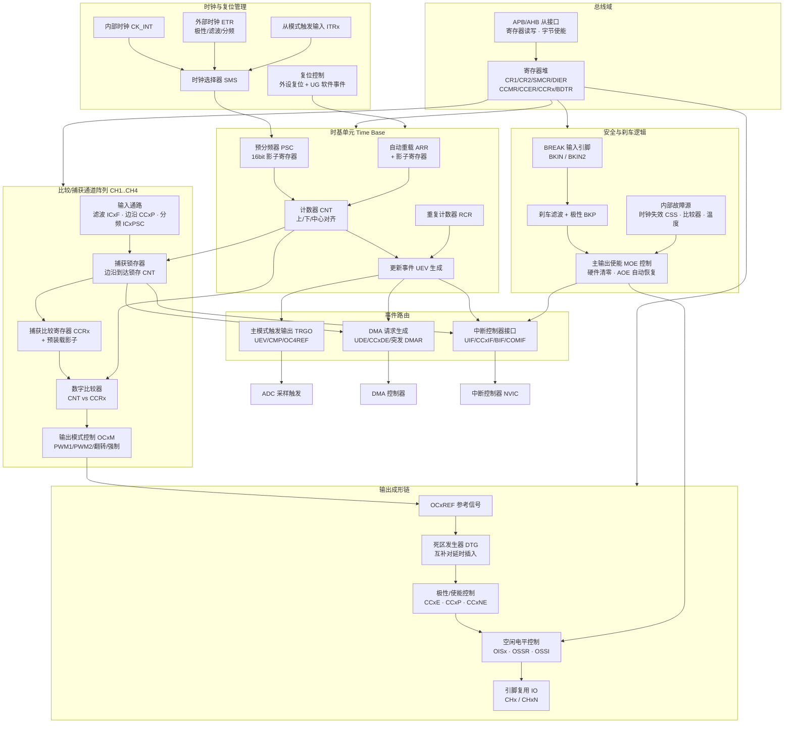

这张图值得反复看。它回答了几个关键问题：

1. **CCRx 是双向复用的**：在输出模式下它是比较阈值，在输入模式下它是捕获锁存目标。这解释了为什么同一个通道不能同时做 PWM 输出和输入捕获——寄存器被 `CCxS` 位切换了方向。
2. **死区发生器位于 OCxREF 之后、极性控制之前**。这意味着死区作用在"参考波形"上，而极性反转发生在死区之后；所以改极性不会破坏死区宽度，但会改变死区期间引脚的实际电平。
3. **刹车逻辑不经过死区**，它直接作用于输出使能与空闲电平控制，因此响应路径最短——这正是它能做到"纳秒级封波"的结构原因。
4. **TRGO 与 DMA 请求都由事件路由统一产生**，所以定时器天然是系统的"时间主节点"，ADC、DAC、DMA 都可以挂在它的节拍上。

### 4.2 时基单元：PSC / CNT / ARR / RCR

时基单元是 IP 的心脏，四个寄存器构成完整的节拍生成器：

- **PSC（Prescaler）**：16 位预分频器，实际分频比为 `PSC + 1`。PSC 自身带影子寄存器，写入的新值在下一次更新事件才装载到实际分频计数器。这样设计是为了避免运行中改分频比导致输出频率在周期中间突变。
- **CNT（Counter）**：核心计数器，16 位或 32 位。计数方向由 `DIR` 位（向上/向下）与 `CMS` 位（中心对齐模式）共同决定。中心对齐时 `DIR` 由硬件自动翻转，软件读它可以判断当前处在上升段还是下降段——这在中心对齐下做电流采样时刻选择时非常有用。
- **ARR（Auto Reload）**：周期上限，同样带影子寄存器，由 `ARPE` 位控制是否启用预装载。
- **RCR（Repetition Counter）**：重复计数器。它插在"计数溢出"与"更新事件"之间：只有当计数器溢出 `RCR + 1` 次后，才真正产生一次 UEV。它有两个实际价值：一是降低中断频率（20 kHz PWM 若每周期中断，CPU 压力大；设 RCR=1 则变成 10 kHz 中断）；二是在中心对齐模式下，通过设置 RCR 为奇数或偶数，可以选择 UEV 落在三角波的"波谷"还是"波峰"，从而决定 ADC 采样点落在哪个位置。

时基单元的状态转移可以用下图表示：

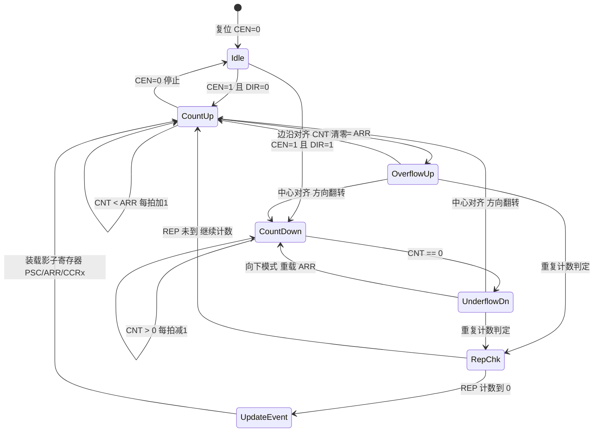

### 4.3 比较/捕获通道：一套硬件，两种人格

每个通道内部都有一条**输入通路**和一条**输出通路**，由 `CCMRx.CCxS` 位选择哪条生效。

**输出通路（比较模式）**的处理链是：`CCRx 影子值 → 数字比较器与 CNT 逐拍比较 → 按 OCxM 模式产生 OCxREF → 送入死区与输出控制`。`OCxM` 常见取值包括：冻结、匹配置有效、匹配置无效、翻转、强制无效、强制有效、PWM 模式 1、PWM 模式 2。其中"强制"模式在软件需要临时封某一相时非常实用，比六步换相里反复开关 `CCxE` 更平滑。

**输入通路（捕获模式）**的处理链是：`引脚 → 输入选择器（TI1/TI2 交叉映射）→ 数字滤波器 ICxF → 边沿检测器 CCxP/CCxNP → 输入分频器 ICxPSC → 捕获锁存 CNT 到 CCRx → 置 CCxIF，若原标志未清则置 CCxOF 过捕获标志`。

几个结构性细节：

- **输入交叉映射**是 PWM 输入模式的硬件基础：同一个引脚 TI1 可以同时接到通道 1 和通道 2 的输入通路上，让通道 1 捕获上升沿（测周期）、通道 2 捕获下降沿（测脉宽），从而一次配置就同时得到频率和占空比，无需软件切换边沿。
- **输入分频器 ICxPSC** 允许每 2/4/8 个边沿才捕获一次，用于测量极高频信号时降低中断率。
- **过捕获标志 CCxOF** 是排查"丢边沿"的黄金指标：如果它被置位，说明上一次捕获值还没被读走就被新值覆盖了，此时的测量结果不可信，必须丢弃。很多人只读 CCxIF 不读 CCxOF，导致高频下数据悄悄失真。

### 4.4 PWM 发生器与对齐逻辑

PWM 发生器本身并不是一个独立的大模块，它是"计数器方向 + 比较结果 + 输出模式"三者的组合逻辑：

- **边沿对齐**：CNT 单调递增，比较器输出在一个周期内只翻转一次，OCxREF 是标准的单沿脉冲。
- **中心对齐**：CNT 三角波，比较器在上升段和下降段各匹配一次，OCxREF 自然形成关于周期中点对称的脉冲。中心对齐还细分为模式 1/2/3，区别在于 `CCxIF` 标志在哪个方向的匹配时置位——这直接决定了比较中断触发在上升段还是下降段，是配置 ADC 触发点的关键。
- **非对称/双沿 PWM**：部分 IP 允许一个通道使用两个比较值分别决定上升沿和下降沿位置，用于移相控制。

### 4.5 死区发生器 DTG 的内部行为

死区发生器接收一路 OCxREF，输出一对互补信号 OCx 与 OCxN。其硬件逻辑是：

- 当 OCxREF 由无效变有效时：OCxN 立即变为无效，OCx 延迟 `DT` 后才变有效；
- 当 OCxREF 由有效变无效时：OCx 立即变为无效，OCxN 延迟 `DT` 后才变有效。

也就是说，**死区永远是"提前关断、延迟开通"**，两路输出在死区窗口内同时为无效电平。一个重要的推论是：**当占空比对应的脉宽小于死区时间时，该脉冲会被完全吞掉**（脉冲消失），电机在极小占空比时输出会出现"死区"非线性台阶。这就是电流死区效应的硬件根源，也是死区补偿算法要处理的对象。

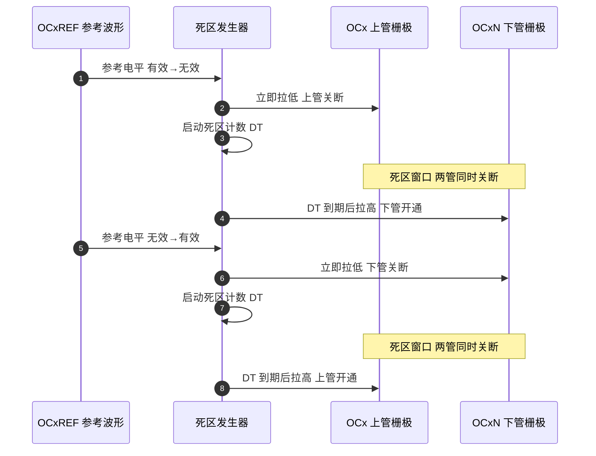

### 4.6 刹车（BREAK）与安全状态机

刹车逻辑是高级定时器区别于通用定时器的分水岭。它的硬件路径设计遵循一条原则：**不经过任何可被软件阻塞的环节**。

刹车源可以是外部引脚（BKIN/BKIN2）、内部时钟安全系统（CSS）失效、片内比较器输出、甚至是并行的另一颗定时器。信号进入后经过可配置的数字滤波与极性选择，一旦判定有效：

1. 硬件立即清 `BDTR.MOE`（主输出使能），所有通道输出被解耦；
2. 输出引脚按 `OSSR`（运行态关断选择）与 `OISx`（空闲电平）进入预定义的安全电平或高阻；
3. 置位 `SR.BIF` 标志，若使能则产生刹车中断；
4. 若 `AOE=1`，在刹车条件消失后的下一个更新事件自动恢复 MOE；若 `AOE=0`，必须由软件显式写 1 恢复。

功能安全项目里，`AOE` 一律配 0——自动恢复意味着故障可能在软件毫不知情的情况下被反复触发又恢复，这在 ISO 26262 的分析里是无法接受的。

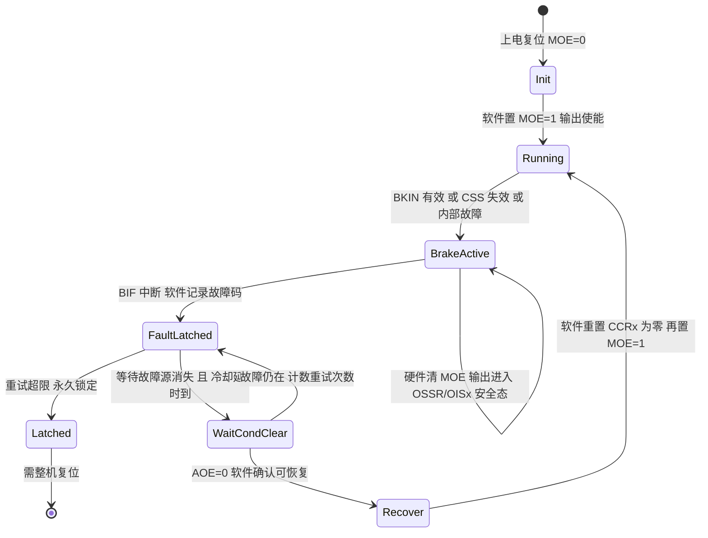

### 4.7 触发控制器：主从模式与 ADC 同步

触发控制器包含两个方向：

- **主模式（Master）**：通过 `CR2.MMS` 选择把哪个内部事件输出为 `TRGO`。常见选项有复位、使能、更新事件、比较脉冲、OC1REF~OC4REF。其中 **OC4REF 作为 TRGO** 是电机控制的经典用法：把 CH4 配成不接引脚的"虚拟通道"，用它的比较值精确指定 ADC 采样时刻，实现"在 PWM 波谷采相电流"。
- **从模式（Slave）**：通过 `SMCR.SMS` 选择外部信号对本定时器的作用——复位模式、门控模式、触发模式、外部时钟模式。多定时器级联、编码器接口、周期精确同步都依赖它。

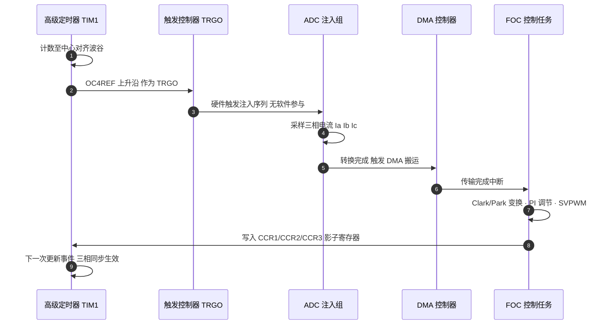

这条链路的精髓在于：从 ADC 触发到 PWM 更新，全程只有一次 CPU 介入，采样时刻由硬件比较值锁定，抖动只有一个定时器时钟周期。若改用软件在中断里启动 ADC，抖动会放大到微秒级，直接恶化电流环性能。

### 4.8 DMA 与中断接口

定时器可以产生多种 DMA 请求：更新事件（UDE）、各通道捕获/比较（CCxDE）、触发（TDE）、COM 事件（COMDE）。此外还有一种特殊的**突发传输模式（DMA Burst）**：通过 `DCR` 寄存器指定起始寄存器地址偏移与传输长度，再由 DMA 向 `DMAR` 端口连续写入，即可在一次事件里更新连续多个寄存器（例如一次性刷新 CCR1/CCR2/CCR3）。这在需要按预设表播放波形（如步进电机加减速曲线、任意波形发生）时极其高效。

中断方面，高级定时器通常把中断向量拆成多个：更新中断、捕获比较中断、刹车中断、触发与换相中断。拆分的目的是让刹车中断可以配置为最高优先级，而普通更新中断不至于阻塞它。

### 4.9 寄存器映射与位域详解

下面给出通用高级定时器的核心寄存器映射：

| 偏移 | 寄存器 | 全称 | 主要职责 |
|------|--------|------|----------|
| 0x00 | CR1 | Control Register 1 | 计数使能、方向、对齐模式、ARR 预装载、时钟分频 |
| 0x04 | CR2 | Control Register 2 | 主模式选择 MMS、空闲输出电平 OISx、CCx 预装载控制 |
| 0x08 | SMCR | Slave Mode Control | 从模式 SMS、触发源 TS、外部时钟 ETR 配置 |
| 0x0C | DIER | DMA/Interrupt Enable | 各类中断与 DMA 请求使能位 |
| 0x10 | SR | Status Register | UIF/CCxIF/CCxOF/BIF/TIF/COMIF 标志 |
| 0x14 | EGR | Event Generation | 软件强制产生 UG/CCxG/BG/COMG 事件 |
| 0x18 | CCMR1 | Capture/Compare Mode 1 | 通道 1/2 的方向选择、输出模式、输入滤波 |
| 0x1C | CCMR2 | Capture/Compare Mode 2 | 通道 3/4 同上 |
| 0x20 | CCER | Capture/Compare Enable | 各通道输出/捕获使能与极性 |
| 0x24 | CNT | Counter | 当前计数值 |
| 0x28 | PSC | Prescaler | 预分频值 |
| 0x2C | ARR | Auto Reload | 周期值 |
| 0x30 | RCR | Repetition Counter | 重复计数值 |
| 0x34~0x40 | CCR1~CCR4 | Capture/Compare | 比较阈值或捕获锁存值 |
| 0x44 | BDTR | Break and Dead-Time | 死区 DTG、主输出 MOE、刹车 BKE/BKP、关断态 OSSR/OSSI |
| 0x48 | DCR | DMA Control | 突发传输起始地址与长度 |
| 0x4C | DMAR | DMA Address for Burst | 突发访问窗口 |

关键寄存器的位域布局如下（通用示意）：

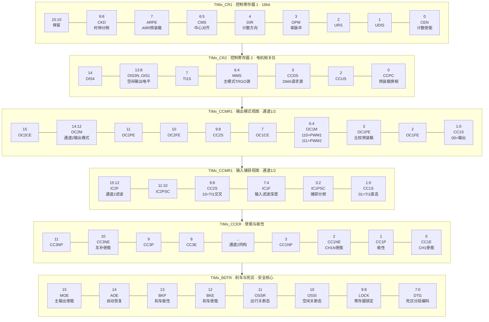

针对最容易配错的几个位，单独列表说明：

| 位域 | 所在寄存器 | 典型误用 | 正确理解 |
|------|-----------|----------|----------|
| ARPE | CR1 | 不开导致改频率时输出撕裂 | 开启后 ARR 在 UEV 才生效，变频调速必开 |
| CMS | CR1 | 切中心对齐后忘记 ARR 减半 | 中心对齐下 `f_pwm = f_tim / (2×(ARR+1))` |
| CKD | CR1 | 与 PSC 混淆 | CKD 只影响死区与数字滤波的采样时钟，不影响计数频率 |
| MMS | CR2 | 用 UEV 触发 ADC 导致采样点在开关沿 | 选 OC4REF 可任意指定采样时刻，避开开关噪声 |
| CCPC | CR2 | 六步换相时 CCER 改一半就生效 | 置 1 后 CCxE/CCxNE/OCxM 需 COM 事件才同步生效 |
| OCxPE | CCMR | 不开导致占空比更新出毛刺 | 必开，CCR 写入在 UEV 同步生效 |
| CCxS | CCMR | 输出与输入模式配置写混 | 同一寄存器两种视图，先定方向再填其余字段 |
| CCxNE | CCER | 只开 CCxE 导致互补管不动 | 互补输出必须主/互补使能位都置 1 |
| LOCK | BDTR | 初始化后再改死区改不动 | LOCK 位一旦写入只能复位清除，务必最后配置 |
| MOE | BDTR | 忘记置 1 导致完全无输出 | 高级定时器的输出总闸，通用定时器无此位 |

笔者的经验：调试高级定时器"完全没有波形"时，检查顺序永远是 `MOE → CCxE/CCxNE → GPIO 复用 → CEN → CCR 值`，按这个顺序查，九成问题在前两项。

### 4.10 时钟域与复位域

高级定时器 IP 内部至少存在三个时钟域：

1. **总线时钟域（PCLK）**：寄存器读写接口所在域，速度由 APB 决定。
2. **计数时钟域（CK_CNT）**：由 CK_PSC 经预分频得到，驱动 CNT、比较器、死区发生器。当 PSC 不为 0 时，它比总线域慢，因此软件写 CNT 后需要经过若干计数时钟才真正反映。
3. **死区/滤波采样时钟域（CK_DTS）**：由 `CKD` 位从 CK_INT 分频得到（1/2/4 分频），只服务于死区计数与输入数字滤波。这个域的存在解释了一个常见困惑——为什么改了 PSC，死区时间没变？因为死区根本不走 PSC。

外部时钟模式下还会引入**异步的 ETR/TIx 域**，其信号需要经过两级同步器进入内核域，带来 1~2 个时钟周期的固有延迟；这也是为什么外部时钟模式下最高输入频率通常被限制在 `f_tim/4` 左右。

复位方面同样有两层：**外设硬复位**（通过 RCC 复位寄存器）会把所有寄存器恢复默认值；**软件更新事件复位**（写 `EGR.UG=1`）只清零 CNT、重装 PSC/ARR/CCR 影子寄存器，并按 `URS` 位决定是否产生中断。初始化末尾手动产生一次 UG，是让预装载值立即生效的标准做法。

### 4.11 模块与 ADC / DMA / 中断控制器的协作关系

把定时器放进 SoC 上下文，它的角色是"系统时间主节点"：

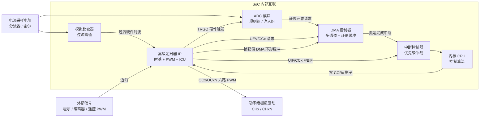

这张图里有一条常被忽略的"硬件闭环"：`电流采样 → 比较器 → 定时器 BREAK`。它完全绕开 CPU，是功率级的第一道防线；而 `ADC → DMA → CPU → CCR` 是第二道软件防线。两道防线的响应时间差着两三个数量级，缺一不可。

---

## 五、对齐方式：边沿对齐 vs 中心对齐

### 5.1 边沿对齐（Edge-Aligned）

边沿对齐是最直观的模式：计数器从 0 单向递增到 ARR，到 ARR 后回绕到 0，在一个周期内只有一次"翻转起点"。它的特点是：

- 一个 ARR 周期对应一个完整 PWM 周期；
- 所有通道的翻转都发生在"计数起点附近"，谐波能量集中在开关频率及其整数倍；
- 实现简单，绝大多数通用定时器默认就是边沿对齐。

### 5.2 中心对齐（Center-Aligned）

中心对齐模式下，计数器**先递增到 ARR，再递减回 0**，如此往复，形成一个三角波计数。PWM 翻转点出现在三角波与 CCR 相交的位置，因此每个 PWM 周期里每通道会翻转两次（上升沿一次、下降沿一次），且关于周期中点对称。

```
边沿对齐 CNT：  /|  /|  /|      锯齿波，单向递增后突变归零
                / | / | / |
中心对齐 CNT：  /\  /\  /\       三角波，递增到 ARR 后递减回 0
               /  \/  \/  \

边沿对齐 OUT：  ___----___----   翻转点固定参考周期起点
中心对齐 OUT：  __-----__-----   翻转点关于周期中点对称
```

**中心对齐的核心优势在于谐波分布**：由于翻转关于中点对称，偶次谐波被大幅抑制，能量更分散，EMI 更低；同时上下桥臂的死区在物理上天然对称，对电机和 DCDC 非常友好。代价是：**有效开关频率降为边沿对齐的一半**（计数器每周期走两趟，所以同样的 ARR 下输出频率减半），因此配置时必须按"中心对齐下 ARR 对应半周期"来算，否则频率会差一倍。

中心对齐还有一个电机控制专属的红利：在三角波的**波谷**（CNT=0）时刻，三相下管全部导通、上管全关，这是采样相电流最"干净"的时刻——此时开关噪声最小、采样电阻上流过的正是相电流。把 ADC 触发点对准波谷，能显著提高电流环信噪比。这正是 4.7 节 OC4REF 触发的用武之地。

### 5.3 单沿与双沿 PWM

- **单沿 PWM（Single-Edge）**：通道仅在计数单向变化时翻转一次（如只在递增段翻转），脉宽沿一个方向变化。实现简单、对齐直观。
- **双沿 PWM（Double-Edge / Asymmetric）**：在一个周期内允许上升沿与下降沿独立由不同比较值决定，可生成相位、脉宽均可独立调的波形。常用于多相 DCDC 的交错控制，以及某些高级电机算法中的移相调制。双沿模式通常依赖定时器支持"双比较寄存器/捕获比较预装载"特性。

### 5.4 对齐方式选型表

| 维度 | 边沿对齐 | 中心对齐 |
|------|----------|----------|
| 计数波形 | 锯齿波（单向） | 三角波（双向） |
| 有效频率 | f_tim/(ARR+1) | f_tim/(2×(ARR+1)) |
| 每周期翻转次数 | 1 次 | 2 次 |
| 偶次谐波 | 存在 | 被抑制 |
| EMI 表现 | 较差 | 较好 |
| 死区对称性 | 依赖配置 | 天然对称 |
| 电流采样时刻 | 需额外规划 | 波谷天然对齐 |
| 更新事件位置 | 每次溢出 | 波峰或波谷可选 |
| 典型应用 | 舵机、LED、蜂鸣器 | 电机 FOC、DCDC、数字电源 |
| 实现复杂度 | 低 | 中 |

---

## 六、互补输出与死区时间

### 6.1 为什么需要互补 PWM

驱动半桥（上管 + 下管）或全桥时，同一桥臂的上下两个功率管**绝不能同时导通**，否则母线经上下管直接短路（直通，shoot-through）。理想开关逻辑是"上开通下必关、下开通上必关"。若只用两路独立的普通 PWM 反相输出，看似互补，但在真实功率器件上会遇到致命问题——**关断比开通慢**。

功率 MOSFET/IGBT 的关断延迟（turn-off delay）通常明显大于开通延迟（turn-on delay）。假设软件发出"上管由开转关、下管由关转开"的指令，由于上管关得慢、下管开得快，会有一段"上管还没完全关、下管已经开了"的重叠窗口，母线电流直接灌穿，后果是瞬态大电流、器件过热乃至永久损坏。

### 6.2 死区（Deadtime）的插入机制

解决方法是插入**死区时间**：在互补通道的切换处，强制两路都输出"关断电平"一小段时间，确保"先完全关断、再开通对面"，用时间换安全。关键点在于：**死区必须由定时器硬件自动插入，绝不能用软件延时实现**。软件延时受中断抖动、任务调度影响，既不准又不可靠；硬件死区由专门的死区发生器在每个互补翻转处自动塞入，精度达定时器时钟周期量级（典型几十到几百纳秒），且不占 CPU。

### 6.3 死区过长与过短的代价

- **死区过短**：重叠窗口未能覆盖器件关断延迟，仍存在直通风险，高电压大电流下尤其危险。
- **死区过长**：有效导通时间被压缩，输出电压畸变、谐波增加、效率下降，且在电机低频时会引起明显的转矩脉动（电流死区效应）。

经验上，死区应略大于"上管关断延迟 − 下管开通延迟 + 驱动传输延迟差 + 器件参数离散裕量"。在 48 V/400 V 总线、数十 kHz 开关的场合，常见取值 100 ns ~ 1 µs；SiC MOSFET 因开关速度快可取较小值，IGBT 因拖尾电流通常要取较大值。调试时必须用示波器双通道同时抓取上下桥臂栅极，直接量重叠区与死区宽度来验证。

### 6.4 互补与死区结构示意

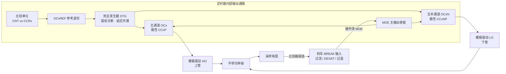

---

## 七、高级定时器实例：STM32 TIM1/TIM8 与 S32K eMIOS

### 7.1 STM32 高级定时器 TIM1 / TIM8

STM32 的 TIM1 与 TIM8 属于**高级控制定时器（Advanced-control Timer）**，与通用定时器（TIM2~TIM5 等）相比，专门增加了电机与数字电源所需的"重武器"：

- **多通道互补输出（CH1~CH3 + CH1N~CH3N，CH4 通常无互补）**：每个通道都有一对互补引脚，可直接驱动半桥。
- **可编程死区（BDTR 寄存器中的 DTG 字段）**：死区值按分段线性编码，低段以时钟周期为步长，高段以倍数步长，覆盖范围从几纳秒到数微秒，可适配不同功率器件。
- **刹车（Break）输入**：外部故障（过流、过压、温度、母线跌落、霍尔异常）可经 `BKIN` 引脚或内部事件触发**刹车**，硬件立即将全部 PWM 输出强制拉到预定义的安全状态，无需软件介入。
- **重复计数器（RCR）**：可设置每 N 个 PWM 周期才产生一次更新事件/中断。
- **换相事件（COM）与 CCPC 预装载**：为六步换相设计，可让六路通道的使能状态在同一时刻整体切换。
- **预装载与影子寄存器**：写入 ARR/CCR 不会立即生效，等更新事件才搬入影子寄存器。

### 7.2 NXP S32K 的 eMIOS

S32K 系列（汽车级 MCU）使用 **eMIOS（Enhanced Modular IO Subsystem）** 模块，思路与 STM32 高级定时器类似但组织方式不同。eMIOS 由多个**统一通道（Unified Channel, UC）**组成，每个通道可独立配置为计数器、PWM、输入捕获、输出比较等模式：

- **MCB（Modulus Counter Buffered）模式**：作为时间基准，为其他通道提供公共时基，类似 STM32 的主从触发。
- **OPWMB / OPWFMB 模式**：分别对应"以外部计数总线为时基的输出 PWM"与"带内部时基的边沿对齐 PWM"，支持占空比与周期的双缓冲更新。
- **OPWMCB 模式**：中心对齐 PWM，且**在模式内部直接支持死区插入**（通过前沿/后沿延时参数），这是 eMIOS 与 STM32 结构上的显著差异——STM32 把死区放在独立的 DTG 单元，eMIOS 把它做进通道模式里。
- **SAIC / IPM / IPWM 模式**：分别用于单次输入捕获、周期测量、脉宽测量，对应 ICU 功能。
- **计数总线（Counter Bus A/B/C/D）**：多个通道可共享同一条计数总线，天然实现相位同步。

eMIOS 的灵活性来自"每个通道都是可重构引擎"，代价是配置寄存器相对分散，需要按通道类型查表。工程上常把 MCB 通道设为全局时基，其余通道挂在其计数总线上做同步 PWM/ICU，从而避免多通道间的相位漂移。

### 7.3 高级定时器特性对比

| 特性 | STM32 TIM1/TIM8 | S32K eMIOS |
|------|------------------|------------|
| 通道组织 | 固定 4 通道 + 互补对 | 多个可重构统一通道 UC |
| 时基共享 | 单一 CNT 供所有通道 | 计数总线 A/B/C/D 可选 |
| 互补通道 | CHx / CHxN 成对 | 通道对 + OPWMCB 前后沿延时 |
| 死区 | 独立 DTG 单元，BDTR 编码 | 集成在 OPWMCB 模式参数中 |
| 中心对齐 | CR1.CMS 全局配置 | OPWMCB 通道级配置 |
| 刹车/故障 | BKIN Break1/2 + MOE | 通道禁用 + 外部故障输入 |
| 重复计数 | RCR 硬件支持 | 需软件或通道组合 |
| 影子寄存器 | ARR/CCR 预装载 | A/B 寄存器双缓冲 |
| 输入捕获 | CCMR 输入视图 | SAIC/IPM/IPWM 模式 |
| 典型定位 | 通用电机/电源 | 汽车动力总成/车身 |

### 7.4 BDTR 死区编码与刹车极性详解

以 STM32 为例，死区值写进 `BDTR` 的 `DTG[7:0]` 字段，采用**分段线性编码**而非简单线性，目的是在低死区时步长细、高死区时范围大（`T_dts` 为死区采样时钟周期，由 `CKD` 决定）：

| DTG[7:5] | 计算公式 | 步长 | 覆盖范围（T_dts = 1/170MHz ≈ 5.88 ns） |
|----------|----------|------|------------------------------|
| 0xx | `DT = DTG[7:0] × T_dts` | 1×T_dts ≈ 5.9 ns | 0 ~ 750 ns |
| 10x | `DT = (64 + DTG[5:0]) × 2 × T_dts` | 2×T_dts ≈ 11.8 ns | 753 ns ~ 1.49 µs |
| 110 | `DT = (32 + DTG[4:0]) × 8 × T_dts` | 8×T_dts ≈ 47 ns | 1.51 µs ~ 2.96 µs |
| 111 | `DT = (32 + DTG[4:0]) × 16 × T_dts` | 16×T_dts ≈ 94 ns | 3.01 µs ~ 5.93 µs |

所以配置 200 ns 死区前，要先按 `T_dts` 选对分段算出 DTG 值，不能简单把"纳秒数 ÷ 时钟周期"直接写入。笔者建议把死区换算做成查表或计算函数（见 8.4 节代码），并在板子上实测栅极重叠区反推真实死区，避免手册分段理解偏差导致算错一个数量级。

`BDTR` 还包含若干安全位：`MOE`（主输出使能，所有 PWM 输出的总开关）、`OSSR/OSSI`（运行/空闲时的关断状态选择，决定封波后引脚是浮空还是钳位）、`BKE/BKP`（刹车使能与极性）、`AOE`（自动恢复）、`LOCK[1:0]`（配置锁定级别，写入后只能通过复位解除，功能安全项目常用 LOCK 保护死区与刹车配置不被误改）。这些位共同决定了"出事时功率级到底处于什么电气状态"，必须和驱动芯片的使能/故障引脚约定一致。

### 7.5 刹车事件的来源与处理流程

典型电机控制器里，电流运放经比较器生成过流信号直连 BKIN，配合栅极驱动的 DESAT 保护，形成"硬件优先、软件兜底"的双重保险。软件在 `BIF` 中断里只需锁存故障码、执行状态机（见 4.6 节的状态图），而无需在实时环里反复轮询电流。这是防炸管架构的核心，面试中也常作为"你怎么做功率级保护"的标准答案。

需要特别提醒的是**上电瞬间的安全性**：MCU 复位后 GPIO 默认可能是浮空输入，若栅极驱动没有下拉电阻，浮空电平可能让功率管误导通。正确做法是硬件加下拉、软件在配置复用功能之前先把引脚设为推挽输出并输出安全电平，最后才切到定时器复用——顺序错了就可能在初始化那几微秒里炸管。

---

## 八、【核心章节 B】驱动代码实现

以下代码以接近寄存器直操作的风格书写，语义参考通用高级定时器，重点在于表达配置思路与计算逻辑。实际工程请对照芯片手册核对字段名，或替换为对应 HAL/LL 库调用。

### 8.1 时基初始化：从目标频率反推 PSC / ARR

```c
#include <stdint.h>
#include <stdbool.h>

/* ---------- 时基参数计算与初始化 ---------- */

typedef enum {
    PWM_ALIGN_EDGE   = 0,   /* 边沿对齐：f = f_tim / (ARR+1)      */
    PWM_ALIGN_CENTER = 1    /* 中心对齐：f = f_tim / (2*(ARR+1))  */
} PwmAlign_t;

typedef struct {
    uint32_t   f_tim_hz;      /* 定时器输入时钟，务必实测确认      */
    uint32_t   f_pwm_hz;      /* 目标 PWM 频率                     */
    PwmAlign_t align;         /* 对齐方式                          */
    uint16_t   psc;           /* 输出：预分频寄存器值              */
    uint32_t   arr;           /* 输出：自动重载值                  */
    uint32_t   duty_levels;   /* 输出：实际可用占空比级数          */
    float      real_freq_hz;  /* 输出：实际频率（含整数舍入误差）  */
} TimeBaseCfg_t;

#define TIM_MAX_ARR_16BIT   0xFFFFu

/*
 * 计算 PSC/ARR：优先把 PSC 压到最小，以保留最高的占空比分辨率。
 * 返回 false 表示目标频率在当前时钟下无法实现。
 */
bool TimeBase_Calc(TimeBaseCfg_t *cfg)
{
    if (cfg->f_pwm_hz == 0u || cfg->f_tim_hz == 0u) {
        return false;
    }

    /* 中心对齐每个 PWM 周期计数器要走两趟，所需总计数翻倍 */
    uint32_t divisor = (cfg->align == PWM_ALIGN_CENTER) ? 2u : 1u;
    uint32_t total_ticks = cfg->f_tim_hz / (cfg->f_pwm_hz * divisor);

    if (total_ticks == 0u) {
        return false;                      /* 目标频率高于时钟能力 */
    }

    /* 从 PSC=0 开始递增，找到第一个能让 ARR 落进 16 位范围的分频比 */
    uint32_t psc = 0u;
    while ((total_ticks / (psc + 1u)) > (TIM_MAX_ARR_16BIT + 1u)) {
        psc++;
        if (psc > TIM_MAX_ARR_16BIT) {
            return false;                  /* 频率过低，16 位放不下 */
        }
    }

    cfg->psc = (uint16_t)psc;
    cfg->arr = (total_ticks / (psc + 1u)) - 1u;
    cfg->duty_levels = cfg->arr + 1u;
    cfg->real_freq_hz = (float)cfg->f_tim_hz /
                        ((float)divisor * (float)(psc + 1u) * (float)(cfg->arr + 1u));

    /* 工程告警：占空比级数低于 256 时控制精度已经吃紧 */
    if (cfg->duty_levels < 256u) {
        /* 建议提高 f_tim、降低 f_pwm，或改用 32 位/高分辨率定时器 */
    }
    return true;
}

void TimeBase_Apply(TIM_TypeDef *TIMx, const TimeBaseCfg_t *cfg)
{
    TIMx->CR1 &= ~TIM_CR1_CEN;                 /* 配置期间先停计数 */

    TIMx->PSC  = cfg->psc;
    TIMx->ARR  = cfg->arr;
    TIMx->RCR  = 0u;                           /* 每周期一次更新事件 */

    TIMx->CR1 |= TIM_CR1_ARPE;                 /* ARR 预装载，变频不撕波 */

    TIMx->CR1 &= ~TIM_CR1_CMS_Msk;
    if (cfg->align == PWM_ALIGN_CENTER) {
        TIMx->CR1 |= TIM_CR1_CMS_0;            /* 中心对齐模式 1 */
    } else {
        TIMx->CR1 &= ~TIM_CR1_DIR;             /* 边沿对齐、向上计数 */
    }

    /* 产生一次软件更新事件，让 PSC/ARR 影子寄存器立即装载 */
    TIMx->EGR = TIM_EGR_UG;
    TIMx->SR &= ~TIM_SR_UIF;                   /* 清掉这次人为产生的标志 */
}
```

### 8.2 边沿对齐 PWM 输出与占空比 API

```c
/* ---------- 单通道边沿对齐 PWM：LED 调光 / 舵机 / 蜂鸣器 ---------- */

void PWM_ChannelInit_EdgeAligned(TIM_TypeDef *TIMx, uint8_t ch)
{
    switch (ch) {
    case 1:
        TIMx->CCMR1 &= ~TIM_CCMR1_CC1S_Msk;        /* CC1S=00：通道配为输出 */
        TIMx->CCMR1 &= ~TIM_CCMR1_OC1M_Msk;
        TIMx->CCMR1 |= (0x6u << TIM_CCMR1_OC1M_Pos); /* 110 = PWM 模式 1 */
        TIMx->CCMR1 |= TIM_CCMR1_OC1PE;            /* CCR1 预装载，防毛刺 */
        TIMx->CCER  &= ~TIM_CCER_CC1P;             /* 高电平有效 */
        TIMx->CCER  |= TIM_CCER_CC1E;              /* 使能通道输出 */
        break;
    case 2:
        TIMx->CCMR1 &= ~TIM_CCMR1_CC2S_Msk;
        TIMx->CCMR1 |= (0x6u << TIM_CCMR1_OC2M_Pos) | TIM_CCMR1_OC2PE;
        TIMx->CCER  |= TIM_CCER_CC2E;
        break;
    default:
        break;
    }
    /* 高级定时器必须开主输出使能，否则引脚毫无反应 */
    TIMx->BDTR |= TIM_BDTR_MOE;
}

/*
 * 设置占空比，输入为万分比（0~10000），避免浮点运算。
 * 上下限钳位是必须的：接近 100% 会让自举电容失去充电机会。
 */
#define DUTY_MAX_PERMYRIAD   9800u   /* 98%，为自举补电留窗口 */
#define DUTY_MIN_PERMYRIAD   0u

void PWM_SetDutyPermyriad(TIM_TypeDef *TIMx, uint8_t ch, uint16_t permyriad)
{
    if (permyriad > DUTY_MAX_PERMYRIAD) {
        permyriad = DUTY_MAX_PERMYRIAD;
    }

    uint32_t arr = TIMx->ARR;
    /* CCR = D * (ARR+1)，先乘后除保精度；+5000 实现四舍五入 */
    uint32_t ccr = ((uint32_t)permyriad * (arr + 1u) + 5000u) / 10000u;

    if (ccr > arr + 1u) {
        ccr = arr + 1u;
    }

    switch (ch) {
    case 1: TIMx->CCR1 = ccr; break;
    case 2: TIMx->CCR2 = ccr; break;
    case 3: TIMx->CCR3 = ccr; break;
    case 4: TIMx->CCR4 = ccr; break;
    default: break;
    }
    /* 因为开了 OCxPE，新值会在下一次更新事件同步生效，相位连续 */
}

/* 舵机专用封装：50 Hz、脉宽 1000~2000 us，中值 1500 us */
void Servo_SetPulseUs(TIM_TypeDef *TIMx, uint8_t ch, uint16_t pulse_us)
{
    if (pulse_us < 1000u) pulse_us = 1000u;
    if (pulse_us > 2000u) pulse_us = 2000u;

    /* 前提：时基已配成 1 us 一个计数步，ARR = 19999（20 ms 周期） */
    switch (ch) {
    case 1: TIMx->CCR1 = pulse_us; break;
    case 2: TIMx->CCR2 = pulse_us; break;
    default: break;
    }
}
```

### 8.3 三相中心对齐互补 PWM + 死区（电机主控）

```c
/* ---------- 三相互补 PWM：BLDC / PMSM 功率级驱动 ---------- */

/*
 * DTG 分段编码计算：把纳秒数换算成 BDTR.DTG[7:0]
 * f_dts_hz 为死区采样时钟频率（受 CR1.CKD 影响，不受 PSC 影响）
 */
uint8_t Deadtime_NsToDtg(uint32_t deadtime_ns, uint32_t f_dts_hz)
{
    /* 一个 T_dts 对应的皮秒数，用整数运算避免浮点 */
    uint32_t t_dts_ps = 1000000000000ULL / f_dts_hz;
    uint32_t need_ps  = (uint32_t)deadtime_ns * 1000u;
    uint32_t ticks    = (need_ps + t_dts_ps - 1u) / t_dts_ps;  /* 向上取整 */

    if (ticks <= 127u) {
        /* 段 0：DT = DTG[7:0] * T_dts，步长 1 */
        return (uint8_t)ticks;
    } else if (ticks <= 254u) {
        /* 段 1：DT = (64 + DTG[5:0]) * 2 * T_dts */
        uint32_t v = (ticks / 2u) - 64u;
        if (v > 63u) v = 63u;
        return (uint8_t)(0x80u | v);
    } else if (ticks <= 504u) {
        /* 段 2：DT = (32 + DTG[4:0]) * 8 * T_dts */
        uint32_t v = (ticks / 8u) - 32u;
        if (v > 31u) v = 31u;
        return (uint8_t)(0xC0u | v);
    } else {
        /* 段 3：DT = (32 + DTG[4:0]) * 16 * T_dts */
        uint32_t v = (ticks / 16u) - 32u;
        if (v > 31u) v = 31u;
        return (uint8_t)(0xE0u | v);
    }
}

void MotorPWM_Init(TIM_TypeDef *TIMx, uint32_t f_tim_hz,
                   uint32_t f_pwm_hz, uint32_t deadtime_ns)
{
    /* --- 1) 时基：中心对齐，ARR 按半周期算 --- */
    TimeBaseCfg_t cfg = {
        .f_tim_hz = f_tim_hz,
        .f_pwm_hz = f_pwm_hz,
        .align    = PWM_ALIGN_CENTER,
    };
    (void)TimeBase_Calc(&cfg);
    TimeBase_Apply(TIMx, &cfg);

    /* CKD=00：死区采样时钟 = 定时器内部时钟 */
    TIMx->CR1 &= ~TIM_CR1_CKD_Msk;

    /* --- 2) 三路通道配成 PWM 模式 1 + 预装载 --- */
    TIMx->CCMR1 = (0x6u << TIM_CCMR1_OC1M_Pos) | TIM_CCMR1_OC1PE
                | (0x6u << TIM_CCMR1_OC2M_Pos) | TIM_CCMR1_OC2PE;
    TIMx->CCMR2 = (0x6u << TIM_CCMR2_OC3M_Pos) | TIM_CCMR2_OC3PE;

    /* --- 3) 主通道 + 互补通道全部使能，极性按驱动芯片约定 --- */
    TIMx->CCER = TIM_CCER_CC1E | TIM_CCER_CC1NE
               | TIM_CCER_CC2E | TIM_CCER_CC2NE
               | TIM_CCER_CC3E | TIM_CCER_CC3NE;
    /* 若栅极驱动为低有效输入，此处需相应置 CCxP / CCxNP */

    /* --- 4) 初始占空比全部为 0，确保上电时功率级静默 --- */
    TIMx->CCR1 = 0u;
    TIMx->CCR2 = 0u;
    TIMx->CCR3 = 0u;

    /* --- 5) 死区 + 刹车 + 关断状态 --- */
    uint8_t dtg = Deadtime_NsToDtg(deadtime_ns, f_tim_hz);
    TIMx->BDTR = ((uint32_t)dtg << TIM_BDTR_DTG_Pos)
               | TIM_BDTR_OSSR          /* 运行态关断时输出钳位到无效电平 */
               | TIM_BDTR_OSSI          /* 空闲态同理，不留浮空 */
               | TIM_BDTR_BKE           /* 刹车使能 */
               | TIM_BDTR_BKP;          /* 刹车高有效，按硬件电路确定 */
    /* 注意：AOE 保持为 0，故障后必须软件确认才恢复 */

    /* --- 6) CH4 作为 ADC 触发的虚拟通道，不接引脚 --- */
    TIMx->CCMR2 |= (0x6u << TIM_CCMR2_OC4M_Pos) | TIM_CCMR2_OC4PE;
    TIMx->CCR4   = 1u;                  /* 靠近波谷触发，避开开关噪声 */
    TIMx->CR2   &= ~TIM_CR2_MMS_Msk;
    TIMx->CR2   |= (0x7u << TIM_CR2_MMS_Pos);   /* TRGO = OC4REF */

    /* --- 7) 最后才开主输出与计数 --- */
    TIMx->BDTR |= TIM_BDTR_MOE;
    TIMx->CR1  |= TIM_CR1_CEN;
}

/* 三相占空比同步更新：三个 CCR 都写完，等同一个 UEV 一起生效 */
void MotorPWM_SetThreePhase(TIM_TypeDef *TIMx,
                            uint16_t ta, uint16_t tb, uint16_t tc)
{
    uint32_t arr = TIMx->ARR;
    if (ta > arr) ta = (uint16_t)arr;
    if (tb > arr) tb = (uint16_t)arr;
    if (tc > arr) tc = (uint16_t)arr;

    TIMx->CCR1 = ta;
    TIMx->CCR2 = tb;
    TIMx->CCR3 = tc;
    /* 三路影子寄存器在同一次更新事件同时装载，三相严格同步 */
}
```

### 8.4 ICU 输入捕获：PWM 输入模式测频率与占空比

```c
/* ---------- ICU：用 PWM 输入模式一次测出周期与脉宽 ---------- */
/*
 * 原理：同一个引脚 TI1 交叉映射到两个通道
 *   通道1 捕获上升沿 → 得到周期 T
 *   通道2 捕获下降沿 → 得到高电平宽度 W
 *   占空比 D = W / T，无需软件切换边沿，也就不会因为切换延迟丢边沿
 */

typedef struct {
    volatile uint32_t period_ticks;   /* 周期，单位：计数步 */
    volatile uint32_t width_ticks;    /* 高电平宽度         */
    volatile uint32_t overflow_cnt;   /* 溢出计数，测低频用 */
    volatile uint32_t freq_hz;        /* 计算结果：频率     */
    volatile uint16_t duty_permyriad; /* 计算结果：万分比   */
    volatile bool     valid;          /* 数据有效标志       */
    volatile uint32_t lost_edge_cnt;  /* 过捕获（丢边沿）计数 */
    uint32_t          tick_hz;        /* 计数步频率         */
} IcuMeas_t;

static IcuMeas_t g_icu = { .tick_hz = 1000000u };   /* 1 MHz，1 us 一步 */

void ICU_PwmInputInit(TIM_TypeDef *TIMx, uint32_t f_tim_hz)
{
    /* --- 1) 时基：分频到 1 MHz，ARR 拉满以获得最大测量窗口 --- */
    TIMx->PSC = (uint16_t)(f_tim_hz / 1000000u - 1u);
    TIMx->ARR = 0xFFFFu;
    g_icu.tick_hz = 1000000u;

    /* --- 2) 通道1：TI1 直连，上升沿捕获，测周期 --- */
    TIMx->CCMR1 &= ~TIM_CCMR1_CC1S_Msk;
    TIMx->CCMR1 |= (0x1u << TIM_CCMR1_CC1S_Pos);   /* 01 = IC1 映射到 TI1 */
    TIMx->CCMR1 |= (0x3u << TIM_CCMR1_IC1F_Pos);   /* 数字滤波，抗窄毛刺   */
    TIMx->CCER  &= ~(TIM_CCER_CC1P | TIM_CCER_CC1NP);  /* 上升沿 */

    /* --- 3) 通道2：交叉映射到 TI1，下降沿捕获，测脉宽 --- */
    TIMx->CCMR1 &= ~TIM_CCMR1_CC2S_Msk;
    TIMx->CCMR1 |= (0x2u << TIM_CCMR1_CC2S_Pos);   /* 10 = IC2 映射到 TI1 */
    TIMx->CCMR1 |= (0x3u << TIM_CCMR1_IC2F_Pos);
    TIMx->CCER  |= TIM_CCER_CC2P;                  /* 下降沿 */

    /* --- 4) 从模式：TI1FP1 上升沿复位计数器 --- */
    /*     这样 CCR1 直接就是周期、CCR2 直接就是脉宽，软件不必做减法 */
    TIMx->SMCR &= ~(TIM_SMCR_TS_Msk | TIM_SMCR_SMS_Msk);
    TIMx->SMCR |= (0x5u << TIM_SMCR_TS_Pos);       /* 触发源 = TI1FP1 */
    TIMx->SMCR |= (0x4u << TIM_SMCR_SMS_Pos);      /* 复位模式        */

    /* --- 5) 使能捕获与中断 --- */
    TIMx->CCER |= TIM_CCER_CC1E | TIM_CCER_CC2E;
    TIMx->DIER |= TIM_DIER_CC1IE | TIM_DIER_UIE;
    TIMx->CR1  |= TIM_CR1_CEN;
}

void ICU_IRQHandler(TIM_TypeDef *TIMx)
{
    uint32_t sr = TIMx->SR;

    /* 过捕获：上一个值还没读走就被覆盖，本轮数据不可信 */
    if (sr & TIM_SR_CC1OF) {
        TIMx->SR = ~TIM_SR_CC1OF;
        g_icu.lost_edge_cnt++;
        g_icu.valid = false;
    }

    if (sr & TIM_SR_CC1IF) {
        uint32_t period = TIMx->CCR1;    /* 读 CCR1 自动清 CC1IF */
        uint32_t width  = TIMx->CCR2;

        if (period != 0u && width <= period) {
            g_icu.period_ticks = period;
            g_icu.width_ticks  = width;
            /* 频率：注意从模式复位后 CCR1 已经是完整周期计数 */
            g_icu.freq_hz = g_icu.tick_hz / period;
            g_icu.duty_permyriad = (uint16_t)((width * 10000u) / period);
            g_icu.valid = true;
        } else {
            g_icu.valid = false;         /* 异常数据直接丢弃 */
        }
        g_icu.overflow_cnt = 0u;
    }

    if (sr & TIM_SR_UIF) {
        TIMx->SR = ~TIM_SR_UIF;
        /* 溢出说明被测信号周期超过计数窗口：低频或信号丢失 */
        if (g_icu.overflow_cnt < 0xFFFFFFFFu) {
            g_icu.overflow_cnt++;
        }
        if (g_icu.overflow_cnt > 2u) {
            g_icu.valid   = false;       /* 连续多次溢出判定为无信号 */
            g_icu.freq_hz = 0u;
        }
    }
}

/* 任务级读取：带简单滑动平均，抑制单次抖动 */
uint32_t ICU_GetFilteredFreq(void)
{
    static uint32_t hist[4] = {0};
    static uint8_t  idx = 0u;

    if (!g_icu.valid) {
        return 0u;
    }
    hist[idx & 0x3u] = g_icu.freq_hz;
    idx++;
    return (hist[0] + hist[1] + hist[2] + hist[3]) >> 2;
}
```

### 8.5 刹车保护配置与故障恢复状态机

```c
/* ---------- 刹车（BREAK）：功率级最后一道硬件防线 ---------- */

typedef enum {
    MOTOR_STATE_IDLE = 0,
    MOTOR_STATE_RUN,
    MOTOR_STATE_FAULT,        /* 刹车触发，输出已被硬件封锁 */
    MOTOR_STATE_RECOVER_WAIT, /* 等待故障消失与冷却延时     */
    MOTOR_STATE_LATCHED       /* 重试超限，永久锁定         */
} MotorState_t;

typedef struct {
    MotorState_t state;
    uint32_t     fault_code;
    uint32_t     retry_cnt;
    uint32_t     cooldown_ms;
} MotorSafety_t;

static MotorSafety_t g_safety = {0};

#define FAULT_RETRY_MAX      3u
#define FAULT_COOLDOWN_MS    500u

void Brake_Init(TIM_TypeDef *TIMx)
{
    /* 1) 刹车输入引脚：配复用 + 内部上/下拉，绝不能悬空 */
    /*    悬空的 BKIN 会被噪声随机触发，或者更糟——永远不触发 */

    /* 2) 关断状态：故障时输出被驱动到无效电平而非高阻 */
    TIMx->BDTR |= TIM_BDTR_OSSR | TIM_BDTR_OSSI;

    /* 3) 空闲输出电平 OISx：定义 MOE=0 时各引脚的电平 */
    /*    对高有效驱动，全部配 0 = 全关断 */
    TIMx->CR2 &= ~(TIM_CR2_OIS1 | TIM_CR2_OIS1N |
                   TIM_CR2_OIS2 | TIM_CR2_OIS2N |
                   TIM_CR2_OIS3 | TIM_CR2_OIS3N);

    /* 4) 刹车极性与使能；AOE=0 禁止自动恢复 */
    TIMx->BDTR &= ~TIM_BDTR_AOE;
    TIMx->BDTR |= TIM_BDTR_BKP | TIM_BDTR_BKE;

    /* 5) 使能刹车中断，并在 NVIC 里给它最高优先级 */
    TIMx->DIER |= TIM_DIER_BIE;

    /* 6) 锁定配置：LOCK=01 保护 DTG/BKE/BKP/OSSR/OSSI 不被误改 */
    /*    LOCK 必须最后写，且只能靠复位解除 */
    TIMx->BDTR |= (0x1u << TIM_BDTR_LOCK_Pos);
}

/* 刹车中断：只做最短必要动作，其余交给状态机 */
void TIM_BRK_IRQHandler(TIM_TypeDef *TIMx)
{
    if (TIMx->SR & TIM_SR_BIF) {
        TIMx->SR = ~TIM_SR_BIF;

        /* 硬件此时已清 MOE，输出处于安全态，软件只需记录 */
        g_safety.state       = MOTOR_STATE_FAULT;
        g_safety.fault_code |= 0x01u;          /* 位掩码记录故障源 */
        g_safety.cooldown_ms = FAULT_COOLDOWN_MS;

        /* 把比较值清零，避免恢复瞬间输出满占空比 */
        TIMx->CCR1 = 0u;
        TIMx->CCR2 = 0u;
        TIMx->CCR3 = 0u;
    }
}

/* 周期任务（如 1 ms）中调用的恢复状态机 */
void Motor_SafetyTask(TIM_TypeDef *TIMx, bool fault_pin_active)
{
    switch (g_safety.state) {
    case MOTOR_STATE_FAULT:
        if (g_safety.retry_cnt >= FAULT_RETRY_MAX) {
            g_safety.state = MOTOR_STATE_LATCHED;
        } else {
            g_safety.state = MOTOR_STATE_RECOVER_WAIT;
        }
        break;

    case MOTOR_STATE_RECOVER_WAIT:
        if (g_safety.cooldown_ms > 0u) {
            g_safety.cooldown_ms--;
            break;
        }
        if (fault_pin_active) {
            g_safety.retry_cnt++;              /* 故障仍在，重新计时 */
            g_safety.cooldown_ms = FAULT_COOLDOWN_MS;
            break;
        }
        /* 故障已消失：先确保占空比为 0，再重开主输出 */
        TIMx->CCR1 = 0u;
        TIMx->CCR2 = 0u;
        TIMx->CCR3 = 0u;
        TIMx->BDTR |= TIM_BDTR_MOE;
        g_safety.retry_cnt++;
        g_safety.state = MOTOR_STATE_RUN;
        break;

    case MOTOR_STATE_LATCHED:
        /* 永久锁定：必须整机复位或经过诊断服务解锁 */
        TIMx->BDTR &= ~TIM_BDTR_MOE;
        break;

    default:
        break;
    }
}
```

### 8.6 定时器触发 ADC 同步 + 六步换相

```c
/* ---------- 定时器触发 ADC：把采样点钉死在 PWM 波谷 ---------- */

void TimerTriggerAdc_Setup(TIM_TypeDef *TIMx, ADC_TypeDef *ADCx)
{
    /* 定时器侧：CH4 作为虚拟比较通道，TRGO 输出 OC4REF */
    TIMx->CCMR2 &= ~TIM_CCMR2_CC4S_Msk;              /* 输出模式 */
    TIMx->CCMR2 |= (0x6u << TIM_CCMR2_OC4M_Pos)      /* PWM 模式 1 */
                 | TIM_CCMR2_OC4PE;
    /* 中心对齐下 CCR4 取很小的值，匹配点靠近三角波波谷 */
    TIMx->CCR4   = 4u;
    TIMx->CR2   &= ~TIM_CR2_MMS_Msk;
    TIMx->CR2   |= (0x7u << TIM_CR2_MMS_Pos);        /* MMS=111：OC4REF */

    /* ADC 侧：注入组由外部事件触发，上升沿有效 */
    ADCx->CR2 &= ~ADC_CR2_JEXTSEL_Msk;
    ADCx->CR2 |= ADC_JEXTSEL_TIM1_TRGO;
    ADCx->CR2 |= ADC_CR2_JEXTEN_RISING;
    ADCx->CR2 |= ADC_CR2_ADON;

    /* 注入序列：三相电流 + 母线电压，转换完成后触发 DMA 或注入中断 */
    ADCx->JSQR = ADC_INJ_SEQ_3CH(CH_IA, CH_IB, CH_IC);
    ADCx->CR1 |= ADC_CR1_JEOCIE;
}

/* ---------- 六步换相：BLDC 方波驱动 ---------- */
/*
 * 换相表：每个扇区决定哪一相接上管 PWM、哪一相接下管常通、哪一相悬空。
 * 位定义：bit0=CC1E bit1=CC1NE bit2=CC2E bit3=CC2NE bit4=CC3E bit5=CC3NE
 */
static const uint8_t k_commutation_table[6] = {
    /* 扇区0：A+ B-  */ 0x01u | 0x08u,
    /* 扇区1：A+ C-  */ 0x01u | 0x20u,
    /* 扇区2：B+ C-  */ 0x04u | 0x20u,
    /* 扇区3：B+ A-  */ 0x04u | 0x02u,
    /* 扇区4：C+ A-  */ 0x10u | 0x02u,
    /* 扇区5：C+ B-  */ 0x10u | 0x08u,
};

void SixStep_Init(TIM_TypeDef *TIMx)
{
    /* CCPC=1：CCER 与 OCxM 的改动被预装载，等 COM 事件统一生效 */
    /* CCUS=1：允许 TRGI 上升沿（霍尔跳变）自动产生 COM 事件      */
    TIMx->CR2 |= TIM_CR2_CCPC | TIM_CR2_CCUS;
    TIMx->DIER |= TIM_DIER_COMIE;
}

void SixStep_Commutate(TIM_TypeDef *TIMx, uint8_t sector, uint16_t duty_ccr)
{
    if (sector > 5u) {
        return;
    }
    uint8_t pattern = k_commutation_table[sector];

    /* 三相比较值统一写成同一个占空比，由使能位决定哪相真正输出 */
    TIMx->CCR1 = duty_ccr;
    TIMx->CCR2 = duty_ccr;
    TIMx->CCR3 = duty_ccr;

    uint32_t ccer = 0u;
    if (pattern & 0x01u) ccer |= TIM_CCER_CC1E;
    if (pattern & 0x02u) ccer |= TIM_CCER_CC1NE;
    if (pattern & 0x04u) ccer |= TIM_CCER_CC2E;
    if (pattern & 0x08u) ccer |= TIM_CCER_CC2NE;
    if (pattern & 0x10u) ccer |= TIM_CCER_CC3E;
    if (pattern & 0x20u) ccer |= TIM_CCER_CC3NE;

    TIMx->CCER = ccer;

    /* 因为 CCPC=1，上面的写入不会立刻生效；
       产生 COM 事件后六路使能位在同一时刻整体切换，杜绝换相瞬间的直通 */
    TIMx->EGR = TIM_EGR_COMG;
}

/* ---------- SPWM / SVPWM：在更新中断里刷新三相比较值 ---------- */

void TIM_UP_IRQHandler(TIM_TypeDef *TIMx)
{
    if (!(TIMx->SR & TIM_SR_UIF)) {
        return;
    }
    TIMx->SR = ~TIM_SR_UIF;

    /* 1) 读取由 DMA 搬来的三相电流（已在 TRGO 触发时刻采好） */
    int16_t ia = Adc_GetPhaseCurrent(0);
    int16_t ib = Adc_GetPhaseCurrent(1);

    /* 2) Clark + Park 变换到 dq 轴 */
    FocFrame_t f;
    Foc_Clark(ia, ib, &f);
    Foc_Park(&f, Encoder_GetElecAngle());

    /* 3) 电流环 PI 调节，得到 Vd/Vq */
    f.vd = Pi_Update(&g_pid_d, f.id_ref - f.id);
    f.vq = Pi_Update(&g_pid_q, f.iq_ref - f.iq);

    /* 4) 反 Park + SVPWM，算出三相占空比（0~ARR） */
    Foc_InvPark(&f);
    uint16_t ta, tb, tc;
    Svpwm_Calc(f.valpha, f.vbeta, (uint16_t)TIMx->ARR, &ta, &tb, &tc);

    /* 5) 三相同步写入影子寄存器，下一次更新事件一起生效 */
    MotorPWM_SetThreePhase(TIMx, ta, tb, tc);
}
```

---

## 九、ICU 输入捕获原理详解

### 9.1 ICU 的核心思想

ICU 解决的问题是：**精确测量外部信号的边沿时刻**。在外部信号发生指定边沿的瞬间，硬件自动把当前 CNT 值锁存进该通道的 CCR，并触发中断或 DMA 请求。软件只需把时间戳读走，用相邻边沿的时间戳相减，即可得到周期、脉宽、占空比、频率。

对比"用 GPIO 外部中断 + 软件读定时器"：GPIO 中断进入 handler 已有数微秒延迟，且受关中断区间、高优先级任务抢占影响产生抖动，高频信号下极易丢边沿。ICU 是**纳秒级的硬件锁存**，边沿一到立刻采样，几乎不占 CPU，精度由定时器时钟决定而非软件。

### 9.2 三种测量拓扑

| 拓扑 | 通道占用 | 可测量 | 优点 | 局限 |
|------|----------|--------|------|------|
| 单通道单边沿 | 1 | 周期/频率 | 资源省，配置最简单 | 测不了占空比 |
| 单通道双边沿切换 | 1 | 周期 + 脉宽 | 只占一个通道 | 切换有延迟，高频易丢边沿 |
| PWM 输入模式（双通道交叉） | 2 | 周期 + 脉宽同时 | 硬件自动，零切换延迟 | 占两个通道，只能测一路信号 |

工程上若通道够用，一律优先选 PWM 输入模式——它把"软件切边沿"这个最大的误差源直接从系统里消掉了。

### 9.3 边沿触发状态机与溢出处理

当被测周期大于定时器计数窗口时，两次捕获之间会发生多次溢出。正确做法是维护一个**溢出计数器**：每次更新事件把溢出次数 `+1`，最终时间 = `溢出次数 × (ARR+1) + (t_后 - t_前)`。忽略溢出是 ICU 测低频时"读数乱跳"的常见原因。

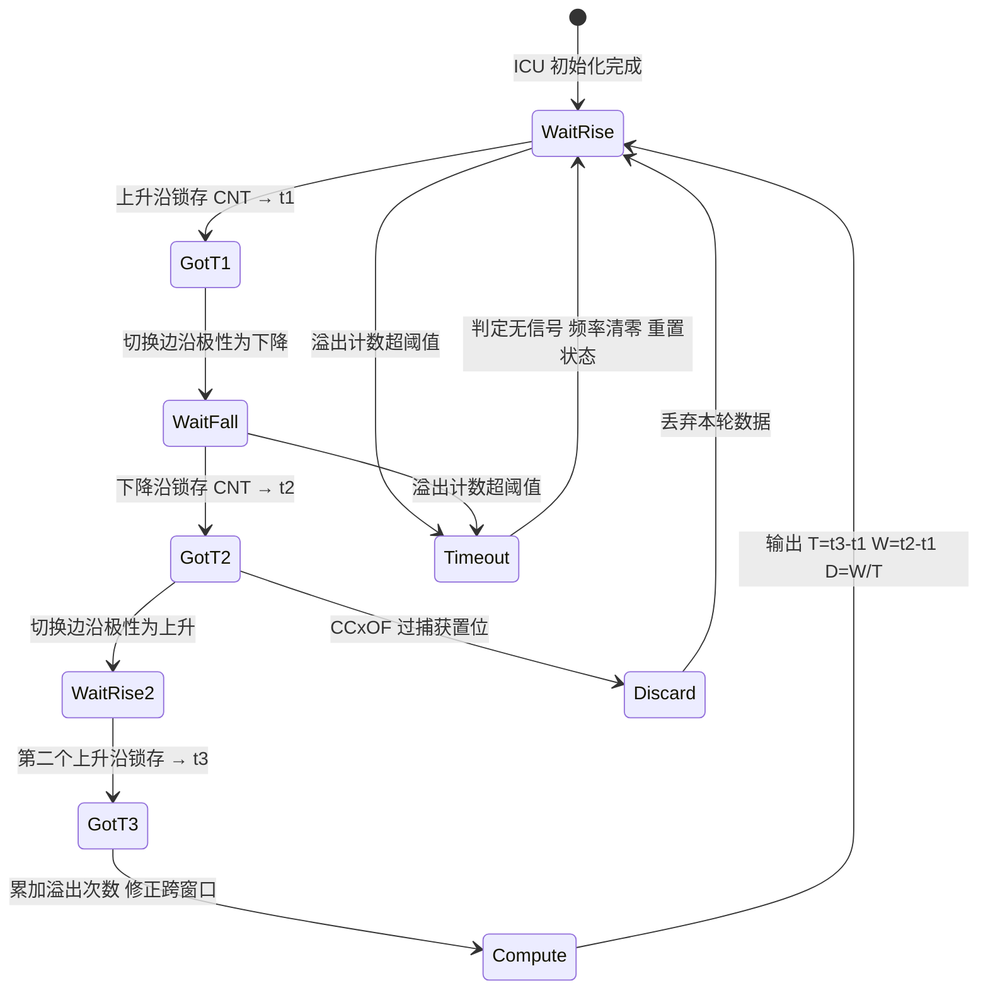

### 9.4 噪声滤波与数字去抖

ICU 多数支持**数字滤波**：连续 N 个采样周期都检测到同一电平才认定有效边沿，可有效剔除窄毛刺。滤波采样时钟来自 `CK_DTS` 分频，滤波深度可配（典型 2/4/8 个采样点）。代价是引入与滤波深度成正比的边沿延迟。

一个实用的选择法则：设最短需要识别的有效脉宽为 `W_min`，最宽需要滤掉的毛刺为 `W_noise`，则滤波窗口 `T_filter` 应满足 `W_noise < T_filter < W_min`。若这个区间不存在，说明毛刺和有效信号在时间尺度上无法区分，必须靠硬件（RC 滤波、施密特触发器、隔离器）解决，而不是继续调滤波深度。

### 9.5 两种测频法：周期法 vs 闸门法

- **周期法（测周法）**：捕获相邻两个同沿的时间差作为周期 `T`，频率 `f = 1/T`。优点是实时、单次即可得；缺点是在高频时 `T` 很小，±1 计数步的相对误差被放大（相对误差 ≈ `T_tim / T`），即**低频准、高频差**。
- **闸门法（测频法）**：固定一段门控时间 `T_gate`，统计这段时间内信号边沿个数 `N_edge`，频率 `f = N_edge / T_gate`。优点是高频时精度高；缺点是需等待门控时间、实时性差，且存在 ±1 边沿的截断误差。

两者的误差交叉点大致在 `f_signal ≈ sqrt(f_tim / T_gate)` 附近。对于 `f_tim = 1 MHz`、`T_gate = 100 ms` 的配置，交叉点约在 3.2 kHz——低于它用周期法，高于它用闸门法。工程上还有一种**等精度测频法**：用被测信号同步门控窗口，同时计被测信号周期数与高频基准时钟数，可在全频段获得恒定相对精度，代价是需要两路计数器。

### 9.6 DMA 搬运与高频采集

高频信号边沿密集，若每次捕获都进中断，CPU 会被淹没。定时器 ICU 普遍支持 **DMA 请求**：捕获事件触发 DMA 把 CCR 自动搬进内存环形缓冲，CPU 只在缓冲半满/全满时批量处理。这样既能测高频，又把 CPU 占用降到极低。代价是需要管理"最新有效样本"指针与缓冲覆盖，环形 DMA 靠半传输/传输完成中断切半处理。

---

## 十、典型应用深度剖析

### 10.1 电机控制：六步换相与正弦 PWM

**六步换相（Six-Step）**：用于 BLDC 无刷直流电机。电机三相绕组在任意时刻只有两相导通、一相悬空，按固定顺序每 60° 电角度切换一次，共 6 个扇区。换相时刻由霍尔传感器（3 路霍尔，ICU 捕获其边沿得到位置）或反电动势过零检测决定。

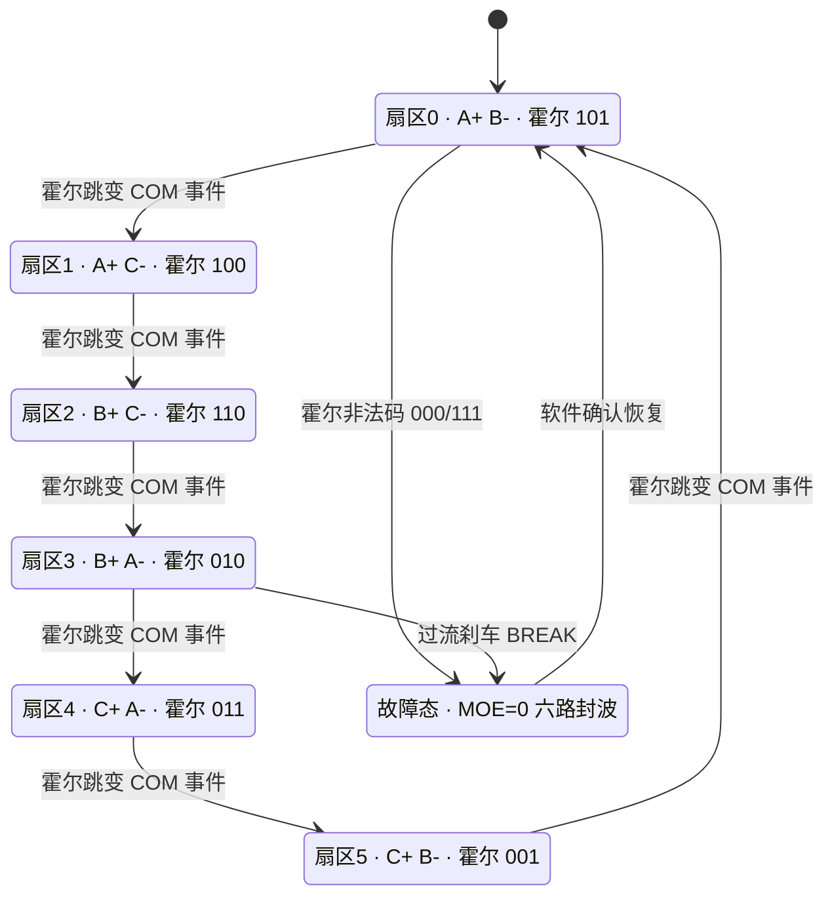

**正弦 PWM（SPWM）/ FOC**：用于永磁同步电机。目标是在三相上输出幅值、相位可调的正弦电压，通过空间矢量调制（SVPWM）提高母线利用率。这里几乎必然用**中心对齐 PWM**。FOC 算法每 PWM 周期执行一次：采样三相电流 → Clark/Park 变换 → PI 调节 → 反 Park → SVPWM 算出三相比较值 → 写入 CCR 影子寄存器，待更新事件同步生效（见 8.6 节代码）。

| 维度 | 六步换相 | 正弦 PWM / FOC |
|------|----------|----------------|
| 输出波形 | 方波（120° 导通） | 正弦（SVPWM） |
| 对齐方式 | 边沿或中心均可 | 多用中心对齐 |
| 定时器特性依赖 | COM 事件 + CCPC | 影子寄存器 + TRGO 触发 ADC |
| 转矩脉动 | 较大 | 小 |
| 控制复杂度 | 低 | 高 |
| 位置反馈 | 霍尔/反电动势 | 编码器/旋变/观测器 |
| 典型场景 | 风扇、低成本风机 | 电动汽车、伺服 |

### 10.2 SVPWM 与占空比映射

FOC 算完 `Vα/Vβ` 后，先经 SVPWM 合成：把三相逆变的 8 个开关状态（6 个有效矢量 + 2 个零矢量）在复平面构成六边形扇区，按伏秒平衡把目标电压矢量分解为相邻两个有效矢量与零矢量的作用时间 `T1/T2/T0`，再映射到三路比较值。SVPWM 相比直接正弦调制能提高约 15.5% 的母线电压利用率（线性调制区从 `Vdc/2` 提升到 `Vdc/√3`），对电池供电的电机很关键。

映射到定时器时，三路比较值通常为：

```
T0 = T_pwm - T1 - T2
Ta = T0 / 4                    （最先开通的相）
Tb = Ta + T1 / 2
Tc = Tb + T2 / 2
（再按扇区把 Ta/Tb/Tc 分配给 A/B/C 三相）
```

必须保证结果落在 `[0, ARR]` 内（过调制处理另论）。写入 CCR 时务必等中心对齐的更新事件同步刷新，否则三相会"各改各的"导致瞬时不对称、电流冲击。笔者强调：SVPWM 的扇区判断与桥臂响应方向要一一对应，任何一路极性反接都会让电机抖动甚至过流，上电前必须用示波器逐相核对波形与手册时序。

### 10.3 舵机、LED 与蜂鸣器

**舵机**：标准 RC 舵机使用 50 Hz（周期 20 ms）PWM，靠脉宽表示角度——1.0 ms 对应一端极限、**1.5 ms 为中值**、2.0 ms 对应另一端。占空比范围约 5%~10%。由于频率低，对分辨率要求反而高：用 1 MHz 计数步，1 ms 对应 1000 个计数步，足以细分上千级位置。注意很多舵机对脉宽容差较严，且上电要先给中值再给目标值，否则会"抽搐"。

**LED 调光**：本质是控制平均电流。频率过低（< 200 Hz）人眼可察觉闪烁、相机拍摄出现滚动条纹；频率过高（> 数十 kHz）开关损耗上升、EMI 变差；常用 1 kHz ~ 几 kHz。调光的"伽马校正"也常被忽略：人眼对亮度是非线性的，线性占空比会让低亮度段变化突兀，需要把 8 位亮度值经伽马曲线映射到占空比。

**蜂鸣器**：有源蜂鸣器内部带振荡电路，给直流即可响，占空比没有意义；无源蜂鸣器本质是扬声器，必须由 PWM 提供交变方波才能发声，频率对应音高（常用 2~4 kHz），占空比 50% 即可。

### 10.4 DCDC 与数字电源

Buck、Boost、半桥/全桥 LLC 等开关电源，功率级完全由一对或多对互补 PWM 驱动。频率直接决定磁性元件体积与损耗，是典型的折中艺术。同步整流 Buck 用互补 PWM + 死区驱动上下管，死区内的体二极管导通造成额外损耗，因此往往做**死区自适应**或在轻载时关掉同步管。

多相 Buck 要求多路 PWM 严格**交错（interleaved）**——各相相位差 `360°/N`，以抵消输入纹波、提升瞬态响应。这种相移只能用"双沿/移相 PWM + 主从定时器同步"实现。

### 10.5 定时器同步与移相 PWM

复杂系统里常需多颗定时器协同。主定时器在更新事件/比较事件时通过 TRGO 向从定时器发出同步信号，从定时器把该信号作为外部时钟或复位源（SMS 位域），实现"主一计数，从同时归零"。这样多路 PWM 的相位关系由硬件锁定，不会因软件先后启动而漂移。

笔者的经验是：凡是要求"多通道严格同相或固定相差"的场合，绝不能用"先后调用两个 Start"来对齐，必须用硬件触发同步，否则启动差几个微秒就足以让交错电源失去纹波抵消效果。

---

## 十一、【核心章节 C】MCAL 配置说明：AUTOSAR 下的 Pwm / Icu / Gpt

在汽车电子项目中，工程师很少直接写寄存器，而是通过 **MCAL（Microcontroller Abstraction Layer）** 配置生成驱动。AUTOSAR 把定时器能力拆成三个标准模块：**Pwm**（输出）、**Icu**（输入捕获）、**Gpt**（通用定时/触发）。理解硬件之后再看 MCAL，会发现每一个配置项背后都对应着前面讲过的某个寄存器位。

### 11.1 分层架构与调用路径

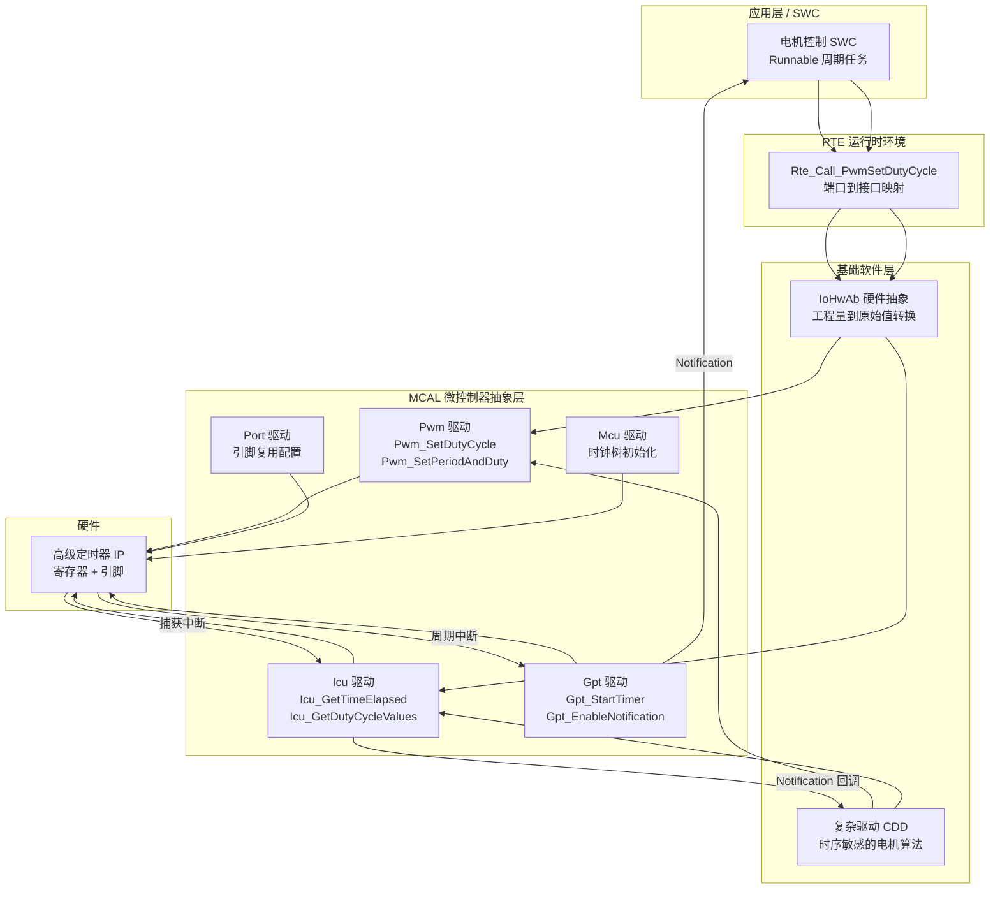

需要强调：**高实时性的电机控制通常不走 RTE，而是做成 CDD（Complex Device Driver）直接调用 MCAL 甚至直接操作寄存器**，因为 RTE 的调度延迟无法满足 20 kHz 控制环。AUTOSAR 允许这种"绕行"，但要在架构文档里显式声明。

### 11.2 Pwm 模块：配置项与 API

AUTOSAR Pwm 驱动把每一路 PWM 抽象为一个 **PwmChannel**，其核心属性如下：

| 配置容器 / 参数 | 含义 | 对应硬件寄存器位 | 典型取值 |
|-----------------|------|------------------|----------|
| PwmChannelId | 通道逻辑 ID，API 入参 | 无（软件映射） | 0,1,2... |
| PwmHwChannel / PwmHwUnit | 绑定到哪个定时器的哪个通道 | 外设实例选择 | TIM1_CH1 |
| PwmChannelClass | 通道类别 | 决定生成代码路径 | VARIABLE_PERIOD / FIXED_PERIOD |
| PwmPeriodDefault | 默认周期 | PSC + ARR | 50 µs（20 kHz） |
| PwmDutycycleDefault | 默认占空比 | CCRx | 0x0000（0%）~0x8000（100%） |
| PwmPolarity | 极性 | CCER.CCxP | PWM_HIGH / PWM_LOW |
| PwmIdleState | 空闲电平 | CR2.OISx | PWM_LOW / PWM_HIGH |
| PwmChannelAlignment（厂商扩展） | 对齐方式 | CR1.CMS | EDGE / CENTER |
| PwmNotification | 通知回调函数名 | DIER.CCxIE | Pwm_Ch0_Notify |
| PwmNotificationSupported | 是否使能通知 | 中断使能总开关 | true / false |
| PwmDeadTime（厂商扩展） | 死区时间 | BDTR.DTG | 500 ns |
| PwmComplementaryOutput（厂商扩展） | 是否使能互补通道 | CCER.CCxNE | true |
| PwmFaultChannel / PwmSafeState（厂商扩展） | 刹车输入与安全态 | BDTR.BKE/BKP、OSSR | 使能 + LOW |

标准 API 与典型用法：

```c
/* ---------- AUTOSAR Pwm 模块典型调用 ---------- */
#include "Pwm.h"

/* 生成的配置结构体，由 EB tresos / DaVinci 输出到 Pwm_Cfg.c */
extern const Pwm_ConfigType Pwm_Config;

/* 通道 ID 由配置工具生成到 Pwm_Cfg.h，不要硬编码数字 */
#define PWM_CH_MOTOR_U   PwmConf_PwmChannel_PwmChannel_MotorU
#define PWM_CH_MOTOR_V   PwmConf_PwmChannel_PwmChannel_MotorV
#define PWM_CH_MOTOR_W   PwmConf_PwmChannel_PwmChannel_MotorW
#define PWM_CH_LED       PwmConf_PwmChannel_PwmChannel_LedDim

void MotorDrv_Init(void)
{
    /* 1) Mcu/Port 已在 EcuM 中初始化完毕，此处只初始化 Pwm */
    Pwm_Init(&Pwm_Config);

    /* 2) 上电先把三相占空比清零，确保功率级静默 */
    Pwm_SetDutyCycle(PWM_CH_MOTOR_U, 0x0000u);
    Pwm_SetDutyCycle(PWM_CH_MOTOR_V, 0x0000u);
    Pwm_SetDutyCycle(PWM_CH_MOTOR_W, 0x0000u);

    /* 3) 若配置了通知，需显式使能，边沿类型决定回调时机 */
    Pwm_EnableNotification(PWM_CH_MOTOR_U, PWM_RISING_EDGE);
}

/*
 * 占空比参数是 16 位定点数：
 *   0x0000 =   0%
 *   0x4000 =  50%
 *   0x8000 = 100%
 * 注意 AUTOSAR 规定 0x8000 才是满量程，不是 0xFFFF。
 */
static uint16 Duty_PermyriadToAbs(uint16 permyriad)
{
    if (permyriad > 10000u) {
        permyriad = 10000u;
    }
    return (uint16)(((uint32)permyriad * 0x8000u) / 10000u);
}

void MotorDrv_SetThreePhase(uint16 du, uint16 dv, uint16 dw)
{
    /* 逐通道调用，注意：标准 API 无法保证三相严格同一时刻生效，
       对 FOC 这类要求同步刷新的场景，需使用厂商扩展的
       Pwm_SetDutyCycleSync() 或直接由 CDD 写影子寄存器。 */
    Pwm_SetDutyCycle(PWM_CH_MOTOR_U, Duty_PermyriadToAbs(du));
    Pwm_SetDutyCycle(PWM_CH_MOTOR_V, Duty_PermyriadToAbs(dv));
    Pwm_SetDutyCycle(PWM_CH_MOTOR_W, Duty_PermyriadToAbs(dw));
}

void LedDim_SetBrightness(uint8 level)
{
    /* 变周期通道可以同时改周期与占空比，用于扫频或变频调光 */
    Pwm_SetPeriodAndDuty(PWM_CH_LED,
                         (Pwm_PeriodType)1000u,          /* 周期，单位由配置决定 */
                         Duty_PermyriadToAbs((uint16)level * 39u));
}

void MotorDrv_EmergencyStop(void)
{
    /* 把通道强制到空闲电平：等价于清 CCR + 让输出进入 OISx 状态。
       注意这不能替代硬件 BREAK——它是软件路径，有调度延迟。 */
    Pwm_SetOutputToIdle(PWM_CH_MOTOR_U);
    Pwm_SetOutputToIdle(PWM_CH_MOTOR_V);
    Pwm_SetOutputToIdle(PWM_CH_MOTOR_W);
}
```

### 11.3 Icu 模块：配置项与 API

Icu 驱动把输入捕获抽象为 **IcuChannel**，并定义了四种测量模式：

| 测量模式 | 用途 | 主要 API |
|----------|------|----------|
| ICU_MODE_SIGNAL_EDGE_DETECT | 单次边沿检测，边沿到达触发通知 | Icu_EnableEdgeDetection / Icu_GetInputState |
| ICU_MODE_SIGNAL_MEASUREMENT | 测量高/低电平时长、周期、占空比 | Icu_StartSignalMeasurement / Icu_GetTimeElapsed / Icu_GetDutyCycleValues |
| ICU_MODE_TIMESTAMP | 把连续多个边沿时间戳存入数组 | Icu_StartTimestamp / Icu_GetTimestampIndex |
| ICU_MODE_EDGE_COUNTER | 统计边沿个数（闸门法测频基础） | Icu_EnableEdgeCount / Icu_GetEdgeNumbers |

主要配置项：

| 配置容器 / 参数 | 含义 | 对应硬件 | 典型取值 |
|-----------------|------|----------|----------|
| IcuChannelId | 通道逻辑 ID | 软件映射 | 0,1,2... |
| IcuHwChannel / IcuHwUnit | 绑定的定时器通道 | 外设实例 | TIM3_CH1 |
| IcuMeasurementMode | 测量模式 | CCMR/SMCR 组合 | SIGNAL_MEASUREMENT |
| IcuSignalMeasurementProperty | 测什么量 | 边沿与从模式配置 | DUTY_CYCLE / PERIOD_TIME / HIGH_TIME |
| IcuDefaultStartEdge | 起始边沿 | CCER.CCxP/CCxNP | RISING / FALLING / BOTH |
| IcuFilter（厂商扩展） | 数字滤波深度 | CCMR.ICxF | 4 samples |
| IcuPrescaler（厂商扩展） | 定时器分频，决定分辨率 | PSC | 分频到 1 MHz |
| IcuWakeupCapability | 是否可作为唤醒源 | EXTI/唤醒逻辑 | false |
| IcuNotification | 捕获通知回调 | DIER.CCxIE | Icu_HallEdge_Notify |
| IcuOverflowNotification | 溢出通知回调 | DIER.UIE | Icu_Ovf_Notify |
| IcuTimestampMeasurement | 时间戳缓冲配置 | DMA 通道绑定 | 缓冲深度 64 |

```c
/* ---------- AUTOSAR Icu 模块典型调用：测霍尔转速与遥控 PWM ---------- */
#include "Icu.h"

extern const Icu_ConfigType Icu_Config;

#define ICU_CH_HALL_A   IcuConf_IcuChannel_IcuChannel_HallA
#define ICU_CH_RC_IN    IcuConf_IcuChannel_IcuChannel_RcPwmIn

static Icu_DutyCycleType s_rc_duty;

void IcuUser_Init(void)
{
    Icu_Init(&Icu_Config);

    /* 霍尔：边沿检测模式，用通知回调做换相与测速 */
    Icu_SetActivationCondition(ICU_CH_HALL_A, ICU_BOTH_EDGES);
    Icu_EnableNotification(ICU_CH_HALL_A);
    Icu_EnableEdgeDetection(ICU_CH_HALL_A);

    /* 遥控输入：信号测量模式，硬件自动测周期与占空比 */
    Icu_StartSignalMeasurement(ICU_CH_RC_IN);
}

/* 周期任务中读取遥控 PWM 的脉宽（单位：定时器 tick） */
uint16 RcInput_GetPulseUs(void)
{
    Icu_GetDutyCycleValues(ICU_CH_RC_IN, &s_rc_duty);

    /* ActiveTime / PeriodTime 均为 tick 数；
       若 PeriodTime 为 0 说明尚未测到完整周期，返回中值保护 */
    if (s_rc_duty.PeriodTime == 0u) {
        return 1500u;
    }

    /* 前提：IcuPrescaler 已把 tick 配成 1 µs */
    return (uint16)s_rc_duty.ActiveTime;
}

/* 霍尔边沿通知：只做最小工作量，重活扔给任务 */
void Icu_HallEdge_Notify(void)
{
    static uint32 last_tick = 0u;

    /* Icu_GetTimeElapsed 返回自上次调用以来经过的 tick 数 */
    Icu_ValueType elapsed = Icu_GetTimeElapsed(ICU_CH_HALL_A);

    if (elapsed != 0u) {
        /* 转速 = 60 / (电周期 × 极对数)，此处仅存原始值 */
        MotorSpeed_PushRawTick((uint32)elapsed);
        last_tick = (uint32)elapsed;
    }
    (void)last_tick;

    MotorCommutation_RequestUpdate();   /* 置标志，换相在 CDD 里做 */
}

/* 溢出通知：判定信号丢失 */
void Icu_Ovf_Notify(void)
{
    MotorSpeed_MarkStall();             /* 长时间无边沿 = 堵转或断线 */
}
```

### 11.4 Gpt 模块：周期定时与触发

Gpt 驱动提供最纯粹的"倒计时定时器"能力，常用于 OS 时基之外的独立周期任务、超时监控、以及为 ADC/DMA 提供固定节拍。

| 配置容器 / 参数 | 含义 | 对应硬件 | 典型取值 |
|-----------------|------|----------|----------|
| GptChannelId | 通道逻辑 ID | 软件映射 | 0,1 |
| GptHwChannel | 绑定的定时器 | 外设实例 | TIM6 |
| GptChannelMode | 单次 / 连续 | CR1.OPM | CONTINUOUS |
| GptChannelTickFrequency | 计数频率 | PSC | 1 MHz |
| GptChannelTickValueMax | 最大计数值 | ARR 位宽 | 0xFFFF |
| GptNotification | 到期回调 | DIER.UIE | Gpt_1ms_Notify |
| GptEnableWakeup | 是否用于唤醒 | 低功耗域配置 | false |
| GptPredefTimer | 预定义自由运行定时器 | 独立计数器 | 1us32bit |

```c
/* ---------- AUTOSAR Gpt：周期触发与超时监控 ---------- */
#include "Gpt.h"

extern const Gpt_ConfigType Gpt_Config;
#define GPT_CH_CTRL_1MS   GptConf_GptChannelConfiguration_Ctrl1ms

void GptUser_Init(void)
{
    Gpt_Init(&Gpt_Config);
    Gpt_EnableNotification(GPT_CH_CTRL_1MS);

    /* TickFrequency 配成 1 MHz 时，1000 tick = 1 ms */
    Gpt_StartTimer(GPT_CH_CTRL_1MS, 1000u);
}

void Gpt_1ms_Notify(void)
{
    Motor_SafetyTask_Tick();     /* 驱动 8.5 节的故障恢复状态机 */
    LedDim_RampTick();
}

/* 用预定义自由运行定时器做精确耗时测量 */
uint32 Profile_MeasureUs(void (*fn)(void))
{
    Gpt_ValueType t0, t1;
    (void)Gpt_GetPredefTimerValue(GPT_PREDEF_TIMER_1US_32BIT, &t0);
    fn();
    (void)Gpt_GetPredefTimerValue(GPT_PREDEF_TIMER_1US_32BIT, &t1);
    return (uint32)(t1 - t0);    /* 无符号相减自动处理回绕 */
}
```

### 11.5 从配置到运行：完整链路

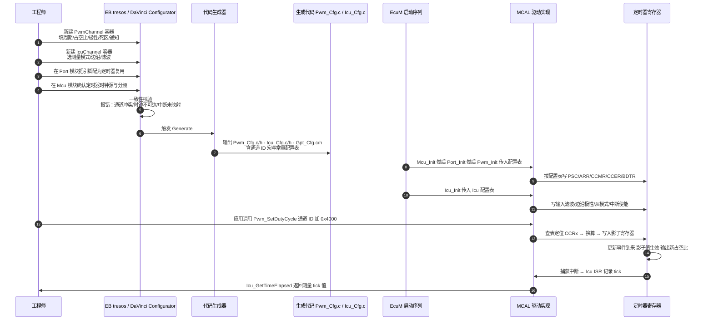

### 11.6 互补输出、死区与刹车在 MCAL 中的落点

这是 AUTOSAR 规范的一个"灰色地带"：标准的 Pwm SWS 并没有定义互补输出、死区与刹车的配置接口，因为它们高度依赖硬件。各家 MCAL 的处理方式如下：

| 硬件能力 | 标准 AUTOSAR | 厂商实现方式 | 配置位置示例 |
|----------|--------------|--------------|--------------|
| 互补输出 CHxN | 未定义 | 厂商扩展参数或"通道对"概念 | PwmComplementaryEnable = true |
| 死区时间 | 未定义 | 以 ns 或 tick 为单位的扩展参数 | PwmDeadTimeValue = 500（ns） |
| 刹车 BREAK | 未定义 | 独立的 Fault/SafetyPin 容器 | PwmFaultInputEnable + PwmFaultPolarity |
| 关断安全态 | 部分由 IdleState 覆盖 | 扩展 OSSR/OSSI 参数 | PwmOutputStateRunMode = DISABLED |
| 中心对齐 | 未定义 | 扩展 Alignment 参数 | PwmAlignment = CENTER_ALIGNED |
| 三相同步更新 | 未定义 | 扩展同步 API 或通道组 | Pwm_SetDutyCycleSync(group, buf) |
| 定时器触发 ADC | 未定义（属 Adc 模块） | Adc 侧配置触发源 | AdcHwTriggerSource = TIM1_TRGO |

实践建议有三条：

1. **凡是安全相关的配置（死区、刹车、空闲电平），一定要在生成代码里逐字核对**，不要只信工具界面。笔者的习惯是生成后直接搜 `BDTR` 在初始化代码里的赋值，用计算器验算 DTG 段编码。
2. **不要在应用层依赖厂商扩展 API**，把它们封在一个薄薄的适配层里，换芯片时只改这一层。
3. **对 20 kHz 以上的控制环，评估 MCAL API 的开销**。`Pwm_SetDutyCycle` 内部通常有通道有效性检查、Det 错误上报等分支，三次调用可能耗掉数微秒；实时性紧张时改用 CDD 直接写寄存器，并在文档中说明偏离理由。

### 11.7 常见 MCAL 配置错误

| 现象 | 可能的配置原因 |
|------|----------------|
| 完全没有 PWM 输出 | Port 模块未把引脚配成定时器复用；或 Pwm_Init 未被 EcuM 调用 |
| 输出频率是期望值的两倍或一半 | 对齐方式配成中心对齐但周期按边沿对齐算 |
| 占空比只能到 50% | 把 0xFFFF 当满量程用了，实际满量程是 0x8000 |
| 通知回调从不触发 | PwmNotificationSupported=false，或忘记调 Pwm_EnableNotification |
| Icu 读到的值恒为 0 | 未调 Icu_StartSignalMeasurement；或测量模式选成了 EDGE_DETECT |
| Icu 数值随机跳变 | IcuPrescaler 使计数窗口过短导致频繁溢出；或未处理 OverflowNotification |
| 互补输出只有一路有波形 | 厂商扩展的 ComplementaryEnable 未打开，或对应引脚未在 Port 中配置 |
| 上电瞬间电机抖一下 | PwmDutycycleDefault 非零，或 IdleState 与驱动芯片有效电平不匹配 |

---

## 十二、常见坑与调试手段

1. **死区时间不足 → 半桥直通炸管**：最致命。务必用示波器双通道同时抓上下桥臂栅极，量重叠区；确认死区是**硬件插入**（BDTR.DTG）而非软件延时。

2. **死区过长 → 输出畸变、效率下降、低频转矩脉动**：电流死区效应会在电机低速时产生明显非线性。可做死区补偿（按电流方向对 CCR 前馈修正），但前提是硬件死区本身合理。

3. **占空比分辨率不足**：高频下 ARR 被迫很小，占空比级数骤降。对策是提高 `f_tim`、降低 PWM 频率，或选用更高位宽/高分辨率定时器。

4. **PWM 频率整体算错（±1 / 倍频 / 中心对齐陷阱）**：`f_pwm = f_tim/(ARR+1)`，别漏 `+1`；中心对齐要再除以 2；注意 APB 倍频规则。先量 `f_tim` 再反推。

5. **ICU 中断里做重运算导致丢边沿**：ISR 必须"只存时间戳、算在任务级"，或改用 DMA。务必同时监控 `CCxOF` 过捕获标志。

6. **ICU 溢出未处理**：测低频时 CNT 多次回绕，必须维护溢出计数，否则时间差算成负数或乱值。

7. **互补通道极性配反**：导致"该关时开着"。功率级上电前务必先用小电流限流电源、示波器确认六路波形与相位关系。

8. **刹车未使能、极性反或引脚悬空**：许多炸管事故源于此。验证方法是主动把 BKIN 拉到有效电平，观察输出是否立即封波——这一步必须在装功率管之前做。

9. **影子寄存器未使能导致波形毛刺**：改 ARR/CCR 不预装载，写入瞬间破坏周期，闭环里表现为周期性抖动。

10. **数字滤波过深引入边沿延迟**：ICU 测高频时深滤波会让测得周期系统性偏大，且可能吞掉窄脉冲。

11. **BDTR.LOCK 写早了改不动**：LOCK 位一旦置位只能靠复位清除，初始化顺序里它必须排在最后。

12. **初始化顺序错误导致上电毛刺**：正确顺序是"GPIO 输出安全电平 → 配置定时器 → CCR 清零 → 切引脚到复用 → 开 MOE → 开 CEN"。先切复用再配置，那几微秒的未定义输出足以让功率管误动作。

13. **中心对齐下 ADC 采样点落在开关沿**：采到的电流全是开关噪声。用 OC4REF 作为 TRGO，把采样点移到波谷。

14. **多定时器用软件先后启动来"同步"**：必然存在微秒级相位差。必须用主从触发硬件同步。

调试工具箱建议：示波器（至少双通道，最好四通道带差分探头看栅极）、逻辑分析仪（看多路 PWM 时序关系与换相顺序）、限流可调直流电源（首次上电必用）、以及在代码里预埋的"波形自检"函数（上电后依次以极低占空比点亮六路，用示波器逐一确认）。

---

## 十三、面试高频要点精选

1. **PWM 占空比怎么算？频率由什么决定？**
   `D ≈ CCR/ARR`（严格 `(CCR+1)/(ARR+1)`），`f_pwm = f_tim/(ARR+1)`，中心对齐再除以 2。

2. **占空比与平均电压的关系？频率影响什么？**
   `V_avg = D × V_supply`；频率只影响纹波与开关损耗，不影响平均值。

3. **死区为什么必须？为什么必须由硬件插入？**
   功率器件关断慢于开通，无死区会直通短路；软件延时受中断抖动影响，不准且不可靠。

4. **死区过长有什么后果？怎么补偿？**
   有效导通时间压缩、输出畸变、低频转矩脉动；可按电流方向对 CCR 做前馈补偿。

5. **边沿对齐和中心对齐的区别？为什么 FOC 用中心对齐？**
   锯齿波 vs 三角波；中心对齐抑制偶次谐波、EMI 低、死区对称，且波谷是天然的电流采样点。

6. **占空比小于死区时会发生什么？**
   脉冲被完全吞掉，输出出现死区台阶，这是死区非线性的根源。

7. **ICU 相比 GPIO 中断好在哪？**
   硬件在边沿瞬间锁存计数值，不受中断延迟影响，精度纳秒级且几乎不占 CPU。

8. **PWM 输入模式为什么比软件切边沿好？**
   双通道交叉映射到同一引脚，硬件同时得到周期与脉宽，消除了切换延迟这个误差源。

9. **ICU 测低频为什么要处理溢出？**
   周期大于计数窗口会多次回绕，时间 = 溢出次数×(ARR+1) + 捕获差。

10. **CCxOF 过捕获标志有什么用？**
    指示上次捕获值未读走就被覆盖，是判断"丢边沿、数据不可信"的唯一硬件依据。

11. **周期法与闸门法怎么选？**
    低频用周期法（实时），高频用闸门法（多周期平均）；追求全频段恒定精度用等精度测频法。

12. **高级定时器比通用定时器多了什么？**
    互补输出 CHxN、死区发生器 DTG、刹车 BREAK 与 MOE、重复计数器 RCR、COM 换相事件。

13. **刹车触发后硬件做了什么？AOE 该怎么配？**
    硬件清 MOE、输出进入 OSSR/OISx 安全态、置 BIF；功能安全场景 AOE 必须为 0，禁止自动恢复。

14. **RCR 重复计数器有什么用？**
    降低更新中断频率；在中心对齐下决定 UEV 落在波峰还是波谷，从而决定采样时刻。

15. **CCPC 与 COM 事件解决了什么问题？**
    让六路通道使能位在同一时刻整体切换，避免六步换相过程中出现瞬时直通。

16. **定时器怎么触发 ADC？为什么不用软件触发？**
    通过 MMS 选 OC4REF 作为 TRGO 硬件触发；软件触发抖动达微秒级，会恶化电流环性能。

17. **为什么 ARR/CCR 要开预装载？**
    避免运行中写入破坏当前周期，保证多通道在同一 UEV 同步生效、相位连续。

18. **CKD 和 PSC 有什么区别？**
    PSC 分频得到计数时钟；CKD 只分频死区与数字滤波的采样时钟，不影响计数频率。

19. **AUTOSAR Pwm 的占空比参数满量程是多少？**
    0x8000 表示 100%，而不是 0xFFFF——这是最常见的移植 bug。

20. **Icu 的四种测量模式分别用于什么？**
    边沿检测、信号测量（周期/占空比）、时间戳记录、边沿计数。

21. **互补、死区、刹车在 AUTOSAR 里怎么配？**
    标准 SWS 未定义，全靠厂商扩展参数；必须核对生成代码里的 BDTR 赋值。

22. **为什么高实时电机控制常绕过 RTE 用 CDD？**
    RTE 调度延迟无法满足 20 kHz 控制环，CDD 允许直接访问 MCAL 或寄存器。

23. **S32K eMIOS 与 STM32 高级定时器最大的结构差异是什么？**
    eMIOS 是可重构统一通道 + 计数总线，死区集成在 OPWMCB 模式里；STM32 是固定通道 + 独立 DTG 单元。

24. **上电初始化顺序为什么重要？**
    先切复用后配置会在几微秒内输出未定义电平，可能误导通功率管；正确顺序是先输出安全电平再切复用。

25. **舵机的标准参数？LED 调光频率怎么选？**
    舵机 50 Hz、脉宽 1.0/1.5/2.0 ms；LED 常用 1 kHz~几 kHz，低于 200 Hz 会闪，且低亮度段需伽马校正。

---

## 十四、小结

PWM 与 ICU 是嵌入式定时器模块中最常用也最考验功力的两个功能。回顾本章的三条主线：

**芯片模块设计**告诉我们，高级定时器是一块结构清晰的 IP——时基单元产生节拍，比较捕获通道在输出与输入两种人格间切换，死区发生器保证互补对永不重叠，刹车逻辑走最短路径直达输出使能，触发控制器把定时器变成整个 SoC 的时间主节点。理解这张框图，就理解了为什么 CCR 要有影子寄存器、为什么改 PSC 不影响死区、为什么刹车比软件保护快三个数量级。

**驱动代码实现**告诉我们，配置的本质是"从工程指标反推寄存器值"：从目标频率反推 PSC/ARR 并检查分辨率余量，从死区纳秒数反推 DTG 分段编码，从采样时刻反推 CCR4 与 TRGO 配置。每一行寄存器赋值背后都应该有一个可以口算验证的物理量。

**MCAL 配置说明**告诉我们，在汽车电子的规范化流程里，这些能力被封装成 Pwm/Icu/Gpt 三个标准模块，但互补、死区、刹车这些最关键的安全特性恰恰落在标准之外，必须靠厂商扩展并逐字核对生成代码——工具链再完善，也替代不了工程师对硬件的理解。

工程落地的关键，从来不在于"会调库函数"，而在于理解背后的计数器节拍、对齐方式的谐波差异、死区的物理必要性、刹车路径的时序，以及 ICU 溢出与过捕获的处理。把时钟树算清、把框图画明、把示波器用熟、把刹车配实并实测触发，才能在台架上少冒几缕青烟。
