# ADC 模数转换深度详解：从芯片 IP 架构、驱动实现到 MCAL 工程实践

## 一、引言：为什么 ADC 是系统感知的"眼睛"

在任何一个以"感知—决策—执行"为主线的嵌入式系统里，模数转换器（Analog-to-Digital Converter，ADC）都扮演着最前端的"感官"角色。无论是电池管理系统（BMS）里对单体电压与总压的毫伏级监控，电机控制中对相电流的实时采样，工业传感里对温度、压力、流量的量化，还是音频采集、生物电测量，信号从连续模拟世界进入离散数字世界的第一道关口，必然是 ADC。

笔者在多个量产项目中反复遇到一个事实：**分辨率（resolution）和精度（accuracy）是两个被严重混淆的概念**。一个标称 12 位的 ADC，并不意味着它能把输入电压量准到一个 12 位步长（LSB）之内。许多工程师把"分辨率"等同于"精度"，结果在系统联调时发现：标称 12 位的转换值上下跳动好几个码、温度一变零点就漂、相邻通道互相"串门"。这些现象背后，是 INL/DNL、offset/gain error、参考电压稳定性、采样保持的建立时间、通道间串扰、孔径抖动等一系列被忽视的物理因素在作祟。

以动力域 BMS 为例，整车厂对单体电压采样的绝对精度要求常常是 ±2mV 量级。如果用 12 位 ADC、参考电压 3.3V，一个 LSB 约为 0.8mV，看似绰绰有余；但假如参考电压本身有 0.1% 的温漂、采样电容没有充足时间建立、或者通道切换时发生了电荷注入，那么实际绝对误差很容易突破数个甚至十余个 LSB，把 ±2mV 的安全裕度彻底吞掉。于是会出现两类危险的误判：把本来正常的电芯判为过压，导致无谓降功率或断开高压；或者把本已过压的电芯"读低"，使热失控风险被掩盖。**在安全关键系统中，ADC 不是"大概量一下"的感官，而是安全决策的眼睛。**

还有一个笔者认为必须在开篇就点破的认知误区：很多人把 ADC 当成"一个寄存器、读一下就有数"的黑盒。但从芯片设计的视角看，一个 MCU 内置 ADC 是一个完整的混合信号 IP：模拟前端的多路复用器、采样保持电路、SAR 电容阵列与比较器工作在模拟域；序列器、触发选择、数据对齐、看门狗比较、校准逻辑、DMA 握手工作在数字域；两个域之间还隔着异步时钟边界。驱动工程师如果不理解这个 IP 的内部结构，就无法解释"为什么改了时钟分频后采样值变了""为什么校准必须在 ADC 使能前做""为什么 DMA 溢出标志会置起"这些日常问题。

因此本章的目标分为三层：第一层，从 ADC 的两种主流架构（SAR 与 Σ-Δ）出发，逐层拆解分辨率、采样率、非线性误差、偏移/增益误差、SNR/ENOB、孔径抖动等关键参数，讲透采样保持电路与建立时间的物理本质；第二层，深入芯片模块设计视角，给出一个通用 ADC 控制器 IP 的内部架构框图、寄存器位域组织、时钟/复位域划分，以及它与 DMA、定时器的硬件协作方式；第三层，落到工程实现——完整可读的裸机驱动 C 代码（初始化、定时器触发扫描、注入组、DMA 循环采样、过采样平均、校准），以及车载领域 AUTOSAR MCAL 中 Adc 模块的配置方法与调用路径。通篇以"通用量级 + 公式表达"替代具体器件型号参数，避免编造虚假数据，同时保留可直接落地的工程判断方法。

---

## 二、ADC 的两大主流架构：SAR 与 Σ-Δ

现代嵌入式系统中最常见的两种 ADC 架构是 **SAR（Successive Approximation Register，逐次逼近寄存器）** 与 **Σ-Δ（Sigma-Delta，Sigma-Delta 调制）**。它们在速度、精度、功耗、成本上的取舍，决定了选型方向。

### 2.1 SAR（逐次逼近寄存器）ADC 的工作原理

SAR ADC 的核心思想非常直观，常被类比为一架"天平称重"：你不知道物体的重量，于是从最大的一颗砝码开始，依次尝试放下或拿开，每次比较"当前已放砝码之和"与"物体重量"的大小，逐步逼近真实值。对于 N 位 SAR，它从最高位（MSB）开始，把该位对应的"半量程"电压与输入比较，决定这一位是 1 还是 0，然后把目光移到下一位（其权重为前一位的一半），如此重复 N 次，得到 N 位结果。

从电路实现上看，SAR ADC 主要由四部分组成：

1. **采样保持电路（S&H，Sample-and-Hold）**：在采样阶段闭合开关，让外部信号给内部采样电容充电；保持阶段断开开关，把电压"冻结"在电容上。
2. **比较器（Comparator）**：把采样电容上的保持电压与 DAC 输出比较，给出一位判定。
3. **DAC（数模转换器）**：由 SAR 逻辑控制，根据当前已确定的位产生"试探电压"。现代 SAR 几乎清一色使用**电荷再分配电容阵列（CDAC）**——采样电容本身就是 DAC 电容阵列的一部分，采样与 DAC 复用同一组电容，省面积、省功耗且天然匹配。
4. **SAR 逻辑 / 逐次逼近寄存器**：驱动逐位比较的决策流程，并最终锁存结果。

其最重要的速度特征是：**完成一次转换所需的比较次数等于分辨率位数 N**。因此 12 位 SAR 需要 12 次比较，16 位需要 16 次，再加上采样时间，总转换时间大致为 `T_conv ≈ T_sample + N × T_compare`。在常见 MCU 实现中，这被表述为"转换需要 `采样周期数 + N.5 个 ADC 时钟周期"的形式（那半个周期用于逐位判决的锁存对齐）。这使得 SAR 在中等分辨率（8～16 位）、中等速度（数十 kSPS 到数 MSPS）区间极具性价比，是绝大多数 MCU 内置 ADC 的首选架构。

### 2.2 Σ-Δ（Sigma-Delta）ADC 的工作原理

Σ-Δ ADC 走的是一条完全不同的路线：**用"时间过采样 + 噪声整形 + 数字滤波/抽取"换取超高精度**。它并不直接去逐位比较输入电压，而是用一个 1 位（或少数几位）的高频量化器对输入与反馈之差进行密集调制，再通过后级的数字滤波器与抽取器把高频数据流"降速"并"提纯"成高分辨率结果。

其核心模块包括：

1. **过采样（Oversampling）**：以远高于奈奎斯特频率的速率（例如 fs 是信号带宽的 64～256 倍甚至更高）对输入采样。过采样把量化噪声的总能量铺在更宽的频率范围内，从而降低了目标频带内的噪声功率密度。
2. **噪声整形（Noise Shaping）**：通过积分器（Sigma 求和 + Delta 差分）结构，把量化噪声的频谱"推"到高频段，让信号带宽内的噪声进一步下降。阶数越高（1 阶、2 阶、3 阶…），整形效果越强，但高阶系统稳定性与环路设计也更难。
3. **数字滤波与抽取（Decimation）**：后级数字低通滤波器（常是 Sinc 滤波器，如 Sinc^3）滤掉高频噪声，再以抽取因子 M 降低数据速率，得到高分辨率、低速率的输出。

其分辨率与过采样比（OSR = fs / (2×f_bw)）的关系，在噪声整形下比普通平均"更划算"：一阶整形时，每 4 倍 OSR 大约带来 1 位以上分辨率提升（而普通白噪声平均需 4 倍才换 0.5 位）；理论上 L 阶整形每翻倍 OSR 可换约 (L+0.5) 位/倍频程的信噪比改善斜率。代价是数字滤波的群延迟随阶数与抽取率显著增大——Sinc^3 的延迟量级为 `3×(M−1)/fs`，这在需要快速阶跃响应的控制环里需要特别留意（往往用 Sinc^1/Sinc^2 折中，或在建立完成后才采信数据）。

结果是 Σ-Δ 极擅长 **高精度、低速** 应用：称重（电子秤、压力变送器）、温度与生物电测量、音频（高动态范围）、以及部分高精度电池监控前端，可以做到 20 位以上的有效分辨率（ENOB）。代价是吞吐率较低（常从几 SPS 到数百 kSPS），且转换存在固有的群延迟（建立时间长）。

下面的框图展示 Σ-Δ 信号链的全貌：

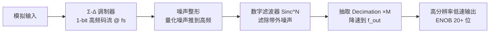

### 2.3 SAR 与 Σ-Δ 的取舍对比

下表从工程视角对比两类架构，帮助在选型时快速定位：

| 维度 | SAR ADC | Σ-Δ ADC |
|------|---------|---------|
| 典型分辨率 | 8～16 位（常见于 10/12/16 位） | 16～24 位（ENOB 可达 20+ 位） |
| 典型吞吐率 | 数十 kSPS 到数 MSPS | 数 SPS 到数百 kSPS |
| 建立时间/延迟 | 短，单次转换 μs~百 μs 级 | 长，存在数字滤波群延迟 |
| 精度来源 | 比较器/DAC 线性度、参考电压 | 过采样+噪声整形+数字滤波 |
| 多通道能力 | 强，配合 MUX 易做扫描 | 较弱，多为单/双通道高精度 |
| 抗混叠要求 | 较严（需前级抗混叠滤波） | 较宽松（过采样天然缓解） |
| 功耗/成本 | 中低，易集成于 MCU | 视精度而定，高精度前端偏贵 |
| 典型应用 | 通用传感、电机电流、BMS 快速采样 | 称重、温度、音频、高精度计量 |

取舍经验：需要"多通道、够快、性价比高"选 SAR（如 MCU 内置 ADC）；需要"单/双通道、极准、慢速"选 Σ-Δ（如外置计量 ADC）。在 BMS 中两者常并存——用 Σ-Δ 做单体电压的超高精度计量，用 SAR 做总压、温度等相对宽容但需多通道快速轮询的采样。

### 2.4 其他架构简述

除了 SAR 与 Σ-Δ，工程上还常见：

- **Flash（并行）ADC**：用 2^N−1 个比较器并行比较，速度极快（GSPS 级），但位数高时面积与功耗爆炸，通常只用于低位高速（如 6～8 位）。
- **Pipeline（流水线）ADC**：把转换分段、逐级残差放大，兼顾速度与位数（10～16 位、数十到数百 MSPS），常见于高速数据采集与通信。
- **双积分（Dual-Slope）ADC**：对输入与参考分别积分定时，抗工频干扰强、精度好但极慢，多用于数字万用表（DMM）。

对这些架构的了解有助于理解"速度—精度—成本"三角，但本章重点仍在嵌入式工程师最常打交道的 SAR 与 Σ-Δ。

---

## 三、关键参数全解

ADC 的数据手册里会列出一长串参数，下面按"是否决定最终精度"的逻辑逐条拆解。

### 3.1 分辨率（Resolution）

分辨率指 ADC 能把满量程（Full-Scale Range，FSR）分成多少级，由位数 N 决定：

```
LSB = FSR / 2^N
```

例如 FSR = 3.3V、N = 12 时，`LSB ≈ 3.3 / 4096 ≈ 0.806 mV`。分辨率告诉你"最小可分辨的步长"，但**分辨率只是刻度密度，不等于测量精度**。一个 16 位 ADC 如果非线性误差和噪声远超 1 LSB，再多几位也只是"更精细地量错"。

### 3.2 采样率 / 吞吐率（SPS / Throughput）

采样率（Samples Per Second，SPS）指每秒能完成多少次有效转换。它由单次转换时间决定：

```
单次转换时间 T_conv ≈ T_sample（采样/建立时间）+ T_conversion（位数决定）
采样率 SPS ≈ 1 / T_conv   （单通道连续）
```

多通道扫描时，总吞吐需在通道间分配。注意：采样率必须满足奈奎斯特准则（fs > 2 × f_signal_max），否则发生混叠；而 Σ-Δ 因过采样，对前级抗混叠滤波要求相对宽松。

### 3.3 通道数、输入范围与输入类型

- **通道数**：单端（single-ended）或差分（differential）输入。差分输入能抑制共模噪声，适合小信号（如桥式传感器）。
- **输入范围**：绝对输入电压不能超过 `Vref` 或 `Vref±` 量程，否则削顶（clipping）或损伤。BMS 高压采样靠分压网络把几百伏降到 MCU 可承受区间。
- **输入类型**：单极性（0～Vref）或双极性（±Vref），影响零点位置与编码方式（原码/偏移二进制/补码）。

### 3.4 INL 与 DNL：非线性误差

线性误差刻画"数字码—模拟输入"关系偏离理想直线的程度：

- **DNL（Differential Non-Linearity，差分非线性）**：相邻两个码对应的输入电压间隔与理想 1 LSB 的偏差。`DNL > +1 LSB` 时可能出现"丢码（missing code）"——某段输入无论怎么变都给出同一数字，是绝对要避免的。
- **INL（Integral Non-Linearity，积分非线性）**：实际转换特性曲线相对理想直线的最大偏差，通常以 LSB 为单位。INL 直接决定"满量程线性精度上限"。

在 SAR 内部，INL/DNL 的主要来源是 CDAC 电容阵列的失配：高位电容与低位电容之和不严格成二进制权重时，在主要进位码（如从 0111…1 跳到 1000…0）处会出现台阶——这正是量产芯片要做电容失配校准（trim）的原因。

选型经验：若目标绝对精度为 ±2mV、满量程 4.2V，则 1 LSB（12 位）约 1mV；此时 ADC 的 INL 必须远小于目标（例如控制在 < 1 LSB 以内），否则非线性本身就吃掉精度预算。

### 3.5 偏移误差与增益误差（Offset / Gain Error）

- **Offset Error（偏移误差）**：输入为 0（或零点）时输出码不为零的偏差，表现为整个转换曲线沿纵轴平移。在单极性系统里，表现为"零输入读出非零码"。物理来源包括比较器输入失调电压、开关电荷注入的固定分量等。
- **Gain Error（增益误差）**：转换曲线斜率偏离理想值，表现为满量程处偏差最大、并以线性方式贯穿全量程。它使"读数 = 真实值 × 斜率 + 偏移"。物理来源包括参考电压偏差、CDAC 总电容与采样路径的比例失配等。

两者都是**系统性误差**，可用两点校准（零点 + 满量程点）建模并扣除，详见校准章节。注意：过采样平均无法修正偏移/增益这类系统性偏差，只能压随机噪声。

### 3.6 SNR 与 ENOB：有效精度

- **SNR（Signal-to-Noise Ratio，信噪比）**：信号功率与噪声功率之比，常用 dB 表示。理想 N 位 ADC 的理论 SNR ≈ `6.02×N + 1.76 dB`。
- **ENOB（Effective Number of Bits，有效位数）**：从实测 SNR（含谐波与噪声，即 SINAD）反推得到的"等效分辨率"：

```
ENOB = (SINAD − 1.76) / 6.02
```

ENOB 才是真正能信的有效位数。一个标称 12 位的 SAR，若受噪声与非线性拖累，ENOB 可能只有 10.5 位。**分辨率的"隐藏天花板"就是 INL/DNL 与噪声共同决定的 ENOB。**

与动态性能相关的还有几个常用指标：

- **THD（Total Harmonic Distortion，总谐波失真）**：输出信号中谐波分量功率与基波功率之比（常用 dB 或 %）。谐波来自比较器/DAC 的非线性，是 INL/DNL 在频域的另一种体现。低 THD 对音频、计量尤为重要。
- **SFDR（Spurious-Free Dynamic Range，无杂散动态范围）**：基波幅值相对最大杂散分量（谐波或量化杂散）的 dB 差。它决定了 ADC 在强信号下分辨微弱相邻信号的能力，雷达、通信接收链路格外看重。
- **SNR 与 SINAD 的区别**：SNR 仅看噪声，SINAD（Signal-to-Noise-and-Distortion）把谐波也算作"失真噪声"一起计入，所以 `ENOB = (SINAD − 1.76)/6.02` 才是包含非线性在内的综合有效位数。工程师看数据手册时应优先关注 SINAD 而非裸 SNR。
- **动态范围（Dynamic Range）**：ADC 能分辨的最大信号与最小可辨信号（噪底）之比，常随位数近似 `6.02×N dB`。Σ-Δ 凭借噪声整形，能在窄带内把动态范围推得很高，这也是它适合微弱信号计量的根本原因。

### 3.7 孔径抖动（Aperture Jitter）

采样保持开关在"采样→保持"切换的瞬间存在时间不确定性，称为孔径抖动（t_jitter）。对于高频或快速变化信号，抖动会让采样时刻在输入斜坡上产生电压误差：

```
ΔV ≈ 2π × f_input × V_amplitude × t_jitter
```

例如对 MHz 级高频大信号，哪怕皮秒级抖动也会引入可观误差。因此高速采样场景（如交流计量、RF 采样）对时钟纯度要求极高，而低速直流/缓变信号（电池电压）基本不敏感。

### 3.8 关键参数对照表

| 参数 | 符号 | 含义 | 工程影响 |
|------|------|------|----------|
| 分辨率 | N / LSB | 满量程分级数 | 决定刻度密度，非精度 |
| 采样率 | SPS | 每秒转换次数 | 决定可采信号带宽 |
| INL | INL | 偏离理想直线最大偏差 | 线性精度上限 |
| DNL | DNL | 相邻码宽偏差 | >1LSB 可能丢码 |
| 偏移误差 | Offset | 零点偏差 | 系统性平移，可校准 |
| 增益误差 | Gain | 斜率偏差 | 系统性缩放，可校准 |
| SNR | SNR | 信噪比(dB) | 噪声水平指标 |
| ENOB | ENOB | 有效位数 | 真实可用精度 |
| 孔径抖动 | t_jitter | 采样时刻不确定 | 高频信号误差源 |
| 建立时间 | T_settle | 采样电容充电达标时间 | <它则系统偏低 |

---

## 四、采样保持电路与 SAR 逐次逼近过程

### 4.1 采样保持（S&H）电路

SAR ADC 不能"边看边转"——比较器需要一个稳定不变的电压来逐位比较。因此它在前端安排了采样保持电路：一个开关、一个采样电容 C_sh、和一个驱动缓冲（理想情况下）。

- **采样（Track）阶段**：开关闭合，外部信号通过源阻抗 R_source 给 C_sh 充电。
- **保持（Hold）阶段**：开关断开，C_sh 上电压被"冻结"，供后续比较使用。

整个转换可拆为"采样保持 → 转换 → 结果锁存"三段：

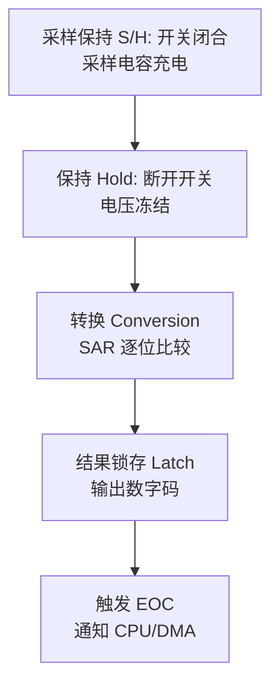

### 4.2 建立时间（Settling Time）的物理本质

建立时间是本章反复强调的"命门"。把采样电容看作一只"杯子"，外部源阻抗与电容构成一阶 RC 充电回路：

```
V_cap(t) = V_in × (1 − e^(−t / (R_source × C_sh)))
```

要让电容充到目标精度（例如 0.5 LSB 以内），所需时间约为：

```
T_settle ≈ R_source × C_sh × ln(2^N / 0.5)   // 以 0.5 LSB 为精度门槛
```

**关键结论**：`R_source × C_sh` 越大，需要越长的采样时间。高压分压网络（为降低功耗往往电阻很大）使 R_source 高达数十 kΩ 甚至更高，若 MCU 内置 ADC 的 C_sh 在数十 pF 量级，则 RC 时间常数可能达到数 μs 到数十 μs——这远超"默认采样周期"常设的几百 ns。结果就是电容没充满，量化值系统性偏低，且源阻抗越高偏低越严重。

需要补充的是，完整的 RC 模型还应包含 ADC 侧的内部串联电阻 R_adc（MUX 导通电阻 + 采样开关导通电阻），即 `τ = (R_source + R_adc) × C_sh`。数据手册中"最大允许源阻抗 vs 采样时间"表格正是这个公式的查表化表达。

### 4.2.1 采样保持电路的非理想性

真实 S&H 远非理想开关，其非理想项直接转化为误差，工程上必须心中有数：

- **电荷注入（Charge Injection）**：开关管在断开瞬间，栅极电荷会通过寄生电容注入到采样电容，造成一个"保持台阶"（hold step），等效为采样电压的瞬时偏移。该偏移往往随输入共模电压变化，表现为非线性。
- **保持期电压跌落（Hold-mode Droop）**：保持阶段采样电容会因 leakage（漏电流）和比较器的输入电流而缓慢放电，若转换时间过长，保持电压会"掉"，高位比较时电压已偏离真实值。高阻源 + 长转换时间时尤其明显。
- **孔径不确定性（Aperture Uncertainty）**：即 3.7 节的孔径抖动，由开关控制信号沿抖动引起，对高频信号产生电压误差。
- **开关导通电阻非线性**：MOS 开关的导通电阻随输入电压变化，使有效 RC 在建保持期间非线性，进而引入谐波。高端 SAR 采用 **自举开关（bootstrapped switch）** 让开关驱动电压随输入浮动，使导通电阻在整个输入范围内保持恒定，从而压低谐波失真。

这些非理想项说明：即便"建立时间看上去够了"，仍可能因电荷注入与漏电产生残余误差，因此在高精度场景要选内置校准、低漏电、带缓冲的 ADC，并在 PCB 上保证模拟输入引脚的漏电路径被严格控制（保持节点远离污染源、保持节点铜皮尽量小以降低寄生）。

**类比**：采样保持像用杯子接水。你必须在"关龙头"前让杯中水位与外部水池齐平（建立时间达标）。如果水流慢（输入阻抗大）而你急着关龙头（采样周期太短），杯子没接满，测出来的就是偏低的"半杯水"。

### 4.3 SAR 逐次逼近时序

下面用流程图刻画 N 位 SAR 从 MSB 到 LSB 的逐次比较过程：

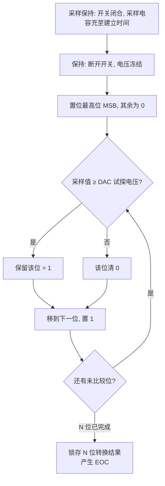

每一轮比较都依赖前一轮 DAC 输出稳定，因此"转换阶段时长 ∝ 位数"，这也是 SAR 速度与分辨率直接挂钩的根源。同时注意：每次逐位试探时 CDAC 电容切换都要从参考电压 Vref 抽取电荷，且抽取量与被转换的码值相关——这就是"参考源驱动能力不足会引入码相关误差（表现为非线性）"的物理根源。

### 4.4 等效输入模型与驱动能力

从外部看，SAR ADC 输入端等效为一个开关 + 采样电容 + 少量寄生。当开关闭合瞬间，C_sh "突袭"地向外索取电荷，若前级驱动（运放或分压网络）输出阻抗不够低、或带宽不足，电压会在采样瞬间被拉低并需要时间恢复——这正是"驱动不足导致建立错误"的本质。对策：

- 前端加 **电压跟随器（buffer / unity-gain amp）**，降低有效源阻抗；
- 或延长 **采样时间（sample time）** 让 RC 充够；
- 或在前端加一个小电容做"电荷库"，缓解突袭取电荷。

用一个数量级例子感受一下：假设某高压分压网络等效源阻抗 `R_source = 50 kΩ`，ADC 采样电容 `C_sh = 20 pF`，则时间常数 `τ = R×C = 1 μs`。要让电容充到 0.5 LSB（12 位时 0.5 LSB 约为满量程的 1/8192）以内，需要时间约 `τ × ln(8192) ≈ 1μs × 9 ≈ 9 μs`。如果 MCU 默认的采样窗口只有 `0.5 μs`，电容只充到 `1 − e^(−0.5) ≈ 39%` 处——此时读出的电压会严重偏低且高度非线性。把采样窗口加到 `10 μs` 以上（或前端加跟随器把有效 R 降到几百 Ω），问题才真正解决。这正是许多"高压采样系统性偏低"项目的根因：**不是 ADC 不准，是它根本没被喂饱。**

---

## 五、芯片模块设计：ADC 控制器 IP 内部架构

前四章讲的是"转换核"的原理，但驱动工程师日常面对的是一个封装完整的 **ADC 控制器 IP**——它把模拟转换核包在一层数字控制逻辑里，通过 APB/AHB 总线暴露寄存器接口，通过触发/DMA/中断信号与系统其它部分协作。本章以一个通用的 SAR 型 ADC 控制器 IP 为蓝本（其结构与主流 MCU 厂商实现高度同构），把这个"黑盒"拆开。

### 5.1 IP 顶层架构框图

一个典型 ADC 控制器 IP 可划分为模拟域与数字域两大部分。模拟域包含通道多路复用器、采样保持电路、SAR 转换核（CDAC + 比较器）与参考电压选择；数字域包含序列器（规则组/注入组）、触发选择与同步、采样时间控制、数据对齐与寄存器、模拟看门狗（数字比较器）、校准逻辑、DMA/中断接口以及总线从接口。

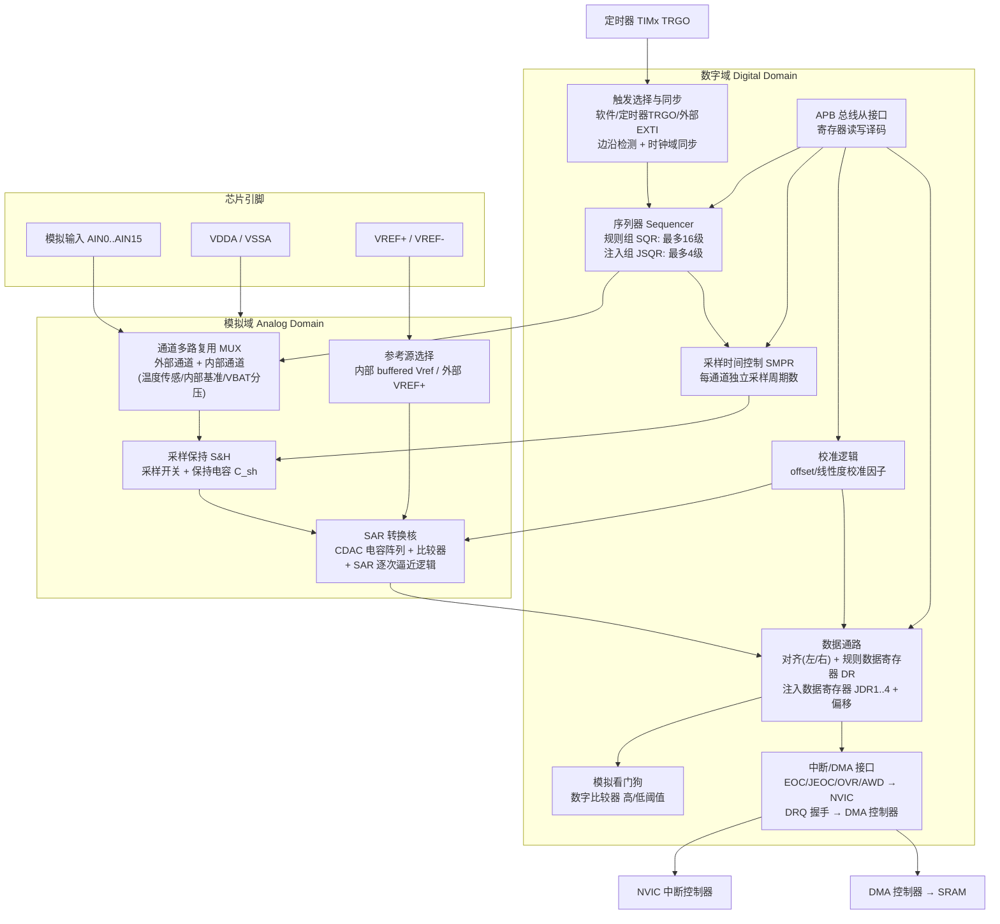

逐个模块拆解其设计意图：

1. **通道多路复用 MUX（输入选择）**。模拟开关阵列把十几路外部引脚与若干内部通道（片上温度传感器、内部基准电压、电池电压分压等）复用到唯一的 S&H 输入。设计要点：开关导通电阻要小且随输入电压变化尽量平坦（否则引入建立差异与谐波）；断开通道与选中通道之间的寄生耦合要小（否则通道串扰）。内部通道通常还有独立使能位（如温度传感器使能），因为这些内部源自身有唤醒建立时间。
2. **采样保持 S&H**。采样开关 + 保持电容。数字域的采样时间控制器决定开关闭合的周期数——这就是驱动里 `sample_time` 配置最终作用的物理位置。多数实现里每个通道可独立配置采样周期数（如 3/15/28/56/84/144/480 周期这类离散档位），以适配不同源阻抗。
3. **SAR 转换核**。CDAC 电容阵列既做采样电容又做逐位试探 DAC；动态比较器在每个 ADC 时钟沿给出一位判决；SAR 逻辑串行推进 N 轮。转换核只认 ADC 时钟——所以 ADC 时钟频率有上限（模拟建立约束）也有下限（漏电导致 droop），驱动配置分频器时两头都不能越界。
4. **序列器（规则组/注入组）**。这是 IP 的"调度大脑"：规则组序列寄存器（SQR）存放最多十几个转换槽位，每个槽位填一个通道号；注入组序列寄存器（JSQR）通常只有 4 个槽位。序列器在触发到来时按槽位依次驱动 MUX 选通道、启动 S&H 与转换核，并在注入触发到来时保存规则组上下文、插入注入序列、完成后恢复——与 CPU 的中断抢占如出一辙。
5. **参考电压源**。参考选择逻辑决定 CDAC 的"标尺"来自外部 VREF+ 引脚还是内部基准缓冲。参考路径上通常有专门的去耦要求，因为逐位比较时 CDAC 会以码相关的方式抽取电荷。
6. **模拟看门狗（数字比较器）**。对转换结果做硬件阈值比较（高/低门限），越限直接拉中断——不需要 CPU 轮询数据即可实现"过压/欠压硬件级报警"，这是安全设计里很有价值的一级冗余。
7. **校准逻辑**。上电校准状态机测量内部误差（比较器失调、CDAC 失配的可校正部分），把校准因子写入校准寄存器；正常转换时数据通路自动应用补偿。这也是"校准必须在特定状态（一般是 ADC 使能但未转换，或使能前）执行"的原因——校准状态机需要独占转换核。
8. **数据通路与寄存器**。规则组共享一个数据寄存器 DR（所以多通道扫描必须用 DMA 及时搬走，否则被下一通道覆盖并置起溢出 OVR 标志）；注入组每个槽位有独立数据寄存器 JDR 并支持硬件减去一个偏移值（可直接得到有符号结果，方便电流采样）。
9. **中断/DMA 接口**。EOC（规则转换完成）、JEOC（注入完成）、OVR（溢出）、AWD（看门狗越限）等状态既可路由到 NVIC，EOC 也可作为 DMA 请求线与 DMA 控制器握手，实现零 CPU 搬运。

### 5.2 寄存器与位域组织

寄存器接口是 IP 数字域的"门面"。下表给出一个通用 ADC 控制器的寄存器映射示意（偏移与位域为常见实现逻辑的通用示例，非任何具体芯片的照抄）：

| 偏移 | 寄存器 | 主要位域 | 作用 |
|------|--------|----------|------|
| 0x00 | ADC_SR 状态 | AWD/EOC/JEOC/OVR/ADRDY | 事件标志（读后清或写1清） |
| 0x04 | ADC_CR1 控制1 | RES[1:0]/SCAN/AWDEN/JAUTO/DISCEN | 分辨率、扫描、看门狗、间断 |
| 0x08 | ADC_CR2 控制2 | ADON/CONT/ALIGN/DMA/EXTSEL/EXTEN/SWSTART | 使能、连续、对齐、触发选择 |
| 0x0C | ADC_SMPR1/2 采样时间 | SMPx[2:0] ×每通道 | 每通道采样周期档位 |
| 0x14 | ADC_SQR1..3 规则序列 | L[3:0] + SQ1..SQ16[4:0] | 规则组长度与通道槽位 |
| 0x20 | ADC_JSQR 注入序列 | JL[1:0] + JSQ1..4[4:0] | 注入组长度与通道槽位 |
| 0x24 | ADC_JOFRx 注入偏移 | JOFFSET[11:0] | 注入结果硬件减偏移 |
| 0x28 | ADC_HTR/LTR 看门狗阈值 | HT[11:0]/LT[11:0] | 模拟看门狗高低门限 |
| 0x30 | ADC_DR 规则数据 | DATA[15:0] | 规则组转换结果（共享） |
| 0x34 | ADC_JDR1..4 注入数据 | JDATA[15:0] | 注入组独立结果 |
| 0x40 | ADC_CALR 校准 | CALFACT_S/CALFACT_D | 校准因子（单端/差分） |
| 0x44 | ADC_CCR 公共控制 | ADCPRE[1:0]/TSVREFE/VBATE | 时钟分频、内部通道使能 |

关键寄存器的位域布局用图表达更直观（每个节点代表一段位域，自左向右为高位到低位）：

```mermaid
flowchart TB
  subgraph CR2["ADC_CR2 控制寄存器2 (32bit) 位域布局"]
    direction LR
    c31["bit30 SWSTART<br/>软件启动规则组"] --- c29["bit29:28 EXTEN<br/>00禁用 01上升沿<br/>10下降沿 11双沿"] --- c27["bit27:24 EXTSEL<br/>触发源选择<br/>TIMx_TRGO/EXTI"] --- c11["bit11 ALIGN<br/>0右对齐 1左对齐"] --- c8["bit8 DMA<br/>DMA请求使能"] --- c1["bit1 CONT<br/>连续转换"] --- c0["bit0 ADON<br/>ADC 上电使能"]
  end
  subgraph SR["ADC_SR 状态寄存器 (32bit) 位域布局"]
    direction LR
    s5["bit5 OVR<br/>数据溢出"] --- s4["bit4 STRT<br/>规则组已启动"] --- s3["bit3 JSTRT<br/>注入组已启动"] --- s2["bit2 JEOC<br/>注入转换完成"] --- s1["bit1 EOC<br/>规则转换完成"] --- s0["bit0 AWD<br/>看门狗越限"]
  end
  subgraph SQR["ADC_SQR1 规则序列寄存器 (32bit) 位域布局"]
    direction LR
    q23["bit23:20 L 3:0<br/>序列长度-1"] --- q19["bit19:15 SQ16<br/>第16槽通道号"] --- q14["bit14:10 SQ15"] --- q9["bit9:5 SQ14"] --- q4["bit4:0 SQ13"]
  end
  subgraph CALR["ADC_CALR 校准寄存器 (32bit) 位域布局"]
    direction LR
    k22["bit22:16 CALFACT_D<br/>差分校准因子"] --- k6["bit6:0 CALFACT_S<br/>单端校准因子"]
  end
```

几条与位域设计强相关的驱动纪律，笔者建议背下来：

- **状态标志的清除语义**要看清：有的 SR 位是"写 0 清除"，有的是"写 1 清除（W1C）"，有的读 DR 自动清 EOC。清错方式会导致"标志永远在"或"丢事件"。
- **序列长度字段 L 通常是"长度减一"编码**（L=0 表示 1 个通道），生成序列时容易出 off-by-one。
- **ALIGN 左对齐**的用途：左对齐后 12 位数据占据 16 位字的高位，直接当 Q15 定点小数用，省一次移位——电机控制里常用。
- **写序列/采样时间寄存器必须在无转换进行时**，多数 IP 对"转换中改序列"行为未定义或硬件拒绝。

### 5.3 时钟域与复位域

ADC IP 内部至少存在两个时钟域：

- **总线时钟域（PCLK）**：寄存器读写、DMA/中断接口工作于此。
- **ADC 转换时钟域（ADCCLK）**：由 PCLK 分频（或独立异步时钟源）产生，驱动 S&H 定时与 SAR 逐位判决。模拟约束决定其上限（每位判决需给比较器/CDAC 留够建立时间）与下限（太慢则保持期 droop 显著）。

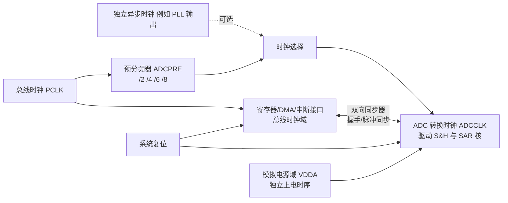

跨域信号（启动脉冲、EOC 标志、触发沿）必须经过同步器，这带来两个工程可见的后果：其一，"写 SWSTART 到实际开始采样"存在数个时钟周期的同步延迟，且该延迟与两域相位关系有关——这就是软件触发抖动的硬件下限；其二，异步时钟模式下触发到采样的延迟不确定度更大，对采样时刻要求苛刻的场合（PWM 同步采样）应选择同步时钟模式或由硬件触发直达。复位方面，模拟域的偏置电路上电后需要稳定时间，所以规范驱动流程总是"使能 ADC → 等待 ADRDY 就绪标志 → 再启动转换"，而不是使能后立刻开转。

### 5.4 序列器状态机与 DMA/定时器协作

序列器是理解规则/注入两组行为的钥匙。它本质上是一个带"上下文保存"的状态机：

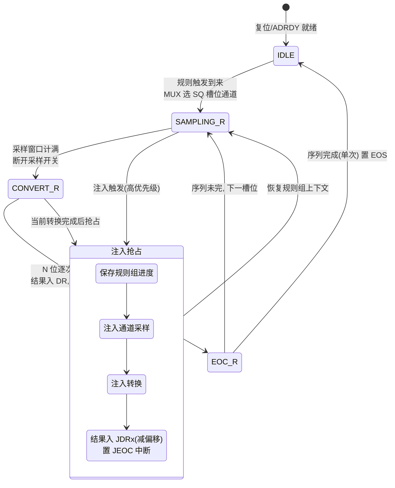

与 DMA/定时器的协作要点：

- **触发路径全硬件**：定时器 TRGO → 触发同步器 → 序列器启动。CPU 不在环上，采样节拍的抖动只剩时钟同步的固有不确定度。
- **数据路径全硬件**：每个规则 EOC 拉高 DMA 请求，DMA 从固定地址 DR 搬到 SRAM 递增地址；循环模式下缓冲写满自动回卷，半满/全满各给一个中断，软件永远处理"另一半"稳定数据。
- **溢出保护**：若 DMA 未及时搬走 DR 就产生了下一个 EOC，硬件置 OVR。规范实现里 OVR 置位后停止 DMA 请求，避免搬运错位数据——驱动必须处理 OVR（重初始化 DMA 与 ADC 数据流）而不是无视它。

---

## 六、触发与扫描机制

### 6.1 软件触发、定时器触发、外部触发

ADC 转换可以由多种源启动，不同触发方式决定了采样时刻的确定性与抖动：

- **软件触发（Software Trigger）**：由写寄存器启动。最简单，但"启动指令→实际开始采样"之间存在代码执行、中断响应、跨时钟域同步等不确定延迟，抖动大，不适合周期性精确采样。
- **定时器触发（Timer Trigger，如 TIM TRGO）**：由定时器硬件在精确时刻产生触发信号（TRGO），完全免除软件路径抖动，是周期性采样（如固定 1kHz 电流采样）的首选。
- **外部触发（External Event）**：由外部引脚/事件启动，适合与别的硬件动作严格同步（如 PWM 中心对齐时刻采样）。

一个特别重要的实际场景是 **电机/电源控制中的 PWM 同步采样**：在逆变器、数字电源里，相电流或电感电流会在 PWM 开关动作瞬间出现巨大的 di/dt 与开关噪声。若在开关边沿附近采样，读到的全是噪声与振铃。因此工程上通常把 ADC 触发配置为 **PWM 计数器达到某比较值（如中心对齐的中点，此时桥臂上下管都关断、电流最平稳）** 的时刻，用定时器（或 PWM 外设）的 TRGO 精确触发 ADC，使采样窗口落在"开关噪声最小、电流最干净"的区间。这种"触发时刻由功率级硬件决定、与 PWM 同源"的做法，既消除了软件抖动，又从源头规避了开关噪声，是闭环控制电流采样质量的命门。

### 6.2 规则组与注入组

许多 MCU（如 STM32 系列的经典实现）把 ADC 通道组织成两组：

- **规则组（Regular Group）**：常规扫描序列，顺序转换多个通道，结果通常经 DMA 搬走。用于"例行巡检"——温度、总压、各路信号。
- **注入组（Injected Group）**：可"插队"的高优先级组。当注入触发到来时，会打断（或排队于）规则组，优先转换少数关键通道（如过流保护要用到的相电流），转换完再回到规则组。其转换结果存入独立数据寄存器，可配偏移量。

这种"例行 + 紧急"的双组结构，让一个 ADC 既能做周期性背景采样，又能对安全相关信号做低延迟抢占。结合第五章的序列器状态机看，注入抢占正是硬件级的"上下文保存—插队—恢复"。

### 6.3 间断模式与序列管理

- **扫描模式（Scan Mode）**：在一个触发下依次转换序列中的多个通道。
- **间断模式（Discontinuous Mode）**：把长序列切成若干小段，每段由独立触发启动，避免一次触发占用过久，也便于在不同触发源下分批采样。
- **连续 / 单次（Continuous / Single）**：连续模式下转换完自动开始下一次；单次模式转换完停下来等下次触发。

下面的流程图展示"规则组扫描 + 注入组抢占"的调度关系：

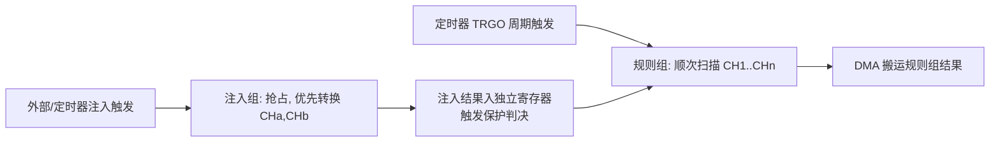

### 6.4 触发—采样—搬运时序

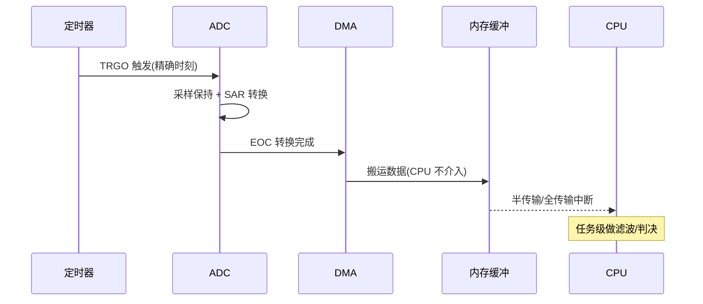

### 6.5 多通道扫描与 MUX 串扰的工程细节

BMS 高压采样常见形态是"一个 ADC + 外部多路 MUX"，或"监控 IC 内置 MUX"。扫描模式下通道快速切换，每切一次，采样电容要重新跟踪新通道电压。若切换后立刻开始采样，前一路的电荷会通过开关的寄生电容"串"到后一路，造成相邻通道相关性误差——高压通道的残压"污染"了紧随其后的低压/温度通道，是误判的高发区。

工程上常见对策有三类：

1. **通道间插入足够建立时间**：给每通道独立的、与源阻抗匹配的采样窗口，高阻通道配更长的 `sample_time`。
2. **虚采样（Dummy Sample）**：切换通道后先启动一次转换但丢弃结果，让采样电容先"洗掉"前一路残荷，再采第二遍作为有效值。
3. **驱动缓冲 + 对称走线**：前端加运放跟随器降低源阻抗，并让各通道走线寄生尽量一致，减小建立差异。

下面的时序图说明"切换→未建立→采样"如何引入串扰，以及"插入空闲/虚采样"如何消除它：

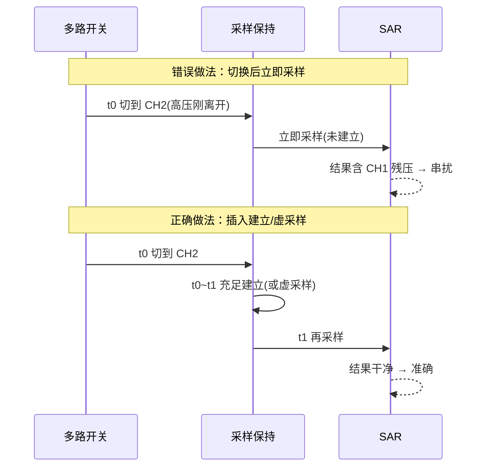

此外，高压通道与低压/温度通道交替轮询时，注意不同通道驱动能力差异导致的建立时间不同，切忌用同一采样参数"一刀切"。在序列编排上，可把源阻抗相近的通道排在一起，把高阻通道放在序列末尾并单独给足建立时间。

---

## 七、参考电压、精度与 PCB 布局

### 7.1 参考电压源选择

参考电压 `Vref` 是量化步长的"尺子"：`LSB = Vref / 2^N`。一旦 Vref 漂移或带噪声，**所有通道的绝对精度都随之漂移**。因此：

- 高精度场景务必使用 **外部精密基准源**（带温漂指标，如数十 ppm/°C 量级），而非芯片内部 LDO 或电源直接分压。
- 基准源需有稳定负载能力：SAR 在逐位比较时会以码相关方式向 Vref 抽取电荷，若基准源输出阻抗高/带宽不足，Vref 会"塌陷"，造成每样本误差（且随输入码相关，表现为非线性）。

### 7.2 抗噪与去耦

- 在 Vref 与 VDDA 引脚就近放置 **去耦电容**（典型 100nF + 1–10μF 组合），降低电源/参考纹波。
- 模拟地与数字地通过单点（磁珠/0Ω）连接，避免数字回流噪声污染模拟地。
- 对 Σ-Δ 等灵敏前端，注意 **电源抑制比（PSRR）** 与 **共模抑制（CMRR）**，前级用差分输入抑制共模干扰。

### 7.3 驱动能力与输入阻抗匹配

回到第四章的 RC 模型：源阻抗高 + 采样电容 => 建立时间不足。工程中两招并用：前端加运放跟随器（低输出阻抗、足够带宽）以"喂饱"采样电容；以及把 `sample_time` 设到数据手册建议之上，留足裕量。对于高压分压网络，可以在分压输出端并联一个缓冲运放，而不是让 ADC 直接"拖"高阻分压。

### 7.4 PCB 布局要点

- 模拟输入走线尽量短、远离开关节点（DC-DC、PWM、时钟）。长走线既是天线也是分布电容，会引入耦合噪声并增加建立所需的电荷。
- 参考源走线加粗、远离噪声，必要时铺地屏蔽；参考源的去耦电容必须 **就近、直接** 回到 ADC 的 Vref 引脚与模拟地，避免经由长回路。
- 多通道输入若是 MUX 切换，注意各通道走线对称，减少寄生电容差异带来的建立差异；MUX 的供电与模拟输入之间避免共用长走线。
- 关键采样节点避免与数字走线平行长距离耦合；必要时采用"模拟走线两侧包地"或内层走线、上下层铺地隔离。
- **分区与单点接地**：模拟地（AGND）与数字地（DGND）在芯片下方或单点（磁珠/0Ω）连接，避免出现"地环路"让数字回流噪声抬升模拟地电位。注意：是否单点连接需依器件数据手册与系统拓扑而定，有的高速 ADC 反而要求统一地平面以降低回流阻抗，切勿盲从。
- **热考量**：采样电阻、分压电阻的温漂会通过阻值变化改变分压比，精密采样中应使用低温漂电阻（如 ±25ppm/°C 甚至更好的金属膜/薄膜电阻），并把其位置远离发热器件。
- **保护**：高压采样分压前端应有电阻限流与 TVS/钳位，防止瞬态过压通过 MUX/ADC 引脚进入低压域造成闩锁或永久损伤。

---

## 八、DMA 连续采样、过采样与数字滤波

### 8.1 DMA 连续采样架构

当 ADC 以较高频率连续转换且通道较多时，若每次都靠中断搬运，CPU 会被频繁打断、且中断响应抖动会污染采样时刻。最佳实践是 **定时器触发 + DMA 循环搬运 + 内存环形缓冲**：

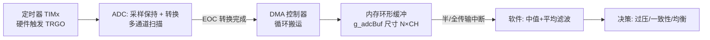

这一流水线的价值在于：**采样时刻由定时器硬件决定，结果不经 CPU 直接进内存，彻底消除中断抖动**，特别适合周期性高压采样与电机电流同步采样。

### 8.2 过采样与平均提升 ENOB

平均能压制**随机噪声**，提升有效位数。原理：对 M 个独立样本求平均，随机噪声（白噪声）的方差下降为原来的 1/M，等效分辨率提升约 `0.5 × log2(M)` 位。若要让 ENOB 增加 k 位，需要过采样倍数 `OSR = 4^k`（每多 1 位需 4 倍样本，因为方差降 1/M，信噪比改善 3dB≈0.5 位）。

两个重要前提常被忽略：其一，过采样提升有效位数要求噪声近似白噪声且幅度至少跨越 1 LSB（必要时靠系统噪声天然"抖动/dither"）；若信号纹丝不动且噪声小于 1 LSB，平均一万次也还是同一个码。其二，**过采样提升的是对随机噪声的抑制，并不能修正系统性偏移/增益误差**，后者必须靠校准。

许多现代 ADC IP 内置**硬件过采样器**：对同一通道自动连续采 2^n 次、硬件累加并右移 m 位输出，软件只读一个"已平均"的结果，零 CPU 开销——第九章的驱动代码与第十章的 MCAL 配置都会覆盖它。

### 8.3 数字滤波技术

- **滑动平均 / 箱形滤波**：简单，抑制白噪声，但会引入群延迟、对阶跃响应钝化。
- **中值滤波（Median）**：对脉冲型干扰（毛刺、单次误采样）极有效，常"先中值后平均"组合使用。
- **一阶 IIR（指数平滑）**：`y[n] = α·x[n] + (1−α)·y[n−1]`，内存极小、适合资源受限 MCU，但需注意延迟与截断误差。
- **FIR / 滑动窗加窗滤波**：在 Σ-Δ 后级本就是数字滤波，工程上可叠加定制 FIR 以满足特定频段抑制（如 50/60Hz 工频陷波）。

下面是一阶 IIR 指数平滑的轻量实现，适合 MCU 实时运行（注意用更高位累加避免截断误差）：

```c
/* 一阶 IIR 指数平滑：y = a*x + (1-a)*y_prev，定点实现 a = 1/16 */
#define IIR_SHIFT 4                       /* a = 1/2^4 = 1/16 */

/* 状态用 Q(12+IIR_SHIFT) 放大保存，避免 12 位量程下的截断死区 */
static int32_t s_iirState = 0;            /* = y * 2^IIR_SHIFT */

int32_t iir_update(int32_t x)
{
    /* state += x - y  等价于 y += (x - y)/16 且不丢小数 */
    s_iirState += x - (s_iirState >> IIR_SHIFT);
    return s_iirState >> IIR_SHIFT;       /* 还原为 12 位量程输出 */
}
```

---

## 九、驱动代码实现：从寄存器到可复用驱动层

本章给出一套完整可读的裸机驱动实现。寄存器命名沿用第五章的通用位域定义（与主流 MCU 实现逻辑同构），读者可按手头芯片手册做符号替换。所有代码遵循同一纪律：**先校准、再使能等就绪、配置序列时停止转换、DMA 先于 ADC 启动**。

### 9.1 寄存器定义与 ADC 初始化（时钟/通道/采样时间/对齐）

```c
/* ================= adc_hw.h：通用寄存器模型（示意） ================= */
#include <stdint.h>

typedef struct {
    volatile uint32_t SR;       /* 状态: AWD/EOC/JEOC/OVR/ADRDY        */
    volatile uint32_t CR1;      /* 控制1: RES/SCAN/AWDEN/DISCEN        */
    volatile uint32_t CR2;      /* 控制2: ADON/CONT/ALIGN/DMA/EXTSEL   */
    volatile uint32_t SMPR1;    /* 采样时间: 通道10..17                */
    volatile uint32_t SMPR2;    /* 采样时间: 通道0..9                  */
    volatile uint32_t SQR1;     /* 规则序列: 长度L + 槽位13..16        */
    volatile uint32_t SQR2;     /* 规则序列: 槽位7..12                 */
    volatile uint32_t SQR3;     /* 规则序列: 槽位1..6                  */
    volatile uint32_t JSQR;     /* 注入序列: JL + JSQ1..4              */
    volatile uint32_t JOFR[4];  /* 注入偏移寄存器                      */
    volatile uint32_t JDR[4];   /* 注入数据寄存器(独立)                */
    volatile uint32_t DR;       /* 规则数据寄存器(共享)                */
    volatile uint32_t CALR;     /* 校准因子寄存器                      */
} ADC_TypeDef;

#define ADC1            ((ADC_TypeDef *)0x40012000UL)   /* 基址示意 */

/* --- 位定义（与5.2节位域图一致） --- */
#define ADC_SR_AWD      (1u << 0)
#define ADC_SR_EOC      (1u << 1)
#define ADC_SR_JEOC     (1u << 2)
#define ADC_SR_OVR      (1u << 5)
#define ADC_SR_ADRDY    (1u << 6)

#define ADC_CR2_ADON    (1u << 0)
#define ADC_CR2_CONT    (1u << 1)
#define ADC_CR2_CAL     (1u << 2)    /* 写1启动自校准, 硬件清零表示完成 */
#define ADC_CR2_DMA     (1u << 8)
#define ADC_CR2_ALIGN   (1u << 11)
#define ADC_CR2_EXTSEL_POS   24u     /* 触发源编码 */
#define ADC_CR2_EXTEN_POS    28u     /* 00禁用 01上升沿 */
#define ADC_CR2_SWSTART (1u << 30)

/* 采样时间档位（周期数编码，档位划分为常见实现风格） */
enum adc_smp {
    ADC_SMP_3CYC = 0, ADC_SMP_15CYC, ADC_SMP_28CYC, ADC_SMP_56CYC,
    ADC_SMP_84CYC,    ADC_SMP_144CYC, ADC_SMP_240CYC, ADC_SMP_480CYC
};

/* ================= adc_drv.c：初始化 ================= */

/* 每通道独立设置采样时间：高阻源(分压网络)给长档位 */
static void ADC_SetSampleTime(ADC_TypeDef *adc, uint8_t ch, enum adc_smp smp)
{
    if (ch < 10u) {                       /* 通道0..9 在 SMPR2 */
        adc->SMPR2 &= ~(7u << (3u * ch));
        adc->SMPR2 |=  ((uint32_t)smp << (3u * ch));
    } else {                              /* 通道10..17 在 SMPR1 */
        uint8_t k = ch - 10u;
        adc->SMPR1 &= ~(7u << (3u * k));
        adc->SMPR1 |=  ((uint32_t)smp << (3u * k));
    }
}

/* 配置规则组序列：seq[] 为通道号数组, len 为序列长度(1..16) */
static void ADC_SetRegularSequence(ADC_TypeDef *adc,
                                   const uint8_t *seq, uint8_t len)
{
    uint32_t sqr1 = 0, sqr2 = 0, sqr3 = 0;
    for (uint8_t i = 0; i < len; i++) {
        if (i < 6u)       sqr3 |= (uint32_t)seq[i] << (5u * i);
        else if (i < 12u) sqr2 |= (uint32_t)seq[i] << (5u * (i - 6u));
        else              sqr1 |= (uint32_t)seq[i] << (5u * (i - 12u));
    }
    sqr1 |= ((uint32_t)(len - 1u) << 20);   /* L 字段 = 长度-1(易错点!) */
    adc->SQR3 = sqr3;
    adc->SQR2 = sqr2;
    adc->SQR1 = sqr1;
}

/*
 * ADC 基础初始化：
 *  - RCC: 使能 ADC 外设时钟, 配置 ADCCLK 分频(勿超模拟上限)
 *  - 分辨率 12 位, 右对齐, 扫描模式
 *  - 各通道按源阻抗配采样时间
 */
void ADC_Init(void)
{
    /* 1. 时钟：使能外设时钟, ADCCLK = PCLK/4 (示意, 保证不超上限) */
    RCC_EnableADCClock();
    RCC_SetADCPrescaler(ADC_PRESCALER_DIV4);

    /* 2. 先做自校准(见9.5节), 必须在配置转换前、无转换进行时 */
    ADC_SelfCalibrate(ADC1);

    /* 3. 基本模式：12位、扫描使能、右对齐、单次(由触发驱动) */
    ADC1->CR1 = ADC_CR1_SCAN;             /* 扫描模式: 顺序转多通道   */
    ADC1->CR2 = 0;                        /* 右对齐(ALIGN=0), 非连续  */

    /* 4. 采样时间：低阻缓冲后的通道给短档, 高阻分压通道给长档 */
    ADC_SetSampleTime(ADC1, CH_MOTOR_IU,  ADC_SMP_15CYC);  /* 运放缓冲后 */
    ADC_SetSampleTime(ADC1, CH_MOTOR_IV,  ADC_SMP_15CYC);
    ADC_SetSampleTime(ADC1, CH_PACK_VOLT, ADC_SMP_480CYC); /* 高阻分压   */
    ADC_SetSampleTime(ADC1, CH_NTC_TEMP,  ADC_SMP_240CYC); /* NTC 高阻   */

    /* 5. 规则序列：源阻抗相近的排一起, 高阻通道放末尾(见6.5节) */
    static const uint8_t seq[4] = {
        CH_MOTOR_IU, CH_MOTOR_IV, CH_NTC_TEMP, CH_PACK_VOLT
    };
    ADC_SetRegularSequence(ADC1, seq, 4u);

    /* 6. 使能 ADC 并等待模拟域就绪, 再允许启动转换 */
    ADC1->CR2 |= ADC_CR2_ADON;
    while ((ADC1->SR & ADC_SR_ADRDY) == 0u) { /* 等待偏置建立 */ }
}
```

### 9.2 定时器触发规则组扫描

```c
/*
 * 定时器触发规则组扫描：
 *  - TIM3 以固定频率产生 TRGO(更新事件)
 *  - ADC 选择 TIM3_TRGO 上升沿作为规则组外部触发
 *  - 每个触发完成一轮 4 通道扫描, 采样节拍与软件完全解耦
 */
#define ADC_EXTSEL_TIM3_TRGO   8u        /* 触发源编码(按芯片手册取值) */

void ADC_ConfigTimerTrigger(uint32_t sample_freq_hz)
{
    /* 1. 定时器：向上计数, 更新事件作为 TRGO 输出 */
    TIM3_Init();
    TIM3_SetUpdateFrequency(sample_freq_hz);   /* 如 1000 Hz          */
    TIM3_SetTRGOSource(TIM_TRGO_UPDATE);       /* 更新事件 → TRGO     */

    /* 2. ADC：选择触发源与触发沿(上升沿), 清软件启动路径 */
    uint32_t cr2 = ADC1->CR2;
    cr2 &= ~((0xFu << ADC_CR2_EXTSEL_POS) | (0x3u << ADC_CR2_EXTEN_POS));
    cr2 |=  ((uint32_t)ADC_EXTSEL_TIM3_TRGO << ADC_CR2_EXTSEL_POS);
    cr2 |=  (0x1u << ADC_CR2_EXTEN_POS);       /* 01: 上升沿触发      */
    ADC1->CR2 = cr2;

    /* 3. 先把 DMA 备好(见9.4), 最后才开定时器, 避免首轮数据丢失 */
    TIM3_Start();
}

/*
 * 注入组配置(高优先级插队)：
 *  - 2 个相电流通道挂到 PWM 定时器 TRGO(中心对齐中点触发)
 *  - 结果进独立 JDR, 并用 JOFR 硬件减去零电流偏置码
 *    (双极性电流经运放偏置到 Vref/2, 减偏置后直接得到有符号电流)
 */
void ADC_ConfigInjectedGroup(void)
{
    /* JSQR: JL=1(2通道), 槽位填 IU/IV。注意注入槽位是"右对齐"填充 */
    ADC1->JSQR = ((1u & 0x3u) << 20)
               | ((uint32_t)CH_MOTOR_IU << 10)
               | ((uint32_t)CH_MOTOR_IV << 15);

    /* 注入偏移：零电流时 ADC 码约为半量程(2048@12bit), 由标定获得 */
    ADC1->JOFR[0] = g_calib.iu_zero_code;
    ADC1->JOFR[1] = g_calib.iv_zero_code;

    /* 注入触发选 PWM 定时器 TRGO, JEOC 中断中直接跑过流判决 */
    ADC_SetInjectedTrigger(ADC1, ADC_JEXT_TIM1_TRGO, ADC_EDGE_RISING);
    NVIC_EnableIRQ(ADC_IRQn);
    ADC_EnableInterrupt(ADC1, ADC_IT_JEOC);
}

/* 注入完成中断：低延迟读取有符号电流并做保护判决 */
void ADC_IRQHandler(void)
{
    if (ADC1->SR & ADC_SR_JEOC) {
        ADC1->SR &= ~ADC_SR_JEOC;               /* 清标志(按芯片语义) */
        int16_t iu = (int16_t)ADC1->JDR[0];     /* 已减偏移, 有符号   */
        int16_t iv = (int16_t)ADC1->JDR[1];
        Motor_OverCurrentCheck(iu, iv);         /* 微秒级保护路径     */
    }
}
```

### 9.3 DMA 连续采样（循环缓冲 + 半/全中断）

```c
/*
 * DMA 循环采样：
 *  - 外设地址固定指向 ADC1->DR, 内存地址递增
 *  - 循环模式: 写满自动回卷; 半满/全满中断实现乒乓处理
 *  - 缓冲布局: [轮0: CH0..CH3][轮1: CH0..CH3]...共 ROUNDS 轮
 */
#define ADC_CH_NUM     4u
#define ADC_ROUNDS     32u                       /* 缓冲存 32 轮扫描  */
#define ADC_BUF_LEN    (ADC_CH_NUM * ADC_ROUNDS)

static volatile uint16_t g_adcBuf[ADC_BUF_LEN];  /* DMA 目标环形缓冲  */
static volatile uint8_t  g_halfReady, g_fullReady;

void ADC_StartWithDMA(void)
{
    /* 1. DMA 通道配置：外设→内存, 16位, 循环, 外设固定/内存递增 */
    DMA_Config_t cfg = {
        .periph_addr = (uint32_t)&ADC1->DR,
        .mem_addr    = (uint32_t)g_adcBuf,
        .count       = ADC_BUF_LEN,
        .dir         = DMA_DIR_P2M,
        .psize       = DMA_SIZE_16BIT,
        .msize       = DMA_SIZE_16BIT,
        .pinc        = 0,                    /* 外设地址固定          */
        .minc        = 1,                    /* 内存地址递增          */
        .circular    = 1,                    /* 循环模式              */
        .prio        = DMA_PRIO_HIGH,
    };
    DMA_Init(DMA1_CH1, &cfg);
    DMA_EnableIT(DMA1_CH1, DMA_IT_HALF | DMA_IT_FULL);
    DMA_Enable(DMA1_CH1);                    /* DMA 必须先于 ADC 就绪 */

    /* 2. ADC 打开 DMA 请求。顺序错了会丢首样本或立刻 OVR */
    ADC1->CR2 |= ADC_CR2_DMA;
}

void DMA1_CH1_IRQHandler(void)
{
    if (DMA_GetIT(DMA1_CH1, DMA_IT_HALF)) {  /* 前半区稳定可处理 */
        DMA_ClearIT(DMA1_CH1, DMA_IT_HALF);
        g_halfReady = 1u;
    }
    if (DMA_GetIT(DMA1_CH1, DMA_IT_FULL)) {  /* 后半区稳定可处理 */
        DMA_ClearIT(DMA1_CH1, DMA_IT_FULL);
        g_fullReady = 1u;
    }
}

/* 任务级：只处理"DMA 当前不在写"的那半区, 天然免加锁 */
void ADC_Task_Process(void)
{
    if (g_halfReady) {
        g_halfReady = 0u;
        Filter_ProcessBlock(&g_adcBuf[0], ADC_BUF_LEN / 2u);
    }
    if (g_fullReady) {
        g_fullReady = 0u;
        Filter_ProcessBlock(&g_adcBuf[ADC_BUF_LEN / 2u], ADC_BUF_LEN / 2u);
    }
    /* OVR 处理：一旦溢出, 数据流相位已错乱, 必须整体复位数据链路 */
    if (ADC1->SR & ADC_SR_OVR) {
        ADC1->SR &= ~ADC_SR_OVR;
        DMA_Disable(DMA1_CH1);
        DMA_ReloadCount(DMA1_CH1, ADC_BUF_LEN);
        DMA_Enable(DMA1_CH1);
        ADC1->CR2 |= ADC_CR2_DMA;            /* 重新武装 DMA 请求 */
    }
}
```

### 9.4 过采样与平均（软件实现 + 硬件过采样器）

```c
/*
 * 过采样平均提升 ENOB：
 *  - 软件版: 对环形缓冲中同一通道的 M 个样本"先中值截尾、后累加平均"
 *  - 硬件版: 配置 IP 内置过采样器, 硬件累加 2^n 次并右移输出
 *  - 提升量: +0.5*log2(M) 位, M=16 → +2位; 系统误差不受影响(需校准)
 */
#define OSR            16u                   /* 每通道平均 16 个样本  */

/* 从 DMA 缓冲提取通道 ch 的 OSR 个样本并平均(交织步长 = 通道数) */
uint16_t ADC_OversampleAverage(const volatile uint16_t *buf,
                               uint8_t ch, uint8_t ch_num)
{
    uint32_t acc = 0;
    uint16_t vmin = 0xFFFFu, vmax = 0u;

    for (uint32_t i = 0; i < OSR; i++) {
        uint16_t s = buf[i * ch_num + ch];   /* 交织缓冲中取本通道    */
        acc += s;
        if (s < vmin) vmin = s;              /* 记录极值用于截尾      */
        if (s > vmax) vmax = s;
    }
    /* 截尾平均: 去掉一个最大一个最小, 抑制单发毛刺(简化中值思想) */
    acc -= (uint32_t)vmin + vmax;
    return (uint16_t)(acc / (OSR - 2u));
}

/* 硬件过采样器配置(若 IP 支持): 累加 2^RATIO 次, 右移 SHIFT 位 */
void ADC_ConfigHwOversampler(void)
{
    /* 16 次累加(4bit增长) + 右移4 → 输出仍是12位但噪声压低约2位;
     * 若右移量 < log2(倍数), 则输出位宽增加, 得到 13/14/16 位结果 */
    ADC_OVSR_Config_t ovs = {
        .enable = 1u,
        .ratio  = OVS_RATIO_16X,     /* 每触发对该通道连采 16 次      */
        .shift  = OVS_SHIFT_4BIT,    /* 硬件右移 4 位 = 除以 16       */
        .mode   = OVS_TRIGGERED,     /* 每个触发完成整组过采样        */
    };
    ADC_SetOversampler(ADC1, &ovs);
}
```

### 9.5 校准（自校准 + 两点用户校准 + 数据读取）

```c
/*
 * 校准分两层：
 *  层1 芯片自校准: 消除 ADC 内部失调(比较器失调/CDAC可校正失配),
 *      必须在无转换进行时执行, 结果由硬件写入 CALR 并自动应用。
 *  层2 系统两点校准: 消除"分压电阻+运放+基准比例"整条链路的
 *      offset/gain 系统误差, 系数存 NVM, 软件换算时应用。
 */

/* --- 层1: 硬件自校准 --- */
int ADC_SelfCalibrate(ADC_TypeDef *adc)
{
    uint32_t timeout = CAL_TIMEOUT_LOOPS;

    adc->CR2 &= ~ADC_CR2_ADON;               /* 校准前确保无转换      */
    adc->CR2 |= ADC_CR2_CAL;                 /* 启动校准状态机        */
    while (adc->CR2 & ADC_CR2_CAL) {         /* 硬件完成后自动清零    */
        if (--timeout == 0u) return -1;      /* 超时: 时钟/电源异常   */
    }
    /* 此时 CALR 中已是新校准因子, 转换路径自动补偿 */
    return 0;
}

/* --- 层2: 两点用户校准 --- */
typedef struct {
    float gain;        /* G: 码/伏 斜率  */
    float offset;      /* O: 零点码偏移  */
} SysCalib_t;

/* 产线标定: 依次施加两个已知精密电压 V0(近零点)/V1(近满量程) */
void ADC_UserCalibrate(SysCalib_t *cal, float v0, float v1)
{
    /* 每个校准点也要过采样平均, 消除标定过程中的随机噪声 */
    float d0 = (float)ADC_BlockingAverage(CH_PACK_VOLT, 64u);
    Calib_WaitOperatorApply(v1);             /* 切到第二个标定电压    */
    float d1 = (float)ADC_BlockingAverage(CH_PACK_VOLT, 64u);

    cal->gain   = (d1 - d0) / (v1 - v0);     /* G = ΔD/ΔV            */
    cal->offset = d0 - cal->gain * v0;       /* O = D0 - G*V0        */
    NVM_Store(NVM_ID_ADC_CAL, cal, sizeof(*cal));
}

/* 运行时换算: 原始码 → 物理电压(V), 再乘分压比得到真实高压 */
float ADC_CodeToVolt(const SysCalib_t *cal, uint16_t code)
{
    return ((float)code - cal->offset) / cal->gain;
}

/* --- 数据/状态读取: 轮询方式(调试与低速场合) --- */
int ADC_ReadPolling(uint8_t ch, uint16_t *out)
{
    uint32_t timeout = EOC_TIMEOUT_LOOPS;

    ADC_SetRegularSequence(ADC1, &ch, 1u);   /* 单通道单次           */
    ADC1->CR2 |= ADC_CR2_SWSTART;            /* 软件触发             */
    while ((ADC1->SR & ADC_SR_EOC) == 0u) {
        if (--timeout == 0u) return -1;      /* 防止死等             */
    }
    *out = (uint16_t)ADC1->DR;               /* 读 DR 自动清 EOC     */
    return 0;
}
```

驱动层小结：初始化顺序是"时钟 → 自校准 → 模式/采样时间/序列 → 使能等 ADRDY"；启动顺序是"DMA 先武装 → ADC 开 DMA 请求 → 最后开触发定时器"；异常路径必须覆盖 OVR 与校准/EOC 超时。这三个顺序颠倒任何一个，都会在量产测试里以"偶发丢数据/首样本错"的形式还回来。

---

## 十、MCAL 配置说明：AUTOSAR Adc 模块工程实践

在车载电子（BMS、VCU、电机控制器）中，上述裸机驱动会被 AUTOSAR 架构中的 **MCAL Adc 模块**替代：芯片厂商提供符合 AUTOSAR 标准接口的 Adc 驱动，工程师不再手写寄存器，而是在 **EB tresos 或 Vector DaVinci Configurator** 等工具里做图形化配置，生成 `Adc_Cfg.c/h` 等配置代码，应用层通过标准 API 调用。理解第五章的 IP 架构后再看 MCAL 配置，每个配置项都能对应到具体寄存器位域。

### 10.1 Adc 模块的核心配置对象

AUTOSAR Adc 的配置围绕三层对象展开：

- **AdcHwUnit（硬件单元）**：对应一个物理 ADC 实例。配置时钟分频（对应 ADCPRE 位域）、分辨率、校准使能、DMA 还是中断传输。
- **AdcChannel（通道）**：对应一个物理输入通道。配置通道号、采样时间（对应 SMPR 位域）、单端/差分、限值检查（对应模拟看门狗）。
- **AdcGroup（通道组）**：MCAL 的调度单位，对应"规则组/注入组的一个序列"。配置组内通道列表及顺序（对应 SQR/JSQR）、触发源、转换模式、访问模式、缓冲与通知。

其中 AdcGroup 是理解 MCAL Adc 的钥匙，其关键参数与硬件位域的映射如下表：

| 配置项（EB tresos/DaVinci） | 典型取值 | 对应硬件/位域 | 工程说明 |
|------|------|------|------|
| AdcGroupTriggSrc | ADC_TRIGG_SRC_SW / ADC_TRIGG_SRC_HW | EXTEN/EXTSEL | 软件启动或硬件触发 |
| AdcHwTrigSignal | ADC_HW_TRIG_RISING_EDGE | EXTEN 沿选择 | 硬件触发沿 |
| AdcHwTrigTimer | 定时器/PWM 事件引用 | EXTSEL 编码 | 关联 Gpt/Pwm 触发源 |
| AdcGroupConversionMode | ONESHOT / CONTINUOUS | CONT 位 | 单次或连续 |
| AdcGroupAccessMode | SINGLE / STREAMING | — (缓冲策略) | 单值或流式多样本 |
| AdcStreamingBufferMode | LINEAR / CIRCULAR | DMA 循环位 | 流缓冲线性/环形 |
| AdcStreamingNumSamples | 如 16 | DMA 传输计数 | 每通道样本深度 |
| AdcGroupDefinition | 通道引用列表 | SQR 槽位 | 组内转换顺序 |
| AdcGroupPriority | 0..255 | 注入组映射/软件队列 | 高优先级组可抢占 |
| AdcGroupReplacement | ABORT_RESTART / SUSPEND_RESUME | 序列器抢占行为 | 被抢占组如何恢复 |
| AdcChannelSampTime | 周期数档位 | SMPR 位域 | 按源阻抗逐通道配置 |
| AdcChannelResolution | 8/10/12 位 | RES 位域 | 分辨率 |
| AdcChannelLimitCheck | TRUE + 高/低阈值 | AWD 阈值寄存器 | 硬件限值报警 |
| AdcResultAlignment | LEFT / RIGHT | ALIGN 位 | 数据对齐 |
| AdcGroupNotification | 回调函数名 | EOC/DMA 中断 | 组转换完成通知 |
| AdcDmaChannelRef | DMA 通道引用 | DMA 握手线 | 结果经 DMA 入缓冲 |
| AdcCalibrationEnable | TRUE | CAL 启动位 | Adc_Init 内自校准 |
| AdcOversamplingRatio/Shift | 16x / shift 4 | 硬件过采样寄存器 | 提升 ENOB（厂商扩展） |

需要说明两点：其一，**注入组映射**在标准 AUTOSAR 中没有"注入"这个词，它通过 `AdcGroupPriority` + 硬件优先级机制表达——高优先级 AdcGroup 在支持的平台上会被厂商驱动映射到硬件注入组，实现真正的硬件抢占；不支持时退化为软件队列抢占（`AdcPriorityImplementation = ADC_PRIORITY_HW / ADC_PRIORITY_NONE` 决定）。其二，**过采样/平均**属于厂商扩展参数（Vendor Specific），常见形态是在 AdcChannel 或 AdcHwUnit 下提供 `AdcOversamplingRatio`（累加次数）与 `AdcOversamplingShift`（右移位数），生成代码直接落到第 9.4 节那组硬件过采样寄存器上；若芯片无硬件过采样器，则只能在应用层或 CDD（复杂驱动）里做软件平均。

### 10.2 EB tresos 配置清单（Adc 模块重点项）

按配置流程整理成核查清单，逐项过一遍基本可避开 90% 的配置事故：

| 步骤 | 配置容器 | 重点项 | 常见错误 |
|------|----------|--------|----------|
| 1 | AdcGeneral | 开发错误检测 AdcDevErrorDetect、去初始化/通知 API 开关 | 量产忘关 DET 影响时序 |
| 2 | AdcConfigSet/AdcHwUnit | 时钟分频、AdcPriorityImplementation、DMA 全局开关 | ADCCLK 超模拟上限 |
| 3 | AdcChannel | 通道号、采样时间、限值检查 | 高阻通道采样时间照抄默认值 |
| 4 | AdcGroup | 通道列表顺序、触发源、转换/访问模式、流样本数 | 组内顺序与硬件槽位理解不一致 |
| 5 | AdcGroup | 优先级与 Replacement 策略 | 抢占后规则组数据相位错乱未处理 |
| 6 | 通知与缓冲 | AdcGroupNotification、结果缓冲对齐 | 缓冲未按流样本数×通道数开够 |
| 7 | 校准/过采样 | AdcCalibrationEnable、厂商过采样参数 | 校准开了但上电时序里没留等待时间 |
| 8 | 联动模块 | Mcu(时钟)、Port(引脚模拟模式)、Mcl/Dma(通道)、Gpt/Pwm(触发) | 引脚没配成模拟模式, 读数怪异 |

### 10.3 配置 → 生成代码 → 运行时调用路径

工具生成 `Adc_Cfg.c`（含 `Adc_ConfigType` 常量表，内容就是通道/组/触发/采样时间的寄存器映射数据）后，应用/BSW 的标准调用路径如下：

1. `Adc_Init(&Adc_Config)`：写 CR/SMPR/序列寄存器，执行自校准（若使能），等待就绪。
2. `Adc_SetupResultBuffer(group, bufferPtr)`：把应用提供的结果缓冲登记给驱动（流式访问下 DMA 的目标地址）。**必须在启动组转换前调用**，这是新手最常漏的一步。
3. 软件触发组：`Adc_StartGroupConversion(group)`；硬件触发组：`Adc_EnableHardwareTrigger(group)`（使能 EXTEN 触发沿，此后每个定时器事件自动转换）。
4. 转换完成：驱动在 EOC/DMA 中断里调用 `Adc_GroupNotification`；应用在通知里（或轮询 `Adc_GetGroupStatus`）取数。
5. 取数：单值访问用 `Adc_ReadGroup(group, resultPtr)`；流式访问用 `Adc_GetStreamingSamples`（返回已填样本数与缓冲有效性）。

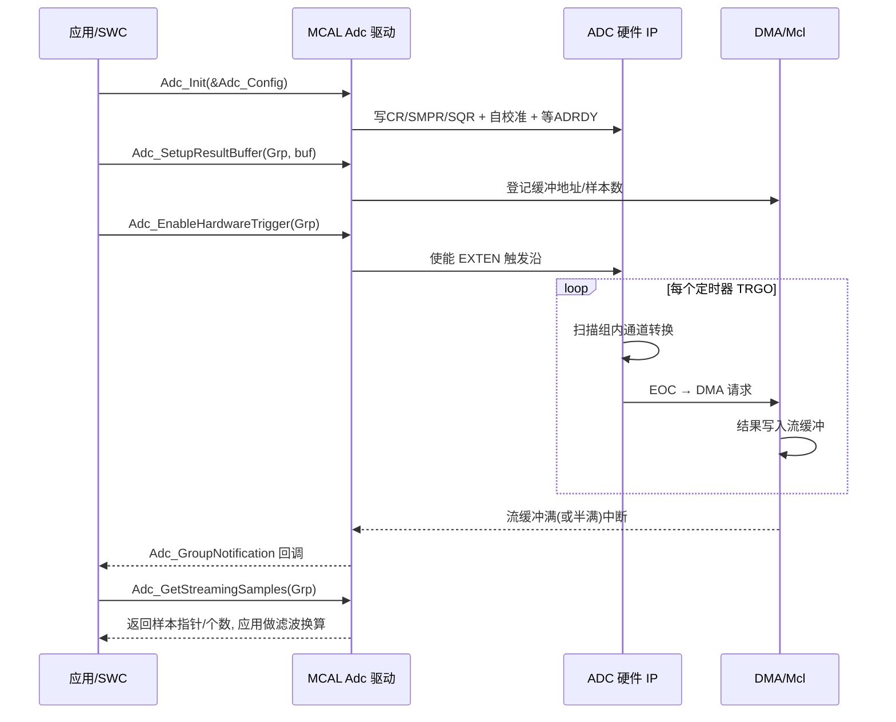

### 10.4 MCAL 实践中的三个经验

- **组划分即调度设计**：把"快信号"（相电流，硬件触发高优先级组，映射注入）与"慢信号"（温度/电压巡检，软件或低速硬件触发组）分开成组，等价于裸机时代的注入/规则分工。一个组里塞进快慢混合通道，会被最慢通道的采样时间拖垮整组节拍。
- **结果缓冲的生命周期归应用管**：`Adc_SetupResultBuffer` 只是登记指针，缓冲必须保证在组运行期间常驻有效（放静态区，不可用栈上数组），且大小 ≥ 通道数 × 流样本数，否则 DMA 会写穿。
- **校准与诊断留接口**：量产件应在初始化流程中检查自校准结果（部分厂商驱动提供校准状态查询或要求调用厂商扩展 API），并把两点系统校准系数放在 NvM 模块管理，随 DID 支持产线写入与售后读取。

---

## 十一、校准（offset / gain / 用户校准）

即便电路设计再好，每个 ADC 仍有出厂/工艺带来的偏移与增益偏差。校准是"把尺子重新校直"的过程。

### 11.1 自校准机制

许多 MCU 内置 ADC 支持硬件自校准：上电或定期执行自校准命令，内部自动测量零点与满量程相关的内部误差并存入校准寄存器（如第五章的 CALR），转换时硬件自动补偿。建议在上电、温漂较大区间、或长期运行后重新校准。执行的硬件前提（无转换进行、时钟已稳定）已在 9.5 节代码中体现。

### 11.2 两点校准公式

对系统级（含分压网络、运放增益）的系统性误差，常用两点校准建模为线性关系：

```
实测读数 D = G × V_true + O
```

通过两个已知输入（零点 V0、满量程点 V1）得到两对 (V, D)：

```
G = (D1 − D0) / (V1 − V0)
O = D0 − G × V0
```

之后对任意读数 D 反算真实电压：

```
V_true = (D − O) / G
```

这就是"offset/gain 两点用户校准"的核心。**周期性重校准 + 温度补偿**，可把温漂带来的失准控制住——因为校准若只做一次，温漂后仍会偏。若链路存在可感知的非线性（如高压分压 + 保护器件的弱非线性），可扩展为三点/多点分段线性校准，按段应用不同的 G/O。

### 11.3 校准时机与温度补偿策略

校准不是"上电做一次就完事"，合理的策略应结合器件特性与应用工况：

- **上电校准**：系统冷启动、参考源与 ADC 尚未充分热稳时，先等待基准源建立（参考源上电到稳定有时间要求），再做两点校准，避免把"未稳"的状态固化进校准系数。
- **温度触发重校准**：许多误差（尤其是 offset 与增益随温度的变化）具有可重复的温度相关性。可在板载温度传感器越过若干阈值（如每变化 5～10°C）时触发一次重校准，或建立"校准系数 = f(温度)"的查找表/线性模型，在运行时按温度实时修正，而非死守一组常温系数。
- **定期后台校准**：在对安全关键量（如过压阈值附近）做判决前，若距上次校准过久，可借系统空闲窗口跑一次快速自校准，把长期漂移"拉回"。
- **区分"系统校准"与"ADC 自校准"**：ADC 硬件自校准只补偿芯片内部误差；而包含分压电阻、运放增益、基准比例在内的"系统增益"必须靠外部两点校准（用已知精密电压源或板载基准点）才能消除。两者互补，不可互相替代。
- **利用内部基准通道做在线自检**：多数 ADC IP 提供内部基准电压通道（第五章 MUX 的内部通道之一）。周期性转换该通道并与出厂标定值比对，可以在线监测"Vref 漂了还是链路漂了"，作为功能安全里的合理性检查（plausibility check）。

需要强调的是：校准能消除的是**可重复的系统性偏差**。对于随机噪声、偶发干扰、以及通道间串扰这类非稳态误差，校准无能为力，仍需依靠建立时间设计、滤波与布局来解决。这也是"先校准、再滤波"这一工程顺序的根本原因。

---

## 十二、常见坑与调试手段

1. **采样周期 < 建立时间 → 精度系统性偏低**：最经典的坑。现象是"所有通道朝同一方向偏"。用示波器看采样电容充电曲线，或把 `sample_time` 调大验证是否回归。一个简单的软件自检思路是：对同一固定校准源，分别在"短采样时间"和"长采样时间"下读数，若两者偏差随采样时间缩短而系统性增大，则建立不足已基本坐实：

```c
/* 建立时间自检：对比长短采样下的读数偏差 */
uint16_t Read_At_SampleTime(enum adc_smp st)
{
    ADC_SetSampleTime(ADC1, CH_CAL_SOURCE, st);
    uint16_t v;
    (void)ADC_ReadPolling(CH_CAL_SOURCE, &v);   /* 同一固定校准源 */
    return v;
}

void ADC_SettlingSelfTest(void)
{
    uint16_t shortR = Read_At_SampleTime(ADC_SMP_3CYC);    /* 短 */
    uint16_t longR  = Read_At_SampleTime(ADC_SMP_480CYC);  /* 长: 视为已建立 */
    int16_t  err    = (int16_t)shortR - (int16_t)longR;
    /* 判据: |err| 超过允许 LSB 数 → 增大 sample_time 或加缓冲 */
    if (err < -SETTLE_ERR_LSB || err > SETTLE_ERR_LSB) {
        Diag_Report(DIAG_ADC_SETTLING_FAIL, err);
    }
}
```
2. **输入阻抗不匹配**：高压分压电阻太大（为降功耗）导致源阻抗高，采样电容充不满。对策：前端加运放电压跟随器，或延长采样时间，或并行电荷缓存电容。
3. **参考电压不稳/噪声**：量 Vref 引脚纹波；换外部基准、加去耦；确认基准源能承受 SAR 逐位比较时的码相关瞬态抽取电荷。
4. **MUX 切换未留建立时间 → 通道串扰**：某路电压"混入"相邻路。检查扫描序列每通道采样间隔，必要时切换后插空闲周期或做"虚采样"（先采一次丢弃再采有效值）。
5. **参考通道与信号通道温度不同**：校准只做一次，温漂后失准。做温度补偿或定期重校准。
6. **DMA 缓冲与 CPU 读取竞争**：环形缓冲未正确处理半/全传输中断，导致读到新旧混合数据。务必用双缓冲或正确处理 half-complete / complete 标志；OVR 置位后必须整体重置数据链路，否则通道相位永久错位（缓冲里 CH0 的位置装着 CH1 的数据）。
7. **过采样掩盖系统误差**：以为多平均就准，结果 offset/gain 系统性偏差被原样保留。先校准，再平均。
8. **电源/地分割不当**：数字噪声串入模拟地，抬高本底噪声、恶化 ENOB。检查接地与去耦。
9. **引脚未配成模拟模式**：数字输入缓冲未关闭时，输入级施密特触发器在中间电平附近来回翻转，既增加功耗又向采样节点注入噪声。裸机下检查 GPIO 模式寄存器，MCAL 下检查 Port 模块配置。
10. **校准/使能顺序错误**：在转换进行中启动自校准、或使能后不等 ADRDY 就触发首轮转换，表现为"上电第一批数据总是不对，复位一次又好了"。严格遵守 9.1/9.5 节的初始化顺序。
11. **序列长度 off-by-one**：L 字段"长度减一"编码写错，多转或少转一个通道，DMA 缓冲通道相位整体错位。用已知固定电压通道（如内部基准）放进序列做"相位哨兵"可快速定位。

---

## 十三、面试题精选（25+ 道，含要点）

1. **SAR 与 Σ-Δ 的核心区别是什么？各自适用场景？**
   要点：SAR 逐位比较、中速中精度、多通道友好；Σ-Δ 过采样+噪声整形、高精度低速；前者适合通用多通道，后者适合高精度计量。

2. **采样周期设太短会怎样？**
   要点：内部采样电容未充满，量化值偏低/不准，系统性误差，且可能引入通道串扰。

3. **分辨率 12 位就一定准吗？**
   要点：不一定。精度还受 Vref、INL/DNL、噪声、建立时间、校准影响；分辨率只是"能分多少级"。

4. **Vref 不稳对精度有什么影响？**
   要点：量化步长与满量程随 Vref 漂移，绝对精度直接下降；故高精度用外部精密基准。

5. **硬件触发 + DMA 的价值？**
   要点：定时精确、零 CPU 干预、无中断抖动，适合周期性高压/电流采样。

6. **建立时间的物理本质是什么？**
   要点：源阻抗（含 ADC 内部串联电阻）与采样电容构成 RC，电容充电到目标精度所需时间；源阻抗越高、电容越大，需时越长。

7. **为什么 DNL > 1 LSB 危险？**
   要点：可能出现丢码（missing code），某段输入无论怎么变都给出同一数字。

8. **过采样平均能提升精度吗？提升的是什么？**
   要点：只压随机噪声、提升 ENOB，不修正 offset/gain 等系统性偏差；每多 1 位需约 4 倍样本；且要求噪声跨越至少 1 LSB 才有效。

9. **offset error 与 gain error 的区别？如何校准？**
   要点：offset 是零点平移，gain 是斜率偏差；两点校准（零点+满量程）建立线性关系反算。

10. **注入组与规则组的区别？**
    要点：规则组是常规扫描序列，注入组可抢占、用于安全关键信号低延迟转换，结果存独立寄存器并支持硬件减偏移。

11. **孔径抖动对什么信号影响最大？**
    要点：高频、大幅度信号；ΔV ≈ 2π·f·A·t_jitter，低速直流信号基本不敏感。

12. **多路高压采样为何要注意 MUX 开关建立时间？**
    要点：切换后信号需稳定才能采样，否则串入前一路电压导致误判；可插空闲周期或虚采样。

13. **SAR 逐次逼近过程是怎样的？**
    要点：采样保持冻住电压，从 MSB 起逐位与 DAC 试探电压比较，N 位比较 N 次，锁存结果。

14. **为什么模拟输入前端常加电压跟随器？**
    要点：降低有效源阻抗、提供带宽，确保采样电容被"喂饱"，避免驱动不足导致建立错误。

15. **ENOB 与分辨率（标称位数）为何不同？**
    要点：ENOB = (SINAD−1.76)/6.02，反映真实信噪比下的有效位数，受噪声与非线性拖累。

16. **校准只做一次够吗？**
    要点：不够。温漂会使 offset/gain 变化，应定期重校准并做温度补偿。

17. **间断模式（Discontinuous）有什么用？**
    要点：把长扫描序列分段，由独立触发分批启动，避免一次占用过久、便于不同触发源分批采样。

18. **Σ-Δ 的 OSR 与分辨率关系是怎样的？为什么比普通平均"更划算"？**
    要点：普通平均（白噪声）每 4 倍样本换 0.5 位；Σ-Δ 经噪声整形后，一阶整形每 4 倍 OSR 约换 1 位以上。但代价是数字滤波群延迟增大，阶跃响应慢。

19. **为什么高精度场景要用外部基准而非内部 LDO？**
    要点：内部基准温漂与噪声通常较大，且 SAR 采样/比较瞬间抽取电荷会使其塌陷；外部精密基准温漂可达数十 ppm/°C，并具备足够负载/瞬态能力。

20. **INL/DNL 与 SNR/ENOB 分别从什么角度描述 ADC？**
    要点：INL/DNL 描述静态非线性（直流精度、单调性），SNR/ENOB/THD/SFDR 描述动态性能（噪声与失真）；两者共同决定"真实可用精度"。

21. **保持阶段电压跌落（droop）何时最危险？**
    要点：高阻源 + 长转换时间时，漏电使保持电容电压在转换期间下滑，高位比较失真。对策：降低源阻抗、缩短转换时间、选低漏电器件。

22. **如何通过软件兼顾"实时性"与"精度"？**
    要点：用定时器/PWM 触发 + DMA 保证采样时刻确定；用环形缓冲 + 半/全中断做任务级滤波；先两点校准消除系统误差，再做过采样平均压随机噪声；对安全信号用注入组低延迟抢占。

23. **差分输入相比单端有什么优势？**
    要点：抑制共模噪声与地电位差，适合小信号桥式传感器与长距离传输；但需注意共模输入范围与 CMRR 随频率下降。

24. **THD 与 SFDR 在选型时怎么看？**
    要点：THD 反映非线性谐波，影响计量/音频保真；SFDR 决定强信号下分辨弱相邻信号的能力，影响通信/雷达接收。两者都是动态性能指标，需结合信号特性权衡。

25. **画出 MCU 内置 ADC 控制器 IP 的框图并说明数据流。**
    要点：MUX → S&H → SAR 核（CDAC+比较器）→ 数据对齐/寄存器；序列器驱动 MUX/采样时间；触发经同步器进序列器；EOC 驱动 DMA 请求；校准逻辑作用于转换核与数据通路；参考选择供 CDAC；总线从接口暴露寄存器（见第五章框图）。

26. **规则组多通道扫描为什么必须配 DMA？**
    要点：规则组共享唯一数据寄存器 DR，下一通道 EOC 会覆盖上一结果并置 OVR；DMA 在每个 EOC 及时搬走才能保全序列数据。注入组因有独立 JDR 无此约束。

27. **ADC 时钟为什么既有上限也有下限？**
    要点：上限来自模拟建立约束（每位判决需给比较器/CDAC 留够时间）；下限来自保持电容漏电——转换拖得越久 droop 越大。分频配置两头都不能越界。

28. **为什么写 SWSTART 后到真正开始采样有延迟？**
    要点：总线时钟域与 ADC 时钟域之间存在同步器，启动脉冲需数个周期跨域；这也是软件触发固有抖动的硬件下限，精确采样应用硬件触发。

29. **AUTOSAR Adc 中 AdcGroup 的作用？软件触发与硬件触发组的 API 路径有何不同？**
    要点：AdcGroup 是调度单位，封装通道序列/触发/模式/缓冲；软件触发用 Adc_StartGroupConversion，硬件触发用 Adc_EnableHardwareTrigger 后由定时器事件自动转换；取数用 Adc_ReadGroup（单值）或 Adc_GetStreamingSamples（流式），启动前必须 Adc_SetupResultBuffer。

30. **MCAL 中如何实现"注入组"语义？**
    要点：标准 AUTOSAR 无注入概念，用 AdcGroupPriority + AdcPriorityImplementation 表达；支持硬件优先级的平台上厂商驱动把高优先级组映射到硬件注入组实现真抢占，否则退化为软件队列；被抢占组行为由 AdcGroupReplacement（ABORT_RESTART/SUSPEND_RESUME）决定。

---

## 十四、结语

ADC 是连接模拟世界与数字世界的关口，但其"标称分辨率"远不等于"实际精度"。真正决定系统成败的，是架构选型（SAR 还是 Σ-Δ）、对采样保持与建立时间的敬畏、参考电压的稳定性与驱动能力、触发与 DMA 带来的低抖动流水线、过采样与滤波对随机噪声的抑制，以及 offset/gain 校准对系统误差的消除。

本次增强版进一步打通了三个层次：从**芯片模块设计**看，ADC 是一个横跨模拟/数字两个时钟域的 IP——MUX、S&H、SAR 核在模拟域老老实实遵守 RC 物理，序列器、触发同步、数据通路、校准逻辑在数字域执行调度契约，寄存器位域就是这份契约的文本；从**驱动实现**看，初始化顺序（时钟→校准→配置→就绪）、启动顺序（DMA→ADC→触发）与异常路径（OVR/超时）三条纪律，就是把硬件契约翻译成代码；从 **MCAL 工程**看，AdcGroup/AdcChannel/AdcHwUnit 的每个配置项都能落到具体位域，理解了 IP 架构，工具里的几百个参数就不再是天书。

笔者建议每一位嵌入式工程师在画下第一根模拟走线、写下第一个 `ADC_Read()` 之前，先把"建立时间够不够、参考稳不稳、通道串不串、校准做没做"这四个问题在方案阶段回答清楚——这比事后用软件去"补"一个物理上已经失真的数据，要可靠得多。把本文的参数方法论落到工程里：用 `LSB = Vref/2^N` 评估刻度，用 RC 模型估算建立时间，用 `ENOB = (SINAD−1.76)/6.02` 检验真实精度，用两点校准消除系统误差，用定时器+DMA 锁定采样节拍，用 IP 框图与位域图指导驱动与 MCAL 配置。当这些都成为习惯，ADC 才会真正成为你系统里那双可靠的"眼睛"。
