# GPIO 通用输入输出深度详解：从 IP 内部架构、寄存器位域到驱动与 MCAL 配置

## 一、引言：一颗没拉高的复位脚，让整车下不了电

项目量产前夜，整车休眠电流测试怎么都过不了——标称应该落在微安（μA）量级的漏电，实测却凭空多了几个毫安（mA）。硬件同事把板子翻来覆去量了一整天，最后定位到一颗本该"上拉到高电平"的使能脚：软件里它被配成了**浮空输入**，而 PCB 上那颗外部上拉电阻又恰好虚焊。于是这个脚在"高"与"低"之间随噪声反复摇摆，后面挂的电源管理模块始终处在"半唤醒"状态，悄悄把能量一点点吃光。

这并不是一个孤例。在笔者参与过的多个量产项目中，GPIO（General Purpose Input/Output，通用输入输出）相关的缺陷反复出现在不同阶段：有的导致上电瞬间 IO 打架烧毁缓冲器，有的导致 I²C 总线死锁，有的让安全链路（高压互锁 HVIL）误报断高压，还有的让 MCU 在低功耗模式下"秒醒"、电池被活活放空。更隐蔽的一类，是 MCAL 配置工具里某个引脚容器的"初始电平"选错，代码生成之后 `Port_Init()` 在上电头几微秒把继电器使能脚拉高了一下——示波器不接、逻辑分析仪不抓，永远查不出来。

GPIO 大概是嵌入式世界里第一个被点亮的灯、第一行 `GPIO_SetPinHigh()`，却也是**最容易被低估、最常在细节处翻车**的外设。它不像 CAN、以太网那样有清晰的帧结构与协议栈，恰恰因为它"裸"——把电平标准、上下拉、驱动能力、复用映射、中断、低功耗保持态全部不加修饰地暴露给工程师。在电池管理系统（BMS）里，唤醒钥匙信号、充电枪插入检测、状态指示灯、SPI 片选 CS、高压互锁 HVIL、继电器使能，几乎全是 GPIO。用错一个模式，轻则功能异常，重则休眠电流超标导致车辆趴窝、安全链路失效导致高压危险。

笔者写这篇文章，是想把 GPIO 这件"看似简单"的事，沿着一条完整的纵深链路彻底剖开：

- **向下**，到芯片内部——GPIO 这个 IP 究竟由哪些电路块构成，pad、输入缓冲、输出驱动、模拟开关、复用矩阵 IOMUX、外部中断检测单元、锁定逻辑是如何拼在一起的，它们各自挂在什么时钟域与复位域上；
- **向中**，到寄存器与驱动——每一个位域的语义、配置顺序、原子性约束，以及能直接抄进工程的 C 代码；
- **向上**，到 AUTOSAR MCAL——Port 模块与 Dio 模块如何分工，EB tresos / DaVinci Configurator 里那些配置项到底映射到哪个寄存器位，配置如何变成生成代码，生成代码又如何被 `Port_Init()` 与 `Dio_WriteChannel()` 调起来。

读者只要耐心读完，应当能在面对任意一颗 MCU 的 GPIO 模块时，建立起一套可迁移的分析框架，而不必再逐字啃手册。

---

## 二、芯片模块设计：GPIO IP 的内部架构

绝大多数教程讲 GPIO，是从"寄存器怎么配"开始的。笔者认为这个起点太高了。寄存器只是 IP 暴露给软件的一层薄薄的编程视图，真正决定"为什么必须这样配、为什么顺序不能反、为什么某些组合是非法的"的，是 IP 内部那张电路拓扑。**先看懂硬件结构，寄存器语义就是自然推论；只背寄存器，遇到新芯片就得重新背一遍。**

本节用一个"通用 GPIO IP"的抽象模型来讲。这个模型综合了 STM32（ARM Cortex-M 主流实现）、NXP S32K（PORT + GPIO 双模块）、以及大多数 SoC 的 pinmux 子系统的共性，寄存器名沿用 STM32 命名以便对照，但结构本身是通用的。

### 2.1 从 pad 到总线：一个 IO 单元的分层视图

一个物理引脚（pin）从外部封装管脚开始，向内依次经过：封装引线与键合线 → 芯片焊盘 pad → ESD 保护与钳位网络 → **IO 单元（IO Cell）** → **数字逻辑与寄存器组** → **总线接口** → 挂到 AHB/APB 之类的片上总线上，最终被 CPU 或 DMA 访问。

IO 单元是整个链路的核心。它内部并联着四条互斥（但共享同一个 pad）的通路：**输入通路、输出通路、复用通路、模拟通路**，外加一套并联在 pad 上的**上下拉网络**。究竟此刻这个 pad 扮演什么角色，完全由模式寄存器里的两个 bit 来决定——本质上是一组多路选择器（MUX）与三态使能信号的组合。

理解 GPIO 的第一个关键，是意识到**"配置"与"数据"是两个相互正交的维度**：模式/方向寄存器决定"这个脚是干什么的"，而数据寄存器决定"它现在输出或读到的是 0 还是 1"。许多 bug 的根源，就是只改了数据寄存器却忘了模式寄存器，或者反过来。

下面这张图是本文最重要的一张图——**GPIO IP 内部架构框图**。它把 pad、ESD 钳位、输入缓冲（含施密特与上下拉）、输出驱动（推挽/开漏、驱动强度、斜率）、模拟开关、复用矩阵 IOMUX、外部中断 EXTI 边沿检测单元、锁定逻辑，以及它们与总线接口、外设、中断控制器的连接关系，一次性摊开：

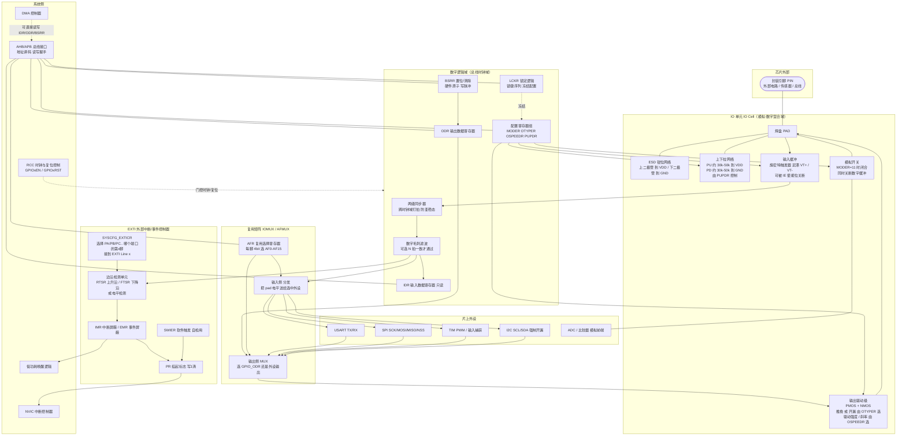

这张图值得反复看。下面逐块拆解。

### 2.2 pad 与 ESD 钳位：模拟世界的第一道门

pad 是芯片硅片上真正与外界电气接触的金属区域。它面积大、寄生电容大（典型几 pF），并且是整颗芯片最"暴露"的部分——静电、过压、反灌电流都从这里进来。

因此每一个 IO pad 内部都并联着两只 **ESD 保护二极管**：一只从 pad 指向 V<sub>DD</sub>（当 pad 电压高于 V<sub>DD</sub> 一个二极管压降时正向导通，把过压钳到 V<sub>DD</sub> 附近），一只从 GND 指向 pad（当 pad 电压低于 GND 时导通，把负压钳到 GND 附近）。这两只二极管的正向导通压降约 0.3～0.7 V，其本职是吸收静电放电（ESD）脉冲，保护脆弱的核心器件免遭击穿。

但这里藏着一个工程雷区：**当输入脚电平超过 V<sub>DD</sub>（或低于 GND）时，这两只二极管会正向导通，形成一条从外部灌入芯片的电流路径，称为"注入电流（injection current）"**。数据手册通常规定单脚注入电流上限（例如 ±5 mA）与整片总和上限。一旦超过，后果分两层：

- 轻微时，多余电流会"漏"进 V<sub>DD</sub> 电源网络，抬高其他 IO 的参考电平，造成 ADC 采样偏差、数字输入误判——这类问题的典型症状是"某个 ADC 通道读数莫名偏高，且只在某个外部信号有效时出现"；
- 严重时可能触发 CMOS 的**闩锁效应（latch-up）**——寄生可控硅（PNPN）结构导通，在 V<sub>DD</sub> 与 GND 之间形成低阻大电流通路，芯片急剧发热甚至永久损坏，且一旦触发往往必须断电才能解除。

还有一个容易被忽略的场景：**MCU 未上电、但外部信号已经有效**。此时 pad 上的电压通过上钳位二极管反向给 V<sub>DD</sub> 网络"倒灌供电"，可能让芯片处于半上电的诡异状态（内核部分工作、复位电路失效），也可能烧掉稳压器的输出级。车载系统里 KL15/KL30 时序不同步时，这个问题非常常见，解决办法通常是在信号入口串限流电阻（几 kΩ 到几十 kΩ）把注入电流限制在手册允许范围内，或使用带隔离的接口器件。

因此对 5V 系统，要么选用 **5V-tolerant 输入脚**（其钳位结构经过特殊设计，取消了指向 V<sub>DD</sub> 的上钳位二极管、改用耐压更高的结构，允许 pad 高于 V<sub>DD</sub> 而不产生破坏性注入电流），要么必须用电平转换把信号降到 V<sub>DD</sub> 以内再进芯片。

### 2.3 输入通路：缓冲、施密特、上下拉、同步器与数字滤波

当引脚配置为**输入**时，外部电平沿着 pad → 输入缓冲 → 同步器 → （可选数字滤波） → IDR 这条链路进入数字世界。

**输入缓冲与施密特触发器。** 输入缓冲的核心是一个带迟滞的比较器，即**施密特触发器（Schmitt Trigger）**。它有两个不同的翻转阈值：输入电压上升时要超过 V<sub>T+</sub> 才判定为 1，下降时要低于 V<sub>T−</sub> 才判定为 0，两者之差就是迟滞窗口（典型几百 mV）。这个迟滞能显著抑制在阈值附近反复抖动造成的误触发，也能把缓慢上升的边沿（比如经过 RC 滤波后的按键信号）整形成陡峭干净的数字沿。

输入缓冲还有一个常被忽视的控制位：**输入使能 IE**。在模拟模式或某些低功耗模式下，硬件会把 IE 拉低、彻底关断输入缓冲。这不只是省一点点电——如果 pad 上是一个介于 V<sub>IL</sub> 与 V<sub>IH</sub> 之间的中间电平（浮空脚最常见的状态），CMOS 反相器的 PMOS 与 NMOS 会**同时部分导通**，在 V<sub>DD</sub> 与 GND 之间形成一条直流通路，单脚就能吃掉几十甚至几百 μA。整片芯片几十个浮空脚累加起来，就是引言里那几个"凭空多出来的毫安"。

**上下拉网络。** 并联在 pad 上的是两只可编程接入的高阻电阻：

- **浮空（Floating / No pull）**：内部既不上拉也不下拉。引脚完全由外部电路决定电平。如果外部什么都没接，引脚就变成一个高阻抗天线，极易随环境噪声漂移。**任何未使用的输入脚都不应该长期浮空**。
- **上拉（Pull-up）**：内部接一个较大阻值的电阻（典型 30 kΩ～50 kΩ，不同芯片差异很大）到 V<sub>DD</sub>。引脚默认被拉到高电平，只有当外部把它拉低时才读到低。按键检测、开漏总线的从设备端常利用上拉。
- **下拉（Pull-down）**：内部接电阻到 GND，默认读到低。适合"外部给高有效"的信号，如霍尔开关输出、光耦集电极。

这里有一个常被初学者忽略的要点：**内部上下拉电阻的阻值通常很大（几十 kΩ），且工艺偏差极大（手册常给 ±30% 甚至更宽的范围）**，它只能提供极弱的驱动能力。它适合把空闲输入固定到一个确定电平，但绝不适合用来给 LED、长线缆或任何有容性/阻性负载的场合"供电"。如果你需要强上拉（例如 I²C 的 4.7 kΩ 上拉），必须用外部电阻。另外要注意：**内部上拉在深度低功耗模式下是否保持，各芯片行为不同**——有些芯片进 Standby 后 IO 进入"保持态（retention）"、上下拉冻结在进入前的状态，有些则全部释放为浮空。这直接决定了休眠电流表现，必须查手册确认。

**同步器与亚稳态。** 外部信号相对于 MCU 的总线时钟是完全异步的。如果直接把 pad 电平送进寄存器采样，在时钟沿附近发生跳变时会产生**亚稳态（metastability）**——触发器输出既不是 0 也不是 1，在中间电平停留一段不确定时间。IP 内部因此普遍插入**两级（有的三级）D 触发器同步器**打拍，把亚稳态概率压到工程可忽略的量级。

这个同步器带来一个软件必须知道的后果：**IDR 读到的电平相对 pad 真实电平有 1～2 个总线时钟周期的延迟**。绝大多数场景无所谓，但在"写 GPIO 输出后立刻读回验证"的自检代码里，如果外部电平还没建立、或同步器还没打完拍，就会读到旧值。正确做法是写完后插入足够延时（或等待至少 2～3 个时钟）再读回。

**数字毛刺滤波。** 部分 IP（尤其是车规 MCU 与 SoC）在同步器之后还提供可配置的**数字滤波器**：只有连续 N 个采样时钟读到同一电平，才把该电平送到 IDR 与边沿检测单元。这相当于把软件去抖的一部分工作下放到硬件，能有效抑制窄脉冲干扰。S32K 的 PORT 模块就提供 `DFCR`/`DFWR`（Digital Filter Clock/Width Register）来配置滤波时钟源与宽度。使用时要留意：**滤波会引入等于滤波宽度的固有延迟**，对时序敏感的信号（如高速捕获）不能开。

### 2.4 输出通路：推挽、开漏、驱动强度与斜率

当引脚配置为**输出**时，由 ODR（或复用来的外设输出）经输出驱动级控制 pad 电平。输出驱动级的物理实现是一对功率 MOS 管，其连接方式由 OTYPER 决定：

**推挽（Push-Pull）**：内部有一对互补的 MOS 管（一个 PMOS 接 V<sub>DD</sub>，一个 NMOS 接 GND），同一时刻只有一个导通。当输出"1"时 PMOS 导通，把 pad 主动拉到 V<sub>DD</sub>；输出"0"时 NMOS 导通，把 pad 主动拉到 GND。因此推挽可以**主动驱动高电平，也能主动驱动低电平**，驱动能力强、边沿快。代价是：**两个推挽输出不能"线与"（wire-AND）在同一根线上**——如果一个拉高、另一个拉低，PMOS 与 NMOS 在电源和地之间直接形成低阻通路，产生很大的短路电流，可能烧毁 IO 缓冲器。

**开漏（Open-Drain，CMOS 中称 Open-Drain，TTL 中称 Open-Collector）**：内部只有下拉的 NMOS（漏极开路），上拉的 PMOS 被永久关断。当输出"0"时 NMOS 导通，主动把 pad 拉到 GND；当输出"1"时 NMOS 关断，pad 进入高阻态，**必须依靠外部上拉电阻才能变为高电平**。开漏的两大妙处：

1. **允许多设备"线与"**：任何一颗芯片把线拉低，整条线就是低；只有所有设备都释放（高阻），外部上拉才把线拉高。谁拉低谁赢。这正是 I²C、SMBus、1-Wire 这类多主/多从总线的工作基础，也是 I²C 时钟同步与仲裁机制得以实现的物理前提。
2. **便于电平转换**：因为高电平由外部上拉电阻接到哪路电源决定，开漏脚可以"灵活地"把信号上拉到与对端兼容的电平（例如 MCU 3.3V 域的开漏脚，上拉到 5V 域，实现 3.3V→5V 单向转换）。

开漏的代价是：高电平边沿由外部上拉电阻与总线分布电容的 RC 时间常数决定，速度慢、且功耗随频率上升（每次从低回到高都要给电容充电，低电平期间还有 V<sub>DD</sub>/R<sub>pull</sub> 的静态电流）。所以开漏总线的上拉电阻需要在"速度"与"功耗/驱动"之间折中。

**驱动强度与斜率控制。** 在 IP 内部，"驱动强度（Drive Strength）"通常通过并联多组尺寸不同的输出 MOS 管、按配置位选择接通几组来实现——接通的管子越多，导通电阻 R<sub>DS(on)</sub> 越小，能灌/拉的电流越大，边沿也越陡。"斜率（Slew Rate）"控制则往往在栅极驱动路径上串入可调电阻或分级开启多组管子，让输出边沿平缓上升，从而抑制 EMI 与传输线振铃。STM32 用 `OSPEEDR` 统一表达这两个维度，S32K 则拆成 `PORT_PCR` 的 `DSE`（Drive Strength Enable）与 `SRE`（Slew Rate Enable）两个位。

下面这张图对比两种输出级的电路行为与适用场景：

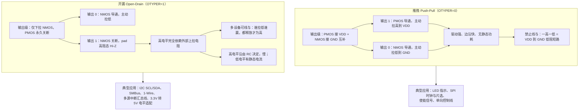

### 2.5 模拟开关与模拟模式

当引脚配置为**模拟模式**（MODER=11）时，IP 内部会做三件事：

1. 闭合 pad 与内部模拟总线之间的**模拟开关**（一个传输门/T-gate），把 pad 直接连到 ADC 采样保持电容、DAC 输出缓冲或比较器输入；
2. 关断数字**输入缓冲**（IE=0），断开施密特触发器；
3. 关断数字**输出驱动级**，让 PMOS/NMOS 都不导通。

这样设计的理由是：

- 关闭数字输入缓冲可以避免数字电路对模拟信号的串扰（数字噪声注入），并消除施密特触发器在阈值附近因微小噪声反复翻转带来的额外功耗；
- 模拟路径的阻抗被专门设计为适合采样，避免数字 IO 的驱动级寄生电容与钳位结构影响采样精度与建立时间。

工程上有一个非常实用的推论：**未使用的引脚最稳妥的处理方式之一就是配置为模拟输入**。因为这样既固定了状态（高阻，不会随噪声在数字阈值附近摆动），又关掉了数字缓冲（消除半导通静态电流），功耗最低。这也是引言里"休眠电流超标"案例的正确解法之一：那些不用的脚，进低功耗前统一设成模拟输入，或设成带确定上下拉的输入，杜绝漏电与误触发。

需要提醒的是，模拟模式下 **ESD 钳位二极管依然在**，所以模拟输入同样受"不得超过 V<sub>DD</sub>+0.3V、不得低于 GND−0.3V"的约束。ADC 前端接分压电阻时，一定要按最恶劣工况（比如 12V 系统的 load dump）核算分压后的电压。

### 2.6 复用功能矩阵 IOMUX：有限引脚承载无限外设

现代 MCU 的引脚数量有限（LQFP64 只有 64 个脚，其中还要扣掉电源、地、晶振、复位、调试口），但片上外设极多（UART×6、SPI×4、I²C×3、定时器×14、CAN、USB、SDIO……）。为了让有限的引脚承载更多功能，芯片设计者引入了**复用功能矩阵（IOMUX / Pin Multiplexer）**。

IOMUX 本质上是**每个 pad 前面挂一组多路选择器**：

- **输出侧 MUX**：从"GPIO 的 ODR"、"外设 A 的输出"、"外设 B 的输出"……中选一个，接到输出驱动级的数据输入端，同时选择对应的输出使能（OE）信号；
- **输入侧分发**：pad 电平经输入缓冲后，同时广播给所有可能用到它的外设，但只有被 AF 选中的那个外设的输入才被"激活"（其余外设的输入端被驱动到无害的默认值，避免误触发）。

以 STM32 家族为例，每个引脚有 `GPIOx_AFRL`（低 8 脚）和 `GPIOx_AFRH`（高 8 脚）两个寄存器，每 4 个 bit 选择 0～15 中的一个 AF 编号，把该引脚连接到对应外设的输入/输出。例如把某脚设为 `AF1` 可能连到定时器 TIM2 的通道，设为 `AF7` 可能连到 USART1 的 TX。**配置顺序是：先在 `MODER` 里把引脚设为"复用模式（10）"，再在 `AFR` 里选具体编号，二者缺一不可。** 只设 MODER 不设 AFR，引脚会连到默认的 AF0（通常是系统功能如 MCO、JTAG），往往不是你想要的。

S32K 的做法略有不同但语义等价：`PORT_PCR[n]` 的 `MUX[2:0]` 字段直接编码"这个脚归谁用"——`MUX=0` 是禁用（模拟）、`MUX=1` 是 GPIO、`MUX=2..7` 是各路 ALT 外设。它把"是不是 GPIO"和"是哪个外设"合并成了一个字段，反而比 STM32 的"MODER + AFR 两处配"更不容易出错。

下面这张图展示 IOMUX 的连接拓扑与冲突产生的机理：

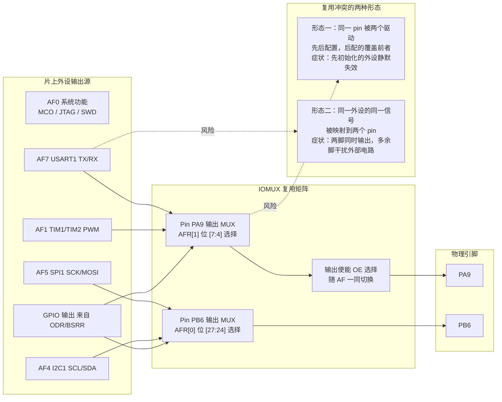

**复用冲突（Pin Conflict）是集成阶段最高频的问题之一。** 它有两种典型形态：

- **形态一：一脚多主。** 模块 A 的初始化把 PA9 配成 USART1_TX，模块 B 的初始化又把 PA9 配成 TIM1_CH2。后执行的覆盖先执行的，结果是"串口莫名其妙不出数据了，而且是在加了某个新功能之后"。这类问题在多人协作、各模块自己调 `HAL_GPIO_Init()` 的工程里极其常见。
- **形态二：一信号多脚。** 某些外设的同一个信号可以映射到多个候选引脚（比如 USART1_TX 既可以在 PA9 也可以在 PB6）。如果两处都配成了 AF，外设会**同时**从两个脚驱动输出——不仅浪费功耗，还可能把另一路电路上的信号打乱。

**治理复用冲突的唯一可靠办法，是建立一张全局唯一的"引脚分配表（Pin Assignment Sheet）"，并让它成为唯一真源。** 这也正是后文 MCAL 一节要讲的：AUTOSAR Port 模块的设计哲学，就是把**所有引脚的配置集中到一个模块、一次性初始化**，从架构上杜绝"各模块各配各的"。

| 复用冲突类型 | 触发条件 | 典型症状 | 排查手段 | 根治办法 |
|---|---|---|---|---|
| 一脚多主（覆盖） | 两处代码配同一 pin 不同 AF | 后配置的生效，先配置的外设静默失效 | 断点后 dump `AFR`/`MODER` 与预期比对 | 引脚分配表唯一真源；Port 模块集中初始化 |
| 一信号多脚 | 同一外设信号映射到两个 pin 都使能 | 多余脚意外输出，干扰其他电路 | 示波器扫描候选脚是否有波形 | 复用表评审；只保留一处 AF 配置 |
| AF 编号选错 | MODER 设复用但 AFR 编号错 | 外设完全无信号，pad 上是别的波形 | 查手册 Alternate function mapping 表 | 用工具生成而非手写 AF 编号 |
| 漏配 AFR | 只设 MODER=10，AFR 停在 0 | 连到 AF0 系统功能，或无输出 | 读 `AFR` 确认非 0 | 封装成 `GPIO_ConfigAF()` 强制两者同配 |
| 与调试口冲突 | 复用了 SWDIO/SWCLK/JTAG 脚 | 烧录后再也连不上调试器，芯片"变砖" | 上电瞬间拉复位抢连接 | 评审阶段就把调试脚列入禁用清单 |
| 与启动脚冲突 | 复用了 BOOT0/BOOT1 | 外部电平导致进入 Bootloader 而非用户程序 | 量启动脚上电瞬间电平 | 启动脚加确定的下拉，不复用为输出 |

### 2.7 EXTI 外部中断线：从边沿到 NVIC

GPIO 之所以能"主动"把 MCU 从睡眠中叫醒，靠的是**外部中断/事件控制器（EXTI）**。它是一个独立于 GPIO 的小 IP，位于 GPIO 输入通路的下游、NVIC 的上游。

EXTI 内部对每一条 line 做四件事：**选源 → 检边沿 → 打标志 → 送屏蔽后的请求**。

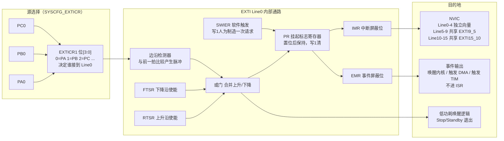

图中有三个必须记住的细节：

1. **EXTICR 的存在感极低但极关键。** line 0～15 与端口是"多对一"关系：line *x* 可以连接到任意一个端口的第 *x* 号引脚（即 PA0、PB0、PC0……共享 EXTI0），具体选谁由 SYSCFG 的 EXTICR 决定。**你必须先在 EXTICR 里把"EXTI0 映射到 PORTA"选好，再使能 EXTI0，否则中断永远不来**，而这一步在寄存器级代码里最容易被漏掉。
2. **PR 标志是"写 1 清"，且它在 IMR 之前。** 也就是说：即使 IMR 屏蔽了中断，PR 依然会被置位。这有两个后果——一是你可以用"轮询 PR"的方式实现无中断的边沿检测；二是**在使能中断之前必须先清一次 PR**，否则配置期间攒下的历史边沿会在使能瞬间立刻打进来，造成上电就误触发。
3. **事件（Event）通路与中断通路并行。** EXTI 不仅能产生"中断"（进 ISR 占用 CPU），还能产生"事件"：事件不进入 NVIC 中断向量，而是直接触发其他硬件动作（把内核从 Stop 唤醒、触发定时器、发起 DMA 请求）。在低功耗场景里，**若只想"把 MCU 从睡眠拉起"而并不需要立即执行 ISR，用事件模式更轻量**——绕过中断处理开销，唤醒后由主循环轮询标志，既省电又避免中断嵌套的复杂度。

**软件触发 SWIER 是被低估的自检利器。** 向 `EXTI_SWIER` 写对应位，可人为制造一次该 line 的中断或事件。当调试"中断死活不来"时，正确的排查顺序是：先用 SWIER 确认 ISR 与 NVIC 配置正确，再排查外部硬件电平与 EXTICR 映射，往往能事半功倍。在功能安全项目里，SWIER 还常用于上电自检（POST）：启动时软件触发一次每条关键中断线，验证整条中断链路（EXTI→NVIC→ISR→标志置位）是活的，这是 ISO 26262 里对"中断丢失"失效模式的一种常见诊断措施。

### 2.8 锁定寄存器 LCKR：把配置焊死

`GPIOx_LCKR` 用于**锁定**当前引脚的配置（模式、上下拉、输出类型、速度、复用编号等）。它的使用方式很特别，需要一段**锁键序列（Lock Key Sequence）**：

1. 写 `LCKR = LCKK(bit16) | 需要锁定的引脚掩码`（即 bit16 写 1）；
2. 写 `LCKR = 需要锁定的引脚掩码`（bit16 写 0）；
3. 再写 `LCKR = LCKK | 掩码`（bit16 写 1）；
4. 读一次 `LCKR`；
5. 再读一次 `LCKR`，若 bit16 读回为 1，表示锁定成功。

这段"写1-写0-写1-读-读"的仪式感设计并非折腾人，而是一种**防误写保护**：正常程序跑飞后随机写一个值到 LCKR 的概率很高，但连续凑巧写出这四步序列的概率极低。同类设计在看门狗喂狗寄存器、Flash 解锁寄存器上随处可见。

锁定生效后，被锁引脚的配置寄存器变为只读，**直到下一次系统复位才解锁**。在功能安全场景里，用来防止软件跑飞后意外改写安全相关 IO（继电器使能、HVIL 检测、故障灯）的配置，是一道成本几乎为零的"最后防线"。笔者的经验是：把主继电器/预充继电器的使能脚、HVIL 输入脚在 `Port_Init()` 之后立即锁定，能挡掉相当一部分"跑飞误动作"的失效模式。

需要注意 LCKR 的两个约束：**一是锁定的是"配置"不是"数据"**，被锁的输出脚依然可以通过 ODR/BSRR 改变电平（否则就没法用了）；**二是锁键序列必须在同一个端口的 LCKR 上原子完成**，中途被中断打断并在 ISR 里访问同一个 LCKR，序列就会失败——所以锁定操作应放在关中断的临界区里。

### 2.9 时钟域与复位域

GPIO 模块跨在两个域上：pad 与 IO 单元属于**永远上电的模拟/IO 域**（部分芯片甚至在 Standby 下仍保持），而寄存器组与总线接口属于**由 RCC 门控的数字时钟域**。

这个划分带来一条几乎所有初学者都踩过的坑：**不使能 GPIO 端口的外设时钟，所有寄存器读写都是无效的**——写进去读出来是 0，配置完全不生效，而且没有任何错误提示。在 STM32 上是 `RCC->AHB1ENR |= RCC_AHB1ENR_GPIOAEN`，在 S32K 上是 `PCC->PCCn[PCC_PORTA_INDEX] |= PCC_PCCn_CGC_MASK`。

还有一个更微妙的问题：**时钟使能后需要几个周期才真正稳定**。部分 ARM 芯片手册明确要求"使能外设时钟后应插入一次 dummy read 再访问该外设寄存器"，因为总线写缓冲的存在可能让紧随其后的配置写丢失。稳妥的写法是使能时钟后立刻读回一次 RCC 寄存器。

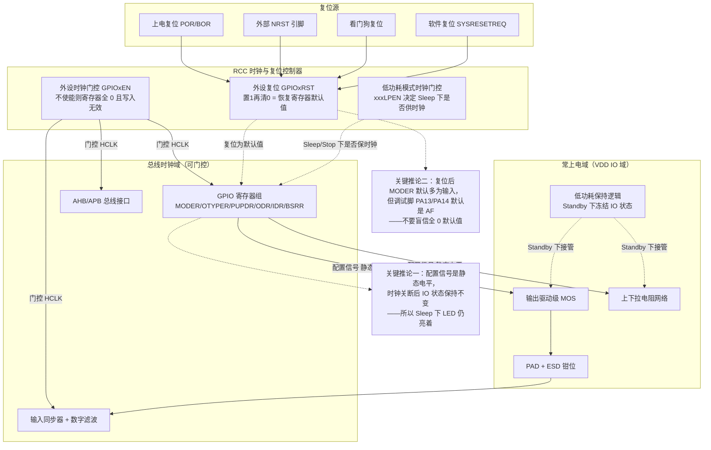

**复位默认值必须逐脚确认，不能想当然。** 大多数引脚复位后是"浮空输入"，但调试相关引脚（SWDIO/SWCLK/JTAG）通常复位后就已经是复用功能且带上下拉；某些芯片的 BOOT 脚、NRST 脚也有特殊默认态。上电到 `Port_Init()` 执行之间这段时间（可能几毫秒），引脚就处在这个默认态——如果某个继电器使能脚复位默认是浮空、而外部又没有下拉电阻，这段时间内它的电平是不确定的。**安全相关的输出脚必须在片外配置确定的上拉或下拉电阻，把上电窗口期的状态钉死，而不能指望软件。** 这是硬件评审中的必查项。

### 2.10 与中断控制器、外设的协作全景

把前面各块串起来，一次完整的"外部信号 → 应用响应"链路是这样的：

外部电平变化 → pad → ESD 钳位（不动作）→ 上下拉网络（提供默认电平）→ 输入缓冲施密特整形 → 两级同步器打拍 → 数字滤波（可选）→ 同时送三路：①IDR 供软件轮询读取，②IOMUX 输入分发给选中的外设（如定时器输入捕获），③EXTI 边沿检测 → PR 置位 → IMR 屏蔽判断 → NVIC 优先级仲裁 → CPU 取中断向量 → 进入 ISR → 清 PR → 置事件标志/发信号量 → 调度到应用任务 → 执行业务逻辑。

这条链路上任何一环断掉，症状都是"中断不来"或"读不到电平"，但根因可能相差十万八千里。这正是笔者强调"先看结构图再查寄存器"的原因——**有了这张链路图，排查就从"猜"变成了"二分定位"**。

---

## 三、寄存器与位域：通用 GPIO IP 的编程模型

无论哪一款 MCU，GPIO 的寄存器集合都高度同构。下面以"通用 GPIO IP"为抽象模型，逐字段给出完整的寄存器映射，再对照 STM32、S32K 的真实寄存器名做说明。

### 3.1 寄存器总表

| 寄存器 | 字段粒度 | 关键字段 | 含义 | 读写属性 | 典型复位值 |
|--------|----------|----------|------|------|------------|
| DIR / GPIOx_MODER | 每 pin 2 bit | MODERy[1:0] | 00=输入，01=输出，10=复用，11=模拟 | RW | 通常 00（部分调试脚为 10） |
| OTYPER | 每 pin 1 bit | OTy | 0=推挽，1=开漏 | RW | 0（推挽） |
| OSPEEDR | 每 pin 2 bit | OSPEEDRy | 输出速度/斜率/驱动强度等级 | RW | 通常最低速 |
| PU/PD / GPIOx_PUPDR | 每 pin 2 bit | PUPDRy[1:0] | 00=无，01=上拉，10=下拉，11=保留 | RW | 00（调试脚除外） |
| MUX/AF / GPIOx_AFRL/H | 每 pin 4 bit | AFy[3:0] | 复用功能编号 0～15 | RW | 0 |
| IN / GPIOx_IDR | 每 pin 1 bit | IDRy | 输入采样值（经同步器） | RO | — |
| OUT / GPIOx_ODR | 每 pin 1 bit | ODRy | 输出数据值 | RW | 0 |
| BSRR / GPIOx_BSRR | 每 pin 2 bit（置/清各 16） | BSy / BRy | 原子置位/清除 | WO（读为 0） | 0 |
| BRR（部分型号） | 每 pin 1 bit | BRy | 仅清除（BSRR 高半区的独立映射） | WO | 0 |
| LCKR / GPIOx_LCKR | 每 pin 1 bit + LCKK | LCKy / LCKK | 配置锁定 + 锁键 | RW（特殊序列） | 0 |
| SYSCFG_EXTICR[0..3] | 每 line 4 bit | EXTIx[3:0] | EXTI line 源端口选择 | RW | 0（PA） |
| EXTI_IMR / EMR | 每 line 1 bit | MRx | 中断/事件屏蔽 | RW | 0（屏蔽） |
| EXTI_RTSR / FTSR | 每 line 1 bit | TRx | 上升沿/下降沿触发使能 | RW | 0 |
| EXTI_SWIER | 每 line 1 bit | SWIERx | 软件触发 | RW | 0 |
| EXTI_PR | 每 line 1 bit | PRx | 挂起标志（写 1 清） | RC_W1 | 0 |

> 说明：上表是跨厂商的抽象。具体到 STM32，方向、类型、速度、上下拉被拆成 MODER、OTYPER、OSPEEDR、PUPDR 四个独立寄存器；而 NXP S32K 则把方向（`GPIO_PDDR`）、数据（`PDOR`/`PDIR`/`PSOR`/`PCOR`/`PTOR`）、以及引脚控制（`PORT_PCR` 的 MUX/PE/PS/DSE/PFE/IRQC 等字段）分属 GPIO 与 PORT 两个模块。核心语义完全一致，只是寄存器切分方式不同——这也印证了本文用"通用 IP 模型"讲解的价值。

### 3.2 位域图：MODER / OTYPER / OSPEEDR / PUPDR

下面把四个配置寄存器的位域布局画出来。注意 MODER、OSPEEDR、PUPDR 是"每脚 2 bit"，一个 32 位寄存器正好覆盖 16 个引脚；OTYPER 是"每脚 1 bit"，只用了低 16 位。

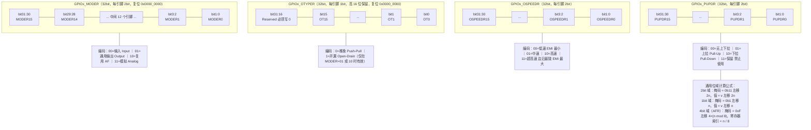

### 3.3 位域图：AFR / IDR / ODR / BSRR / LCKR

数据类与复用类寄存器的位域布局如下。特别注意 **BSRR 的双半区结构**，这是本文第六节要重点展开的原子性基础。

```mermaid
flowchart TB
    subgraph AF["GPIOx_AFRL（AFR[0]，管 Pin0-7）与 GPIOx_AFRH（AFR[1]，管 Pin8-15），每引脚 4bit"]
        direction LR
        F7["bit31:28<br/>AFSEL7 或 15"] --- F6["bit27:24<br/>AFSEL6 或 14"] --- FDOT["..."] --- F1["bit7:4<br/>AFSEL1 或 9"] --- F0["bit3:0<br/>AFSEL0 或 8"]
    end
    AFN["编码 0-15：AF0 系统 ｜ AF1 TIM1/2 ｜ AF4 I2C ｜ AF5 SPI ｜ AF7 USART1-3 ｜ AF9 CAN ｜ AF12 SDIO ...<br/>具体对应关系必须查该型号数据手册的 Alternate function mapping 表"]
    AF --- AFN

    subgraph IO1["GPIOx_IDR（只读，反映同步后的引脚真实电平）"]
        direction LR
        G31["bit31:16 Reserved"] --- G15["bit15 IDR15"] --- GDOT["..."] --- G0["bit0 IDR0"]
    end
    IN1["读到的是 pad 经施密特+同步器后的电平，与 ODR 无关。<br/>输出模式下读 IDR 可用于检测输出是否被外部拉住（短路诊断）"]
    IO1 --- IN1

    subgraph IO2["GPIOx_ODR（读写，保存期望输出值）"]
        direction LR
        H31["bit31:16 Reserved"] --- H15["bit15 ODR15"] --- HDOT["..."] --- H0["bit0 ODR0"]
    end
    IN2["读 ODR 返回上次写入值，不是 pad 真实电平。<br/>直接位操作 ODR 存在读-改-写竞态，禁止在并发环境使用"]
    IO2 --- IN2

    subgraph BS["GPIOx_BSRR（只写，32bit 双半区，硬件原子）"]
        direction LR
        I31["bit31:16 —— BR15..BR0<br/>写 1 = 对应引脚清零<br/>写 0 = 保持不变"] --- I15["bit15:0 —— BS15..BS0<br/>写 1 = 对应引脚置位<br/>写 0 = 保持不变"]
    end
    IN3["同一次写可同时置位一批、清除另一批。<br/>若同一引脚的 BS 与 BR 都写 1，则置位优先（BS 优先级高于 BR）。<br/>写 BSRR 不需要先读，因此天然无读-改-写竞态"]
    BS --- IN3

    subgraph LK["GPIOx_LCKR（配置锁定）"]
        direction LR
        J31["bit31:17 Reserved"] --- J16["bit16 LCKK<br/>锁键位"] --- J15["bit15:0 LCK15..LCK0<br/>需锁定的引脚掩码"]
    end
    IN4["锁键序列：写 LCKK=1+掩码 → 写 LCKK=0+掩码 → 写 LCKK=1+掩码 → 读 → 再读校验 LCKK=1。<br/>锁定后配置只读直到系统复位；锁的是配置不是数据，ODR/BSRR 仍可写"]
    LK --- IN4
```

### 3.4 配置顺序：为什么顺序不能反

有了结构图与位域图，配置顺序的规则就不需要死记了，可以直接推导：

**规则一：先使能时钟，再碰任何寄存器。** 因为寄存器组在门控时钟域内，无时钟则读写无效。

**规则二：先配"电气属性"，再配"模式"，最后配"数据"。** 具体来说，把 PUPDR、OTYPER、OSPEEDR、AFR 都配好之后，最后再写 MODER 把引脚"激活"。理由是：一旦 MODER 切到输出/复用，输出驱动级立刻按当前的 OTYPER/ODR 状态驱动 pad。如果你先切 MODER 再配 OTYPER，就会有一个短暂窗口，pad 以"错误的输出类型 + 错误的初始电平"驱动外部电路。这个窗口只有几十纳秒，但对于连接着 MOSFET 栅极的继电器使能脚来说，足以产生一次可测量的毛刺。

**规则三：输出脚在切 MODER 之前，先用 BSRR 把 ODR 设成期望的初始电平。** 这与规则二同源——先把"要输出什么"准备好，再打开输出。AUTOSAR Port 模块的配置项里之所以有 `PortPinInitialValue`，正是为了让生成的代码遵守这个顺序。

**规则四：中断相关配置的顺序是：配 GPIO 输入 → 配 EXTICR 源选择 → 配 RTSR/FTSR 触发沿 → 清一次 PR → 设 NVIC 优先级 → 使能 IMR → 使能 NVIC IRQ。** 把"清 PR"放在使能之前，是为了丢弃配置过程中攒下的历史边沿。

---

## 四、输入中断 EXTI 的工程细节

### 4.1 边沿触发 vs 电平触发

EXTI 支持两类触发方式，语义差别很大：

- **边沿触发（Edge-triggered）**：在上升沿、下降沿或双沿到来时产生一次中断请求。优点是"事件"语义清晰，适合按键、脉冲计数、唤醒（唤醒是一次性动作）；缺点是对机械弹跳敏感，一次物理动作可能产生多次边沿，且**如果 ISR 执行期间又来了一个边沿，PR 会被再次置位，退出 ISR 后立刻重入**。
- **电平触发（Level-triggered）**：只要引脚保持在高电平（或低电平），就持续挂起中断请求。优点是"状态"语义清晰，适合"多个中断源共用一根 IRQ 线、需要轮询确认"的场合（如外部中断扩展芯片）；**致命缺点是：如果你在 ISR 里不清除中断源（不是清 PR，而是让外部电平恢复），中断会立刻重入，MCU 被钉死在 ISR 里**。因此电平触发必须配套"先屏蔽 IMR，处理完外部源后再解屏蔽"的策略。

注意 STM32 的 EXTI 只支持边沿触发（RTSR/FTSR），S32K 的 `PORT_PCR.IRQC` 则同时支持边沿与电平（`IRQC=0b1000` 逻辑 0 电平触发、`0b1100` 逻辑 1 电平触发）。这是选型时的一个实际差异点。

| 特性 | 边沿触发 | 电平触发 |
|---|---|---|
| 触发条件 | 电平发生跳变的瞬间 | 电平保持在指定状态期间 |
| 是否可能漏事件 | 会：ISR 执行期间的窄脉冲若已被 PR 记录则不漏，但两次同向边沿会合并 | 不会：只要电平还在，请求就在 |
| ISR 内需做什么 | 清 PR 即可 | 必须消除外部电平源，或先屏蔽 IMR |
| 对机械弹跳 | 极敏感，一次按键触发多次 | 相对不敏感，但会在弹跳期反复进出 |
| 典型场景 | 按键、编码器、唤醒、脉冲计数 | 中断扩展芯片 INT 汇总线、持续故障状态 |
| 死锁风险 | 低 | 高（不清源则永久重入） |
| 低功耗唤醒 | 常用，一次边沿唤醒一次 | 可用，但唤醒后电平仍在会持续触发 |

### 4.2 共享中断线与优先级

由于 EXTI line 0～4 各自有独立 IRQ 向量（EXTI0、EXTI1……EXTI4），而 line 5～9 共用一个 `EXTI9_5`、line 10～15 共用一个 `EXTI15_10`，**多个引脚会落到同一个 ISR 里**。于是 ISR 的第一要务是**读 `PR`（挂起寄存器）判断到底是哪个脚触发的，并逐位清标志**——漏清一个，对应脚就再也进不来中断；错清一个，就会丢掉别的脚的事件。

一个容易被忽略的写法陷阱是：**不要在 ISR 里用 `EXTI->PR = 0xFFFF` 这种"一把清空"的粗暴写法**。因为在你处理 line 13 的这段时间里，line 14 可能刚刚产生了一个新边沿并置位了 PR14；一把清空会把这个尚未处理的事件也抹掉。正确做法是在函数开头**一次性快照** `uint32_t pr = EXTI->PR`，然后只清快照中为 1 的位，逐位处理。

此外，EXTI 中断通过 NVIC 配置抢占优先级与子优先级。唤醒相关的中断通常需要较高优先级，避免被低优先级的长时间任务阻塞，导致唤醒延迟超标——在 BMS 这种对"钥匙/充电枪插入→快速唤醒"有实时性要求的场合，这一点直接关系到用户体验与安全。但也要警惕另一个极端：**把一个高频抖动的输入配成最高优先级中断，会导致中断风暴把整个系统饿死**。工程上的折中是"高优先级 + 硬件/软件滤波 + ISR 内只置标志"。

下面用时序图展示一个典型的"充电枪插入 → 边沿中断唤醒 → 软件去抖确认"完整流程：

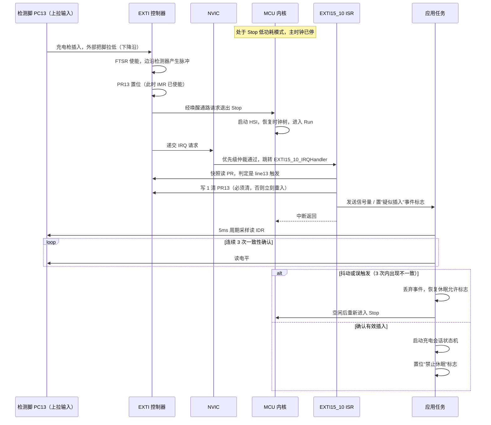

### 4.3 唤醒延迟的组成

在 BMS/网关这类对唤醒时序有硬指标的项目里，"从边沿到应用代码执行"的延迟需要被拆解核算：

1. **EXTI 边沿检测延迟**：1～2 个检测时钟周期，Stop 模式下由 LSI/异步通路完成，通常 < 1 μs；
2. **时钟恢复时间**：内核从 Stop 唤醒需要重启 HSI（几 μs）或 HSE+PLL（几百 μs 到几 ms），**这是延迟的大头**；
3. **中断向量取指与压栈**：十几个时钟周期；
4. **ISR 到任务调度**：取决于 RTOS 上下文切换开销与优先级。

工程上如果唤醒延迟不达标，优先优化第 2 项：唤醒后先用 HSI 跑起来处理关键动作，再切到 HSE+PLL；而不是一味提高中断优先级（那只影响第 3、4 项，量级小得多）。

---

## 五、按键与信号去抖：硬件 RC 与软件状态机

机械触点（按键、继电器、连接器）在闭合/断开瞬间不会"干净"地跳变，而是会经历几毫秒、甚至十几毫秒的金属弹跳（bounce），期间电平在高低之间反复横跳数次。如果直接把这个信号喂给边沿中断，一次按键可能被软件识别成十几次按下。去抖（debounce）因此成为 GPIO 输入工程的必修项。

### 5.1 硬件去抖：RC 滤波 + 施密特

最经典的硬件去抖是在输入脚并联一个电容到地（有时再串一个小电阻），构成 RC 低通滤波器：弹跳期间的高频抖动被电容吸收，波形变得平滑。再叠加 IO 内部的施密特触发器（迟滞），可以把缓慢、毛刺化的跳变整形成干净的边沿。

设计要点是选好时间常数 τ = R×C：τ 应显著大于弹跳持续时间（典型 5～20 ms），但又不能大到影响响应速度。例如 R=10 kΩ、C=100 nF，τ=1 ms，配合 3τ 的建立时间约 3 ms，对付典型轻触开关够用。若用内部上拉（几十 kΩ）代替外部 R，τ 会大得多，要相应减小 C。

硬件去抖的好处是"零软件成本、对中断友好"；坏处是需要额外元件与 PCB 面积、且 RC 时间常数限制了能识别的最小脉冲宽度（过快的窄脉冲会被滤掉，不适合高速信号）。

### 5.2 软件去抖：定时器扫描 + 状态机

纯软件去抖不依赖外部元件，而是用定时器周期性地采样引脚，并结合状态机/计数策略判断"稳定"。两类常见做法：

1. **延时确认法**：边沿中断进 ISR 后，不立即认定，而是启动一个几毫秒的软件定时器，超时后再读一次或连续读几次，若电平一致才上报。简单，但会引入定时器依赖，且在弹跳剧烈时可能反复重入 ISR。
2. **周期性扫描法**：用一个 1～10 ms 的时基（SysTick 或硬件定时器）周期性扫描所有按键，对每次采样做"滤波计数"——连续 N 次采样到同一新状态才认为状态翻转。这种方法把所有按键统一在一个扫描任务里，天然免疫弹跳，也方便扩展"长按/短按/双击"等高级语义。**笔者在量产项目中一律推荐第 2 种**，因为它行为确定、CPU 开销可预测、且不占用中断资源。

下面这张状态图描述一个支持"短按/长按/释放"三种语义的完整去抖状态机：

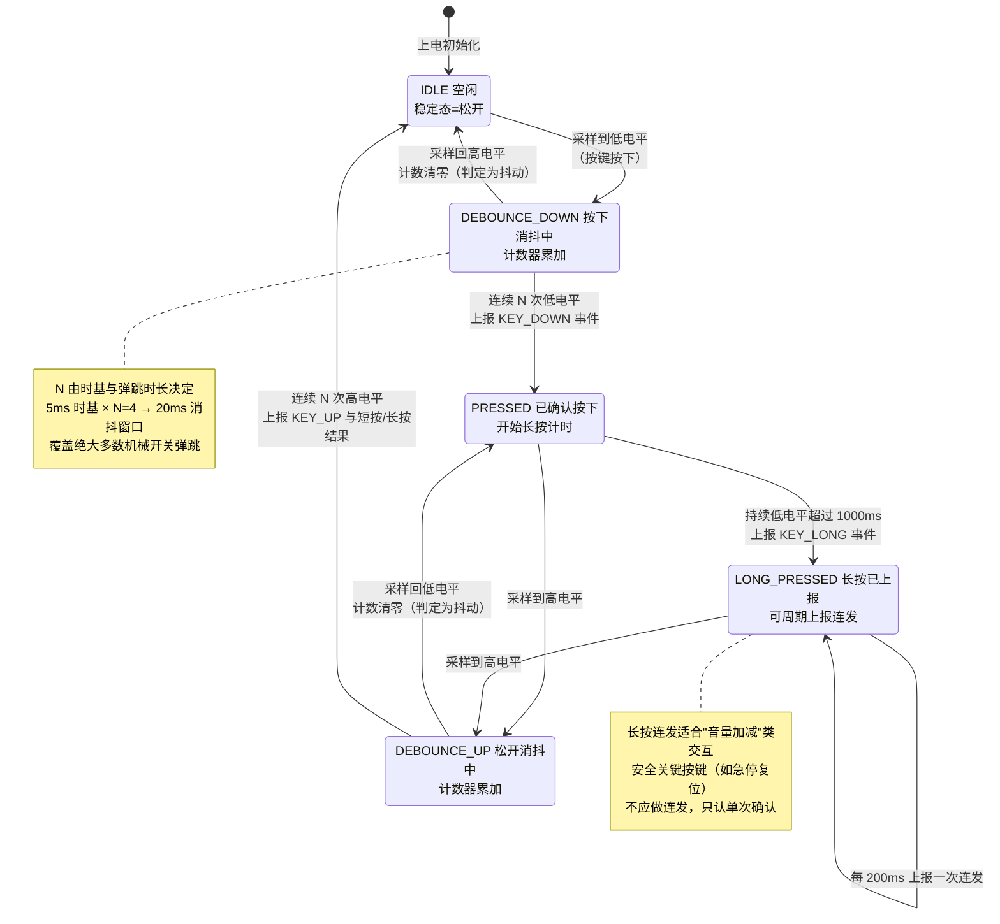

### 5.3 去抖参数怎么定

| 信号类型 | 典型弹跳时长 | 建议时基 | 建议 N | 有效消抖窗口 | 备注 |
|---|---|---|---|---|---|
| 轻触开关（膜片） | 1～5 ms | 2 ms | 3 | 6 ms | 手感要求高，窗口不宜过大 |
| 微动开关（机械） | 5～15 ms | 5 ms | 4 | 20 ms | 通用推荐值 |
| 继电器触点反馈 | 10～30 ms | 5 ms | 8 | 40 ms | 触点跳跃更剧烈 |
| 连接器插拔（充电枪） | 20～100 ms | 10 ms | 10 | 100 ms | 需兼顾插拔缓慢的人为动作 |
| 霍尔/光电开关 | 无机械弹跳 | 1 ms | 2 | 2 ms | 主要滤电气噪声 |
| 高压互锁 HVIL | 视连接器而定 | 5 ms | 4～8 | 20～40 ms | 需与整车诊断时序要求对齐 |

定参数的原则是：**消抖窗口要大于最坏弹跳时长，同时小于系统允许的响应延迟预算**。对 HVIL 这类安全信号，还要反过来核对——诊断标准可能要求"故障发生后 X ms 内必须断高压"，消抖窗口必须留在这个预算之内。

---

## 六、读-改-写原子性：为什么必须用 BSRR

这是 GPIO 领域最经典、也最容易被忽视的并发陷阱。先看"错误写法"：

```c
/* ============ 反面教材：读-改-写 ODR，存在竞态 ============ */
uint32_t val = GPIOA->ODR;     /* 步骤1：读整个端口的 16 个位 */
val |= (1U << 5);              /* 步骤2：在 CPU 寄存器里改第 5 位 */
GPIOA->ODR = val;              /* 步骤3：把整个 16 位写回去 */
```

这三步**不是原子的**。考虑一个 RTOS 环境：任务 A 在步骤 1 读完 ODR 后，被中断或高优先级任务 B 抢占；任务 B 也用同样的方式把第 6 位置位并写回了 ODR；等任务 A 恢复、执行步骤 3 写回时，它用的还是自己步骤 1 读到的"旧值"，于是**任务 B 对第 6 位的修改被悄悄覆盖（lost update）**。

这种 bug 的可怕之处在于它的统计特性：出问题需要抢占恰好发生在步骤 1 与步骤 3 之间那几个时钟周期内，概率可能是万分之一。于是它在实验室永远复现不了，却会在量产几万台之后，以"偶发继电器不吸合"、"故障灯偶尔不亮"的形式出现在售后报告里。

**正确解法是用 `BSRR`**：它允许你"只置位某些位"或"只清除某些位"，且对每一位都是硬件原子完成，不依赖读旧值：

```c
/* ============ 正确写法：BSRR 硬件原子置位/清除 ============ */
GPIOA->BSRR = (1U << 5);            /* BS5=1 → 置位 PA5，其余位完全不受影响 */
GPIOA->BSRR = (1U << (5 + 16));     /* BR5=1 → 清除 PA5 */
GPIOA->BSRR = (1U << 5) | (1U << (6 + 16));  /* 一条指令：置 PA5 同时清 PA6 */
```

为什么 ODR 不行、BSRR 行？因为 ODR 的"改某一位"本质上必须经过"读全端口→改一位→写全端口"三步；而 BSRR 把"改"的动作**下沉到了硬件层面**——软件写入的 1 只是一个"动作命令"（置位/清除脉冲），硬件在一个总线周期内对目标触发器直接施加 set/reset，其余触发器根本不参与。整个过程在总线看来是**一次不可分割的写事务**，天然免疫抢占。

同理，S32K 提供了 `GPIOx_PSOR`（Set）、`GPIOx_PCOR`（Clear）、`GPIOx_PTOR`（Toggle）三个只写寄存器，功能等价且多了一个硬件翻转。ARM Cortex-M3/M4 还提供 **位带别名（Bit-Banding）** 机制，把外设区每一个 bit 映射成一个独立的 32 位地址，对该地址的普通写就是对单 bit 的原子操作——这也是一种可选方案，但 Cortex-M7/M33 已取消位带，可移植性不如 BSRR。

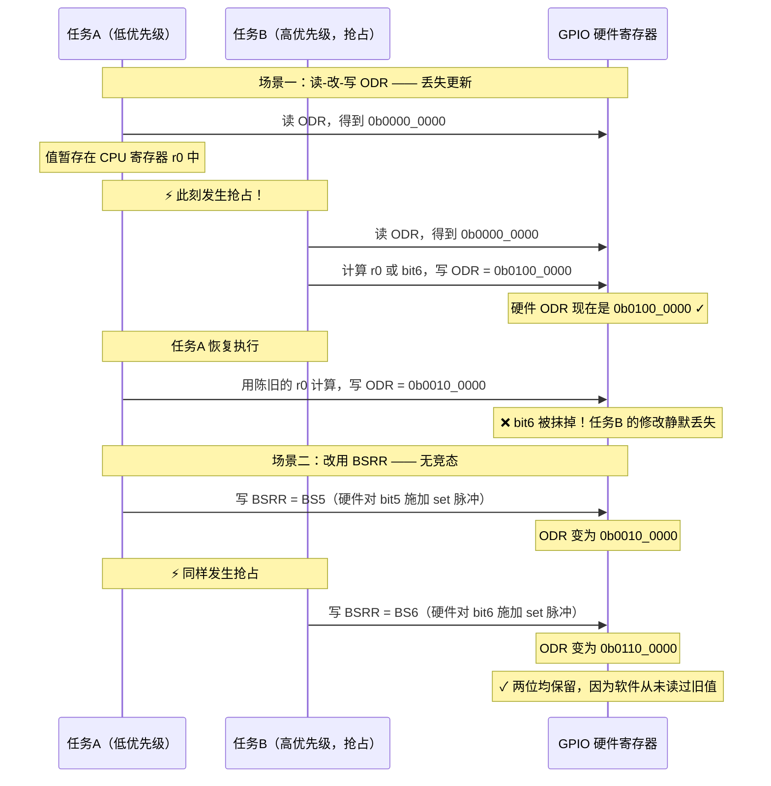

> **经验法则**：凡是需要在运行期单独翻转/置位/清除某个 GPIO 位，一律用 BSRR（或 PSOR/PCOR/PTOR），永远不要用"读 ODR → 或/与 → 写 ODR"的三步法。这条规则应写进团队的编码规范，并用静态检查工具（如 MISRA 自定义规则或 grep 脚本）在 CI 里强制。

需要补充的是：**配置类寄存器（MODER/PUPDR/AFR）的修改无法用 BSRR 规避竞态**，因为它们本身就是多位域、没有 set/clear 别名。如果确实需要在运行期动态改某个引脚的模式（例如 I²C 总线死锁恢复时把 SCL 临时切成 GPIO 手动发 9 个时钟），必须用**关中断临界区**或 RTOS 互斥量保护整个读-改-写序列。这也是笔者主张"所有引脚配置在启动阶段一次性完成、运行期不再改"的重要理由。

---

## 七、驱动能力、斜率与电平兼容性

### 7.1 驱动能力（Source / Sink Current）

每个 GPIO 引脚能灌入（sink，输出低时从负载吸电流到 GND）和拉出（source，输出高时从 V<sub>DD</sub> 供电流给负载）的电流都有上限，芯片数据手册会给出三个层次的限制：

- **单引脚最大电流**（例如 STM32 常见 8 mA / 20 mA 两档，取决于配置与是否为高驱动脚）；
- **同一端口（port）的总电流上限**；
- **整片芯片 V<sub>DD</sub>/V<sub>SS</sub> 引脚的总流入流出上限**。

实际工程要同时检查这三层。直接用一个 IO 去驱动继电器线圈、蜂鸣器、大电流 LED 串，几乎必然超限——正确做法是 IO 只做信号，功率交给三极管/MOSFET/驱动缓冲。还要注意：**source 能力通常弱于 sink 能力**（因为 PMOS 在同样面积下导通电阻比 NMOS 大），所以 LED 常采用"IO 灌电流"接法（IO 输出低时点亮），比"IO 拉电流"接法更可靠。

另一个常被忽略的点是：**手册给出的 V<sub>OL</sub>/V<sub>OH</sub> 是在特定电流下测的**。比如"I<sub>OL</sub>=8 mA 时 V<sub>OL</sub> ≤ 0.4 V"意味着，如果你真的灌 8 mA，输出低电平会被抬到 0.4 V。如果下游器件的 V<sub>IL(max)</sub> 只有 0.3 V，这个组合就会失效——**噪声容限（noise margin）在满载时会被吃光**。

### 7.2 斜率（Slew Rate）与 EMI

输出速度/斜率寄存器（如 `OSPEEDR`）控制边沿陡峭程度。慢斜率边沿平缓，EMI 小、振铃小、地弹（ground bounce）小、功耗低，适合状态指示和不要求速度的线；快斜率边沿陡峭，信号更"方"、时序裕量大，但 EMI 强、易在长线上产生反射振铃、多脚同时翻转时地弹严重。

选择原则：**够用就好**。一个实用的判据是——边沿上升时间 t<sub>r</sub> 应大于信号在 PCB 走线上往返传播时间的约 6 倍，否则该走线就要按传输线处理（需要端接匹配）。对于典型 FR4 板（传播速度约 6 in/ns），10 cm 走线往返约 1.3 ns，则 t<sub>r</sub> > 8 ns 即可视为"电气短线"，用低速档就足够了。无脑拉满最高速的结果，往往是 EMC 辐射测试在 100～300 MHz 段超标，然后回头逐个改 OSPEEDR。

### 7.3 电平兼容性：3.3V / 5V / 5V-Tolerant

BMS 板上一锅端：3.3V 的 MCU、5V 的收发器、1.8V 的内核，还有电池侧各种电平。GPIO 直接跨电平连接会出两类问题：

- **过压损坏**：5V 输出灌进仅耐 3.3V 的 input，通过 ESD 钳位形成注入电流，可能损坏芯片（见 2.2 节）。
- **高电平不够高**：3.3V 输出去驱动一个"输入高电平最小值 V<sub>IH</sub>=0.7×V<sub>CC</sub>≈3.5V"的 5V 器件，会因"高电平不够高"被当成低电平，逻辑错乱。

规则是：**输出高电平 V<sub>OH</sub> 必须 ≥ 对端输入的最小 V<sub>IH</sub>（并留噪声裕量）；输入耐压必须强于对端输出的最大 V<sub>OH</sub>**。

很多 MCU 提供 **5V-tolerant（5V 容忍）输入**脚——当芯片主电源是 3.3V 时，这类脚的输入耐压可达 5.5V，可直接接收 5V 信号。但有三条必须记住的限制：

1. **tolerant 是"耐输入"，不是"能输出 5V"**。该脚输出高时依然只有 3.3V。
2. **配成模拟模式时 tolerant 特性通常失效**，因为模拟开关直连内部模拟总线，没有特殊耐压结构。
3. **部分芯片的 tolerant 特性要求 V<sub>DD</sub> 已上电**。MCU 断电而外部 5V 有效时，仍可能产生反灌。车载 KL15/KL30 时序场景务必核对手册的"V<sub>DD</sub>=0 时 pad 允许电压"条目。

关于输入阈值还有一个重要区分：CMOS 工艺下典型 V<sub>IH</sub>≈0.7×V<sub>DD</sub>、V<sub>IL</sub>≈0.3×V<sub>DD</sub>，与 V<sub>DD</sub> 成比例；而兼容 5V 的"TTL 输入"阈值往往采用**绝对电压**（如 V<sub>IH</sub>=2.0 V、V<sub>IL</sub>=0.8 V），与 V<sub>DD</sub> 无关——这正是为什么一颗 3.3V 供电、带 TTL 输入的器件能稳妥识别 5V 信号，也能被 3.3V 信号驱动。

下面用流程图梳理跨电平连接的决策：

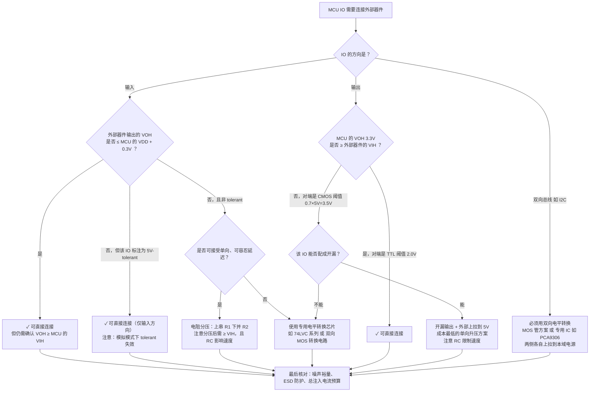

### 7.4 电流预算实例

假设某 MCU 规定单脚最大 sink 电流 8 mA、整片 V<sub>SS</sub> 总电流上限 80 mA。若你用 8 个 IO 各 sink 10 mA 驱动 LED，则单脚已超限（10 > 8），且总和 80 mA 正好顶到极限——这种"卡着上限"的设计在高温或电压偏低时可靠性骤降，易批量失效。

正确做法是：先按 LED 正向压降与允许电流计算限流电阻。3.3 V 供电、LED 压降 2.0 V、目标 5 mA，则 R = (3.3 − 2.0) / 0.005 = 260 Ω，取标称 270 Ω；此时实际电流约 4.8 mA。8 个 LED 总计 38.4 mA，单脚与总和都有充足裕量。若需更大电流（继电器、电机、大屏背光），果断用 MOSFET/驱动 IC 承担功率，IO 只负责"发号施令"。

---

## 八、驱动代码实现

本节给出贴近真实工程的、可直接移植的 C 代码。所有示例以 STM32 风格寄存器命名，但结构对任何 MCU 都适用。为便于阅读，示例采用直接寄存器操作而非 HAL 库，因为**理解寄存器层的行为才是本文的目的**；实际项目中封装成 HAL 或使用 MCAL 生成代码同样遵循这些原则。

### 8.1 GPIO 通用配置函数（按位域设模式/类型/速度/上下拉/复用）

```c
/* ============================================================
 *  通用 GPIO 配置驱动
 *  设计要点：
 *   1) 严格遵守配置顺序：电气属性 → 初始电平 → 模式（最后激活）
 *   2) 所有位域操作先清后置，避免残留旧值
 *   3) 配置期间关中断，防止并发修改配置寄存器（非原子）
 * ============================================================ */
#include <stdint.h>

/* ---------- 模式编码：对应 MODER[1:0] ---------- */
typedef enum {
    GPIO_MODE_INPUT  = 0x00U,   /* 00：数字输入 */
    GPIO_MODE_OUTPUT = 0x01U,   /* 01：通用输出 */
    GPIO_MODE_AF     = 0x02U,   /* 10：复用功能 */
    GPIO_MODE_ANALOG = 0x03U    /* 11：模拟（同时关断数字缓冲，最省电） */
} gpio_mode_t;

/* ---------- 输出类型：对应 OTYPER[n] ---------- */
typedef enum {
    GPIO_OTYPE_PP = 0x00U,      /* 推挽：主动拉高拉低 */
    GPIO_OTYPE_OD = 0x01U       /* 开漏：只主动拉低，高电平靠外部上拉 */
} gpio_otype_t;

/* ---------- 输出速度/斜率：对应 OSPEEDR[1:0] ---------- */
typedef enum {
    GPIO_SPEED_LOW      = 0x00U,  /* EMI 最小，优先选用 */
    GPIO_SPEED_MEDIUM   = 0x01U,
    GPIO_SPEED_HIGH     = 0x02U,
    GPIO_SPEED_VERYHIGH = 0x03U   /* 仅用于高速接口，会明显增加 EMI */
} gpio_speed_t;

/* ---------- 上下拉：对应 PUPDR[1:0]，注意 11 是保留值 ---------- */
typedef enum {
    GPIO_PULL_NONE = 0x00U,
    GPIO_PULL_UP   = 0x01U,
    GPIO_PULL_DOWN = 0x02U
    /* 0x03 为保留组合，本驱动不提供，防止误用 */
} gpio_pull_t;

typedef struct {
    GPIO_TypeDef  *port;        /* GPIOA / GPIOB / ... */
    uint8_t        pin;         /* 0 ~ 15 */
    gpio_mode_t    mode;
    gpio_otype_t   otype;
    gpio_speed_t   speed;
    gpio_pull_t    pull;
    uint8_t        af;          /* 复用编号 0~15，仅 mode==AF 时有效 */
    uint8_t        init_level;  /* 初始输出电平，仅 mode==OUTPUT 时有效 */
} gpio_cfg_t;

/* 2bit 位域读改写辅助宏：n 为引脚号，v 为 2bit 新值 */
#define FIELD2_SET(reg, n, v)                                   \
    do {                                                        \
        uint32_t _t = (reg);                                    \
        _t &= ~(0x3UL << ((n) * 2U));       /* 先清旧值 */      \
        _t |=  (((uint32_t)(v) & 0x3UL) << ((n) * 2U));         \
        (reg) = _t;                                             \
    } while (0)

void GPIO_ConfigPin(const gpio_cfg_t *c)
{
    uint32_t primask = __get_PRIMASK();
    __disable_irq();                    /* 配置寄存器无原子写，需临界区保护 */

    /* --- 步骤 0：确保端口时钟已使能（调用方保证，此处仅示意） --- */
    /* RCC->AHB1ENR |= (1U << port_index); (void)RCC->AHB1ENR;  dummy read */

    /* --- 步骤 1：先配电气属性（此时引脚还未被激活为输出，pad 安全） --- */
    FIELD2_SET(c->port->PUPDR,   c->pin, c->pull);
    FIELD2_SET(c->port->OSPEEDR, c->pin, c->speed);

    if (c->otype == GPIO_OTYPE_OD) {
        c->port->OTYPER |=  (1UL << c->pin);
    } else {
        c->port->OTYPER &= ~(1UL << c->pin);
    }

    /* --- 步骤 2：复用编号必须在切 MODER 之前配好 --- */
    if (c->mode == GPIO_MODE_AF) {
        uint32_t idx   = c->pin >> 3U;              /* 0→AFRL, 1→AFRH */
        uint32_t shift = (uint32_t)(c->pin & 0x7U) * 4U;
        uint32_t t = c->port->AFR[idx];
        t &= ~(0xFUL << shift);
        t |=  (((uint32_t)c->af & 0xFUL) << shift);
        c->port->AFR[idx] = t;
    }

    /* --- 步骤 3：输出脚先用 BSRR 摆好初始电平，再打开输出 --- */
    if (c->mode == GPIO_MODE_OUTPUT) {
        c->port->BSRR = (c->init_level != 0U)
                      ? (1UL << c->pin)             /* BS：置 1 */
                      : (1UL << (c->pin + 16U));    /* BR：清 0 */
    }

    /* --- 步骤 4：最后写 MODER，此刻引脚才真正"上岗" --- */
    FIELD2_SET(c->port->MODER, c->pin, c->mode);

    __set_PRIMASK(primask);             /* 恢复中断状态，支持嵌套调用 */
}
```

这段代码有三个值得强调的设计决策：

**第一，把 MODER 放在最后写。** 前文 3.4 节已推导过原因——在 MODER 切换的那一刻，输出驱动级按当前 OTYPER/ODR 立即生效。如果顺序反了，就会在 pad 上产生一个几十纳秒的错误电平毛刺。对于驱动 MOSFET 栅极的脚，这个毛刺可能真的让功率管导通一下。

**第二，用 `__get_PRIMASK()` + `__set_PRIMASK()` 而不是简单的 `__disable_irq()` / `__enable_irq()`。** 后者在嵌套调用时会提前打开中断，破坏外层的临界区。这是嵌入式代码里非常常见的隐蔽错误。

**第三，`FIELD2_SET` 宏用 `do{}while(0)` 包裹并使用局部临时变量。** 前者保证宏在 `if` 语句中作为单条语句使用时语法正确；后者避免对 volatile 寄存器多次读写（直接写 `reg &= ~m; reg |= v;` 会产生两次总线写，中间存在一个非法的中间状态）。

### 8.2 引脚读写、翻转与原子操作

```c
/* ============================================================
 *  引脚数据操作：一律走 BSRR，杜绝读-改-写竞态
 * ============================================================ */

/* 原子置位：写 BSRR 低半区，硬件对该 bit 施加 set 脉冲 */
static inline void GPIO_WriteHigh(GPIO_TypeDef *port, uint8_t pin)
{
    port->BSRR = (1UL << pin);
}

/* 原子清除：写 BSRR 高半区（BR 区） */
static inline void GPIO_WriteLow(GPIO_TypeDef *port, uint8_t pin)
{
    port->BSRR = (1UL << (pin + 16U));
}

/* 按布尔值写：编译器会把三目优化成一条条件传送 + 一条 str */
static inline void GPIO_WritePin(GPIO_TypeDef *port, uint8_t pin, uint8_t level)
{
    port->BSRR = (level != 0U) ? (1UL << pin) : (1UL << (pin + 16U));
}

/* 读取引脚真实电平：必须读 IDR 而非 ODR
 * IDR 反映 pad 经施密特+同步器后的电平；
 * 输出模式下读 IDR 可诊断"输出被外部短路拉住"的故障。 */
static inline uint8_t GPIO_ReadPin(const GPIO_TypeDef *port, uint8_t pin)
{
    return (uint8_t)((port->IDR >> pin) & 0x1U);
}

/* 读取期望输出值（ODR），用于翻转判断，注意它不是 pad 真实电平 */
static inline uint8_t GPIO_ReadOutputLatch(const GPIO_TypeDef *port, uint8_t pin)
{
    return (uint8_t)((port->ODR >> pin) & 0x1U);
}

/* 翻转：读 ODR 判方向，但"改"这一步用 BSRR，
 * 因此不会覆盖其它位（其它位根本不参与这次写） */
static inline void GPIO_TogglePin(GPIO_TypeDef *port, uint8_t pin)
{
    if ((port->ODR & (1UL << pin)) != 0U) {
        port->BSRR = (1UL << (pin + 16U));
    } else {
        port->BSRR = (1UL << pin);
    }
}

/* 批量操作：一条指令同时置一组、清一组。
 * 典型用途：并行接口的地址/数据线一次性摆位，保证同步切换。 */
static inline void GPIO_WriteMasked(GPIO_TypeDef *port,
                                    uint16_t set_mask,
                                    uint16_t clr_mask)
{
    /* 注意：若同一位在两个掩码中都为 1，硬件规定 BS 优先（置位胜出） */
    port->BSRR = ((uint32_t)clr_mask << 16U) | (uint32_t)set_mask;
}

/* ---------- 反面教材：绝不要这样写 ----------
 * port->ODR |=  (1U << pin);   // 读-改-写，并发下丢更新
 * port->ODR &= ~(1U << pin);   // 同上
 * port->ODR ^=  (1U << pin);   // 同上，且 volatile 下产生两次总线访问
 * -------------------------------------------- */
```

关于 `GPIO_TogglePin` 需要澄清一个常见误解：它确实读了 ODR，但这**不构成竞态风险**。原因是——读 ODR 只用于决定"这次要发 set 还是 reset 命令"，而最终的写只影响目标位。即使在读与写之间被抢占、别的任务改了其他位，那些位也毫发无损。唯一的残余风险是"两个任务同时翻转同一个引脚"，但这在语义上本来就是需要上层同步的场景。若要彻底避免，可维护一个软件影子变量并用原子指令（`__LDREXW`/`__STREXW`）更新。S32K 的 `PTOR` 寄存器则从硬件层面直接解决了这个问题。

### 8.3 外部中断配置与 ISR 回调

```c
/* ============================================================
 *  EXTI 外部中断：配置 + 共享线 ISR + 回调分发
 *  关键点：
 *   1) 必须配 SYSCFG_EXTICR 选择源端口，否则中断永不来
 *   2) 使能前先清一次 PR，丢弃配置期间攒下的历史边沿
 *   3) 共享 ISR 必须快照 PR 并逐位清，不可一把清空
 *   4) ISR 内只置标志/发信号量，业务逻辑交给任务
 * ============================================================ */

typedef void (*exti_cb_t)(uint8_t line);

static exti_cb_t s_exti_cb[16] = { 0 };   /* 每条 line 一个回调 */

typedef enum {
    EXTI_TRIG_RISING  = 0x1U,
    EXTI_TRIG_FALLING = 0x2U,
    EXTI_TRIG_BOTH    = 0x3U
} exti_trig_t;

/* port_index: 0=PA, 1=PB, 2=PC, 3=PD ... 与 EXTICR 编码一致 */
void EXTI_ConfigLine(uint8_t line, uint8_t port_index,
                     exti_trig_t trig, uint32_t nvic_prio,
                     exti_cb_t cb)
{
    uint32_t idx   = line >> 2U;                  /* EXTICR[0..3]，每寄存器管 4 条线 */
    uint32_t shift = (uint32_t)(line & 0x3U) * 4U;
    uint32_t t;

    /* --- 1) 使能 SYSCFG 时钟（EXTICR 属于 SYSCFG，不是 GPIO！） --- */
    RCC->APB2ENR |= RCC_APB2ENR_SYSCFGEN;
    (void)RCC->APB2ENR;                           /* dummy read 确保写生效 */

    /* --- 2) 源选择：把 line 挂到指定端口的同号引脚上 --- */
    t = SYSCFG->EXTICR[idx];
    t &= ~(0xFUL << shift);
    t |=  ((uint32_t)port_index << shift);
    SYSCFG->EXTICR[idx] = t;

    /* --- 3) 触发沿选择 --- */
    if (trig & EXTI_TRIG_RISING)  { EXTI->RTSR |=  (1UL << line); }
    else                          { EXTI->RTSR &= ~(1UL << line); }
    if (trig & EXTI_TRIG_FALLING) { EXTI->FTSR |=  (1UL << line); }
    else                          { EXTI->FTSR &= ~(1UL << line); }

    /* --- 4) 注册回调 --- */
    s_exti_cb[line] = cb;

    /* --- 5) 清历史挂起标志：极其重要，否则使能瞬间立刻误触发 --- */
    EXTI->PR = (1UL << line);                     /* 写 1 清 */

    /* --- 6) 配 NVIC 优先级并使能 IRQ --- */
    IRQn_Type irqn = EXTI_LineToIRQn(line);       /* 映射见下文表 */
    NVIC_SetPriority(irqn, nvic_prio);
    NVIC_EnableIRQ(irqn);

    /* --- 7) 最后解除屏蔽，中断正式生效 --- */
    EXTI->IMR |= (1UL << line);
}

/* 共享中断线的通用分发处理：lo/hi 为本向量负责的 line 范围 */
static void EXTI_DispatchRange(uint8_t lo, uint8_t hi)
{
    /* 一次性快照，避免处理过程中新到的边沿被误清 */
    uint32_t pending = EXTI->PR & EXTI->IMR;

    for (uint8_t line = lo; line <= hi; line++) {
        if ((pending & (1UL << line)) != 0U) {
            EXTI->PR = (1UL << line);             /* 逐位写 1 清，先清后处理 */
            if (s_exti_cb[line] != 0) {
                s_exti_cb[line](line);            /* 回调必须极短 */
            }
        }
    }
}

void EXTI0_IRQHandler(void)      { EXTI_DispatchRange(0U, 0U);  }
void EXTI1_IRQHandler(void)      { EXTI_DispatchRange(1U, 1U);  }
void EXTI9_5_IRQHandler(void)    { EXTI_DispatchRange(5U, 9U);  }
void EXTI15_10_IRQHandler(void)  { EXTI_DispatchRange(10U, 15U);}

/* ---------- 业务回调示例：ISR 内只做最小动作 ---------- */
volatile uint8_t g_charger_evt = 0U;

void OnChargerPinEdge(uint8_t line)
{
    (void)line;
    /* 不在 ISR 里读多次引脚、不做去抖、不打日志、不调用阻塞 API。
     * 只置一个标志（或给信号量），把确认工作交给周期任务。 */
    g_charger_evt = 1U;

#ifdef USE_RTOS
    BaseType_t higher = pdFALSE;
    xSemaphoreGiveFromISR(g_charger_sem, &higher);
    portYIELD_FROM_ISR(higher);   /* 必要时立即切到高优先级任务 */
#endif
}

/* ---------- 自检：用 SWIER 软件触发验证整条中断链路 ---------- */
uint8_t EXTI_SelfTest(uint8_t line)
{
    g_exti_test_hit = 0U;
    EXTI->SWIER = (1UL << line);      /* 人为制造一次请求 */
    for (volatile uint32_t i = 0; i < 1000U; i++) { /* 等待 ISR 执行 */ }
    return g_exti_test_hit;           /* 1 = 链路正常；0 = NVIC/IMR/向量表有问题 */
}
```

### 8.4 按键去抖状态机（完整实现）

```c
/* ============================================================
 *  按键去抖：周期扫描 + 状态机，支持短按/长按/连发
 *  由 5ms 硬件定时器或 RTOS 周期任务调用 Key_Scan()
 *  设计特点：
 *   - 完全不依赖中断，行为确定、CPU 开销可预测
 *   - 每个按键独立状态，互不影响
 *   - 事件通过回调上报，与业务解耦
 * ============================================================ */

#define KEY_TICK_MS        5U                       /* 扫描周期 */
#define KEY_DEBOUNCE_N     4U                       /* 4×5ms = 20ms 消抖窗口 */
#define KEY_LONG_TICKS     (1000U / KEY_TICK_MS)    /* 长按判定 1000ms */
#define KEY_REPEAT_TICKS   (200U  / KEY_TICK_MS)    /* 长按后每 200ms 连发 */
#define KEY_ACTIVE_LEVEL   0U                       /* 低电平有效（上拉+按键接地） */

typedef enum {
    KS_IDLE = 0,        /* 空闲，稳定态为松开 */
    KS_DEBOUNCE_DOWN,   /* 检测到按下，消抖确认中 */
    KS_PRESSED,         /* 已确认按下，长按计时中 */
    KS_LONG,            /* 长按已上报，进入连发 */
    KS_DEBOUNCE_UP      /* 检测到松开，消抖确认中 */
} key_state_t;

typedef enum {
    KEY_EV_DOWN = 0,    /* 确认按下 */
    KEY_EV_UP,          /* 确认松开 */
    KEY_EV_SHORT,       /* 短按完成（松开时未达长按阈值） */
    KEY_EV_LONG,        /* 长按达成 */
    KEY_EV_REPEAT       /* 长按连发 */
} key_event_t;

typedef void (*key_cb_t)(uint8_t id, key_event_t ev);

typedef struct {
    GPIO_TypeDef *port;
    uint8_t       pin;
    key_state_t   state;
    uint16_t      dbn_cnt;    /* 消抖计数 */
    uint16_t      hold_cnt;   /* 按住持续计数 */
    uint16_t      rpt_cnt;    /* 连发计数 */
    uint8_t       long_fired; /* 本次按下是否已上报过长按 */
} key_ctx_t;

static key_ctx_t s_keys[KEY_NUM];
static key_cb_t  s_key_cb = 0;

static void Key_Emit(uint8_t id, key_event_t ev)
{
    if (s_key_cb != 0) { s_key_cb(id, ev); }
}

void Key_Scan(void)     /* 每 KEY_TICK_MS 调用一次 */
{
    for (uint8_t id = 0U; id < KEY_NUM; id++) {
        key_ctx_t *k = &s_keys[id];

        /* 读 IDR 得到瞬时原始电平，转换为"是否处于激活态" */
        uint8_t raw    = GPIO_ReadPin(k->port, k->pin);
        uint8_t active = (raw == KEY_ACTIVE_LEVEL) ? 1U : 0U;

        switch (k->state) {

        case KS_IDLE:
            if (active) {
                k->dbn_cnt = 1U;
                k->state   = KS_DEBOUNCE_DOWN;
            }
            break;

        case KS_DEBOUNCE_DOWN:
            if (active) {
                if (++k->dbn_cnt >= KEY_DEBOUNCE_N) {
                    /* 连续 N 次一致，确认按下 */
                    k->state      = KS_PRESSED;
                    k->hold_cnt   = 0U;
                    k->long_fired = 0U;
                    Key_Emit(id, KEY_EV_DOWN);
                }
            } else {
                k->dbn_cnt = 0U;
                k->state   = KS_IDLE;   /* 判定为抖动，回退 */
            }
            break;

        case KS_PRESSED:
            if (active) {
                if (++k->hold_cnt >= KEY_LONG_TICKS) {
                    k->long_fired = 1U;
                    k->rpt_cnt    = 0U;
                    k->state      = KS_LONG;
                    Key_Emit(id, KEY_EV_LONG);
                }
            } else {
                k->dbn_cnt = 1U;
                k->state   = KS_DEBOUNCE_UP;
            }
            break;

        case KS_LONG:
            if (active) {
                if (++k->rpt_cnt >= KEY_REPEAT_TICKS) {
                    k->rpt_cnt = 0U;
                    Key_Emit(id, KEY_EV_REPEAT);
                }
            } else {
                k->dbn_cnt = 1U;
                k->state   = KS_DEBOUNCE_UP;
            }
            break;

        case KS_DEBOUNCE_UP:
            if (!active) {
                if (++k->dbn_cnt >= KEY_DEBOUNCE_N) {
                    /* 松开确认。未触发过长按则判为短按 */
                    if (!k->long_fired) { Key_Emit(id, KEY_EV_SHORT); }
                    Key_Emit(id, KEY_EV_UP);
                    k->state = KS_IDLE;
                }
            } else {
                k->dbn_cnt = 0U;
                /* 松开是抖动，回到之前的按下态 */
                k->state = k->long_fired ? KS_LONG : KS_PRESSED;
            }
            break;

        default:
            k->state = KS_IDLE;     /* 防御性：非法状态强制复位 */
            break;
        }
    }
}
```

### 8.5 EXTI 唤醒 + 软件二次确认（低功耗场景）

```c
/* ============================================================
 *  低功耗唤醒场景：不能用周期扫描（睡眠时定时器停了）
 *  策略：EXTI 边沿负责"唤醒"，唤醒后用软件多次采样负责"确认"
 *  这样既保证睡眠时零 CPU 开销，又能过滤插拔弹跳与噪声唤醒
 * ============================================================ */

#define CONFIRM_SAMPLES   5U
#define CONFIRM_GAP_MS    10U

typedef enum { PLUG_OUT = 0, PLUG_IN = 1, PLUG_UNKNOWN = 2 } plug_state_t;

static plug_state_t s_plug = PLUG_OUT;

/* 唤醒后由主循环调用；返回确认后的稳定状态 */
plug_state_t Charger_ConfirmState(void)
{
    uint8_t votes_in = 0U;

    for (uint8_t i = 0U; i < CONFIRM_SAMPLES; i++) {
        /* 充电枪插入 = 检测脚被拉低（外部接地），故 0 表示 IN */
        if (GPIO_ReadPin(CHG_PORT, CHG_PIN) == 0U) { votes_in++; }
        Delay_ms(CONFIRM_GAP_MS);     /* 采样间隔跨过弹跳周期 */
    }

    /* 多数表决：容忍个别采样被瞬时噪声污染 */
    if (votes_in >= (CONFIRM_SAMPLES / 2U + 1U)) { return PLUG_IN;  }
    if (votes_in == 0U)                          { return PLUG_OUT; }
    return PLUG_UNKNOWN;              /* 结果不一致，保持原状态并稍后重试 */
}

void App_MainLoop(void)
{
    for (;;) {
        if (g_charger_evt != 0U) {
            g_charger_evt = 0U;

            plug_state_t now = Charger_ConfirmState();
            if (now == PLUG_IN && s_plug != PLUG_IN) {
                s_plug = PLUG_IN;
                Sleep_Inhibit(SLEEP_REQ_CHARGER);   /* 禁止休眠 */
                Charging_Start();
            } else if (now == PLUG_OUT && s_plug != PLUG_OUT) {
                s_plug = PLUG_OUT;
                Charging_Stop();
                Sleep_Allow(SLEEP_REQ_CHARGER);     /* 允许休眠 */
            }
            /* PLUG_UNKNOWN：不改状态，下轮再确认，避免误动作 */
        }

        if (Sleep_IsAllowed()) {
            Prepare_LowPower_IO();      /* 未用脚设模拟，保留唤醒脚配置 */
            Enter_Stop_Mode();          /* 睡眠，等待下一次 EXTI 唤醒 */
            Restore_Clock_And_IO();     /* 唤醒后先恢复时钟与 IO 配置 */
        }
    }
}

/* ---------- 进低功耗前的 IO 统一处理，直接决定休眠电流 ---------- */
void Prepare_LowPower_IO(void)
{
    /* 1) 所有未使用引脚 → 模拟模式：关数字缓冲、断上下拉，漏电最小 */
    for (uint8_t i = 0U; i < UNUSED_PIN_CNT; i++) {
        const pin_ref_t *p = &g_unused_pins[i];
        FIELD2_SET(p->port->PUPDR, p->pin, GPIO_PULL_NONE);
        FIELD2_SET(p->port->MODER, p->pin, GPIO_MODE_ANALOG);
    }

    /* 2) 输出脚摆到"外部电路不耗电"的安全电平
     *    例如：外部是 PNP 上拉驱动，输出高才关断，此处必须写高 */
    GPIO_WriteHigh(LED_PORT, LED_PIN);      /* 关灯（共阳接法） */
    GPIO_WriteLow (RELAY_PORT, RELAY_PIN);  /* 继电器断开 */

    /* 3) 唤醒源引脚保持输入+上拉，且 EXTI 保持使能 —— 绝不能设成模拟 */
    /*    （此处什么都不做，即保持原配置） */

    /* 4) 关闭不再需要的外设时钟，进一步降低静态功耗 */
    RCC->APB1ENR &= ~(RCC_APB1ENR_TIM2EN | RCC_APB1ENR_USART2EN);
}
```

### 8.6 S32K 风格对照实现（PORT + GPIO 双模块）

```c
/* ============================================================
 *  NXP S32K：引脚控制在 PORT 模块，数据读写在 GPIO 模块
 *  语义与 STM32 完全等价，只是寄存器切分方式不同
 * ============================================================ */

#define PCR_MUX_DISABLED   0U    /* 模拟/禁用，等价 STM32 的 MODER=11 */
#define PCR_MUX_GPIO       1U    /* GPIO，方向另由 PDDR 决定 */
#define PCR_MUX_ALT2       2U    /* 复用外设 2，等价 STM32 的 AF 编号 */

void S32K_Gpio_Init(void)
{
    /* --- 使能 PORT 模块时钟（S32K 通过 PCC 门控） --- */
    PCC->PCCn[PCC_PORTA_INDEX] |= PCC_PCCn_CGC_MASK;
    PCC->PCCn[PCC_PORTB_INDEX] |= PCC_PCCn_CGC_MASK;

    /* --- PTA3：GPIO 推挽输出，高驱动强度，初始低电平 --- */
    PORTA->PCR[3] = PORT_PCR_MUX(PCR_MUX_GPIO)
                  | PORT_PCR_DSE(1U);          /* 驱动强度增强 */
    GPIOA->PCOR   = (1U << 3);                 /* 原子清零：先摆好电平 */
    GPIOA->PDDR  |= (1U << 3);                 /* 再设为输出方向 */

    /* --- PTB2：输入 + 内部上拉 + 下降沿中断 + 无源滤波 --- */
    PORTB->PCR[2] = PORT_PCR_MUX(PCR_MUX_GPIO)
                  | PORT_PCR_PE(1U)            /* Pull Enable：使能上下拉 */
                  | PORT_PCR_PS(1U)            /* Pull Select：1=上拉 0=下拉 */
                  | PORT_PCR_PFE(1U)           /* Passive Filter：抑制窄毛刺 */
                  | PORT_PCR_IRQC(0xAU);       /* 0xA = 下降沿中断 */
    GPIOB->PDDR &= ~(1U << 2);                 /* 输入方向 */

    /* --- 数字滤波器：以 LPO 为时钟，宽度 5 个时钟 --- */
    PORTB->DFCR = 0U;                          /* 时钟源选择 */
    PORTB->DFWR = 5U;                          /* 滤波宽度 */
    PORTB->DFER |= (1U << 2);                  /* 对 PTB2 使能数字滤波 */

    NVIC_EnableIRQ(PORTB_IRQn);
}

/* --- S32K 的原子数据操作：四个独立寄存器，语义比 BSRR 更直白 --- */
static inline void S32K_Set   (GPIO_Type *g, uint8_t p) { g->PSOR = (1U << p); }
static inline void S32K_Clear (GPIO_Type *g, uint8_t p) { g->PCOR = (1U << p); }
static inline void S32K_Toggle(GPIO_Type *g, uint8_t p) { g->PTOR = (1U << p); }
static inline uint8_t S32K_Read(const GPIO_Type *g, uint8_t p)
{
    return (uint8_t)((g->PDIR >> p) & 1U);
}

/* --- PORT 中断服务：ISFR 是"写 1 清"的中断标志寄存器 --- */
void PORTB_IRQHandler(void)
{
    uint32_t flags = PORTB->ISFR;      /* 快照，同 STM32 的 PR */
    PORTB->ISFR = flags;               /* 写 1 清：一次清掉本次快照的所有位 */

    if (flags & (1U << 2)) {
        OnChargerPinEdge(2U);
    }
    /* 其余引脚逐位判断... */
}
```

**S32K 的 `PTOR` 值得单独称赞**：它是纯硬件翻转，连"读 ODR 判方向"这一步都省了，是真正意义上的完全原子翻转。STM32 直到部分较新型号才在 `BRR` 之外补齐类似能力。这类细节差异在做跨平台驱动抽象时必须显式处理，不能假设"所有 MCU 都有原子翻转"。

### 8.7 GPIO 配置锁定与自检

```c
/* ============================================================
 *  安全相关引脚：配置锁定 + 上电自检
 *  用于继电器使能、HVIL 检测等失效后果严重的引脚
 * ============================================================ */

/* --- LCKR 锁键序列：写1-写0-写1-读-读，必须在临界区内完成 --- */
uint8_t GPIO_LockConfig(GPIO_TypeDef *port, uint16_t pin_mask)
{
    uint32_t primask = __get_PRIMASK();
    uint32_t tmp = 0x00010000UL | (uint32_t)pin_mask;   /* LCKK=1 + 掩码 */

    __disable_irq();                    /* 序列被打断即失败，必须关中断 */

    port->LCKR = tmp;                   /* 1) 写 LCKK=1 */
    port->LCKR = (uint32_t)pin_mask;    /* 2) 写 LCKK=0 */
    port->LCKR = tmp;                   /* 3) 写 LCKK=1 */
    (void)port->LCKR;                   /* 4) 读一次 */
    uint32_t verify = port->LCKR;       /* 5) 再读，校验 LCKK 是否为 1 */

    __set_PRIMASK(primask);

    /* LCKK=1 表示锁定生效，配置寄存器变为只读直到系统复位 */
    return ((verify & 0x00010000UL) != 0U) ? 1U : 0U;
}

/* --- 输出脚回读自检：写出电平后读 IDR 比对，可发现短路/断线 --- */
typedef enum {
    IO_OK = 0,
    IO_FAULT_STUCK_LOW,     /* 写高但读到低 → 对地短路或被外部拉住 */
    IO_FAULT_STUCK_HIGH     /* 写低但读到高 → 对电源短路 */
} io_diag_t;

io_diag_t GPIO_OutputSelfTest(GPIO_TypeDef *port, uint8_t pin)
{
    uint8_t saved = GPIO_ReadOutputLatch(port, pin);   /* 保存原值以便还原 */
    io_diag_t r = IO_OK;

    GPIO_WriteHigh(port, pin);
    Delay_us(10);                        /* 等待 pad 建立 + 同步器打拍 */
    if (GPIO_ReadPin(port, pin) != 1U) { r = IO_FAULT_STUCK_LOW; goto restore; }

    GPIO_WriteLow(port, pin);
    Delay_us(10);
    if (GPIO_ReadPin(port, pin) != 0U) { r = IO_FAULT_STUCK_HIGH; goto restore; }

restore:
    GPIO_WritePin(port, pin, saved);     /* 还原，避免自检本身造成扰动 */
    return r;
}
```

> 注意：输出回读自检**只能对"外部无强驱动源"的脚做**，且必须在安全窗口内（比如上电初始化阶段、继电器还未被允许动作之前）。对继电器使能脚做自检时，务必确认下游硬件互锁生效，否则自检本身就会让继电器"咔哒"响一下。

### 8.8 GPIO 调试方法论速记

遇到 GPIO 异常，笔者建议按"由外到内"的顺序排查：

1. **示波器/逻辑分析仪先看 pad 真实波形**，区分是"软件没输出"还是"外部被拉/被驱动"。这一步能砍掉一半的错误方向。
2. **读 IDR 确认芯片"看到"的电平**，与 pad 实测比对。若 pad 是 3.3V 但 IDR 读 0，检查是否配成了模拟模式（输入缓冲被关断）。
3. **dump 全套配置寄存器**（MODER/OTYPER/OSPEEDR/PUPDR/AFR）与预期逐位比对。最有效的做法是写一个 `GPIO_DumpPin()` 调试函数，一次打印出某个脚的全部配置解码结果。
4. **确认时钟已使能**。若所有寄存器读回全 0 且写不进去，几乎必然是 RCC 时钟门控没开。
5. **中断类问题重点看四处**：SYSCFG_EXTICR 映射、RTSR/FTSR 触发沿选择、PR 是否被清、NVIC 是否使能且优先级未被 BASEPRI 屏蔽。用 SWIER 软件触发做二分定位。
6. **怀疑并发丢失时**，检查是否用了 BSRR 而非读-改-写 ODR，并检查配置寄存器的修改是否在临界区内。

把这份清单贴在工位，能省下大量熬夜量板的时间。

---

## 九、MCAL 配置说明：AUTOSAR Port 与 Dio 模块

前面八节讲的是"裸奔"层面的 GPIO。但在符合 AUTOSAR 架构的汽车电子项目里，应用软件（SWC）与 RTE 之上的代码**不允许直接访问 GPIO 寄存器**——所有引脚操作必须经由 MCAL（Microcontroller Abstraction Layer）的标准接口。这一节讲清楚 MCAL 是怎么把前面所有的寄存器知识"包装"起来的。

### 9.1 为什么 AUTOSAR 要把 GPIO 拆成 Port 与 Dio 两个模块

初次接触 AUTOSAR 的工程师常常困惑：一个 GPIO 而已，为什么要分成 Port 和 Dio 两个模块、两套 API、两份配置？

答案在于**职责分离与生命周期不同**：

- **Port 模块管"引脚是什么"**——方向、模式（GPIO 还是复用为某外设）、上下拉、驱动强度、斜率、初始电平。这些属性在系统启动时**一次性配置完毕**，运行期原则上不再改变。它的核心 API 是 `Port_Init()`，在 EcuM 启动序列的最早期被调用。
- **Dio 模块管"引脚现在是几"**——读电平、写电平、翻转、按端口批量读写。它在运行期被高频调用，**且完全不关心引脚是怎么配置的**——Dio 假定 Port 已经把一切安排妥当。

这个划分的工程价值极大：

1. **杜绝复用冲突。** 所有引脚配置集中在一份 Port 配置里，由工具做一致性检查，从架构上消灭了前文 2.6 节讲的"各模块各配各的、互相覆盖"问题。
2. **Dio 的 API 可以做到极致精简高效。** `Dio_WriteChannel()` 通常被实现为一个内联的 BSRR 写，只有几条指令。
3. **可测试性与可移植性。** SWC 层只见 `Dio_ChannelType` 这样的抽象 ID，换芯片时只需重新生成 MCAL，应用代码一行不改。

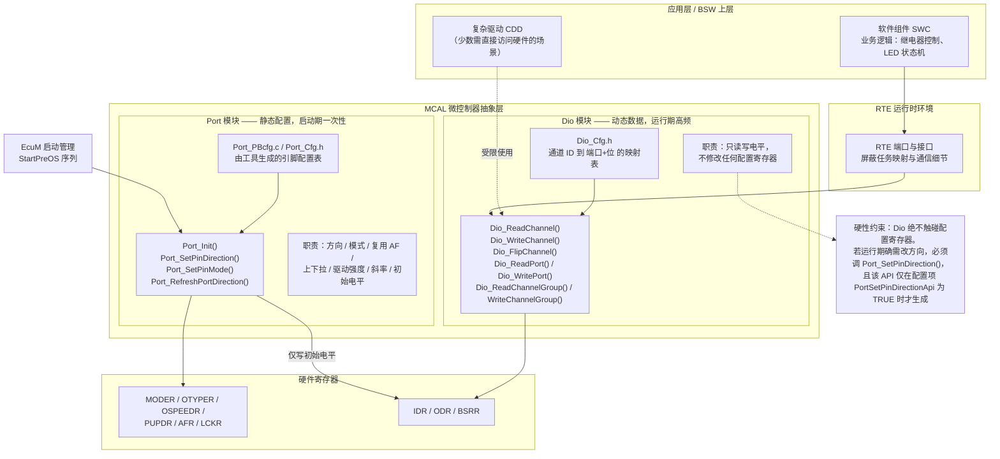

### 9.2 Port 模块配置项清单（EB tresos / DaVinci Configurator）

Port 模块的配置在 EB tresos 里位于 `Port` 容器下，核心是一个 `PortContainer`（对应一个物理端口，如 PORTA）下挂若干 `PortPin` 子容器（对应每个引脚）。下面这张表列出实际项目中最常用的配置项及其映射到的寄存器位域。

| 配置项（Parameter） | 所在容器 | 取值示例 | 映射的硬件位域 | 工程注意事项 |
|---|---|---|---|---|
| `PortPinId` | PortPin | 0 ~ N（全局唯一） | 无（软件 ID） | 必须全局唯一；建议按"端口号×16+引脚号"编码，便于人工核对 |
| `PortPinDirection` | PortPin | `PORT_PIN_IN` / `PORT_PIN_OUT` | MODER / PDDR | 与 `PortPinMode` 需自洽；模式为外设复用时该项常被忽略 |
| `PortPinDirectionChangeable` | PortPin | TRUE / FALSE | 无（生成期开关） | 为 FALSE 时 `Port_SetPinDirection()` 对该脚直接报 DET 错误。安全脚应设 FALSE |
| `PortPinMode` | PortPin | `PORT_PIN_MODE_DIO` / `_ADC` / `_SPI` / `_CAN` / `_PWM` | AFR + MODER / PCR.MUX | 这是复用配置的核心项，工具会据此校验引脚是否支持该外设 |
| `PortPinModeChangeable` | PortPin | TRUE / FALSE | 无（生成期开关） | 控制是否生成 `Port_SetPinMode()` 的支持代码 |
| `PortPinInitialMode` | PortPin | 同上模式枚举 | 同上 | `Port_Init()` 写入的初始模式；可与运行期模式不同（如启动先做 DIO 自检再切外设） |
| `PortPinLevelValue` | PortPin | `PORT_PIN_LEVEL_HIGH` / `_LOW` | ODR / BSRR | **仅对输出脚有效**。决定上电后第一个确定电平，安全关键项 |
| `PortPinInputPull` / `PortPinPullUpDown` | PortPin | `PULL_UP` / `PULL_DOWN` / `NO_PULL` | PUPDR / PCR.PE+PS | 未用脚与按键脚的必配项；漏配导致浮空漏电 |
| `PortPinOutputMode` / `PortPinOutputType` | PortPin | `PUSH_PULL` / `OPEN_DRAIN` | OTYPER / 硬件等效位 | I²C 引脚必须开漏；部分芯片该项由外设模式自动决定 |
| `PortPinSlewRate` / `PortPinOutputSpeed` | PortPin | `LOW` / `MEDIUM` / `HIGH` / `VERY_HIGH` | OSPEEDR / PCR.SRE | 默认选低速，仅高速接口才提高，EMC 相关 |
| `PortPinDriveStrength` | PortPin | `LOW` / `HIGH` | 驱动强度位 / PCR.DSE | 长走线或容性负载才用 HIGH，注意总电流预算 |
| `PortPinFilterEnable` | PortPin | TRUE / FALSE | 数字滤波使能 / PCR.PFE | 抑制窄毛刺，但引入固有延迟 |
| `PortPinLock` / `PortPinConfigLock` | PortPin | TRUE / FALSE | LCKR | 安全相关脚建议开启，`Port_Init()` 末尾自动执行锁键序列 |
| `PortNumberOfPortPins` | PortContainer | 整数 | 无 | 工具自动统计，用于生成配置表长度 |
| `PortDevErrorDetect` | PortGeneral | TRUE / FALSE | 无 | 开发期开启（参数校验 + DET 上报），量产版通常关闭以节省 Flash 与执行时间 |
| `PortVersionInfoApi` | PortGeneral | TRUE / FALSE | 无 | 是否生成 `Port_GetVersionInfo()` |
| `PortSetPinDirectionApi` | PortGeneral | TRUE / FALSE | 无 | 全局开关，FALSE 则完全不生成该 API |
| `PortSetPinModeApi` | PortGeneral | TRUE / FALSE | 无 | 同上 |

### 9.3 Dio 模块配置项清单

Dio 的配置比 Port 简单得多，因为它只做"命名与分组"——把物理引脚映射成逻辑通道 ID，供上层引用。

| 配置项（Parameter） | 所在容器 | 取值示例 | 说明 |
|---|---|---|---|
| `DioChannelId` | DioChannel | 0 ~ N | 逻辑通道 ID，`Dio_WriteChannel()` 的第一个入参 |
| `DioPortId` | DioPort | 0=PORTA, 1=PORTB… | 物理端口编号 |
| `DioChannelBitPosition` | DioChannel | 0 ~ 15 | 该通道在端口内的位偏移 |
| `DioChannelGroupIdentification` | DioChannelGroup | 字符串名 | 通道组名，用于一次读写多个相邻位（如 4 位 BCD 拨码开关） |
| `DioPortMask` | DioChannelGroup | 0x00F0 等 | 组掩码，指明本组包含端口内哪几位 |
| `DioPortOffset` | DioChannelGroup | 4 | 组的最低位偏移，用于读写时自动移位对齐 |
| `DioDevErrorDetect` | DioGeneral | TRUE / FALSE | 参数校验与 DET 上报开关，量产关闭 |
| `DioFlipChannelApi` | DioGeneral | TRUE / FALSE | 是否生成 `Dio_FlipChannel()`（硬件无原子翻转时该 API 开销更大） |
| `DioMaskedWritePortApi` | DioGeneral | TRUE / FALSE | 是否生成 `Dio_MaskedWritePort()`（按掩码写，底层正是 BSRR 语义） |
| `DioVersionInfoApi` | DioGeneral | TRUE / FALSE | 是否生成版本查询接口 |

**一个必须理解的约束是：`DioChannelId` 引用的引脚，必须在 Port 配置中被设为 `PORT_PIN_MODE_DIO`。** 如果某个引脚在 Port 里被配成了 `PORT_PIN_MODE_SPI`，却又在 Dio 里定义了通道并被应用调用，结果是 `Dio_WriteChannel()` 写了 ODR 但 pad 上根本没有反应（因为输出 MUX 选的是 SPI 而不是 GPIO）。这个错误不会有任何报错，只会表现为"写了没用"。成熟的配置工具会在生成时做交叉校验并报警告，但笔者见过不少工具版本漏掉这个检查的情况——**评审时必须人工核对 Port 与 Dio 的引脚清单是否一致**。

### 9.4 从配置到运行：完整调用路径

下面这张图展示从工程师在 GUI 里点选，到最终 pad 电平变化的完整链路。理解这条链路，才能在"配了但不生效"时知道该去哪一环找问题。

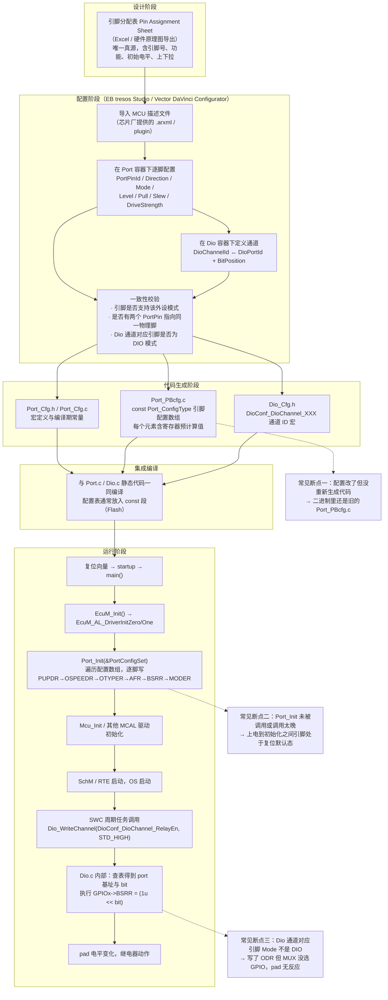

### 9.5 生成代码长什么样

理解生成代码的结构，能让你在调试时直接对着 `Port_PBcfg.c` 核对配置，而不必反复回到 GUI。典型的生成结果形如：

```c
/* ============================================================
 *  Port_PBcfg.c —— 由配置工具自动生成，请勿手工修改
 *  每个引脚一条记录，寄存器值已在生成期预计算好，
 *  Port_Init() 运行期只需搬运，不做位运算，速度极快
 * ============================================================ */

/* 单个引脚的配置记录（简化示意，实际厂商实现字段更多） */
typedef struct {
    uint32 PortBaseAddr;      /* GPIOA_BASE 等 */
    uint8  PinNumber;         /* 0 ~ 15 */
    uint8  PinDirection;      /* PORT_PIN_IN / PORT_PIN_OUT */
    uint8  PinMode;           /* 复用编号，DIO 时为特殊值 */
    uint8  PinLevel;          /* 初始电平 STD_HIGH / STD_LOW */
    uint8  PinPull;           /* NO_PULL / PULL_UP / PULL_DOWN */
    uint8  PinOutputType;     /* PUSH_PULL / OPEN_DRAIN */
    uint8  PinSpeed;          /* 斜率等级 */
    boolean DirChangeable;    /* 是否允许运行期改方向 */
    boolean ConfigLock;       /* 是否在 Port_Init 末尾锁定 */
} Port_PinConfigType;

/* 配置数组放在 const 段，链接到 Flash，不占 RAM */
static const Port_PinConfigType Port_PinCfgList[PORT_NUM_PINS] =
{
    /* --- PA4：SPI1 片选，DIO 输出，推挽，初始高（未选中） --- */
    { GPIOA_BASE, 4U, PORT_PIN_OUT, PORT_PIN_MODE_DIO, STD_HIGH,
      PORT_NO_PULL, PORT_PUSH_PULL, PORT_SPEED_LOW,  FALSE, FALSE },

    /* --- PA9：USART1_TX，复用 AF7，推挽，高速 --- */
    { GPIOA_BASE, 9U, PORT_PIN_OUT, PORT_PIN_MODE_UART_AF7, STD_LOW,
      PORT_NO_PULL, PORT_PUSH_PULL, PORT_SPEED_HIGH, FALSE, FALSE },

    /* --- PB6：I2C1_SCL，复用 AF4，必须开漏，外部 4.7k 上拉 --- */
    { GPIOB_BASE, 6U, PORT_PIN_OUT, PORT_PIN_MODE_I2C_AF4, STD_HIGH,
      PORT_NO_PULL, PORT_OPEN_DRAIN, PORT_SPEED_MEDIUM, FALSE, FALSE },

    /* --- PC13：充电枪检测，输入上拉，方向不可变 --- */
    { GPIOC_BASE, 13U, PORT_PIN_IN, PORT_PIN_MODE_DIO, STD_LOW,
      PORT_PULL_UP, PORT_PUSH_PULL, PORT_SPEED_LOW,  FALSE, FALSE },

    /* --- PC0：主继电器使能，安全关键，初始低，配置锁定 --- */
    { GPIOC_BASE, 0U, PORT_PIN_OUT, PORT_PIN_MODE_DIO, STD_LOW,
      PORT_PULL_DOWN, PORT_PUSH_PULL, PORT_SPEED_LOW, FALSE, TRUE  },
};

const Port_ConfigType PortConfigSet = {
    PORT_NUM_PINS,
    &Port_PinCfgList[0]
};

/* ============================================================
 *  Port.c 中 Port_Init 的核心循环（简化示意）
 *  注意它严格遵守本文 3.4 节推导的配置顺序
 * ============================================================ */
void Port_Init(const Port_ConfigType *ConfigPtr)
{
#if (PORT_DEV_ERROR_DETECT == STD_ON)
    if (ConfigPtr == NULL_PTR) {
        Det_ReportError(PORT_MODULE_ID, 0U, PORT_INIT_SID, PORT_E_INIT_FAILED);
        return;
    }
#endif

    for (uint16 i = 0U; i < ConfigPtr->NumPins; i++) {
        const Port_PinConfigType *p = &ConfigPtr->PinCfg[i];
        GPIO_TypeDef *g = (GPIO_TypeDef *)p->PortBaseAddr;

        /* 顺序：电气属性 → 复用 → 初始电平 → 模式（最后激活） */
        FIELD2_SET(g->PUPDR,   p->PinNumber, p->PinPull);
        FIELD2_SET(g->OSPEEDR, p->PinNumber, p->PinSpeed);

        if (p->PinOutputType == PORT_OPEN_DRAIN) {
            g->OTYPER |=  (1UL << p->PinNumber);
        } else {
            g->OTYPER &= ~(1UL << p->PinNumber);
        }

        if (p->PinMode != PORT_PIN_MODE_DIO) {
            uint32 idx   = p->PinNumber >> 3U;
            uint32 shift = (p->PinNumber & 0x7U) * 4U;
            uint32 t = g->AFR[idx];
            t &= ~(0xFUL << shift);
            t |=  ((uint32)PORT_AF_OF(p->PinMode) << shift);
            g->AFR[idx] = t;
        }

        if (p->PinDirection == PORT_PIN_OUT) {
            /* 用 BSRR 写初始电平，避免读-改-写 */
            g->BSRR = (p->PinLevel == STD_HIGH)
                    ? (1UL << p->PinNumber)
                    : (1UL << (p->PinNumber + 16U));
        }

        /* 最后写 MODER，引脚正式生效 */
        FIELD2_SET(g->MODER, p->PinNumber, PORT_MODE_TO_MODER(p));
    }

    /* 全部配置完成后，统一执行需要锁定的引脚 */
    Port_LockConfiguredPins(ConfigPtr);

    Port_InitStatus = PORT_INITIALIZED;
}

/* ============================================================
 *  Dio.c —— 运行期高频调用，实现被刻意做得极薄
 * ============================================================ */
void Dio_WriteChannel(Dio_ChannelType ChannelId, Dio_LevelType Level)
{
#if (DIO_DEV_ERROR_DETECT == STD_ON)
    if (ChannelId >= DIO_NUM_CHANNELS) {
        Det_ReportError(DIO_MODULE_ID, 0U, DIO_WRITECHANNEL_SID,
                        DIO_E_PARAM_INVALID_CHANNEL_ID);
        return;
    }
#endif
    /* 查表 → 一次 BSRR 写。整个函数在 -O2 下通常只有 4~6 条指令 */
    const Dio_ChannelCfgType *c = &Dio_ChannelCfgList[ChannelId];
    GPIO_TypeDef *g = (GPIO_TypeDef *)c->PortBase;

    g->BSRR = (Level == STD_HIGH)
            ? (1UL << c->BitPos)
            : (1UL << (c->BitPos + 16U));
}

Dio_LevelType Dio_ReadChannel(Dio_ChannelType ChannelId)
{
    const Dio_ChannelCfgType *c = &Dio_ChannelCfgList[ChannelId];
    const GPIO_TypeDef *g = (const GPIO_TypeDef *)c->PortBase;

    /* 读 IDR：反映 pad 真实电平，而非期望输出值 */
    return (((g->IDR >> c->BitPos) & 1UL) != 0UL) ? STD_HIGH : STD_LOW;
}

/* ---------- 应用层调用示例（经 RTE） ---------- */
void RelayControl_MainFunction(void)
{
    if (BatteryState_IsSafeToClose()) {
        Dio_WriteChannel(DioConf_DioChannel_MainRelayEn, STD_HIGH);
    } else {
        Dio_WriteChannel(DioConf_DioChannel_MainRelayEn, STD_LOW);
    }

    /* 读回诊断：继电器辅助触点反馈，验证实际动作与指令是否一致 */
    Dio_LevelType fb = Dio_ReadChannel(DioConf_DioChannel_MainRelayFb);
    if (fb != ExpectedFeedbackLevel()) {
        Dem_SetEventStatus(DemConf_DemEventParameter_RelayStuck,
                           DEM_EVENT_STATUS_PREFAILED);
    }
}
```

从这段生成代码可以看出几个 AUTOSAR 的设计智慧：

**一是"配置前移"。** 所有位运算与查表尽可能在生成期完成，运行期的 `Dio_WriteChannel()` 只剩一次数组索引加一次寄存器写。这对需要在 1 ms 任务里操作几十个 IO 的场景至关重要。

**二是"DET 可裁剪"。** 参数校验代码被 `#if (DIO_DEV_ERROR_DETECT == STD_ON)` 包裹，开发期打开帮你抓错误，量产期关闭省 Flash 与 CPU。这比"要么完全没检查、要么永远带着检查"的做法优雅得多。

**三是"底层严格遵守原子性"。** 注意 `Dio_WriteChannel()` 用的是 BSRR 而非 ODR——这不是巧合，AUTOSAR 规范明确要求 Dio 的通道级写操作**不得影响同端口其他通道**（DIO112 等需求条目），在有 BSRR 的硬件上，唯一正确的实现就是 BSRR。如果某个 MCU 硬件没有原子置位寄存器，MCAL 实现必须自己加临界区保护——这时 `Dio_WriteChannel()` 就会变慢很多，是选型时值得留意的点。

### 9.6 MCAL 层的引脚复用约束

MCAL 架构对引脚复用施加了几条硬性约束，理解它们能避免大量集成期的返工：

**约束一：一个物理引脚在 Port 配置中只能出现一次。** 工具会做唯一性校验。如果你需要"启动时先当 DIO 做自检、之后切成 SPI"，正确做法不是配两条记录，而是配一条 `PortPinInitialMode=DIO`，并在初始化后调用 `Port_SetPinMode()` 切换（前提是 `PortPinModeChangeable=TRUE`）。

**约束二：外设驱动不负责配引脚。** 这是最容易被违反的一条。很多工程师习惯于"在 Spi_Init() 里顺手把 SCK/MOSI 配好"，但 AUTOSAR 明确规定 **Spi/Can/Adc 等驱动只配置外设自身寄存器，引脚归 Port 管**。如果你在 Spi 驱动里私自改了 AFR，`Port_RefreshPortDirection()` 或后续的 Port 操作可能把它覆盖回去，产生极难定位的间歇故障。

**约束三：`Port_SetPinMode()` 的运行期切换有严格的安全窗口。** 切换模式的瞬间，pad 会经历一个短暂的过渡态。如果该脚连着有源电路（比如正在通信的总线），这个过渡可能产生一次错误的边沿。规范建议在切换前先把引脚设为输入或安全电平，切换后再激活。

**约束四：Dio 的 `Dio_WritePort()` 会影响整个端口。** 这个 API 直接写 ODR（全 16 位），因此**它会覆盖同端口上所有其他通道的输出**，包括被其他 SWC 控制的引脚。除非你完全独占该端口，否则应使用 `Dio_MaskedWritePort()`（按掩码写，底层用 BSRR）或逐通道写。笔者见过一次真实事故：某模块用 `Dio_WritePort()` 刷新一组 LED，顺带把同端口上的继电器使能脚清零了，表现为"点某个界面时继电器偶尔断开"。

**约束五：中断相关配置不在 Port/Dio 里。** AUTOSAR 把 GPIO 中断归到 **Icu 模块**（Input Capture Unit，负责边沿检测、脉冲测量、唤醒）或 **Gpt/Wdg** 等。如果你需要 EXTI 唤醒，配置项在 Icu 容器下（`IcuChannelId`、`IcuDefaultStartEdge`、`IcuWakeupCapability` 等），而引脚本身仍需在 Port 里配成对应模式。这个跨模块的配合关系是新手最容易漏配的地方。

| MCAL 需求 | 应该配在哪个模块 | 常见错误做法 | 后果 |
|---|---|---|---|
| 引脚方向与初始电平 | Port | 在 SWC 里调 `Port_SetPinDirection()` 临时改 | 与配置表不一致，`Port_RefreshPortDirection()` 后被改回 |
| 引脚复用为 SPI/CAN | Port（`PortPinMode`） | 在 `Spi_Init()` 里手写 AFR | Port 操作可能覆盖，间歇性通信失败 |
| 运行期读写电平 | Dio | 直接操作 `GPIOx->ODR` | 绕过抽象层，破坏可移植性与并发安全 |
| 边沿中断 / 唤醒 | Icu（引脚模式仍在 Port） | 只配 Port 不配 Icu | 中断永不触发 |
| PWM 输出 | Pwm（引脚模式仍在 Port） | 在 Port 里配成 DIO 输出 | PWM 无波形 |
| ADC 采样脚 | Adc（引脚模式配 Port 的 ANALOG） | Port 里配成 DIO 输入 | 数字缓冲未关，采样精度下降、功耗上升 |
| 上下拉 | Port | 依赖外部电阻而配置里留空 | 外部电阻虚焊即浮空，休眠电流超标 |
| 配置锁定 | Port（`PortPinLock`） | 完全不用 | 软件跑飞可改写安全脚配置 |

### 9.7 MCAL 调试实践

在 MCAL 项目里排查 GPIO 问题，笔者的顺序与裸机项目略有不同：

1. **先看生成代码而不是 GUI。** 打开 `Port_PBcfg.c`，直接找目标引脚那条记录，核对方向、模式、电平、上下拉。GUI 显示的是"你配了什么"，生成代码是"实际编译进去的是什么"——两者不一致就说明忘了重新生成。
2. **在 `Port_Init()` 返回处打断点，dump 寄存器。** 这一步能立刻区分"配置表错了"还是"Port_Init 没执行到"。
3. **确认 `Port_Init()` 在 EcuM 序列中的位置。** 它必须在任何使用 IO 的驱动之前。如果某个驱动的 `_Init()` 排在 `Port_Init()` 之前并依赖引脚，就会出现"冷启动失败、热复位正常"的诡异现象。
4. **检查 Dio 通道对应引脚的 Mode。** 前文说过，Mode 不是 DIO 时 `Dio_WriteChannel()` 会静默失效。
5. **开启 DET 并实现 `Det_ReportError()` 的日志输出。** 开发阶段这是最高效的错误发现手段，能直接告诉你"通道 ID 越界"、"模块未初始化"这类问题。

---

## 十、常见坑汇总表

把工程里最高频的 GPIO 事故整理成一张速查表，调试时对照排查：

| 序号 | 常见坑 | 现象/后果 | 根因 | 对策 |
|------|--------|-----------|------|------|
| 1 | 未使能端口时钟 | 寄存器读回全 0，配置完全不生效 | RCC 门控未开 | 配置前使能时钟并做 dummy read |
| 2 | 未用引脚浮空 | 休眠电流超标、误进中断 | 浮空脚成天线 + CMOS 输入缓冲半导通 | 未用脚配模拟模式或确定上下拉 |
| 3 | 推挽输出"线与" | 短路大电流、IO 烧毁 | 两个推挽一高一低直接对冲 | 总线型信号必须用开漏 + 上拉 |
| 4 | 复用 AF 配错/漏配 | UART/SPI/PWM 全失联 | MODER 设了复用但 AFR 没选或选错 | 查引脚复用表，MODER + AFR 双配 |
| 5 | 一脚被两处配置 | 后配置覆盖先配置，先者静默失效 | 各模块自行调用初始化 | 引脚分配表唯一真源；Port 集中配置 |
| 6 | 开漏忘接上拉 | 总线失效/锁死、读不到高 | 输出 1 时高阻，无外部上拉 | 必接合适阻值的外部上拉电阻 |
| 7 | 读-改-写 ODR 翻位 | 并发下丢更新、偶发异常 | 三步操作非原子，被抢占 | 一律用 BSRR / PSOR / PCOR / PTOR |
| 8 | 中断标志不清 | 反复进中断、MCU 卡死 | 未清 PR，或共享线漏清某位 | 快照 PR 后逐位清；先清后处理 |
| 9 | ISR 里 `PR = 0xFFFF` | 偶发丢失其他线的新事件 | 一把清空把刚到的新边沿也抹掉 | 只清快照中为 1 的位 |
| 10 | EXTI 未配 EXTICR | 中断永远不来 | 未把引脚映射到对应 EXTI line | 先配 SYSCFG EXTICR 再使能 IMR |
| 11 | 使能中断前未清 PR | 上电瞬间立刻误触发一次 | 配置期间累积的历史边沿 | 使能 IMR 前先写 1 清 PR |
| 12 | 电平不兼容 | 过压损坏 / 高电平不够高 | 3.3V↔5V 直连、非 tolerant 输入过压 | 电平转换；确认 tolerant 仅对输入有效 |
| 13 | 输出驱动能力不足 | IO 过热、负载不动作、V_OL 抬高 | 直驱继电器/大 LED，超 source/sink 限值 | 加 MOSFET/驱动 IC，IO 只发信号 |
| 14 | 斜率全拉满 | EMC 辐射超标、长线振铃 | 不必要时选了 VERY_HIGH | 按信号需求选最低够用的速度档 |
| 15 | 配置顺序颠倒 | pad 上出现几十 ns 错误电平毛刺 | 先写 MODER 再配 OTYPER/ODR | 电气属性 → 初始电平 → MODER 最后 |
| 16 | 休眠态 IO 处理不当 | 下电漏电、无法唤醒 | 进低功耗前未固定 IO 状态，或误把唤醒脚设成模拟 | 统一处理未用脚，保留唤醒脚配置 |
| 17 | PUPDR 写成 11 | 未定义行为 | 使用了保留组合 | 枚举里就不提供该值 |
| 18 | 复用了调试脚 | 烧录后再也连不上调试器 | SWDIO/SWCLK 被配成 GPIO | 评审阶段列入禁用清单；留复位抢连接手段 |
| 19 | MCAL：Dio 通道引脚非 DIO 模式 | `Dio_WriteChannel()` 写了没反应 | Port 里配成了外设复用 | 交叉核对 Port 与 Dio 引脚清单 |
| 20 | MCAL：用 `Dio_WritePort()` | 覆盖同端口其他通道输出 | 该 API 写整个 ODR | 改用 `Dio_MaskedWritePort()` 或逐通道写 |
| 21 | MCAL：外设驱动私改 AFR | 间歇性通信失败 | 违反 Port 模块职责边界 | 引脚配置一律回归 Port 模块 |
| 22 | 安全脚上电窗口无确定电平 | 上电瞬间继电器误动作 | 复位默认浮空，`Port_Init()` 前无人管 | 片外加确定的上下拉电阻 |

---

## 十一、BMS 场景纵览：GPIO 是安全链路的"开关"

回到开篇的整车场景。在 BMS 与整车控制器里，GPIO 虽是"数字量简单件"，却处处卡着安全与功耗的咽喉：

- **唤醒源**：钥匙信号（KL15）、充电枪插入检测（CC/CP 辅助信号）——典型 GPIO 边沿中断唤醒，把 MCU 从 Stop/Standby 拉起。唤醒延迟需按 9.x 节的方法拆解核算，否则用户体验与诊断时序不达标。这类脚在 MCAL 里需要 Port（模式+上拉）与 Icu（边沿+唤醒能力）双模块配合。
- **高压互锁 HVIL 检测**：高压回路的低压互锁线，断开即表示高压连接器松脱，必须在规定时间内断高压。常走 GPIO 输入 + 周期采样去抖。该脚**绝不能浮空**——浮空可能误报"回路断开"导致整车无谓断高压（可靠性问题），也可能因噪声漏报导致真实危险被忽略（安全问题）。工程实践是内部上拉 + 外部确定的分压网络 + 20～40 ms 软件去抖，并做"卡滞检测"（长期不变化也是一种故障）。
- **主/预充继电器使能**：高可靠输出脚，必须满足三重保障——片外下拉电阻钉死上电窗口电平、`Port_Init()` 初始电平为 LOW、`PortPinLock` 锁定配置防跑飞改写。同时配继电器辅助触点反馈脚做闭环诊断（指令 vs 实际），异常上报 Dem。
- **SPI 片选 CS 控制**：配置 CAN 收发器、外部 AFE 芯片时，CS 用 GPIO 精确控制建立/保持时间。注意 CS 必须在 Port 里配成 DIO 输出且初始高（未选中），而不是配成 SPI 的硬件 NSS——多数场景手动控制 CS 更灵活。
- **状态指示 LED / 故障灯**：推挽输出驱动，注意限流电阻计算与总电流预算，斜率选最低档降 EMI。
- **看门狗喂狗脚**：部分外部看门狗（SBC 内置）需要 MCU 用 GPIO 输出方波喂狗。这个脚的失效模式很特殊——**如果配置错误导致它一直翻转（比如被 PWM 复用误驱动），看门狗就永远不会触发复位，等于失去保护**。这类"沉默失效"必须在 FMEA 里显式覆盖。

任何一条安全相关链路都经不起悬空、误配、抖动。GPIO 的工程价值，不在于它"多复杂"，而在于它"多基础"——基础到一旦出错，整条链就断在最容易被人忽略的地方。

---

## 十二、面试高频要点精选（30 道）

下面精选 30 道 GPIO 面试题，附要点提示，用于自检与备考。建议不仅背结论，更要能画出内部结构框图或波形。

**基础电路与模式**

1. **推挽和开漏的区别？**
   推挽有上下两个 MOS，能主动拉高也能主动拉低，驱动强但不能线与；开漏只有下拉管，输出 1 时高阻、靠外部上拉变高，允许多设备线与（I²C/SMBus），也便于单向电平转换。

2. **为什么输入脚不能悬空？**
   浮空脚易受干扰误触发、成为天线引入噪声，且 CMOS 输入缓冲在阈值附近两管半导通会产生几十到几百 μA 的直流通路。未用脚应配模拟模式或确定的上下拉。

3. **模拟模式做了什么？为什么它最省电？**
   闭合模拟开关直连 ADC 前端，同时关断数字输入缓冲（IE=0）与输出驱动。关缓冲消除了半导通电流，也避免数字噪声串入模拟路径。

4. **施密特触发器的作用？**
   引入迟滞窗口（V<sub>T+</sub> ≠ V<sub>T−</sub>），抑制阈值附近的反复翻转，把缓慢或带毛刺的边沿整形为干净的数字沿。

5. **上下拉电阻阻值通常多大？能当电源用吗？**
   内部上下拉典型 30～50 kΩ 且偏差很大，极弱，只能固定空闲电平；驱动 LED、长线、I²C 总线必须用外部电阻。

**结构与复用**

6. **画一下 GPIO IP 的内部结构。**
   pad + ESD 钳位 → 上下拉网络 → 输入缓冲（施密特）→ 同步器 → 数字滤波 → IDR / EXTI / 外设输入；ODR / 外设输出 → IOMUX → 输出驱动级（推挽或开漏）→ pad；另有模拟开关旁路、LCKR 锁定逻辑，全部挂在由 RCC 门控的总线时钟域。

7. **复用（AF/IOMUX）是干什么的？怎么配？**
   一个物理 pin 可映射到多个片上外设，由 AFR 选择。STM32 需 MODER 设为复用（10）+ AFR 选编号，缺一不可；S32K 只需 PCR.MUX 一个字段。

8. **两个模块都想用同一个引脚会怎样？怎么根治？**
   后执行的配置覆盖先执行的，先者静默失效。根治靠引脚分配表唯一真源 + Port 模块集中初始化，而非各驱动自行配置。

9. **为什么不使能时钟就配不了 GPIO？**
   寄存器组在 RCC 门控的时钟域内，无时钟则总线写入不被锁存、读回全 0，且没有任何错误提示。

10. **复位后引脚默认是什么状态？可以依赖它吗？**
    多数是浮空输入，但调试脚（SWDIO/SWCLK）通常默认已是复用带上下拉。不能依赖——安全相关脚必须在片外加确定的上下拉，钉死上电到 `Port_Init()` 之间的窗口。

**中断**

11. **边沿触发和电平触发怎么选？**
    边沿适合"事件"（计数、唤醒），一次跳变一次请求；电平适合"持续状态"，但必须消除外部源或先屏蔽 IMR，否则反复重入把 MCU 钉死。

12. **为什么 EXTI 中断不来？给出排查顺序。**
    ①SYSCFG 时钟未开或 EXTICR 未映射；②RTSR/FTSR 都没使能；③IMR 未解屏蔽；④NVIC 未使能或被 BASEPRI 屏蔽；⑤引脚模式不对（配成了模拟）。用 SWIER 软件触发做二分定位。

13. **共享中断线（EXTI9_5 / EXTI15_10）要注意什么？**
    ISR 里必须快照 PR、逐位判定并逐位清；不能用 `PR = 0xFFFF` 一把清空，否则会抹掉处理期间新到的其他线事件。

14. **使能中断前为什么要先清 PR？**
    PR 的置位发生在 IMR 屏蔽之前，配置期间的边沿也会被记录。不先清就会在使能瞬间立刻误触发一次。

15. **中断模式和事件模式的区别？**
    中断经 IMR 送 NVIC 进 ISR；事件经 EMR 直接触发硬件动作（唤醒内核、触发 DMA/TIM）而不进 ISR。纯唤醒场景用事件更省电、更简单。

16. **唤醒延迟由哪几部分组成？主要瓶颈在哪？**
    边沿检测（<1 μs）+ 时钟恢复（HSI 几 μs / HSE+PLL 几百 μs 到 ms）+ 向量取指压栈（十几个周期）+ RTOS 调度。瓶颈几乎总在时钟恢复，优化方向是唤醒后先用 HSI 处理关键动作。

**原子性与并发**

17. **为什么用 BSRR 而不是"读 ODR 改一位再写回"？**
    ODR 的位修改是读-改-写三步、非原子，抢占会导致其他位的更新丢失；BSRR 把"改"下沉到硬件，一次总线写即完成 set/reset，不读旧值故无竞态。

18. **BSRR 同一位的 BS 和 BR 都写 1 会怎样？**
    硬件规定置位优先（BS 优先级高于 BR），结果是该位被置 1。

19. **配置寄存器（MODER/PUPDR/AFR）能用 BSRR 规避竞态吗？**
    不能，它们是多位域且没有 set/clear 别名。运行期修改必须用关中断临界区或互斥量保护。更好的做法是所有配置在启动期一次性完成、运行期不改。

20. **ODR 读到的和 pad 实际电平一定一样吗？**
    不一定。若外部强行拉低，ODR 读到的仍是你想输出的 1，pad 实际是 0。要知真实电平必须读 IDR——这个差异正好可以用来做输出短路诊断。

21. **输入同步器带来什么软件可见的影响？**
    IDR 相对 pad 有 1～2 个总线周期延迟。"写输出后立刻读回验证"的代码必须插入足够延时，否则读到旧值。

**电气与工程**

22. **驱动能力 source 和 sink 有何不同？为什么 LED 常用灌电流接法？**
    source 是输出高时供电流，sink 是输出低时吸电流。同面积下 PMOS 导通电阻大于 NMOS，故 sink 能力通常强于 source，LED 用"IO 拉低点亮"更可靠。

23. **5V-tolerant 是什么意思？有哪些限制？**
    指该输入脚耐压可达 5.5V（即使 V<sub>DD</sub>=3.3V），可直接接收 5V 信号。限制是：不能输出 5V；模拟模式下 tolerant 通常失效；部分芯片要求 V<sub>DD</sub> 已上电才有效。

24. **注入电流和闩锁效应是怎么回事？**
    pad 电压超出 V<sub>DD</sub>+0.3V 或低于 GND−0.3V 时 ESD 钳位二极管正向导通，形成注入电流。轻则抬高 V<sub>DD</sub> 影响 ADC 精度，重则触发寄生 PNPN 结构导通（latch-up），大电流烧毁芯片。对策是串限流电阻或用 tolerant 脚。

25. **机械按键为什么要去抖？软硬件方案各怎么选？**
    触点弹跳 5～20 ms，会产生多次假边沿。硬件用 RC（τ 大于弹跳时长）+ 施密特；软件用周期扫描 + 计数状态机（推荐，行为确定），或 EXTI 唤醒 + 多次采样表决（低功耗场景）。

**MCAL 与架构**

26. **AUTOSAR 为什么把 GPIO 拆成 Port 和 Dio？**
    职责与生命周期不同：Port 管"引脚是什么"（方向/模式/上下拉/初始电平），启动期一次性配置；Dio 管"引脚现在是几"，运行期高频读写且不碰配置寄存器。集中配置从架构上消灭复用冲突。

27. **`Dio_WriteChannel()` 写了但 pad 没反应，最可能是什么原因？**
    该引脚在 Port 配置里的 `PortPinMode` 不是 DIO，而是某个外设复用——输出 MUX 没选 GPIO，写 ODR 自然无效，且不会有任何报错。

28. **`Dio_WritePort()` 有什么风险？**
    它直接写整个 ODR，会覆盖同端口上所有其他通道的输出，包括别的 SWC 控制的引脚。应改用 `Dio_MaskedWritePort()` 或逐通道写。

29. **GPIO 中断在 MCAL 里配在哪个模块？**
    在 Icu 模块（边沿、唤醒能力），但引脚本身的模式仍需在 Port 里配。只配一边是新手最常见的漏配。

30. **`Port_Init()` 内部的配置顺序是什么？为什么？**
    电气属性（PUPDR/OSPEEDR/OTYPER）→ 复用编号（AFR）→ 初始电平（BSRR）→ 最后 MODER。因为 MODER 一切换输出驱动级立即生效，顺序反了会在 pad 上产生错误电平毛刺。

---

## 十三、结语

GPIO 是嵌入式系统里最"朴素"的外设，却也是把电平标准、上下拉、驱动能力、复用映射、中断、原子性、低功耗保持态全部暴露给工程师的"裸接口"。它的坑，不在高深，而在细节：一个浮空的使能脚、一次非原子的读改写、一个忘配的 EXTICR、一颗缺失的上拉电阻、一处 Port 与 Dio 不一致的模式配置，都可能让一辆整车的电量悄悄流光，或让一条安全链路悄然失效。

写完这一万余字，笔者想把整篇文章压缩成一条纵向的认知链，作为读者带走的东西：

**向下看结构。** 记住那张 IP 框图——pad、ESD 钳位、上下拉网络、施密特输入缓冲、同步器、输出驱动级、模拟开关、IOMUX、EXTI 边沿检测、LCKR、以及跨在门控时钟域上的寄存器组。有了这张图，任何一条"信号进不来/出不去"的故障都能做二分定位，而不必靠猜。

**向中看寄存器与代码。** 记住配置顺序的推导逻辑（电气属性 → 复用 → 初始电平 → MODER 最后），记住 BSRR 存在的唯一理由（把"改一位"从三步软件操作下沉为一次硬件写事务），记住 ISR 的两条铁律（快照 PR 后逐位清、ISR 内只置标志）。

**向上看架构。** 记住 AUTOSAR 把 GPIO 拆成 Port 与 Dio 的用意——不是为了增加复杂度，而是用"集中配置 + 极薄运行期接口"这一架构手段，从根本上消灭引脚复用冲突与并发写竞态这两类最难调试的问题。EB tresos 里那一屏配置项，每一个都对应着本文前半部分讲过的某个寄存器位域；理解了硬件，配置工具就不再是黑盒。

笔者的最后一条建议是：把"时钟使能、模式/方向、上下拉、复用映射、初始电平、中断触发与清标志、原子置清、跨电平兼容"这八件事，做成每次配置 GPIO 时的**必查清单**，贴在工位上，也写进团队的代码走查模板里。这八件事看似基础，却覆盖了 GPIO 九成五以上的线上故障根因。与其在量产后熬夜救火，不如在原理图评审、MCAL 配置评审与代码走查阶段就把它们逐项勾掉，把风险消灭在下单之前。

当这八件事内化成肌肉记忆，GPIO 就不再是"最容易翻车"的雷区，而会成为你手里最可靠、最趁手的那把开关。

> 全文完。愿每一次 `Dio_WriteChannel()`，都落在你想要的那个 pad 上。