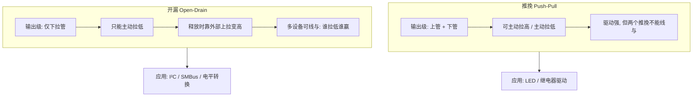
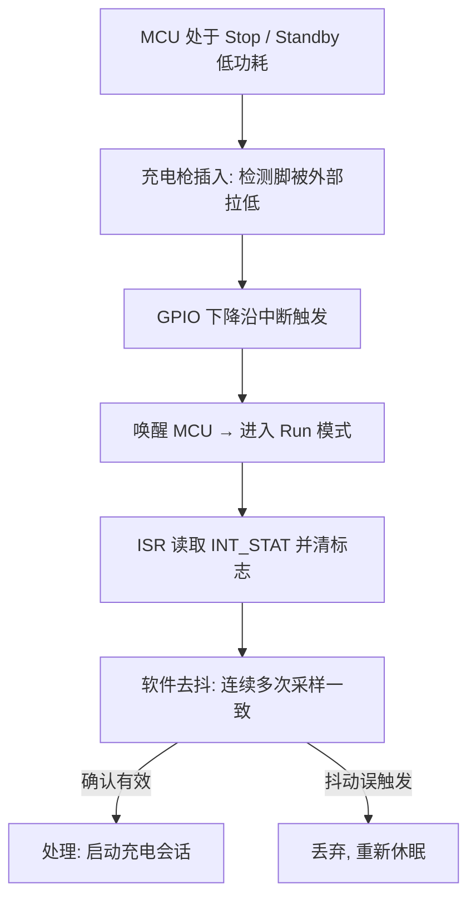

# GPIO 通用输入输出：最朴素也最易错的外设

## 一、引言：一颗没拉高的复位脚，让整车下不了电

项目量产前夜，整车休眠电流测试怎么都过不了——标称应该 μA 级的漏电极，实测多了几个 mA。硬件同事把板子翻来覆去量了一天，最后发现是一颗本该"上拉到高"的使能脚，在软件里被配成了**浮空输入**，外部上拉又虚焊，于是这个脚在高低之间反复摇摆，后面挂的电源模块一直在"半唤醒"状态悄悄吃电。

GPIO（General Purpose Input/Output，通用输入输出）大概是嵌入式里第一个被点亮的灯、第一行 `GPIO_SetPinHigh()`，却也是**最容易在细节上翻车**的外设。它太"朴素"了：不像是 CAN 那样有帧结构、有协议栈，但恰恰是这种"裸"的引脚，把电平标准、上下拉、驱动能力、复用、中断、低功耗态全部暴露给你。BMS 里，唤醒钥匙、充电枪插入检测、状态 LED、片选 CS、高压互锁 HVIL——全都是 GPIO。用错一个模式，轻则功能异常，重则休眠电流超标、安全链路失效。

## 二、核心原理：一个引脚的四种"人格"

一个物理 pin 在芯片内部其实连接着多套电路，由配置寄存器决定它此刻扮演什么角色：

1. **输入（Input）**：引脚经施密特触发器进入芯片，可读其电平。可配上拉/下拉电阻，或**浮空**（什么都不接）。
2. **输出（Output）**：由数据寄存器驱动引脚。
   - **推挽（Push-Pull）**：能主动拉高也能主动拉低，驱动能力强，两个推挽输出不能"线与"（会打架）。
   - **开漏（Open-Drain）**：只能主动拉低，释放时靠外部上拉变高。允许多设备"线与"（谁拉低谁赢），I²C、SMBus 靠它；也常用于电平转换。
3. **复用（Alternate Function, MUX/AF）**：引脚交给片上外设（UART TX、SPI SCK、定时器 PWM、ICU 输入等），由 AF 寄存器选择映射到哪个外设。
4. **模拟（Analog）**：直接连 ADC 或比较器，数字输入缓冲关闭以省电降噪。

**类比**：GPIO 像一个多功能插座，同一面墙上的孔，你插台灯是输出、插话筒是输入、插网线是复用、空着不接是浮空——插错了（模式配错）设备就不工作，甚至短路。

理解 GPIO 的关键，是意识到**"配置"和"数据"是两个独立的维度**：DIR 决定方向，OUT/IN 决定值，PU/PD 决定默认电平，MUX 决定交给哪个外设，INT 决定是否产生中断。很多bug的根源，就是只改了数据寄存器却忘了模式寄存器——比如想读一个脚却没把它设成输入，或者想让它输出却还停在复用模式。所以调试 GPIO 第一件事永远是：把该脚的"模式矩阵"在脑子里（或数据手册的引脚复用表里）完整过一遍，而不是只盯着 OUT 寄存器写 0/1。

> 推挽与开漏对比：推挽可主动驱动高/低但不能"线与"；开漏仅拉低、靠外部上拉变高，允许多设备线与（I²C / SMBus）。



### 2.1 上下拉与斜率

- **上拉/下拉**：给输入脚一个确定的默认电平，避免悬空时随噪声漂移。未用的输入脚务必配上下拉或模拟输入，否则既耗电又易误触发。
- **斜率控制（Slew Rate）**：降低输出翻转速度以减小 EMI（电磁干扰），高速信号线则需要快速边沿。

### 2.2 GPIO 中断

很多 MCU 把 GPIO 接到中断控制器：可配**边沿触发**（上升/下降/双沿，适合事件计数、唤醒）或**电平触发**（适合持续状态，但需及时清标志防反复进中断）。BMS 里充电枪插入、钥匙唤醒常走 GPIO 边沿中断。

> GPIO 边沿中断唤醒流程（以充电枪插入为例）：下降沿触发中断把 MCU 从低功耗拉起，软件去抖确认后才认定为有效事件。



## 三、寄存器位域（逐字段）与配置

### 3.1 GPIO 寄存器（以通用 IP 为例，逐字段）

| 寄存器 | 字段 | 含义 |
|--------|------|------|
| DIR | 每 bit 1/0 | 方向：1=输出，0=输入 |
| OUT | 每 bit | 输出值 |
| IN | 每 bit | 输入采样值（只读） |
| PU/PD | 每 bit | 上拉/下拉使能 |
| MUX/AF | 每 pin 2~4bit | 复用功能选择（接 UART/SPI/定时器…） |
| INT_EN | 每 bit | 中断使能 |
| INT_TYPE/POL | 每 bit | 边沿（上升/下降/双）或电平触发 |
| INT_STAT | 每 bit | 中断挂起标志（写1清） |

### 3.2 配置代码片段（伪代码）

```c
/* BMS：充电枪插入检测（输入上拉 + 下降沿中断唤醒） */
GPIO_Init(CHARGER_DETECT_PIN,
    .dir  = INPUT,
    .pull = PULL_UP,            // 插入时外部把脚拉低
    .mode = IRQ_FALLING_EDGE);  // 下降沿触发唤醒
GPIO_SetCallback(CHARGER_DETECT_PIN, OnChargerPlugged);

/* 片选 CS：推挽输出，默认高（未选中） */
GPIO_Init(SPI_CS_PIN, .dir = OUTPUT, .out = HIGH, .mode = PUSH_PULL);

/* 状态 LED：推挽输出，限速斜率降低 EMI */
GPIO_Init(LED_PIN, .dir = OUTPUT, .mode = PUSH_PULL, .slew = SLOW);

/* 把某脚复用为定时器 PWM（AF 选择） */
GPIO_SetAF(PWM_PIN, AF_TIM1_CH1);

/* 休眠前：把所有未用脚设成模拟输入或带确定的上下拉，杜绝漏电 */
for (pin in UNUSED_PINS)
    GPIO_Init(pin, .dir = INPUT, .mode = ANALOG);
```

## 四、BMS 场景：GPIO 是安全链路的"开关"

- **唤醒源**：钥匙信号、充电枪插入——典型 GPIO 边沿中断唤醒，从 Stop/Standby 拉起 MCU。唤醒延迟（尤其国产替代料）需软件补偿。
- **高压互锁 HVIL 检测**：高压回路的低压互锁线，断开即表示高压连接器松脱，必须立即断高压。常走 GPIO 输入 + 定时 polling 或中断。
- **片选 CS 控制**：SPI 配置 CAN 收发器（如 TJA1145 类）、外部 ADC 时，CS 用 GPIO 精确控制建立/保持，避免选不中从设备。
- **状态指示 LED / 故障灯**：推挽输出驱动，注意限流与斜率。
- **保险丝/继电器使能**：高可靠输出脚，常配硬件互锁，防止软件跑飞误动作。

这些脚看似"数字量简单"，但**任何一条安全相关链路都经不起悬空、误配、抖动**。例如 HVIL 检测脚如果浮空，可能误报"回路断开"→ 整车无谓断高压；也可能因噪声漏报→ 真实危险被忽略。

### 4.1 电平标准与 5V-tolerant：跨电压的暗礁

BMS 板上有 3.3V MCU、5V 收发器、1.8V 内核，还有电池侧的各种电平。GPIO 直接跨电平连接会出问题：5V 输出灌进仅耐 3.3V 的 input 可能永久损坏；而 3.3V 输出去驱动需要 5V 高电平判定的输入，又可能因"高电平不够高"被当成低。规则是：输出高电平必须 ≥ 对端输入的最小 VIH，输入耐压强于对端输出最大值。**5V-tolerant 输入**指该脚能承受 5V 而芯片主电源是 3.3V——常用来直接接收 5V 信号，但方向不能反（tolerant 输入不能主动输出 5V）。跨电平务必加电平转换或选对 IO 组的供电域。

### 4.2 中断延迟与去抖：唤醒链路的实时性

BMS 唤醒常依赖 GPIO 边沿中断把 MCU 从 Stop 拉起。这里有两个坑：一是中断标志未清导致唤醒后立刻又进中断；二是机械触点（充电枪、钥匙）有弹跳，不做硬件 RC 滤波或软件去抖会误触发多次唤醒。工程上边沿唤醒 + 软件确认（连续若干次采样一致才认定有效）是稳妥组合。另一方面，GPIO 中断若走共享中断线（多个 pin 共用一个 IRQ），ISR 里必须读 `INT_STAT` 判断是哪个脚、并分别清标志，否则会漏处理或重复处理。

## 五、常见坑与调试手段

1. **未用引脚悬空 → 耗电/误触发**：浮空脚随噪声摆动，既增加功耗又可能误进中断。对策：未用脚配上下拉或模拟输入；休眠前统一处理。调试用电流表查各路漏电点。
2. **推挽输出"线与"冲突**：两个推挽同时驱动一根线（一个拉高一个拉低）→ 短路大电流。总线型信号（I²C）必须用开漏 + 上拉。
3. **复用（AF）配错 → 外设收不到信号**：引脚没映射到正确外设，UART/SPI/PWM 全部失联。查芯片数据手册的 AF 映射表，对照 `MUX/AF` 寄存器。
4. **输出驱动能力不足**：直接驱动继电器/LED 电流太大烧 IO。对策：加三极管/驱动缓冲。
5. **GPIO 中断标志不清 → 反复进中断**：电平触发尤其容易，标志必须及时（写1清）且处理快；边沿触发要防抖（硬件滤波或软件去抖）。
6. **休眠态 IO 配置不当 → 下电复位/漏电**：见引言的使能脚案例。下电前协调 SBC 时序，确保 MCU 先稳定进低功耗再让 SBC 断电。

## 六、面试高频要点

- **推挽 vs 开漏区别？** → 推挽主动驱动高低、驱动强但不能线与；开漏只拉低需上拉，用于线与（I²C）与电平转换。
- **输入脚为什么不能悬空？** → 浮空易受干扰误触发、增加功耗；未用脚应配上下拉或模拟输入。
- **复用（MUX/AF）是干什么的？** → 一个物理 pin 可映射多个外设，靠 AF 寄存器选择；配错则外设收不到信号。
- **GPIO 中断边沿触发和电平触发怎么选？** → 边沿适合事件计数/唤醒，电平适合持续状态但需及时清标志防反复触发。
- **BMS 里 GPIO 用在哪里？** → 唤醒源（钥匙/充电枪）、HVIL 互锁检测、片选 CS、状态 LED、保险丝/继电器使能。
