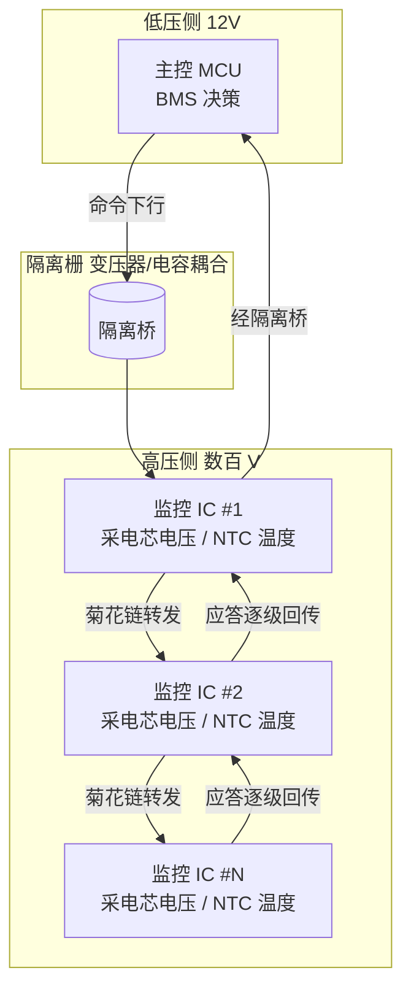

# DSI3 电芯监控菊花链：BMS 与几百节电芯的对话

## 一、引言：主控 MCU 怎么"看"到每一节电芯

一辆电动车的电池包，往往是几十到上百节电芯串并联而成。问题是：这些电芯工作在**几百伏的高压侧**，而负责决策的主控 MCU 在**12V/低压侧**。MCU 既不能"直接摸到"高压，又必须精确知道每一节的电压、每一片 NTC 的温度——差几毫伏就可能误判一致性、误触发断高压，甚至掩盖热失控风险。

于是行业给出一套经典解法：**电芯监控 IC（Cell Monitoring IC）就近贴在电芯旁采集，再通过隔离菊花链（daisy-chain）把数据逐级上报给主控。** 主流标准有两支——ADI 的 isoSPI（隔离 SPI over 变压器），以及本文主角 **DSI3（Distributed System Interface 3）**。某 BMS 主控 MCU 通过如 NXP 收发器/监控 IC 组成的 DSI3 链，就能"看见"整包每一节电芯。这条链路的可靠性，直接决定了 BMS 的眼睛会不会"瞎"。

## 二、核心原理：隔离 + 菊花链

### 2.1 为什么要隔离

电芯侧是高压（数百 V）、强电流、强磁场；控制侧 MCU 是低压娇贵逻辑。两者**必须电气隔离**，否则高压会顺着通信线灌进 MCU 烧毁整板，且共模电压远超芯片耐受。隔离靠**变压器耦合**或**电容耦合**：信号以差模方式跨过隔离栅，高压侧的共模噪声被挡在另一侧。

**类比**：把电芯监控 IC 想象成"高压区派出的驻场记者"，主控 MCU 是"低压区的总编辑"。两者不能直接握手（会触电），于是通过一座隔离桥（变压器/电容）只传纸条（差分信号），高压和低压在桥两边各玩各的。

### 2.2 菊花链怎么"传话"

菊花链（daisy-chain）是多级监控 IC **串联**：MCU 在链的一端发出命令帧，第一级 IC 收到后处理自己的部分，再把剩余命令转发给下一级；末级应答后再沿原路**逐级回传**，直到 MCU 收到整包数据。每级 IC 有独立地址，只响应发给自己、或广播给自己的命令。

**拓扑**：除了线性的"主—从—从—…—从"链，为防单点失效，常采用**环形（ring）拓扑**或**故障旁路**设计：某一级损坏时，链路可从另一侧绕回，不至于整链瘫痪。

> BMS 电芯监控隔离菊花链拓扑：高压侧每片监控 IC 就近采集电芯电压 / NTC 温度，数据经隔离栅逐级串联上报低压侧主控 MCU。



> 抗单点失效的环形拓扑：末级可经另一侧绕回主控，某一级损坏时链路旁路而不瘫痪整链（功能安全 FFI）。


### 2.3 为什么抗干扰这么重要

电池包内大电流切换、继电器动作、电机逆变都会产生强电磁噪声。差分隔离物理层 + CRC 校验，是为了在"脏环境"里保证**控制指令和数据不错**。一位错若让"某节过压"被误判，可能误断高压；若让"均衡启动"被误发，可能过充——所以这一层的容错不是锦上添花，是安全底线。

## 三、帧格式 / 协议字段（逐字段详解）

DSI3 是厂商标准，物理层与位级编码各异，但**逻辑帧结构**高度一致：

**一帧结构（概念）**
```
Sync(同步头) | ADDR(芯片地址) | CMD(命令/寄存器) | DATA(载荷) | CRC | (环回/响应)
```

| 字段 | 含义 |
|------|------|
| **Sync** | 帧同步头，界定一帧开始；在隔离变压器/电容耦合下完成编码同步（常配合曼彻斯特或特定编码保证每位有跳变、易锁相） |
| **ADDR** | 目标监控 IC 地址；菊花链中命令逐级转发/过滤，非目标级透明转发 |
| **CMD** | 操作码：读单体电压 / 读温度 / 启动或停止均衡 / 读故障状态（过压、欠压、过温） |
| **DATA** | 读出值（电压/温度，常 14~16bit 精度）或写入的均衡参数（占空比/时长） |
| **CRC** | 循环冗余校验，强电磁环境必备，杜绝误控电芯 |
| **响应/环回** | 末端 IC 响应沿链回传；环形拓扑可双向回传 |

### 3.1 通信机制要点

- **命令/响应机制**：MCU 下发"读电压/温度""均衡控制"命令，各 IC 应答。
- **均衡控制命令**：支持主动/被动均衡启停，参数含均衡通道与目标能量。
- **故障状态上报**：过压/欠压/温度异常等，主控据此进入保护。
- **CRC 关键性**：电池包噪声大，一位错可能误判→误断高压，CRC 是最后一道闸。

### 3.2 配置/交互代码片段（伪代码，面向驱动层）

```c
/* 通过 DSI3 链路读取第 N 片监控 IC 的全部电芯电压 */
Dsi3_Frame cmd = {
    .sync = DSI3_SYNC,
    .addr = N,                       // 目标 IC 地址
    .cmd  = CMD_READ_CELL_VOLTAGE,  // 读电压
    .data = 0,
    .crc  = CalcCrc(...),
};
Dsi3_Transmit(&cmd);                // MCU 发往链路
Dsi3_WaitResponse(&resp);           // 沿链回传，超时即告警
if (resp.crc_ok) {
    for (i = 0; i < CELLS_PER_IC; i++)
        cellVoltage[N][i] = resp.data[i]; // mV 级精度
} else {
    Fault_Raise(DSI3_CRC_ERROR, N); // 隔离故障，避免误判
}

/* 启动某节被动均衡 */
Dsi3_SendBalanceCmd(N, .cell = 3, .enable = TRUE, .duty = 0x40);
```

驱动层难点在于：**链路是逐级的，传输延迟随级数累积**；必须在超时窗口内收齐末端回传，并对每一级 CRC 校验，任何一级失败都要能定位到"第几级"，而非笼统报错。

## 四、BMS 场景：让主控"看得见每节电芯"

- **单体电压 mV 级采样**：电芯监控 IC 就近采集，精度可达 ±2mV 量级；经 DSI3 上报，主控据此做一致性分析、均衡决策、SOH 估算。
- **温度多点监测**：每片 IC 带多路 NTC 温度，覆盖电芯表面、母线、环境，热失控预警靠它。
- **均衡控制**：主控算好哪节该均衡、均衡多少，通过 DSI3 下发均衡命令；底层只负责可靠送达与状态回读。
- **故障上报**：过压/欠压/过温/开路，监控 IC 主动或在轮询时上报，主控进保护。
- **隔离价值**：低压 MCU 永不直接接触高压，安全与可靠性双赢。

**DSI3 vs isoSPI**：两者都是"隔离菊花链，解决同样问题"，区别在厂商标准与物理层细节——ADI 用变压器隔离的差分 SPI（isoSPI），NXP 等用 DSI3。选型时看电池监控 IC 平台归属。

### 4.1 时钟架构与"逐级转发"的时延预算

菊花链每级监控 IC 都要对收到的帧做"接收—识别—转发"，这引入了逐级的**处理延迟**。主控在发命令后必须等待"级数 × 单级延迟 + 回传延迟"才能收齐响应，这个时延预算要写进通信超时阈值。更微妙的是：每级 IC 内部的时钟（用于采样、编码、转发）可能与主控不完全同源，长链累积下末级时序会偏。成熟方案里，监控 IC 会在转发时做时钟重建/对齐，或采用主时钟下发的架构来约束偏差。驱动层做"最大级数压力测试"非常必要——只挂 1 级能通，挂满 12 级未必，因为噪声、时延、累积抖动都随级数放大。

### 4.2 诊断与功能安全映射

DSI3 链路本身要满足 BMS 的 ASIL 要求，手段包括：每帧 CRC + 每级地址可定位（哪一级 CRC 失败一目了然）；开路/短路/通信超时映射到具体故障码（DEM）；单级失效通过环形拓扑或旁路不拖垮整链（FFI 的通信隔离）。底层软件要把"链路健康度"作为一等公民上报——不是等到读不到电压才慌，而是 CRC 失败率、超时次数都要进诊断日志，支撑预测性维护与功能安全论证。

## 五、常见坑与调试手段

1. **隔离元件选型/layout 不当 → 通信误码**：变压器/电容的寄生参数、走线不对称会破坏差分信号。对策：严格按 IC 厂商参考设计做隔离器件选型与 PCB layout，做阻抗与对称性检查。
2. **某级故障 → 整链中断**：线性菊花链单点失效最致命。对策：用环形（ring）拓扑或故障旁路设计，单级失效可绕行。
3. **位时序/时钟偏差在长链累积 → 末级不稳**：链越长，各级时钟偏差叠加越明显。对策：选支持时钟重建/转发对齐的监控 IC，控制单链级数。
4. **强电流噪声耦合 → 误帧**：对策：屏蔽、滤波、确保 CRC 校验全覆盖，并对连续 CRC 失败做降级/隔离而非盲目重试。
5. **超时窗口设错 → 误报通信失败**：菊花链回传延迟随级数线性增长，超时阈值要按最大级数留余量。

## 六、面试高频要点

- **BMS 怎么采集上百节电芯电压？** → 电芯监控 IC 就近采集 + 隔离菊花链（DSI3/isoSPI）上报主控 MCU。
- **为什么要用隔离通信？** → 电芯侧数百 V 高压、控制侧低压，必须电气隔离保护 MCU 并抗共模干扰。
- **菊花链怎么工作？** → 命令从 MCU 发出逐级转发，末级应答再逐级回传；每级有地址，只响应自己的命令。
- **CRC 为什么在 DSI3 里关键？** → 电池包强噪声下一位错可能误判过压→误断高压，CRC 杜绝错误控制；单级失败还能定位到级。
- **DSI3 和 isoSPI 区别？** → 都是隔离菊花链、不同厂商标准（物理层/编码细节不同），本质解决同一问题。
