# DSI3 电池监测通信深度详解：从芯片 IP 到 MCAL/CDD，分布式 BMS 菊花链如何从几百节电芯里"读"出安全

> 本文是一篇面向公开技术知识库的工业级深度技术章节，目标读者为 BMS（电池管理系统）硬件、模拟前端、嵌入式软件与功能安全工程师。笔者将以工程视角，从**物理层 → 芯片 IP 内部架构 → 寄存器位域 → 链路层帧协议 → 驱动代码 → AUTOSAR MCAL/CDD 集成 → 测试验证**，完整拆解 DSI3（Distributed System Interface 3）这一开放标准在电芯监测场景下的工作原理、微架构设计取舍与落地经验。
>
> **阅读约定**：本文所有芯片框图、寄存器位域、命令编码均为**通用 IP 示意**，用于说明"这类器件一般会怎么设计、为什么这么设计"，不对应任何厂商的具体数据手册。真实项目请以所选器件的官方文档为准。凡涉及协议语义处，笔者只引用 DSI3 作为开放标准的公开特性（双线差分、主从、菊花链、命令/响应帧、测量/均衡/诊断），不臆造私有细节。

---

## 一、背景：一辆电动车为什么需要一套"会说话的采集网络"

### 1.1 电芯监测的规模问题

现代纯电动汽车的动力电池包，通常由**数十到数百节**锂离子电芯经串并联构成。以常见的 96S（96 节串联）或 128S 模组为例，标称 Pack 电压可达 350V~800V 量级，峰值更高。要让 BMS 主控 MCU 做出正确的充电、放电、均衡与热管理决策，它必须持续、精确地掌握每一节电芯的状态：

- **单体端电压**：典型范围 2.5V~4.3V，BMS 关注到**毫伏级**（±2mV~±5mV）的精度，因为一致性偏差、过充过放判定都建立在这套数据上；
- **温度分布**：每片采样板通常布置多路 NTC，覆盖电芯极柱、母线排、壳体表面与环境温度，是热失控早期预警的依据；
- **故障状态**：每节电芯的过压（OV）、欠压（UV）、过温（OT）、断线（开路）、均衡异常等，需要被实时捕获；
- **辅助量**：总压、总电流（常由独立霍尔/分流采样）、绝缘阻抗、接触器状态等。

问题在于：这些被测对象工作在**数百伏的高压侧、强电流与强磁场环境**之中，而做决策的主控 MCU 与整车主控网络（CAN/LIN/Ethernet）处在 **12V/低压、娇贵的数字逻辑域**。两者之间存在巨大的**共模电压差**与**安全隔离边界**。MCU 既不能"直接摸到"高压，又必须"看见"每一节电芯——这就是电芯监测通信要解决的核心矛盾。

### 1.2 集中式、分布式与中央式架构的演变

早期小容量电池（如电动工具、低速车）可用**集中式 BMS**：所有电芯引线汇总到一块采集板，直接用长线束连到 MCU。但电芯数一多，线束重量、成本与故障率都爆炸，且长引线引入的噪声与压降无法接受。一个 128S 的包若走集中式，仅电压采样线就要 129 根，还要考虑每根线的保险丝、RC 滤波与连接器针脚——这在物理上和成本上都难以承受。

于是行业演进到**分布式 BMS（Distributed BMS）**：把"采集"这件事下放，让**电芯监控 IC（Cell Monitoring IC / 采样 AFE）就近贴在电芯模组旁**，每片 IC 管若干节电芯（如 6、12、14、18 节不等，取决于具体器件族）。这些从节点再通过一条**隔离通信链路**把数据逐级上报给低压侧的主控。

> 笔者的一个工程比喻：主控 MCU 是"低压区的总编辑"，每片电芯监控 IC 是"高压区派出的驻场记者"。两者不能直接握手（会触电、会被高压烧毁），于是通过一座**隔离桥（变压器/电容耦合）**只传纸条（差分信号），高压与低压在桥的两边各玩各的地。

### 1.3 通信链路必须回答的三个问题

- **怎么隔离**：让高压侧的噪声与共模电压跨不过来；
- **怎么组网**：几十片上百片从节点如何被一条链路有序管理，而不是各自为政；
- **怎么保证可靠**：在电机逆变、继电器吸合、大电流切换的"脏环境"里，命令和数据不错、不丢、不误判。

DSI3 正是围绕这三个问题设计的开放标准。下面逐步展开。

### 1.4 精度、均衡与一致性：为什么"毫伏"不是吹毛求疵

很多刚接触 BMS 的工程师会疑惑：电芯电压 3.6V 上下，差个几十毫伏能有多大关系？答案是：在电池包层面，**毫伏即生命线**。

同一 Pack 内电芯存在天然离散：出厂容量、内阻、自放电率都有差异。充放电循环后，这种差异被放大——某节 SOC 略高，充电时先到达截止电压，系统被迫提前结束充电（"充不满"）；某节 SOC 略低，放电时先触底，系统被迫提前停止放电（"放不完"）。结果是整包可用容量被最弱一节"木桶短板"限制。为消除差异，BMS 要做**均衡（Balancing）**：把电量多的电芯"放掉一点"或"补给少的一点"，拉齐各节。而均衡决策的原料，正是每一节的**毫伏级电压**与**温度**。

更关键的是安全：锂离子电芯对过充、过放极其敏感。过充到约 4.3V 以上可能产气、鼓包甚至热失控；过放到 2.5V 以下可能损伤化学体系、增加内短路风险。BMS 必须在这些阈值前若干毫伏就介入。若监测链路把"正常 3.85V"误读成"4.35V"，可能误断高压继电器，整车失速；若把"4.35V"误读成"3.85V"，则漏掉真实危险。这就是为什么监测精度、链路可靠性被提到安全底线的高度。

再补一层：磷酸铁锂（LFP）电芯在 SOC 20%~80% 区间电压平台极其平坦，可能整个区间只有几十毫伏的变化。这意味着**电压分辨率不足就等于 SOC 完全不可观测**。LFP 的普及，实际上反过来推高了对采样 AFE 精度与链路数据完整性的要求——这是近年电芯监测 IC 精度指标不断内卷的根本原因之一。

### 1.5 SOH、SOE 与热失控预警：监测数据的二次价值

电芯监测采回的原始电压/温度，不只是"当下安不安全"的判断依据，更是长期健康管理的输入：

- **SOH（State of Health，健康度）**：通过容量衰减、内阻增长趋势评估电芯老化，需要长期、稳定的监测数据累积；
- **SOE/SOC（能量/电荷状态）**：安时积分依赖每节电压曲线与温度校正，监测不准则累计误差发散；
- **热失控预警**：电芯热失控前有可观测的温升加速、电压异常跌落先兆。多点温度与电压的时间序列，是早期发现"冒烟前兆"的唯一依靠。

也就是说，DSI3 链路采集的数据质量，直接决定了 BMS 从"被动保护"到"主动预测"的能力上限。这也是为什么它值得被当作核心安全链路来设计，而非普通通信总线。

### 1.6 从"通信协议"到"安全链路"的视角切换

笔者想在开篇就强调一个观念转变：**不要把电芯监测链路当成普通通信总线来设计**。普通总线（如车身 CAN）丢一帧，重发即可，代价是几毫秒延迟；电芯监测链路丢一帧或错一位，可能直接导致继电器误动作或均衡误开。因此在整个设计生命周期里，它更接近一条**带通信外观的安全链路**：

| 视角 | 普通通信总线 | 电芯监测安全链路（DSI3/isoSPI） |
|------|-------------|---------------------------------|
| 设计目标 | 吞吐、成本、易用 | 数据完整性、可诊断性、失效可定位 |
| 错误处理 | 重传即可 | 重传须幂等，连续失败必须降级隔离 |
| 时序要求 | 尽力而为 | 硬性周期（如 10Hz 全包扫描）必须保证 |
| 冗余需求 | 一般无 | 环形/旁路拓扑抗单点失效（FFI） |
| 诊断粒度 | 总线级 | **必须定位到"第几级从节点"** |
| 安全等级 | QM | 常涉及 ASIL C/D 分解 |

这张表的每一行，都会在后文对应到具体的硬件模块或软件机制。

---

## 二、标准定位：DSI3 是什么，又不是什么

### 2.1 DSI Consortium 与开放标准的意义

DSI3 全称为 **Distributed System Interface 3（第三代分布式系统接口）**，是一个由 **DSI Consortium（分布式系统接口联盟）** 推动的**开放工业标准**，其目标是在汽车分布式传感与电池监测场景里，提供一套不绑定单一芯片厂商的通信接口规范。所谓"开放"，意味着不同半导体厂商、不同模组厂可以基于同一套协议框架实现互操作的器件——这与后面要对比的 ADI 私有方案形成鲜明对照。

开放标准的价值在于：

1. **供应商可替代性**：主机厂不必被单一芯片源"锁死"，在成本谈判与保供上更有主动权；
2. **生态共建**：协议层、诊断模型、测试规范可被整个行业复用，降低重复造轮子的成本；
3. **长期可维护性**：标准文档独立于具体器件生命周期，便于跨代际平台复用软件资产。

需要澄清的是，DSI3 作为开放标准，其**物理层与编码细节在不同厂商实现上允许存在差异**，但**逻辑帧结构、命令语义、响应机制高度一致**，从而保证上层驱动与诊断逻辑的可移植性。

### 2.2 与 ADI isoSPI 的并列关系

在电芯监测隔离菊花链领域，历史上最具影响力的另一支方案是 **ADI（Analog Devices）的 isoSPI（隔离 SPI）**。它本质上是把传统 SPI 经**变压器隔离**后变成一对差分线传输，物理层被 ADI 掌握并随其监控 IC（如 LTC/ADBMS 系列）捆绑提供。

可以这样理解两者的关系：

- 它们**解决的是同一个问题**：高压侧大量电芯监测数据的隔离、可靠、低线束汇聚上报；
- 它们是**并列的两条技术路线**：一个走开放标准路线（DSI3），一个走私有生态路线（isoSPI）；
- 选型往往**取决于所选用监控 IC 平台归属**：若平台基于某开放标准器件族，则链路自然走 DSI3；若选用 ADI 监控 IC，链路则走 isoSPI。

后文会用专门章节做定量与定性对比，这里先给出定位结论：**开放 vs 私有、标准 vs 生态成熟，是两者最本质的分野**。

### 2.3 为什么"菊花链"成了主流拓扑

把 N 片从节点挂到一条总线上，本能想到的是星形或并行总线。但在电池包里，菊花链（daisy chain）胜出，原因有三：

- **线束极简**：级联只需两线（一进一出），相比每片单独走线回主控，线束重量与连接器数量大幅下降；
- **天然匹配模组物理布局**：电芯模组本就是串联堆叠，从板顺着模组排布级联，物理走线最短；
- **可旁路与可环形**：线性菊花链可加故障旁路，环形拓扑更可实现双路径回传，天然适配功能安全对"单点失效不瘫整链"的要求。

### 2.4 一个常被误解的点：DSI3 不是"车载骨干网"

笔者在评审中屡次遇到这样的提问："既然 DSI3 这么可靠，能不能拿它替代 CAN？"答案是否定的。DSI3 的设计出发点是**点对点级联的、主从严格分时的、短距离的传感汇聚链路**，它没有 CAN 那样的多主仲裁、没有全网广播的事件驱动模型、也不为跨 ECU 的松耦合通信而设计。它止步于 BMS 主控，把"高压侧几百个模拟量搬到低压侧"这一件事做到极致。**互补，而非替代**——这是理解它系统定位的关键。

---

## 三、物理层：双线差分、主从架构与隔离栅

### 3.1 双线差分（Two-wire Differential）的本质

DSI3 物理层最直观的特征是**两线差分**。与单端信号相比，差分传输的优势在于：

- **抗共模干扰**：接收端只关心两条线之间的电压差，而电池包里最强的恰恰是共模噪声（高压浮地、大电流地弹），差分接收天然抵消；
- **辐射低**：两根线电流相反，对外磁场相互抵消，降低 EMI；
- **可长距离级联**：差分信号在级间走线中衰减更可控。

在隔离实现上，主流有两种耦合方式：

1. **变压器耦合（磁耦）**：用小型脉冲变压器跨隔离栅传输差分信号，带宽高、可传能量（部分器件可借此给隔离侧供电），是 isoSPI 与多数 DSI3 实现采用的方式；
2. **电容耦合（容耦）**：用高压电容跨栅，体积小、成本低，但需配合编码保证直流平衡。

无论哪种，**隔离栅两侧的参考地是解耦的**——这正是"高低压不共地"安全要求的物理落点。

### 3.2 主从架构（Master-Slave）

DSI3 网络严格遵循**单一主节点（Master，通常是 BMS 主控 MCU 侧的桥接器件）+ 多个从节点（Slave，即电芯监控 IC）**的架构：

- **主节点**负责发起所有通信：下发命令帧、管理超时、汇聚数据、做链路诊断；
- **从节点**是被动响应方：收到属于自己的命令就执行并返回结果，收到不属于自己的命令则透明转发（在菊花链里"接力"给下一级）。

这种"主发从应"的半双工模型，避免了多从节点抢总线带来的仲裁复杂度，也简化了实时性分析：**任意时刻链路上只有一个发送者**，这对最坏响应时间（WCRT）分析极其友好，是安全论证能够闭环的前提。

### 3.3 隔离栅与"桥"的位置

需要强调：隔离不是"整条菊花链都隔离"，而是**每一个级间都有隔离栅**。也就是说，主控 MCU 到第一片 IC 之间有桥，第一片 IC 到第二片 IC 之间同样有桥——每片从节点都处于高压浮地，彼此之间也通过隔离级联。这样任何一级的高压都不会顺着通信线回溯到低压侧或前一级，隔离是**分布式、逐级的**。

从电位角度理解更直观：第 k 片从节点的"本地地"就是它所监测那组电芯的最低电位（负极），第 k+1 片的本地地则是更高的电位。相邻两片之间可能就有几十上百伏的静态电位差，末级与主控之间则可能是数百伏。**级间隔离栅承受的是相邻两级的电位差，而主控侧的第一个隔离栅承受的是整包电压**——这直接决定了不同位置隔离元件的耐压选型不能一刀切。

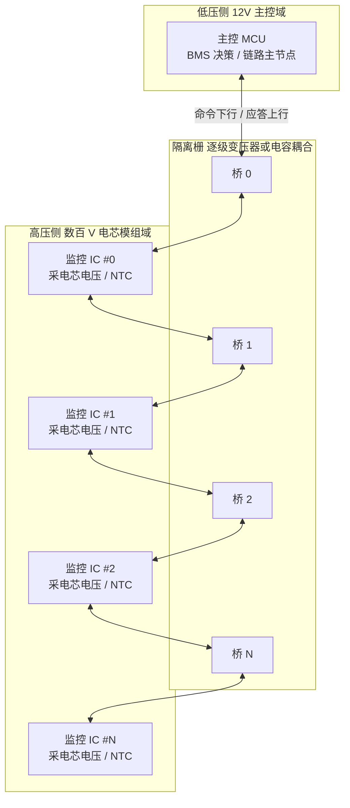

> 图示要点：每一级之间都有独立隔离栅，隔离是"逐级分布式"的，而非只在主节点一侧。

### 3.4 抗单点失效的环形与旁路拓扑

线性菊花链最大的软肋是**单点失效**：中间任一级损坏或掉线，都会导致下游所有从节点失联。为达到功能安全（如 ISO 26262 的 FFI，Freedom From Interference）要求，工程上常见两种补强：

- **环形拓扑（Ring）**：末级不"终结"，而是把回传通道绕回主节点的另一侧，形成闭环。某一级断路时，主节点可经由另一侧反向读取下游，整链不瘫；
- **故障旁路（Bypass）**：每级 IC 内置旁路开关，检测到本级的收发器异常时自动"跨过自己"，让上下游直接连通。

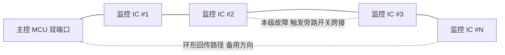

环形拓扑的隐性代价是：主节点需要**两套 PHY 端口**，软件需要维护"正向可达级数"与"反向可达级数"两张表，并在检测到断链时执行方向切换与重新枚举。笔者见过不少项目硬件上了环形、软件却从未实现反向读取——这属于典型的"付了成本没拿到收益"，评审时应重点核查是否有反向通路的故障注入测试证据。

### 3.5 信号编码与抗共模瞬变（CMTI）

隔离栅两侧的地电位差不是静态的，而是**剧烈跳变的**——比如高压继电器吸合瞬间，数百伏可能在微秒级跃迁。这种**共模瞬变（Common-Mode Transient，CMT）**会通过隔离器件的寄生电容耦合进低压侧，轻则误码，重则击穿逻辑。隔离收发器用 **CMTI（共模瞬变抗扰度）** 指标衡量承受能力，数值越高越能在"地弹"中稳住信号。

为了进一步让接收端"好锁相、好恢复时钟"，DSI3 一类链路普遍采用**自带跳变的编码**（典型如曼彻斯特编码或其演进变体）：每一位中间必有一次电平翻转，使数据流里没有长"0"或长"1"。好处有三：

- **时钟自同步**：接收端从跳变沿即可重建位时钟，无需额外时钟线；
- **直流平衡**：0/1 数量大体相等，变压器/电容不易饱和，低频漂移小；
- **边界清晰**：帧同步头与起始位靠固定跳变模式识别，抗噪声误触发。

代价是**带宽翻倍**（每个数据位占用两个符号），但在电池监测这种"速率要求不高、可靠性要求极高"的场景里，这个 trade-off 完全值得。笔者的经验是：编码方式看似底层，却直接决定了长链末级在最恶劣噪声下还能不能稳定锁相。

### 3.6 接口电平与 LVDS 性质

虽然 DSI3 各厂商实现有别，但其片间差分接口普遍是**低摆幅差分**（类似 LVDS 量级），目的是在有限功耗下获得高抗噪与高速。两线除了传数据，往往还承载**双向半双工**：同一对线在"主发"窗口传下行命令，在"从发"窗口传上行响应。这种"一线两用"进一步压缩了线束，但也要求收发方向切换（turn-around）干净利落，避免回环冲突——这正是协议里"主发从应"严格分时半双工的意义。

### 3.7 物理层参数的工程取舍表

| 物理层参数 | 取小的好处 | 取大的好处 | 工程建议 |
|-----------|-----------|-----------|---------|
| 差分摆幅 | 功耗低、EMI 小 | 抗噪裕度大、可级联更长 | 按最长链末级信噪比反推，留 6dB 以上余量 |
| 位速率 | 抗噪好、时钟恢复容易 | 全包扫描周期短 | 由安全所需扫描频率反推，不追求最高 |
| 编码冗余 | 有效带宽高 | 直流平衡、易锁相 | 隔离链路优先选自同步编码 |
| 隔离电容/变压器 | 体积小、成本低 | 耐压高、CMTI 高 | 首级按整包电压选，级间按相邻电位差选 |
| 单链最大级数 | 时延小、可靠 | 线束更省、BOM 更低 | 用最坏时延预算定上限，并留 20% 余量 |

---

## 四、芯片模块设计：DSI3 节点 IP 的内部架构

这一章是本文相较普通协议科普最核心的增量。笔者将从**数字 IP 与模拟 AFE 融合**的视角，拆解一颗典型 DSI3 从节点（电芯监控 IC）内部长什么样、各模块为什么存在、寄存器如何组织、时钟复位如何跨隔离域，以及数据在硬件上究竟沿什么路径被"汇聚"上去。

> 再次强调：以下框图与寄存器为**通用 IP 示意**，用于解释设计逻辑，不对应任何具体商用器件。

### 4.1 从节点 SoC 顶层框图

一颗 DSI3 从节点芯片，本质上是**"一个菊花链通信 PHY" + "一套电芯监测 AFE"**的深度集成。前者负责"说话"，后者负责"看"。两者之间由帧控制状态机与寄存器文件粘合。

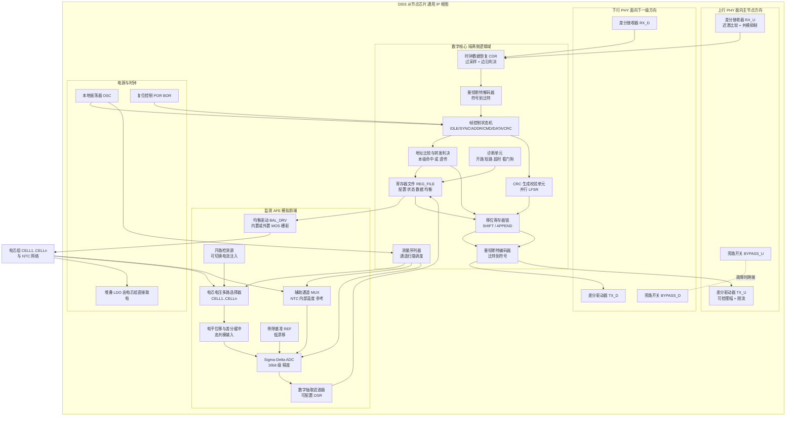

框图里有几个设计要点值得单独解释：

**（1）为什么上下行各一套 PHY？** 菊花链从节点天然是"两口器件"：一口朝主节点方向（上行），一口朝下一级（下行）。末级从节点的下行口悬空或接终端匹配。两套 PHY 独立，才能实现"收到不属于自己的帧就从另一口转发出去"的接力行为，也才能在环形拓扑里支持双向。

**（2）为什么 CDR 必须在数字域最前端？** 从节点没有与主节点共享的时钟线，位时钟必须从收到的差分波形里恢复。CDR 通常用**高倍过采样 + 多数判决**实现：以本地 OSC 的 N 倍位速率采样输入，在跳变沿附近做相位对齐，在位中心取值。这样即使本地 OSC 与主节点时基有几个百分点的偏差，也能在一帧内保持同步。

**（3）为什么移位寄存器链是"数据汇聚"的硬件本体？** 后文 4.9 节详述。简言之，菊花链回传时每级把自己的数据"追加"到帧尾，硬件上就是一条可以在转发时插入本地数据的移位链。

**（4）为什么 AFE 需要电平位移？** 电芯是串联堆叠的，第 n 节电芯的正负极相对芯片本地地可能有几十伏共模。ADC 只能处理低压差分输入，因此必须先经**高共模输入的差分缓冲/电平位移**把 CELL(n)-CELL(n-1) 的差值搬到 ADC 可接受的窗口。这个模块的共模抑制比（CMRR）与失调，直接决定了高位电芯的采样精度。

**（5）为什么 LDO 从电芯组直接取电？** 从节点处于高压浮地，无法从低压侧供电（那样就破坏隔离了）。工程上通常从它所监测的那组电芯直接取电（堆叠 LDO），这带来一个副作用：**芯片自身功耗会造成该组电芯的额外放电**，所以低功耗与休眠模式是这类 IC 的硬指标，否则长期停放会把某一组电芯"吃亏电"。

### 4.2 菊花链收发器 PHY 的微架构

PHY 是整个链路可靠性的地基。一个工程化的收发器 PHY 通常包含以下子块：

| PHY 子块 | 功能 | 设计关注点 |
|---------|------|-----------|
| 差分驱动器 TX | 把编码后符号驱动到差分线 | 摆幅可配、上升沿受控（抑制 EMI）、短路限流保护 |
| 差分接收器 RX | 把线上差分信号判决为符号 | 迟滞窗口防抖、宽共模输入范围、高 CMTI |
| 方向控制 | 半双工收发切换 | turn-around 死区时间可配，防回环自激 |
| 唤醒检测 | 低功耗下检测链路活动 | 低静态电流、抗噪声误唤醒 |
| 旁路开关 | 本级故障时跨接上下行 | 失效导向安全，默认状态需明确定义 |
| 终端匹配 | 末级阻抗端接 | 可配置使能，避免反射 |
| 线路诊断 | 开路/短路/对地短路检测 | 需能区分"无器件"与"器件不响应" |

笔者特别想强调 **turn-around 死区**。半双工链路上，主节点发完最后一位到从节点开始驱动响应之间，必须留一段两端都不驱动的空窗。这个窗口太短，会出现两端同时驱动导致的冲突电流与误码；太长，则浪费带宽、拉长全包扫描周期。真实项目里这个参数往往需要在台架上用示波器逐级实测调优——它是那种"数据手册给了典型值、但实际系统里必须自己验证"的参数。

### 4.3 帧控制状态机

帧控制状态机（Frame Control FSM）是数字核心的大脑，负责把连续的比特流切分成有语义的帧，并驱动"执行本级命令"还是"透明转发"的判决。

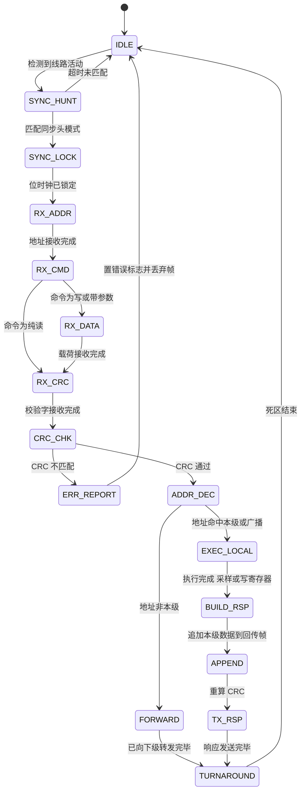

几个状态机设计的工程细节：

- **SYNC_HUNT 必须有超时**：否则一段噪声脉冲可能让状态机永久停在等同步头的状态，形成"软死机"。超时后强制回 IDLE，是最基本的鲁棒性设计。
- **CRC 检查必须在执行之前**：注意状态图中 `CRC_CHK` 在 `EXEC_LOCAL` 之前。绝不能"边收边执行"，否则一个被噪声破坏的均衡命令可能在 CRC 判定为错之前就已经把均衡 MOS 打开了。这是安全设计的硬性次序要求。
- **FORWARD 与 EXEC_LOCAL 可能并发**：广播命令下，本级既要执行也要转发。硬件上通常是"边转发边执行"，转发路径是纯组合/浅流水的，不等本级执行完成。
- **ERR_REPORT 不回传错误帧**：从节点检测到 CRC 错误时，通常做法是**丢弃并置位状态寄存器的错误标志**，而不是主动发一个错误帧回去（那会打乱严格的主从时序）。主节点通过超时感知异常，再用诊断命令去问"你刚才怎么了"。

### 4.4 编码/解码与 CRC 硬件单元

**编码器/解码器**：曼彻斯特编解码在硬件上极其简洁——编码是数据位与位时钟异或，解码是在半位周期采样两次比较。真正复杂的是**解码器的错误检测**：如果某个位周期内没有检测到应有的中间跳变，说明信号被破坏，解码器应立即置"编码违例（Coding Violation）"标志。这是比 CRC 更早、更快的一层错误检测，能在帧还没收完时就发现物理层异常。

**CRC 单元**：硬件 CRC 通常用**并行 LFSR**（线性反馈移位寄存器）实现，一个时钟周期处理 8 位或 16 位，而非逐位串行。这样 CRC 计算可以与数据接收完全并行，不引入额外延迟。设计上有两个关键点：

1. **CRC 覆盖范围必须明确定义**：一般覆盖 ADDR + CMD + DATA，不含 SYNC（SYNC 是物理层模式，不参与逻辑校验）。
2. **转发时 CRC 需重算还是透传？** 这取决于协议设计。若每级都会追加数据（数据汇聚模式），则每级必须**重算** CRC；若是纯透明转发（命令下行），则应**原样透传**，让目标级用原始 CRC 校验，这样才能检测出中间级的转发损伤。两种模式在硬件上是两条不同的数据通路，寄存器里需要有位来选择。

### 4.5 监测 AFE：电压与温度采集通路

AFE 是这颗芯片的"眼睛"。典型设计要素：

- **ADC 类型选择**：电芯电压监测几乎清一色选 **Sigma-Delta ADC**，原因是它在低速下能轻松做到 16 位以上有效精度，且内在的过采样与噪声整形对电池包这种强噪声环境天然友好。代价是转换延迟较长（需要抽取滤波器建立时间），所以不适合高速瞬态捕捉——这也是为什么电流采样通常另配独立的高速通道。
- **抽取滤波器 OSR 可配**：过采样率（OSR）越高，精度越好、噪声越低，但单通道转换时间越长。工程上通常提供 2~4 档：**快速档**用于需要高刷新率的场景（如快充中），**高精度档**用于静置下的一致性评估。这个 trade-off 会直接反映到寄存器的配置位里。
- **测量序列器（Sequencer）**：不需要 MCU 逐通道下命令，硬件序列器按预设通道掩码自动轮扫 CELL1..CELLn 与辅助通道，把结果依次写入寄存器文件的数据区。这样"一条采样命令 → 全通道结果就绪"，极大压缩了链路上的命令数量。
- **同步采样 vs 顺序扫描**：严格意义上多路复用 ADC 是顺序采样的，各通道之间存在时间差。对于快速变化的电流工况，这会造成"各节电压不在同一时刻"的偏差。高端实现会提供**采样保持阵列**或**多 ADC 并行**来逼近真同步；普通实现则通过缩短整轮扫描时间来把偏差压到可接受范围。评审时应问清楚：一轮全通道扫描的首尾时间差是多少？在最大电流变化率下这对应多少毫伏误差？
- **开路检测（Open Wire Detection）**：这是安全必需项。原理是向被测通道注入一个小电流源（或切换上下拉），若该通道接线正常，注入电流被电芯低内阻钳位，读数几乎不变；若接线开路，读数会被拉到轨附近。硬件提供"注入使能"控制位，软件做两次测量对比即可判定。**没有开路检测，一根松脱的采样线会让 BMS 读到一个看似合理却完全错误的电压。**
- **辅助温度通道**：NTC 由芯片内部提供参考电压分压，测得的是分压点电压，需要软件用 Steinhart-Hart 或查表法换算温度。芯片本身通常还带一路**内部结温传感器**，用于自身过温保护与均衡时的热管理。

### 4.6 均衡驱动模块

被动均衡（Passive Balancing）是量产主流：给需要放电的电芯并联一个电阻回路，把多余电量以热的形式耗掉。硬件上有两种实现：

- **内置 MOS**：均衡电流走芯片内部开关，外部只需一个限流电阻。优点是 BOM 省、控制简单；缺点是均衡电流受芯片散热限制，通常在几十到一两百毫安量级。
- **外置 MOS**：芯片只提供栅驱动信号，功率开关在片外。优点是均衡电流可做到数百毫安甚至安培级，热量散在 PCB 上而非芯片里；缺点是元件多、成本高。

主动均衡（Active Balancing）通过电感/电容/变压器把电量从高 SOC 电芯搬运到低 SOC 电芯，效率高但拓扑复杂、成本高，目前多见于对续航与寿命极致敏感的场景。从监测 IC 的角度，主动均衡通常只需要它提供**测量数据与开关时序控制**，能量搬运由独立的均衡拓扑板承担。

均衡模块在硬件上必须有的几个安全特性：

| 安全特性 | 目的 | 典型硬件实现 |
|---------|------|-------------|
| 均衡看门狗超时 | 防止 MCU 死机后均衡永久开启把电芯放空 | 硬件计时器到期自动关断所有均衡通道 |
| 相邻通道互斥 | 防止相邻两路同时导通造成异常电流路径 | 硬件强制奇偶交替或禁止相邻同开 |
| 过温自动降额 | 均衡发热叠加电芯发热导致过温 | 内部结温超阈值自动关断均衡 |
| 均衡时测量抑制 | 均衡电流在采样线上产生压降造成读数偏低 | 硬件在采样窗口自动暂停均衡 |
| 状态可回读 | 软件必须能确认命令真的生效 | 独立的均衡状态寄存器，反映实际开关状态而非命令值 |

最后一条尤其重要：**命令寄存器与状态寄存器必须分开**。软件写入"要开通道 3"，读回的应该是硬件实际的"通道 3 已开"，而不是简单回读刚写进去的值。否则一旦驱动电路损坏，软件将永远发现不了。

### 4.7 寄存器映射与位域设计

下面给出一份**通用示意性寄存器映射**，用于说明这类器件一般会怎么组织寄存器空间。命名与地址均为示意。

| 地址 | 寄存器名 | 属性 | 功能概述 |
|------|---------|------|---------|
| 0x00 | `DEV_ID` | RO | 器件标识、版本号、通道数能力 |
| 0x01 | `NODE_ADDR` | RW | 本级链路地址，枚举阶段写入 |
| 0x02 | `FRM_CTRL` | RW | 帧引擎控制：使能、模式、转发策略、CRC 策略 |
| 0x03 | `FRM_STAT` | RO/W1C | 帧引擎状态：CRC 错、编码违例、超时、溢出 |
| 0x04 | `PHY_CFG` | RW | PHY 配置：摆幅、死区、终端匹配、旁路 |
| 0x05 | `MEAS_CFG` | RW | 测量配置：OSR、通道掩码、连续/单次、开路注入 |
| 0x06 | `MEAS_STAT` | RO | 测量状态：忙、就绪、序列完成、通道错误 |
| 0x10~0x1F | `CELL_V[0..15]` | RO | 各通道电芯电压结果，含数据有效位 |
| 0x20~0x27 | `AUX_V[0..7]` | RO | 辅助通道（NTC、内部温度、参考自检） |
| 0x28 | `PACK_V` | RO | 本级所辖电芯组总压（独立通道，用于交叉校验） |
| 0x30 | `BAL_CTRL` | RW | 均衡通道使能位图 |
| 0x31 | `BAL_STAT` | RO | 均衡实际状态位图（硬件反馈，非命令回读） |
| 0x32 | `BAL_TMR` | RW | 均衡看门狗超时值 |
| 0x33 | `BAL_DUTY` | RW | 均衡 PWM 占空比（用于热控降额） |
| 0x40 | `OV_TH` | RW | 过压阈值 |
| 0x41 | `UV_TH` | RW | 欠压阈值 |
| 0x42 | `OT_TH` | RW | 过温阈值 |
| 0x43 | `FLT_STAT` | RO/W1C | 故障状态：OV/UV/OT/开路/参考失效 |
| 0x50 | `DIAG_CTRL` | RW | 诊断控制：自检启动、注入测试、环回 |
| 0x51 | `DIAG_RES` | RO | 自检结果 |
| 0x60 | `LINK_CNT` | RO/W1C | 链路健康计数：CRC 错计数、超时计数 |

接下来用位域图展开两个最关键的寄存器。

**（1）`FRM_CTRL` 帧控制寄存器（16 位，通用示意）**

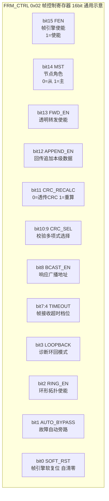

| 位域 | 名称 | 说明与设计意图 |
|------|------|---------------|
| `[15]` | FEN | 总使能。复位默认为 0，需软件显式使能，避免上电瞬间误响应线上噪声 |
| `[14]` | MST | 同一 IP 可配置为主/从，便于芯片复用；从节点复位后必须为从模式 |
| `[13]` | FWD_EN | 关闭后本级成为链路终点，用于枚举时"逐级点亮"确定实际级数 |
| `[12]` | APPEND_EN | 数据汇聚的开关：使能后回传帧经过本级时追加本级数据 |
| `[11]` | CRC_RECALC | 对应 4.4 节讨论的两种通路：透传用于命令下行完整性检测，重算用于汇聚回传 |
| `[10:9]` | CRC_SEL | 多项式可选，便于兼容不同上层协议配置 |
| `[8]` | BCAST_EN | 允许某些级临时退出广播（如故障级被隔离时） |
| `[7:4]` | TIMEOUT | 帧内字节间超时档位，防止半截帧把状态机挂死 |
| `[3]` | LOOPBACK | 内部环回，不驱动线路，用于开机自检验证数字通路 |
| `[2]` | RING_EN | 环形拓扑下允许反向接收 |
| `[1]` | AUTO_BYPASS | 检测到本级 PHY 故障时自动跨接，保下游可达 |
| `[0]` | SOFT_RST | 仅复位帧引擎，不影响测量结果与均衡状态，便于通信故障恢复而不打断监测 |

**（2）`MEAS_CFG` 与 `CELL_V[n]` 位域（通用示意）**

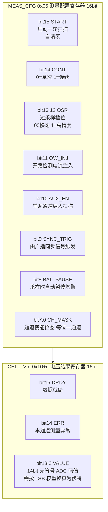

这里有两个值得深挖的设计决策：

**数据就绪位（DRDY）为什么必须放在数据寄存器本身，而不是单独的状态寄存器？** 因为菊花链读取是分级、异步的。如果 DRDY 在别处，软件读到一组数据后无法确定这组数据是不是本轮的——可能读到的是上一轮的陈旧值。把有效位与数据放在同一个寄存器字里，保证**读到数据的同时就知道它是否新鲜**，这是防止"陈旧数据被当成实时数据"这一隐蔽失效的关键设计。笔者见过因为这一点没做好，导致电芯已经过压但 BMS 一直在用上一轮的正常值做决策的案例。

**为什么保留 ERR 位而不是简单返回 0？** 返回 0 在数值上是"0V"，会被上层误判为严重欠压，触发不必要的保护动作。用显式的错误位标记"这个通道的读数不可信"，让上层能区分"真的低压"与"读不到"。这是**失效表征清晰化**的典型体现。

### 4.8 时钟、复位与隔离域划分

从节点芯片内部至少存在三个域，理解它们的边界对调试至关重要：

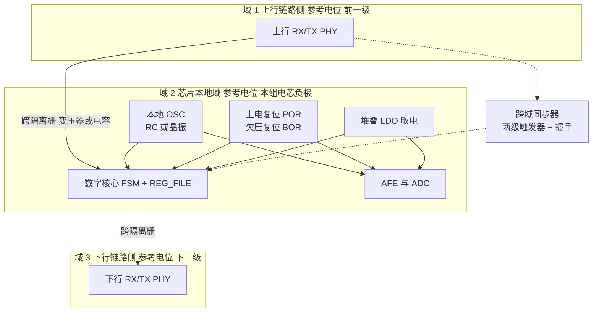

设计要点：

- **每颗芯片有自己的本地时钟**，链路上没有独立时钟线，所有位同步靠 CDR 从数据流恢复。这意味着**本地 OSC 的频率精度直接决定了单帧最大长度**：偏差越大，一帧还没收完相位就漂出采样窗口。工程上常见约束是全温度全寿命偏差控制在百分之几以内，并通过帧长限制留足余量。
- **复位不是全局一刀切**。至少要区分：上电复位（POR，全芯片）、欠压复位（BOR，电源跌落保护）、帧引擎软复位（仅通信部分）、测量序列器复位。为什么要分？因为通信出问题时，我们希望**修复通信而不丢失监测状态与均衡状态**；反之亦然。粗粒度复位会让一次通信抖动导致整包监测数据清零，反而降低可用性。
- **跨域信号必须过同步器**。链路侧接收到的信号与本地时钟异步，直接进入 FSM 会有亚稳态风险。标准做法是两级触发器同步（单比特）或异步 FIFO/握手（多比特总线）。这是数字设计的基本功，但在带隔离栅的系统里尤其容易被忽略——因为隔离器件本身的传播延迟抖动会加剧这个问题。
- **上电时序**：从节点由所监测的电芯组供电，因此**只要电池在，从节点就有电**——它可能比低压侧的主控 MCU 更早上电。协议与软件必须能处理"主控刚上电时，从节点已经在某个未知状态"的场景，这正是初始化流程要以"广播软复位 + 重新枚举"开头的原因。

### 4.9 菊花链数据汇聚的硬件路径

这是全文最值得画清楚的一张图：**数据在硬件上究竟是怎么"滚雪球"式汇聚上来的**。

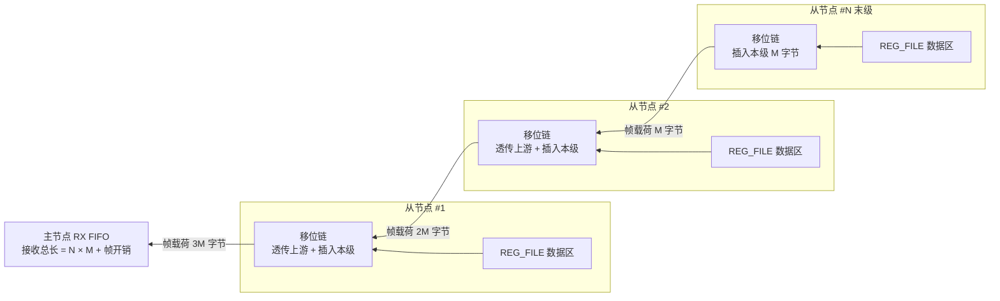

理解这张图的三个关键：

1. **载荷长度沿回传方向单调增长**。第 k 级输出的载荷长度 = 上游累积长度 + 本级贡献。因此主节点接收 FIFO 的深度必须按**最大级数 × 单级载荷**设计，这是一个硬件资源约束，直接限制了单链最大级数。
2. **每级都要重算 CRC**。因为载荷变了，原 CRC 失效。这意味着**中间级的 CRC 只能保护"从该级到主节点"这一段**，无法端到端保护末级数据。要做端到端保护，需要在应用层再加一层校验（比如每级数据自带一个短校验码）。这是一个常被忽视的设计权衡，笔者建议在 ASIL 较高的项目里明确评估：**逐段 CRC 是否足以支撑你的安全论证？**
3. **延迟也是累积的**。每级的移位链有固定的流水延迟（若干位时间），N 级就是 N 倍。这就是为什么"挂 1 级能通、挂满级数不通"——不只是噪声，还有硬件流水延迟的线性累加。

与之对应，命令下行的硬件路径则简单得多：

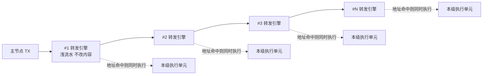

下行是"广播式浅流水转发"，不改帧内容、不重算 CRC，因此延迟小、CRC 可端到端保护命令完整性。**上行汇聚与下行广播在硬件上是两条特性完全不同的通路**，这正是 `FRM_CTRL` 需要 `CRC_RECALC` 与 `APPEND_EN` 两个独立控制位的原因。

### 4.10 主节点 IP 与 MCU 的接口

主节点侧的 IP（常以独立桥接芯片或集成在 BMS SoC 内的形式存在）与从节点共享大部分 PHY 与帧引擎设计，差异在于：

- **多了主机接口**：通常是 SPI（有时是并行接口或直接总线映射），供 MCU 读写其寄存器与 FIFO；
- **多了序列调度器**：可以按预设脚本自动执行"广播采样 → 等待 → 触发汇聚 → 收齐"整个流程，减少 MCU 中断次数；
- **多了 DMA 友好的 FIFO**：整包数据量大（几百字节），必须支持 DMA 搬运，否则 MCU 中断开销吃不消；
- **多了精确定时器**：用于生成周期性采样触发，保证扫描周期的抖动可控；
- **没有 AFE**：主节点处在低压侧，不需要采电芯。

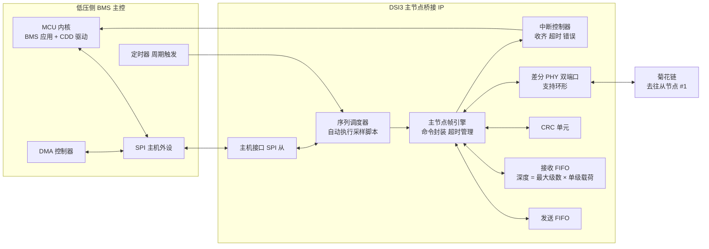

**为什么强调序列调度器？** 假设一个 12 级链、10Hz 全包扫描，若每级都靠 MCU 逐条发命令、逐条等中断，一秒就是上百次中断，还要严格控制抖动。有了硬件序列调度器，MCU 只需配置一次脚本（广播采样 → 延时 → 汇聚读取），之后由定时器自动触发，MCU 只在"整包收齐"或"出错"时被中断一次。这对 BMS 主控的 CPU 负载与实时性是决定性的改善。

---

## 五、帧结构与命令协议：主发从应的"对话语法"

### 5.1 逻辑帧结构（通用模型）

DSI3 在不同厂商实现上位级编码各异，但**逻辑帧（Logical Frame）**高度一致。一帧可抽象为：

```
┌──────┬──────┬──────┬────────┬──────┬──────────┐
│ SYNC │ ADDR │ CMD  │ DATA   │ CRC  │ 响应/环回 │
└──────┴──────┴──────┴────────┴──────┴──────────┘
 同步头  地址   命令   载荷    校验   末端回传
```

| 字段 | 位宽（概念） | 含义与作用 |
|------|------------|-----------|
| **SYNC** | 若干位 | 帧同步头，界定一帧的开始。在隔离变压器/电容耦合下，常配合曼彻斯特或特定编码，保证每位都有跳变、便于接收端锁相与时钟恢复 |
| **ADDR** | 若干位 | 目标从节点地址。菊花链中命令逐级转发，非目标级"透明转发"，只有地址匹配者才执行 |
| **CMD** | 若干位 | 操作码：读单体电压 / 读温度 / 启动或停止均衡 / 读故障状态（过压、欠压、过温）等 |
| **DATA** | 可变 | 读出值（电压/温度，常 14~16bit 精度）或写入参数（均衡占空比/时长），也可能是配置字 |
| **CRC** | 若干位 | 循环冗余校验，强电磁环境下杜绝"误控电芯"的最后一道闸 |
| **响应/环回** | — | 末端 IC 响应沿链回传；环形拓扑可双向回传 |

### 5.2 命令类型表

DSI3 的命令语义可归类为以下几族。下表给出一个**通用命令类型模型**（不绑定具体寄存器）：

| 命令族 | 典型命令 | 方向 | 说明 | 安全等级考量 |
|--------|---------|------|------|-------------|
| **配置类** | 写地址、设采样周期、设阈值（OV/UV/OT）、使能诊断 | 主→从 | 初始化从节点，建立链路与安全工作窗口 | 配置后必须回读确认 |
| **测量类** | 读单体电压、读温度、读总压/辅助量 | 主→从→主 | 周期性或按需采集 | 数据须带有效位，防陈旧 |
| **均衡类** | 启动/停止被动均衡、设均衡通道与占空比、读均衡状态 | 主→从 | SOC/电压一致性调理 | **最高**，误发即能量误操作 |
| **诊断类** | 读故障标志、自检、读链路健康度、环回测试 | 主→从→主 | 支撑功能安全与预测性维护 | 需能定位到级 |
| **广播类** | 全局同步采样触发、全局复位 | 主→全部从 | 地址为广播值，所有从节点同时动作 | 广播复位须防误触发 |
| **同步类** | 主时钟下发、采样触发对齐 | 主→从 | 约束长链各级时序偏差 | 影响数据时间一致性 |

### 5.3 命令/响应时序：主发从应的半双工接力

DSI3 是典型**半双工**链路：同一对差分线上，要么主节点发、从节点收；要么从节点发、主节点收，不能同时进行。在菊花链里，一次"读末级数据"的旅程是这样的：

1. 主节点下发命令帧（下行）；
2. 第一级收到后，识别 ADDR：若不是自己，则**转发**给下一级；若是自己，则执行并准备响应；
3. 命令沿链逐级下行，直到到达 ADDR 指向的那一级（或广播到所有级）；
4. 目标级执行（采样、读寄存器、启停均衡等），生成响应帧；
5. 响应帧**沿原路逐级回传**，每经过一级都可能被该级"追加"自己的数据（见第六章数据汇聚），最终到达主节点；
6. 主节点在超时窗口内收齐并逐帧/逐级校验。

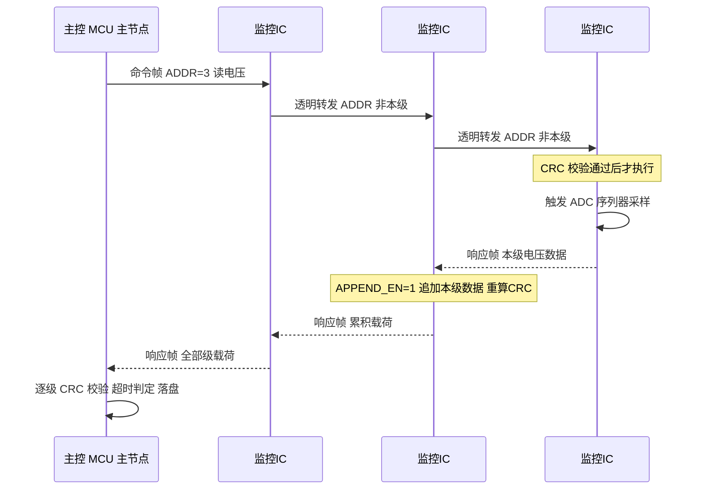

### 5.4 CRC：电池包里"不可妥协"的容错闸

为什么在 DSI3 里 CRC 被提到"安全底线"的高度？因为一位错就可能带来灾难性误判：

- 把"某节正常 3.8V"误判为"过压 4.3V" → 可能**误断高压继电器**，车辆抛锚甚至引发高压安全事件；
- 把"不要均衡"误判为"启动均衡" → 可能**过充或局部过热**；
- 把"温度正常"误判为"过温" → 误触发限功率，影响整车性能。

因此每一帧都带 CRC，且**任何一级 CRC 失败都应被定位到具体是哪一级失败**（而非笼统报"通信错"），这样才能支撑功能安全的故障定位与隔离。

工程上 CRC 的部署要点：

- **覆盖所有关键帧**：配置、测量、均衡、诊断命令一律带 CRC，不可为"省事"跳过；
- **连续失败要降级而非盲目重试**：连续 N 次 CRC 失败应进入隔离/降级逻辑，避免在主控里反复重试导致总线拥堵与误判；
- **失败率要进诊断日志**：链路健康度（CRC 失败率、超时次数）应作为一等公民上报，支撑预测性维护；
- **注意汇聚模式下 CRC 的保护边界**：如 4.9 节所述，逐级重算的 CRC 不提供端到端保护，高 ASIL 需求下应考虑应用层附加校验。

---

## 六、数据汇聚：主节点如何"读"出整包每一节电芯

### 6.1 级联与逐级"拼装"

分布式 BMS 的核心诉求是：**主节点一次操作，就能拿到整包所有电芯的数据**。在菊花链里，这不是"末级一帧带回全部"，而是**沿回传路径逐级拼装**的结果（硬件路径见 4.9）。

典型机制有两种：

- **逐节点请求-响应（Ping-Pong）**：主节点依次向 #0、#1、…、#N 发"读本节点"命令，每级回传本节点数据。实现简单，但轮询延迟随级数线性增长，且各级采样时刻不同；
- **广播采样 + 链式回传（Broadcast-then-Daisy-Return）**：主节点发一个广播"同步采样"命令，所有从节点在同一时刻采样；随后通过链路触发，各级数据像"火车车厢"一样沿链依次挂接回传，主节点一次收齐。延迟低、同步性好，是高频监测的首选。

两者的差异不只是效率，更是**数据时间一致性**：Ping-Pong 模式下，第 1 级与第 12 级的数据可能相差几十毫秒。若这期间车辆正在急加速，电流从 0 冲到几百安，两级数据对应的工况完全不同，做"各单体之和 vs 总压"的交叉校验就会莫名其妙地对不上。这是初学者最容易踩的坑之一。

### 6.2 数据一致性的交叉验证

成熟 BMS 不会只信链路数据。主节点在拿到全包矩阵后，常做**交叉验证**：

- 各单体电压之和 ≈ 高压总压采样（独立总压通道）；
- 各从节点上报的"本级组总压"（`PACK_V`）≈ 该级各单体之和（**级内自洽校验**，可定位到具体级）；
- 相邻从节点温度梯度不应出现物理上不可能的跳变；
- 开路边（某节 NTC 断线）应在诊断位被标识，而非表现为异常低温；
- 数据有效位（DRDY）与本轮序号必须匹配，防止陈旧数据混入。

这类"数据是否合理"的判断，是通信链路之外的安全冗余。笔者建议把 `PACK_V` 与级内求和的比对作为**每轮必做**的轻量校验——它计算量极小，却能第一时间发现某一级的 ADC 或数据通路异常。

### 6.3 带宽与轮询周期预算

设计链路时，工程师必须算一笔"带宽账"。假设一个 128S 电池包、每片从节点管 16 节，则需 8 片级联。若每节电压用 16bit 表示、每片还带 3 路温度，则单级回传载荷约：

```
单级载荷 ≈ 16节 × 16bit + 3路温度 × 16bit + 状态字 16bit ≈ 336 bit ≈ 42 字节
```

加上帧头、地址、CRC、响应开销（设每级 8 字节开销），8 级汇聚的总载荷约 `8 × 50 = 400 字节 = 3200 bit`；再乘以曼彻斯特编码的带宽翻倍系数，线上实际符号数约 6400。

这条链路的物理速率（由隔离接口与编码决定）固定，于是：

```
最大可持续轮询频率 = 链路速率 / (单轮符号量 + 逐级流水延迟折算)
```

若安全策略要求 100ms 内至少完成一次全包扫描（即 10Hz），则必须保证在最坏级数、最坏噪声重试下，单轮耗时 < 100ms 且有余量。笔者的经验法则是：**先定死安全所需的轮询周期，再反推所需链路速率与最大级数，而不是反过来"链路能跑多快就多快"**——安全需求应当驱动链路设计，而非被物理限制将就。

还有一个容易被忽略的预算项：**重试余量**。如果标称一轮 40ms，10Hz 周期看似绰绰有余；但一旦某轮 CRC 失败需要重试，就是 80ms；连续两次就是 120ms，直接超期。所以预算时应按"允许 N 次重试仍不超期"来定，而不是按理想一次成功。

---

## 七、时序、同步与噪声鲁棒性：高压脏环境里的硬骨头

### 7.1 逐级转发引入的处理延迟

菊花链每级从节点都要对收到的帧做"接收—识别—转发（或响应）"，这引入了**逐级处理延迟 Δt**。一次链路往返的总时延近似为：

```
T_total ≈ (下发级数 × Δt_down) + (采样/执行时间) + (回传级数 × Δt_up) + turn-around 死区 × 2
```

其中 `Δt_down` 由转发引擎的流水深度决定（通常较小），`Δt_up` 因为涉及数据追加与 CRC 重算而更大，`采样时间` 由 ADC 的 OSR 档位决定（高精度档可能是快速档的数倍）。

主控在发命令后的"等待窗口"必须大于 `T_total` 的最大可能值（挂满级数、最坏温度、最坏噪声下）。**只挂 1 级能通、挂满 12 级未必能通**，因为噪声、时延、累积抖动都随级数放大——所以驱动层必须做"最大级数压力测试"。

### 7.2 时钟偏差与时钟重建

每级从节点内部的时钟（用于采样、编码、转发）可能与主节点不完全同源。长链累积下，末级的时序会偏，表现为位时钟漂移、采样窗口错位，严重时直接误码。

成熟方案的处理手段：

- **时钟重建/转发对齐**：从节点在转发时，基于收到的位流重建本地时钟再重新编码输出，而不是简单地"模拟中继"。这样误差在每一级都被"归零"，不会逐跳累积——这是长链能稳定工作的根本原因；
- **主时钟下发架构**：由主节点统一下发时间基准或采样触发，把各级时序偏差约束在可控范围；
- **弹性采样窗口**：接收端用过采样与中间判决，容忍一定抖动。

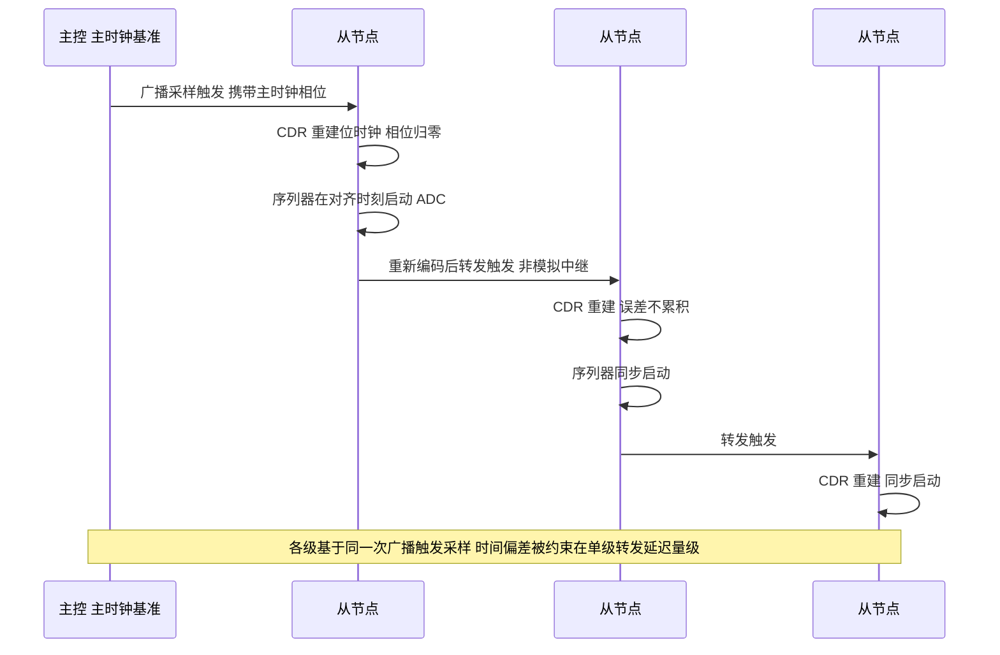

### 7.3 高压环境的噪声鲁棒性设计

电池包内的噪声来源极其丰富：电机逆变器 PWM、压缩机、继电器吸合/释放、预充电阻投切、大电流地弹。DSI3 的物理层与协议层共同抗干扰：

- **差分 + 隔离**：共模噪声在隔离栅被阻断，差模信号抗干扰；
- **编码保证跳变**：曼彻斯特或等效编码让每位都有跳变，接收端易锁相，也利于时钟恢复；
- **编码违例检测**：比 CRC 更早发现物理层异常（见 4.4）；
- **CRC + 超时 + 重传策略**：位错被 CRC 抓出，超时防死等，重传须谨慎；
- **PCB 与 layout 纪律**：隔离元件对称走线、阻抗控制、屏蔽与滤波，决定物理层成败；
- **功能安全映射**：把开路/短路/超时映射为具体 DEM 故障码，单级失效通过环形/旁路不拖垮整链（FFI 的通信隔离）。

### 7.4 接地、屏蔽与 EMC 实践

物理层的成败，七分在 layout。笔者的实践清单：

- **隔离两侧各有独立、完整的地平面**，不可让高压地"偷偷"连到低压地，否则隔离形同虚设；
- **差分走线严格等长、对称、紧耦合**，远离大电流功率走线与继电器驱动的平行长距离并行；
- **隔离器件下方禁止走其他信号线**，避免跨隔离栅的容性串扰，也避免破坏爬电距离；
- **爬电与电气间隙按最高工作电压设计**，注意首级隔离承受的是整包电压而非单级电位差；
- **屏蔽层单点接地**，高频噪声经屏蔽泄放而不在地之间制造环流；
- **接口处加共模扼流与 TVS**，吸收 ESD 与群脉冲能量；
- **采样线的 RC 滤波要对称**：不对称的 RC 会把共模噪声转成差模，直接污染毫伏级读数。

这些看似"板级细活"，却决定了 DSI3 在整车 EMC 测试（如辐射发射、抗扰度）中能否一把过。很多"通信偶发丢帧"的案子，最终根因都落在 layout 不对称或屏蔽失效上，而非协议本身。

---

## 八、驱动代码实现：从帧封装到均衡控制

本章给出一套**可读、可移植、带完整注释的 C 驱动骨架**。所有寄存器地址、命令码均为本文 4.7 节定义的通用示意值，移植到真实器件时只需替换头文件中的常量定义与底层 PHY 收发接口。

### 8.1 基础数据结构与寄存器定义

```c
/* =========================================================================
 * dsi3_types.h —— DSI3 菊花链驱动基础类型与通用寄存器定义
 * 说明：寄存器地址与命令码为通用示意，移植时按实际器件手册替换
 * ========================================================================= */
#ifndef DSI3_TYPES_H
#define DSI3_TYPES_H

#include <stdint.h>
#include <stddef.h>
#include <stdbool.h>

/* ---- 链路规模约束（由硬件 FIFO 深度与时延预算决定） ---- */
#define DSI3_MAX_NODES          16u   /* 单链最大从节点数 */
#define DSI3_CELLS_PER_NODE     16u   /* 每片从节点管理的电芯数 */
#define DSI3_AUX_PER_NODE       4u    /* 每片从节点的辅助（温度）通道数 */
#define DSI3_MAX_CELLS          (DSI3_MAX_NODES * DSI3_CELLS_PER_NODE)

/* ---- 帧字段常量 ---- */
#define DSI3_SYNC_PATTERN       0x5Au /* 同步头固定模式，需保证编码后跳变丰富 */
#define DSI3_ADDR_BROADCAST     0xFFu /* 广播地址：所有从节点均执行 */
#define DSI3_ADDR_UNASSIGNED    0x00u /* 未分配地址：枚举前的默认值 */

/* ---- 命令操作码（通用示意）---- */
typedef enum {
    /* 配置类 */
    DSI3_CMD_SOFT_RESET     = 0x01u, /* 广播软复位，枚举流程第一步 */
    DSI3_CMD_SET_ADDR       = 0x02u, /* 分配本级地址 */
    DSI3_CMD_WRITE_REG      = 0x03u, /* 通用寄存器写 */
    DSI3_CMD_READ_REG       = 0x04u, /* 通用寄存器读 */
    /* 测量类 */
    DSI3_CMD_SYNC_SAMPLE    = 0x10u, /* 广播同步采样触发 */
    DSI3_CMD_READ_CELL_V    = 0x11u, /* 读本级全部电芯电压 */
    DSI3_CMD_READ_AUX       = 0x12u, /* 读本级辅助（温度）通道 */
    DSI3_CMD_READ_PACK_V    = 0x13u, /* 读本级组总压（交叉校验用） */
    DSI3_CMD_AGGREGATE      = 0x14u, /* 触发链式汇聚回传 */
    /* 均衡类 */
    DSI3_CMD_BAL_SET        = 0x20u, /* 设置均衡通道位图 */
    DSI3_CMD_BAL_STOP       = 0x21u, /* 停止本级全部均衡 */
    DSI3_CMD_BAL_READ       = 0x22u, /* 读均衡实际状态（硬件反馈） */
    /* 诊断类 */
    DSI3_CMD_READ_FAULT     = 0x30u, /* 读故障标志寄存器 */
    DSI3_CMD_SELF_TEST      = 0x31u, /* 启动内建自检 */
    DSI3_CMD_READ_LINKCNT   = 0x32u, /* 读链路健康计数 */
    DSI3_CMD_OPENWIRE       = 0x33u  /* 开路检测（切换注入电流） */
} Dsi3_CmdType;

/* ---- 通用寄存器地址（对应正文 4.7 节映射表）---- */
#define DSI3_REG_DEV_ID         0x00u
#define DSI3_REG_NODE_ADDR      0x01u
#define DSI3_REG_FRM_CTRL       0x02u
#define DSI3_REG_FRM_STAT       0x03u
#define DSI3_REG_PHY_CFG        0x04u
#define DSI3_REG_MEAS_CFG       0x05u
#define DSI3_REG_MEAS_STAT      0x06u
#define DSI3_REG_CELL_V_BASE    0x10u
#define DSI3_REG_AUX_V_BASE     0x20u
#define DSI3_REG_PACK_V         0x28u
#define DSI3_REG_BAL_CTRL       0x30u
#define DSI3_REG_BAL_STAT       0x31u
#define DSI3_REG_BAL_TMR        0x32u
#define DSI3_REG_FLT_STAT       0x43u

/* ---- FRM_CTRL 位域（对应正文位域图）---- */
#define FRM_CTRL_FEN            (1u << 15) /* 帧引擎使能 */
#define FRM_CTRL_MST            (1u << 14) /* 1=主节点角色 */
#define FRM_CTRL_FWD_EN         (1u << 13) /* 透明转发使能 */
#define FRM_CTRL_APPEND_EN      (1u << 12) /* 回传时追加本级数据 */
#define FRM_CTRL_CRC_RECALC     (1u << 11) /* 1=重算 CRC，0=透传 */
#define FRM_CTRL_BCAST_EN       (1u <<  8) /* 响应广播地址 */
#define FRM_CTRL_LOOPBACK       (1u <<  3) /* 诊断环回 */
#define FRM_CTRL_RING_EN        (1u <<  2) /* 环形拓扑使能 */
#define FRM_CTRL_AUTO_BYPASS    (1u <<  1) /* 故障自动旁路 */
#define FRM_CTRL_SOFT_RST       (1u <<  0) /* 帧引擎软复位（自清零） */

/* ---- MEAS_CFG 位域 ---- */
#define MEAS_CFG_START          (1u << 15)
#define MEAS_CFG_CONT           (1u << 14)
#define MEAS_CFG_OSR_SHIFT      12u
#define MEAS_CFG_OSR_MASK       (3u << MEAS_CFG_OSR_SHIFT)
#define MEAS_CFG_OW_INJ         (1u << 11) /* 开路检测电流注入 */
#define MEAS_CFG_AUX_EN         (1u << 10)
#define MEAS_CFG_SYNC_TRIG      (1u <<  9)
#define MEAS_CFG_BAL_PAUSE      (1u <<  8) /* 采样时自动暂停均衡 */

/* ---- CELL_V[n] 数据字位域 ---- */
#define CELLV_DRDY              (1u << 15) /* 数据就绪：防止读到陈旧值 */
#define CELLV_ERR               (1u << 14) /* 本通道测量异常 */
#define CELLV_VALUE_MASK        0x3FFFu    /* 14bit 有效码值 */

/* ADC 码值到电压的换算权重：满量程 5V / 2^14 ≈ 305.18 uV/LSB（示意值） */
#define DSI3_CELL_LSB_UV        305u

/* ---- 链路帧结构（逻辑视图，实际线上为编码后符号流）---- */
typedef struct {
    uint8_t  sync;                 /* 同步头 */
    uint8_t  addr;                 /* 目标从节点地址 */
    uint8_t  cmd;                  /* 命令操作码 */
    uint8_t  len;                  /* 载荷字节数 */
    uint8_t  data[256];            /* 载荷缓冲（汇聚回传时可能很长） */
    uint16_t crc;                  /* 循环冗余校验 */
} Dsi3_FrameType;

/* ---- 驱动返回码：错误必须可定位、可分类 ---- */
typedef enum {
    DSI3_OK              =  0,
    DSI3_E_TIMEOUT       = -1,   /* 等待响应超时 */
    DSI3_E_CRC           = -2,   /* CRC 校验失败 */
    DSI3_E_ADDR          = -3,   /* 回传地址不匹配 */
    DSI3_E_LEN           = -4,   /* 载荷长度异常 */
    DSI3_E_STALE         = -5,   /* 数据未就绪（DRDY=0），陈旧值 */
    DSI3_E_CHANNEL       = -6,   /* 通道自身报错（ERR=1） */
    DSI3_E_CODING        = -7,   /* 物理层编码违例 */
    DSI3_E_BUSY          = -8,   /* 链路忙 */
    DSI3_E_PARAM         = -9    /* 参数非法 */
} Dsi3_ReturnType;

/* ---- 整包数据矩阵：BMS 应用层消费的最终产物 ---- */
typedef struct {
    uint16_t cellMilliVolt[DSI3_MAX_NODES][DSI3_CELLS_PER_NODE]; /* 单位 mV */
    int16_t  tempDeciDegC [DSI3_MAX_NODES][DSI3_AUX_PER_NODE];   /* 单位 0.1℃ */
    uint32_t nodePackMilliVolt[DSI3_MAX_NODES];  /* 各级组总压，用于自洽校验 */
    uint16_t cellValidMask[DSI3_MAX_NODES];      /* 每级有效通道位图 */
    uint16_t faultFlags   [DSI3_MAX_NODES];      /* 每级故障标志 */
    uint32_t scanCounter;                        /* 本轮扫描序号，防陈旧 */
    uint8_t  activeNodeCnt;                      /* 实际枚举到的级数 */
} Dsi3_PackDataType;

#endif /* DSI3_TYPES_H */
```

### 8.2 CRC 校验：表驱动实现

```c
/* =========================================================================
 * dsi3_crc.c —— CRC-16 校验（CCITT 类多项式 0x1021）
 * 设计说明：
 *   1) 采用查表法，256 项表以空间换时间，适合 MCU 侧高频调用
 *   2) 表可在初始化时生成，也可编译期常量化以省 RAM
 *   3) CRC 覆盖范围：ADDR + CMD + LEN + DATA，不含 SYNC（物理层模式）
 * ========================================================================= */
#include "dsi3_types.h"

#define DSI3_CRC_POLY   0x1021u
#define DSI3_CRC_INIT   0xFFFFu

static uint16_t s_crcTable[256];
static bool     s_crcTableReady = false;

/* 生成 CRC 查找表：每个字节值预先算好其对 CRC 的贡献 */
void Dsi3_CrcInit(void)
{
    for (uint32_t i = 0u; i < 256u; i++) {
        uint16_t crc = (uint16_t)(i << 8);
        for (uint8_t bit = 0u; bit < 8u; bit++) {
            if ((crc & 0x8000u) != 0u) {
                crc = (uint16_t)((crc << 1) ^ DSI3_CRC_POLY);
            } else {
                crc = (uint16_t)(crc << 1);
            }
        }
        s_crcTable[i] = crc;
    }
    s_crcTableReady = true;
}

/* 表驱动 CRC 计算：每字节一次查表 + 一次异或 */
uint16_t Dsi3_CrcCompute(const uint8_t *buf, size_t len)
{
    uint16_t crc = DSI3_CRC_INIT;

    if ((buf == NULL) || (!s_crcTableReady)) {
        return 0u;   /* 防御性返回，调用方需检查初始化 */
    }
    for (size_t i = 0u; i < len; i++) {
        uint8_t idx = (uint8_t)((crc >> 8) ^ buf[i]);
        crc = (uint16_t)((crc << 8) ^ s_crcTable[idx]);
    }
    return crc;
}

/* 对一个逻辑帧计算 CRC：按线上字节序拼接后计算 */
uint16_t Dsi3_FrameCrc(const Dsi3_FrameType *f)
{
    uint8_t  tmp[4 + sizeof(f->data)];
    size_t   n = 0u;

    tmp[n++] = f->addr;
    tmp[n++] = f->cmd;
    tmp[n++] = f->len;
    for (uint8_t i = 0u; i < f->len; i++) {
        tmp[n++] = f->data[i];
    }
    return Dsi3_CrcCompute(tmp, n);
}

/* 校验接收帧：返回 true 表示完整 */
bool Dsi3_FrameCrcVerify(const Dsi3_FrameType *f)
{
    return (Dsi3_FrameCrc(f) == f->crc);
}
```

### 8.3 主节点帧封装与发送

```c
/* =========================================================================
 * dsi3_master.c —— 主节点侧帧封装、发送与响应解析
 * 依赖的底层抽象（由 MCAL/CDD 提供）：
 *   Dsi3_PhySend()    —— 把编码后字节流推入主节点桥接 IP 的发送 FIFO
 *   Dsi3_PhyReceive() —— 从接收 FIFO 取回一帧，带超时
 *   Dsi3_GetTick()    —— 单调递增的毫秒时基
 * ========================================================================= */
#include "dsi3_types.h"

extern Dsi3_ReturnType Dsi3_PhySend(const uint8_t *buf, size_t len);
extern Dsi3_ReturnType Dsi3_PhyReceive(uint8_t *buf, size_t maxLen,
                                       size_t *rxLen, uint32_t timeoutMs);
extern uint32_t        Dsi3_GetTick(void);

/* ---- 帧封装：把一次操作意图打包成链路帧 ---- */
Dsi3_ReturnType Dsi3_BuildFrame(Dsi3_FrameType *f,
                                uint8_t addr,
                                Dsi3_CmdType cmd,
                                const uint8_t *payload,
                                uint8_t payloadLen)
{
    if ((f == NULL) || (payloadLen > sizeof(f->data))) {
        return DSI3_E_PARAM;
    }

    f->sync = DSI3_SYNC_PATTERN;
    f->addr = addr;
    f->cmd  = (uint8_t)cmd;
    f->len  = payloadLen;

    for (uint8_t i = 0u; i < payloadLen; i++) {
        f->data[i] = payload[i];
    }
    /* CRC 最后计算，覆盖 addr/cmd/len/data */
    f->crc = Dsi3_FrameCrc(f);
    return DSI3_OK;
}

/* ---- 序列化：逻辑帧 → 线上字节流（编码由硬件 PHY 完成）---- */
static size_t Dsi3_Serialize(const Dsi3_FrameType *f, uint8_t *out, size_t cap)
{
    size_t n = 0u;

    if (cap < (size_t)(f->len + 6u)) {
        return 0u;
    }
    out[n++] = f->sync;
    out[n++] = f->addr;
    out[n++] = f->cmd;
    out[n++] = f->len;
    for (uint8_t i = 0u; i < f->len; i++) {
        out[n++] = f->data[i];
    }
    out[n++] = (uint8_t)(f->crc >> 8);
    out[n++] = (uint8_t)(f->crc & 0xFFu);
    return n;
}

/* ---- 反序列化：线上字节流 → 逻辑帧 ---- */
static Dsi3_ReturnType Dsi3_Deserialize(const uint8_t *in, size_t len,
                                        Dsi3_FrameType *f)
{
    if (len < 6u) {
        return DSI3_E_LEN;
    }
    f->sync = in[0];
    f->addr = in[1];
    f->cmd  = in[2];
    f->len  = in[3];

    if ((size_t)(f->len + 6u) > len) {
        return DSI3_E_LEN;   /* 声明长度与实收长度不符：疑似截断 */
    }
    for (uint8_t i = 0u; i < f->len; i++) {
        f->data[i] = in[4 + i];
    }
    f->crc = (uint16_t)((in[4 + f->len] << 8) | in[5 + f->len]);
    return DSI3_OK;
}

/* ---- 一次完整的命令-响应事务 ---- */
Dsi3_ReturnType Dsi3_Transact(uint8_t addr, Dsi3_CmdType cmd,
                              const uint8_t *txPayload, uint8_t txLen,
                              Dsi3_FrameType *rxFrame, uint32_t timeoutMs)
{
    Dsi3_FrameType  txFrame;
    uint8_t         txBuf[300];
    uint8_t         rxBuf[300];
    size_t          txBytes, rxBytes;
    Dsi3_ReturnType ret;

    ret = Dsi3_BuildFrame(&txFrame, addr, cmd, txPayload, txLen);
    if (ret != DSI3_OK) {
        return ret;
    }

    txBytes = Dsi3_Serialize(&txFrame, txBuf, sizeof(txBuf));
    if (txBytes == 0u) {
        return DSI3_E_LEN;
    }

    ret = Dsi3_PhySend(txBuf, txBytes);
    if (ret != DSI3_OK) {
        return ret;
    }

    /* 广播类命令通常无响应，直接返回 */
    if ((addr == DSI3_ADDR_BROADCAST) && (rxFrame == NULL)) {
        return DSI3_OK;
    }

    ret = Dsi3_PhyReceive(rxBuf, sizeof(rxBuf), &rxBytes, timeoutMs);
    if (ret != DSI3_OK) {
        return DSI3_E_TIMEOUT;    /* 超时须能定位到目标地址，见调用方日志 */
    }

    ret = Dsi3_Deserialize(rxBuf, rxBytes, rxFrame);
    if (ret != DSI3_OK) {
        return ret;
    }

    /* 先校验 CRC，再看内容——顺序不可颠倒 */
    if (!Dsi3_FrameCrcVerify(rxFrame)) {
        return DSI3_E_CRC;
    }
    if ((addr != DSI3_ADDR_BROADCAST) && (rxFrame->addr != addr)) {
        return DSI3_E_ADDR;       /* 回传地址错乱：链路串扰或地址冲突 */
    }
    return DSI3_OK;
}
```

### 8.4 从节点响应解析与整链数据汇聚

```c
/* =========================================================================
 * dsi3_aggregate.c —— 链路枚举、广播同步采样与整包数据汇聚
 * ========================================================================= */
#include "dsi3_types.h"

extern Dsi3_ReturnType Dsi3_Transact(uint8_t addr, Dsi3_CmdType cmd,
                                     const uint8_t *txPayload, uint8_t txLen,
                                     Dsi3_FrameType *rxFrame,
                                     uint32_t timeoutMs);
extern void Dsi3_DelayUs(uint32_t us);
extern void Fault_Raise(uint16_t code, uint8_t nodeIdx);

#define DSI3_TIMEOUT_PER_STAGE_MS   2u    /* 单级往返超时基准 */
#define DSI3_SAMPLE_SETTLE_US       800u  /* ADC 序列器建立时间（按 OSR 档位） */

static Dsi3_PackDataType g_pack;

/* -------------------------------------------------------------------------
 * 链路枚举：逐级"点亮"，确定实际挂载级数并分配地址
 * 原理：初始所有从节点 FWD_EN=0（自身即链路终点），
 *       主节点给"当前终点"分配地址后再打开其转发，露出下一级。
 * ---------------------------------------------------------------------- */
Dsi3_ReturnType Dsi3_EnumerateChain(uint8_t *outNodeCnt)
{
    Dsi3_FrameType  rsp;
    uint8_t         payload[4];
    uint8_t         count = 0u;
    Dsi3_ReturnType ret;

    /* 1) 广播软复位：把所有从节点拉回已知初始态 */
    (void)Dsi3_Transact(DSI3_ADDR_BROADCAST, DSI3_CMD_SOFT_RESET,
                        NULL, 0u, NULL, DSI3_TIMEOUT_PER_STAGE_MS);
    Dsi3_DelayUs(2000u);

    for (uint8_t idx = 0u; idx < DSI3_MAX_NODES; idx++) {
        /* 2) 给"当前可见的终点"分配地址 idx+1 */
        payload[0] = (uint8_t)(idx + 1u);
        ret = Dsi3_Transact(DSI3_ADDR_UNASSIGNED, DSI3_CMD_SET_ADDR,
                            payload, 1u, &rsp,
                            (uint32_t)(idx + 2u) * DSI3_TIMEOUT_PER_STAGE_MS);
        if (ret != DSI3_OK) {
            break;   /* 没有更多从节点，枚举结束（正常出口） */
        }

        /* 3) 回读地址确认写入生效——配置必回读，这是纪律 */
        payload[0] = DSI3_REG_NODE_ADDR;
        ret = Dsi3_Transact((uint8_t)(idx + 1u), DSI3_CMD_READ_REG,
                            payload, 1u, &rsp,
                            (uint32_t)(idx + 2u) * DSI3_TIMEOUT_PER_STAGE_MS);
        if ((ret != DSI3_OK) || (rsp.data[0] != (uint8_t)(idx + 1u))) {
            Fault_Raise(0x1001u, idx);   /* 地址配置失败 */
            return DSI3_E_ADDR;
        }

        /* 4) 打开本级转发与汇聚追加，让下一级暴露出来 */
        {
            uint16_t frmCtrl = FRM_CTRL_FEN | FRM_CTRL_FWD_EN |
                               FRM_CTRL_APPEND_EN | FRM_CTRL_CRC_RECALC |
                               FRM_CTRL_BCAST_EN | FRM_CTRL_AUTO_BYPASS;
            payload[0] = DSI3_REG_FRM_CTRL;
            payload[1] = (uint8_t)(frmCtrl >> 8);
            payload[2] = (uint8_t)(frmCtrl & 0xFFu);
            (void)Dsi3_Transact((uint8_t)(idx + 1u), DSI3_CMD_WRITE_REG,
                                payload, 3u, &rsp,
                                (uint32_t)(idx + 2u) * DSI3_TIMEOUT_PER_STAGE_MS);
        }
        count++;
    }

    *outNodeCnt = count;
    g_pack.activeNodeCnt = count;
    return (count > 0u) ? DSI3_OK : DSI3_E_TIMEOUT;
}

/* -------------------------------------------------------------------------
 * 解析单级汇聚载荷：把线上字节还原为电压/温度
 * 载荷布局（示意）：[节点地址][有效位图H][有效位图L]
 *                   [CELL0_H][CELL0_L] ... [CELLn_H][CELLn_L]
 *                   [AUX0_H][AUX0_L] ... [故障标志H][故障标志L]
 * ---------------------------------------------------------------------- */
static Dsi3_ReturnType Dsi3_UnpackStage(const uint8_t *seg, size_t segLen,
                                        Dsi3_PackDataType *pack)
{
    size_t   p = 0u;
    uint8_t  nodeIdx;
    uint16_t validMask;

    if (segLen < 3u) {
        return DSI3_E_LEN;
    }
    nodeIdx = seg[p++];
    if ((nodeIdx == 0u) || (nodeIdx > DSI3_MAX_NODES)) {
        return DSI3_E_ADDR;
    }
    nodeIdx -= 1u;   /* 地址从 1 开始，数组下标从 0 开始 */

    validMask = (uint16_t)((seg[p] << 8) | seg[p + 1]);
    p += 2u;
    pack->cellValidMask[nodeIdx] = validMask;

    /* ---- 电芯电压：逐通道检查 DRDY / ERR ---- */
    for (uint8_t c = 0u; c < DSI3_CELLS_PER_NODE; c++) {
        uint16_t raw;
        if ((p + 1u) >= segLen) {
            return DSI3_E_LEN;
        }
        raw = (uint16_t)((seg[p] << 8) | seg[p + 1]);
        p += 2u;

        if ((raw & CELLV_DRDY) == 0u) {
            pack->cellValidMask[nodeIdx] &= (uint16_t)~(1u << c);
            continue;                       /* 陈旧数据，不采信 */
        }
        if ((raw & CELLV_ERR) != 0u) {
            pack->cellValidMask[nodeIdx] &= (uint16_t)~(1u << c);
            Fault_Raise(0x2001u, nodeIdx);  /* 通道自报异常 */
            continue;
        }
        /* 码值 → 毫伏：先乘 LSB(uV) 再除 1000，用 32 位中间量防溢出 */
        {
            uint32_t uv = (uint32_t)(raw & CELLV_VALUE_MASK) * DSI3_CELL_LSB_UV;
            pack->cellMilliVolt[nodeIdx][c] = (uint16_t)(uv / 1000u);
        }
    }

    /* ---- 辅助（温度）通道原始码值，换算见 8.5 节 ---- */
    for (uint8_t a = 0u; a < DSI3_AUX_PER_NODE; a++) {
        uint16_t rawAux;
        if ((p + 1u) >= segLen) {
            return DSI3_E_LEN;
        }
        rawAux = (uint16_t)((seg[p] << 8) | seg[p + 1]);
        p += 2u;
        pack->tempDeciDegC[nodeIdx][a] =
            Dsi3_NtcCodeToDeciDegC(rawAux & CELLV_VALUE_MASK);
    }

    /* ---- 故障标志 ---- */
    if ((p + 1u) < segLen) {
        pack->faultFlags[nodeIdx] = (uint16_t)((seg[p] << 8) | seg[p + 1]);
    }
    return DSI3_OK;
}

/* -------------------------------------------------------------------------
 * 整包汇聚主流程：广播同步采样 → 等待建立 → 触发链式回传 → 逐级拆包
 * ---------------------------------------------------------------------- */
Dsi3_ReturnType Dsi3_AggregatePack(Dsi3_PackDataType *out)
{
    Dsi3_FrameType  rsp;
    Dsi3_ReturnType ret;
    uint32_t        timeoutMs;
    size_t          offset = 0u;
    size_t          stageLen;
    uint8_t         okStages = 0u;

    if (g_pack.activeNodeCnt == 0u) {
        return DSI3_E_PARAM;
    }

    /* 1) 广播同步采样：所有从节点在同一触发下启动 ADC 序列器 */
    ret = Dsi3_Transact(DSI3_ADDR_BROADCAST, DSI3_CMD_SYNC_SAMPLE,
                        NULL, 0u, NULL, DSI3_TIMEOUT_PER_STAGE_MS);
    if (ret != DSI3_OK) {
        Fault_Raise(0x3001u, 0u);
        return ret;
    }

    /* 2) 等待 ADC 建立（时间由 OSR 档位决定，配置项，不可写死） */
    Dsi3_DelayUs(DSI3_SAMPLE_SETTLE_US);

    /* 3) 触发链式汇聚：超时窗口必须按最大级数放大 */
    timeoutMs = (uint32_t)(g_pack.activeNodeCnt + 2u) * DSI3_TIMEOUT_PER_STAGE_MS;
    ret = Dsi3_Transact(DSI3_ADDR_BROADCAST, DSI3_CMD_AGGREGATE,
                        NULL, 0u, &rsp, timeoutMs);
    if (ret == DSI3_E_TIMEOUT) {
        Fault_Raise(0x3002u, g_pack.activeNodeCnt);  /* 汇聚超时 */
        return ret;
    }
    if (ret == DSI3_E_CRC) {
        Fault_Raise(0x3003u, 0u);                    /* 汇聚帧 CRC 失败 */
        return ret;
    }

    /* 4) 逐级拆包：载荷是各级数据顺序拼接 */
    stageLen = (size_t)(3u + DSI3_CELLS_PER_NODE * 2u +
                        DSI3_AUX_PER_NODE * 2u + 2u);
    for (uint8_t s = 0u; s < g_pack.activeNodeCnt; s++) {
        if ((offset + stageLen) > (size_t)rsp.len) {
            Fault_Raise(0x3004u, s);   /* 载荷长度不足：某级未挂接 */
            break;
        }
        if (Dsi3_UnpackStage(&rsp.data[offset], stageLen, &g_pack) == DSI3_OK) {
            okStages++;
        } else {
            Fault_Raise(0x3005u, s);   /* 该级数据无效，但其余继续处理 */
        }
        offset += stageLen;
    }

    g_pack.scanCounter++;

    /* 5) 跨级一致性校验：级内自洽 + 全包总压比对 */
    if (Dsi3_ValidatePack(&g_pack) != DSI3_OK) {
        Fault_Raise(0x3006u, 0u);
    }

    *out = g_pack;
    return (okStages == g_pack.activeNodeCnt) ? DSI3_OK : DSI3_E_CHANNEL;
}
```

### 8.5 监测 AFE 读取：电压与温度

```c
/* =========================================================================
 * dsi3_afe.c —— 监测 AFE 相关操作：采样配置、单级读取、NTC 温度换算、
 *               开路检测与级内自洽校验
 * ========================================================================= */
#include "dsi3_types.h"

extern Dsi3_ReturnType Dsi3_Transact(uint8_t addr, Dsi3_CmdType cmd,
                                     const uint8_t *txPayload, uint8_t txLen,
                                     Dsi3_FrameType *rxFrame,
                                     uint32_t timeoutMs);
extern void Dsi3_DelayUs(uint32_t us);

/* ---- OSR 档位：精度与速度的权衡（对应 MEAS_CFG[13:12]） ---- */
typedef enum {
    DSI3_OSR_FAST      = 0u,  /* 最快，精度最低，用于快充高刷新 */
    DSI3_OSR_NORMAL    = 1u,
    DSI3_OSR_ACCURATE  = 2u,
    DSI3_OSR_MAX_PREC  = 3u   /* 最高精度，用于静置一致性评估 */
} Dsi3_OsrType;

/* -------------------------------------------------------------------------
 * 配置某一级（或广播全部）的测量参数
 * ---------------------------------------------------------------------- */
Dsi3_ReturnType Dsi3_AfeConfigure(uint8_t addr, Dsi3_OsrType osr,
                                  uint16_t chMask, bool auxEnable,
                                  bool balPauseOnSample)
{
    Dsi3_FrameType rsp;
    uint8_t        payload[3];
    uint16_t       cfg = 0u;

    cfg |= ((uint16_t)osr << MEAS_CFG_OSR_SHIFT) & MEAS_CFG_OSR_MASK;
    cfg |= (uint16_t)(chMask & 0x00FFu);      /* 通道使能位图 */
    cfg |= MEAS_CFG_SYNC_TRIG;                /* 由广播同步信号触发 */
    if (auxEnable)        { cfg |= MEAS_CFG_AUX_EN;   }
    if (balPauseOnSample) { cfg |= MEAS_CFG_BAL_PAUSE; }
    /* 注意：BAL_PAUSE 强烈建议常开——均衡电流会在采样线上产生压降，
       导致被均衡通道的电压读数偏低若干毫伏，进而误导均衡决策形成振荡。 */

    payload[0] = DSI3_REG_MEAS_CFG;
    payload[1] = (uint8_t)(cfg >> 8);
    payload[2] = (uint8_t)(cfg & 0xFFu);

    return Dsi3_Transact(addr, DSI3_CMD_WRITE_REG, payload, 3u, &rsp, 5u);
}

/* -------------------------------------------------------------------------
 * 读取指定级的全部电芯电压（点对点方式，用于诊断复核）
 * ---------------------------------------------------------------------- */
Dsi3_ReturnType Dsi3_AfeReadCellVoltages(uint8_t nodeAddr,
                                         uint16_t *mvOut, uint8_t cellCnt,
                                         uint16_t *validMaskOut)
{
    Dsi3_FrameType  rsp;
    Dsi3_ReturnType ret;
    uint16_t        mask = 0u;

    ret = Dsi3_Transact(nodeAddr, DSI3_CMD_READ_CELL_V, NULL, 0u, &rsp, 8u);
    if (ret != DSI3_OK) {
        return ret;
    }
    if (rsp.len < (uint8_t)(cellCnt * 2u)) {
        return DSI3_E_LEN;
    }

    for (uint8_t c = 0u; c < cellCnt; c++) {
        uint16_t raw = (uint16_t)((rsp.data[c * 2u] << 8) |
                                   rsp.data[c * 2u + 1u]);

        if (((raw & CELLV_DRDY) == 0u) || ((raw & CELLV_ERR) != 0u)) {
            mvOut[c] = 0u;                   /* 标记为无效，由 mask 区分 */
            continue;
        }
        mvOut[c] = (uint16_t)(((uint32_t)(raw & CELLV_VALUE_MASK) *
                               DSI3_CELL_LSB_UV) / 1000u);
        mask |= (uint16_t)(1u << c);
    }
    *validMaskOut = mask;
    return DSI3_OK;
}

/* -------------------------------------------------------------------------
 * NTC 码值 → 温度（0.1℃）
 * 采用分段线性查表：比 Steinhart-Hart 浮点运算快得多，
 * 对 BMS 所需的 ±1℃ 精度完全够用，且无浮点依赖便于 MISRA 合规。
 * 表格由 NTC 的 B 值与分压电阻在标定阶段离线生成。
 * ---------------------------------------------------------------------- */
typedef struct {
    uint16_t code;        /* ADC 码值 */
    int16_t  deciDegC;    /* 对应温度，单位 0.1℃ */
} Dsi3_NtcPointType;

/* 示意表：实际项目应按 NTC 型号与分压网络标定后生成，点数 16~32 为宜 */
static const Dsi3_NtcPointType s_ntcTable[] = {
    {  1200,  1200 },   /* 高码值 = 低阻 = 高温侧，此处 120.0℃ */
    {  2100,   850 },
    {  3400,   600 },
    {  5200,   400 },
    {  7300,   250 },
    {  9600,   100 },
    { 11400,     0 },
    { 12900,  -200 },
    { 14000,  -400 }    /* 低温侧 -40.0℃ */
};
#define NTC_TABLE_SIZE  (sizeof(s_ntcTable) / sizeof(s_ntcTable[0]))

#define NTC_OPEN_CODE   16000u   /* 高于此值判为 NTC 开路（上拉到轨） */
#define NTC_SHORT_CODE    200u   /* 低于此值判为 NTC 短路 */
#define NTC_INVALID     (-32768)

int16_t Dsi3_NtcCodeToDeciDegC(uint16_t code)
{
    /* 1) 先做开路/短路判别：不能让断线被当成"极端温度"处理 */
    if (code >= NTC_OPEN_CODE)  { return NTC_INVALID; }
    if (code <= NTC_SHORT_CODE) { return NTC_INVALID; }

    /* 2) 边界钳位 */
    if (code <= s_ntcTable[0].code) {
        return s_ntcTable[0].deciDegC;
    }
    if (code >= s_ntcTable[NTC_TABLE_SIZE - 1u].code) {
        return s_ntcTable[NTC_TABLE_SIZE - 1u].deciDegC;
    }

    /* 3) 分段线性插值：整数运算，无浮点 */
    for (uint32_t i = 0u; i < (NTC_TABLE_SIZE - 1u); i++) {
        uint16_t c0 = s_ntcTable[i].code;
        uint16_t c1 = s_ntcTable[i + 1u].code;

        if ((code >= c0) && (code < c1)) {
            int32_t t0    = s_ntcTable[i].deciDegC;
            int32_t t1    = s_ntcTable[i + 1u].deciDegC;
            int32_t num   = (int32_t)(code - c0) * (t1 - t0);
            int32_t den   = (int32_t)(c1 - c0);
            return (int16_t)(t0 + (num / den));
        }
    }
    return NTC_INVALID;
}

/* -------------------------------------------------------------------------
 * 开路检测：注入电流前后各测一次，比较差值
 * 原理：接线正常时电芯低内阻把注入电流"吃掉"，读数几乎不变；
 *       开路时注入电流在寄生阻抗上产生大压差，读数显著偏移。
 * ---------------------------------------------------------------------- */
Dsi3_ReturnType Dsi3_AfeOpenWireCheck(uint8_t nodeAddr, uint8_t cellCnt,
                                      uint16_t *openMaskOut)
{
    uint16_t base[DSI3_CELLS_PER_NODE];
    uint16_t inj [DSI3_CELLS_PER_NODE];
    uint16_t maskA = 0u, maskB = 0u, openMask = 0u;
    Dsi3_ReturnType ret;
    uint8_t  payload[3];
    Dsi3_FrameType rsp;

    /* 第一次：常规测量 */
    ret = Dsi3_AfeReadCellVoltages(nodeAddr, base, cellCnt, &maskA);
    if (ret != DSI3_OK) { return ret; }

    /* 打开注入电流 */
    payload[0] = DSI3_REG_MEAS_CFG;
    payload[1] = (uint8_t)((MEAS_CFG_OW_INJ | MEAS_CFG_START) >> 8);
    payload[2] = 0x00u;
    (void)Dsi3_Transact(nodeAddr, DSI3_CMD_WRITE_REG, payload, 3u, &rsp, 5u);
    Dsi3_DelayUs(2000u);   /* 等待注入稳定与 ADC 重新建立 */

    /* 第二次：注入下测量 */
    ret = Dsi3_AfeReadCellVoltages(nodeAddr, inj, cellCnt, &maskB);

    /* 关闭注入，恢复正常测量模式 */
    payload[1] = 0x00u;
    payload[2] = 0x00u;
    (void)Dsi3_Transact(nodeAddr, DSI3_CMD_WRITE_REG, payload, 3u, &rsp, 5u);

    if (ret != DSI3_OK) { return ret; }

    /* 差值超阈值即判定该通道采样线开路（阈值需标定，示意取 200mV） */
    for (uint8_t c = 0u; c < cellCnt; c++) {
        int32_t delta = (int32_t)inj[c] - (int32_t)base[c];
        if (delta < 0) { delta = -delta; }
        if (delta > 200) {
            openMask |= (uint16_t)(1u << c);
        }
    }
    *openMaskOut = openMask;
    return (openMask == 0u) ? DSI3_OK : DSI3_E_CHANNEL;
}

/* -------------------------------------------------------------------------
 * 级内自洽校验：本级各单体之和 ≈ 本级独立总压通道读数
 * 这是成本最低、见效最快的一致性检查，建议每轮都做。
 * ---------------------------------------------------------------------- */
Dsi3_ReturnType Dsi3_ValidatePack(const Dsi3_PackDataType *pack)
{
    for (uint8_t n = 0u; n < pack->activeNodeCnt; n++) {
        uint32_t sum = 0u;
        uint8_t  cnt = 0u;

        for (uint8_t c = 0u; c < DSI3_CELLS_PER_NODE; c++) {
            if ((pack->cellValidMask[n] & (1u << c)) != 0u) {
                sum += pack->cellMilliVolt[n][c];
                cnt++;
            }
        }
        if (cnt != DSI3_CELLS_PER_NODE) {
            continue;   /* 有无效通道时不做求和比对，避免误报 */
        }
        {
            uint32_t meas = pack->nodePackMilliVolt[n];
            uint32_t diff = (sum > meas) ? (sum - meas) : (meas - sum);
            /* 容差 = 单体精度 × 通道数 + 总压通道精度，示意取 100mV */
            if (diff > 100u) {
                return DSI3_E_CHANNEL;
            }
        }
    }
    return DSI3_OK;
}
```

### 8.6 均衡控制：阈值、时机与安全约束

```c
/* =========================================================================
 * dsi3_balance.c —— 被动均衡控制（含主动均衡接口预留）
 * 设计原则：
 *   1) 均衡是"动能量"的操作，任何一步都要可回读、可超时、可中止
 *   2) 均衡决策基于"最低电芯"为基准，只放电高于基准+阈值的通道
 *   3) 采样窗口内必须暂停均衡，否则读数被均衡电流压降污染
 * ========================================================================= */
#include "dsi3_types.h"

extern Dsi3_ReturnType Dsi3_Transact(uint8_t addr, Dsi3_CmdType cmd,
                                     const uint8_t *txPayload, uint8_t txLen,
                                     Dsi3_FrameType *rxFrame,
                                     uint32_t timeoutMs);
extern void Fault_Raise(uint16_t code, uint8_t nodeIdx);

/* ---- 均衡策略参数（应来自标定/配置，不应硬编码在代码里）---- */
typedef struct {
    uint16_t startDeltaMv;    /* 高于最低电芯多少 mV 才开始均衡 */
    uint16_t stopDeltaMv;     /* 回落到多少 mV 以内停止（迟滞，防振荡） */
    uint16_t minCellMv;       /* 低于此电压禁止均衡（防过放） */
    uint16_t maxCellMv;       /* 高于此电压强制均衡（防过充） */
    int16_t  maxTempDeciDegC; /* 超过此温度禁止均衡（防热叠加） */
    uint16_t watchdogMs;      /* 硬件均衡看门狗超时值 */
    bool     allowAdjacent;   /* 是否允许相邻通道同时均衡 */
} Dsi3_BalCfgType;

static const Dsi3_BalCfgType s_balCfg = {
    .startDeltaMv     = 20u,     /* 差 20mV 以上才动手，避免无谓发热 */
    .stopDeltaMv      = 5u,      /* 迟滞窗口 15mV */
    .minCellMv        = 3300u,   /* 低 SOC 区不均衡，保留可用能量 */
    .maxCellMv        = 4200u,
    .maxTempDeciDegC  = 450,     /* 45.0℃ 以上停止均衡 */
    .watchdogMs       = 5000u,   /* 5s 未刷新则硬件自动关断 */
    .allowAdjacent    = false    /* 默认禁止相邻同开 */
};

/* -------------------------------------------------------------------------
 * 计算某一级的均衡通道位图
 * ---------------------------------------------------------------------- */
static uint16_t Dsi3_BalCalcMask(const Dsi3_PackDataType *pack, uint8_t node)
{
    uint16_t mask = 0u;
    uint16_t minMv = 0xFFFFu;
    int16_t  maxTemp = -32768;

    /* 1) 找出本级最低有效电压，作为均衡目标基准 */
    for (uint8_t c = 0u; c < DSI3_CELLS_PER_NODE; c++) {
        if ((pack->cellValidMask[node] & (1u << c)) != 0u) {
            if (pack->cellMilliVolt[node][c] < minMv) {
                minMv = pack->cellMilliVolt[node][c];
            }
        }
    }
    if (minMv == 0xFFFFu) {
        return 0u;   /* 本级无有效数据，绝不盲目均衡 */
    }

    /* 2) 温度闸门：本级任一测点过温则整级禁止均衡 */
    for (uint8_t a = 0u; a < DSI3_AUX_PER_NODE; a++) {
        int16_t t = pack->tempDeciDegC[node][a];
        if ((t != NTC_INVALID) && (t > maxTemp)) {
            maxTemp = t;
        }
    }
    if (maxTemp > s_balCfg.maxTempDeciDegC) {
        return 0u;
    }

    /* 3) 逐通道判定 */
    for (uint8_t c = 0u; c < DSI3_CELLS_PER_NODE; c++) {
        uint16_t mv;

        if ((pack->cellValidMask[node] & (1u << c)) == 0u) {
            continue;                        /* 数据无效不参与决策 */
        }
        mv = pack->cellMilliVolt[node][c];

        if (mv < s_balCfg.minCellMv) {
            continue;                        /* 过放保护：低电压不放电 */
        }
        if (mv >= s_balCfg.maxCellMv) {
            mask |= (uint16_t)(1u << c);     /* 接近过充：强制放电 */
            continue;
        }
        if ((mv - minMv) > s_balCfg.startDeltaMv) {
            mask |= (uint16_t)(1u << c);     /* 常规一致性均衡 */
        }
    }

    /* 4) 相邻互斥：硬件可能不支持相邻同开，软件先做一次奇偶分离 */
    if (!s_balCfg.allowAdjacent) {
        static uint8_t phase = 0u;           /* 交替执行奇/偶通道 */
        uint16_t parityMask = (phase == 0u) ? 0x5555u : 0xAAAAu;
        mask &= parityMask;
        phase ^= 1u;
    }
    return mask;
}

/* -------------------------------------------------------------------------
 * 下发均衡命令并回读确认——三步走：写看门狗 → 写位图 → 读实际状态
 * ---------------------------------------------------------------------- */
Dsi3_ReturnType Dsi3_BalApply(uint8_t nodeAddr, uint16_t mask)
{
    Dsi3_FrameType  rsp;
    uint8_t         payload[3];
    Dsi3_ReturnType ret;

    /* 1) 先刷新硬件看门狗——必须在开均衡之前，保证任何时刻都有兜底 */
    payload[0] = DSI3_REG_BAL_TMR;
    payload[1] = (uint8_t)(s_balCfg.watchdogMs >> 8);
    payload[2] = (uint8_t)(s_balCfg.watchdogMs & 0xFFu);
    ret = Dsi3_Transact(nodeAddr, DSI3_CMD_WRITE_REG, payload, 3u, &rsp, 5u);
    if (ret != DSI3_OK) {
        return ret;
    }

    /* 2) 下发均衡通道位图 */
    payload[0] = (uint8_t)(mask >> 8);
    payload[1] = (uint8_t)(mask & 0xFFu);
    ret = Dsi3_Transact(nodeAddr, DSI3_CMD_BAL_SET, payload, 2u, &rsp, 5u);
    if (ret != DSI3_OK) {
        /* 命令下发失败：不确定硬件当前状态，必须尝试强制停止 */
        (void)Dsi3_Transact(nodeAddr, DSI3_CMD_BAL_STOP, NULL, 0u, &rsp, 5u);
        Fault_Raise(0x4001u, nodeAddr);
        return ret;
    }

    /* 3) 回读硬件实际状态（BAL_STAT 而非 BAL_CTRL）——命令回读没有意义 */
    ret = Dsi3_Transact(nodeAddr, DSI3_CMD_BAL_READ, NULL, 0u, &rsp, 5u);
    if (ret != DSI3_OK) {
        return ret;
    }
    {
        uint16_t actual = (uint16_t)((rsp.data[0] << 8) | rsp.data[1]);
        if (actual != mask) {
            /* 实际与期望不符：可能某路驱动损坏，或被硬件保护逻辑否决 */
            Fault_Raise(0x4002u, nodeAddr);
            return DSI3_E_CHANNEL;
        }
    }
    return DSI3_OK;
}

/* -------------------------------------------------------------------------
 * 均衡周期任务：由 BMS 应用按固定周期调用（如 1s）
 * ---------------------------------------------------------------------- */
void Dsi3_BalanceCyclic(const Dsi3_PackDataType *pack, bool balancingAllowed)
{
    for (uint8_t n = 0u; n < pack->activeNodeCnt; n++) {
        uint16_t mask;

        if (!balancingAllowed) {
            /* 整车条件不允许（如正在大电流放电、或诊断会话中）→ 全停 */
            (void)Dsi3_BalApply((uint8_t)(n + 1u), 0u);
            continue;
        }
        if (pack->faultFlags[n] != 0u) {
            /* 本级有故障 → 保守起见停止本级均衡 */
            (void)Dsi3_BalApply((uint8_t)(n + 1u), 0u);
            continue;
        }
        mask = Dsi3_BalCalcMask(pack, n);
        (void)Dsi3_BalApply((uint8_t)(n + 1u), mask);
    }
}
```

关于均衡时机，笔者补充几条来自量产项目的经验：

1. **优先在充电末期均衡**。此时各电芯处于电压曲线陡峭区，SOC 差异在电压上表现最明显，均衡判据最可靠；而在 LFP 的平台区做均衡，很可能是在"跟噪声较劲"。
2. **大电流工况下禁止均衡决策**。放电电流大时，各电芯内阻差异会在端电压上产生额外压差，此时的电压差不代表 SOC 差。正确做法是**在静置或小电流时采样并锁存均衡决策**。
3. **均衡与采样必须分时**。这就是 `MEAS_CFG.BAL_PAUSE` 存在的意义。如果不暂停，被均衡通道的读数会因均衡电流在采样线电阻上的压降而偏低，软件以为"这节已经降下来了"而停止均衡，下一轮又发现它高、又开始均衡——形成周期性振荡。
4. **均衡总时长要计入热预算**。整包同时均衡的发热量可能相当可观，必须与电池包热管理协同，避免均衡本身成为热源触发过温保护。

### 8.7 通信错误处理与降级状态机

```c
/* =========================================================================
 * dsi3_errmgr.c —— 链路错误分级处理与降级恢复
 * 核心思想：错误不是"重试一下就好"，而是要分级、计数、定位、降级、上报
 * ========================================================================= */
#include "dsi3_types.h"

extern Dsi3_ReturnType Dsi3_EnumerateChain(uint8_t *outNodeCnt);
extern Dsi3_ReturnType Dsi3_Transact(uint8_t addr, Dsi3_CmdType cmd,
                                     const uint8_t *txPayload, uint8_t txLen,
                                     Dsi3_FrameType *rxFrame,
                                     uint32_t timeoutMs);
extern void Dem_ReportErrorStatus(uint16_t eventId, uint8_t status);

#define DEM_EVENT_DSI3_CRC        0x9001u
#define DEM_EVENT_DSI3_TIMEOUT    0x9002u
#define DEM_EVENT_DSI3_NODE_LOST  0x9003u
#define DEM_STATUS_FAILED         1u
#define DEM_STATUS_PASSED         0u

#define ERR_RETRY_MAX             2u    /* 单轮内最多重试次数 */
#define ERR_DEGRADE_THRESHOLD     10u   /* 连续失败达此值进入降级 */
#define ERR_RECOVER_THRESHOLD     50u   /* 连续成功达此值退出降级 */

typedef enum {
    DSI3_LINK_INIT = 0,     /* 上电枚举中 */
    DSI3_LINK_NORMAL,       /* 正常工作 */
    DSI3_LINK_DEGRADED,     /* 降级：降低刷新率，仅保关键量 */
    DSI3_LINK_RECOVERING,   /* 尝试重新枚举 */
    DSI3_LINK_FAILED        /* 彻底失效：上报整车，请求安全状态 */
} Dsi3_LinkStateType;

typedef struct {
    Dsi3_LinkStateType state;
    uint32_t crcErrCnt;             /* 累计 CRC 错误 */
    uint32_t timeoutCnt;            /* 累计超时 */
    uint32_t consecFailCnt;         /* 连续失败计数 */
    uint32_t consecOkCnt;           /* 连续成功计数 */
    uint32_t perNodeErrCnt[DSI3_MAX_NODES];  /* 定位到级的错误计数 */
    uint8_t  lostNodeIdx;           /* 最后一次失联的级 */
} Dsi3_LinkHealthType;

static Dsi3_LinkHealthType g_health = { DSI3_LINK_INIT, 0,0,0,0, {0}, 0xFFu };

/* -------------------------------------------------------------------------
 * 统一的错误登记入口：分类计数 + 定位到级 + DEM 上报
 * ---------------------------------------------------------------------- */
void Dsi3_ErrRegister(Dsi3_ReturnType err, uint8_t nodeIdx)
{
    if (err == DSI3_OK) {
        g_health.consecOkCnt++;
        g_health.consecFailCnt = 0u;
        return;
    }

    g_health.consecFailCnt++;
    g_health.consecOkCnt = 0u;

    if (nodeIdx < DSI3_MAX_NODES) {
        g_health.perNodeErrCnt[nodeIdx]++;
    }

    switch (err) {
    case DSI3_E_CRC:
    case DSI3_E_CODING:
        g_health.crcErrCnt++;
        Dem_ReportErrorStatus(DEM_EVENT_DSI3_CRC, DEM_STATUS_FAILED);
        break;
    case DSI3_E_TIMEOUT:
        g_health.timeoutCnt++;
        g_health.lostNodeIdx = nodeIdx;
        Dem_ReportErrorStatus(DEM_EVENT_DSI3_TIMEOUT, DEM_STATUS_FAILED);
        break;
    case DSI3_E_ADDR:
        Dem_ReportErrorStatus(DEM_EVENT_DSI3_NODE_LOST, DEM_STATUS_FAILED);
        break;
    default:
        break;
    }
}

/* -------------------------------------------------------------------------
 * 带受限重试的事务包装：重试必须有上限，且均衡类命令须幂等
 * ---------------------------------------------------------------------- */
Dsi3_ReturnType Dsi3_TransactSafe(uint8_t addr, Dsi3_CmdType cmd,
                                  const uint8_t *tx, uint8_t txLen,
                                  Dsi3_FrameType *rx, uint32_t timeoutMs)
{
    Dsi3_ReturnType ret = DSI3_E_TIMEOUT;

    for (uint8_t attempt = 0u; attempt <= ERR_RETRY_MAX; attempt++) {
        ret = Dsi3_Transact(addr, cmd, tx, txLen, rx, timeoutMs);
        if (ret == DSI3_OK) {
            Dsi3_ErrRegister(DSI3_OK, addr);
            return DSI3_OK;
        }
        /* 非幂等命令（如"切换均衡状态"）不允许盲目重试，
           本设计中所有均衡命令均为"写绝对位图"，天然幂等，可安全重试 */
        Dsi3_ErrRegister(ret, addr);
    }
    return ret;
}

/* -------------------------------------------------------------------------
 * 链路健康状态机：周期调用，决定是否降级或恢复
 * ---------------------------------------------------------------------- */
void Dsi3_LinkStateCyclic(void)
{
    switch (g_health.state) {
    case DSI3_LINK_INIT:
        {
            uint8_t cnt = 0u;
            if (Dsi3_EnumerateChain(&cnt) == DSI3_OK) {
                g_health.state = DSI3_LINK_NORMAL;
            } else {
                g_health.state = DSI3_LINK_FAILED;
            }
        }
        break;

    case DSI3_LINK_NORMAL:
        if (g_health.consecFailCnt >= ERR_DEGRADE_THRESHOLD) {
            /* 连续失败：降级而非盲目重试，避免占满链路带宽 */
            g_health.state = DSI3_LINK_DEGRADED;
        }
        break;

    case DSI3_LINK_DEGRADED:
        /* 降级期行为：降低扫描频率、停止全部均衡、只保过压欠压过温关键判据、
           同时向整车上报"电池监测降级"，由上层决定限功率或禁止快充 */
        if (g_health.consecOkCnt >= ERR_RECOVER_THRESHOLD) {
            g_health.state = DSI3_LINK_NORMAL;
            Dem_ReportErrorStatus(DEM_EVENT_DSI3_CRC, DEM_STATUS_PASSED);
        } else if (g_health.consecFailCnt >= (ERR_DEGRADE_THRESHOLD * 5u)) {
            g_health.state = DSI3_LINK_RECOVERING;
        }
        break;

    case DSI3_LINK_RECOVERING:
        {
            /* 尝试软复位帧引擎并重新枚举——注意只复位通信，
               不复位测量与均衡状态，避免恢复过程本身造成保护动作丢失 */
            uint8_t cnt = 0u;
            Dsi3_FrameType rsp;
            (void)Dsi3_Transact(DSI3_ADDR_BROADCAST, DSI3_CMD_SOFT_RESET,
                                NULL, 0u, &rsp, 10u);
            if (Dsi3_EnumerateChain(&cnt) == DSI3_OK) {
                g_health.consecFailCnt = 0u;
                g_health.state = DSI3_LINK_NORMAL;
            } else {
                g_health.state = DSI3_LINK_FAILED;
            }
        }
        break;

    case DSI3_LINK_FAILED:
    default:
        /* 彻底失效：BMS 必须请求进入安全状态（断高压或严格限功率），
           绝不能在"看不见电芯"的情况下继续正常充放电 */
        Dem_ReportErrorStatus(DEM_EVENT_DSI3_NODE_LOST, DEM_STATUS_FAILED);
        break;
    }
}

/* 供诊断服务读取链路健康快照 */
const Dsi3_LinkHealthType *Dsi3_GetLinkHealth(void)
{
    return &g_health;
}
```

---

## 九、MCAL 配置说明：DSI3 在 AUTOSAR 中如何落地

这一章解答一个非常实际的工程问题：**在 AUTOSAR Classic Platform 架构下，DSI3 驱动应该放在哪一层、怎么配置、怎么被应用调用。**

### 9.1 为什么 DSI3 必须走 CDD 而非标准 MCAL 模块

AUTOSAR 的 MCAL（Microcontroller Abstraction Layer）为常见外设定义了标准化模块：`Spi`、`Can`、`Lin`、`Adc`、`Dio`、`Pwm`、`Gpt`、`Fls`、`Eth` 等。查遍 AUTOSAR 规范，**没有 `Dsi3` 这个标准模块**。原因很直接：

| 判据 | 标准 MCAL 模块的前提 | DSI3 的实际情况 |
|------|---------------------|----------------|
| 协议标准化程度 | 有 AUTOSAR 规范定义的 API 与行为 | AUTOSAR 未定义该协议接口 |
| 硬件抽象通用性 | 多数 MCU 都有对应外设 | 需专用桥接 IP 或外部器件 |
| 时序确定性 | 由标准外设保证 | 菊花链私有时序，逐级延迟累积 |
| 帧格式 | 标准化（如 CAN 帧） | 厂商相关，且随级数动态变长 |
| 上层依赖 | 有标准上层模块（如 CanIf） | 无对应 Interface 层 |

因此，行业通行做法是把 DSI3 驱动实现为 **CDD（Complex Device Driver，复杂设备驱动）**。CDD 是 AUTOSAR 明确允许的"逃生舱"：当某个功能因为**严格时序要求、非标准硬件、或高性能需求**而无法用标准分层实现时，允许一个跨层模块直接访问硬件，同时向上提供标准的 RTE 端口。

DSI3 完全命中 CDD 的三个典型适用条件：

1. **严格时序**：菊花链的 turn-around 死区、逐级超时窗口、广播采样对齐，都是微秒级要求，经过多层标准接口转发会引入不可控抖动；
2. **非标准协议**：帧格式、编码、地址枚举流程都不在 AUTOSAR 范畴内；
3. **动态数据长度**：汇聚回传的载荷长度随实际级数变化，标准 PDU 模型难以优雅表达。

### 9.2 CDD 依赖的支撑 MCAL 模块

CDD 虽然可以直接访问硬件，但工程上更推荐**能用标准 MCAL 的地方就用标准 MCAL**，只在必须的地方"下潜"。一个典型的 DSI3 CDD 依赖关系如下：

| 支撑 MCAL 模块 | 在 DSI3 CDD 中的用途 | 配置要点 |
|---------------|---------------------|---------|
| **Spi** | 与外部 DSI3 主节点桥接芯片通信（读写寄存器、收发 FIFO） | 需配置专用 Sequence/Job/Channel；建议独占一路 CS，避免与其他从设备共享导致时序抖动 |
| **Dma**（或 Spi 内部 DMA） | 搬运整包汇聚数据（可达数百字节），降低 CPU 占用 | 缓冲区需按 Cache Line 对齐；若 MCU 有 D-Cache 须做 invalidate/flush |
| **Gpt** | 生成周期性采样触发、实现精确超时计时 | 需独立通道，优先级高于普通应用定时器 |
| **Icu** | 捕获桥接芯片的中断/就绪信号（收齐、错误） | 边沿配置需与器件手册一致，注意去抖 |
| **Dio** | 控制桥接芯片的复位脚、使能脚、模式选择脚 | 上电时序有严格先后要求，需在 EcuM 早期初始化 |
| **Port** | 引脚复用、上下拉、驱动强度配置 | 差分接口引脚的驱动强度影响 EMI，需与硬件联调确定 |
| **Adc** | 采集低压侧的辅助量（如桥接芯片供电监控） | 与 DSI3 无直接关系，但常在同一 BSW 配置中出现 |
| **Mcu** | 时钟树配置，保证 SPI 与 Gpt 时基精确 | 时钟精度直接影响超时判定的准确性 |

若 MCU 内部集成了 DSI3 主节点 IP（而非外挂芯片），则 CDD 会直接操作该 IP 的寄存器，此时对 `Spi` 的依赖消失，但对 `Dma`、`Gpt`、`Icu` 的依赖仍然存在。

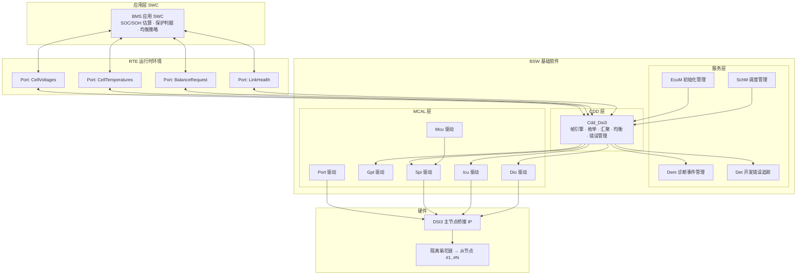

### 9.3 EB tresos / DaVinci 视角下的 CDD 配置容器

在 EB tresos Studio 中，CDD 通常以自定义模块（`.xdm` 定义 + 模块描述文件）的形式加入配置工程；在 Vector DaVinci Configurator 中，则通过导入 BSWMD（Basic Software Module Description）ARXML 来注册。无论哪个工具链，配置的**逻辑结构**是相似的：一层层容器（Container）+ 参数（Parameter）。

下面给出一份工程化的 CDD 配置容器与参数设计（参数名为示意，实际按项目命名规范）：

**容器 1：`CddDsi3General` —— 全局配置（单例）**

| 参数名 | 类型 | 取值范围/示例 | 说明 |
|--------|------|--------------|------|
| `CddDsi3DevErrorDetect` | BOOLEAN | true / false | 是否使能 Det 开发错误检测，量产版通常关闭 |
| `CddDsi3VersionInfoApi` | BOOLEAN | true / false | 是否提供版本查询 API |
| `CddDsi3MainFunctionPeriod` | FLOAT | 0.005 ~ 0.100 s | 主函数调用周期，需与 OS 任务周期一致 |
| `CddDsi3MaxNodeCount` | INTEGER | 1 ~ 32 | 单链最大从节点数，决定缓冲区大小 |
| `CddDsi3CellsPerNode` | INTEGER | 4 ~ 18 | 每级管理的电芯数 |
| `CddDsi3AuxPerNode` | INTEGER | 0 ~ 8 | 每级辅助（温度）通道数 |
| `CddDsi3EnableRingTopology` | BOOLEAN | true / false | 是否使能环形拓扑与反向读取 |
| `CddDsi3UseDma` | BOOLEAN | true / false | 汇聚数据是否走 DMA 搬运 |

**容器 2：`CddDsi3LinkConfig` —— 链路时序与协议参数**

| 参数名 | 类型 | 示例值 | 说明与整定依据 |
|--------|------|--------|---------------|
| `CddDsi3BaudRate` | INTEGER | 250000 / 500000 / 1000000 bps | 链路位速率。由"安全所需扫描周期 + 最大级数"反推，不追求最高 |
| `CddDsi3FrameTimeoutUs` | INTEGER | 200 ~ 5000 us | 单帧接收超时。须 > 最长帧传输时间 + 裕量 |
| `CddDsi3StageTimeoutUs` | INTEGER | 100 ~ 2000 us | 单级转发超时基准，总超时 = 本值 × 实际级数 |
| `CddDsi3TurnAroundUs` | INTEGER | 2 ~ 50 us | 半双工收发切换死区，需示波器实测调优 |
| `CddDsi3RetryMax` | INTEGER | 0 ~ 3 | 单轮最大重试次数。注意重试会吃掉周期预算 |
| `CddDsi3CrcPolynomial` | ENUM | CRC16_CCITT / CRC16_IBM / CRC8_SAE | 校验多项式选择，须与从节点配置一致 |
| `CddDsi3EnumRetryMax` | INTEGER | 1 ~ 5 | 上电枚举失败的重试次数 |
| `CddDsi3ScanPeriodMs` | INTEGER | 10 ~ 1000 ms | 全包扫描周期。安全需求驱动，常见 10~100ms |
| `CddDsi3DegradeThreshold` | INTEGER | 3 ~ 50 | 连续失败多少次进入降级状态 |
| `CddDsi3RecoverThreshold` | INTEGER | 10 ~ 200 | 连续成功多少次退出降级 |

**容器 3：`CddDsi3MeasConfig` —— 测量 AFE 参数**

| 参数名 | 类型 | 示例值 | 说明 |
|--------|------|--------|------|
| `CddDsi3AdcOsr` | ENUM | FAST / NORMAL / ACCURATE / MAX_PRECISION | 过采样档位，精度与速度权衡 |
| `CddDsi3SettleTimeUs` | INTEGER | 100 ~ 5000 us | 采样建立时间，须与 OSR 匹配 |
| `CddDsi3CellVoltageLsbNv` | INTEGER | 例 305180 nV | 单个 ADC 码对应的电压权重，用于码值换算 |
| `CddDsi3ChannelMask` | INTEGER | 位图 | 使能哪些电芯通道（应对不满配模组） |
| `CddDsi3AuxChannelMask` | INTEGER | 位图 | 使能哪些辅助通道 |
| `CddDsi3OpenWireCheckPeriodMs` | INTEGER | 1000 ~ 60000 ms | 开路检测周期，不必每轮做 |
| `CddDsi3OpenWireThresholdMv` | INTEGER | 50 ~ 500 mV | 开路判据阈值，需标定 |
| `CddDsi3NtcTableRef` | REFERENCE | → NTC 查表容器 | 引用 NTC 分段线性表 |

**容器 4：`CddDsi3BalanceConfig` —— 均衡参数**

| 参数名 | 类型 | 示例值 | 说明 |
|--------|------|--------|------|
| `CddDsi3BalStartDeltaMv` | INTEGER | 10 ~ 100 mV | 高于最低电芯多少才开始均衡 |
| `CddDsi3BalStopDeltaMv` | INTEGER | 2 ~ 30 mV | 迟滞下限，防止均衡振荡 |
| `CddDsi3BalMinCellMv` | INTEGER | 3000 ~ 3500 mV | 低于此电压禁止均衡（防过放） |
| `CddDsi3BalMaxTempDeciC` | INTEGER | 350 ~ 550（0.1℃） | 超温禁止均衡 |
| `CddDsi3BalWatchdogMs` | INTEGER | 1000 ~ 30000 ms | 硬件均衡看门狗超时 |
| `CddDsi3BalAllowAdjacent` | BOOLEAN | true / false | 是否允许相邻通道同时均衡 |
| `CddDsi3BalPauseOnSample` | BOOLEAN | true（强烈建议） | 采样时自动暂停均衡 |
| `CddDsi3BalMaxSimultaneous` | INTEGER | 1 ~ 16 | 单级最多同时均衡通道数（热预算约束） |

**容器 5：`CddDsi3DemEventRef` —— 诊断事件映射**

| 参数名 | 类型 | 映射目标 | 说明 |
|--------|------|---------|------|
| `CddDsi3DemEventCrcError` | REFERENCE | → DemEventParameter | CRC 错误事件 |
| `CddDsi3DemEventTimeout` | REFERENCE | → DemEventParameter | 通信超时事件 |
| `CddDsi3DemEventNodeLost` | REFERENCE | → DemEventParameter | 从节点失联事件 |
| `CddDsi3DemEventOpenWire` | REFERENCE | → DemEventParameter | 采样线开路事件 |
| `CddDsi3DemEventBalanceFault` | REFERENCE | → DemEventParameter | 均衡执行异常事件 |
| `CddDsi3DemEventDataInconsistent` | REFERENCE | → DemEventParameter | 交叉校验不一致事件 |

**容器 6：`CddDsi3HwResource` —— 硬件资源引用**

| 参数名 | 类型 | 引用目标 | 说明 |
|--------|------|---------|------|
| `CddDsi3SpiSequenceRef` | REFERENCE | → SpiSequence | 与桥接芯片通信的 SPI 序列 |
| `CddDsi3SpiJobCmdRef` | REFERENCE | → SpiJob | 命令下发 Job |
| `CddDsi3SpiJobDataRef` | REFERENCE | → SpiJob | 数据汇聚读取 Job（大长度，走 DMA） |
| `CddDsi3GptChannelRef` | REFERENCE | → GptChannelConfiguration | 周期触发与超时计时通道 |
| `CddDsi3IcuChannelRef` | REFERENCE | → IcuChannel | 桥接芯片中断输入 |
| `CddDsi3DioResetPinRef` | REFERENCE | → DioChannel | 桥接芯片复位控制脚 |
| `CddDsi3DioEnablePinRef` | REFERENCE | → DioChannel | 桥接芯片使能脚 |

### 9.4 配置 → 生成 → 调用的完整路径

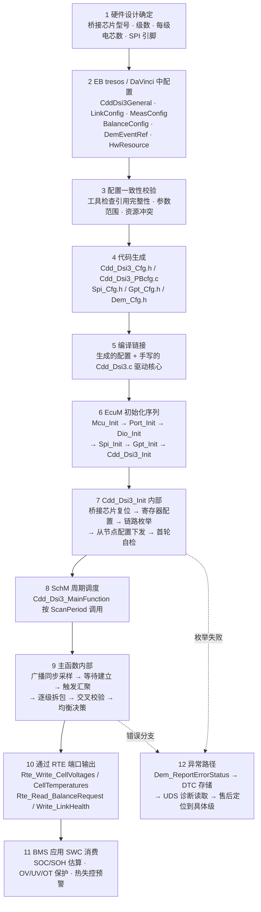

### 9.5 CDD 对外接口设计与 RTE 集成

```c
/* =========================================================================
 * Cdd_Dsi3.h —— CDD 对外接口（AUTOSAR 风格）
 * 命名遵循 <Mip>_<FunctionName> 约定，Mip = Cdd_Dsi3
 * ========================================================================= */
#ifndef CDD_DSI3_H
#define CDD_DSI3_H

#include "Std_Types.h"
#include "Cdd_Dsi3_Cfg.h"     /* 由配置工具生成 */

/* ---- 模块与实例标识（Det 上报用）---- */
#define CDD_DSI3_MODULE_ID          0xFF01u   /* CDD 使用厂商自定义 ID */
#define CDD_DSI3_INSTANCE_ID        0x00u

/* ---- Service ID（Det 错误定位到具体 API）---- */
#define CDD_DSI3_SID_INIT           0x01u
#define CDD_DSI3_SID_DEINIT         0x02u
#define CDD_DSI3_SID_MAINFUNCTION   0x03u
#define CDD_DSI3_SID_GETCELLVOLT    0x10u
#define CDD_DSI3_SID_GETTEMP        0x11u
#define CDD_DSI3_SID_SETBALANCE     0x20u
#define CDD_DSI3_SID_GETLINKHEALTH  0x30u

/* ---- Det 错误码 ---- */
#define CDD_DSI3_E_UNINIT           0x01u
#define CDD_DSI3_E_PARAM_POINTER    0x02u
#define CDD_DSI3_E_PARAM_INDEX      0x03u
#define CDD_DSI3_E_ALREADY_INIT     0x04u

/* ---- 模块状态 ---- */
typedef enum {
    CDD_DSI3_UNINIT = 0,
    CDD_DSI3_INIT_PENDING,
    CDD_DSI3_IDLE,
    CDD_DSI3_BUSY,
    CDD_DSI3_DEGRADED,
    CDD_DSI3_FAILED
} Cdd_Dsi3_StatusType;

/* ---- 配置结构体（Post-Build 可变部分由生成代码填充）---- */
typedef struct {
    uint32 BaudRate;
    uint16 FrameTimeoutUs;
    uint16 StageTimeoutUs;
    uint8  TurnAroundUs;
    uint8  RetryMax;
    uint8  MaxNodeCount;
    uint8  CellsPerNode;
    uint8  AuxPerNode;
    uint16 ScanPeriodMs;
    uint16 BalStartDeltaMv;
    uint16 BalStopDeltaMv;
    uint16 BalMinCellMv;
    sint16 BalMaxTempDeciC;
    uint16 BalWatchdogMs;
    boolean EnableRing;
    boolean UseDma;
    boolean BalPauseOnSample;
    const uint16 *CellLsbNvTable;   /* 指向生成的换算权重表 */
} Cdd_Dsi3_ConfigType;

/* ---- 标准 AUTOSAR 生命周期接口 ---- */
extern void Cdd_Dsi3_Init(const Cdd_Dsi3_ConfigType *ConfigPtr);
extern void Cdd_Dsi3_DeInit(void);
extern void Cdd_Dsi3_MainFunction(void);   /* 由 SchM 按 ScanPeriod 调度 */
extern Cdd_Dsi3_StatusType Cdd_Dsi3_GetStatus(void);

/* ---- 数据访问接口（供 RTE 映射为 SenderReceiver / ClientServer 端口）---- */
extern Std_ReturnType Cdd_Dsi3_GetCellVoltage(uint8 nodeIdx, uint8 cellIdx,
                                              uint16 *voltageMv);
extern Std_ReturnType Cdd_Dsi3_GetAllCellVoltages(uint16 *buffer,
                                                  uint16 bufferLen,
                                                  uint16 *validCount);
extern Std_ReturnType Cdd_Dsi3_GetTemperature(uint8 nodeIdx, uint8 auxIdx,
                                              sint16 *tempDeciDegC);
extern Std_ReturnType Cdd_Dsi3_GetNodePackVoltage(uint8 nodeIdx,
                                                  uint32 *voltageMv);

/* ---- 均衡控制接口 ---- */
extern Std_ReturnType Cdd_Dsi3_SetBalanceEnable(boolean enable);
extern Std_ReturnType Cdd_Dsi3_SetBalanceMask(uint8 nodeIdx, uint16 mask);
extern Std_ReturnType Cdd_Dsi3_GetBalanceStatus(uint8 nodeIdx, uint16 *actual);

/* ---- 诊断接口 ---- */
extern Std_ReturnType Cdd_Dsi3_TriggerOpenWireCheck(void);
extern Std_ReturnType Cdd_Dsi3_TriggerSelfTest(void);
extern Std_ReturnType Cdd_Dsi3_GetLinkHealth(uint32 *crcErrCnt,
                                             uint32 *timeoutCnt,
                                             uint8  *lostNodeIdx);
extern uint8 Cdd_Dsi3_GetActiveNodeCount(void);

#endif /* CDD_DSI3_H */
```

对应的主函数骨架，展示配置参数如何被消费：

```c
/* =========================================================================
 * Cdd_Dsi3.c —— 主函数：把配置参数、驱动核心与 RTE 输出串起来
 * ========================================================================= */
#include "Cdd_Dsi3.h"
#include "dsi3_types.h"
#include "Rte_Cdd_Dsi3.h"
#include "Dem.h"
#include "Det.h"

static const Cdd_Dsi3_ConfigType *s_cfg      = NULL_PTR;
static Cdd_Dsi3_StatusType        s_status   = CDD_DSI3_UNINIT;
static Dsi3_PackDataType          s_packData;
static uint16                     s_tickMs   = 0u;
static uint16                     s_owTickMs = 0u;

void Cdd_Dsi3_Init(const Cdd_Dsi3_ConfigType *ConfigPtr)
{
#if (CDD_DSI3_DEV_ERROR_DETECT == STD_ON)
    if (ConfigPtr == NULL_PTR) {
        Det_ReportError(CDD_DSI3_MODULE_ID, CDD_DSI3_INSTANCE_ID,
                        CDD_DSI3_SID_INIT, CDD_DSI3_E_PARAM_POINTER);
        return;
    }
    if (s_status != CDD_DSI3_UNINIT) {
        Det_ReportError(CDD_DSI3_MODULE_ID, CDD_DSI3_INSTANCE_ID,
                        CDD_DSI3_SID_INIT, CDD_DSI3_E_ALREADY_INIT);
        return;
    }
#endif
    s_cfg    = ConfigPtr;
    s_status = CDD_DSI3_INIT_PENDING;

    Dsi3_CrcInit();

    /* 1) 桥接芯片硬复位：通过 Dio 拉低复位脚，时长由器件手册规定 */
    Dio_WriteChannel(CddDsi3DioResetPin, STD_LOW);
    Dsi3_DelayUs(100u);
    Dio_WriteChannel(CddDsi3DioResetPin, STD_HIGH);
    Dsi3_DelayUs(1000u);

    /* 2) 按配置设置桥接芯片 PHY 与帧引擎参数 */
    Dsi3_BridgeConfigure(s_cfg->BaudRate, s_cfg->TurnAroundUs,
                         s_cfg->EnableRing);

    /* 3) 链路枚举：确定实际级数 */
    {
        uint8 nodeCnt = 0u;
        if (Dsi3_EnumerateChain(&nodeCnt) != DSI3_OK) {
            s_status = CDD_DSI3_FAILED;
            Dem_ReportErrorStatus(CddDsi3DemEventNodeLost, DEM_EVENT_STATUS_FAILED);
            return;
        }
        /* 实际级数与配置不符 → 硬件装配异常，必须报错而非静默接受 */
        if (nodeCnt != s_cfg->MaxNodeCount) {
            Dem_ReportErrorStatus(CddDsi3DemEventNodeLost, DEM_EVENT_STATUS_FAILED);
        }
    }

    /* 4) 广播下发测量配置与均衡看门狗 */
    (void)Dsi3_AfeConfigure(DSI3_ADDR_BROADCAST, CddDsi3AdcOsr,
                            CddDsi3ChannelMask, TRUE,
                            s_cfg->BalPauseOnSample);

    /* 5) 首轮自检：环回测试 + 参考自检 */
    (void)Dsi3_SelfTestAll();

    s_status = CDD_DSI3_IDLE;
}

void Cdd_Dsi3_MainFunction(void)
{
    if (s_status == CDD_DSI3_UNINIT) {
        return;
    }

    s_tickMs   = (uint16)(s_tickMs   + CDD_DSI3_MAINFUNCTION_PERIOD_MS);
    s_owTickMs = (uint16)(s_owTickMs + CDD_DSI3_MAINFUNCTION_PERIOD_MS);

    /* 1) 链路健康状态机：决定正常/降级/恢复/失效 */
    Dsi3_LinkStateCyclic();

    /* 2) 到达扫描周期 → 执行一次整包汇聚 */
    if (s_tickMs >= s_cfg->ScanPeriodMs) {
        Dsi3_ReturnType ret;
        s_tickMs = 0u;
        s_status = CDD_DSI3_BUSY;

        ret = Dsi3_AggregatePack(&s_packData);
        if (ret == DSI3_OK) {
            /* 3) 通过 RTE 把数据交给 BMS 应用 SWC */
            (void)Rte_Write_CellVoltages(s_packData.cellMilliVolt);
            (void)Rte_Write_CellTemperatures(s_packData.tempDeciDegC);
            (void)Rte_Write_ScanCounter(s_packData.scanCounter);
            s_status = CDD_DSI3_IDLE;
        } else {
            s_status = CDD_DSI3_DEGRADED;
        }
    }

    /* 4) 开路检测：低频执行，不必每轮 */
    if (s_owTickMs >= CddDsi3OpenWireCheckPeriodMs) {
        s_owTickMs = 0u;
        (void)Cdd_Dsi3_TriggerOpenWireCheck();
    }

    /* 5) 均衡周期任务：读取应用层的允许标志后执行 */
    {
        boolean balAllowed = FALSE;
        (void)Rte_Read_BalanceRequest(&balAllowed);
        Dsi3_BalanceCyclic(&s_packData, (bool)balAllowed);
    }

    /* 6) 链路健康上报，供诊断与整车监控 */
    {
        const Dsi3_LinkHealthType *h = Dsi3_GetLinkHealth();
        (void)Rte_Write_LinkHealth_CrcErrCnt(h->crcErrCnt);
        (void)Rte_Write_LinkHealth_TimeoutCnt(h->timeoutCnt);
        (void)Rte_Write_LinkHealth_State((uint8)h->state);
    }
}
```

### 9.6 与 BMS 应用集成的几条纪律

1. **RTE 端口要携带"新鲜度"信息**。仅传电压数组是不够的，必须同时传 `scanCounter` 与 `validMask`。应用 SWC 在使用前先检查计数器是否递增、对应通道是否有效，否则可能拿陈旧数据做保护判决。
2. **保护判据不要全放在应用层**。过压/欠压/过温的一级保护应尽量下沉到从节点硬件（`OV_TH`/`UV_TH`/`OT_TH` 寄存器），这样即使 MCU 死机或链路中断，硬件仍能给出保护信号。应用层做的是二级、更复杂的判据（趋势、SOC 修正、热失控预测）。
3. **均衡请求要有整车级仲裁**。均衡是否允许，不只取决于电池状态，还取决于整车状态：正在快充？正在行驶？在诊断会话中？这些应由上层 SWC 汇总后通过一个布尔端口告知 CDD，而不是让 CDD 自己去猜。
4. **DTC 必须能定位到级**。`Dem` 事件的扩展数据记录（Extended Data Record）里应包含"哪一级、哪个通道、累计错误次数"，否则售后拿到一个"电池通信故障"的 DTC 无从下手，只能整包更换——这是巨大的售后成本。
5. **配置参数不要硬编码**。所有阈值、周期、超时都应通过配置容器暴露，标定工程师可以在不改代码的前提下调整。笔者见过把均衡阈值写死在 `.c` 文件里的项目，结果每换一种电芯都要重新发布软件版本。

---

## 十、测试与验证方法论：如何证明这条链路"真的可靠"

对安全相关链路，写完驱动只是第一步，**证明它可靠**才是难点。DSI3 链路在量产前必须经过系统化的验证，下面给出一套工程上可落地的测试框架。

### 10.1 单级功能测试

先验证"理想条件下链路本身对不对"：单挂一级从节点，遍历全部命令族（配置/测量/均衡/诊断），确认控制流与数据流正确。这一步要覆盖所有命令类型、所有 ADDR 寻址（含广播），并验证 CRC 正确帧能被接受、错误 CRC 能被拒绝。

具体应包括：故意构造 CRC 错误的帧，确认从节点**不执行**该命令（尤其是均衡命令）；构造超长/截断帧，确认状态机能超时复位而不挂死；构造非法命令码，确认器件不产生未定义行为。

### 10.2 满级压力与最坏时延测试

这是最常被忽略却最致命的测试。**必须挂满设计最大级数**做端到端通信，模拟最坏温度、最坏噪声。关注点：

- 末级回传是否仍在超时窗口内（验证时延预算）；
- 长链下各级时钟偏差是否导致末级锁相失败；
- 满级时 CRC 失败率是否在阈值内；
- 汇聚载荷长度是否超出主节点 FIFO 深度（这是硬件约束，超了就是溢出丢数据）。

只挂 1 级"能通"绝不能代表量产可靠——噪声、时延、抖动都随级数放大。

### 10.3 噪声注入与抗扰测试

在电池包暗室/台架上，向链路注入典型干扰：继电器动作、逆变器 PWM 共模、ESD、群脉冲（EFT）、射频辐射（BCI 大电流注入）。观察：

- CRC 失败率是否可控、错误是否被正确隔离到具体级；
- 连续失败后是否进入降级而非盲目重试；
- 干扰撤除后链路能否自恢复（无需整车断电复位）；
- 干扰期间是否发生**误执行**（最严重）——比如噪声导致均衡意外开启。

### 10.4 故障注入与功能安全验证

主动制造单点失效，验证架构承诺：

| 注入的故障 | 期望的系统行为 | 验证方法 |
|-----------|--------------|---------|
| 断开中间某级通信线 | 环形/旁路生效，下游仍可读；或准确报"第 k 级失联" | 物理断线 + 检查 DTC 与数据完整性 |
| 某级掉电 | 准确定位失联级，不误报其他级 | 单独切断某级供电 |
| 地址配置冲突 | 枚举阶段即被检出，不进入正常运行 | 人为写入重复地址 |
| 采样线开路 | 开路检测捕获，对应通道标为无效而非异常电压 | 断开单根采样线 |
| NTC 开路/短路 | 温度标为无效，不误判为极端温度 | 短接或断开 NTC |
| 均衡 MOS 短路失效 | `BAL_STAT` 回读与命令不符，报均衡故障 | 硬件模拟短路 |
| MCU 死机 | 从节点均衡看门狗超时自动关断 | 停止刷新看门狗，观察均衡是否自停 |
| 主节点桥接芯片异常 | CDD 检出并请求安全状态 | 拉复位脚或断供电 |

### 10.5 长期可靠与数据合理性回归

量产前还要做老化与一致性回归：长时间运行后，各单体电压之和是否持续逼近独立总压；温度梯度是否物理合理；链路健康度（CRC 失败率、超时次数）是否进入诊断日志，支撑预测性维护与功能安全论证。

笔者的体会是：**把测试从"能不能通"提升到"坏了能不能发现、坏在哪一级"**，才是功能安全真正落地的标志。一个成熟团队的验收标准应该是：随机拔掉任意一根线、随机破坏任意一个器件，系统都能在规定时间内检出、准确定位、进入安全状态，并留下可供售后追溯的诊断记录。

### 10.6 一个容易被忽略的验证维度：软件在环与硬件在环

在真实电池包上做全覆盖故障注入既昂贵又危险（涉及高压）。成熟团队会构建两级仿真环境：

- **SIL（Software-in-the-Loop）**：把 `Dsi3_PhySend/Receive` 替换为软件桩，用脚本构造任意帧序列——包括正常帧、CRC 错误帧、截断帧、地址错乱帧、超长汇聚帧。这样可以在 PC 上跑几万次异常组合，覆盖那些在实物上极难复现的边界情况。上文的驱动代码之所以把 PHY 层抽象成两个 extern 函数，正是为了这个可测试性。
- **HIL（Hardware-in-the-Loop）**：用电池模拟器替代真实电芯，可以任意设定"某节 4.35V""某节开路""某路 NTC 短路"，配合真实的从节点芯片与链路，验证从 AFE 到应用层的完整通路。这是量产项目的标配。

笔者的建议是：**把 SIL 测试写成可回归的自动化用例，纳入 CI**。链路驱动是那种"改一行可能坏一片"的代码，没有自动化回归网，每次修改都是赌博。

---

## 十一、DSI3 vs isoSPI：对比、取舍与选型

### 11.1 定量与定性对比表

| 维度 | DSI3（开放标准） | isoSPI（ADI 私有方案） |
|------|----------------|----------------------|
| 标准属性 | 开放标准（DSI Consortium），多厂商可互操作 | 厂商私有方案，随 ADI 监控 IC 捆绑 |
| 物理层 | 两线差分，变压器/电容耦合均可，编码因厂商而异 | 变压器隔离的差分 SPI，编码由 ADI 定义 |
| 拓扑 | 线性菊花链 + 环形/旁路增强 | 线性菊花链，亦可配置冗余/环形 |
| 命令模型 | 主发从应、配置/测量/均衡/诊断语义统一 | SPI 寄存器读写 + 命令帧，语义随器件族 |
| 供应商锁定 | 低，生态开放可替代 | 较高，与 ADI 监控 IC 强绑定 |
| 生态成熟度 | 取决于采用厂商，文档与参考设计逐步完善 | 非常成熟，器件族与参考设计完备 |
| 互操作性 | 标准层面保证跨厂商一致 | 仅 ADI 自家器件间互操作 |
| 软件栈归属 | 多为 CDD，需自研或购买第三方 | ADI 提供较完整的参考驱动 |
| 适用平台 | 选用开放标准监控 IC 的平台 | 选用 ADI 监控 IC（如 LTC/ADBMS 系列）的平台 |
| 功能安全支撑 | 可映射到 ASIL，环形/旁路支撑 FFI | 同样可支撑 ASIL，文档与认证完善 |
| 长期平台复用 | 标准独立于器件生命周期，软件资产可跨代 | 器件换代时驱动通常需适配 |

### 11.2 选型决策逻辑

笔者的经验性结论：

- **若平台已选定 ADI 监控 IC 族**：链路自然走 isoSPI，生态成熟、风险低，是"省心"路线；对于交付压力大、团队 BMS 经验尚浅的项目，这往往是理性选择。
- **若强调供应商可替代、长期平台解耦**：倾向 DSI3 等开放标准，用标准红利换取谈判与保供主动权。芯片荒的经历让不少主机厂把"第二供应商"从加分项变成了硬性要求。
- **两者本质解决同一问题**，技术代差并不大，真正差异在**标准开放性 vs 生态成熟度**的权衡；
- **软件成本要计入 TCO**：开放标准意味着你可能要自己写 CDD、自己做认证。这部分工程量在项目预算里常被低估。
- 不论选哪条，**隔离、CRC、超时、拓扑冗余、诊断映射**这些工程纪律都是共通的，不可因为"用了成熟方案"就松懈。

### 11.3 一个中立的观察

笔者想避免陷入"开放一定好"的教条。开放标准的真实价值取决于**生态里到底有几家在做**。如果一个所谓开放标准最终只有一家厂商供货，那它在保供意义上与私有方案没有区别。选型时应该问的问题不是"它是不是开放标准"，而是：

1. 现在市面上有几家可量产供货的兼容器件？
2. 它们之间真的能互换吗（引脚兼容？软件兼容？）？
3. 换供应商时，我的软件要改多少？
4. 长期看，这条链路的标准维护方是否稳定？

把这四个问题问清楚，选型结论自然浮现。

---

## 十二、典型应用场景

### 12.1 BMS 从板级联（最主战场）

这是 DSI3 最经典的应用：每个电池模组旁布置一片从板（含监控 IC），从板沿模组排列顺序级联成链，最终经隔离桥接到低压侧主控。主控周期性广播采样，汇聚出整包电压/温度矩阵，做一致性分析、均衡决策、SOH 估算与热失控预警。

在乘用车里，常见布置是：每个模组（module）对应一片从板，若干模组串成电池包（pack），从板沿 pack 机械结构一字级联，末端回到 pack 一端的主控接口。这种"顺着物理结构走线"的特性，使 DSI3 的线束成本远低于星形回连。商用车（如电动大巴）电池包更大、电芯更多，级数可达几十级，此时环形拓扑与时钟重建的必要性更加凸显。

### 12.2 采样板间通信与储能场景

在更细分的架构里，一片从板可能只管少数几节电芯，多片从板再级联；或在从板与"模组控制器"之间用 DSI3 互联，把"采集"与"模组级决策"分层。链路的弹性使其既能做"片到片"，也能做"板到板"。

某些平台还把这类链路用于**储能系统（ESS）**的电池堆监测：集装箱式储能由大量电池模块组成，模块化扩展正需要这种可级联、可冗余的链路。储能场景与车载的差异在于：级数可能更多、对成本更敏感、但对温度环境的要求相对宽松、且有更长的运维窗口。这使得"可诊断性"在储能里比在车载里更重要——运维人员需要能远程定位到具体是哪个模块的哪一节出了问题。

### 12.3 CTP/CTB/CTC 结构下的新挑战

随着电池包从"模组化"走向 CTP（Cell to Pack）、CTB（Cell to Body）、CTC（Cell to Chassis），传统"一个模组一片从板"的映射被打破：

- **从板数量与位置更灵活**，链路走线可能更长、更绕；
- **散热路径变化**，从板所处热环境更严苛，对器件温漂与均衡热预算提出更高要求；
- **维修性降低**，一旦某级失效难以单独更换，这反过来提高了对冗余拓扑与在线诊断的要求；
- **机械振动耦合**，长链连接器的接触可靠性成为新的失效模式来源，链路必须能区分"偶发接触不良"与"永久断线"。

笔者的判断是：结构创新会持续推高对监测链路可靠性与诊断粒度的要求，而不是相反。

### 12.4 与整车网络的衔接

DSI3 链路止于 BMS 主控，主控再通过 **CAN/CAN-FD 或车载以太网**把聚合后的电池状态上报整车域控。DSI3 解决的是"高压侧到低压主控"这一段，而非整车骨干网——它和 CAN/以太网是**互补**而非替代关系。

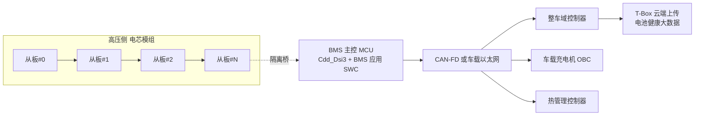

值得注意的是最后一环：**电池数据上云**。现代电动车的电池监测数据会被上传到云端做群体健康分析与预警。这意味着 DSI3 链路的数据质量不只影响单车安全，还影响整个车队的健康模型。数据里若混入未被识别的错误值，会污染模型；因此"数据有效性标记"必须一路传递到云端，而不是在 BMS 内部就被抹平。

---

## 十三、常见工程坑与调试手段

1. **隔离元件选型/layout 不当 → 通信误码**：变压器/电容的寄生参数、走线不对称会破坏差分信号。对策：严格按 IC 厂商参考设计做隔离器件选型与 PCB layout，做阻抗与对称性检查；注意首级隔离承受整包电压，耐压不可与级间等同选型。

2. **某级故障 → 整链中断**：线性菊花链单点失效最致命。对策：用环形（ring）拓扑或故障旁路设计，单级失效可绕行；并且**务必实现并测试反向读取软件**，不要只做硬件不做软件。

3. **位时序/时钟偏差在长链累积 → 末级不稳**：链越长，各级时钟偏差叠加越明显。对策：选支持时钟重建（重新编码转发而非模拟中继）的监控 IC，控制单链级数，做最大级数压力测试。

4. **强电流噪声耦合 → 误帧**：对策：屏蔽、滤波、确保 CRC 校验全覆盖，并对连续 CRC 失败做降级/隔离而非盲目重试。

5. **超时窗口设错 → 误报通信失败**：菊花链回传延迟随级数线性增长，超时阈值要按最大级数留余量，并把"每级超时基准 × 实际级数"做成配置参数而非常量。

6. **广播采样未对齐 → 数据"错位"**：若各级采样触发未同步，回传数据可能对应不同时刻的电芯状态，做一致性校验时"对不上"。对策：用广播同步采样 + 主时钟下发，避免 Ping-Pong 轮询。

7. **均衡命令误发/误重发 → 安全隐患**：均衡是"动能量"的操作，命令帧必须带 CRC 且重发须幂等。对策：均衡命令设计为"写绝对位图"而非"翻转某位"，天然幂等；配合硬件看门狗与状态回读确认。

8. **均衡时采样未暂停 → 均衡振荡**：均衡电流在采样线电阻上产生压降，导致被均衡通道读数偏低，软件误以为已降下来而停止，下轮又重启。对策：使能 `BAL_PAUSE`，或软件在读取前主动停均衡并等待建立。

9. **诊断被忽视 → 隐性失效**：只等到读不到电压才慌，而非把 CRC 失败率、超时次数进日志。对策：链路健康度作为一等公民上报，支撑预测性维护。

10. **地址配置冲突 → 多节点抢答**：从节点地址若重复，响应会混乱。对策：枚举阶段"逐级点亮"分配地址并**逐级回读确认**，做唯一性校验。

11. **温度梯度异常被误判为断线**：NTC 断线、短路与真实过温在数值上可能相近。对策：诊断逻辑区分开路/短路特征（上下拉阈值判别），避免单一阈值一刀切；换算函数应返回显式的"无效"值而非某个数值温度。

12. **陈旧数据被当成实时数据**：链路某轮失败后，软件沿用上轮缓存值继续做保护判决。对策：数据必须携带 DRDY 位与扫描序号，应用层在使用前校验新鲜度；连续 N 轮无新数据必须触发降级。

13. **汇聚 FIFO 溢出 → 末级数据静默丢失**：级数增加或每级载荷变大后，主节点接收 FIFO 装不下，末几级数据被丢弃却无明显报错。对策：把"预期载荷长度 vs 实收长度"作为每轮的强制校验项。

14. **从节点比主控先上电导致状态未知**：从节点由电芯供电，只要电池在就有电。若主控复位重启，从节点可能仍处于上一次的均衡状态。对策：初始化流程必须以"广播软复位 + 全部均衡强制关闭 + 重新枚举"开头。

15. **配置写入未回读 → 静默失配**：写了阈值寄存器却没确认，实际因通信错误未生效。对策：所有安全相关配置写入后必须回读比对，不一致则报故障。

### 13.1 调试手段清单

| 现象 | 首选排查手段 | 关键观察点 |
|------|-------------|-----------|
| 完全通不了 | 示波器看差分波形 | 是否有信号？摆幅是否足够？同步头形状是否正常？ |
| 偶发丢帧 | 长时间抓取 CRC 失败率并按级统计 | 是否集中在某几级？是否与某个整车动作相关？ |
| 只有末级不通 | 逐级缩短链路二分定位 | 是时钟累积问题还是某级器件问题？ |
| 数据对不上总压 | 检查采样时刻一致性 | 是否用了 Ping-Pong？大电流工况下差异是否放大？ |
| 均衡不生效 | 回读 `BAL_STAT` 而非 `BAL_CTRL` | 硬件是否被保护逻辑否决（过温/相邻互斥）？ |
| 上电偶发失败 | 记录 EcuM 初始化时序 | 桥接芯片复位时长是否足够？从节点是否需要更长稳定时间？ |
| 温度读数跳变 | 检查 NTC 换算表与开路阈值 | 是真实温度变化还是接触不良？ |
| CPU 负载过高 | 检查是否走了 DMA、中断次数统计 | 是否退化成逐级轮询？ |

---

## 十四、面试题精选（含要点）

以下题目既适合候选人准备，也适合面试官直接使用。每题附"要点"，便于快速评估。建议面试官不要只听结论，而要追问"为什么"与"最坏情况怎么办"——真正区分资深与否的，往往是对边界条件与失效模式的理解。

**协议与架构**

1. **BMS 怎么采集上百节电芯电压？**
   要点：电芯监控 IC 就近采集 + 隔离菊花链（DSI3/isoSPI）上报主控 MCU；分布式架构降低线束。

2. **为什么要用隔离通信？隔离在哪几个位置？**
   要点：电芯侧数百 V 高压、控制侧低压，必须电气隔离保护 MCU 并抗共模干扰；隔离是**逐级分布式**的，每级间都有隔离栅，不是只在主控一侧。追问：首级与级间隔离元件的耐压选型为什么不同？

3. **菊花链怎么工作？下行与上行的硬件通路有何差异？**
   要点：命令从 MCU 发出逐级转发（浅流水、不改内容、CRC 透传），末级应答再逐级回传（追加数据、CRC 重算）；两条通路特性完全不同。

4. **CRC 为什么在这类链路里关键？逐级重算的 CRC 有什么局限？**
   要点：一位错可能误判过压→误断高压或误发均衡；局限在于逐级重算只提供分段保护，不是端到端，高 ASIL 需考虑应用层附加校验。

5. **DSI3 和 isoSPI 区别？选型怎么权衡？**
   要点：都是隔离菊花链、解决同一问题；DSI3 是开放标准，isoSPI 是 ADI 私有；差异在开放 vs 生态成熟；还要把软件栈自研成本计入 TCO。

6. **线性菊花链的单点失效怎么解决？**
   要点：环形拓扑 / 故障旁路开关；但要追问软件是否真的实现了反向读取。

7. **为什么挂 1 级能通、挂满级数却不通？**
   要点：噪声、逐级流水时延、时钟抖动随级数放大；FIFO 深度也可能不够；必须做最大级数压力测试。

**芯片与硬件**

8. **画一下电芯监控 IC 的内部框图，说明各模块作用。**
   要点：上下行差分 PHY + CDR + 编解码 + CRC + 帧控制 FSM + 移位链 + 寄存器文件 + 测量序列器 + 多路 MUX/电平位移/Sigma-Delta ADC + 均衡驱动 + 堆叠 LDO + 本地 OSC。

9. **为什么电芯电压采集普遍用 Sigma-Delta ADC？**
   要点：低速下易做到 16bit 以上有效精度，过采样与噪声整形天然抗噪；代价是转换延迟长，不适合高速瞬态。

10. **AFE 前端为什么需要电平位移/高共模差分缓冲？**
    要点：串联电芯的共模电位可达几十伏，ADC 只能处理低压差分；CMRR 与失调直接决定高位电芯精度。

11. **电压数据寄存器里为什么要有 DRDY 和 ERR 位？**
    要点：DRDY 防止陈旧数据被当成实时值（菊花链读取是异步分级的）；ERR 让"读不到"与"真的 0V"可区分，避免误判为严重欠压。

12. **从节点的电从哪来？带来什么设计约束？**
    要点：从所监测的电芯组直接取电（堆叠 LDO），因此静态功耗会造成该组电芯额外亏电，低功耗与休眠是硬指标；也意味着从节点可能比主控先上电。

13. **均衡模块需要哪些硬件安全特性？**
    要点：硬件看门狗自动关断、相邻通道互斥、过温降额、采样时自动暂停、状态可回读（`BAL_STAT` 独立于 `BAL_CTRL`）。

14. **帧控制状态机里，CRC 校验必须放在哪个位置？为什么？**
    要点：必须在执行命令之前。否则被噪声破坏的均衡命令可能在判错之前已经把 MOS 打开。

15. **芯片内部有哪几个时钟/复位域？为什么复位要分粒度？**
    要点：上下行链路侧 + 本地域；POR/BOR/帧引擎软复位/序列器复位分开，目的是"修通信不丢监测状态"，避免一次通信抖动清空全部数据。

16. **开路检测（Open Wire）的原理是什么？**
    要点：注入小电流前后各测一次，正常时被电芯低内阻钳位读数不变，开路时读数被拉到轨附近；差值超阈值判定开路。

**软件与 AUTOSAR**

17. **为什么 DSI3 在 AUTOSAR 里通常用 CDD 而不是标准 MCAL 模块？**
    要点：AUTOSAR 未定义该协议模块；菊花链私有时序（turn-around、逐级超时、广播对齐）微秒级要求；帧长动态变化不适配标准 PDU 模型。CDD 正是为"严格时序 + 非标准硬件"设计的。

18. **DSI3 CDD 会依赖哪些标准 MCAL 模块？**
    要点：Spi（与桥接芯片通信）、Dma、Gpt（周期触发与超时）、Icu（中断捕获）、Dio（复位/使能脚）、Port、Mcu。若主节点 IP 内置则不依赖 Spi。

19. **列举几个必须暴露为配置参数、不能硬编码的量。**
    要点：波特率、帧/级超时、turn-around 死区、重试次数、扫描周期、ADC OSR 与建立时间、均衡阈值与迟滞、均衡看门狗、降级/恢复门限、DEM 事件引用。

20. **配置 → 生成 → 调用的路径是怎样的？**
    要点：工具中配置容器 → 一致性校验 → 生成 `Cdd_Dsi3_Cfg.h/PBcfg.c` → 与手写驱动核心一起编译 → EcuM 按序初始化 → SchM 周期调用 `MainFunction` → 通过 RTE 端口输出给 BMS SWC。

21. **CDD 通过 RTE 给应用的数据，除了电压温度还必须带什么？**
    要点：扫描序号（新鲜度）、有效通道位图、链路健康状态。否则应用无法判断数据是否可信。

22. **一级保护应该放在硬件还是软件？为什么？**
    要点：OV/UV/OT 一级保护应下沉到从节点硬件阈值寄存器，这样 MCU 死机或链路中断时仍有保护；软件做二级复杂判据。

23. **DTC 设计上有什么要求？**
    要点：必须能定位到"第几级、哪个通道"，扩展数据记录里带累计错误次数，否则售后只能整包换。

**时序、诊断与测试**

24. **主节点一次怎么拿到整包所有电芯数据？两种方式各有什么问题？**
    要点：广播同步采样 + 链式汇聚（推荐），或逐节点轮询；后者各级采样时刻不同，大电流工况下交叉校验会对不上。

25. **时钟偏差在长链里如何控制？"重新编码转发"与"模拟中继"有何本质区别？**
    要点：从节点用 CDR 重建位时钟后重新编码输出，误差每级归零、不累积；模拟中继会让抖动逐跳叠加。

26. **均衡命令为什么特别危险？怎么做到可安全重试？**
    要点：动能量，误发可能过充/过热；设计成"写绝对位图"而非翻转操作即天然幂等；配合硬件看门狗与状态回读。

27. **数据汇聚后为什么要做交叉验证？有哪几层？**
    要点：级内自洽（本级各单体之和 ≈ 本级组总压）、全包比对（总和 ≈ 独立总压通道）、温度梯度合理性、有效位与扫描序号匹配。

28. **连续 CRC 失败应该怎么处理？**
    要点：分级计数、定位到级、进入降级（降刷新率、停均衡、只保关键判据）而非盲目重试；失败率进诊断日志。

29. **带宽预算怎么算？为什么要留重试余量？**
    要点：单级载荷 × 级数 × 编码系数 / 速率 = 单轮耗时；必须按"允许 N 次重试仍不超期"来定，而不是理想一次成功。

30. **如何验证这条链路真的可靠？**
    要点：单级功能 → 满级最坏时延 → 噪声注入（EFT/ESD/BCI）→ 故障注入（断线/掉电/地址冲突/NTC 开路/均衡 MOS 失效/MCU 死机）→ 长期回归；配合 SIL 自动化用例与 HIL 电池模拟器。

31. **如果现场反馈"偶发通信故障"，你的排查路径是什么？**
    要点：先看诊断日志里的按级错误分布 → 判断是集中在某级还是全链 → 关联整车动作（继电器/压缩机/快充）→ 示波器抓差分波形与共模跳变 → 检查 layout 对称性与屏蔽 → 二分缩短链路定位。

---

## 十五、总结

DSI3 作为电池监测领域的**开放标准隔离菊花链**，用"双线差分 + 逐级隔离 + 主发从应 + CRC 容错 + 环形/旁路冗余"的组合，解决了分布式 BMS 在高压脏环境里"看得见每一节电芯"的难题。它与 ADI 的 isoSPI 并列，本质解决同一问题，差异在**开放 vs 私有、标准 vs 生态**。

但本文想传达的，远不止协议本身。笔者刻意把叙述从协议层向下延伸到**芯片 IP 内部**——收发器 PHY、CDR、帧控制状态机、移位汇聚链、Sigma-Delta AFE、均衡驱动、寄存器位域、时钟复位与隔离域划分；又向上延伸到**软件栈**——驱动代码的错误分级、降级状态机，以及 AUTOSAR 下为什么必须走 CDD、配置容器怎么设计、生成与调用路径如何闭环。这三段（硬件 IP / 驱动 / MCAL 集成）合起来，才是一个工程师在真实项目里需要完整掌握的图景。

几条贯穿全文的设计纪律，值得单独提炼：

1. **CRC 必须在执行之前**。硬件状态机的次序、软件事务的次序，都不能颠倒。
2. **数据必须自带新鲜度与有效性**。DRDY、ERR、扫描序号、有效位图——缺一个都可能让陈旧或错误数据被当成真值。
3. **命令与状态必须分离**。回读 `BAL_STAT` 而不是 `BAL_CTRL`，才能发现硬件真的坏了。
4. **错误必须可定位到级**。笼统的"通信故障"在功能安全与售后成本上都不可接受。
5. **失败必须降级而非死磕**。连续重试只会吃掉周期预算并放大风险，正确的做法是有秩序地退到安全的降级状态。
6. **安全需求驱动链路设计**，而不是被物理限制将就——先定死扫描周期，再反推速率与级数。
7. **一级保护尽量下沉到硬件**。MCU 会死机、链路会断，但从节点的阈值比较器不会。

从产业视角看，随着高压平台（800V 乃至更高）普及与电池包结构走向 CTP/CTB/CTC，电芯监测链路的级数、速率与功能安全等级要求只会更高；维修性下降又反过来抬高了对在线诊断与冗余拓扑的要求。开放标准 DSI3 的"可替代、可互操作"属性，在保供与平台复用压力下价值愈发突出；而 isoSPI 的成熟生态也绝非轻易可被替代。未来的 BMS 通信，更可能是**开放标准与成熟私有方案长期并存、按需选型**的格局。工程师的价值，正在于穿透宣传话术，回到隔离、时序、噪声、诊断这些物理与协议本源做正确取舍。

> 笔者小结：链路层没有"银弹"，只有"纪律"。把隔离、CRC、超时、拓扑冗余、诊断映射这五件事做到位，再把它们从芯片寄存器一路贯通到 RTE 端口，电池包的"眼睛"才算真正亮了——而且是那种坏了自己会喊、还能说清楚是哪只眼睛坏了的亮法。