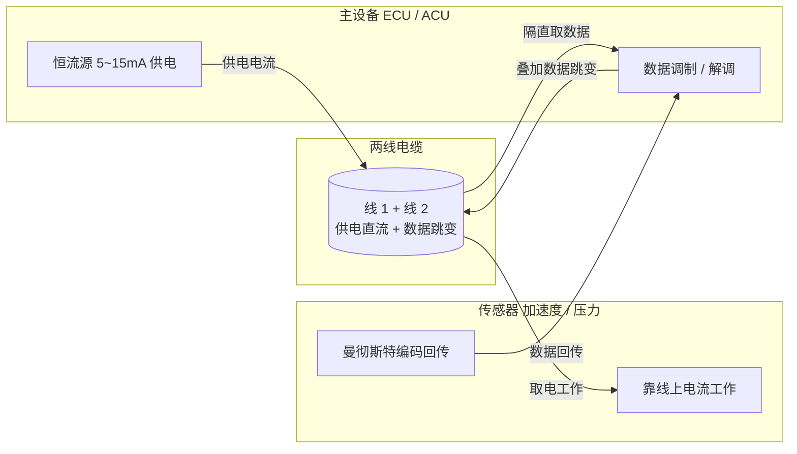

# PSI5 / SPC 传感器接口：两线供电兼通信的安全链路

## 一、引言：安全气囊里的"两根线"不能多

汽车安全气囊系统里，碰撞加速度传感器往往就藏在方向盘或车身纵梁上，离气囊控制单元（ACU）隔了好长一段线。传统做法要么给它单独供电源线 + 单独信号线，要么用模拟电压上报——但模拟电压在发动机舱的强电磁环境里极易被干扰，而多根线意味着更多连接器、更高失效率。

于是出现了一种"极简却可靠"的接口：**PSI5（Peripheral Sensor Interface 5）**。它只用**两根线**——同时给传感器供电、又在这两根线上叠加数据通信。气囊加速度传感器、压力传感器这类 ASIL 安全件，正是靠它把"是否撞车"的判断稳稳传回控制器。这两根线既是命脉（供电）又是神经（通信），少一根都不行，多一根都嫌贵。对功能安全工程师来说，PSI5/SPC 是"两线供电兼通信的安全链路"的典范。

## 二、核心原理：在供电线上"谈"数据

### 2.1 两线怎么既供电又通信

PSI5 总线是一根**两线电缆**：主设备（ECU/ACU）通过它给传感器供一个稳定电流（典型 5~15mA 工作电流），传感器就靠这个电流活着。同时，**数据用电流或电压的跳变编码，叠加在这根供电线上**——接收端从线上解调出数据，而供电直流分量被滤除。

**类比**：像在一条自来水管里既供水（直流供电）又用特定的"开关水流"节奏传密语（数据跳变）。接收方有个分离器：把稳定的水压留给用水端，把水流的节奏变化翻译成消息。

为什么能叠加？因为供电是"直流/低频分量"，数据是"高频跳变"，两者频谱可分；接收端用电容隔直 + 比较器/电流检测恢复数据。

> PSI5 两线供电兼通信结构：ECU 经恒流源在两线上供电，数据以曼彻斯特跳变叠加在供电线上，接收端电容隔直后解调。



### 2.2 曼彻斯特编码：自带时钟的"安全码"

PSI5 数据常用**曼彻斯特编码（Manchester）**：每一位中间必有一次跳变，**跳变方向决定 0 还是 1**，而跳变本身携带了时钟信息。好处：
- **自带同步**：接收方无需独立时钟线，靠跳变即可锁定时序。
- **直流平衡**：0 和 1 的平均电平一致，利于隔直耦合与长线传输。

**类比**：曼彻斯特像摩斯电码里"每次按键必有起落"——你不用额外对表，听节奏就知道每一位的边界。

> 曼彻斯特编码：每一位中间必有一次跳变，跳变方向决定 0/1，跳变本身携带时钟信息，且 0/1 直流平衡利于隔直耦合。

```mermaid
timing
  title 曼彻斯特编码（每位中间跳变）
  axisTime 0 2
  signal "Bit = 1 (低→高)" low 0 high 1
  signal "Bit = 0 (高→低)" high 0 low 1
```

### 2.3 PSI5 与 SPC 的关系

- **PSI5**：主从、同步，主设备先发一个**同步脉冲**启动一次传输，传感器随后回数据。简单、低功耗、高可靠。
- **SPC（SENT with PSI5-compatible）**：时钟同步的 PSI5 变体，由主设备提供**同步时钟**（类似 SENT 的同步思想），时序更准，且可在同一总线下与 SENT 设备混用。SENT 本身是单线纯信号接口（SAE J2716），PSI5 则是两线供电通信一体——SPC 在两者之间搭了座桥。

## 三、帧格式 / 字段（逐字段详解）

**PSI5 一帧（同步曼彻斯特编码）**
```
Sync(同步) | Start | Data bit×N(曼彻斯特) | CRC | Idle
```

| 字段 | 含义 |
|------|------|
| **Sync** | 主设备发同步脉冲，启动一次传输，界定帧起点 |
| **Start** | 起始位，标志数据开始 |
| **Data** | 传感器数据（如加速度、压力），曼彻斯特编码，0/1 由跳变方向定 |
| **CRC** | 校验，安全件必备，覆盖数据防误判碰撞 |
| **Idle** | 空闲态，等待下一帧同步 |

### 3.1 关键字段逐条对应

- **Sync**：没有它接收方不知道何时开始；同步脉冲既供电唤醒又对齐时序。
- **Data（曼彻斯特）**：用相邻跳变的方向表 0/1，每位必跳变→自同步、抗直流漂移。
- **CRC**：碰撞判定关乎爆不爆气囊，一位错绝不能放过，CRC 是最后闸门。
- **两线供电**：线上 5~15mA 既养活传感器又承载数据，省线省连接器、降失效率。

### 3.2 配置/交互代码片段（伪代码，主设备侧）

```c
/* 主设备（ACU）通过 PSI5 读取碰撞加速度传感器 */
Psi5_SendSync(PORT_A);                 // 发同步脉冲，唤醒并启动传输
/* 等待传感器回传：在供电线上解调曼彻斯特数据 */
if (Psi5_Receive(&frame, .timeout = 200_US)) {
    if (frame.crc_ok) {
        int16_t accel = Manchester_Decode(frame.data); // 解曼彻斯特
        if (accel > CRASH_THRESHOLD)
            Airbag_Trigger();           // 触发气囊
    } else {
        Fault_Raise(PSI5_CRC_ERROR);    // 安全件：校验失败即告警
    }
}

/* SPC 变体：主设备额外提供同步时钟，提升精度 */
Spc_Config(PORT_B, .sync_clock = ENABLE, .period = SPC_TICK);
```

驱动层要点：同步脉冲后**严格按时序窗口解调**，曼彻斯特解码要正确处理跳变极性；且任何 CRC 失败在安全件里必须走故障路径，绝不能"将就用"。

## 四、BMS / 汽车安全场景：为什么这里非它不可

- **安全气囊传感器**：加速度/压力传感器经 PSI5 上报，ASIL 要求高——两线简单可靠、可单点诊断（断线/短路可检测）、抗扰强。
- **与 BMS 的关联**：BMS 本身的高压采样走 ADC/DSI3，但其**碰撞信号检测**常用 ICU 捕获；而整车碰撞判定的源头传感器常是 PSI5/SPC 接口。换句话说，PSI5 提供"撞没撞"的原始证据，BMS 协同断高压。
- **其他安全件**：变速箱压力、座椅占用检测等也对可靠性要求高，适用 PSI5。
- **功能安全视角**：PSI5 的 CRC、单点诊断能力，正好满足 ASIL 对"单点故障可检测"的要求；两线结构也降低了连接器失效概率（FFI 中"通信隔离/可诊断"的体现）。

### 4.1 同步模型：主从"问答"的时序窗口

PSI5 是**主从同步**接口：主设备（ACU）发同步脉冲后，传感器必须在规定的时序窗口内回传。这个窗口既不太宽（否则噪声会混进来）也不太窄（否则正常传感器来不及响应）。驱动层要精确控制"发 Sync → 开窗接收 → 关窗判 CRC"的状态机，并用硬件定时器或捕获单元锁定回传的起止，而非靠软件延时盲等。SPC 在此基础上由主设备提供连续同步时钟，传感器按 tick 对齐每位，时序余量更大、抗抖更好，代价是多一根时钟语义（仍是两线，时钟叠加在供电线上）。

### 4.2 诊断能力：断线、短路、欠压都能"看见"

安全件最怕"静默失效"——传感器坏了控制器还以为一切正常。PSI5 的两线结构天然支持诊断：断线时供电电流归零、短路时电流飙升、欠压时传感器无法正常回传，主设备检测电流/同步响应即可判定故障类型。配合 CRC，能区分"环境干扰导致的一帧错"与"传感器真的坏了"。这正对应 ISO 26262 对"单点故障可检测、诊断覆盖率达标"的要求——PSI5 之所以用于气囊这类 ASIL 高的场景，诊断完备性比带宽更重要。

## 五、常见坑与调试手段

1. **供电电流不足 → 传感器不工作/数据乱**：两线既供电又通信，若主设备供电流低于传感器需求（典型 5~15mA），传感器欠压，数据错乱。对策：核对传感器规格的供电电流窗口，确保主端恒流源能力。
2. **曼彻斯特极性/解码错 → 全帧反相**：解码时把 0/1 跳变方向判反，数据全反。对策：用示波器抓线上波形，对照手册确认跳变定义；解码代码加自检。
3. **同步脉冲时序偏差 → 收不到帧**：主设备 Sync 宽度/间隔不符传感器要求，传感器不启动回传。对策：严格按时序表配置，示波器量 Sync 宽度。
4. **线上噪声耦合 → CRC 频繁失败**：发动机舱强干扰。对策：屏蔽线、滤波、确认供电干净；SPC 可用主时钟同步提升抗噪。
5. **CRC 失败却"将就用" → 安全隐患**：安全件绝不可忽略 CRC 失败。对策：失败即进故障诊断/降级路径。

## 六、面试高频要点

- **PSI5 两线怎么同时供电和通信？** → 在供电电流/电压上叠加曼彻斯特编码的数据跳变，接收端从线上解调，直流分量滤除后供传感器用电。
- **为什么适合安全传感器（气囊）？** → 两线简单可靠、抗扰、可单点诊断（断线/短路可检），满足高安全（ASIL）要求。
- **曼彻斯特编码作用？** → 每位必有跳变，自带时钟信息（接收方易同步）且直流平衡，利于隔直耦合长线传输。
- **PSI5 和 SPC 区别？** → SPC 由主设备提供同步时钟（类似 SENT 同步），时序更准、可同总线混用 SENT/PSI5 设备；PSI5 是主发同步脉冲启动。
- **PSI5 与 SENT 区别？** → PSI5 两线供电通信一体、多用于安全传感器；SENT 单线纯信号、适用于高精度非安全类传感器（如油门踏板）。
