# 第十三章  PSI5 与 SPC 传感器接口深度详解：两线供电兼通信的安全链路（工业级增强版）

> 本章目标读者：从事车载传感器接口、底盘安全电子、气囊控制单元（ACU）、功能安全（ISO 26262）、MCU 外设 IP 设计与 AUTOSAR 底层软件开发的工程师。读完应能回答"为什么气囊加速度计只用两根线就能又供电又通信""PSI5 与 SENT、SPC 到底是什么关系""PSI5 接收 IP 内部长什么样、寄存器怎么设计""如何写出一份可量产的 PSI5/SPC 驱动""PSI5 在 AUTOSAR 里为什么走 CDD 而不是标准 MCAL"这一类工程与面试问题。本章所有电气参数均为符合公开规范的通用原理性描述，寄存器与 IP 框图为通用示意，不引用任何具体厂商芯片的数据手册数值。

---

## 一、引言：安全相关车载传感器为何必须"极简且可靠"

在发动机舱、纵梁、方向盘毂、车门内侧等位置，分布着大量用于"判断危险是否发生"的传感器：碰撞加速度计、乘员舱压力传感器、制动液压传感器、胎压监测模块等。它们有一个共同特征——**其输出直接参与了安全裁决**：气囊是否点爆、高压电池是否切断、制动助力是否介入。这类裁决一旦出错，代价是人员伤亡与法律责任，因此它们被归入 ASIL（Automotive Safety Integrity Level）B 到 D 的高安全等级范畴。

传统车载传感器接口有三种典型路线，但都各有硬伤：

1. **纯模拟电压上报**：传感器把物理量转换成 0.5~4.5V 的电压，经屏蔽线送回 ECU 的 ADC。问题是模拟量在发动机舱的强电磁环境（点火线圈、喷油器、电机 PWM）里极易被叠加共模/差模噪声，且断线后电压可能为 0 或悬空，诊断困难——"静默失效"是安全件的大忌。
2. **独立供电线 + 独立信号线（双绞线/CAN）**：可靠性提高，但每多一根线就多一对连接器引脚、多一次压接失效可能、多一份线束重量与成本。在安全件上往往要双冗余，线数翻倍更不可接受。
3. **LIN/CAN 等总线**：带宽与协议完备，但协议栈重、唤醒慢、单节点功耗与成本偏高，对"一个只报一个加速度值的廉价 MEMS 传感器"而言属于过度设计。

于是业界提出了一种折中而优雅的方案：**只用两根线，既给传感器供电，又在这两根线上叠加数据通信**。传感器不需要本地电源、不需要独立时钟线、不需要复杂协议栈，只要一个简单的调制电路即可把测量结果"顺着电源线爬回"控制器。这就是 **PSI5（Peripheral Sensor Interface 5）** 的核心思想。

PSI5 由 PSI5 联盟（成员包括博世、大陆、奥托立夫等 Tier-1 与芯片厂商）标准化，规范版本从早期 v1.3 演进到 v2.0/v2.1/v2.2，专门针对**安全相关、低数据率、远距离、强干扰、低成本**的传感器场景。而 **SPC（Short PWM Code）** 是另一支脉络：它源自西门子/英飞凌提出的双向命令-响应机制，建立在 **SENT（Single Edge Nibble Transmission，SAE J2716）** 这一单线单向协议之上，为其补上了"主机向下发命令"的能力，使 ECU 能够读取传感器内部寄存器、做在线校准与诊断。

用一句工程语言概括：**PSI5 是"两线供电+电流调制+曼彻斯特/NRZ 编码"的同步主从接口；SPC 是"SENT 帧结构+双向 PWM 命令"的可配置传感器接口；二者都在"用最少的线、最低的功耗、最高的可诊断性"这一目标下，服务安全相关车载传感。**

笔者在多年 ACU 与底盘 ECU 底层开发中反复体会到：PSI5/SPC 这类"小协议"看似简单，真正的门槛在三处——**接收链路的模拟/数字混合设计（电流怎么变成比特）、驱动的时序确定性（窗口怎么开、超时怎么判）、以及量产项目里与 AUTOSAR 架构的集成方式（CDD 怎么落地）**。本章的三大新增核心章节（第七、八、九章）正是围绕这三处展开。

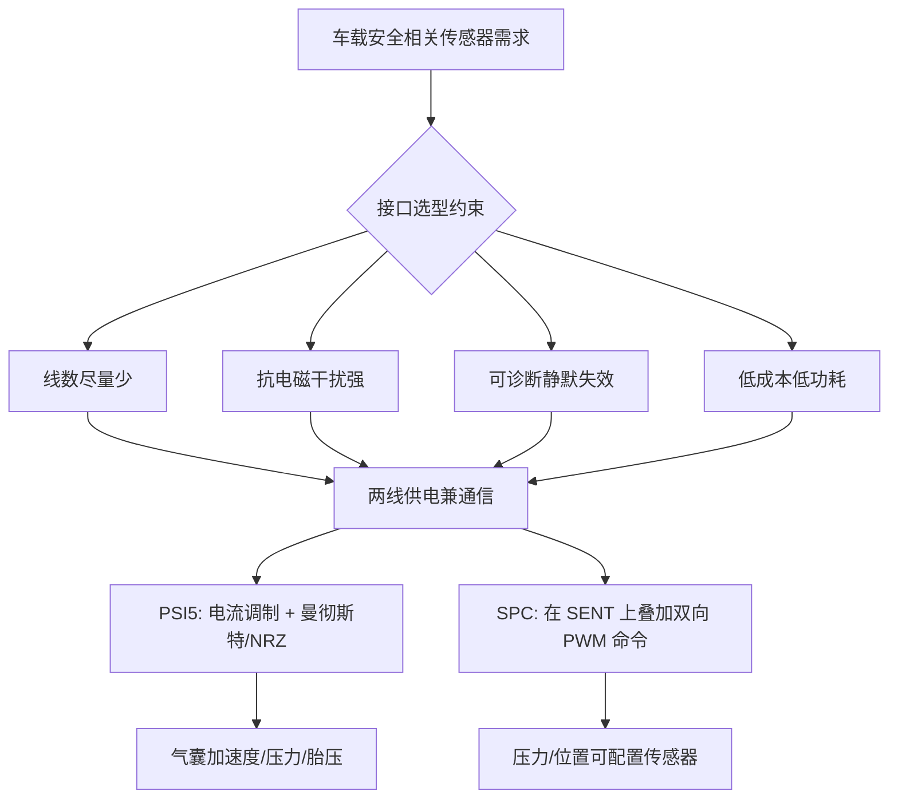

---

## 二、PSI5 物理层深度解析

### 2.1 两线怎么"既供电又通信"——频谱分离原理

PSI5 总线在物理上就是一对导线（信号线 + 回线/地），典型拓扑是**星型或总线型点到多点**。主设备（ECU/ACU）在这两线上施加一个受控的供电电压（典型 7~20V 区间，取决于传感器与线缆压降），并通过恒流或限流结构给线上提供工作电流（传感器稳态电流典型在数 mA 到十余 mA 量级，不同配置与传感器而异）。

关键技巧在于**频谱分离**：

- **供电分量**：是低频/直流电流（稳定值 I_nom），它养活传感器内部的模拟前端、MEMS 敏感元件、ASIC 与调制器。
- **数据分量**：是叠加在 I_nom 上的"电流跳变"（典型调制深度为额外叠加一个 ΔI，量级与 I_nom 相当或更高），频率在百 kbps 量级（曼彻斯特 125kbps，NRZ 189kbps）。接收端用一个串联采样电阻把电流变化转成电压变化，再经**电容隔直/高通 + 比较器/施密特触发器**恢复出数字波形。

因为直流与交流在频域可分，接收端的隔直电容把"供电直流"挡掉，只让"数据跳变"通过。这与电力线载波（PLC）的"在电线上传数据"是同一类思想，只是车载场景把速率、功耗、成本压到了极低水平。

> 类比：把两根线想成一条自来水管。恒定水流 = 供电直流；你在管口按特定节奏"掐一下、松一下"制造水涌 = 数据跳变。接收方装一个"水流感应+隔水膜"的分离器：稳定的水压去养活用水端（传感器），水流节奏被翻译成密语（数据）。

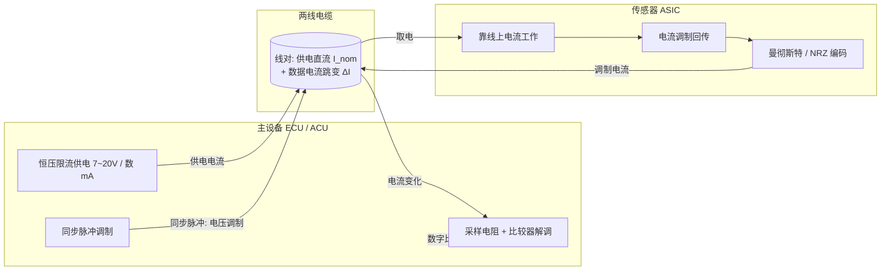

### 2.2 电流调制：数据如何"写"在供电线上

PSI5 采用**电流调制**（current modulation）作为传感器→ECU 的上行方向，而**同步脉冲（ECU→传感器）采用电压调制**——主端在供电电压上叠加一个短促的电压抬升作为同步信号。这种"下行电压调制、上行电流调制"的不对称设计非常巧妙：

1. **抗地偏移**：长距离线缆电阻会在地线上产生压降，电压信号会随负载漂移；电流信号在接收端以"采样电阻上的压降"被检测，对共模地噪声更鲁棒。
2. **天然限流**：恒流供电意味着即使传感器端发生调制短路，系统电流也被主端钳制，不会烧毁；这对安全件是重要保护。
3. **易于诊断**：断线 → 电流归零；短路 → 电流飙升；欠压/欠流 → 传感器不回传。单一电流量即可区分多种故障，诊断覆盖率天然高。
4. **方向天然隔离**：下行看电压、上行看电流，两个方向的信号在检测域上正交，主端发同步时不会"自己听见自己"，简化了收发隔离设计。

具体地，传感器内部有一个可控的电流沉（current sink）。平时它把线上电流维持在 I_nom；要发比特时，按编码规则在比特周期内切换到 I_nom+ΔI（例如在比特中点制造一次电流阶跃）。主端采样电阻（典型数十至数百 Ω 量级，按调制深度与比较器量程折中）把电流变化变成毫伏至百毫伏级电压变化，经放大与比较后还原比特。

### 2.3 编码方式：曼彻斯特 vs NRZ

PSI5 标准支持两种线路编码，工程上必须根据"自同步需求 vs 带宽需求"取舍：

- **曼彻斯特编码（Manchester）**：每一位在比特周期中点必有一次跳变，跳变方向编码 0/1（例如 低→高 表 1，高→低 表 0，具体极性由规范定义）。速率 125 kbps。
  - 优点：**自带时钟**，接收方无需独立时钟线即可锁定时序；**直流平衡**，0 与 1 的平均电平一致，利于隔直耦合与长线传输；对接收端采样相位不敏感。
  - 缺点：每位占用一个完整跳变，等效带宽两倍于数据率。
- **NRZ（Non-Return-to-Zero，不归零）编码**：用两种电流电平直接表示 0/1，位周期内不强制跳变。速率可达 189 kbps。
  - 优点：带宽利用率高，同样时间传更多数据。
  - 缺点：长连"0"或长连"1"会丢失时钟基准，需要额外的同步/训练机制（通常靠帧头的同步字段与收发双方约定），对采样时钟精度要求更高。

工程选择原则：**对时钟恢复电路简单、距离长、干扰大的安全场景，优先曼彻斯特；对短距离、高吞吐、传感器端有时钟精度的场景，可用 NRZ。**

下图给出曼彻斯特一个比特的构造方式与接收端的判决逻辑（用流程图表达波形规则，避免歧义）：

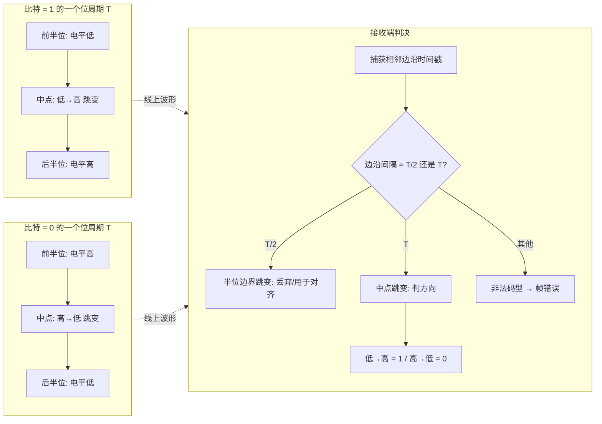

这里有一个初学者常混淆的点：**曼彻斯特连续同值比特（如 11）之间，在位边界处还会出现一次"回程跳变"**（后半位高 → 下一位前半位低）。所以接收端看到的边沿间隔只有两种合法值：T/2（位边界回程）与 T（跨过位边界直达下一个中点）。解码器正是靠"间隔分类"区分中点跳变与边界跳变——这个规则是第八章驱动代码的核心。

### 2.4 电气参数与总线拓扑（通用原理，不列具体芯片数值）

- **供电电压**：主端供电电压设计需覆盖线缆压降与传感器最低工作电压，典型规格区间约 7V 到 20V；某些扩展配置允许更高。
- **工作电流**：传感器稳态电流在数 mA 到十余 mA，主端恒流/限流能力须留余量；瞬态调制电流峰值受采样电阻与比较器量程约束。
- **拓扑**：支持点到点（异步模式常用），也支持多传感器挂在同一总线（同步模式 + 时隙调度）。总线型需注意多节点同时回传的冲突规避——由主端周期性同步脉冲划分时隙（时分多址）。
- **运行模式**：PSI5 定义了异步模式（传感器上电后自发周期回传，适合点对点）与同步模式（主端同步脉冲触发、各从端按分配时隙回传，适合总线型）；还有用于产线配置的双向模式（主端用同步脉冲的编码序列向传感器下发配置命令）。
- **线缆**：双绞线或屏蔽双绞线，依 EMC 要求；终端匹配由标准配置决定，一般靠比较器滞回与滤波而非阻抗匹配电阻。

---

## 三、PSI5 帧结构逐字段详解

### 3.1 帧的整体结构

PSI5 同步模式是**主从同步接口**：主设备先发一个同步脉冲（Sync）启动一次传输，传感器在约定的时隙延迟后回传一帧数据。一帧在逻辑上由以下字段组成：

```
[Sync 同步脉冲(主端电压调制)] | [Start 起始位 S1 S2] | [Data 数据字段 N bit] | [校验 P/CRC] | [Idle 空闲]
```

各字段含义如下表：

| 字段 | 长度（典型） | 含义与作用 |
|------|------|------|
| **Sync（同步）** | 由主端脉冲定义 | 主设备发起的电压脉冲，唤醒并界定帧起点；同时承担"对时"功能，使从端对齐时隙与采样窗口 |
| **Start（起始位）** | 2 bit（典型 "00" 码型） | 标志数据段开始的固定码型，帮助接收方确认同步成功并锁定比特边界；起始位非法即整帧作废 |
| **Data（数据字段）** | 10~28 bit（依配置） | 传感器测量值（加速度/压力/温度等），按曼彻斯特或 NRZ 编码，低位在前（LSB first）；可含状态/消息位 |
| **校验** | 1 bit 奇偶（P）或 3 bit CRC | 短帧可用奇偶校验，长帧/高安全配置用 3 位 CRC；安全件必备，覆盖数据字段，防止误判碰撞导致误点爆 |
| **Idle（空闲）** | 可变 | 帧间静默/时隙保护带，主端可在此发下一同步或调度其他从端时隙 |

### 3.2 关键字段的工程意义

- **Sync 为什么不能省**：没有同步脉冲，接收方不知道何时开始采样；同步既"界定时隙"又"对齐时间基准"。在总线型多传感器场景，主端通过统一同步脉冲 + 每个从端预分配的时隙偏移来隐式选址——各从端在自己的时隙回传，其余时间保持静默，从而避免冲突。
- **Start 是"第二道同步"**：同步脉冲对齐的是毫秒/微秒级的时隙，起始位对齐的是比特级的相位。接收端在时隙窗口内等待第一个有效边沿，用起始位的固定码型验证"我锁上的确实是帧头而不是噪声"。
- **Data 的曼彻斯特自同步**：用中点跳变方向判定 0/1，每位必跳变 → 自同步、抗直流漂移；即使接收端时钟略有偏差，只要累积漂移在半个比特周期内即可正确判读。
- **校验是安全闸门**：碰撞判定直接关系气囊点爆，单比特翻转绝不能放过。校验失败在安全件里必须走故障/降级路径，绝不可"将就用"。
- **两线供电的副收益**：线上数 mA 电流既养活传感器又承载数据，省线省连接器、降失效率，且单一电流量即可做断线/短路诊断。

### 3.3 多传感器同步与寻址

PSI5 支持在同一总线挂多个传感器（例如车身不同位置的多个碰撞加速度计）。两种常见调度方式：

1. **时隙分配（同步模式标准做法）**：主端周期发同步脉冲，每个从端按出厂/产线配置的时隙偏移（Slot）回传。简单、无地址冲突、时间确定性强，是气囊系统的主流方案。
2. **菊花链寻址（Daisy Chain）**：从端串联，上电初始化阶段主端逐级使能并分配时隙/地址，解决"同型号传感器如何区分位置"的问题；初始化完成后回到时隙调度运行。

无论哪种，**时间确定性**是核心：从端必须在同步后严格限定的时隙窗口内回传，窗口既不能太宽（噪声与相邻时隙串扰混入）也不能太窄（正常从端因时钟偏差来不及响应）。驱动层须用硬件定时器/输入捕获单元锁定回传起止，而非软件延时盲等。第七章将看到，专用 PSI5 IP 里为此内置了"时隙看门狗"硬件。

---

## 四、SPC（Short PWM Code）深度解析

### 4.1 SPC 的来源与定位

**SPC（Short PWM Code，短脉宽编码）** 由西门子（Siemens）/英飞凌（Infineon）一脉提出，是一个面向**可配置、可诊断压力/位置/角度类传感器**的双向接口。它的巧妙之处在于：**不另起炉灶，而是站在 SENT 的肩膀上**——复用 SENT 的单向帧结构，再补上"主机→从机"的命令通道。

背景是：SENT（SAE J2716）作为低成本单线传感器接口已被广泛采用（油门踏板、增压压力等），但它**只能从传感器向 ECU 单向传数据**，且传感器自由运行、ECU 只能被动接收。ECU 想要"按需触发一次测量""读传感器内部温度寄存器""在同一根线上区分多个传感器"时，SENT 无能为力。SPC 正是为补这个"回程信道"而生。

### 4.2 SPC 与 SENT 的关系：双向衍生

SENT（Single Edge Nibble Transmission）要点回顾：

- 单线（加地线与供电线，物理三线，但信号仅一线）、开漏、5V 电平；**单向**传感器→ECU。
- 以"tick"为基本时间单位（典型 3µs 上下，规范允许一定范围）。
- 帧结构：同步/校准脉冲（56 ticks）→ 状态/通信 nibble（4-bit）→ 若干数据 nibble（每 nibble 用 12~27 ticks 的下降沿间距编码 0~15）→ CRC nibble → 可选暂停脉冲（Pause Pulse）。

SPC 在 SENT 基础上增加**命令/响应（command/response）**能力，其核心机制是**主端主动拉低总线制造一个"触发脉冲"，脉冲的宽度（以 tick 计）即编码了命令**：

- 空闲时总线为高。主端（ECU）通过开漏驱动把线拉低一段受控时间——不同的低电平宽度代表不同命令：如"同步广播触发""触发地址 0/1/2/3 的传感器"（同一根线上最多挂多个传感器，靠触发脉宽选址）、"进入诊断/读附加数据"等类别。
- 被选中的从机检测到属于自己的触发脉宽后，**接管总线发出一个完整 SENT 帧**作为响应（同步脉冲 + 状态 + 数据 nibbles + CRC）。
- 因此 SPC = **SENT 帧格式 + 主端 PWM 触发命令**，把 SENT 从"传感器自由跑"变成"ECU 按需拉取（on-demand）"，同时获得单线多传感器与诊断寻址能力。

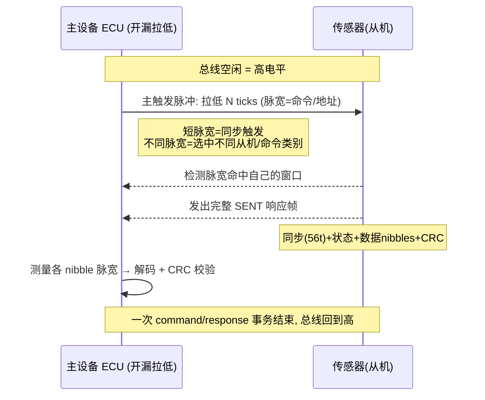

### 4.3 命令/响应机制细节（通用原理）

SPC 触发脉冲宽度以 tick 为单位划分成若干判决窗口，常见的命令类别（按功能分类，不列具体厂商命令码）：

- **同步/广播触发（Sync Trigger）**：请求默认传感器立即回传一帧测量值——这是最常用的"按需采样"模式，使 ECU 能把采样时刻与自己的控制周期对齐（这对控制算法的相位一致性价值巨大）。
- **单元寻址触发（ID-Selective Trigger）**：同一根线上挂 2~4 个传感器时，用不同脉宽点名某一个回传，实现单线多传感器。
- **诊断/扩展数据请求**：请求从机在响应帧中携带温度、序列号、内部状态等扩展数据。
- **配置/校准会话**：产线场景下进入配置模式，读写内部寄存器（量程、滤波、零点）。

由于命令仅是"一个受控宽度的低脉冲"，从机只需一个定时器捕获脉冲宽度即可解码，硬件代价极低——这也是 SPC 被大量压力/位置传感器采纳的原因：既保留 SENT 的廉价单向通路，又几乎不增加成本地获得双向可配置性。**但要注意：SPC 的"双向"是半双工的、主端只有"触发+选择"级别的下行带宽，它不是一条对称的命令总线**——这一定位差异决定了它与 PSI5 双向模式、LIN 等的选型边界。

---

## 五、SPC 与 SENT 的关系与差异（单向 vs 双向）

把三者（SENT、SPC、PSI5）放在一起对比，能最清楚地看到技术谱系：

| 维度 | SENT (SAE J2716) | SPC (Short PWM Code) | PSI5 |
|------|------|------|------|
| 提出/主导 | SAE 标准（通用汽车界） | 西门子/英飞凌 | PSI5 联盟（博世、大陆等） |
| 信号线数 | 1 信号线（+电源+地） | 1 信号线（+电源+地） | **两线供电通信一体** |
| 供电方式 | 传感器需独立供电线 | 传感器需独立供电线 | **主端经两线供电** |
| 通信方向 | **单向**（传感器→ECU，自由运行） | **双向**（主触发命令+从响应） | 主从同步（ECU 同步脉冲发起）+ 可选双向配置 |
| 编码 | 下降沿间距 nibble 脉宽 | SENT 帧 + 主端触发脉宽命令 | 曼彻斯特 / NRZ 电流调制 |
| 检测量 | 电压（开漏电平） | 电压（开漏电平） | 上行电流 / 下行电压 |
| 速率 | 中（µs 级 tick） | 同 SENT（按需触发） | 125kbps(曼彻斯特)/189kbps(NRZ) |
| 单线多传感器 | 否 | **是（脉宽寻址 2~4 个）** | 是（时隙调度） |
| 典型应用 | 油门踏板、增压压力 | 制动压力、位置/角度 | 气囊加速度/压力、胎压 |
| 安全等级适配 | QM~ASIL-B（需配合措施） | QM~ASIL-B/C | **高 ASIL（安全件首选）** |
| 成本 | 极低 | 低 | 低~中 |

**一句话区分**：SENT 是"传感器只会自顾自报数"的单线协议；SPC 是"ECU 能点名、能按需拉取"的双向 SENT；PSI5 是"连电源线都合并了、顺电源线爬数据回来"的两线安全接口。

---

## 六、应用实例：气囊加速度计、胎压、制动压力

### 6.1 气囊碰撞加速度计（PSI5 主战场）

在 ACU 中，多个 MEMS 加速度计分布于车身前纵梁、B 柱、中央通道。它们通过 PSI5 两线把加速度值周期回传给 ACU（同步模式，典型 500µs 级同步周期，每周期每从端一帧）。ACU 在检测到时隙窗口内的有效帧、且校验正确、且加速度特征满足点爆算法（多传感器融合 + 积分判据）时，才进入气囊点爆序列。由于 PSI5 的断线/短路可诊断、CRC 防误判、时隙确定性强，满足了 ASIL-D 对"单点故障可检测"的严苛要求。

### 6.2 胎压监测与其他底盘传感

直接式无线 TPMS 依赖电池供电与射频上报，不属于 PSI5 范畴；但在需要把压力/加速度信号纳入整车安全域（如侧翻检测、行人保护压力管）的**有线**场景中，PSI5 的两线供电、确定性与可诊断性优于模拟接口。行人保护系统（PPS）的压力软管传感器就是 PSI5 的典型增量应用。

### 6.3 制动液压压力传感器（SPC/SENT 主战场）

制动主缸/轮缸压力是 ESC、ABS 的关键输入。这类传感器常采用 SENT 或 SPC：ECU 既能按需触发读取压力（SPC 主触发，把采样对齐到控制周期），又能在下线标定或在线诊断时请求扩展帧读取温度、做零点校准。既保证实时性与相位一致性，又具备可配置性。

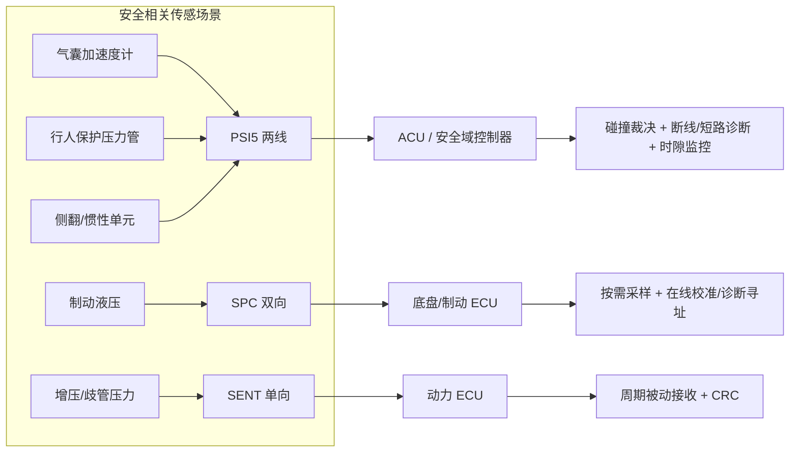

---

## 七、芯片模块设计：PSI5/SPC 接收 IP 内部架构（核心新增）

市面上支持 PSI5 的 MCU（多见于安全域/气囊专用 MCU）通常集成专用 PSI5 外设；不带专用外设的 MCU 则用"片上模拟比较器 + 定时器捕获"拼出等效功能。无论哪种形态，其内部逻辑结构高度一致。本节笔者以一个**通用 PSI5/SPC 接收 IP** 的视角，把这套硬件从引脚到中断完整拆开。以下框图与寄存器均为通用示意，符合业界常见实现逻辑，不对应任何具体型号。

### 7.1 IP 顶层框图：从两根线到一个中断

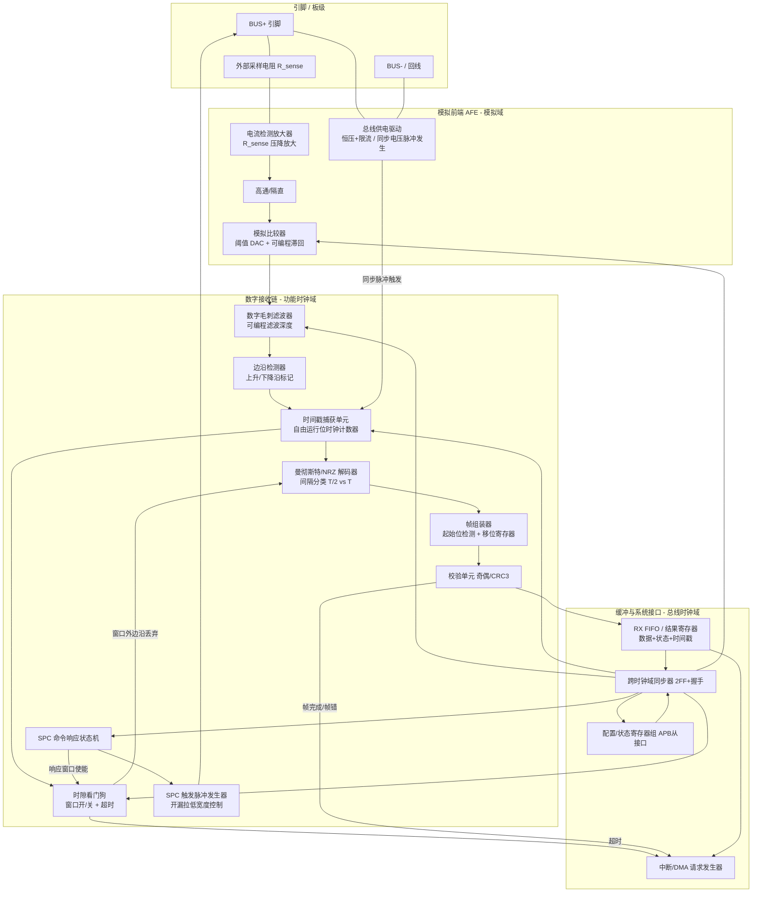

这张图值得逐级细读，它就是"电流如何变成中断"的完整旅程：

**① 总线供电驱动（LDO/驱动级）**：主端 IP 的发送侧。它做两件事：常态输出受控供电电压并限流；发同步时在输出电压上叠加一个受控幅度、受控宽度的电压脉冲（下行电压调制）。同步脉冲的产生时刻同时打一枪给时间戳捕获单元——**"同步发出的那一拍"就是本周期所有时隙计时的零点**，这保证了时隙测量不受软件抖动影响。

**② 电流检测放大器 + 高通**：R_sense 上的压降是"供电直流 + 数据交流"的叠加，先经仪表放大器放大，再经高通/隔直去掉直流分量，只留调制摆幅。部分实现把 R_sense 集成在片内（精度受限），高安全设计倾向外置精密电阻。

**③ 模拟比较器（阈值 DAC + 滞回）**：把模拟摆幅整形成数字电平。两个关键可编程量：**阈值**（由片内 DAC 提供，软件按调制深度设定判决门限）与**滞回**（施密特特性，防止信号在阈值附近抖动导致多次误翻转）。这是整条链路上"模拟世界与数字世界的分界线"。

**④ 数字毛刺滤波器**：比较器输出仍可能带纳秒~微秒级毛刺（EMC 注入、开关瞬态）。滤波器要求电平必须稳定保持 N 个功能时钟周期才被承认，N 可编程。滤波深度的选取是典型权衡：太浅滤不掉毛刺，太深会吞掉合法的窄脉冲（尤其 NRZ 189kbps 下半位仅约 2.6µs）。

**⑤ 边沿检测 + 时间戳捕获**：对滤波后的信号打上升/下降沿标记，并用一个自由运行计数器（分辨率典型为位周期的 1/16~1/64）记录每个边沿的时刻。**注意：捕获的是时间戳而非"当前电平轮询"**——这使解码完全基于边沿间隔，对中断延迟不敏感。

**⑥ 曼彻斯特/NRZ 解码器**：对相邻边沿间隔做窗口分类（T/2±容差 → 边界回程沿；T±容差 → 中点沿；其他 → 码型错误），按 2.3 节规则还原比特流。NRZ 模式下则按位周期对采样计数值判电平。容差窗口可编程，以吸收从端振荡器偏差。

**⑦ 帧组装器 + 校验单元**：检测起始位码型 → 按配置的帧长（数据位数）移位收集 → 硬件并行计算奇偶/CRC → 与收到的校验位比对。结果打包为"数据 + 状态标志（校验错/码型错/超时）+ 时间戳"写入 FIFO。

**⑧ 时隙看门狗**：从同步零点起，为每个从端配置 [窗口开, 窗口关] 两个计数值。窗口外出现的任何边沿被硬件丢弃并置"时隙违例"标志；窗口关闭仍未收满一帧则置"超时"标志。**时隙纪律由硬件执行，软件只看结果**——这是安全件"时间确定性"在硅片上的体现。

**⑨ SPC 状态机与触发发生器**：SPC 模式下（复用同一套捕获/解码资源，但检测量换成电压、编码换成 SENT 脉宽），状态机驱动开漏发生器拉低总线产生命令脉宽，然后自动打开响应窗口，等待从端 SENT 帧，解码 nibble 并校验 CRC。详见 7.3。

**⑩ FIFO / 中断 / DMA**：FIFO 深度典型 4~16 帧，每项含数据、状态、时隙号、时间戳。中断源包括：帧完成、FIFO 水位、校验错、超时、时隙违例、总线欠流/过流（来自 AFE 的诊断比较器）。支持 DMA 时，帧结果可直接搬运到内存环形缓冲，实现零拷贝接收。

### 7.2 时钟域与复位域

一个规范的 PSI5 IP 至少有两个时钟域：

- **总线时钟域（PCLK）**：CPU 经 APB/AHB 访问寄存器所在的域，随系统总线频率。
- **功能时钟域（FCLK）**：捕获计数器、解码器、时隙看门狗所在的域。它必须由一个**独立、稳定、可预分频**的时钟源驱动（通常来自主 PLL 的专用分支），因为位周期测量精度直接取决于它。规范上要求整条链路的时基误差与从端振荡器偏差之和仍落在解码容差窗内。

两域之间所有控制信号经两级触发器同步（2FF），数据经握手或异步 FIFO 跨域——这就是框图中 CDC 块的职责。复位方面通常提供三层：系统复位（复位全部）、软件复位（寄存器位触发，复位功能逻辑但保留配置）、通道复位（只复位某通道的状态机与 FIFO，用于运行期错误恢复）。**驱动在错误恢复路径里应优先用通道复位而非全局复位，避免影响同 IP 上其他正常通道**——这是笔者在项目里踩过的实坑：全局软复位把另一路正常传感器的帧也冲掉了，引发不必要的 DTC。

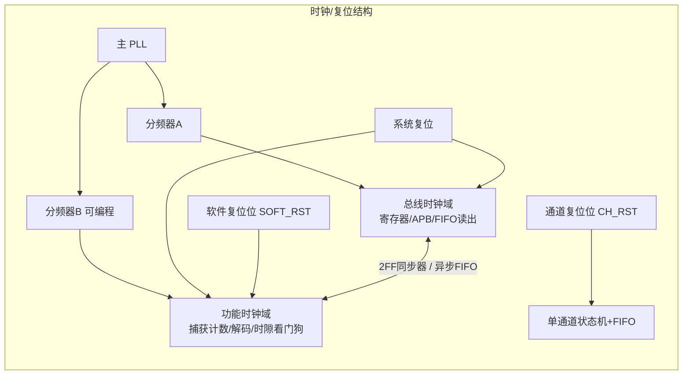

### 7.3 SPC 命令响应状态机

SPC 事务的硬件状态机是本 IP 的另一核心。它把"主发命令 → 从响应窗口 → 解码 → 交付"整个事务固化在硬件里，软件只需写一个命令寄存器、等一个完成中断：

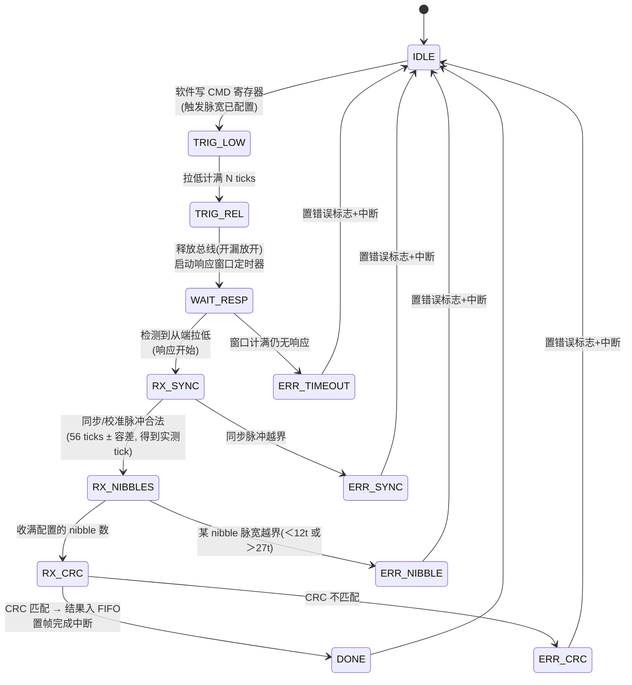

几个设计要点：

- **tick 再校准**：从端响应帧的同步脉冲名义上是 56 ticks，硬件用实测宽度除以 56 得到从端实际 tick，后续所有 nibble 判决都用这个实测 tick 归一化——这正是 SENT 家族容忍从端时钟 ±20% 级偏差的机制，必须在硬件（或驱动）里如实实现。
- **响应窗口**：从"释放总线"到"从端必须开始响应"之间有规范约定的最大延迟；窗口定时器超时即判从端失效，避免软件死等。
- **总线冲突保护**：TRIG_LOW 期间若检测到总线未被拉低到位（如对地短路已存在），状态机直接进错误态，不进入等待——防止把线路故障误判为从端超时。

### 7.4 寄存器与位域设计（通用示意）

下面给出一个通道的最小寄存器集。位域安排遵循常见工程惯例：控制位从低位开始、使能类靠低位、软复位放最高位、状态寄存器读清（RC）或写 1 清（W1C）。

**通道控制寄存器 PSI5_CH_CTRL（32bit，通用示意）：**

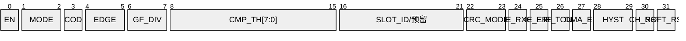

| 位域 | 名称 | 复位值 | 含义 |
|------|------|--------|------|
| bit0 | EN | 0 | 通道使能。置 1 后 AFE 上电、计数器启动 |
| bit2:1 | MODE | 00 | 00=PSI5 同步模式，01=PSI5 异步模式，10=SPC 主模式，11=保留 |
| bit3 | COD | 0 | 编码选择：0=曼彻斯特(125k)，1=NRZ(189k)。SPC 模式下忽略 |
| bit5:4 | EDGE | 11 | 捕获边沿：01=上升，10=下降，11=双沿（曼彻斯特必须双沿） |
| bit7:6 | GF_DIV | 01 | 毛刺滤波深度：电平需稳定 4/8/16/32 个功能时钟才被承认 |
| bit15:8 | CMP_TH | 0x80 | 比较器阈值 DAC 码，按调制深度与 R_sense 换算设定 |
| bit21:16 | SLOT_ID | 0 | 本通道监听的时隙号（多从端总线时使用） |
| bit23:22 | CRC_MODE | 01 | 00=无校验(仅调试)，01=奇偶，10=CRC3，11=SENT CRC4(SPC 模式) |
| bit24 | IE_RXC | 0 | 帧完成中断使能 |
| bit25 | IE_ERR | 0 | 错误（码型/校验/时隙违例）中断使能 |
| bit26 | IE_TOUT | 0 | 超时中断使能 |
| bit27 | DMA_EN | 0 | 帧结果 DMA 搬运使能 |
| bit29:28 | HYST | 01 | 比较器滞回档位 |
| bit30 | CH_RST | 0 | 写 1 复位本通道状态机与 FIFO，自动清零 |
| bit31 | SOFT_RST | 0 | 写 1 复位整个 IP 功能域（保留配置寄存器），自动清零 |

**通道状态寄存器 PSI5_CH_STAT（32bit，W1C 语义，通用示意）：**

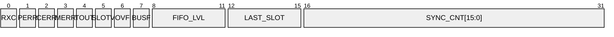

| 位域 | 名称 | 语义 | 含义 |
|------|------|------|------|
| bit0 | RXC | W1C | 帧接收完成（FIFO 有新数据） |
| bit1 | PERR | W1C | 奇偶校验错 |
| bit2 | CERR | W1C | CRC 校验错 |
| bit3 | MERR | W1C | 曼彻斯特码型错误（非法边沿间隔/起始位非法） |
| bit4 | TOUT | W1C | 时隙窗口超时，无完整帧 |
| bit5 | SLOTV | W1C | 时隙违例（窗口外检测到边沿） |
| bit6 | OVF | W1C | FIFO 溢出，最旧帧被丢弃 |
| bit7 | BUSF | W1C | 总线故障（欠流=疑似断线 / 过流=疑似短路，来自 AFE 诊断比较器） |
| bit11:8 | FIFO_LVL | RO | 当前 FIFO 内帧数 |
| bit15:12 | LAST_SLOT | RO | 最近完成帧所属时隙号 |
| bit31:16 | SYNC_CNT | RO | 已发出的同步脉冲计数（用于帧计数一致性监控） |

**数据寄存器 PSI5_CH_DATA（FIFO 出口，读一次弹出一项）**：低 28 位为数据字段（右对齐），bit28~30 复制该帧的 PERR/CERR/MERR 快照（**数据与其错误标志必须原子地在同一寄存器读出**，否则中断与读取之间的竞态会导致"数据配错标志"——这是寄存器接口设计的经典陷阱），bit31 为有效位。

**时序寄存器 PSI5_CH_TIMING**：同步脉冲宽度、同步周期、各时隙 [开窗, 关窗] 计数值、解码容差窗口（T/2 与 T 的接受范围）、SPC 响应窗口长度——全部以功能时钟周期为单位。

### 7.5 无专用外设时：比较器 + 通用定时器的"穷人方案"

大量项目所用 MCU 并无 PSI5 外设，此时用片上资源拼装：

- **片上模拟比较器**（或外部比较器芯片）承担 AFE 输出整形，阈值用片上 DAC 或电阻分压给出；
- **通用定时器的输入捕获通道（IC/ICU）**承担边沿时间戳捕获，配置为双沿捕获 + DMA 搬运时间戳数组；
- **另一个定时器通道**做时隙窗口与超时定时；
- **解码、校验、时隙判决全部由软件完成**（即第八章的驱动代码）。

这套方案的代价是 CPU 负载与抖动敏感性：125kbps 曼彻斯特意味着最密约 4µs 一个边沿，靠中断逐边沿处理在多通道时不现实，**必须用 DMA 批量搬时间戳、按帧成批解码**。专用 IP 与穷人方案的取舍见下表：

| 维度 | 专用 PSI5/SPC 外设 | 比较器+定时器+软件解码 |
|------|-------------------|------------------------|
| CPU 负载 | 极低（帧级中断） | 高（边沿级数据量，需 DMA 缓解） |
| 时隙纪律 | 硬件看门狗保证 | 软件保证，受调度抖动影响 |
| 解码容差控制 | 硬件窗口，精确 | 软件窗口，依赖时间戳精度 |
| 多通道扩展 | 通道数固定 | 受定时器/DMA 资源限制 |
| 认证/安全论证 | IP 级安全手册支持 | 需自行论证软件解码的失效模式 |
| 成本 | 需选带外设的 MCU | 通用 MCU 即可 |

### 7.6 PSI5 对同步与抗扰的硬件要求小结

- **同步零点必须硬件化**：同步脉冲发出时刻由硬件打点，时隙全部以此为基准，软件不得参与计时。
- **判决三件套**：可编程阈值 + 滞回 + 数字毛刺滤波，三者共同决定误码率；EMC 摸底时应把这三个参数纳入扫描矩阵。
- **容差窗口显式化**：T/2 与 T 的接受窗口必须可配置且写入配置文档，它同时约束了允许的从端时钟偏差与线缆色散。
- **错误必须落到可读寄存器**：每一种失效（码型/校验/超时/违例/溢出/总线故障）都要有独立标志位，这是诊断覆盖率论证（第十五章 FMEA）的硬件基础。

---

## 八、驱动代码实现：从边沿时间戳到应用数据（核心新增）

本章给出一套完整、可读、平台无关的 C 驱动骨架，覆盖"穷人方案"（比较器+定时器捕获+软件解码）与 SPC 主模式。代码可直接映射到任意具备输入捕获定时器的 MCU；寄存器访问被收拢在硬件抽象层，方便移植到专用 PSI5 外设。

### 8.1 硬件抽象层：比较器与定时器捕获接口

```c
/* ============================================================
 * psi5_hal.h / psi5_hal.c —— 硬件抽象层
 * 职责: 屏蔽具体 MCU 的比较器/定时器/DMA 寄存器差异
 * ============================================================ */
#include <stdint.h>
#include <stdbool.h>

#define PSI5_MAX_EDGES   256u   /* 单帧窗口内最多缓存的边沿数 */

typedef enum {
    HAL_EDGE_RISING  = 1,
    HAL_EDGE_FALLING = 2,
    HAL_EDGE_BOTH    = 3
} hal_edge_t;

/* 一次边沿捕获记录: 时间戳 + 极性 */
typedef struct {
    uint32_t ts;        /* 捕获计数器值, 单位: 功能时钟周期 */
    uint8_t  rising;    /* 1=上升沿, 0=下降沿 */
} hal_edge_rec_t;

/* --- 比较器: 把 R_sense 上的电流摆幅整形为数字电平 --- */
void hal_cmp_init(uint8_t threshold_dac, uint8_t hysteresis_sel)
{
    /* 1. 使能比较器电源, 等待建立时间 (轮询 ready 位)      */
    /* 2. 写阈值 DAC: threshold_dac 按 ΔI*R_sense*增益 换算   */
    /* 3. 选滞回档位: 防止阈值附近噪声引起多次翻转           */
    /* 4. 比较器输出内部路由到定时器捕获输入 (无需引脚外绕)  */
    CMP->CR = (uint32_t)threshold_dac << 8
            | (uint32_t)hysteresis_sel << 28
            | 1u;                       /* EN 位 */
    while (!(CMP->SR & CMP_SR_READY)) { /* 等待模拟建立 */ }
}

/* --- 定时器捕获: 双沿 + DMA 批量搬运时间戳 --- */
void hal_cap_init(hal_edge_t edges, uint8_t glitch_filter_div)
{
    TIM->PSC   = 0;                     /* 不分频: 捕获分辨率=功能时钟 */
    TIM->CCMR  = TIM_CCMR_IC_MAP        /* 通道映射到比较器输出       */
               | (uint32_t)glitch_filter_div << 4; /* 数字滤波深度    */
    TIM->CCER  = (edges & HAL_EDGE_RISING  ? TIM_CCER_RISE : 0u)
               | (edges & HAL_EDGE_FALLING ? TIM_CCER_FALL : 0u);
    TIM->DIER |= TIM_DIER_CCDE;         /* 捕获事件触发 DMA           */
    /* DMA: 外设→内存, 循环模式, 每次搬 CCR(时间戳)+极性到环形缓冲 */
    dma_setup_circular(&TIM->CCR, g_edge_buf, PSI5_MAX_EDGES);
    TIM->CR1  |= TIM_CR1_CEN;           /* 自由运行计数器启动         */
}

/* --- 时隙窗口定时: 输出比较产生开窗/关窗/超时事件 --- */
void hal_slot_arm(uint32_t open_ticks, uint32_t close_ticks)
{
    TIM_SLOT->CCR1 = open_ticks;        /* 窗口开: 使能捕获 DMA       */
    TIM_SLOT->CCR2 = close_ticks;       /* 窗口关: 冻结缓冲, 触发解码 */
    TIM_SLOT->CNT  = 0;                 /* 与同步脉冲发出同刻清零     */
    TIM_SLOT->CR1 |= TIM_CR1_CEN;
}

/* --- 同步脉冲: 电压调制由供电驱动级执行, 此处只给触发 --- */
void hal_sync_pulse_fire(uint32_t width_ticks)
{
    PWR_DRV->SYNC_W = width_ticks;      /* 同步脉冲宽度               */
    PWR_DRV->CR    |= PWRDRV_CR_FIRE;   /* 发出, 硬件同时清零时隙计数 */
}
```

### 8.2 PSI5 接收驱动：边沿间隔分类 → 曼彻斯特解码 → nibble 提取

这是整套驱动的心脏。核心思想在 2.3 节已铺垫：**曼彻斯特解码 = 边沿间隔分类问题**。合法间隔只有 T/2（位边界回程沿）与 T（直达下一中点的沿）两类；解码器维护"当前是否停在中点"这个相位状态，即可流式还原比特。

```c
/* ============================================================
 * psi5_decode.c —— 曼彻斯特解码 + 帧提取
 * 输入: 时隙窗口内捕获的边沿记录数组 (由 DMA 填充)
 * 输出: 解码后的帧 (起始位校验 + 数据位 + 校验位)
 * ============================================================ */
#define T_BIT       (F_CLK_HZ / 125000u)   /* 一个位周期的计数值      */
#define T_HALF      (T_BIT / 2u)
#define TOL         (T_BIT / 8u)           /* 容差窗口 ±12.5%, 可配置 */

typedef enum { INTV_HALF, INTV_FULL, INTV_ILLEGAL } intv_class_t;

static intv_class_t classify(uint32_t dt)
{
    if (dt + TOL >= T_HALF && dt <= T_HALF + TOL) return INTV_HALF;
    if (dt + TOL >= T_BIT  && dt <= T_BIT  + TOL) return INTV_FULL;
    return INTV_ILLEGAL;
}

typedef struct {
    uint32_t data;       /* 右对齐的数据位 (LSB first 已还原)  */
    uint8_t  nbits;      /* 实际解码位数                       */
    uint8_t  err;        /* 0=OK, 其他见 PSI5_ERR_xxx          */
} psi5_frame_raw_t;

#define PSI5_ERR_NONE      0u
#define PSI5_ERR_CODING    1u   /* 非法边沿间隔          */
#define PSI5_ERR_START     2u   /* 起始位码型不符        */
#define PSI5_ERR_SHORT     3u   /* 位数不足帧长          */
#define PSI5_ERR_PARITY    4u
#define PSI5_ERR_CRC       5u
#define PSI5_ERR_TIMEOUT   6u

/* 曼彻斯特流式解码:
 * 相位规则(以"中点沿"为锚):
 *   - 处于中点后, 若下一个沿间隔=T   → 该沿又是中点沿, 直接出 1 bit
 *   - 处于中点后, 若下一个沿间隔=T/2 → 这是位边界回程沿, 不出 bit,
 *     其后必须再来一个 T/2 间隔的沿才是下一个中点沿
 * 每个中点沿的极性即比特值: 上升沿=1, 下降沿=0 (极性依规范可反转) */
int psi5_manchester_decode(const hal_edge_rec_t *e, int n,
                           uint8_t *bits, int maxbits)
{
    int nb = 0;
    bool at_mid = false;         /* 是否锚定在某个中点沿之后        */
    bool pending_half = false;   /* 已见到一个 T/2 回程沿, 等第二个  */

    for (int i = 1; i < n && nb < maxbits; i++) {
        uint32_t dt = e[i].ts - e[i-1].ts;   /* 无符号回绕安全       */
        intv_class_t c = classify(dt);
        if (c == INTV_ILLEGAL) return -(int)PSI5_ERR_CODING;

        if (!at_mid) {
            /* 尚未锚定: 第一个沿默认按中点尝试 (起始位码型稍后验证) */
            at_mid = true;
            bits[nb++] = e[i-1].rising ? 1u : 0u;
            i--;                 /* 让当前沿重新参与下一轮间隔判定    */
            continue;
        }
        if (!pending_half) {
            if (c == INTV_FULL) {            /* 中点→中点            */
                bits[nb++] = e[i].rising ? 1u : 0u;
            } else {                          /* 中点→边界回程        */
                pending_half = true;
            }
        } else {
            if (c != INTV_HALF)               /* 回程后必须半位到中点 */
                return -(int)PSI5_ERR_CODING;
            bits[nb++] = e[i].rising ? 1u : 0u;
            pending_half = false;
        }
    }
    if (pending_half) return -(int)PSI5_ERR_CODING; /* 悬空回程沿 */
    return nb;
}

/* 帧提取: 验证起始位 "0,0" → 收集数据位 → 剥离校验位 */
int psi5_frame_extract(const uint8_t *bits, int nbits,
                       uint8_t data_len, psi5_frame_raw_t *out)
{
    if (nbits < 2 + data_len + 1) { out->err = PSI5_ERR_SHORT; return -1; }
    if (bits[0] != 0u || bits[1] != 0u) {      /* 起始位固定码型 */
        out->err = PSI5_ERR_START; return -1;
    }
    uint32_t v = 0;
    for (int i = 0; i < data_len; i++)          /* LSB first 还原  */
        v |= (uint32_t)bits[2 + i] << i;
    out->data  = v;
    out->nbits = data_len;
    out->err   = PSI5_ERR_NONE;
    /* 校验位在 bits[2+data_len ...], 交由 psi5_check() 处理 */
    return 0;
}
```

### 8.3 校验实现：奇偶与 CRC（位串 CRC，含残值校验法）

```c
/* ============================================================
 * psi5_crc.c —— 奇偶 / CRC 校验
 * PSI5 长帧用 3 位 CRC; SPC(SENT) 用 4 位 nibble CRC。
 * 多项式写法为通用示意, 量产以所用规范配置为准。
 * ============================================================ */

/* 偶校验: 数据位与校验位中 1 的总数应为偶数 */
bool psi5_parity_ok(uint32_t data, uint8_t nbits, uint8_t pbit)
{
    uint32_t x = data & ((nbits >= 32) ? 0xFFFFFFFFu
                                       : ((1u << nbits) - 1u));
    x ^= (uint32_t)pbit;
    x ^= x >> 16; x ^= x >> 8; x ^= x >> 4; x ^= x >> 2; x ^= x >> 1;
    return (x & 1u) == 0u;      /* 偶校验: 异或和为 0 即通过 */
}

/* 位串 CRC: 逐位模2除法。crc_bits=3 时 poly 传入低3位有效的生成式。
 * 校验方法(残值法): 把 [数据位 || 收到的CRC] 一起送入,
 * 若结果为 0 则通过 —— 免去"再比对"一步, 也是硬件常用做法。 */
uint8_t psi5_crc_bits(const uint8_t *bits, int nbits,
                      uint8_t poly, uint8_t crc_bits, uint8_t init)
{
    uint8_t crc  = init & ((1u << crc_bits) - 1u);
    uint8_t topb = (uint8_t)(1u << (crc_bits - 1));
    for (int i = 0; i < nbits; i++) {
        uint8_t fb = ((crc & topb) ? 1u : 0u) ^ (bits[i] & 1u);
        crc = (uint8_t)(crc << 1);
        if (fb) crc ^= poly;
        crc &= (uint8_t)((1u << crc_bits) - 1u);
    }
    return crc;
}

/* SENT/SPC 的 4 位 CRC 以 nibble 为单位, 常用查表+迭代实现:
 * 种子 0x5, 对每个数据 nibble: crc = table[crc] ^ nibble,
 * 最后再走一轮空 nibble。表由生成式展开, 此处为通用示意。 */
uint8_t sent_crc4(const uint8_t *nib, int n)
{
    static const uint8_t tbl[16] = { 0,13,7,10,14,3,9,4,1,12,6,11,15,2,8,5 };
    uint8_t crc = 5u;                    /* 规范种子 */
    for (int i = 0; i < n; i++)
        crc = tbl[crc] ^ (nib[i] & 0x0Fu);
    crc = tbl[crc];                      /* 收尾一轮 */
    return crc & 0x0Fu;
}
```

### 8.4 数据合成与多传感器同步：从帧到工程量

单帧解码正确只是第一步；量产驱动还要完成**多从端时隙管理、帧计数一致性、量纲换算与新鲜度管理**：

```c
/* ============================================================
 * psi5_core.c —— 通道管理 / 多传感器同步 / 数据合成
 * ============================================================ */
#define PSI5_MAX_SLOTS   4u

typedef struct {
    /* 静态配置 (来自第九章的生成配置) */
    uint32_t slot_open;      /* 时隙开窗计数 (自同步零点)         */
    uint32_t slot_close;     /* 时隙关窗计数                       */
    uint8_t  data_len;       /* 数据位数 10..28                    */
    uint8_t  crc_mode;       /* 0=奇偶 1=CRC3                      */
    int32_t  offset_q;       /* 量纲换算: 物理值 = (raw-offset)*k  */
    int32_t  gain_q15;       /* 增益, Q15 定点                     */
    uint8_t  tol_frames;     /* 允许连续坏帧数, 超过则通道降级     */
    /* 运行状态 */
    uint32_t good_cnt, bad_cnt;
    uint8_t  bad_streak;     /* 当前连续坏帧数                     */
    uint8_t  state;          /* CH_OK / CH_DEGRADED / CH_FAILED    */
    int32_t  last_value;     /* 最近一次合成的物理量 (定点)        */
    uint32_t last_sync_no;   /* 该值对应的同步周期号 → 新鲜度      */
} psi5_ch_t;

static psi5_ch_t g_ch[PSI5_MAX_SLOTS];
static uint32_t  g_sync_no;              /* 全局同步周期计数        */

/* 每个同步周期由周期性硬件定时触发: 发同步 → 布窗 */
void psi5_cycle_start(void)
{
    g_sync_no++;
    hal_sync_pulse_fire(SYNC_WIDTH_TICKS);
    for (uint32_t s = 0; s < PSI5_MAX_SLOTS; s++)
        hal_slot_arm(g_ch[s].slot_open, g_ch[s].slot_close);
}

/* 时隙关窗回调: 对该时隙缓冲的边沿成批解码并合成数据 */
void psi5_slot_close_cb(uint32_t slot,
                        const hal_edge_rec_t *edges, int n_edges)
{
    psi5_ch_t *ch = &g_ch[slot];
    uint8_t  bits[64];
    psi5_frame_raw_t fr;
    int nb = psi5_manchester_decode(edges, n_edges, bits, 64);

    uint8_t err = PSI5_ERR_NONE;
    if (n_edges == 0)                      err = PSI5_ERR_TIMEOUT;
    else if (nb < 0)                       err = (uint8_t)(-nb);
    else if (psi5_frame_extract(bits, nb, ch->data_len, &fr) != 0)
                                           err = fr.err;
    else if (ch->crc_mode == 0
          && !psi5_parity_ok(fr.data, ch->data_len,
                             bits[2 + ch->data_len]))
                                           err = PSI5_ERR_PARITY;
    else if (ch->crc_mode == 1
          && psi5_crc_bits(&bits[2], ch->data_len + 3,
                           CRC3_POLY, 3, CRC3_INIT) != 0u)
                                           err = PSI5_ERR_CRC;

    if (err == PSI5_ERR_NONE) {
        /* 数据合成: 原始码 → 有符号 → 量纲换算 (Q15 定点乘) */
        int32_t raw = (int32_t)fr.data;
        if (raw & (1 << (ch->data_len - 1)))          /* 符号扩展 */
            raw -= (1 << ch->data_len);
        ch->last_value   = (int32_t)(((int64_t)(raw - ch->offset_q)
                                      * ch->gain_q15) >> 15);
        ch->last_sync_no = g_sync_no;
        ch->good_cnt++; ch->bad_streak = 0;
        if (ch->state == CH_DEGRADED) ch->state = CH_OK; /* 自恢复 */
    } else {
        psi5_error_handle(slot, err);       /* 见 8.6 */
    }
}

/* 应用读取接口: 值 + 新鲜度一并交付, 供安全裁决判断可用性 */
bool psi5_read(uint32_t slot, int32_t *value, uint32_t *age_cycles)
{
    psi5_ch_t *ch = &g_ch[slot];
    if (ch->state == CH_FAILED) return false;
    *value      = ch->last_value;
    *age_cycles = g_sync_no - ch->last_sync_no;  /* 0=本周期新鲜 */
    return true;
}
```

注意两处安全设计：**新鲜度（age）随值交付**——上层算法据此拒绝陈旧数据，避免"通道悄悄停更但旧值一直被用"的静默失效；**通道自恢复只允许从 DEGRADED 回 OK**，FAILED 态必须由诊断管理器显式复位，防止间歇性故障反复"洗白"。

### 8.5 SPC 主模式驱动：触发命令 → 响应窗口 → nibble 解码

```c
/* ============================================================
 * spc_master.c —— SPC 主模式: 发触发脉宽 + 收 SENT 响应帧
 * 物理: 开漏输出拉低总线; 输入捕获测下降沿间距(SENT 规则)
 * ============================================================ */
#define SPC_TICK_US        3u          /* 名义 tick, 从端实测再校准   */
#define SPC_RESP_TIMEOUT   (1000u)     /* 响应窗口上限, 单位 tick     */

typedef struct {
    uint8_t nibbles[8];    /* 状态 + 数据 nibbles                */
    uint8_t n;             /* 数据 nibble 数                     */
    uint8_t status;        /* 状态 nibble                        */
    uint8_t err;           /* 0=OK                               */
} spc_resp_t;

/* 发触发: trig_ticks 编码命令/从机地址 (脉宽选址) */
static void spc_send_trigger(uint32_t trig_ticks)
{
    od_drive_low();                        /* 开漏拉低            */
    hal_delay_ticks(trig_ticks * SPC_TICK_US);
    od_release();                          /* 释放, 等从机接管    */
}

/* 收响应: 捕获下降沿序列, 按 SENT 规则解码 nibble */
int spc_transaction(uint32_t trig_ticks, uint8_t n_nibbles,
                    spc_resp_t *rsp)
{
    hal_edge_rec_t e[32];
    spc_send_trigger(trig_ticks);
    hal_cap_start_falling(e, 32);          /* 只捕获下降沿        */

    /* 1. 等首个下降沿 = 响应开始; 超时判从机失效 */
    if (!hal_wait_edges(1, SPC_RESP_TIMEOUT * SPC_TICK_US))
        { rsp->err = SPC_ERR_TIMEOUT; return -1; }

    /* 2. 同步/校准脉冲: 两个下降沿间距应为 56 tick,
     *    用实测值反算从端真实 tick (吸收 ±20% 时钟偏差) */
    hal_wait_edges(2, 0);
    uint32_t t_sync   = e[1].ts - e[0].ts;
    uint32_t tick_act = t_sync / 56u;                /* 实测 tick */
    if (tick_act == 0 ||
        t_sync < 56u * SPC_TICK_US * F_TICK * 8 / 10 ||
        t_sync > 56u * SPC_TICK_US * F_TICK * 12 / 10)
        { rsp->err = SPC_ERR_SYNC; return -1; }

    /* 3. 逐 nibble: 下降沿间距 = (12 + value) * tick_act */
    uint8_t total = n_nibbles + 2u;        /* 状态 + 数据 + CRC   */
    if (!hal_wait_edges(2u + total, 0))
        { rsp->err = SPC_ERR_SHORT; return -1; }
    for (uint8_t i = 0; i < total; i++) {
        uint32_t dt  = e[2 + i].ts - e[1 + i].ts;
        int32_t  val = (int32_t)((dt + tick_act / 2) / tick_act) - 12;
        if (val < 0 || val > 15)           /* 合法 nibble ∈ [0,15] */
            { rsp->err = SPC_ERR_NIBBLE; return -1; }
        if (i == 0)               rsp->status = (uint8_t)val;
        else if (i <= n_nibbles)  rsp->nibbles[i - 1] = (uint8_t)val;
        else {                                          /* CRC     */
            uint8_t calc = sent_crc4(rsp->nibbles, n_nibbles);
            if (calc != (uint8_t)val)
                { rsp->err = SPC_ERR_CRC; return -1; }
        }
    }
    rsp->n = n_nibbles; rsp->err = 0;
    return 0;
}

/* 用法示例: 点名地址1的传感器回传 6 个数据 nibble (24bit 压力) */
void spc_poll_pressure_sensor1(void)
{
    spc_resp_t r;
    if (spc_transaction(SPC_TRIG_ID1_TICKS, 6u, &r) == 0) {
        uint32_t raw = ((uint32_t)r.nibbles[0])
                     | ((uint32_t)r.nibbles[1] << 4)
                     | ((uint32_t)r.nibbles[2] << 8);  /* 按帧定义拼接 */
        app_deliver_pressure(raw, r.status);
    } else {
        spc_error_handle(1u, r.err);
    }
}
```

### 8.6 错误与超时处理：把"错"转化为"可诊断"

```c
/* ============================================================
 * psi5_error.c —— 错误分级 / 降级 / DTC 上报
 * 原则: 单帧错→重试计数; 连续错→通道降级; 硬故障→立即失效
 * ============================================================ */
void psi5_error_handle(uint32_t slot, uint8_t err)
{
    psi5_ch_t *ch = &g_ch[slot];
    ch->bad_cnt++;
    ch->bad_streak++;

    /* 硬故障 (总线欠流/过流) 不走计数, 立即失效 */
    if (hal_bus_fault()) {                 /* 读 AFE 诊断比较器  */
        ch->state = CH_FAILED;
        dem_report(DTC_PSI5_BUS_FAULT(slot), DEM_EVENT_FAILED);
        hal_ch_reset(slot);                /* 仅通道复位, 不动别的通道 */
        return;
    }
    /* 软错误: 码型/校验/超时 —— 允许有限连续次数 */
    if (ch->bad_streak >= ch->tol_frames) {
        ch->state = (err == PSI5_ERR_TIMEOUT) ? CH_FAILED : CH_DEGRADED;
        dem_report(DTC_PSI5_FRAME_ERR(slot, err),
                   (ch->state == CH_FAILED) ? DEM_EVENT_FAILED
                                            : DEM_EVENT_PREFAILED);
    }
    /* 任何单帧错都留痕: 供 EMC 摸底与售后统计 */
    diag_counter_inc(slot, err);
}
```

分级策略的要点：**超时（无响应）比校验错更严重**——校验错说明"传感器还活着但这帧被干扰"，超时说明"传感器可能已死"；连续超时应直接 FAILED 而非 DEGRADED。`tol_frames` 的取值需与安全概念（Safety Concept）中的故障容忍时间间隔（FTTI）对齐：例如 FTTI 为 10ms、同步周期 500µs，则最多允许约 20 帧内完成检出与降级，扣除去抖与上报延迟后 `tol_frames` 一般取 3~5。

---

## 九、MCAL 配置说明：PSI5/SPC 在 AUTOSAR 中的落地（核心新增）

### 9.1 为什么是 CDD 而不是标准 MCAL 模块

AUTOSAR Classic 的标准 MCAL 模块清单（Mcu、Port、Dio、Adc、Pwm、Icu、Gpt、Spi、Can、Lin、Fr、Eth、Wdg 等）中**并没有标准化的 PSI5/SPC 驱动模块**。原因有三：

1. **市场面窄**：PSI5/SPC 集中在气囊与底盘少数 ECU，不像 CAN/LIN 那样全域通用，标准化收益有限；
2. **硬件形态分裂**：有的 MCU 有专用 PSI5 外设，有的靠比较器+定时器拼装，接口抽象难以统一；
3. **与安全概念强耦合**：时隙、降级、FTTI 策略往往随项目安全概念定制，硬塞进标准 API 反而僵化。

因此工程实践中有两条路：**芯片厂商提供的厂商扩展驱动**（形式上类似 MCAL 模块、随 MCAL 包交付、但属厂商自定义模块），或项目组自研 **CDD（Complex Device Driver，复杂设备驱动）**。二者在 AUTOSAR 分层中的位置相同：CDD 是被架构显式允许的"纵向穿透"模块——它可以直接访问硬件寄存器，同时向上通过标准化接口（RTE 端口或 BSW 接口）与系统集成。

对"穷人方案"（无专用外设），CDD 底下还要**复用标准 MCAL 模块做硬件支撑**：ICU 提供边沿捕获与数字滤波，GPT 提供窗口/超时定时，PWM/Dio 提供 SPC 开漏触发，Port 配置引脚复用，Mcu 提供功能时钟。CDD 自己只保留解码、状态机与错误管理这些"协议智力"。

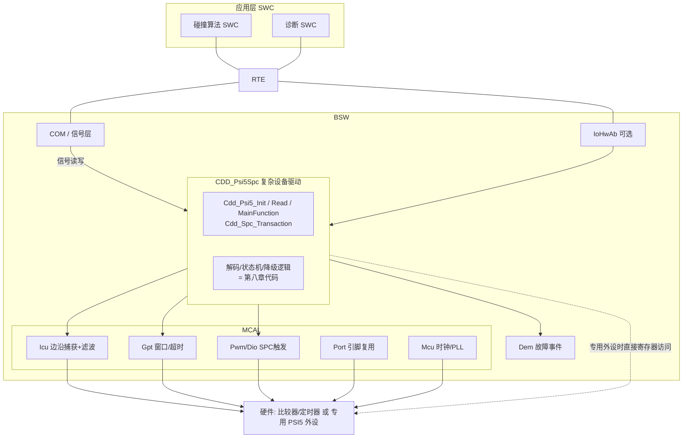

### 9.2 支撑 MCAL 模块的关键配置

CDD 能否稳定工作，一半取决于底下 ICU/GPT/Port 的配置质量。关键参数如下表（以 EB tresos / DaVinci Configurator 中的标准容器命名）：

| 模块 | 容器/参数 | 推荐配置与理由 |
|------|-----------|----------------|
| Icu | IcuChannel/IcuActivationEdge | `ICU_BOTH_EDGES`——曼彻斯特必须双沿捕获 |
| Icu | IcuMeasurementMode | `ICU_MODE_TIMESTAMP`（时间戳模式 + 环形缓冲），而非 SIGNAL_EDGE_DETECT——解码需要完整边沿序列 |
| Icu | IcuBufferSize | ≥ 单帧最大边沿数×2（曼彻斯特 28bit 帧约 60 沿，留翻倍余量） |
| Icu | IcuDigitalFilter/滤波深度 | 按 7.1 节④的权衡设定；NRZ 189k 时滤波深度须 < 半位周期的 1/4 |
| Icu | IcuNotification | 关闭逐边沿通知（性能杀手），用 GPT 关窗事件成批取缓冲 |
| Gpt | GptChannelTickFrequency | 与 Icu 时间戳同源同频，否则窗口与时间戳换算引入系统误差 |
| Gpt | GptChannelMode | `GPT_CH_MODE_ONESHOT` 用于时隙关窗与 SPC 响应超时 |
| Pwm/Dio | 输出模式 | SPC 触发脚配开漏 + 外部上拉；用 Dio 位操作+Gpt 定时或单次 PWM 产生受控低脉宽 |
| Port | PortPinMode | 捕获脚复用到比较器输出/定时器输入；SPC 脚配置开漏、初始电平高 |
| Mcu | McuClockSettingConfig | 为捕获定时器分配独立稳定时钟分支；文档化时钟误差预算（与解码容差窗对账） |

### 9.3 CDD 配置容器与参数设计（EB tresos / DaVinci 视角）

自研 CDD 应当"像标准模块一样可配置"：定义厂商特定的参数定义文件（tresos 的 `.xdm`，或 DaVinci 的 `.arxml` 参数定义/BSWMD），使参数在图形界面中可编辑、可校验、可生成。下表给出一套经过量产检验的容器结构（名称为示意，可按团队命名规范调整）：

| 容器 / 参数 | 类型/范围 | 说明 |
|-------------|-----------|------|
| **CddPsi5General** | 容器 | 模块级配置 |
| └ CddPsi5DevErrorDetect | bool | 开发期参数检查（DET 上报），量产可关 |
| └ CddPsi5MainFunctionPeriod | float, s | MainFunction 调度周期，须 ≤ 同步周期 |
| └ CddPsi5VersionInfoApi | bool | 是否生成 GetVersionInfo |
| **CddPsi5Channel**（0..N） | 容器 | 每条 PSI5 总线一个 |
| └ CddPsi5SyncPeriod | uint32, µs | 同步脉冲周期（如 500µs） |
| └ CddPsi5SyncPulseWidth | uint32, ticks | 同步脉冲宽度 |
| └ CddPsi5CodingType | enum | MANCHESTER_125K / NRZ_189K |
| └ CddPsi5DecodeTolerance | uint8, % | 边沿间隔容差窗（默认 12%） |
| └ CddPsi5IcuChannelRef | 引用 | 指向支撑的 IcuChannel |
| └ CddPsi5GptWindowRef | 引用 | 指向关窗/超时 GptChannel |
| **CddPsi5Slot**（每通道 0..4） | 容器 | 每个从端时隙一个 |
| └ CddPsi5SlotOpen / SlotClose | uint32, ticks | 时隙开/关窗（自同步零点） |
| └ CddPsi5DataLength | uint8, 10..28 | 数据位数 |
| └ CddPsi5CrcMode | enum | PARITY / CRC3 |
| └ CddPsi5FrameTimeoutTol | uint8 | 连续坏帧容忍数（对齐 FTTI） |
| └ CddPsi5ScaleGain / Offset | int32 | 量纲换算定点参数 |
| └ CddPsi5DemEventRef | 引用 | 关联的 Dem 事件（总线故障/帧错） |
| └ CddPsi5ComSignalRef | 引用 | 数据交付的目标信号/端口 |
| **CddSpcChannel**（0..M） | 容器 | 每条 SPC 线一个 |
| └ CddSpcTickNominal | uint32, µs | 名义 tick |
| └ CddSpcTriggerTable | 数组 | 各命令/地址对应的触发脉宽（ticks） |
| └ CddSpcRespTimeout | uint32, ticks | 响应窗口上限 |
| └ CddSpcNibbleCount | uint8 | 响应帧数据 nibble 数 |
| └ CddSpcCrcMode | enum | SENT_CRC4 |

### 9.4 配置 → 生成 → 调用路径

工具链上的完整闭环如下：

1. **配置**：集成工程师在 EB tresos / DaVinci Configurator 中编辑上述容器；工具执行参数校验（范围、引用完整性、时隙不重叠校验可写成自定义校验规则）。
2. **生成**：代码生成器把配置展开为 `Cdd_Psi5_Cfg.h`（宏与类型）、`Cdd_Psi5_Cfg.c`（常量配置表，即 8.4 节 `psi5_ch_t` 的静态配置部分，通常放 `const` 段进 Flash）、`Cdd_Psi5_PBcfg.c`（Post-Build 变体时）。
3. **集成调用**：EcuM/BswM 在启动序列中于 Mcu/Port/Icu/Gpt 初始化之后调用 `Cdd_Psi5_Init(&Cdd_Psi5_Config)`；OS 周期任务或 RTE 定时事件驱动 `Cdd_Psi5_MainFunction()`（发同步/布窗/收割结果）；捕获与关窗的 ISR 由 Icu/Gpt 回调进入 CDD 的 `psi5_slot_close_cb`。

生成的配置表形态示意（帮助理解"配置如何变成代码"）：

```c
/* Cdd_Psi5_Cfg.c —— 由 tresos/DaVinci 生成, 请勿手改 */
const Cdd_Psi5_SlotCfgType Cdd_Psi5_SlotCfg_Ch0[CDD_PSI5_CH0_SLOTS] = {
    { /* Slot 0: 前纵梁左加速度计 */
      .slotOpen  = PSI5_US_TO_TICKS(44u),
      .slotClose = PSI5_US_TO_TICKS(144u),
      .dataLen   = 10u,
      .crcMode   = CDD_PSI5_PARITY,
      .tolFrames = 4u,                      /* 对齐 FTTI=10ms   */
      .gainQ15   = 26214, .offsetQ = 512,   /* 量纲: LSB→0.1g   */
      .demEvent  = DemConf_DemEventParameter_PSI5_CH0_S0,
      .comSignal = ComConf_ComSignal_AccFrontLeft },
    { /* Slot 1: 前纵梁右加速度计 */
      .slotOpen  = PSI5_US_TO_TICKS(174u),
      .slotClose = PSI5_US_TO_TICKS(274u),
      .dataLen   = 10u,
      .crcMode   = CDD_PSI5_PARITY,
      .tolFrames = 4u,
      .gainQ15   = 26214, .offsetQ = 512,
      .demEvent  = DemConf_DemEventParameter_PSI5_CH0_S1,
      .comSignal = ComConf_ComSignal_AccFrontRight },
};
```

### 9.5 与 BSW 的集成：信号如何到达碰撞算法

数据向上交付有两条正规路径：

- **CDD → RTE 端口 → SWC**：CDD 定义 Provide 端口（SenderReceiver），`Cdd_Psi5_MainFunction` 里对每个通过校验的新鲜值调用 `Rte_Write_<Port>_<Signal>()`。适合 ACU 这类"传感器值直供本地算法"的场景，延迟最小。
- **CDD → COM 信号 → PDU → 总线**：需要把传感器值转发上 CAN/FlexRay 给其他 ECU 时，CDD 调 `Com_SendSignal()`，由 COM/PduR 打包发送。
- **故障路径**：所有 FAILED/DEGRADED 事件经 `Dem_SetEventStatus()` 上报，Dem 依配置去抖后落 DTC；BswM 可依据 Dem 事件切换整车降级模式（例如某路加速度计失效 → 点爆算法切换到冗余传感器组合）。

**新鲜度与端到端保护**：若碰撞算法在另一核或另一 ECU，建议对交付信号附加 E2E Profile（计数器+CRC），把 8.4 节的 `age_cycles` 语义延伸到通信链路上——传感器链路的安全完整性不应终止在 CDD 出口。

---

## 十、深入：时序预算、时钟恢复与抖动容限

### 10.1 PSI5 同步窗口的时序预算

主从同步接口的正确性，取决于"同步脉冲 → 从端响应"的时序预算能否在工业温度、电压、器件离散范围内都成立。一个典型的时序预算包含：主端同步脉冲宽度 T_sync；从端检测到同步后到开始回传的时隙偏移 T_slot（含传感器 ASIC 内部检测延迟与时钟稳定）；数据帧持续时间 T_frame；以及收发双方时钟偏差引入的抖动 J。要满足"窗口既不太宽也不太窄"，需保证：

```
Slot_open  < T_slot_min − J_max        （最快的合法帧也落在窗内）
Slot_close > T_slot_max + T_frame_max + J_max （最慢的合法帧收得完）
相邻时隙:  Slot_close(n) + 保护带 < Slot_open(n+1)  （防串扰）
```

其中线缆传播延迟通常远小于 µs 级可忽略，J 来自主端定时器分辨率与从端振荡器精度。工程上做**最坏情况分析**：取从端最快响应与最慢响应包络，确认窗口完全覆盖且相邻时隙互不重叠。若余量不足，可降低数据率（用曼彻斯特而非 NRZ）、缩短帧长或减少单总线从端数。笔者建议把这套预算写成表格纳入设计评审——它同时就是 9.3 节 `SlotOpen/SlotClose` 参数的计算依据，配置值必须可追溯到预算表。

### 10.2 曼彻斯特的自同步如何抵抗抖动

曼彻斯特每位中点必跳变，意味着接收端每比特都能重新对齐采样相位。即使从端时钟有 ±若干百分点偏差，只要单比特内的累积偏移小于容差窗口，就会被下一个中点跳变"拉回"——这叫**每比特重同步（per-bit resynchronization）**。相比之下 NRZ 没有强制跳变，长连码时只能依赖收发双方独立的自由运行时钟，偏差线性累积，故 NRZ 对晶振精度要求显著更高。这也是安全件偏好曼彻斯特的深层原因：它把"时钟不准"的风险从"系统性失锁"降为"单比特可检错"。

### 10.3 NRZ 下的时钟恢复策略

当必须用 NRZ 追求更高吞吐时，常见补救：帧头放规定的同步训练序列（如交替 1010…），接收端用数字锁相/过采样在该段锁定波特率与相位；数据段限制最大连码长度（经编码约束或比特填充），保证最短跳变密度；接收端用多倍过采样（8×/16×）多数投票判定比特值。这些机制增加了接收端复杂度，正对应"NRZ 省带宽、费逻辑"的权衡。

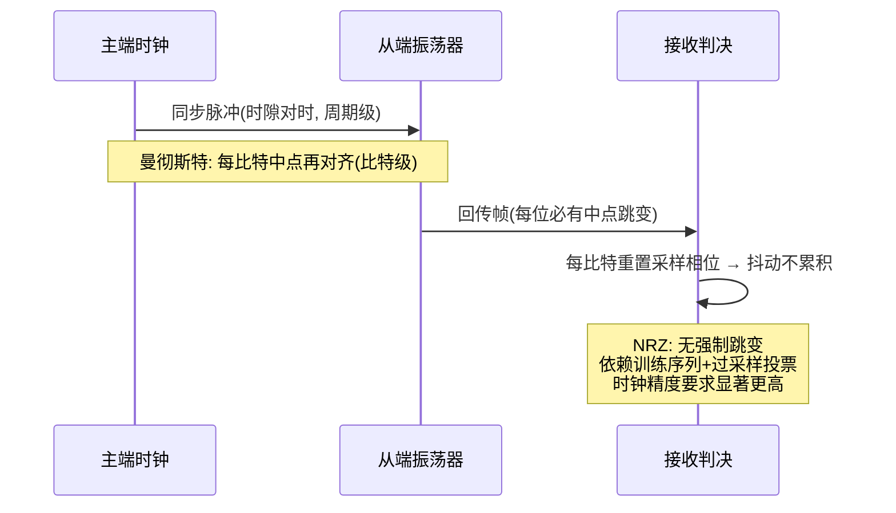

---

## 十一、深入：SPC 双向时序完整推演（tick 级）

把 SPC 的"命令—响应"放在 tick 级时间轴上，能看清它的双向本质。设名义 tick = 3µs（示意），一次完整 SPC 事务的节拍如下：

1. **主端发触发**：ECU 开漏拉低总线 N 个 tick（如同步触发用短脉宽、点名地址 1 用另一档脉宽），随后释放。这 N 由 9.3 节 `CddSpcTriggerTable` 配置。
2. **从机判决**：传感器测量低脉宽，落入自己的判决窗口才接管总线；否则保持静默（其他地址的传感器就是这样"让路"的）。
3. **从机发响应帧**：同步/校准脉冲 56 tick（≈168µs）→ 状态 nibble → 数据 nibbles（每个 12~27 tick）→ CRC nibble。以 6 个数据 nibble 计，一帧约 300~500µs 量级。
4. **主端解码**：用实测同步宽度反算真实 tick，归一化各 nibble 脉宽，查校验。
5. **总线归位**：事务结束回到高电平空闲，等待下一次触发——采样节奏完全由 ECU 掌控。

这种"平时静默、点名才答"的拉取模型，使 SPC 在不增加引脚、不改物理层的前提下获得了类寄存器总线的可管理性，还顺带解决了 SENT 做不到的两件事：**采样相位对齐 ECU 控制周期**、**单线多传感器**。代价是每次采样都要付一次触发+响应的往返时间，峰值吞吐低于自由运行的 SENT；且从机多了一个脉宽判决逻辑——但对价格敏感的压力传感器而言，这点代价远低于换用 CAN/LIN。

---

## 十二、深入：失效模式与 FMEA 视角

从 ISO 26262 的 FMEA（故障模式与影响分析）角度，PSI5/SPC 链路典型失效与应对如下：

| 失效模式 | 检测方法（对应硬件/驱动机制） | 缓解/安全状态 |
|----------|----------|---------------|
| 线缆断线 | 供电电流归零（AFE 欠流比较器 → BUSF 位） | 立即 FAILED，禁用相关裁决，记录 DTC |
| 线对电源/对地短路 | 电流异常飙升/供电驱动限流触发 | 限流保护 + FAILED + DTC |
| 传感器 ASIC 静默失效 | 时隙超时（TOUT 位 / `PSI5_ERR_TIMEOUT`） | 连续超时进 FAILED，切换冗余传感器 |
| 数据受扰翻转 | 奇偶/CRC 失败（PERR/CERR） | 丢帧+计数，连续超限降级 |
| 时序失真/串扰 | 曼彻斯特码型错（MERR）、时隙违例（SLOTV） | 丢帧，违例计数触发布线排查 DTC |
| 曼彻斯特极性配置错 | 起始位持续非法 | 初始化自检报配置错误 |
| SPC 触发被噪声展宽→误选址 | 响应帧状态 nibble/ID 与预期不符 | 丢弃响应，重试上限后 FAILED |
| 主端恒流源/阈值 DAC 漂移 | 电流越界监测 + 周期自检（回环） | 切冗余供电或告警 |
| FIFO 溢出（软件收割不及时） | OVF 位 | 设计期修正调度周期；运行期计数告警 |
| 数据陈旧被误用 | 新鲜度 age 随值交付 | 上层拒用陈旧值，超龄按失效处理 |

可见 PSI5 的诊断优势在于"单一电流量即可映射多种失效"，配合校验、时隙看门狗与新鲜度管理，能同时满足单点故障度量（SPFM）与潜在故障度量（LFM）的论证需求。SPC 因新增命令通道，还需对"误触发/误选址"做响应一致性校验与重试上限管理，否则双向能力反而可能引入"被误命令"的新失效——这是设计 SPC 系统时极易被忽视的一点。

---

## 十三、常见坑与调试手段

1. **供电电流不足 → 传感器不工作/数据乱**：两线既供电又通信，若主端供电能力低于传感器需求（尤其多从端总线的电流叠加），传感器欠压，数据错乱。对策：核对所有从端稳态+调制峰值电流之和，主端限流留余量；用电流探头实测。
2. **曼彻斯特极性判反 → 全帧反相**：解码把 0/1 跳变方向弄反。对策：示波器抓采样电阻两端差分波形，对照规范确认极性；解码代码靠"起始位固定码型"自检（8.2 节 `PSI5_ERR_START` 正是为此）。
3. **同步脉冲时序偏差 → 收不到帧**：主端 Sync 宽度/周期不符从端要求，从端不回传或时隙错位。对策：严格按规范配置，示波器量 Sync 宽度与首帧延迟，与 10.1 节预算表对账。
4. **时隙窗口配置与实物不符**：窗口开早了收进上一时隙的尾巴，开晚了截掉帧头。对策：用 SLOTV/MERR 计数定位；把实测帧起止时刻回填预算表。
5. **毛刺滤波深度不当**：太浅 CRC 频繁失败，太深吞掉合法窄脉冲（NRZ 尤甚）。对策：EMC 摸底时扫描滤波深度×阈值×滞回三参数矩阵，取误码率谷底。
6. **CRC 失败却"将就用" → 安全隐患**：安全件绝不可忽略校验失败。对策：失败即进故障/降级路径，记录 DTC——代码评审时专查"校验失败分支是否可能被跳过"。
7. **多传感器总线冲突**：时隙分配重叠或菊花链初始化失败导致两从端同时回传。对策：初始化阶段校验各从端时隙互斥；运行期靠 SLOTV 捕获违例。
8. **NRZ 长连码失锁**：长连 0/1 丢时钟基准。对策：确认帧头训练序列与过采样配置；必要时改用曼彻斯特。
9. **SPC 触发脉宽容差不足**：从机振荡器偏差使脉宽判决窗口重叠，偶发误选址。对策：触发脉宽档位间距留足容差（覆盖双向 ±20% 级偏差），主端脉宽由硬件定时产生而非软件延时。
10. **采样电阻取值不当**：R_sense 过大→压降侵蚀传感器供电余量；过小→调制摆幅淹没于噪声。对策：按调制深度、比较器量程、供电预算三方折中，必要时前端加放大。
11. **忽略地偏移**：长距离地线压降使电压型检测失效。对策：坚持电流检测，比较器参考以本地地为基准。
12. **中断/DMA 收割不及时 → FIFO 溢出**：多通道高帧率下软件跟不上。对策：用 DMA 环形缓冲 + 关窗批处理（8.1 节结构），杜绝逐边沿中断。

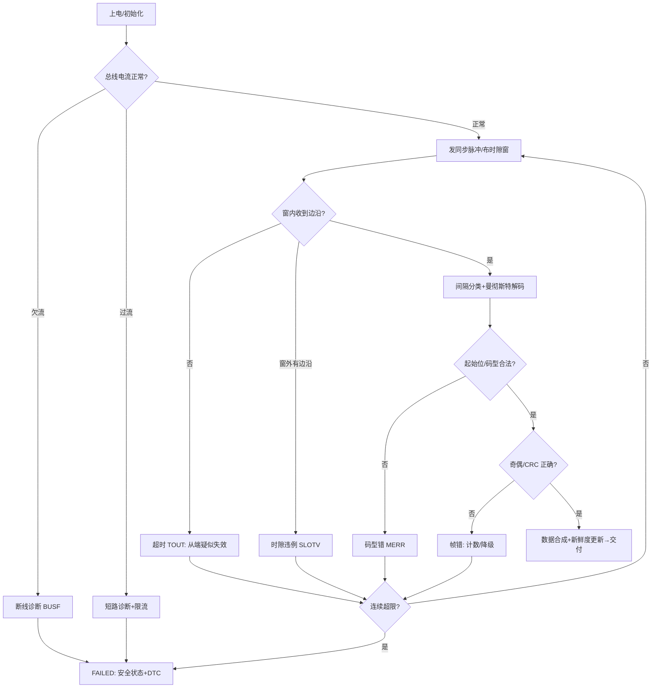

---

## 十四、功能安全视角（ISO 26262）

PSI5 之所以成为气囊等高 ASIL 场景的首选，不只是因为它"简单"，更因为它**天然满足单点故障可检测要求**：

- **断线/短路/欠压诊断**：单一电流量即可区分多种失效模式，诊断覆盖率（DC）高，且检测在模拟域即时完成（AFE 诊断比较器），不依赖软件轮询。
- **校验防数据受损**：奇偶/CRC 覆盖数据字段，防止误判碰撞。
- **时隙确定性 + 超时检测**：收不到帧、收错时隙都被硬件标志捕获；"沉默"与"多话"两个方向的失效都可检。
- **新鲜度管理**：值与年龄一起交付，杜绝陈旧值被静默复用。
- **两线结构降低连接器失效概率**：少一根线 = 少一个失效点，契合"最小化不可检失效面"的设计理念。

在 SPC/SENT 用于安全相关场景时，则需额外机制（响应一致性校验、周期健康监测、多帧一致性、E2E 保护）弥补其原生诊断的不足。工程上常把 SENT/SPC 传感器用于 QM~ASIL-B/C 量级，PSI5 用于 ASIL-C/D。另须记住：**接口协议本身不承载 ASIL，承载 ASIL 的是"协议+诊断机制+安全机制"的整体**——同样的 PSI5，不做超时与降级管理照样过不了安全评审。

---

## 十五、进阶专题：数值推演、EMC 与接口选型

### 15.1 曼彻斯特解码的数值推演（手算示例）

笔者用一个具体例子演示接收端如何把"一串跳变边沿"还原成数据。设比特周期 T = 8µs（125kbps），约定"中点 低→高 = 1，高→低 = 0"。传感器回传比特串 `1 0 1 1 0 0 1`。

发送端逐位构造波形（每位中点必跳变，同值相邻位之间在位边界插入回程跳变）：

```
位序:      1        0        1        1        0        0        1
前半/后半: 低|高    高|低    低|高    低|高    高|低    高|低    低|高
中点沿:    ↑4      ↓12      ↑20      ↑28      ↓36      ↓44      ↑52   (µs)
边界回程:       ↑8?否(1→0无需)  ↓16     ↓24(1→1需要)  ↑32?否   ↑40(0→0需要)  ↓48
```

实际边沿序列（µs）：4↑, 12↓, 16↓？——手算时立即暴露一个易错点：**1→0 相邻时，前位后半为高、后位前半为高，位边界无跳变**；**1→1 相邻时，前位后半为高、后位前半为低，边界必有回程沿**。整理后合法边沿为：4↑、12↓、20↑、24↓、28↑、36↓、44↓…… 等一下，36↓ 与 44↓ 之间同为下降沿且间隔 8µs=T——这正是 0→0 的"中点→中点"直达情形（中间的边界回程 40↑ 被两位同值时的波形抵消了吗？）。手推到这里若发现矛盾，就该回到规则本身：**0 后接 0 时，前位后半为低、后位前半为高，边界必有 ↑ 回程沿**。所以正确序列是 36↓、40↑、44↓。这个"手算翻车再纠错"的过程，恰恰说明了 8.2 节代码中 `pending_half` 状态存在的必要性：解码器必须显式区分"中点沿"与"回程沿"，任何间隔既非 T/2 也非 T、或回程沿后未按时出现中点沿的序列，都判 `PSI5_ERR_CODING`——曼彻斯特的"自校验"体现为**任何时序失真都被识别而非默默误读**。

### 15.2 EMC 与信号完整性要点

PSI5/SPC 多工作在发动机舱、轮端、纵梁等恶劣电磁环境，工程上需系统性处理：

- **线缆选型**：优先屏蔽双绞线（STP）。双绞抵消差模感应，屏蔽抑制共模耦合；屏蔽层在 ECU 端单点接地，避免地环流。
- **共模扼流圈**：接口入口串共模电感，对高频共模干扰呈高阻，对差分数据影响小。
- **电源与信号滤波**：主端供电加 π 型滤波（磁珠+电容），采样电阻前加低通滤除带外噪声；比较器用施密特滞回避免噪声引起的多次翻转；数字侧再叠一层毛刺滤波（7.1 节④），形成"模拟滞回+数字滤波"双保险。
- **地偏移处理**：长距离地线压降使电压检测失效，故坚持电流检测、以本地（ECU 侧）地为参考。
- **布局**：采样电阻、比较器尽量靠近 MCU 捕获引脚，走线短而对称；调制电流环路面积最小化以降低辐射。
- **验证方法**：BCI（大电流注入）与辐射抗扰测试中监控 8.6 节的分类错误计数器——它比"功能是否正常"灵敏得多，能在误码率恶化但尚未功能失效时就暴露裕量不足。

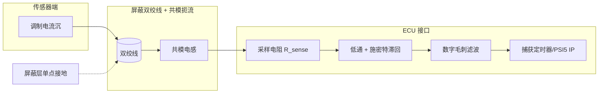

### 15.3 与其他车载接口的横向对比（PSI5/SPC vs DSI3/LIN/CAN-FD）

| 接口 | 线数 | 方向 | 速率 | 供电 | 典型场景 | 安全适配 |
|------|------|------|------|------|----------|----------|
| PSI5 | 2（供通一体） | 主从同步/可双向配置 | 125/189kbps | 主端供 | 气囊加速度/压力 | ASIL-C/D |
| SPC | 1 信号线+电源地 | 双向（触发拉取） | SENT 级 | 独立供电 | 制动压力/位置 | ASIL-B/C |
| SENT | 1 信号线+电源地 | 单向自由运行 | µs tick | 独立供电 | 油门/增压压力 | QM~B |
| DSI3 | 2（供通一体） | 主从/TDMA | 上行更高（百 kbps 级） | 主端供 | 新一代气囊/超声波 | ASIL-D |
| LIN | 1+电源地 | 主从 | ≤20kbps | 独立供电 | 车身舒适 | QM |
| CAN-FD | 2（差分） | 多主 | Mbps 级 | 独立供电 | 动力/底盘域 | 配合 E2E 达 ASIL-D |

要点：PSI5 与 DSI3 同为"两线供通一体"的安全接口，DSI3 在带宽与 TDMA 多传感器调度上更强（还支持主到从的较高速下行命令），但复杂度与成本更高；PSI5 在中等数据率安全传感上更均衡。LIN/CAN-FD 需要独立供电与更重协议栈，对单一廉价安全传感器过度设计。SPC 则是 SENT 生态内"最低成本获得双向与多传感器能力"的甜点方案。

### 15.4 工程落地检查清单（设计评审用）

- [ ] 主端供电/限流能力是否覆盖所有从端稳态+调制峰值电流之和？
- [ ] 采样电阻取值是否兼顾比较器量程、信噪比与传感器供电余量？
- [ ] 曼彻斯特极性与起始位码型是否与传感器一致？初始化自检是否覆盖？
- [ ] 校验模式（奇偶/CRC3/CRC4）与从端配置是否匹配？失败路径是否强制进入降级？
- [ ] 时隙 Open/Close 是否有最坏情况预算表支撑？相邻时隙保护带是否足够？
- [ ] 解码容差窗与"主端时钟误差+从端振荡器偏差"之和是否对账？
- [ ] 边沿采集是否 DMA 批处理？多通道满载下 FIFO/缓冲是否不溢出？
- [ ] 断线/短路/欠压/超时/违例/溢出是否都有独立可读标志并映射 DTC？
- [ ] `tol_frames` 降级门限是否与 FTTI 对齐并写入安全分析？
- [ ] SPC 触发脉宽档位间距是否覆盖从机时钟偏差？误选址是否有响应一致性校验？
- [ ] EMC 措施（屏蔽、共模扼流、滤波、滞回、数字滤波）是否就位并以误码计数实测？
- [ ] CDD 配置参数是否全部由工具生成、可追溯，杜绝魔数散落在代码里？
- [ ] 是否按 ISO 26262 完成 SPFM/LFM 度量与安全机制映射表？

---

## 十六、面试高频要点精选（25 道含要点）

1. **PSI5 两根线怎么同时供电和通信？**
   要点：供电直流 I_nom 上叠加曼彻斯特/NRZ 电流跳变；接收端采样电阻+隔直+比较器解调；下行同步用电压调制。频谱分离 + 检测域正交是核心。

2. **为什么 PSI5 特别适合安全传感器（气囊）？**
   要点：两线简单可靠、抗扰、单点可诊断（断线/短路/欠压/超时可检）、校验防误判、时隙确定性强，满足高 ASIL；少连接器=少失效点。

3. **曼彻斯特编码的作用是什么？**
   要点：每位中点必跳变，跳变方向定 0/1，自带时钟（每比特重同步）且直流平衡，利于隔直耦合与长线传输；代价是带宽翻倍。

4. **PSI5 支持哪两种编码？区别？**
   要点：曼彻斯特（125kbps，自同步，直流平衡）vs NRZ（189kbps，带宽高，需防长连码失锁、要求时钟精度）。

5. **曼彻斯特解码器如何区分"中点沿"和"边界回程沿"？**
   要点：合法边沿间隔只有 T/2 与 T 两类；解码器维护相位状态（是否锚定中点），T 间隔直达下一中点，T/2 间隔是回程、其后必须再来一个 T/2 才到中点；其他间隔判码型错。

6. **PSI5 与 SENT 的区别？**
   要点：PSI5 两线供电通信一体、电流调制、时隙同步、多用于安全传感器；SENT 单信号线电压调制、传感器独立供电、单向自由运行。

7. **SPC 是什么？和 SENT 什么关系？**
   要点：SPC=Short PWM Code，西门子/英飞凌提出的 SENT 双向衍生：主端拉低总线、以低脉宽编码触发命令/选址，从机以完整 SENT 帧响应，实现按需拉取与单线多传感器。

8. **SENT 帧结构是什么？**
   要点：同步/校准脉冲(56 ticks) → 状态 nibble → 数据 nibbles(下降沿间距 12~27 ticks 编码 0~15) → CRC nibble → 可选暂停脉冲。

9. **SPC 为什么要用实测同步脉冲反算 tick？**
   要点：从端振荡器允许较大偏差（±20% 级），56 ticks 同步脉冲的实测宽度即从端时基标尺，用它归一化 nibble 脉宽才能正确解码。

10. **PSI5 的校验为什么重要？**
    要点：碰撞判定关系气囊点爆，单比特翻转绝不能放过；校验是最后闸门，失败必须走故障路径，绝不可将就使用。

11. **PSI5 怎么做多传感器寻址？**
    要点：同步模式时隙分配（各从端按预配置时隙回传）+ 菊花链初始化分配时隙/地址；时分避免冲突，硬件时隙看门狗监督违例。

12. **MCU 无 PSI5 外设时如何实现接收？**
    要点：采样电阻→隔直→片上比较器整形→定时器双沿捕获+DMA 批量时间戳→软件间隔分类解码→校验。关键是 DMA 批处理而非逐边沿中断。

13. **专用 PSI5 IP 内部有哪些模块？**
    要点：供电/同步驱动、电流检测放大+比较器（阈值 DAC+滞回）、数字毛刺滤波、边沿时间戳捕获、曼彻斯特/NRZ 解码器、帧组装+校验、时隙看门狗、SPC 状态机、FIFO、中断/DMA、跨时钟域同步。

14. **PSI5 IP 为什么要独立的功能时钟域？**
    要点：位周期测量精度直接取决于捕获时钟的稳定性与分辨率，须与总线时钟解耦；两域间经 2FF/异步 FIFO 跨域，复位分系统/软件/通道三层。

15. **数据寄存器为什么要把错误标志和数据放在同一次读出？**
    要点：若分两个寄存器读，中断到读取之间新帧到达会造成"数据配错标志"竞态；FIFO 每项原子携带数据+状态快照是标准解法。

16. **电流调制相比电压调制的优势？**
    要点：抗地偏移、天然限流保护、单一电流量易做断线/短路诊断、与下行电压调制在检测域正交。

17. **PSI5 帧由哪些字段组成？**
    要点：Sync（主端电压脉冲）| Start（2 bit 固定码型）| Data(10~28 bit, LSB first) | 奇偶或 CRC3 | Idle/时隙保护带。

18. **为什么 NRZ 需要防长连码失锁？**
    要点：NRZ 电平不强制跳变，长连 0/1 无边沿则接收端时钟偏差线性累积；需训练序列、连码限制、过采样投票兜底。

19. **PSI5/SPC 在 AUTOSAR 里为什么走 CDD？**
    要点：AUTOSAR 无标准 PSI5/SENT MCAL 模块（市场窄、硬件形态分裂、与安全概念强耦合）；用 CDD 纵向穿透直达硬件，底下复用 Icu/Gpt/Pwm 支撑，向上经 RTE/COM 标准接口集成。

20. **CDD 的 PSI5 配置里最关键的参数是哪几个？**
    要点：时隙 Open/Close（须由最坏情况时序预算推出）、编码与容差窗、校验模式、连续坏帧容忍数（对齐 FTTI）、量纲换算参数、Dem 事件与 Com 信号引用。

21. **超时和 CRC 错哪个更严重？驱动如何分级？**
    要点：超时意味着从端可能已死，比"活着但被干扰"的校验错严重；连续超时直接 FAILED，校验错先 DEGRADED；硬故障（欠流/过流）不计数立即 FAILED。

22. **为什么安全件"收不到"比"收错了"更可接受？**
    要点：收不到会被超时/校验机制捕获并进入安全状态或启用冗余；未被检出的错误数据若触发误点爆，后果不可逆。校验、超时、时隙看门狗正是把"错"转化为"可检测的收不到"。

23. **如何验证 PSI5 解码器的正确性？**
    要点：信号发生器注入已知码型比对输出；边界测试（最小/最大位周期、极性反转、注入单比特错验证校验报错、时隙边缘帧）；EMC 注入下监控错误分类计数。覆盖"正常、可检错、不可检失效"三类用例。

24. **SPC 触发被噪声展宽误选址会怎样？如何防？**
    要点：可能点名错从机、拿到别人的数据。防护：脉宽档位间距留足容差、触发由硬件定时产生、校验响应帧内 ID/状态一致性、重试上限后进故障。

25. **从演进看，PSI5 与 DSI3 谁会取代谁？**
    要点：二者均为两线供通一体安全接口。DSI3 带宽与 TDMA 调度更强，适合高度集成的新一代气囊/超声波域；PSI5 在中低数据率、成本敏感、生态成熟场景仍具优势。短期互补共存、按需选型，而非简单取代。

---

## 十七、本章小结

PSI5 与 SPC 代表了车载传感器接口"极简、可靠、可诊断"两条互补的技术路线：PSI5 用两线供电+电流调制+曼彻斯特/NRZ，把安全相关传感器（气囊加速度、压力）牢牢绑在"供电即通信"的可靠链路上；SPC 则在 SENT 这一廉价单线协议上补出主动触发与选址能力，使压力/位置类传感器既可按需上报又能被配置与诊断。

本章在协议原理之上，笔者着重补齐了三块量产必备的"垂直纵深"：**其一，芯片模块设计**——从电流检测放大器、阈值比较器、毛刺滤波，到边沿时间戳捕获、间隔分类解码器、时隙看门狗、SPC 状态机与 FIFO/中断，以及寄存器位域与时钟/复位域的通用设计范式；**其二，驱动实现**——以"边沿间隔分类"为核心的曼彻斯特流式解码、残值法校验、多从端时隙管理、新鲜度交付与分级降级；**其三，AUTOSAR 集成**——PSI5/SPC 走 CDD 的架构逻辑、Icu/Gpt 支撑配置、可生成的配置容器设计与"配置→生成→调用→信号交付"的完整闭环。

理解协议谱系（SENT 单向 → SPC 双向 → PSI5 两线安全 → DSI3 高带宽 TDMA），能画出接收 IP 的框图、写出确定性的驱动、给出可追溯的配置，才算真正"吃透"了这类接口。在工程落地时，请始终把"诊断覆盖率"与"故障安全路径"放在第一位——因为安全件的世界里，"收不到"比"收错了"更值得庆幸，而"将就用"永远不被允许。

> 撰写说明：本章所述电气参数（电压/电流/速率范围）均为符合 PSI5/SENT/SAE J2716 公开规范的通用原理性描述；IP 框图、寄存器位域、配置容器均为通用工程示意，未引用任何具体厂商芯片的型号参数、寄存器手册或商用 MCAL 的私有内容，工程实现请以所用器件与工具链的最新官方文档为准。
