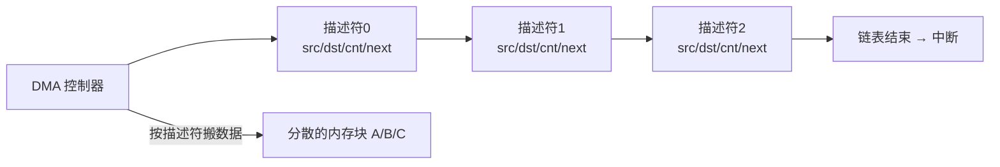
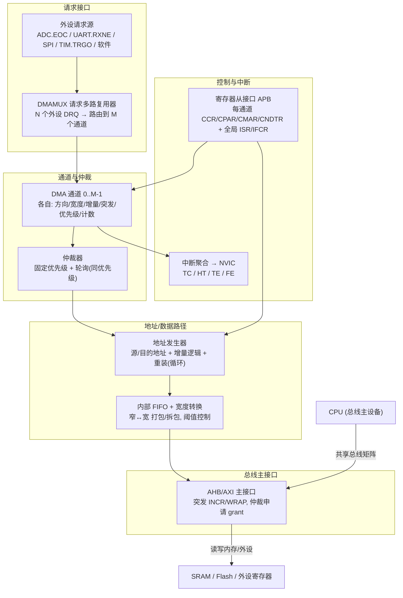
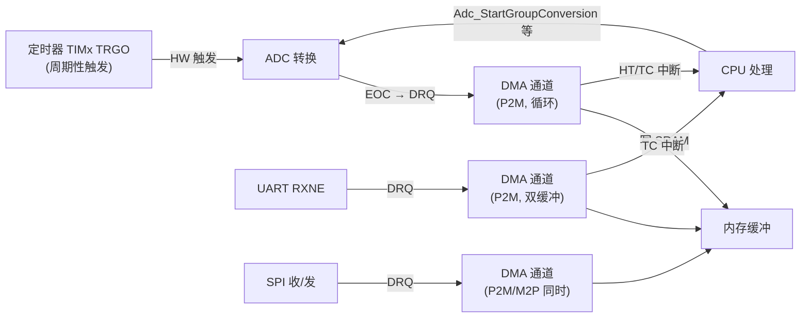
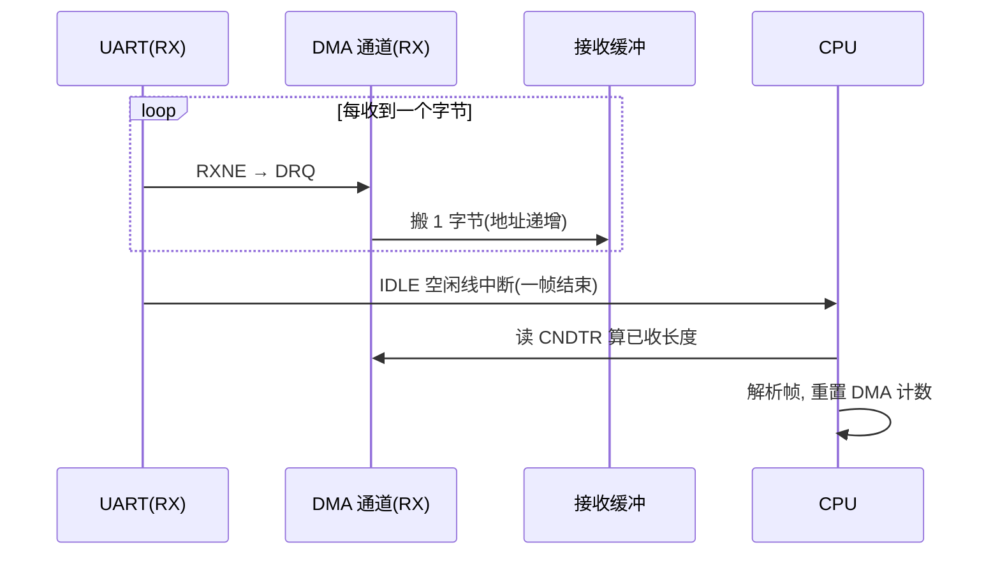
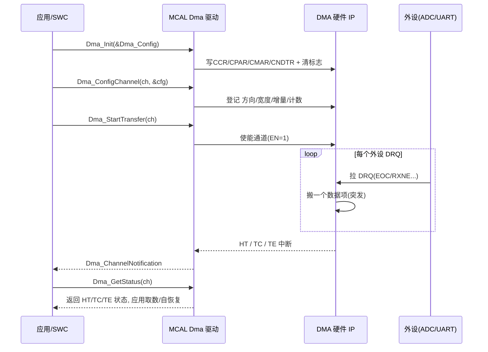

# DMA 直接内存访问深度详解：从控制器 IP 架构、传输机制到 MCAL 工程实践

## 一、引言：一次"丢帧"事故，引出 DMA 存在的意义

在绝大多数嵌入式系统里，数据搬运是"隐形却无处不在"的苦力活：ADC 采样值要从数据寄存器搬进内存、UART 收到的字节要攒成报文、SPI 屏要被喂满帧缓冲、电机 FOC 的相电流要被实时搬去给控制环、甚至两块内存之间要拷贝一份Log。如果让 CPU 亲自去"一个字节一个字节地搬"，它就没有精力做真正有价值的事——控制决策、通信协议栈、算法运算。

笔者在一个量产项目中就踩过这样的坑：早期为了赶进度，UART 接收用"每收一个字节进一次 RXNE 中断、在中断里塞进环形缓冲"的写法。低速时一切正常；一旦整车CAN 报文洪泛、同时 SPI 屏在刷帧，CPU 负载飙到 90%+，UART 接收中断被高优先级任务频繁抢占，结果就是**间歇丢帧、报文 CRC 校验失败、偶发的" Ghost 帧"**。更隐蔽的是 ADC：用查询法在 main 循环里轮询 EOC 再读 DR，采样时刻被各种任务抖动污染，电流环的相位噪声肉眼可见地变差。这两个现象背后，是同一句话——**数据搬运占用了本该做计算的 CPU 时间，且采样/接收时刻毫无确定性**。

后来把 UART 接收、ADC 采样都改成 DMA，CPU 负载掉到 30% 以下，丢帧与采样抖动同时消失。这件事让笔者对 DMA 的定位有了切身体会：**DMA 不是"锦上添花的外设"，而是把"数据搬运"与"计算决策"解耦的关键基础设施**。

但 DMA 也绝不是"开个开关就能自动搬"的黑盒。笔者见过太多由 DMA 配置错误引发的诡异问题：内存里出现"错位的样本"（通道相位整体偏移一个槽位）、DMA 写穿了缓冲（数组越界踩了别的变量）、Cortex-M7 上 CPU 读到的 DMA 数据"总是旧的"、总线错误（Bus Error）直接把系统挂进 HardFault。这些问题的根源，往往是工程师只配了"方向、地址、长度"三件事，却忽略了**数据宽度对齐、地址增量、突发长度、优先级仲裁、流控握手、缓存一致性、半/全传输中断的时序**等更深一层的机制。

因此本章的目标分为三层：第一层，从"DMA 控制器是一个总线主设备"的本质出发，讲透它为什么能解放 CPU、与 CPU 如何博弈总线带宽、以及一组决定性能与正确性的关键参数；第二层，深入芯片模块设计视角，给出一个通用 DMA 控制器 IP 的内部架构框图、寄存器位域组织、时钟/复位域，以及它与 ADC/UART/SPI/定时器外设的硬件协作方式；第三层，落到工程实现——完整可读的裸机驱动 C 代码（循环缓冲 + 半/全中断、双缓冲乒乓、内存到内存、散聚/链表、缓存维护），以及车载领域 AUTOSAR MCAL 中 Dma（及 Mcl）模块的配置方法与调用路径。通篇以"通用寄存器模型 + 公式表达 + 工程判断"替代具体器件型号参数，避免编造虚假数据，同时保留可直接落地的实践方法。

---

## 二、DMA 是什么：从"总线主设备"视角重新理解

### 2.1 总线主设备（Bus Master），而非从设备

这是理解 DMA 的第一性原理：**DMA 控制器（DMAC）是一个能主动发起总线事务（bus transaction）的"主设备（Bus Master）"**，它与 CPU、GPU、LCD 控制器等并列挂在芯片内部的**总线矩阵（Bus Matrix）/ 互联（Interconnect）**上。当外设产生一个 DMA 请求（DRQ）时，DMAC 作为主设备去申请总线、访问内存（或另一个外设的寄存器），把数据搬完，全程不需要 CPU 执行"取数—存数"指令。

一个生动类比：把芯片想象成一家公司。普通外设（ADC、UART…）是"产线工位"，产生需要归档的报表（数据）；CPU 是"总经理"，负责拍板决策；内存是公司"档案室/仓库"。如果没有 DMA，每件报表都得工位跑来敲总经理的门，总经理亲自去档案室存/取——总经理被搬运淹没，没空决策。**DMA 就是公司里的"物流组"：它有自己出入档案室的通行证（总线主设备权限），工位只要把报表丢进料箱（拉 DRQ），物流组自己跑去档案室存取，事后发个短信（中断）告诉总经理"第几摞报表存好了"。**

正因为 DMAC 是主设备，它才能"在 CPU 不知情的情况下"搬数据；也正因为它和 CPU 抢同一条总线，**它和 CPU 之间存在带宽博弈**——这一点在第五章的总线矩阵与仲裁里还会展开。

### 2.2 为什么需要 DMA：三类核心动机

1. **解放 CPU（吞吐与效率）**：搬运 N 字节，CPU 轮询/中断方式要付出 N 次"读—写"指令 + 上下文切换；DMA 把它压成"配置一次 + 收一个完成中断"。CPU 负载从 O(N) 降到 O(1)。
2. **确定性时序（无中断抖动）**：用"定时器触发外设 → 外设 DRQ → DMA 搬"的硬件链路，采样/接收时刻由硬件定时器决定，不受软件中断延迟、任务调度影响。这对电机电流采样、音频、通信收包等"时刻敏感"场景是刚需。
3. **降低功耗**：CPU 可以进入低功耗运行/睡眠模式，由 DMA 在后台搬数据、搬完或半满时再唤醒 CPU 处理。省下的 CPU 活跃时间直接转化为功耗下降（在电池供电/常电待机场景很关键）。

### 2.3 哪些场景"必须用 DMA"、哪些"用不用都行"

- **必须用 DMA**：ADC 连续多通道采样、音频 Codec 收发、SPI 屏/LCD 帧缓冲刷新、高速 UART（>1Mbps）收包、以太网 MAC 收发描述符与数据、SD/MMC 块读写、内存到内存的大块拷贝。这些场景数据率高、实时性要求严，CPU 亲自搬会撑爆负载或引入抖动。
- **可用可不用**：低频、零散的单字节/单字传输（如偶尔读一个传感器寄存器、慢速 I²C），用中断或轮询也扛得住；但若追求统一架构与可维护性，仍建议走 DMA。
- **不适合 DMA**：传输本身要伴随复杂、依赖前一步结果的软件逻辑（如每搬一个字节就要查表/解密/协议解析），且无法用"地址递增 + 固定宽度"表达的数据流——这类还是 CPU 来。

### 2.4 DMA 与 CPU 的"带宽博弈"：总线矩阵与仲裁

现代 MCU 的总线不是一条"独木桥"，而是一个**总线矩阵/互联**：多个主设备（CPU、DMAC、DMA2D、以太网…）通过仲裁器连接到多个从设备（SRAM、Flash、外设 APB/AHB、TCM…）。每个主设备要发起访问都得先"抢到"总线授权（grant）。

问题来了：如果 DMAC 一次搬一大块、且优先级很高，它会在一段时间内几乎独占总线，导致 **CPU 取指（instruction fetch）被 stall**——表现为系统整体卡顿、其他实时任务超时。这就是 DMA 与 CPU 的"带宽博弈"。

工程上的化解手段（后文详述）：
- **限制突发长度（Burst Size）**：每次总线事务只搬 4/8/16 个 beat 就释放总线，给 CPU 插入的机会。
- **合理设优先级 + 仲裁策略**：让 DMA 通道之间、DMA 与 CPU 之间有公平的轮询（round-robin）机会。
- **用 TCM/ITCM 等关键内存绕开共享总线**：把最在意确定性的代码/数据放 tightly-coupled memory，DMA 碰不到，CPU 永不被它 stall。
- **QoS / 带宽限制**：高端 SoC 的总线互联支持给主设备配带宽配额。

类比收尾：DMA 是物流组，但它不能把公司大门（总线）堵死——得留车道给其他车（CPU 取指、其他 DMA 通道），否则全公司都瘫痪。

---

## 三、关键参数全解

DMA 的数据手册/参考手册里会列出一组参数，下面按"是否决定正确性与性能"的逻辑逐条拆解。

### 3.1 传输方向（Direction）

| 方向 | 含义 | 典型场景 |
|------|------|----------|
| 外设→内存（P2M, Peripheral-to-Memory） | 源地址固定指向外设数据寄存器，目的地址递增 | ADC 采样值搬进缓冲、UART RX 收包、SPI 收 |
| 内存→外设（M2P, Memory-to-Peripheral） | 源地址递增，目的地址固定指向外设数据寄存器 | UART TX 发包、SPI 发、DAC 波形输出 |
| 内存→内存（M2M, Memory-to-Memory） | 源、目的都递增 | 块拷贝、帧缓冲搬运、Log 归档 |

注意：**并非所有 DMAC 都支持 M2M**。很多 MCU 的"基础型"DMA（如早期 STM32 的 DMA1）只支持 P2M/M2P，M2M 需特定通道或更高阶 DMAC（如带独立存储主接口的 eDMA / PL330）。M2M 的流控也与 P2M 不同（见 4.6 节）。

### 3.2 数据宽度（Data Width / Transfer Size）

每个 beat 搬运的数据位宽，常见 **字节（8 位）/ 半字（16 位）/ 字（32 位）**。两个关键事实：

1. **外设侧与内存侧宽度可以不同**。例如 UART 数据寄存器是 8 位，但你希望内存里每个字节紧凑存放（8 位）；又例如一个 8 位 ADC 数据寄存器，你想把它"打包"进 32 位内存字以省总线带宽——这需要 3.8 节的 FIFO 宽度转换。
2. **未对齐的访问可能直接总线错误**。在 AHB/AXI 上，32 位传输通常要求地址 4 字节对齐、16 位要求 2 字节对齐；地址未对齐时，部分总线会返回总线错误（Bus Error）并触发 DMAC 的传输错误中断。

### 3.3 地址增量（Address Increment）

- **外设地址（peripheral address）**：几乎总是 **固定（no increment）**，因为外设数据寄存器是同一个固定地址（如 ADC->DR、USART->RDR），DMA 反复读写同一寄存器。
- **内存地址（memory address）**：通常 **递增（increment）**，把一串数据依次铺到缓冲的不同位置；也可固定（用于把同一个值反复写入外设，如刷屏清屏填固定色）。

配置时务必"外设固定、内存递增"——这是新手最常见的方向写反错误（把 periph/minc 配错导致所有样本叠在同一内存位置）。

### 3.4 突发长度（Burst Size / Number of Beats）

一次 DMA 总线事务（一次 grant）内连续搬运的 beat 数，常见 **1 / 4 / 8 / 16 beats**。突发（burst）的意义在于**摊薄"地址相位"开销**：普通 AHB 单次传输，每个 beat 都要发一次地址；突发传输只在开头发一次起始地址，后续 beat 沿用（INCR 递增或 WRAP 回绕），总线效率显著提升。

代价：突发越长，单次占用总线越久，越容易 stall 其他主设备（回归 2.4 节的博弈）。所以突发长度是"效率 vs 公平"的旋钮。AXI 上还区分 **ARLEN/AWLEN（读/写突发长度）** 与突发类型（FIXED/INCR/WRAP）。

### 3.5 传输计数（Transfer Count / Block Length）

本次 DMA 请求要搬运的**数据项数**（不是字节数！）。例如"把 16 个 16 位的 ADC 样本搬进缓冲"，传输计数 = 16，每个 transfer 按 16 位宽度搬。计数减到 0 表示本次传输完成，触发 TC（Transfer Complete）中断并可选择自动重装（循环模式）。

### 3.6 优先级（Priority）

- **通道优先级**：每个 DMA 通道可配 low/medium/high/very-high（或 0~3 等档位）。多个通道同时请求时，高优先级先服务。
- **仲裁策略**：同优先级的通道之间，常用**固定优先级**（编号小的先）或**轮询（round-robin）**（轮流，避免饿死），很多 DMAC 支持"软件优先级 + 硬件轮询"混合。
- **软件触发 vs 硬件请求**：由寄存器启动的称软件触发；由外设 DRQ 拉起的称硬件请求（外设流控）。

### 3.7 通道数与请求复用（DMAMUX）

- **通道（Channel）/ 流（Stream）**：DMAC 内部有多个独立传输单元。有些 MCU 用"通道"概念（每个通道硬接线到特定外设请求，如 DMA1_Channel1 固定接 ADC1），有些用"流 + 多路复用器"（如 STM32F4+ 的 DMA_Stream 配 DMAMUX，任意外设请求可路由到任意流）。
- **DMAMUX（请求多路复用器）**：现代 MCU 普遍在 DMAC 前加一级 DMAMUX，把 N 个外设请求信号灵活映射到 M 个 DMA 通道/流。好处是布线灵活、避免"那个外设偏偏只接在已被占用的通道上"的尴尬。配置时要同时配"外设请求号"和"该请求路由到哪个 DMA 通道"。

### 3.8 FIFO 与宽度转换（Width Conversion / Packing）

高阶 DMAC 内置一个 **FIFO**（典型 4×32 位 = 16 字节），带来两个能力：

1. **宽度转换/打包（packing）**：把"窄外设 + 宽内存"或反之重新打包。例：外设 8 位、内存 32 位，FIFO 先收 4 个 8 位字节，凑成一个 32 位字再写内存——总线写次数降为 1/4，外设侧又保持 8 位粒度。反之也可把内存里的 32 位字拆成 4 个 8 位写外设。
2. **吸收突发不匹配**：外设是单次、内存想突发时，FIFO 先攒再突发，反之亦然。

FIFO 常配一个**阈值（threshold）**：攒够多少才发起总线传输。阈值过低浪费带宽，过高增加延迟与溢出风险。

### 3.9 流控（Flow Control）

决定"谁说了算——这次传输何时结束、搬多少"：

- **外设流控（Peripheral-flow）**：传输的终止由外设的 DRQ 个数决定。外设每产生一个请求，DMA 搬一个数据项；外设不再请求，传输就停。适合"数据率由外设决定"的场景（UART 收到多少字节搬多少）。
- **内存流控（Memory-flow）**：传输的终止由**程序设定的传输计数**决定，DMA 主动按计数连续搬完（M2M、或"一次性把 100 字节发出去"的 UART TX）。

配错流控是隐蔽 bug：把本该外设流控的 UART RX 配成内存流控，DMA 会按计数盲目搬，外设没数据时可搬到垃圾值或总线挂起。

### 3.10 吞吐率与总线占用率（估算公式）

DMA 的有效吞吐率近似：

```
有效吞吐率 ≈ 传输字节数 / 传输总耗时
传输总耗时 ≈ 总线事务开销 + 数据相位耗时
           ≈ (count / burst) × t_addr + count × t_beat(width)
```

其中 `t_beat` 由数据宽度与总线时钟决定（32 位突发在 AHB 上远快于 8 位单次）。**总线占用率 = DMA 所需带宽 / 总线总带宽**；当占用率接近 100% 时，CPU 几乎被饿死——这正是 2.4 节要限制突发、控制优先级的量化依据。

---

## 四、传输机制深拆

### 4.1 一次传输的层级：Beat → Transfer → Block

理解 DMA"搬一次"到底搬了什么，要建立三级概念：

- **Beat（一次总线事务的最小单元）**：在总线上完成一次"读或写一个数据项"的动作，位宽 = 数据宽度。一个突发由多个 beat 组成。
- **Transfer（一次传输 / 一次数据项搬运）**：对应"源→目的"的一个完整数据项（受数据宽度约束）。一个 transfer 可由 1 个 beat（非突发）或 多个 beat（突发）完成。
- **Block（一块传输 / 一次完整请求）**：由一个传输计数（count）指定的、连续 N 个 transfer 组成的一次完整 DMA 事务，对应一次"启动 → 计数减到 0 → TC 中断"的全过程。

一句话：**Beat 是总线动作，Transfer 是数据项，Block 是一次应用级搬运任务**。调试时定位"丢的是哪一个 beat"还是"整块计数错"，就靠这三级。

### 4.2 循环模式（Circular Mode）

传输计数减到 0 后，**硬件自动把计数、源地址、目的地址重装回初始值**，从头再来，无需软件重新配置。这是"持续流"场景的标配：ADC 连续采样写环形缓冲、音频持续播放/录制、UART 持续收包。循环模式下 TC 中断会周期性触发，配合半/全中断实现"边采边处理"（见 4.4）。

注意：循环模式**只重装，不暂停**——总线一直在搬。若 CPU 处理速度跟不上，仍会溢出（见常见坑）。

### 4.3 双缓冲 / 乒乓（Double Buffer / Ping-Pong）

双缓冲是循环模式的"升级版"：提供**两块内存**（Buffer A / Buffer B）。DMA 先填 A，填到一半（HT 中断）或填完 A（TC 中断）时**自动切换到填 B**，同时通知 CPU "A 已经稳定、可以处理了"。CPU 处理 A 的这段时间，DMA 在填 B；等 B 满了，再切回 A。两块交替，互不踩踏。

价值：彻底消除"CPU 在读、DMA 在写同一块"的竞争，是**免锁（lock-free）**处理流式数据的最佳实践。音频、高速采集、通信收包几乎都用它。

### 4.4 半传输 / 全传输中断（HT / TC）

- **HT（Half Transfer）**：传输计数走完一半时触发。此时**前半块已稳定、DMA 正在写后半块**，CPU 可安全处理前半块。
- **TC（Transfer Complete）**：计数走完（整块满）时触发。此时**后半块已稳定、DMA 正准备（循环/双缓冲下）回头写前半块**，CPU 可安全处理后半块。

工程口诀：**只处理"DMA 当前没在写"的那一半**。配合循环/双缓冲，CPU 与 DMA 永不访问同一半区，天然免锁。这也是 ADC 章里 `ADC_Task_Process` 只处理 half/full 对应半区的原理。

### 4.5 散聚传输（Scatter-Gather / Linked List）

前述模式都是"一块连续缓冲"。但现实常有"数据分散在内存多处、或要依次搬多个不连续块"的需求（如网络协议栈的 skbuff 碎片、多个分散的音频片段）。**散聚（scatter-gather）** 用一个存放在内存里的**描述符链表（descriptor chain）** 描述多次传输：每个描述符含"源地址、目的地址、计数、控制字、下一个描述符地址"。DMAC 搬完一块后，自动从内存读下一个描述符，继续搬，**全程无需 CPU 介入**。

这是车规/高性能 DMAC 的标志能力（如 NXP eDMA 的 TCD 链、ARM PL330 的指令线程、Xilinx AXI DMA 的 SG 模式、Intel I/OAT）。描述符链表带来"零 CPU 干预的复杂搬运编排"，但代价是描述符本身要正确构建且**描述符内存也要做缓存维护**（见 7.6）。



### 4.6 流控与握手（DRQ / DACK）

外设与 DMAC 之间靠**请求/应答握手**协同：

- **DRQ（DMA Request）**：外设拉高/脉冲，表示"我有数据要搬"（如 ADC EOC、UART RXNE）。
- **DACK（DMA Acknowledge）**：DMAC 受理该请求后回给外设的应答（部分 DMAC 用"读/写外设寄存器即自动清请求"的隐式握手，无独立 DACK 线）。
- **握手类型**：边沿触发（每个脉冲一次请求）vs 电平触发（请求线保持有效期间持续请求，直到被响应/清除）。配错会导致"一次数据被搬多次"或"请求丢失"。

外设流控下，传输的"节拍"完全由 DRQ 个数驱动；内存流控下，DMAC 自己按计数推进，不依赖 DRQ（见 3.9）。

### 4.7 错误与事件

DMAC 常见的中断/事件标志（通用命名）：

| 标志 | 含义 | 典型成因 |
|------|------|----------|
| TC（Transfer Complete） | 整块传输完成 | 计数减到 0 |
| HT（Half Transfer） | 半块完成 | 计数走完一半 |
| TE（Transfer Error） | 传输错误 | 总线错误（非法/未对齐/未使能时钟的地址）、FIFO 溢出 |
| FE（FIFO Error） | FIFO 错误 | FIFO 上溢/下溢（阈值与时间窗不匹配） |
| DME（Direct Mode Error） | 直连模式错误 | 直连模式下突发/FIFO 配置冲突 |

TE 往往意味着"地址或宽度配置错、或访问了没开时钟/受保护的内存"——遇到 HardFault 类怪问题时，第一反应查 DMA 的 TE 标志与对应地址。

---

## 五、芯片模块设计：DMA 控制器 IP 内部架构

### 5.1 IP 顶层架构框图

一个通用 DMAC IP 可划分为"请求接口、仲裁、地址/数据路径、总线主接口、FIFO、中断聚合、寄存器从接口"几大块。下面以"多通道 + 可选 DMAMUX + 内置 FIFO"的现代实现为蓝本（结构对各主流厂商同构）：



逐个模块拆解其设计意图：

1. **DMAMUX 请求多路复用器**：把几十个外设请求信号灵活路由到有限的 DMA 通道，解耦"外设"与"通道编号"。配置时要同时指定"外设请求 ID"与"目标 DMA 通道/流"。
2. **DMA 通道（Channel）**：每个通道是独立的传输引擎，持有自己的方向、数据宽度、地址增量、突发长度、优先级、传输计数、源/目的地址。多个通道并行存在，由仲裁器调度。
3. **仲裁器（Arbiter）**：决定多个通道同时请求时谁先上总线——高优先级先；同优先级按固定编号或轮询。它是"DMA 不饿死 CPU/其他通道"的关键。
4. **地址发生器**：维护源/目的地址，按增量配置推进；循环模式下计数到 0 时把地址重装回初值；散聚模式下从描述符链读取下一块地址。
5. **内部 FIFO + 宽度转换**：缓冲 beat、做窄↔宽打包（3.8 节），吸收突发不匹配，提升总线效率。
6. **总线主接口（AHB/AXI Master）**：DMAC 作为主设备申请总线 grant、发起突发读写。这是它"能自己搬数据"的实体。
7. **寄存器从接口（APB Slave）**：CPU 通过 APB 访问 DMAC 寄存器来配置/启动/查询；它是 DMAC 的"门面"。
8. **中断聚合**：把各通道的 TC/HT/TE/FE 汇总后路由到 NVIC，让 CPU 在传输完成时"被通知"而非轮询。

### 5.2 寄存器与位域组织（通用）

寄存器是 DMAC 数字域的"门面"。下表给出一个**通用 DMA 控制器**的寄存器映射示意（偏移与位域为常见实现逻辑的通用示例，非任何具体芯片的照抄）：

| 偏移 | 寄存器 | 主要位域 | 作用 |
|------|--------|----------|------|
| 0x00 | ISR（中断状态） | GIFx / TCIFx / HTIFx / TEIFx（每通道 4 位） | 各通道中断标志只读快照 |
| 0x04 | IFCR（中断标志清除） | CGIFx / CTCIFx / CHTIFx / CTEIFx | 写 1 清除对应标志（清必须先于重配置） |
| 0x08 | CCR0（通道0配置） | EN/DIR/MINC/PINC/CIRC/HTIE/TCIE/TEIE/PRIORITY/SIZE_P/SIZE_M | 通道0 使能/方向/增量/循环/中断/优先级/宽度 |
| 0x0C | CPAR0（通道0外设地址） | 外设数据寄存器地址（固定） | P2M/M2P 时的固定端地址 |
| 0x10 | CMAR0（通道0内存地址） | 内存缓冲首地址 | 递增端起始地址 |
| 0x14 | CNDTR0（通道0计数） | 剩余传输项数（减到 0 完成） | 传输计数，写前须 EN=0 |
| 0x18+ | CCR1/CPAR1/CMAR1/CNDTR1 … | 同上，每通道一组 | 通道 1..M-1 |
| 0xN0 | DMAMUX 路由寄存器（若有） | 请求 ID → 通道映射 | 把外设 DRQ 路由到具体通道 |

几个通用配置纪律（与各主流实现一致）：
- **改计数/地址前必须先清 EN（禁止通道）**：CNDTR 在 EN=1 时只读（反映剩余计数），写配置须先 EN=0。
- **清中断标志须在重配置前**：IFCR 写 1 清对应位；不清就重启动，旧标志可能干扰。
- **先配外设（让它产生 DRQ 的使能），再使能 DMA 通道**：顺序反了可能丢首个请求或立刻 TE。

### 5.3 时钟域与复位域

DMAC 通常有**自己的外设时钟（DMA_CLK）**，来自总线时钟分频或独立门控。两个易错点：
- **没开 DMAC 时钟就写寄存器**：写操作无效甚至总线错误。配置前务必在 RCC 里使能 DMAC 时钟。
- **DMAMUX 与 DMAC 各有独立时钟使能**：用 DMAMUX 时两者都要开。
- **复位域**：DMAC 随系统复位；但软件复位（如低功耗唤醒后）可能不自动恢复 DMAC 配置，需在初始化里重新配。

### 5.4 与外设、定时器的协作全景

DMA 极少"单打独斗"，总与外设/定时器组成硬件流水线。下面给出一帧"典型协作"的全景：



要点：**定时器的 TRGO → ADC 触发 → EOC 拉 DRQ → DMA 搬进 SRAM → HT/TC 中断通知 CPU**，这条链从"采样时刻"到"数据落内存"完全由硬件驱动，CPU 只做"事后处理"，是确定性采样的标准范式（BMS 高压采样、电机相电流采样都靠它）。

---

## 六、与外设协作的典型场景

### 6.1 ADC 连续采样（P2M + 循环 + 半/全中断）

这是 DMA 最经典的"用武之地"。ADC 规则组多通道扫描，每完成一个 EOC 就拉一次 DRQ，DMA 把 DR 搬到 SRAM 的环形缓冲；循环模式让它永不停止；HT/TC 中断让 CPU 半块半块地处理。由于 ADC 规则组**只有一个共享 DR**（见 ADC 章），多通道扫描若不用 DMA 会被下一通道覆盖并置 OVR——所以"规则组多通道必须用 DMA"是铁律。详细驱动代码见第七章 7.2 节（与 ADC 章的 9.3 节同构）。

### 6.2 UART 收发（RX：P2M；TX：M2P；空闲中断收不定长帧）

- **RX（P2M）**：把 UART 的 RDR 搬进内存环形/双缓冲。性能关键处在于**配合"空闲线中断（IDLE）"收不定长帧**：DMA 一直在收，IDLE 中断表示"总线上安静了一阵（一帧结束）"，此时读 CNDTR 算出"本次收了多少字节"，交给协议解析。这比"每字节进中断"省海量 CPU。
- **TX（M2P）**：把内存里的发送缓冲搬进 UART 的 TDR。注意**欠载（underrun）**：若 DMA 供数慢于 UART 发送，TDR 被发空会发填充值/报错——保证发送缓冲足够且优先级合理。



### 6.3 SPI 全双工（M2P 与 P2M 同时）

SPI 收、发共享 SCK：每发一个 bit 也收一个 bit。因此 SPI 的 DMA 通常是**两个通道并行**——一个 M2P（发缓冲 → SPI->DR）、一个 P2M（SPI->DR → 收缓冲），由同一个 SPI 事件触发。配置时两通道计数必须一致，否则收发错位。

### 6.4 内存到内存（M2M）：块拷贝与帧缓冲搬运

把一块内存拷到另一块（Log 归档、帧缓冲双缓冲切换、查找表初始化）。注意：M2M 需要 DMAC 支持，且是**内存流控**（按计数搬完）；两个地址都递增。M2M 时突发长度可以开大（没有外设节拍限制），效率最高。

### 6.5 与定时器联动（TIM TRGO → 外设 → DRQ → DMA）

定时器的 TRGO（触发输出，如更新事件、比较输出）可作为 ADC/UART/SPI 等外设的硬件触发源；外设转换完成后拉 DRQ，DMA 搬走。这条"定时器定节拍、外设干活、DMA 搬家"的链路，把"何时采样/发送"的确定性从软件交给了硬件，是实时性设计的基石。

---

## 七、驱动代码实现：从寄存器到可复用驱动层

本章给出一套完整可读的裸机驱动实现。寄存器命名沿用第五章的通用位域定义，读者可按手头芯片手册做符号替换。所有代码遵循同一纪律：**先开 DMAC 时钟、配外设使能 DRQ、再使能 DMA 通道；改计数/地址前先 EN=0；清中断标志再重配置；循环/双缓冲下只处理 DMA 当前没在写的半区**。

### 7.1 寄存器模型与基础初始化

```c
/* ================= dma_hw.h：通用寄存器模型（示意） ================= */
#include <stdint.h>

typedef struct {
    volatile uint32_t ISR;    /* 中断状态: 每通道 GIF/TCIF/HTIF/TEIF */
    volatile uint32_t IFCR;   /* 中断标志清除: 写1清                   */
    /* 每通道一组: CCR / CPAR / CMAR / CNDTR */
    volatile uint32_t CCR[8];
    volatile uint32_t CPAR[8];
    volatile uint32_t CMAR[8];
    volatile uint32_t CNDTR[8];
} DMA_TypeDef;

#define DMA1  ((DMA_TypeDef *)0x40020000UL)   /* 基址示意 */

/* --- 位定义（与 5.2 节位域图一致） --- */
#define DMA_CCR_EN     (1u << 0)
#define DMA_CCR_TCIE   (1u << 1)   /* 传输完成中断使能 */
#define DMA_CCR_HTIE   (1u << 2)   /* 半传输中断使能   */
#define DMA_CCR_TEIE   (1u << 3)   /* 传输错误中断使能 */
#define DMA_CCR_DIR    (1u << 4)   /* 1: M2P, 0: P2M   */
#define DMA_CCR_CIRC   (1u << 5)   /* 循环模式         */
#define DMA_CCR_PINC   (1u << 6)   /* 外设地址递增     */
#define DMA_CCR_MINC   (1u << 7)   /* 内存地址递增     */
#define DMA_CCR_PSIZE_POS 8u       /* 外设宽度 0/1/2 = 8/16/32 */
#define DMA_CCR_MSIZE_POS 10u      /* 内存宽度         */
#define DMA_CCR_PRIO_POS  12u      /* 优先级 0..3      */
#define DMA_CCR_MEM2MEM (1u << 14) /* M2M 模式         */

enum dma_size { DMA_SIZE_8BIT = 0, DMA_SIZE_16BIT, DMA_SIZE_32BIT };

/* ================= dma_drv.c：基础配置 ================= */

/*
 * 通用 DMA 通道配置：
 *  - 方向(dir)、外设/内存宽度、地址增量、循环、优先级、中断
 *  - 注意: 写 CCR/CNDTR 前必须 EN=0
 */
void DMA_ConfigChannel(DMA_TypeDef *dma, uint8_t ch,
                       uint32_t periph_addr, uint32_t mem_addr,
                       uint16_t count, uint32_t ctrl)
{
    dma->CCR[ch]   &= ~DMA_CCR_EN;           /* 1. 先禁止通道          */
    dma->CNDTR[ch]  = count;                 /* 2. 传输计数(EN=0 时可写)*/
    dma->CPAR[ch]   = periph_addr;           /* 3. 外设地址(通常固定)  */
    dma->CMAR[ch]   = mem_addr;              /* 4. 内存地址(通常递增)  */
    dma->CCR[ch]    = ctrl;                  /* 5. 方向/增量/循环/优先级*/
    /* 6. 使能对应中断(HT/TC/TE)在 ctrl 里已含 TCIE/HTIE/TEIE */
    dma->CCR[ch]   |= DMA_CCR_EN;            /* 7. 最后使能通道        */
}

/* 清通道全部中断标志(重配置前必调) */
void DMA_ClearFlags(DMA_TypeDef *dma, uint8_t ch)
{
    uint32_t mask = (0xFu << (ch * 4u));    /* 每通道占 ISR/IFCR 低4位 */
    dma->IFCR = mask;
}
```

### 7.2 循环缓冲 + 半/全中断（P2M，ADC 风格）

```c
/*
 * ADC 连续采样(P2M, 循环): 外设地址固定, 内存递增, 半/全中断处理
 *  - 缓冲布局: [轮0: CH0..CHn][轮1: ...] ... 共 ROUNDS 轮
 *  - 只处理"DMA 当前没在写"的半区, 天然免锁
 */
#define ADC_CH_NUM   4u
#define ADC_ROUNDS   32u
#define ADC_BUF_LEN  (ADC_CH_NUM * ADC_ROUNDS)

static volatile uint16_t g_adcBuf[ADC_BUF_LEN];   /* DMA 目标环形缓冲 */
static volatile uint8_t  g_halfReady, g_fullReady;

void ADC_StartWithDMA(void)
{
    /* 外设固定(ADC->DR), 内存递增, 16位, 循环, 高优先级, HT/TC/TE 中断 */
    uint32_t ctrl = DMA_CCR_MINC | DMA_CCR_CIRC |
                    (DMA_SIZE_16BIT << DMA_CCR_PSIZE_POS) |
                    (DMA_SIZE_16BIT << DMA_CCR_MSIZE_POS) |
                    (3u << DMA_CCR_PRIO_POS) |
                    DMA_CCR_HTIE | DMA_CCR_TCIE | DMA_CCR_TEIE;
    /* 配置前先清标志; ADC 须已使能且 DRQ 已开(顺序: 外设先就绪) */
    DMA_ClearFlags(DMA1, 1u);
    DMA_ConfigChannel(DMA1, 1u,
                       (uint32_t)&ADC1->DR,
                       (uint32_t)g_adcBuf,
                       ADC_BUF_LEN, ctrl);
}

void DMA1_CH1_IRQHandler(void)
{
    uint32_t isr = DMA1->ISR;
    if (isr & (DMA_CCR_HTIE << (1u * 4u))) {   /* HT: 前半区稳定 */
        DMA1->IFCR = (1u << (1u * 4u + 2u));    /* 清 HTIF         */
        g_halfReady = 1u;
    }
    if (isr & (DMA_CCR_TCIE << (1u * 4u))) {    /* TC: 后半区稳定 */
        DMA1->IFCR = (1u << (1u * 4u + 1u));    /* 清 TCIF         */
        g_fullReady = 1u;
    }
    if (isr & (DMA_CCR_TEIE << (1u * 4u))) {    /* TE: 传输错误   */
        DMA1->IFCR = (1u << (1u * 4u + 3u));    /* 清 TEIF         */
        Diag_Report(DIAG_DMA_TRANSFER_ERR, 0);
    }
}

/* 任务级: 只处理"当前未被 DMA 写"的半区 */
void ADC_Task_Process(void)
{
    if (g_halfReady) {
        g_halfReady = 0u;
        Filter_ProcessBlock(&g_adcBuf[0], ADC_BUF_LEN / 2u);
    }
    if (g_fullReady) {
        g_fullReady = 0u;
        Filter_ProcessBlock(&g_adcBuf[ADC_BUF_LEN / 2u], ADC_BUF_LEN / 2u);
    }
}
```

### 7.3 双缓冲乒乓（UART RX 不定长 / 音频）

```c
/*
 * 双缓冲乒乓(UART RX, P2M):
 *  - 两块缓冲 A/B; DMA 填 A 时 CPU 处理 B, 反之亦然
 *  - 用 HT 切到处理"已稳定的半区"; 这里以两块等大缓冲为例简化表达
 */
#define UART_RX_LEN  128u
static volatile uint8_t g_rxBufA[UART_RX_LEN];
static volatile uint8_t g_rxBufB[UART_RX_LEN];
static volatile uint8_t *g_rxProc = g_rxBufA;   /* CPU 当前处理哪块 */

void UART_RX_StartDMA(void)
{
    uint32_t ctrl = DMA_CCR_MINC |
                    (DMA_SIZE_8BIT << DMA_CCR_PSIZE_POS) |
                    (DMA_SIZE_8BIT << DMA_CCR_MSIZE_POS) |
                    DMA_CCR_HTIE | DMA_CCR_TCIE | DMA_CCR_TEIE;
    DMA_ClearFlags(DMA1, 2u);
    /* 先用 A 块启动; 双缓冲由 DMAC 的"双缓冲使能"位自动在 HT 时切到 B */
    DMA_ConfigChannel(DMA1, 2u,
                      (uint32_t)&USART1->RDR,
                      (uint32_t)g_rxBufA, UART_RX_LEN, ctrl);
}

/* HT/TC 中断里: 刚稳定的那块交给 CPU, 另一块正被 DMA 写 */
void DMA1_CH2_IRQHandler(void)
{
    if (/* HT 触发 */ 0) {
        g_rxProc = g_rxBufA;     /* A 稳定, 处理 A; B 正被写 */
        Process_RX(g_rxBufA, UART_RX_LEN / 2u);
    } else { /* TC 触发 */
        g_rxProc = g_rxBufB;     /* B 稳定, 处理 B; A 正被写 */
        Process_RX(g_rxBufB, UART_RX_LEN / 2u);
    }
}
```
> 工程提示：支持硬件双缓冲的 DMAC 会在 HT 时自动把 CPAR/CMAR 切到 B 块基址；不支持的可用"两块 + 软件在 TC 时切换基址"模拟。关键点永远是——**CPU 只碰 DMA 当前没在写的那块**。

### 7.4 内存到内存块拷贝（M2M）

```c
/*
 * M2M 块拷贝: 源/目的都递增, 内存流控(按计数搬完), 突发可开大提效
 *  - 注意: 并非所有 DMAC 支持 M2M; 且需对应通道支持 MEM2MEM 位
 */
void DMA_MemCopy(void *dst, const void *src, uint32_t words)
{
    uint32_t ctrl = DMA_CCR_MEM2MEM | DMA_CCR_MINC | DMA_CCR_PINC |
                    (DMA_SIZE_32BIT << DMA_CCR_PSIZE_POS) |
                    (DMA_SIZE_32BIT << DMA_CCR_MSIZE_POS) |
                    DMA_CCR_TCIE;
    DMA_ClearFlags(DMA1, 3u);
    DMA_ConfigChannel(DMA1, 3u,
                      (uint32_t)src, (uint32_t)dst, words, ctrl);
    /* 等待完成(或依赖 TCIE 中断); M2M 是软件触发, EN 后即自跑 */
    while ((DMA1->ISR & (DMA_CCR_TCIE << (3u * 4u))) == 0u) {}
    DMA_ClearFlags(DMA1, 3u);
}
```

### 7.5 散聚 / 链表传输（描述符结构 + 启动）

```c
/*
 * 散聚/链表传输(示意, eDMA/PL330 风格):
 *  - 描述符链放在内存; DMAC 搬完一块后自动读下一个描述符继续
 *  - 描述符本身须在缓存维护后才对 DMAC 可见(见 7.6)
 */
typedef struct {
    uint32_t src;        /* 本块源地址        */
    uint32_t dst;        /* 本块目的地址      */
    uint32_t count;      /* 本块传输项数      */
    uint32_t ctrl;       /* 方向/宽度/增量/中断 */
    uint32_t next;       /* 下一描述符地址(0=结束) */
} dma_sg_desc_t;

/* 构建并在首描述符上启动(假定 DMAC 支持链表模式) */
void DMA_StartScatterGather(dma_sg_desc_t *head)
{
    /* 1. 缓存维护: 把描述符链 Clean 到内存, 让 DMAC 能看到最新值 */
    SCB_CleanDCache_by_Addr(head, sizeof(dma_sg_desc_t));  /* 视平台 */
    /* 2. 把首描述符地址写入 DMAC 的"描述符指针"寄存器并启动 */
    DMA_SG->DESC_PTR = (uint32_t)head;
    DMA_SG->CR |= DMA_SG_EN;       /* 使能链表模式, DMAC 自主遍历 */
}
```

### 7.6 缓存维护（Cortex-M7 写回缓存：Clean / Invalidate）

Cortex-M7（及带 D-Cache 的 A 核）上，D-Cache 是**写回（write-back）**的——CPU 写的数据先留缓存，不一定立刻进内存；DMA 写内存的数据 CPU 缓存里还是旧副本。不做缓存维护就会出现"DMA 填了的缓冲，CPU 读到的却是旧的"或"CPU 准备好的发送缓冲，DMA 读到的却是旧的"。

```c
#include <stdint.h>

/* CPU 要 DMA 去读的内存: 先 Clean(把缓存行刷进内存) */
void DMA_BufferCleanBeforeTX(void *buf, uint32_t len)
{
    /* 对齐到缓存行(典型 32 字节), 避免误清相邻数据 */
    uintptr_t addr = (uintptr_t)buf & ~0x1Fu;
    uint32_t  size = ((uintptr_t)buf + len - addr + 0x1Fu) & ~0x1Fu;
    SCB_CleanDCache_by_Addr((void *)addr, size);
}

/* DMA 已写入的内存: CPU 要读前先 Invalidate(丢弃缓存旧副本) */
void DMA_BufferInvalidateAfterRX(void *buf, uint32_t len)
{
    uintptr_t addr = (uintptr_t)buf & ~0x1Fu;
    uint32_t  size = ((uintptr_t)buf + len - addr + 0x1Fu) & ~0x1Fu;
    SCB_InvalidateDCache_by_Addr((void *)addr, size);
}
```
> 注意：**Invalidate 有"把缓存里尚未来得及写回内存的脏数据也丢掉"的风险**——所以 RX 缓冲必须是 DMA 专用、CPU 不会往里写的数据，才安全。TX 用 Clean，RX 用 Invalidate，二者不可混用。无 D-Cache 的 Cortex-M3/M4 不需要这步。

### 7.7 错误处理与自恢复

```c
/*
 * DMA 传输错误(TE)自恢复:
 *  - TE 常因地址/宽度错、访问未开时钟/受保护内存导致
 *  - 一旦 TE, 数据流相位可能已乱, 须整体复位该通道数据链路
 */
void DMA_ErrorRecovery(DMA_TypeDef *dma, uint8_t ch,
                       uint32_t periph, uint32_t mem, uint16_t cnt, uint32_t ctrl)
{
    dma->CCR[ch] &= ~DMA_CCR_EN;          /* 1. 禁止通道          */
    DMA_ClearFlags(dma, ch);              /* 2. 清所有标志        */
    /* 3. 重新登记地址/计数, 重使能(必要时先查地址/时钟合法性) */
    DMA_ConfigChannel(dma, ch, periph, mem, cnt, ctrl);
}
```

---

## 八、MCAL 配置说明：AUTOSAR Dma（及 Mcl）模块工程实践

在车载电子（BMS、VCU、电机控制器）中，上述裸机驱动会被 AUTOSAR 架构中的 MCAL 层替代：芯片厂商提供符合 AUTOSAR 标准接口的 DMA 驱动，工程师在 **EB tresos 或 Vector DaVinci Configurator** 等工具里做图形化配置，生成 `Dma_Cfg.c/h` 等配置代码，应用层通过标准 API 调用。理解第五章的 IP 架构再看 MCAL 配置，每个配置项都能对应到具体寄存器位域。

> 说明：AUTOSAR 里与 DMA 相关的模块有两支。**Dma 模块**（标准 MCAL）提供通用的"通道配置 + 启动传输 + 查询状态/错误"接口，多数外设 MCAL（Adc/Spi/Uart/Lin）在底层会调用它或直接操作 DMAC；**Mcl 模块**（Motor Control，亦属 MCAL）则专门封装车规常见的**链表式 eDMA**（如 NXP S32K 的 eDMA、Infineon TC3xx 的 DTS），适合电机 FOC 等高吞吐散聚场景。下文以 Dma 模块为主，末尾补充 Mcl。

### 8.1 Dma 模块的核心配置对象

AUTOSAR Dma 的配置围绕三层对象展开：

- **DmaGeneral**：全局开关，含 `DmaDevErrorDetect`（开发错误检测 DET）、DMA 时钟/全局使能等。
- **DmaChannel（通道）**：对应一个物理 DMA 通道/流。配置方向（P2M/M2P/M2M）、外设请求源（经由 DMAMUX 的硬件请求号）、数据宽度、地址增量、突发长度、优先级、中断使能、传输计数初值。
- **DmaConfig（通道分配）**：把 DmaChannel 与具体外设驱动（AdcGroup/SpiChannel/UartChannel…）关联起来，决定"谁用哪条 DMA 通道"。

关键配置项与硬件位域的映射如下表：

| 配置项（EB tresos/DaVinci） | 典型取值 | 对应硬件/位域 | 工程说明 |
|------|------|------|------|
| DmaChannelDirection | DMA_CH_P2M / M2P / M2M | CCR.DIR / MEM2MEM | 传输方向 |
| DmaChannelHwRequest | 外设请求号（如 ADC1_DMA） | DMAMUX 路由 + DRQ | 经多路复用器连到通道 |
| DmaChannelDataWidth | 8/16/32 位 | CCR.PSIZE/MSIZE | 外设/内存宽度 |
| DmaChannelAddrInc | PERIPH_FIX/MEM_INC 等 | CCR.PINC/MINC | 地址增量 |
| DmaChannelBurstSize | 1/4/8/16 beats | 突发长度位域 | 效率 vs 总线公平 |
| DmaChannelPriority | 0..3（低→极高） | CCR.PRIO | 通道优先级 |
| DmaChannelCircular | TRUE / FALSE | CCR.CIRC | 循环模式（流场景） |
| DmaChannelDoubleBuffer | TRUE / FALSE | 双缓冲位 | 乒乓（若有） |
| DmaChannelTransferCount | 计数初值 | CNDTR | 本次传输项数 |
| DmaChannelIntHT / TC / TE | TRUE / FALSE | CCR.HTIE/TCIE/TEIE | 半/全/错误中断 |
| DmaChannelFifoThreshold | 阈值档位 | FIFO 阈值 | 宽度转换时机的旋钮 |
| DmaChannelLinkedDescriptor | 描述符引用（Mcl） | 描述符指针 | 散聚链表首地址 |

### 8.2 配置 → 生成代码 → 运行时调用路径

工具生成 `Dma_Cfg.c`（含各通道配置常量）后，应用/BSW 的标准调用路径如下：

1. `Dma_Init(&Dma_Config)`：写各通道 CCR/CPAR/CMAR/计数初值，清标志，使能 DMAC 时钟。
2. `Dma_ConfigChannel(channel, &cfg)`：动态重配某通道（地址/计数/方向），**改前须 `Dma_StopTransfer` 且该通道 EN=0**。
3. `Dma_StartTransfer(channel)`：使能通道，开始响应 DRQ 或软件触发。
4. 传输完成/错误：驱动在 TC/HT/TE 中断里调用 `Dma_ChannelNotification`；应用（或上层 MCAL 如 Adc）在通知里取数或做自恢复。
5. 取数/状态：`Dma_GetStatus(channel)` 查 TC/HT/TE；上层模块（如 Adc 的 `Adc_GetStreamingSamples`）直接读已填缓冲。



### 8.3 EB tresos 配置清单（Dma 模块重点项）

按配置流程整理成核查清单，逐项过一遍可避开大多数配置事故：

| 步骤 | 配置容器 | 重点项 | 常见错误 |
|------|----------|--------|----------|
| 1 | DmaGeneral | DmaDevErrorDetect、DMA 全局时钟使能 | 量产忘关 DET 影响时序；DMAC 时钟未开 |
| 2 | DmaChannel | 方向、数据宽度、地址增量 | 外设/内存增量写反（都递增→样本叠一处） |
| 3 | DmaChannel | 外设请求源 + DMAMUX 路由 | 请求号/通道号映射错，DRQ 接错通道 |
| 4 | DmaChannel | 突发长度、优先级、仲裁策略 | 突发过长饿死 CPU；优先级全极高互撞 |
| 5 | DmaChannel | 计数初值、循环/双缓冲 | 计数 = 0 或小于实际；双缓冲未使能 |
| 6 | DmaChannel | HT/TC/TE 中断使能 | 只开了 TC 漏了 HT，无法做乒乓 |
| 7 | 缓存维护 | 含 D-Cache 平台(Cortex-M7)的 Clean/Invalidate 策略 | 忘维护 → CPU 读 DMA 数据总是旧的 |
| 8 | 联动模块 | Mcu(时钟)、外设模块(ADC/Spi/Uart)、DMAMUX | 外设未使能 DRQ 就启动 DMA，丢首请求 |

### 8.4 关于 Mcl 模块（链表式 eDMA，车规常用）

在 S32K、TC3xx 等车规 MCU 上，电机 FOC、常见高速采集用 **Mcl 模块**封装的 **eDMA**：每个通道由一张 **TCD（Transfer Control Descriptor）** 描述，支持**链表（scatter-gather）**与**主/次循环（major/minor loop）**，可在一次触发下自主完成"多通道、跨不连续缓冲"的复杂搬运。Mcl 配置重点是 `Mcl_DmaChannel`（含 TCD 的 src/dst/offset/length/链表指针）与 `Mcl_DmaInit` / `Mcl_DmaConfigChannel` / `Mcl_DmaStart` 调用路径，缓存维护同样适用（见 7.6）。

### 8.5 MCAL 实践中的三个经验

- **通道分配即资源规划**：DMA 通道是稀缺资源，提前按"高速流（ADC/SPI 屏/UART 高速）> 中速 > 低速"分配，并留余量；避免运行时两个外设抢同一通道导致互相打断。
- **缓存维护不能省（带 D-Cache 平台）**：Cortex-M7 上 TX 缓冲先 `Clean`、RX 缓冲先 `Invalidate`，且按缓存行对齐——否则偶发的"数据陈旧"会让你查三天。
- **错误自恢复要留接口**：把 TE 中断接上 `Dma_ChannelNotification` 并在应用层做"停通道→清标志→重配→重启"的自恢复；量产件应能把 DMA 错误上报诊断（DID），避免静默数据损坏。

---

## 九、常见坑与调试手段

1. **缓存不一致（Cortex-M7 写回缓存）**：DMA 写进内存，但 CPU D-Cache 里是旧副本，CPU 读到旧数据；或 CPU 写的发送缓冲还在缓存，DMA 读到的也是旧的。对策：TX 前 `Clean`、RX 后 `Invalidate`，且按缓存行对齐（7.6 节）。这是带缓存平台最经典的"数据陈旧"坑。
2. **地址/宽度未对齐**：32 位传输要求地址 4 字节对齐。未对齐访问在 AHB/AXI 上直接总线错误 → DMAC 置 TE → 严重时 HardFault。对策：缓冲用 `__align(4)`/对齐宏；外设侧宽度不匹配时用 FIFO 宽度转换。
3. **循环缓冲半/全中断处理不当**：在 TC 中断里处理了"DMA 正在写"的那半区，导致读到新旧混合数据。对策：严格只处理"当前未被 DMA 写"的半区（HT 处理前半、TC 处理后半）。
4. **溢出 / 欠载（Overrun / Underrun）**：外设快于 DMA（UART RX 溢出、ADC OVR）或 DMA 快于外设（UART TX 发空）。对策：提升 DMA 优先级/突发、增大缓冲、或改用双缓冲；TX 保证发送缓冲供应及时。
5. **优先级饥饿**：高优先级 DMA 占满总线，CPU 取指被 stall，系统整体卡顿、其他实时任务超时。对策：限制突发长度、合理设优先级 + 轮询仲裁、把关键代码/数据放 TCM/ITCM 绕开共享总线。
6. **请求信号未正确配置（边沿 vs 电平）**：DRQ 握手类型配错，导致一次数据被搬多次或请求丢失。对策：查清外设 DRQ 是边沿还是电平触发，与 DMAC 配置匹配；"软件触发"与"硬件请求"不要混用。
7. **传输计数 off-by-one / 重装时机错**：循环模式计数到 0 才重装；半中断发生在计数一半。把计数初值写成"实际项数"而非"项数-1"（与 ADC 的序列长度"长度-1"编码不同，DMA 的 CNDTR 就是真实项数，别混淆）。
8. **内存屏障 / 编译器优化**：DMA 目标缓冲必须 `volatile` 或在取用时插入内存屏障，否则编译器可能把它优化进寄存器；缓冲**不能放栈上**（函数返回后失效），必须静态/全局。
9. **总线错误（Bus Error / 非法地址）**：DMA 访问了不存在、未使能时钟、或受保护（MPU 禁写）的从设备地址 → TE。对策：查地址合法性、对应从设备时钟是否开启、MPU 区域权限。
10. **M2M 不支持 / 流控错配**：部分 DMAC 不支持 M2M，或 M2M 须特定通道；误把外设流控的 UART RX 配成内存流控，DMA 按计数盲目搬出垃圾。对策：确认 DMAC 能力，外设 P2M 用外设流控。
11. **双缓冲切换竞争**：在 TC 中断里处理"刚写完"的块时，DMA 可能已切到另一块并开始写——务必只处理"当前未被 DMA 写"的块（见 7.3 工程提示）。
12. **低功耗切换截断数据**：进 STOP 前未停 DMA/未等传输完成 → 数据截断；或在低功耗模式 DMA 时钟被关导致传输挂起。对策：停 DMA（或确认该低功耗模式保留 DMA 时钟）、等 TC 后再休眠；用 DMA 半/全中断唤醒 CPU 而非轮询。
13. **中断优先级不当**：DMA 中断优先级过高抢了安全关键任务，或过低导致数据来不及处理而溢出。对策：按数据时效性与系统安全等级排中断优先级，必要时在 ISR 里只置标志、重活在任务级做。

---

## 十、面试题精选（25+ 道，含要点）

1. **DMA 是什么？为什么能解放 CPU？**
   要点：DMA 是总线主设备，能主动发起总线事务搬数据，无需 CPU 执行取/存指令；CPU 负载从 O(N) 降到 O(1)，并消除搬运引入的时序抖动。

2. **DMA 与 CPU 是什么关系？为什么 DMA 太"贪婪"会出问题？**
   要点：二者都是总线主设备，经总线矩阵仲裁共享总线；DMA 突发过长/优先级过高会 stall CPU 取指，导致系统卡顿，需用突发限制、优先级/轮询、TCM 化解。

3. **P2M / M2P / M2M 各是什么？所有 DMAC 都支持 M2M 吗？**
   要点：外设→内存、内存→外设、内存→内存；并非都支持 M2M，基础型 DMAC 常只支持前两者，M2M 需特定通道或高阶 DMAC。

4. **传输方向、数据宽度、地址增量三者如何配合？最常见写反的错误是什么？**
   要点：外设地址通常固定、内存地址通常递增；宽度外设/内存可不同（靠 FIFO 转换）；最常见是 periph/minc 写反，导致所有样本叠在同一内存位置。

5. **突发长度（Burst）有什么用？为什么不能无限大？**
   要点：摊薄地址相位开销、提升总线效率；过长会长时间独占总线、stall 其他主设备，是"效率 vs 公平"的旋钮。

6. **循环模式和双缓冲有什么区别？各适合什么场景？**
   要点：循环自动重装连续流（ADC 采样/音频）；双缓冲两块交替、CPU 处理一块时 DMA 填另一块，免锁处理流式数据（高速收包/音频）。

7. **半传输（HT）和全传输（TC）中断的意义？为什么能"免锁"？**
   要点：HT 时前半区稳定、TC 时后半区稳定，CPU 只处理"DMA 当前没在写"的半区，二者永不访问同一半区，无需加锁。

8. **缓存一致性问题在 DMA 上怎么体现？怎么解决？**
   要点：写回缓存下，DMA 写内存 CPU 缓存是旧的（RX 要 Invalidate），CPU 写缓冲 DMA 读的是旧的（TX 要 Clean）；按缓存行对齐；无 D-Cache 的 M3/M4 不需要。

9. **什么是流控？外设流控和内存流控有何不同？**
   要点：决定传输何时结束/搬多少；外设流控由 DRQ 个数驱动（UART RX），内存流控由程序计数驱动（M2M/一次性 TX）。配错会盲目搬或丢请求。

10. **DMAMUX 是干什么的？为什么现代 MCU 普遍有它？**
   要点：把 N 个外设请求灵活路由到 M 个 DMA 通道，解耦"外设"与"通道编号"，避免请求硬接线导致的冲突。

11. **散聚（scatter-gather）传输解决什么问题？描述符链要做什么维护？**
   要点：数据分散在多处、需依次搬多块时，用描述符链让 DMAC 自主遍历；描述符内存也要 Clean/Invalidate（带缓存平台）才能被 DMAC 看到。

12. **DMA 传输错误（TE）通常由什么引起？怎么自恢复？**
   要点：地址/宽度错、访问未开时钟/受保护/非法地址导致总线错误；自恢复 = 停通道→清标志→重配地址计数→重启，并上报诊断。

13. **为什么"规则组多通道 ADC 扫描必须用 DMA"？**
   要点：规则组只有一个共享 DR，下一通道 EOC 会覆盖上一结果并置 OVR；DMA 在每个 EOC 及时搬走才保全数据；注入组有独立 JDR 无此约束。

14. **UART 收不定长帧怎么用 DMA + IDLE 中断？**
   要点：DMA 持续收进缓冲，IDLE（空闲线）中断表示一帧结束，读 CNDTR 算已收长度后解析；比每字节进中断省海量 CPU。

15. **SPI 全双工用 DMA 要注意什么？**
   要点：收发共享 SCK，通常两通道并行（一个 M2P 发、一个 P2M 收）由同一事件触发，计数必须一致否则收发错位。

16. **数据宽度对齐为什么重要？未对齐会怎样？**
   要点：32 位传输需 4 字节对齐，否则 AHB/AXI 返回总线错误并置 TE/可能 HardFault；FIFO 可缓解外设侧对齐。

17. **循环模式下计数到 0 后发生什么？半中断在计数的什么位置触发？**
   要点：计数到 0 自动重装初值继续（循环）；HT 在计数走完一半时触发；CNDTR 是真实项数（非"长度-1"）。

18. **低功耗下用 DMA 要注意什么？**
   要点：进 STOP 前停 DMA 或确认该模式保留 DMA 时钟、等 TC 后再睡；可用 HT/TC 中断唤醒而非轮询，CPU 休眠时 DMA 后台搬。

19. **AUTOSAR 里与 DMA 相关的模块有哪些？各自定位？**
   要点：Dma 模块（通用通道配置+启动+状态/错误），多数外设 MCAL 底层用它；Mcl 模块（车规链表式 eDMA，适合电机 FOC 等高吞吐散聚）。

20. **Dma 模块的运行时调用路径是怎样的？**
   要点：Dma_Init 写配置→Dma_ConfigChannel 登记→Dma_StartTransfer 使能→HT/TC/TE 中断经 Dma_ChannelNotification 通知→Dma_GetStatus 查状态/取数；改配置前须停通道且 EN=0。

21. **为什么 DMA 目标缓冲不能放栈上？**
   要点：DMA 在后台异步写，函数返回后栈帧失效，缓冲内容被踩；必须静态/全局且生命周期覆盖 DMA 运行期。

22. **优先级饥饿如何避免？**
   要点：限制突发长度、合理设优先级+轮询仲裁、关键代码/数据放 TCM/ITCM 绕开共享总线、按实时性等级排 DMA 中断优先级。

23. **FIFO 与宽度转换带来什么好处？**
   要点：把窄外设(8位)打包成宽内存(32位)字，总线写次数降为 1/4；吸收突发不匹配；阈值过高增延迟/溢出风险。

24. **怎么估算 DMA 的有效吞吐率与总线占用率？**
   要点：吞吐≈字节数/总耗时，耗时含地址相位+数据相位；总线占用率=DMA 带宽/总线带宽，接近 100% 即饿死 CPU。

25. **总线错误（Bus Error）调试思路？**
   要点：先查 DMA 搬的地址是否合法、对应从设备时钟是否使能、MPU 权限是否允许；结合 TE 标志与地址寄存器定位。

26. **SPI 屏/LCD 帧缓冲刷新为什么适合 DMA？**
   要点：数据量大、连续、对 CPU 实时性敏感；用 M2P + 循环/双缓冲把帧缓冲持续推给屏，CPU 只更新缓冲内容不亲自搬。

27. **"先使能外设 DRQ 还是先使能 DMA 通道"有顺序要求吗？**
   要点：一般外设先就绪（使能 DRQ），再使能 DMA 通道；顺序反了可能丢首请求或立刻 TE。

28. **双缓冲下"切换竞争"是什么？怎么避免？**
   要点：TC 中断里处理刚写完的块时 DMA 可能已切到另一块并开始写；只处理"当前未被 DMA 写"的块，用 HT/TC 严格分半。

29. **带描述符链表的 DMA，描述符本身要缓存维护吗？为什么？**
   要点：要。描述符是内存里的数据结构，带 D-Cache 时 DMAC 读的是内存副本，必须 Clean 后 DMAC 才看得到最新描述符（否则链表遍历错乱）。

30. **画出"定时器 TRGO → ADC → DMA → SRAM → CPU"的确定性采样链路，并说明每环节作用。**
   要点：TIM TRGO 定采样节拍→ADC 转换→EOC 拉 DRQ→DMA(P2M 循环)搬进 SRAM 环形缓冲→HT/TC 中断通知 CPU 处理；全程硬件驱动，采样时刻确定、CPU 零搬运。

---

## 十一、结语

DMA 看似只是"自动搬数据"，实则是把"数据搬运"与"计算决策"解耦的关键基础设施：它作为一个总线主设备，用硬件链路把外设、定时器、内存连成确定性的数据流，让 CPU 从 O(N) 的搬运里脱身，去干真正有价值的控制与算法。真正决定 DMA 工程成败的，是对一组底层机制的敬畏——传输方向/宽度/地址增量的正确配合、突发长度与优先级带来的总线公平、循环/双缓冲与半/全中断的免锁处理、流控握手与外设请求的配置、以及带缓存平台上不可忽视的 Clean/Invalidate 缓存维护。把它用对，系统负载与实时性会同时改善；把它配错，你面对的将是"数据错位、陈旧、总线错误"这类最隐蔽的诡异故障。
